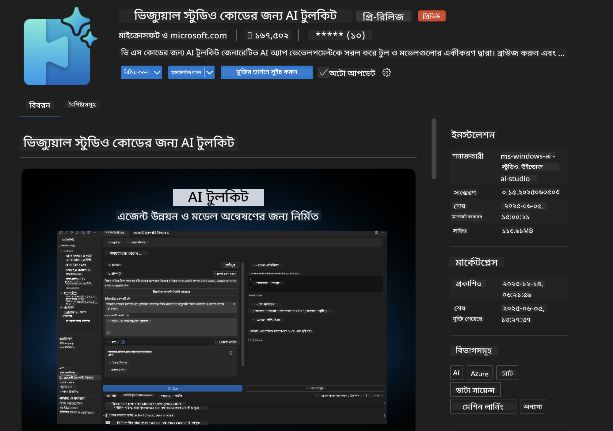
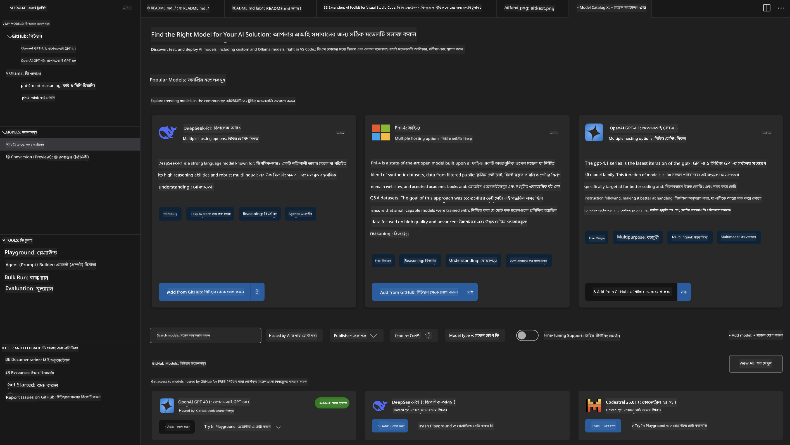
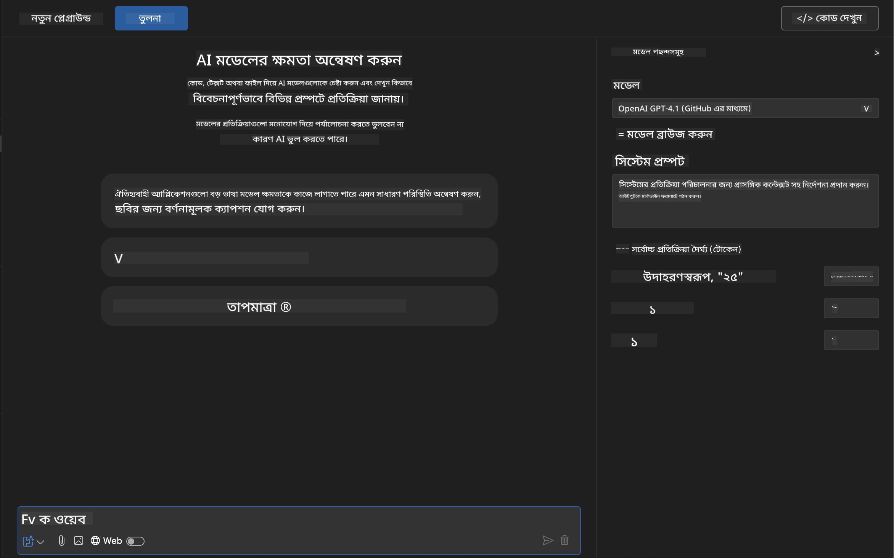
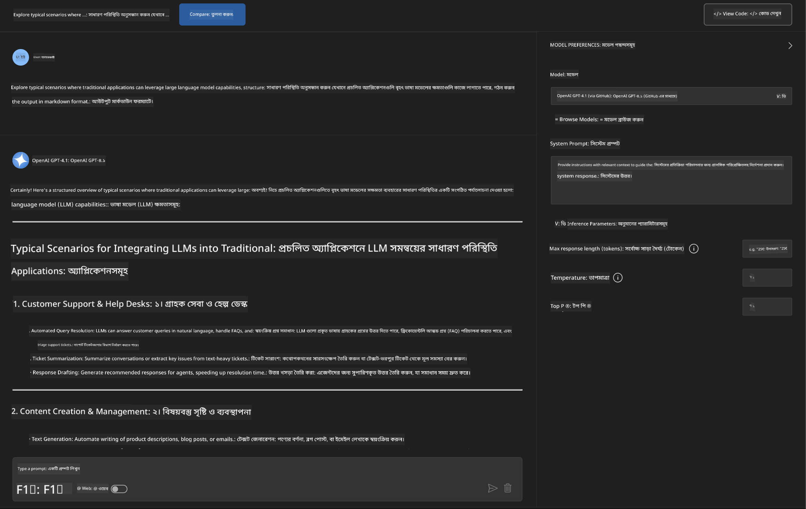
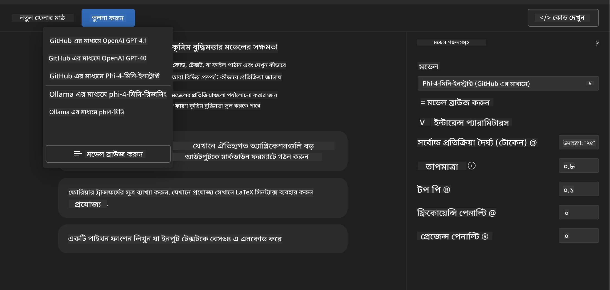
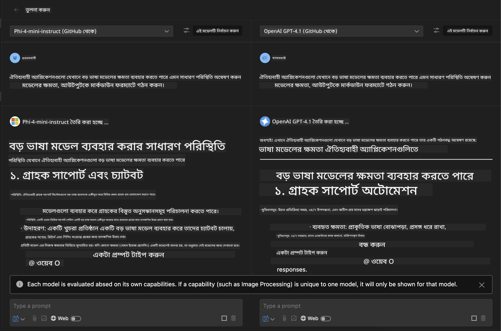
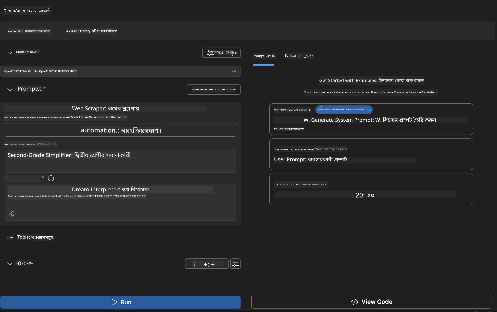
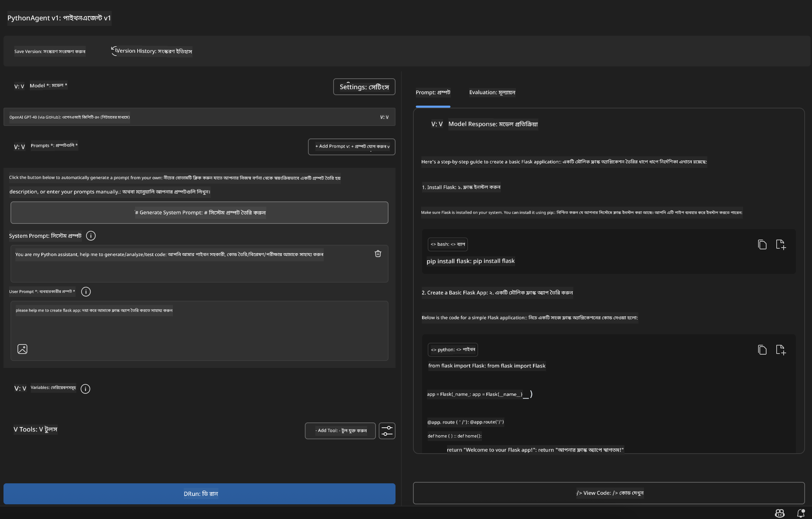

<!--
CO_OP_TRANSLATOR_METADATA:
{
  "original_hash": "2aa9dbc165e104764fa57e8a0d3f1c73",
  "translation_date": "2025-07-14T07:23:12+00:00",
  "source_file": "10-StreamliningAIWorkflowsBuildingAnMCPServerWithAIToolkit/lab1/README.md",
  "language_code": "bn"
}
-->
# 🚀 মডিউল ১: AI Toolkit এর মূল ধারণা

[]()
[]()
[]()

## 📋 শেখার লক্ষ্যসমূহ

এই মডিউল শেষ করার পর আপনি সক্ষম হবেন:
- ✅ Visual Studio Code এর জন্য AI Toolkit ইনস্টল ও কনফিগার করা
- ✅ Model Catalog ব্রাউজ করে বিভিন্ন মডেলের উৎস বুঝতে পারা
- ✅ Playground ব্যবহার করে মডেল পরীক্ষা ও পরীক্ষা-নিরীক্ষা করা
- ✅ Agent Builder ব্যবহার করে কাস্টম AI এজেন্ট তৈরি করা
- ✅ বিভিন্ন প্রোভাইডারের মডেল পারফরম্যান্স তুলনা করা
- ✅ প্রম্পট ইঞ্জিনিয়ারিং এর সেরা পদ্ধতি প্রয়োগ করা

## 🧠 AI Toolkit (AITK) পরিচিতি

**Visual Studio Code এর জন্য AI Toolkit** হলো Microsoft এর প্রধান এক্সটেনশন যা VS Code কে একটি পূর্ণাঙ্গ AI ডেভেলপমেন্ট পরিবেশে রূপান্তরিত করে। এটি AI গবেষণা ও ব্যবহারিক অ্যাপ্লিকেশন ডেভেলপমেন্টের মধ্যে সেতুবন্ধন সৃষ্টি করে, ফলে যেকোন দক্ষতার ডেভেলপারই জেনারেটিভ AI ব্যবহার করতে পারে।

### 🌟 প্রধান বৈশিষ্ট্যসমূহ

| বৈশিষ্ট্য | বর্ণনা | ব্যবহার ক্ষেত্র |
|---------|-------------|----------|
| **🗂️ Model Catalog** | GitHub, ONNX, OpenAI, Anthropic, Google থেকে ১০০+ মডেল অ্যাক্সেস | মডেল আবিষ্কার ও নির্বাচন |
| **🔌 BYOM Support** | নিজের মডেল (লোকাল/রিমোট) ইন্টিগ্রেট করা | কাস্টম মডেল ডিপ্লয়মেন্ট |
| **🎮 Interactive Playground** | রিয়েল-টাইম মডেল টেস্টিং ও চ্যাট ইন্টারফেস | দ্রুত প্রোটোটাইপিং ও পরীক্ষা |
| **📎 Multi-Modal Support** | টেক্সট, ছবি, এবং এটাচমেন্ট হ্যান্ডেল করা | জটিল AI অ্যাপ্লিকেশন |
| **⚡ Batch Processing** | একসাথে একাধিক প্রম্পট চালানো | দক্ষ পরীক্ষা কার্যপ্রণালী |
| **📊 Model Evaluation** | বিল্ট-ইন মেট্রিক্স (F1, প্রাসঙ্গিকতা, সাদৃশ্য, সামঞ্জস্য) | পারফরম্যান্স মূল্যায়ন |

### 🎯 কেন AI Toolkit গুরুত্বপূর্ণ

- **🚀 দ্রুত উন্নয়ন**: আইডিয়া থেকে প্রোটোটাইপ মাত্র কয়েক মিনিটে
- **🔄 একক ওয়ার্কফ্লো**: একাধিক AI প্রোভাইডারের জন্য এক ইন্টারফেস
- **🧪 সহজ পরীক্ষা-নিরীক্ষা**: জটিল সেটআপ ছাড়াই মডেল তুলনা
- **📈 প্রোডাকশন রেডি**: প্রোটোটাইপ থেকে ডিপ্লয়মেন্টে সহজ রূপান্তর

## 🛠️ প্রয়োজনীয়তা ও সেটআপ

### 📦 AI Toolkit এক্সটেনশন ইনস্টল করা

**ধাপ ১: এক্সটেনশন মার্কেটপ্লেসে প্রবেশ করুন**
1. Visual Studio Code খুলুন
2. Extensions ভিউতে যান (`Ctrl+Shift+X` বা `Cmd+Shift+X`)
3. "AI Toolkit" সার্চ করুন

**ধাপ ২: আপনার সংস্করণ নির্বাচন করুন**
- **🟢 রিলিজ**: প্রোডাকশন ব্যবহারের জন্য সুপারিশকৃত
- **🔶 প্রি-রিলিজ**: নতুন ফিচারের আগাম অ্যাক্সেস

**ধাপ ৩: ইনস্টল ও সক্রিয় করুন**



### ✅ যাচাই চেকলিস্ট
- [ ] AI Toolkit আইকন VS Code সাইডবারে দেখা যাচ্ছে
- [ ] এক্সটেনশন সক্রিয় ও চালু আছে
- [ ] আউটপুট প্যানেলে কোনো ইনস্টলেশন ত্রুটি নেই

## 🧪 হাতে কলমে অনুশীলন ১: GitHub মডেল অন্বেষণ

**🎯 লক্ষ্য**: Model Catalog দক্ষতার সাথে ব্যবহার করে প্রথম AI মডেল পরীক্ষা করা

### 📊 ধাপ ১: Model Catalog ব্রাউজ করা

Model Catalog হলো AI ইকোসিস্টেমের প্রবেশদ্বার। এটি একাধিক প্রোভাইডারের মডেল একত্রিত করে, যাতে সহজেই মডেল আবিষ্কার ও তুলনা করা যায়।

**🔍 নেভিগেশন গাইড:**

AI Toolkit সাইডবারে **MODELS - Catalog** ক্লিক করুন



**💡 প্রো টিপ**: আপনার ব্যবহারের জন্য উপযুক্ত নির্দিষ্ট ক্ষমতার মডেল খুঁজুন (যেমন কোড জেনারেশন, সৃজনশীল লেখা, বিশ্লেষণ)।

**⚠️ Note**: GitHub-হোস্টেড মডেলগুলি বিনামূল্যে ব্যবহারযোগ্য, তবে রিকোয়েস্ট ও টোকেনের উপর রেট লিমিট প্রযোজ্য। যদি আপনি GitHub ছাড়া অন্য মডেল (যেমন Azure AI বা অন্যান্য এন্ডপয়েন্টের মডেল) ব্যবহার করতে চান, তাহলে সঠিক API কী বা অথেনটিকেশন দিতে হবে।

### 🚀 ধাপ ২: প্রথম মডেল যোগ ও কনফিগার করা

**মডেল নির্বাচন কৌশল:**
- **GPT-4.1**: জটিল যুক্তি ও বিশ্লেষণের জন্য সেরা
- **Phi-4-mini**: হালকা ও দ্রুত সাড়া দেয় সহজ কাজের জন্য

**🔧 কনফিগারেশন প্রক্রিয়া:**
1. ক্যাটালগ থেকে **OpenAI GPT-4.1** নির্বাচন করুন
2. **Add to My Models** ক্লিক করুন - মডেল ব্যবহারের জন্য নিবন্ধিত হবে
3. **Try in Playground** নির্বাচন করে টেস্টিং পরিবেশ চালু করুন
4. মডেল ইনিশিয়ালাইজেশনের জন্য অপেক্ষা করুন (প্রথমবার সেটআপ কিছুক্ষণ লাগতে পারে)



**⚙️ মডেল প্যারামিটার বোঝা:**
- **Temperature**: সৃজনশীলতা নিয়ন্ত্রণ (0 = নির্ধারিত, 1 = সৃজনশীল)
- **Max Tokens**: সর্বোচ্চ উত্তর দৈর্ঘ্য
- **Top-p**: উত্তর বৈচিত্র্যের জন্য নিউক্লিয়াস স্যাম্পলিং

### 🎯 ধাপ ৩: Playground ইন্টারফেসে দক্ষতা অর্জন

Playground হলো আপনার AI পরীক্ষা-নিরীক্ষার ল্যাব। এর সর্বোচ্চ ব্যবহার করার উপায়:

**🎨 প্রম্পট ইঞ্জিনিয়ারিং সেরা পদ্ধতি:**
1. **নির্দিষ্ট হোন**: স্পষ্ট ও বিস্তারিত নির্দেশনা ভালো ফল দেয়
2. **প্রসঙ্গ দিন**: প্রাসঙ্গিক পটভূমি তথ্য অন্তর্ভুক্ত করুন
3. **উদাহরণ ব্যবহার করুন**: মডেলকে আপনি যা চান তা উদাহরণ দিয়ে দেখান
4. **পুনরাবৃত্তি করুন**: প্রাথমিক ফলাফলের ভিত্তিতে প্রম্পট উন্নত করুন

**🧪 পরীক্ষা করার দৃশ্যপট:**
```markdown
# Example 1: Code Generation
"Write a Python function that calculates the factorial of a number using recursion. Include error handling and docstrings."

# Example 2: Creative Writing
"Write a professional email to a client explaining a project delay, maintaining a positive tone while being transparent about challenges."

# Example 3: Data Analysis
"Analyze this sales data and provide insights: [paste your data]. Focus on trends, anomalies, and actionable recommendations."
```



### 🏆 চ্যালেঞ্জ অনুশীলন: মডেল পারফরম্যান্স তুলনা

**🎯 লক্ষ্য**: একই প্রম্পট ব্যবহার করে বিভিন্ন মডেলের শক্তি বুঝতে তুলনা করা

**📋 নির্দেশনা:**
1. আপনার ওয়ার্কস্পেসে **Phi-4-mini** যোগ করুন
2. GPT-4.1 এবং Phi-4-mini উভয়ের জন্য একই প্রম্পট ব্যবহার করুন



3. উত্তর গুণমান, গতি, ও সঠিকতা তুলনা করুন
4. ফলাফল বিভাগে আপনার পর্যবেক্ষণ নথিভুক্ত করুন



**💡 আবিষ্কারের জন্য মূল দিক:**
- কখন LLM ব্যবহার করবেন, কখন SLM
- খরচ বনাম পারফরম্যান্সের সমঝোতা
- বিভিন্ন মডেলের বিশেষায়িত ক্ষমতা

## 🤖 হাতে কলমে অনুশীলন ২: Agent Builder দিয়ে কাস্টম এজেন্ট তৈরি

**🎯 লক্ষ্য**: নির্দিষ্ট কাজ ও ওয়ার্কফ্লো অনুযায়ী বিশেষায়িত AI এজেন্ট তৈরি করা

### 🏗️ ধাপ ১: Agent Builder বোঝা

Agent Builder হলো AI Toolkit এর সবচেয়ে শক্তিশালী অংশ। এটি আপনাকে বড় ভাষা মডেলের ক্ষমতা, কাস্টম নির্দেশনা, নির্দিষ্ট প্যারামিটার এবং বিশেষায়িত জ্ঞানের সমন্বয়ে উদ্দেশ্যমূলক AI সহকারী তৈরি করতে দেয়।

**🧠 Agent আর্কিটেকচার উপাদান:**
- **Core Model**: ভিত্তি LLM (GPT-4, Groks, Phi ইত্যাদি)
- **System Prompt**: এজেন্টের ব্যক্তিত্ব ও আচরণ নির্ধারণ করে
- **Parameters**: সর্বোত্তম পারফরম্যান্সের জন্য সূক্ষ্ম সেটিংস
- **Tools Integration**: বাহ্যিক API ও MCP সার্ভিসের সাথে সংযোগ
- **Memory**: কথোপকথনের প্রসঙ্গ ও সেশন স্থায়িত্ব



### ⚙️ ধাপ ২: এজেন্ট কনফিগারেশন বিস্তারিত

**🎨 কার্যকর System Prompt তৈরি:**
```markdown
# Template Structure:
## Role Definition
You are a [specific role] with expertise in [domain].

## Capabilities
- List specific abilities
- Define scope of knowledge
- Clarify limitations

## Behavior Guidelines
- Response style (formal, casual, technical)
- Output format preferences
- Error handling approach

## Examples
Provide 2-3 examples of ideal interactions
```

*অবশ্যই, আপনি Generate System Prompt ব্যবহার করে AI এর সাহায্যে প্রম্পট তৈরি ও অপ্টিমাইজ করতে পারেন*

**🔧 প্যারামিটার অপ্টিমাইজেশন:**
| প্যারামিটার | সুপারিশকৃত রেঞ্জ | ব্যবহার ক্ষেত্র |
|-----------|------------------|----------|
| **Temperature** | 0.1-0.3 | প্রযুক্তিগত/তথ্যভিত্তিক উত্তর |
| **Temperature** | 0.7-0.9 | সৃজনশীল/মস্তিষ্ক ঝড় কাজ |
| **Max Tokens** | 500-1000 | সংক্ষিপ্ত উত্তর |
| **Max Tokens** | 2000-4000 | বিস্তারিত ব্যাখ্যা |

### 🐍 ধাপ ৩: ব্যবহারিক অনুশীলন - Python প্রোগ্রামিং এজেন্ট

**🎯 মিশন**: বিশেষায়িত Python কোডিং সহকারী তৈরি করা

**📋 কনফিগারেশন ধাপসমূহ:**

1. **মডেল নির্বাচন**: **Claude 3.5 Sonnet** নির্বাচন করুন (কোডের জন্য চমৎকার)

2. **System Prompt ডিজাইন**:
```markdown
# Python Programming Expert Agent

## Role
You are a senior Python developer with 10+ years of experience. You excel at writing clean, efficient, and well-documented Python code.

## Capabilities
- Write production-ready Python code
- Debug complex issues
- Explain code concepts clearly
- Suggest best practices and optimizations
- Provide complete working examples

## Response Format
- Always include docstrings
- Add inline comments for complex logic
- Suggest testing approaches
- Mention relevant libraries when applicable

## Code Quality Standards
- Follow PEP 8 style guidelines
- Use type hints where appropriate
- Handle exceptions gracefully
- Write readable, maintainable code
```

3. **প্যারামিটার কনফিগারেশন**:
   - Temperature: 0.2 (সঙ্গতিপূর্ণ, নির্ভরযোগ্য কোডের জন্য)
   - Max Tokens: 2000 (বিস্তারিত ব্যাখ্যার জন্য)
   - Top-p: 0.9 (সুষম সৃজনশীলতা)



### 🧪 ধাপ ৪: আপনার Python এজেন্ট পরীক্ষা করা

**পরীক্ষার দৃশ্যপট:**
1. **মৌলিক ফাংশন**: "প্রাইম নাম্বার খুঁজে বের করার ফাংশন তৈরি করুন"
2. **জটিল অ্যালগরিদম**: "ইনসার্ট, ডিলিট, সার্চ মেথডসহ বাইনারি সার্চ ট্রি ইমপ্লিমেন্ট করুন"
3. **বাস্তব সমস্যা**: "রেট লিমিটিং ও রিট্রাই হ্যান্ডেল করতে পারে এমন ওয়েব স্ক্র্যাপার তৈরি করুন"
4. **ডিবাগিং**: "এই কোডটি ঠিক করুন [বাগযুক্ত কোড পেস্ট করুন]"

**🏆 সফলতার মানদণ্ড:**
- ✅ কোড ত্রুটিমুক্ত চলে
- ✅ যথাযথ ডকুমেন্টেশন অন্তর্ভুক্ত
- ✅ Python এর সেরা অনুশীলন অনুসরণ করে
- ✅ স্পষ্ট ব্যাখ্যা প্রদান করে
- ✅ উন্নতির পরামর্শ দেয়

## 🎓 মডিউল ১ সারসংক্ষেপ ও পরবর্তী ধাপ

### 📊 জ্ঞান যাচাই

আপনার বোঝাপড়া পরীক্ষা করুন:
- [ ] ক্যাটালগের মডেলগুলোর মধ্যে পার্থক্য ব্যাখ্যা করতে পারেন?
- [ ] সফলভাবে কাস্টম এজেন্ট তৈরি ও পরীক্ষা করেছেন?
- [ ] বিভিন্ন ব্যবহারের জন্য প্যারামিটার অপ্টিমাইজেশন বুঝতে পারেন?
- [ ] কার্যকর System Prompt ডিজাইন করতে পারেন?

### 📚 অতিরিক্ত সম্পদ

- **AI Toolkit ডকুমেন্টেশন**: [Official Microsoft Docs](https://github.com/microsoft/vscode-ai-toolkit)
- **Prompt Engineering গাইড**: [Best Practices](https://platform.openai.com/docs/guides/prompt-engineering)
- **AI Toolkit এর মডেলসমূহ**: [Models in Development](https://github.com/microsoft/vscode-ai-toolkit/blob/main/doc/models.md)

**🎉 অভিনন্দন!** আপনি AI Toolkit এর মূল ধারণা আয়ত্ত করেছেন এবং আরও উন্নত AI অ্যাপ্লিকেশন তৈরি করতে প্রস্তুত!

### 🔜 পরবর্তী মডিউলে যান

আরও উন্নত ক্ষমতার জন্য প্রস্তুত? যান **[মডিউল ২: MCP with AI Toolkit Fundamentals](../lab2/README.md)** যেখানে আপনি শিখবেন:
- Model Context Protocol (MCP) ব্যবহার করে আপনার এজেন্টকে বাহ্যিক টুলের সাথে সংযুক্ত করা
- Playwright দিয়ে ব্রাউজার অটোমেশন এজেন্ট তৈরি করা
- MCP সার্ভারকে AI Toolkit এজেন্টের সাথে ইন্টিগ্রেট করা
- বাহ্যিক ডেটা ও ক্ষমতা দিয়ে আপনার এজেন্টকে সুপারচার্জ করা

**অস্বীকৃতি**:  
এই নথিটি AI অনুবাদ সেবা [Co-op Translator](https://github.com/Azure/co-op-translator) ব্যবহার করে অনূদিত হয়েছে। আমরা যথাসাধ্য সঠিকতার চেষ্টা করি, তবে স্বয়ংক্রিয় অনুবাদে ত্রুটি বা অসঙ্গতি থাকতে পারে। মূল নথিটি তার নিজস্ব ভাষায়ই কর্তৃত্বপূর্ণ উৎস হিসেবে বিবেচিত হওয়া উচিত। গুরুত্বপূর্ণ তথ্যের জন্য পেশাদার মানব অনুবাদ গ্রহণ করার পরামর্শ দেওয়া হয়। এই অনুবাদের ব্যবহারে সৃষ্ট কোনো ভুল বোঝাবুঝি বা ভুল ব্যাখ্যার জন্য আমরা দায়ী নই।