<!--
CO_OP_TRANSLATOR_METADATA:
{
  "original_hash": "a22b7dd11cd7690f99f9195877cafdc3",
  "translation_date": "2025-07-14T07:46:24+00:00",
  "source_file": "10-StreamliningAIWorkflowsBuildingAnMCPServerWithAIToolkit/lab2/README.md",
  "language_code": "bn"
}
-->
# 🌐 মডিউল ২: AI Toolkit এর সাথে MCP এর মৌলিক বিষয়সমূহ

[]()
[]()
[]()

## 📋 শেখার উদ্দেশ্যসমূহ

এই মডিউল শেষ করার পর আপনি সক্ষম হবেন:
- ✅ Model Context Protocol (MCP) এর আর্কিটেকচার এবং সুবিধাগুলো বুঝতে
- ✅ Microsoft এর MCP সার্ভার ইকোসিস্টেম অন্বেষণ করতে
- ✅ MCP সার্ভারগুলো AI Toolkit Agent Builder এর সাথে ইন্টিগ্রেট করতে
- ✅ Playwright MCP ব্যবহার করে কার্যকরী ব্রাউজার অটোমেশন এজেন্ট তৈরি করতে
- ✅ আপনার এজেন্টের মধ্যে MCP টুলস কনফিগার ও পরীক্ষা করতে
- ✅ MCP-চালিত এজেন্টগুলো প্রোডাকশনে রপ্তানি ও ডিপ্লয় করতে

## 🎯 মডিউল ১ এর উপর ভিত্তি করে

মডিউল ১ এ আমরা AI Toolkit এর বেসিক শিখেছি এবং আমাদের প্রথম Python Agent তৈরি করেছি। এখন আমরা আপনার এজেন্টগুলোকে **সুপারচার্জ** করব, বাইরের টুলস ও সার্ভিসের সাথে যুক্ত করে, সেই বিপ্লবী **Model Context Protocol (MCP)** এর মাধ্যমে।

এটাকে ভাবুন, একটি সাধারণ ক্যালকুলেটর থেকে পুরো কম্পিউটারে আপগ্রেড করার মতো — আপনার AI এজেন্টগুলো সক্ষম হবে:
- 🌐 ওয়েবসাইট ব্রাউজ এবং ইন্টারঅ্যাক্ট করতে
- 📁 ফাইল অ্যাক্সেস ও ম্যানিপুলেট করতে
- 🔧 এন্টারপ্রাইজ সিস্টেমের সাথে ইন্টিগ্রেট করতে
- 📊 API থেকে রিয়েল-টাইম ডেটা প্রক্রিয়াজাত করতে

## 🧠 Model Context Protocol (MCP) বোঝা

### 🔍 MCP কী?

Model Context Protocol (MCP) হলো AI অ্যাপ্লিকেশনগুলোর জন্য **"USB-C"** — একটি বিপ্লবী ওপেন স্ট্যান্ডার্ড যা বড় ভাষার মডেলগুলোকে (LLMs) বাইরের টুলস, ডেটা সোর্স এবং সার্ভিসের সাথে সংযুক্ত করে। যেমন USB-C একক ইউনিভার্সাল কানেক্টর দিয়ে ক্যাবল জটিলতা দূর করেছে, MCP একইভাবে AI ইন্টিগ্রেশনকে সহজ করে একটি স্ট্যান্ডার্ড প্রোটোকল দিয়ে।

### 🎯 MCP যে সমস্যা সমাধান করে

**MCP এর আগে:**
- 🔧 প্রতিটি টুলের জন্য আলাদা কাস্টম ইন্টিগ্রেশন
- 🔄 প্রোপাইটারি সলিউশনের কারণে ভেন্ডর লক-ইন
- 🔒 এলোমেলো সংযোগ থেকে সিকিউরিটি ঝুঁকি
- ⏱️ বেসিক ইন্টিগ্রেশনের জন্য মাসখানেক ডেভেলপমেন্ট

**MCP এর সাথে:**
- ⚡ প্লাগ-অ্যান্ড-প্লে টুল ইন্টিগ্রেশন
- 🔄 ভেন্ডর-নিরপেক্ষ আর্কিটেকচার
- 🛡️ বিল্ট-ইন সিকিউরিটি বেস্ট প্র্যাকটিস
- 🚀 নতুন ফিচার যোগ করতে কয়েক মিনিট সময়

### 🏗️ MCP আর্কিটেকচার বিস্তারিত

MCP একটি **ক্লায়েন্ট-সার্ভার আর্কিটেকচার** অনুসরণ করে যা একটি নিরাপদ, স্কেলেবল ইকোসিস্টেম তৈরি করে:

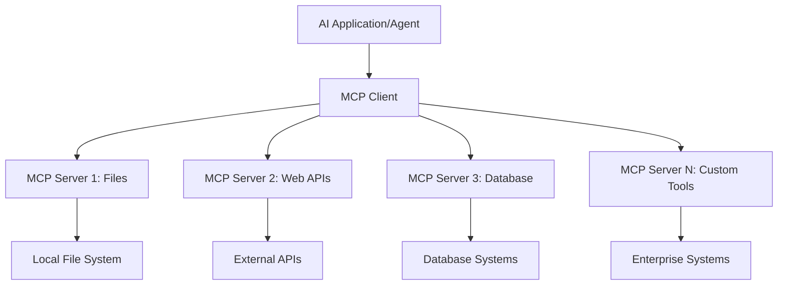

**🔧 মূল উপাদানসমূহ:**

| উপাদান | ভূমিকা | উদাহরণ |
|-----------|------|----------|
| **MCP Hosts** | MCP সার্ভিস ব্যবহারকারী অ্যাপ্লিকেশন | Claude Desktop, VS Code, AI Toolkit |
| **MCP Clients** | প্রোটোকল হ্যান্ডলার (সার্ভারের সাথে ১:১) | হোস্ট অ্যাপ্লিকেশনের অংশ |
| **MCP Servers** | স্ট্যান্ডার্ড প্রোটোকলের মাধ্যমে ক্ষমতা প্রদান | Playwright, Files, Azure, GitHub |
| **Transport Layer** | যোগাযোগের মাধ্যম | stdio, HTTP, WebSockets |

## 🏢 Microsoft এর MCP সার্ভার ইকোসিস্টেম

Microsoft MCP ইকোসিস্টেমের নেতৃত্ব দেয় একটি বিস্তৃত এন্টারপ্রাইজ-গ্রেড সার্ভার স্যুটের মাধ্যমে, যা বাস্তব ব্যবসায়িক চাহিদা পূরণ করে।

### 🌟 Microsoft MCP সার্ভার হাইলাইটস

#### ১. ☁️ Azure MCP Server
**🔗 রেপোজিটরি**: [azure/azure-mcp](https://github.com/azure/azure-mcp)  
**🎯 উদ্দেশ্য**: AI ইন্টিগ্রেশনসহ ব্যাপক Azure রিসোর্স ম্যানেজমেন্ট

**✨ প্রধান বৈশিষ্ট্য:**
- ডিক্লারেটিভ ইনফ্রাস্ট্রাকচার প্রোভিশনিং
- রিয়েল-টাইম রিসোর্স মনিটরিং
- খরচ অপ্টিমাইজেশন সুপারিশ
- সিকিউরিটি কমপ্লায়েন্স চেকিং

**🚀 ব্যবহারের ক্ষেত্র:**
- AI সহ ইনফ্রাস্ট্রাকচার-অ্যাস-কোড
- স্বয়ংক্রিয় রিসোর্স স্কেলিং
- ক্লাউড খরচ অপ্টিমাইজেশন
- DevOps ওয়ার্কফ্লো অটোমেশন

#### ২. 📊 Microsoft Dataverse MCP
**📚 ডকুমেন্টেশন**: [Microsoft Dataverse Integration](https://go.microsoft.com/fwlink/?linkid=2320176)  
**🎯 উদ্দেশ্য**: ব্যবসায়িক ডেটার জন্য ন্যাচারাল ল্যাঙ্গুয়েজ ইন্টারফেস

**✨ প্রধান বৈশিষ্ট্য:**
- ন্যাচারাল ল্যাঙ্গুয়েজ ডেটাবেস কোয়েরি
- ব্যবসায়িক প্রসঙ্গ বোঝাপড়া
- কাস্টম প্রম্পট টেমপ্লেট
- এন্টারপ্রাইজ ডেটা গভর্নেন্স

**🚀 ব্যবহারের ক্ষেত্র:**
- ব্যবসায়িক বুদ্ধিমত্তা রিপোর্টিং
- গ্রাহক ডেটা বিশ্লেষণ
- সেলস পাইপলাইন ইনসাইট
- কমপ্লায়েন্স ডেটা কোয়েরি

#### ৩. 🌐 Playwright MCP Server
**🔗 রেপোজিটরি**: [microsoft/playwright-mcp](https://github.com/microsoft/playwright-mcp)  
**🎯 উদ্দেশ্য**: ব্রাউজার অটোমেশন ও ওয়েব ইন্টারঅ্যাকশন ক্ষমতা

**✨ প্রধান বৈশিষ্ট্য:**
- ক্রস-ব্রাউজার অটোমেশন (Chrome, Firefox, Safari)
- বুদ্ধিমান এলিমেন্ট ডিটেকশন
- স্ক্রিনশট ও PDF জেনারেশন
- নেটওয়ার্ক ট্রাফিক মনিটরিং

**🚀 ব্যবহারের ক্ষেত্র:**
- স্বয়ংক্রিয় টেস্টিং ওয়ার্কফ্লো
- ওয়েব স্ক্র্যাপিং ও ডেটা এক্সট্রাকশন
- UI/UX মনিটরিং
- প্রতিযোগিতামূলক বিশ্লেষণ অটোমেশন

#### ৪. 📁 Files MCP Server
**🔗 রেপোজিটরি**: [microsoft/files-mcp-server](https://github.com/microsoft/files-mcp-server)  
**🎯 উদ্দেশ্য**: বুদ্ধিমান ফাইল সিস্টেম অপারেশন

**✨ প্রধান বৈশিষ্ট্য:**
- ডিক্লারেটিভ ফাইল ম্যানেজমেন্ট
- কনটেন্ট সিঙ্ক্রোনাইজেশন
- ভার্সন কন্ট্রোল ইন্টিগ্রেশন
- মেটাডেটা এক্সট্রাকশন

**🚀 ব্যবহারের ক্ষেত্র:**
- ডকুমেন্টেশন ম্যানেজমেন্ট
- কোড রিপোজিটরি অর্গানাইজেশন
- কনটেন্ট পাবলিশিং ওয়ার্কফ্লো
- ডেটা পাইপলাইন ফাইল হ্যান্ডলিং

#### ৫. 📝 MarkItDown MCP Server
**🔗 রেপোজিটরি**: [microsoft/markitdown](https://github.com/microsoft/markitdown)  
**🎯 উদ্দেশ্য**: উন্নত Markdown প্রসেসিং ও ম্যানিপুলেশন

**✨ প্রধান বৈশিষ্ট্য:**
- সমৃদ্ধ Markdown পার্সিং
- ফরম্যাট কনভার্শন (MD ↔ HTML ↔ PDF)
- কনটেন্ট স্ট্রাকচার বিশ্লেষণ
- টেমপ্লেট প্রসেসিং

**🚀 ব্যবহারের ক্ষেত্র:**
- টেকনিক্যাল ডকুমেন্টেশন ওয়ার্কফ্লো
- কনটেন্ট ম্যানেজমেন্ট সিস্টেম
- রিপোর্ট জেনারেশন
- নলেজ বেস অটোমেশন

#### ৬. 📈 Clarity MCP Server
**📦 প্যাকেজ**: [@microsoft/clarity-mcp-server](https://www.npmjs.com/package/@microsoft/clarity-mcp-server)  
**🎯 উদ্দেশ্য**: ওয়েব অ্যানালিটিক্স ও ব্যবহারকারীর আচরণ বিশ্লেষণ

**✨ প্রধান বৈশিষ্ট্য:**
- হিটম্যাপ ডেটা বিশ্লেষণ
- ব্যবহারকারী সেশন রেকর্ডিং
- পারফরম্যান্স মেট্রিক্স
- কনভার্শন ফানেল বিশ্লেষণ

**🚀 ব্যবহারের ক্ষেত্র:**
- ওয়েবসাইট অপ্টিমাইজেশন
- ব্যবহারকারীর অভিজ্ঞতা গবেষণা
- A/B টেস্টিং বিশ্লেষণ
- ব্যবসায়িক বুদ্ধিমত্তা ড্যাশবোর্ড

### 🌍 কমিউনিটি ইকোসিস্টেম

Microsoft এর সার্ভার ছাড়াও MCP ইকোসিস্টেমে রয়েছে:
- **🐙 GitHub MCP**: রিপোজিটরি ম্যানেজমেন্ট ও কোড বিশ্লেষণ
- **🗄️ ডেটাবেস MCPs**: PostgreSQL, MySQL, MongoDB ইন্টিগ্রেশন
- **☁️ ক্লাউড প্রোভাইডার MCPs**: AWS, GCP, Digital Ocean টুলস
- **📧 কমিউনিকেশন MCPs**: Slack, Teams, Email ইন্টিগ্রেশন

## 🛠️ হাতে কলমে ল্যাব: ব্রাউজার অটোমেশন এজেন্ট তৈরি

**🎯 প্রকল্পের লক্ষ্য**: Playwright MCP সার্ভার ব্যবহার করে একটি বুদ্ধিমান ব্রাউজার অটোমেশন এজেন্ট তৈরি করা, যা ওয়েবসাইট ব্রাউজ করতে, তথ্য সংগ্রহ করতে এবং জটিল ওয়েব ইন্টারঅ্যাকশন সম্পাদন করতে পারে।

### 🚀 ধাপ ১: এজেন্টের ভিত্তি স্থাপন

#### ধাপ ১: আপনার এজেন্ট ইনিশিয়ালাইজ করুন
1. **AI Toolkit Agent Builder খুলুন**
2. **নতুন এজেন্ট তৈরি করুন** নিম্নলিখিত কনফিগারেশন দিয়ে:
   - **নাম**: `BrowserAgent`
   - **মডেল**: GPT-4o নির্বাচন করুন

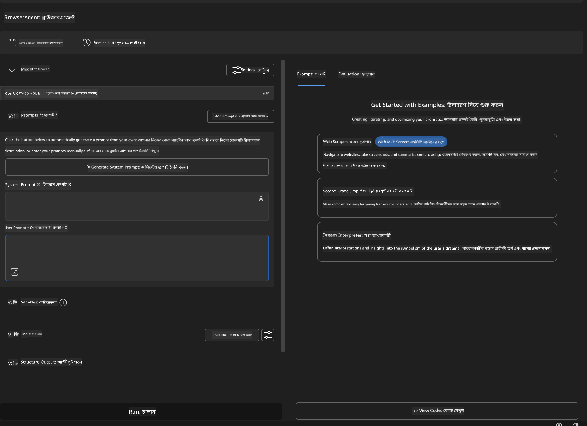

### 🔧 ধাপ ২: MCP ইন্টিগ্রেশন ওয়ার্কফ্লো

#### ধাপ ৩: MCP সার্ভার ইন্টিগ্রেশন যোগ করুন
1. Agent Builder এর **Tools সেকশনে যান**
2. **"Add Tool" ক্লিক করুন** ইন্টিগ্রেশন মেনু খুলতে
3. **"MCP Server" নির্বাচন করুন** উপলব্ধ অপশন থেকে

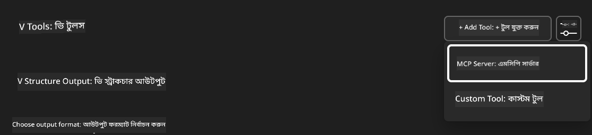

**🔍 টুল টাইপগুলো বোঝা:**
- **Built-in Tools**: প্রি-কনফিগার্ড AI Toolkit ফাংশনসমূহ
- **MCP Servers**: বাইরের সার্ভিস ইন্টিগ্রেশন
- **Custom APIs**: আপনার নিজস্ব সার্ভিস এন্ডপয়েন্ট
- **Function Calling**: সরাসরি মডেল ফাংশন অ্যাক্সেস

#### ধাপ ৪: MCP সার্ভার নির্বাচন
1. **"MCP Server" অপশন নির্বাচন করুন** এগিয়ে যাওয়ার জন্য  
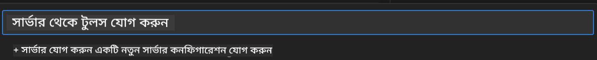

2. **MCP ক্যাটালগ ব্রাউজ করুন** উপলব্ধ ইন্টিগ্রেশন দেখতে  
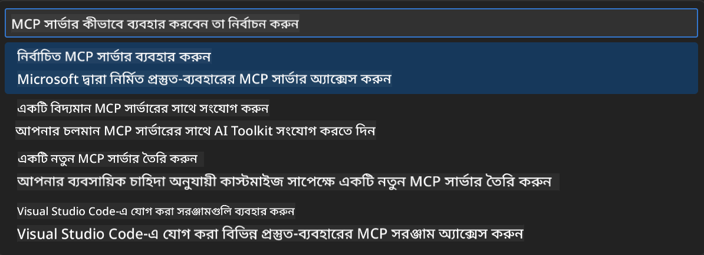

### 🎮 ধাপ ৩: Playwright MCP কনফিগারেশন

#### ধাপ ৫: Playwright নির্বাচন ও কনফিগার করুন
1. **"Use Featured MCP Servers" ক্লিক করুন** Microsoft এর যাচাইকৃত সার্ভারগুলো দেখতে
2. **"Playwright" নির্বাচন করুন** ফিচার্ড তালিকা থেকে
3. **ডিফল্ট MCP ID গ্রহণ করুন** অথবা পরিবেশ অনুযায়ী কাস্টমাইজ করুন

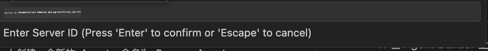

#### ধাপ ৬: Playwright ক্ষমতাসমূহ সক্রিয় করুন
**🔑 গুরুত্বপূর্ণ ধাপ**: সর্বোচ্চ কার্যকারিতার জন্য **সব** উপলব্ধ Playwright মেথড নির্বাচন করুন

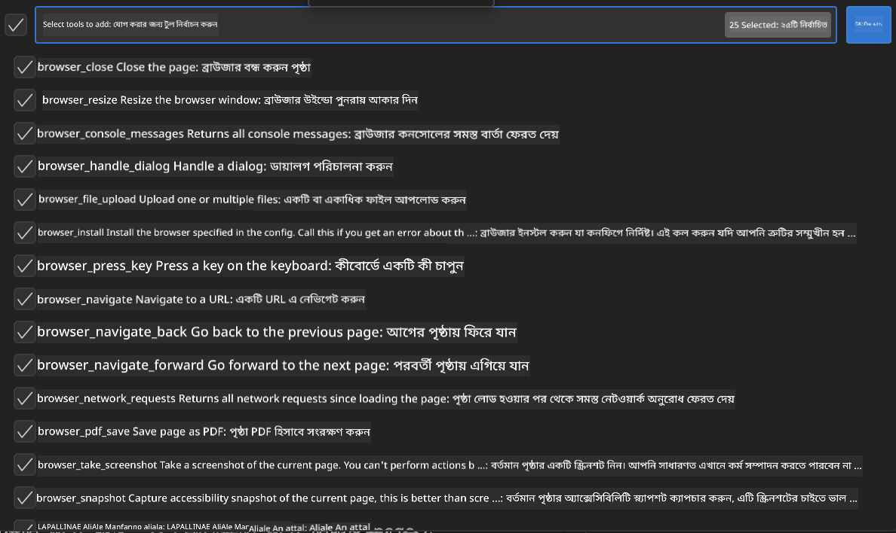

**🛠️ অপরিহার্য Playwright টুলস:**
- **নেভিগেশন**: `goto`, `goBack`, `goForward`, `reload`
- **ইন্টারঅ্যাকশন**: `click`, `fill`, `press`, `hover`, `drag`
- **এক্সট্রাকশন**: `textContent`, `innerHTML`, `getAttribute`
- **ভ্যালিডেশন**: `isVisible`, `isEnabled`, `waitForSelector`
- **ক্যাপচার**: `screenshot`, `pdf`, `video`
- **নেটওয়ার্ক**: `setExtraHTTPHeaders`, `route`, `waitForResponse`

#### ধাপ ৭: ইন্টিগ্রেশন সফলতা যাচাই করুন
**✅ সফলতার সূচক:**
- Agent Builder ইন্টারফেসে সব টুলস প্রদর্শিত হচ্ছে
- ইন্টিগ্রেশন প্যানেলে কোনো এরর মেসেজ নেই
- Playwright সার্ভারের স্ট্যাটাস "Connected" দেখাচ্ছে

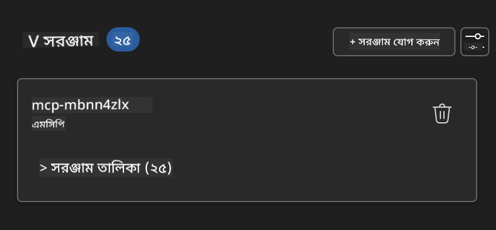

**🔧 সাধারণ সমস্যা সমাধান:**
- **কানেকশন ব্যর্থ**: ইন্টারনেট সংযোগ ও ফায়ারওয়াল সেটিংস চেক করুন
- **টুলস অনুপস্থিত**: নিশ্চিত করুন সব ক্ষমতা নির্বাচন করা হয়েছে
- **পারমিশন এরর**: VS Code এর প্রয়োজনীয় সিস্টেম পারমিশন যাচাই করুন

### 🎯 ধাপ ৪: উন্নত প্রম্পট ইঞ্জিনিয়ারিং

#### ধাপ ৮: বুদ্ধিমান সিস্টেম প্রম্পট ডিজাইন করুন
Playwright এর পূর্ণ ক্ষমতা কাজে লাগানোর জন্য জটিল প্রম্পট তৈরি করুন:

```markdown
# Web Automation Expert System Prompt

## Core Identity
You are an advanced web automation specialist with deep expertise in browser automation, web scraping, and user experience analysis. You have access to Playwright tools for comprehensive browser control.

## Capabilities & Approach
### Navigation Strategy
- Always start with screenshots to understand page layout
- Use semantic selectors (text content, labels) when possible
- Implement wait strategies for dynamic content
- Handle single-page applications (SPAs) effectively

### Error Handling
- Retry failed operations with exponential backoff
- Provide clear error descriptions and solutions
- Suggest alternative approaches when primary methods fail
- Always capture diagnostic screenshots on errors

### Data Extraction
- Extract structured data in JSON format when possible
- Provide confidence scores for extracted information
- Validate data completeness and accuracy
- Handle pagination and infinite scroll scenarios

### Reporting
- Include step-by-step execution logs
- Provide before/after screenshots for verification
- Suggest optimizations and alternative approaches
- Document any limitations or edge cases encountered

## Ethical Guidelines
- Respect robots.txt and rate limiting
- Avoid overloading target servers
- Only extract publicly available information
- Follow website terms of service
```

#### ধাপ ৯: ডায়নামিক ইউজার প্রম্পট তৈরি করুন
বিভিন্ন ক্ষমতা প্রদর্শনের জন্য প্রম্পট ডিজাইন করুন:

**🌐 ওয়েব বিশ্লেষণের উদাহরণ:**
```markdown
Navigate to github.com/kinfey and provide a comprehensive analysis including:
1. Repository structure and organization
2. Recent activity and contribution patterns  
3. Documentation quality assessment
4. Technology stack identification
5. Community engagement metrics
6. Notable projects and their purposes

Include screenshots at key steps and provide actionable insights.
```

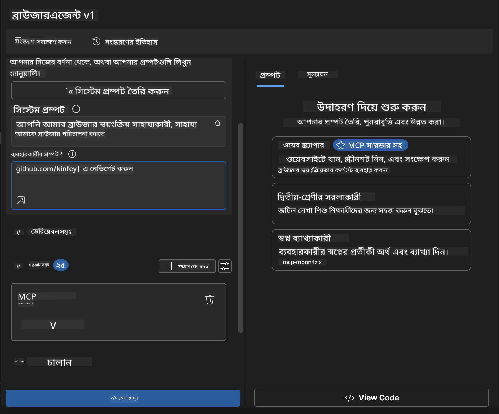

### 🚀 ধাপ ৫: কার্যকরীতা ও পরীক্ষা

#### ধাপ ১০: আপনার প্রথম অটোমেশন চালান
1. **"Run" ক্লিক করুন** অটোমেশন সিকোয়েন্স শুরু করতে
2. **রিয়েল-টাইম এক্সিকিউশন মনিটর করুন**:
   - Chrome ব্রাউজার স্বয়ংক্রিয়ভাবে চালু হবে
   - এজেন্ট লক্ষ্য ওয়েবসাইটে নেভিগেট করবে
   - প্রতিটি প্রধান ধাপের স্ক্রিনশট নেওয়া হবে
   - বিশ্লেষণের ফলাফল রিয়েল-টাইমে স্ট্রিম হবে

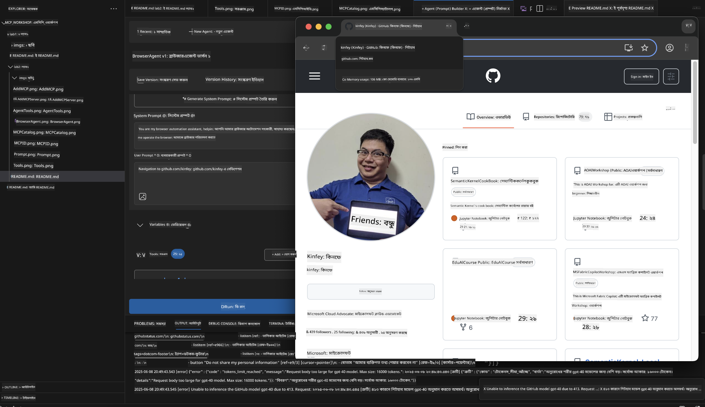

#### ধাপ ১১: ফলাফল ও অন্তর্দৃষ্টি বিশ্লেষণ করুন
Agent Builder এর ইন্টারফেসে বিস্তারিত বিশ্লেষণ পর্যালোচনা করুন:

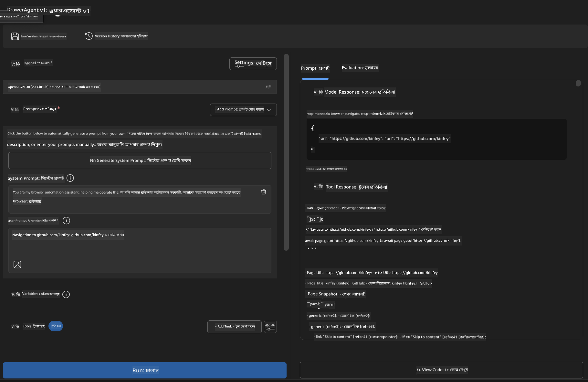

### 🌟 ধাপ ৬: উন্নত ক্ষমতা ও ডিপ্লয়মেন্ট

#### ধাপ ১২: রপ্তানি ও প্রোডাকশন ডিপ্লয়মেন্ট
Agent Builder বিভিন্ন ডিপ্লয়মেন্ট অপশন সমর্থন করে:

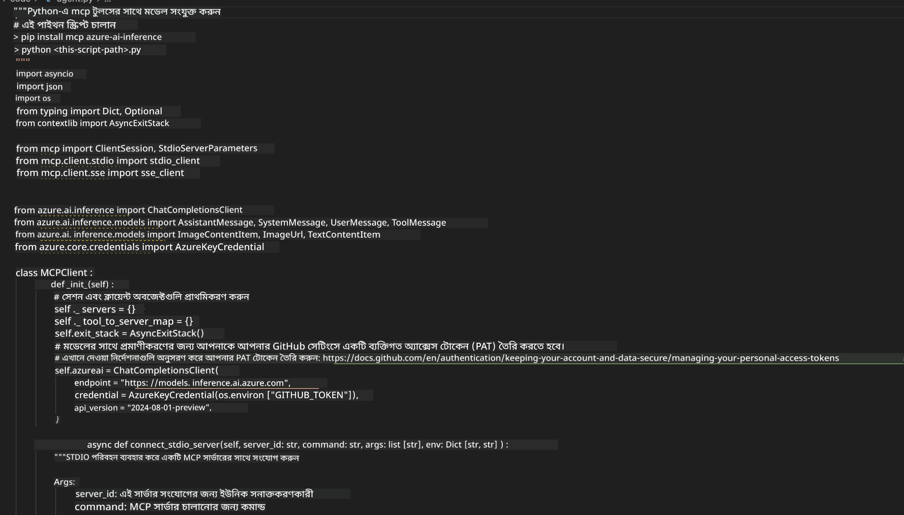

## 🎓 মডিউল ২ সারাংশ ও পরবর্তী ধাপ

### 🏆 অর্জন সম্পন্ন: MCP ইন্টিগ্রেশন মাস্টার

**✅ দক্ষতা অর্জিত:**
- [ ] MCP আর্কিটেকচার ও সুবিধা বোঝা
- [ ] Microsoft এর MCP সার্ভার ইকোসিস্টেমে নেভিগেট করা
- [ ] Playwright MCP AI Toolkit এর সাথে ইন্টিগ্রেট করা
- [ ] উন্নত ব্রাউজার অটোমেশন এজেন্ট তৈরি করা
- [ ] ওয়েব অটোমেশনের জন্য উন্নত প্রম্পট ইঞ্জিনিয়ারিং
- শূন্য থেকে একটি Weather MCP সার্ভার তৈরি করুন

**অস্বীকৃতি**:  
এই নথিটি AI অনুবাদ সেবা [Co-op Translator](https://github.com/Azure/co-op-translator) ব্যবহার করে অনূদিত হয়েছে। আমরা যথাসাধ্য সঠিকতার চেষ্টা করি, তবে স্বয়ংক্রিয় অনুবাদে ত্রুটি বা অসঙ্গতি থাকতে পারে। মূল নথিটি তার নিজস্ব ভাষায়ই কর্তৃত্বপূর্ণ উৎস হিসেবে বিবেচিত হওয়া উচিত। গুরুত্বপূর্ণ তথ্যের জন্য পেশাদার মানব অনুবাদ গ্রহণ করার পরামর্শ দেওয়া হয়। এই অনুবাদের ব্যবহারে সৃষ্ট কোনো ভুল বোঝাবুঝি বা ভুল ব্যাখ্যার জন্য আমরা দায়ী নই।