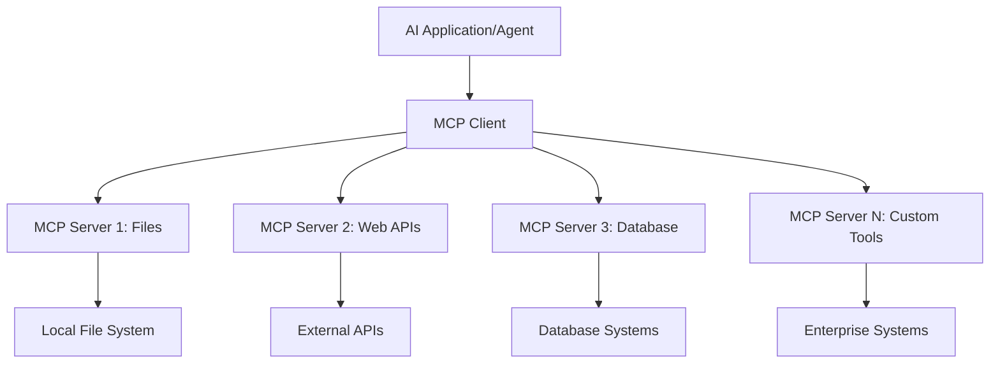

<!--
CO_OP_TRANSLATOR_METADATA:
{
  "original_hash": "a22b7dd11cd7690f99f9195877cafdc3",
  "translation_date": "2025-06-10T05:42:46+00:00",
  "source_file": "10-StreamliningAIWorkflowsBuildingAnMCPServerWithAIToolkit/lab2/README.md",
  "language_code": "bn"
}
-->
# 🌐 মডিউল ২: MCP এবং AI Toolkit এর মূল বিষয়াবলী

[]()
[]()
[]()

## 📋 শেখার উদ্দেশ্যসমূহ

এই মডিউল শেষ করার পর আপনি সক্ষম হবেন:
- ✅ Model Context Protocol (MCP) আর্কিটেকচার এবং এর সুবিধাসমূহ বোঝা
- ✅ Microsoft এর MCP সার্ভার ইকোসিস্টেম অন্বেষণ করা
- ✅ MCP সার্ভারগুলোকে AI Toolkit Agent Builder এর সাথে সংযুক্ত করা
- ✅ Playwright MCP ব্যবহার করে কার্যকর ব্রাউজার অটোমেশন এজেন্ট তৈরি করা
- ✅ আপনার এজেন্টের মধ্যে MCP টুলস কনফিগার এবং পরীক্ষা করা
- ✅ MCP-চালিত এজেন্ট এক্সপোর্ট এবং প্রোডাকশনে স্থাপন করা

## 🎯 মডিউল ১ এর উপর ভিত্তি করে নির্মাণ

মডিউল ১-এ আমরা AI Toolkit এর মৌলিক বিষয়গুলো আয়ত্ত করেছি এবং প্রথম Python Agent তৈরি করেছি। এখন আমরা আপনার এজেন্টগুলোকে **অধিক ক্ষমতাসম্পন্ন** করব বাইরের টুলস ও সার্ভিসের সাথে সংযুক্ত করে, যা সম্ভব হচ্ছে বিপ্লবাত্মক **Model Context Protocol (MCP)** এর মাধ্যমে।

এটাকে ভাবুন একটি সাধারণ ক্যালকুলেটর থেকে পূর্ণাঙ্গ কম্পিউটারে আপগ্রেড করার মতো — আপনার AI এজেন্টগুলো সক্ষম হবে:
- 🌐 ওয়েবসাইট ব্রাউজ এবং ইন্টারঅ্যাক্ট করার
- 📁 ফাইল অ্যাক্সেস এবং ম্যানিপুলেট করার
- 🔧 এন্টারপ্রাইজ সিস্টেমের সাথে ইন্টিগ্রেট করার
- 📊 API থেকে রিয়েল-টাইম ডেটা প্রক্রিয়া করার

## 🧠 Model Context Protocol (MCP) বোঝা

### 🔍 MCP কি?

Model Context Protocol (MCP) হলো AI অ্যাপ্লিকেশনগুলোর জন্য **"USB-C"** — একটি বিপ্লবাত্মক ওপেন স্ট্যান্ডার্ড যা বড় ভাষা মডেলগুলোকে (LLMs) বাইরের টুল, ডেটা সোর্স এবং সার্ভিসের সাথে সংযুক্ত করে। যেমন USB-C একক সংযোগকারী দিয়ে ক্যাবল জটিলতা দূর করেছে, MCP একইভাবে AI ইন্টিগ্রেশনের জটিলতা দূর করে একক স্ট্যান্ডার্ড প্রোটোকল দিয়ে।

### 🎯 MCP কোন সমস্যা সমাধান করে

**MCP এর আগে:**
- 🔧 প্রতিটি টুলের জন্য আলাদা কাস্টম ইন্টিগ্রেশন
- 🔄 ভেন্ডর লক-ইন এবং প্রাইভেট সলিউশন
- 🔒 নিরাপত্তার দুর্বলতা এলোমেলো সংযোগের কারণে
- ⏱️ মৌলিক ইন্টিগ্রেশনে মাসখানেক সময় লাগা

**MCP এর সাথে:**
- ⚡ প্লাগ-অ্যান্ড-প্লে টুল ইন্টিগ্রেশন
- 🔄 ভেন্ডর-নিরপেক্ষ আর্কিটেকচার
- 🛡️ বিল্ট-ইন সিকিউরিটি বেস্ট প্র্যাকটিস
- 🚀 কয়েক মিনিটে নতুন ক্ষমতা যোগ করা

### 🏗️ MCP আর্কিটেকচারের গভীর দৃষ্টি

MCP একটি **ক্লায়েন্ট-সার্ভার আর্কিটেকচার** অনুসরণ করে যা একটি নিরাপদ, স্কেলেবল ইকোসিস্টেম তৈরি করে:



**🔧 মূল উপাদানসমূহ:**

| উপাদান | ভূমিকা | উদাহরণ |
|-----------|------|----------|
| **MCP Hosts** | MCP সার্ভিস ব্যবহারকারী অ্যাপ্লিকেশন | Claude Desktop, VS Code, AI Toolkit |
| **MCP Clients** | প্রোটোকল হ্যান্ডলার (সার্ভারের সাথে ১:১) | হোস্ট অ্যাপ্লিকেশনে অন্তর্ভুক্ত |
| **MCP Servers** | স্ট্যান্ডার্ড প্রোটোকলের মাধ্যমে ক্ষমতা প্রকাশ করে | Playwright, Files, Azure, GitHub |
| **Transport Layer** | যোগাযোগের পদ্ধতি | stdio, HTTP, WebSockets |

## 🏢 Microsoft এর MCP সার্ভার ইকোসিস্টেম

Microsoft MCP ইকোসিস্টেমের নেতৃত্ব দেয় একটি বিস্তৃত এন্টারপ্রাইজ-গ্রেড সার্ভার সেট নিয়ে যা বাস্তব ব্যবসায়িক চাহিদা পূরণ করে।

### 🌟 Microsoft MCP সার্ভার হাইলাইটস

#### ১. ☁️ Azure MCP Server  
**🔗 রেপোজিটরি**: [azure/azure-mcp](https://github.com/azure/azure-mcp)  
**🎯 উদ্দেশ্য**: AI ইন্টিগ্রেশন সহ ব্যাপক Azure রিসোর্স ম্যানেজমেন্ট  

**✨ মূল বৈশিষ্ট্য:**
- ডিক্লারেটিভ ইনফ্রাস্ট্রাকচার প্রোভিশনিং
- রিয়েল-টাইম রিসোর্স মনিটরিং
- খরচ অপ্টিমাইজেশন সুপারিশ
- সিকিউরিটি কমপ্লায়েন্স যাচাই

**🚀 ব্যবহারের ক্ষেত্র:**
- AI সহ Infrastructure-as-Code
- স্বয়ংক্রিয় রিসোর্স স্কেলিং
- ক্লাউড খরচ অপ্টিমাইজেশন
- DevOps ওয়ার্কফ্লো অটোমেশন

#### ২. 📊 Microsoft Dataverse MCP  
**📚 ডকুমেন্টেশন**: [Microsoft Dataverse Integration](https://go.microsoft.com/fwlink/?linkid=2320176)  
**🎯 উদ্দেশ্য**: ব্যবসায়িক ডেটার জন্য প্রাকৃতিক ভাষা ইন্টারফেস  

**✨ মূল বৈশিষ্ট্য:**
- প্রাকৃতিক ভাষায় ডাটাবেস কোয়েরি
- ব্যবসায়িক প্রসঙ্গ বোঝা
- কাস্টম প্রম্পট টেমপ্লেট
- এন্টারপ্রাইজ ডেটা গভর্নেন্স

**🚀 ব্যবহারের ক্ষেত্র:**
- ব্যবসায়িক বুদ্ধিমত্তা রিপোর্টিং
- গ্রাহক ডেটা বিশ্লেষণ
- বিক্রয় পাইপলাইন অন্তর্দৃষ্টি
- কমপ্লায়েন্স ডেটা কোয়েরি

#### ৩. 🌐 Playwright MCP Server  
**🔗 রেপোজিটরি**: [microsoft/playwright-mcp](https://github.com/microsoft/playwright-mcp)  
**🎯 উদ্দেশ্য**: ব্রাউজার অটোমেশন এবং ওয়েব ইন্টারঅ্যাকশন ক্ষমতা  

**✨ মূল বৈশিষ্ট্য:**
- ক্রস-ব্রাউজার অটোমেশন (Chrome, Firefox, Safari)
- বুদ্ধিমান এলিমেন্ট সনাক্তকরণ
- স্ক্রিনশট এবং PDF জেনারেশন
- নেটওয়ার্ক ট্রাফিক মনিটরিং

**🚀 ব্যবহারের ক্ষেত্র:**
- স্বয়ংক্রিয় টেস্টিং ওয়ার্কফ্লো
- ওয়েব স্ক্র্যাপিং এবং ডেটা এক্সট্রাকশন
- UI/UX মনিটরিং
- প্রতিযোগিতামূলক বিশ্লেষণ অটোমেশন

#### ৪. 📁 Files MCP Server  
**🔗 রেপোজিটরি**: [microsoft/files-mcp-server](https://github.com/microsoft/files-mcp-server)  
**🎯 উদ্দেশ্য**: বুদ্ধিমান ফাইল সিস্টেম অপারেশন  

**✨ মূল বৈশিষ্ট্য:**
- ডিক্লারেটিভ ফাইল ম্যানেজমেন্ট
- কনটেন্ট সিঙ্ক্রোনাইজেশন
- ভার্সন কন্ট্রোল ইন্টিগ্রেশন
- মেটাডেটা এক্সট্রাকশন

**🚀 ব্যবহারের ক্ষেত্র:**
- ডকুমেন্টেশন ম্যানেজমেন্ট
- কোড রেপোজিটরি অর্গানাইজেশন
- কনটেন্ট পাবলিশিং ওয়ার্কফ্লো
- ডেটা পাইপলাইন ফাইল হ্যান্ডলিং

#### ৫. 📝 MarkItDown MCP Server  
**🔗 রেপোজিটরি**: [microsoft/markitdown](https://github.com/microsoft/markitdown)  
**🎯 উদ্দেশ্য**: উন্নত Markdown প্রসেসিং এবং ম্যানিপুলেশন  

**✨ মূল বৈশিষ্ট্য:**
- সমৃদ্ধ Markdown পার্সিং
- ফরম্যাট কনভার্শন (MD ↔ HTML ↔ PDF)
- কনটেন্ট স্ট্রাকচার বিশ্লেষণ
- টেমপ্লেট প্রসেসিং

**🚀 ব্যবহারের ক্ষেত্র:**
- প্রযুক্তিগত ডকুমেন্টেশন ওয়ার্কফ্লো
- কনটেন্ট ম্যানেজমেন্ট সিস্টেম
- রিপোর্ট জেনারেশন
- জ্ঞানভিত্তিক অটোমেশন

#### ৬. 📈 Clarity MCP Server  
**📦 প্যাকেজ**: [@microsoft/clarity-mcp-server](https://www.npmjs.com/package/@microsoft/clarity-mcp-server)  
**🎯 উদ্দেশ্য**: ওয়েব অ্যানালিটিক্স এবং ব্যবহারকারী আচরণ অন্তর্দৃষ্টি  

**✨ মূল বৈশিষ্ট্য:**
- হিটম্যাপ ডেটা বিশ্লেষণ
- ব্যবহারকারী সেশন রেকর্ডিং
- কর্মক্ষমতা মেট্রিক্স
- কনভার্শন ফানেল বিশ্লেষণ

**🚀 ব্যবহারের ক্ষেত্র:**
- ওয়েবসাইট অপ্টিমাইজেশন
- ব্যবহারকারী অভিজ্ঞতা গবেষণা
- A/B টেস্টিং বিশ্লেষণ
- ব্যবসায়িক বুদ্ধিমত্তা ড্যাশবোর্ড

### 🌍 কমিউনিটি ইকোসিস্টেম

Microsoft এর সার্ভার ছাড়াও MCP ইকোসিস্টেমে রয়েছে:  
- **🐙 GitHub MCP**: রেপোজিটরি ম্যানেজমেন্ট এবং কোড বিশ্লেষণ  
- **🗄️ ডাটাবেস MCPs**: PostgreSQL, MySQL, MongoDB ইন্টিগ্রেশন  
- **☁️ ক্লাউড প্রোভাইডার MCPs**: AWS, GCP, Digital Ocean টুলস  
- **📧 কমিউনিকেশন MCPs**: Slack, Teams, Email ইন্টিগ্রেশন

## 🛠️ হ্যান্ডস-অন ল্যাব: ব্রাউজার অটোমেশন এজেন্ট তৈরি

**🎯 প্রকল্পের লক্ষ্য**: Playwright MCP সার্ভার ব্যবহার করে একটি বুদ্ধিমান ব্রাউজার অটোমেশন এজেন্ট তৈরি করা যা ওয়েবসাইট ব্রাউজ, তথ্য আহরণ এবং জটিল ওয়েব ইন্টারঅ্যাকশন করতে পারে।

### 🚀 ধাপ ১: এজেন্ট ভিত্তি স্থাপন

#### ধাপ ১: আপনার এজেন্ট ইনিশিয়ালাইজ করুন  
১. **AI Toolkit Agent Builder খুলুন**  
২. **নতুন এজেন্ট তৈরি করুন** নিম্নলিখিত কনফিগারেশন দিয়ে:  
   - **নাম**: `BrowserAgent`
   - **Model**: Choose GPT-4o 


### 🔧 Phase 2: MCP Integration Workflow

#### Step 3: Add MCP Server Integration
1. **Navigate to Tools Section** in Agent Builder
2. **Click "Add Tool"** to open the integration menu
3. **Select "MCP Server"** from available options


**🔍 Understanding Tool Types:**
- **Built-in Tools**: Pre-configured AI Toolkit functions
- **MCP Servers**: External service integrations
- **Custom APIs**: Your own service endpoints
- **Function Calling**: Direct model function access

#### Step 4: MCP Server Selection
1. **Choose "MCP Server"** option to proceed


2. **Browse MCP Catalog** to explore available integrations


### 🎮 Phase 3: Playwright MCP Configuration

#### Step 5: Select and Configure Playwright
1. **Click "Use Featured MCP Servers"** to access Microsoft's verified servers
2. **Select "Playwright"** from the featured list
3. **Accept Default MCP ID** or customize for your environment


#### Step 6: Enable Playwright Capabilities
**🔑 Critical Step**: Select **ALL** available Playwright methods for maximum functionality


**🛠️ Essential Playwright Tools:**
- **Navigation**: `goto`, `goBack`, `goForward`, `reload`
- **Interaction**: `click`, `fill`, `press`, `hover`, `drag`
- **Extraction**: `textContent`, `innerHTML`, `getAttribute`
- **Validation**: `isVisible`, `isEnabled`, `waitForSelector`
- **Capture**: `screenshot`, `pdf`, `video`
- **Network**: `setExtraHTTPHeaders`, `route`, `waitForResponse`

#### ধাপ ৭: ইন্টিগ্রেশন সফলতা যাচাই করুন  
**✅ সফলতার সূচকসমূহ:**  
- Agent Builder ইন্টারফেসে সব টুলস দেখা যাচ্ছে  
- ইন্টিগ্রেশন প্যানেলে কোন এরর মেসেজ নেই  
- Playwright সার্ভারের স্ট্যাটাস "Connected" দেখাচ্ছে  


**🔧 সাধারণ সমস্যার সমাধান:**  
- **Connection Failed**: ইন্টারনেট কানেকশন এবং ফায়ারওয়াল সেটিংস চেক করুন  
- **Missing Tools**: নিশ্চিত করুন সব ক্ষমতা সিলেক্ট করা হয়েছে সেটআপের সময়  
- **Permission Errors**: নিশ্চিত করুন VS Code এর সিস্টেম পারমিশন যথেষ্ট আছে  

### 🎯 ধাপ ৪: উন্নত প্রম্পট ইঞ্জিনিয়ারিং

#### ধাপ ৮: বুদ্ধিমান সিস্টেম প্রম্পট ডিজাইন করুন  
Playwright এর সম্পূর্ণ ক্ষমতা কাজে লাগিয়ে জটিল প্রম্পট তৈরি করুন:  

```markdown
# Web Automation Expert System Prompt

## Core Identity
You are an advanced web automation specialist with deep expertise in browser automation, web scraping, and user experience analysis. You have access to Playwright tools for comprehensive browser control.

## Capabilities & Approach
### Navigation Strategy
- Always start with screenshots to understand page layout
- Use semantic selectors (text content, labels) when possible
- Implement wait strategies for dynamic content
- Handle single-page applications (SPAs) effectively

### Error Handling
- Retry failed operations with exponential backoff
- Provide clear error descriptions and solutions
- Suggest alternative approaches when primary methods fail
- Always capture diagnostic screenshots on errors

### Data Extraction
- Extract structured data in JSON format when possible
- Provide confidence scores for extracted information
- Validate data completeness and accuracy
- Handle pagination and infinite scroll scenarios

### Reporting
- Include step-by-step execution logs
- Provide before/after screenshots for verification
- Suggest optimizations and alternative approaches
- Document any limitations or edge cases encountered

## Ethical Guidelines
- Respect robots.txt and rate limiting
- Avoid overloading target servers
- Only extract publicly available information
- Follow website terms of service
```

#### ধাপ ৯: গতিশীল ব্যবহারকারী প্রম্পট তৈরি করুন  
বিভিন্ন ক্ষমতা প্রদর্শনের জন্য প্রম্পট ডিজাইন করুন:  

**🌐 ওয়েব বিশ্লেষণের উদাহরণ:**  
```markdown
Navigate to github.com/kinfey and provide a comprehensive analysis including:
1. Repository structure and organization
2. Recent activity and contribution patterns  
3. Documentation quality assessment
4. Technology stack identification
5. Community engagement metrics
6. Notable projects and their purposes

Include screenshots at key steps and provide actionable insights.
```


### 🚀 ধাপ ৫: কার্যকরীতা এবং পরীক্ষা

#### ধাপ ১০: আপনার প্রথম অটোমেশন চালান  
১. **"Run" ক্লিক করুন** অটোমেশন সিকোয়েন্স শুরু করার জন্য  
২. **রিয়েল-টাইম এক্সিকিউশন মনিটর করুন**:  
   - Chrome ব্রাউজার স্বয়ংক্রিয়ভাবে চালু হবে  
   - এজেন্ট লক্ষ্য ওয়েবসাইটে যাবে  
   - প্রতিটি প্রধান ধাপের স্ক্রিনশট নেওয়া হবে  
   - বিশ্লেষণ ফলাফল রিয়েল-টাইমে স্ট্রিম হবে  


#### ধাপ ১১: ফলাফল এবং অন্তর্দৃষ্টি বিশ্লেষণ করুন  
Agent Builder এর ইন্টারফেসে ব্যাপক বিশ্লেষণ পর্যালোচনা করুন:  


### 🌟 ধাপ ৬: উন্নত ক্ষমতা এবং স্থাপন

#### ধাপ ১২: এক্সপোর্ট এবং প্রোডাকশন স্থাপন  
Agent Builder বিভিন্ন স্থাপনার অপশন সমর্থন করে:  


## 🎓 মডিউল ২ সারাংশ ও পরবর্তী ধাপ

### 🏆 অর্জন সম্পন্ন: MCP ইন্টিগ্রেশন মাস্টার

**✅ দক্ষতা আয়ত্ত:**
- [ ] MCP আর্কিটেকচার এবং সুবিধা বোঝা  
- [ ] Microsoft এর MCP সার্ভার ইকোসিস্টেমে নেভিগেট করা  
- [ ] Playwright MCP কে AI Toolkit এর সাথে ইন্টিগ্রেট করা  
- [ ] জটিল ব্রাউজার অটোমেশন এজেন্ট তৈরি করা  
- [ ] ওয়েব অটোমেশনের জন্য উন্নত প্রম্পট ইঞ্জিনিয়ারিং  

### 📚 অতিরিক্ত রিসোর্স

- **🔗 MCP স্পেসিফিকেশন**: [Official Protocol Documentation](https://modelcontextprotocol.io/)  
- **🛠️ Playwright API**: [Complete Method Reference](https://playwright.dev/docs/api/class-playwright)  
- **🏢 Microsoft MCP সার্ভার**: [Enterprise Integration Guide](https://github.com/microsoft/mcp-servers)  
- **🌍 কমিউনিটি উদাহরণ**: [MCP Server Gallery](https://github.com/modelcontextprotocol/servers)  

**🎉 অভিনন্দন!** আপনি সফলভাবে MCP ইন্টিগ্রেশন আয়ত্ত করেছেন এবং এখন বাইরের টুল ক্ষমতা যুক্ত প্রোডাকশন-রেডি AI এজেন্ট তৈরি করতে পারবেন!

### 🔜 পরবর্তী মডিউলে যান

আপনার MCP দক্ষতা আরও উন্নত করতে প্রস্তুত? এগিয়ে যান **[Module 3: Advanced MCP Development with AI Toolkit](../lab3/README.md)** যেখানে আপনি শিখবেন:  
- নিজস্ব কাস্টম MCP সার্ভার তৈরি করা  
- সর্বশেষ MCP Python SDK কনফিগার ও ব্যবহার  
- MCP Inspector সেটআপ করে ডিবাগিং  
- উন্নত MCP সার্ভার ডেভেলপমেন্ট ওয়ার্কফ্লো আয়ত্ত  
- শূন্য থেকে একটি Weather MCP Server তৈরি করা

**অস্বীকৃতি**:  
এই নথিটি AI অনুবাদ সেবা [Co-op Translator](https://github.com/Azure/co-op-translator) ব্যবহার করে অনূদিত হয়েছে। আমরা যথাসাধ্য সঠিকতা বজায় রাখার চেষ্টা করি, তবে দয়া করে জানুন যে স্বয়ংক্রিয় অনুবাদে ত্রুটি বা ভুল থাকতে পারে। মূল নথিটি তার নিজস্ব ভাষায়ই কর্তৃপক্ষপূর্ণ উৎস হিসেবে বিবেচিত হওয়া উচিত। গুরুত্বপূর্ণ তথ্যের জন্য পেশাদার মানব অনুবাদের পরামর্শ দেওয়া হয়। এই অনুবাদের ব্যবহারের ফলে সৃষ্ট কোনো ভুল বোঝাবুঝি বা ভুল ব্যাখ্যার জন্য আমরা দায়ী নই।