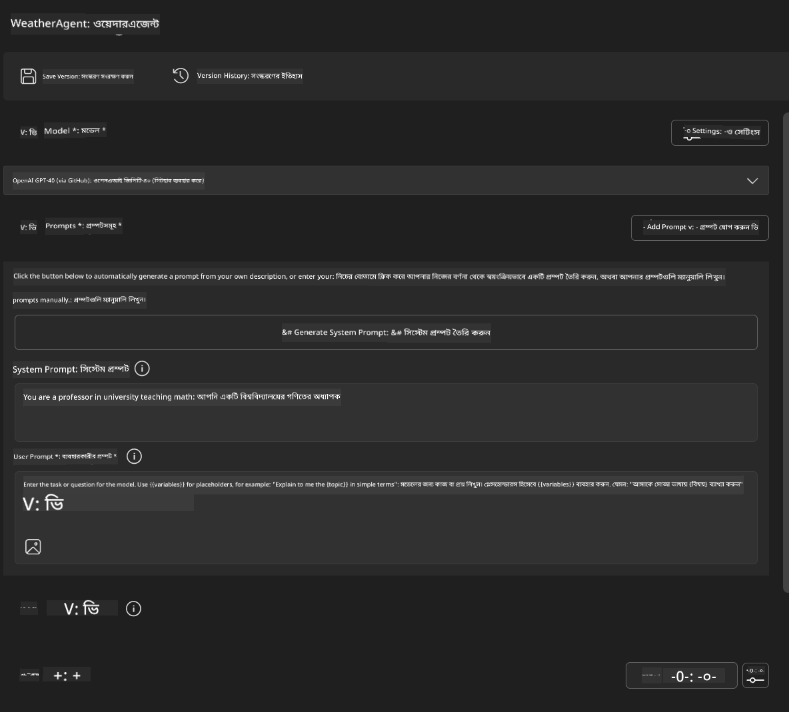
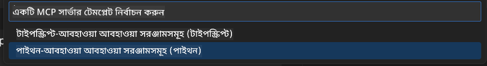
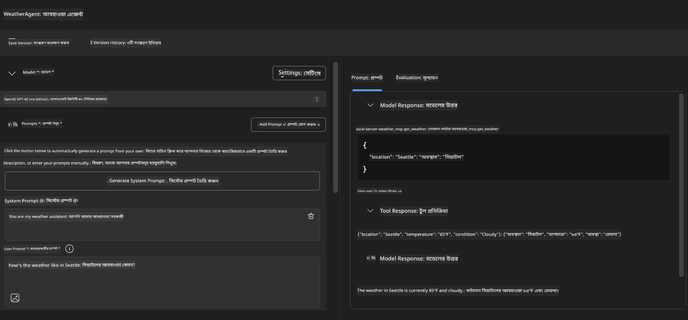
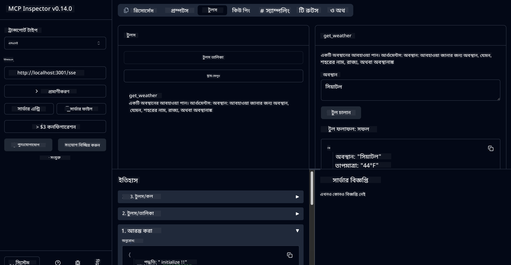

<!--
CO_OP_TRANSLATOR_METADATA:
{
  "original_hash": "dd8da3f75addcef453fe11f02a270217",
  "translation_date": "2025-07-14T08:10:50+00:00",
  "source_file": "10-StreamliningAIWorkflowsBuildingAnMCPServerWithAIToolkit/lab3/README.md",
  "language_code": "bn"
}
-->
# 🔧 মডিউল ৩: AI Toolkit দিয়ে উন্নত MCP ডেভেলপমেন্ট


## 🎯 শেখার লক্ষ্যসমূহ

এই ল্যাবের শেষে আপনি সক্ষম হবেন:

- ✅ AI Toolkit ব্যবহার করে কাস্টম MCP সার্ভার তৈরি করতে
- ✅ সর্বশেষ MCP Python SDK (v1.9.3) কনফিগার ও ব্যবহার করতে
- ✅ ডিবাগিংয়ের জন্য MCP Inspector সেটআপ ও ব্যবহার করতে
- ✅ Agent Builder এবং Inspector উভয় পরিবেশে MCP সার্ভার ডিবাগ করতে
- ✅ উন্নত MCP সার্ভার ডেভেলপমেন্ট ওয়ার্কফ্লো বুঝতে

## 📋 পূর্বশর্তসমূহ

- ল্যাব ২ (MCP Fundamentals) সম্পন্ন করা
- VS Code এ AI Toolkit এক্সটেনশন ইনস্টল করা
- Python 3.10+ পরিবেশ
- Inspector সেটআপের জন্য Node.js এবং npm

## 🏗️ আপনি যা তৈরি করবেন

এই ল্যাবে, আপনি একটি **Weather MCP Server** তৈরি করবেন যা প্রদর্শন করবে:
- কাস্টম MCP সার্ভার ইমপ্লিমেন্টেশন
- AI Toolkit Agent Builder এর সাথে ইন্টিগ্রেশন
- পেশাদার ডিবাগিং ওয়ার্কফ্লো
- আধুনিক MCP SDK ব্যবহারের প্যাটার্ন

---

## 🔧 মূল উপাদানসমূহের সংক্ষিপ্ত বিবরণ

### 🐍 MCP Python SDK
Model Context Protocol Python SDK কাস্টম MCP সার্ভার তৈরির ভিত্তি সরবরাহ করে। আপনি সংস্করণ 1.9.3 ব্যবহার করবেন যা উন্নত ডিবাগিং সুবিধা প্রদান করে।

### 🔍 MCP Inspector
একটি শক্তিশালী ডিবাগিং টুল যা প্রদান করে:
- রিয়েল-টাইম সার্ভার মনিটরিং
- টুল এক্সিকিউশনের ভিজ্যুয়ালাইজেশন
- নেটওয়ার্ক রিকোয়েস্ট/রেসপন্স পরিদর্শন
- ইন্টারেক্টিভ টেস্টিং পরিবেশ

---

## 📖 ধাপে ধাপে ইমপ্লিমেন্টেশন

### ধাপ ১: Agent Builder-এ WeatherAgent তৈরি করুন

1. **Agent Builder চালু করুন** VS Code এ AI Toolkit এক্সটেনশনের মাধ্যমে
2. **নতুন একটি এজেন্ট তৈরি করুন** নিম্নলিখিত কনফিগারেশন দিয়ে:
   - এজেন্টের নাম: `WeatherAgent`



### ধাপ ২: MCP সার্ভার প্রজেক্ট ইনিশিয়ালাইজ করুন

1. Agent Builder-এ **Tools** → **Add Tool** এ যান
2. উপলব্ধ অপশন থেকে **"MCP Server"** নির্বাচন করুন
3. **"Create A new MCP Server"** নির্বাচন করুন
4. `python-weather` টেমপ্লেট নির্বাচন করুন
5. আপনার সার্ভারের নাম দিন: `weather_mcp`



### ধাপ ৩: প্রজেক্ট খুলুন এবং পর্যালোচনা করুন

1. VS Code এ তৈরি প্রজেক্টটি খুলুন
2. প্রজেক্টের স্ট্রাকচার পর্যালোচনা করুন:
   ```
   weather_mcp/
   ├── src/
   │   ├── __init__.py
   │   └── server.py
   ├── inspector/
   │   ├── package.json
   │   └── package-lock.json
   ├── .vscode/
   │   ├── launch.json
   │   └── tasks.json
   ├── pyproject.toml
   └── README.md
   ```

### ধাপ ৪: সর্বশেষ MCP SDK-তে আপগ্রেড করুন

> **🔍 কেন আপগ্রেড করবেন?** আমরা সর্বশেষ MCP SDK (v1.9.3) এবং Inspector সার্ভিস (0.14.0) ব্যবহার করতে চাই উন্নত ফিচার এবং উন্নত ডিবাগিং সুবিধার জন্য।

#### ৪a. Python Dependencies আপডেট করুন

**`pyproject.toml` সম্পাদনা করুন:** [./code/weather_mcp/pyproject.toml](../../../../10-StreamliningAIWorkflowsBuildingAnMCPServerWithAIToolkit/lab3/code/weather_mcp/pyproject.toml) ফাইলটি আপডেট করুন

#### ৪b. Inspector কনফিগারেশন আপডেট করুন

**`inspector/package.json` সম্পাদনা করুন:** [./code/weather_mcp/inspector/package.json](../../../../10-StreamliningAIWorkflowsBuildingAnMCPServerWithAIToolkit/lab3/code/weather_mcp/inspector/package.json) ফাইলটি আপডেট করুন

#### ৪c. Inspector Dependencies আপডেট করুন

**`inspector/package-lock.json` সম্পাদনা করুন:** [./code/weather_mcp/inspector/package-lock.json](../../../../10-StreamliningAIWorkflowsBuildingAnMCPServerWithAIToolkit/lab3/code/weather_mcp/inspector/package-lock.json) ফাইলটি আপডেট করুন

> **📝 টিপস:** এই ফাইলে বিস্তৃত ডিপেন্ডেন্সি ডেফিনিশন রয়েছে। নিচে মূল কাঠামো দেখানো হয়েছে - সম্পূর্ণ ফাইলটি সঠিক ডিপেন্ডেন্সি রেজল্যুশনের জন্য প্রয়োজন।

> **⚡ সম্পূর্ণ প্যাকেজ লক:** package-lock.json ফাইলটি প্রায় ৩০০০ লাইনের ডিপেন্ডেন্সি ডেফিনিশন ধারণ করে। উপরের অংশটি মূল কাঠামো দেখায় - সম্পূর্ণ ডিপেন্ডেন্সি রেজল্যুশনের জন্য প্রদত্ত ফাইলটি ব্যবহার করুন।

### ধাপ ৫: VS Code ডিবাগিং কনফিগার করুন

*দ্রষ্টব্য: নির্দিষ্ট পাথে থাকা ফাইলটি কপি করে স্থানীয় ফাইলের জায়গায় প্রতিস্থাপন করুন*

#### ৫a. লঞ্চ কনফিগারেশন আপডেট করুন

**`.vscode/launch.json` সম্পাদনা করুন:**

```json
{
  "version": "0.2.0",
  "configurations": [
    {
      "name": "Attach to Local MCP",
      "type": "debugpy",
      "request": "attach",
      "connect": {
        "host": "localhost",
        "port": 5678
      },
      "presentation": {
        "hidden": true
      },
      "internalConsoleOptions": "neverOpen",
      "postDebugTask": "Terminate All Tasks"
    },
    {
      "name": "Launch Inspector (Edge)",
      "type": "msedge",
      "request": "launch",
      "url": "http://localhost:6274?timeout=60000&serverUrl=http://localhost:3001/sse#tools",
      "cascadeTerminateToConfigurations": [
        "Attach to Local MCP"
      ],
      "presentation": {
        "hidden": true
      },
      "internalConsoleOptions": "neverOpen"
    },
    {
      "name": "Launch Inspector (Chrome)",
      "type": "chrome",
      "request": "launch",
      "url": "http://localhost:6274?timeout=60000&serverUrl=http://localhost:3001/sse#tools",
      "cascadeTerminateToConfigurations": [
        "Attach to Local MCP"
      ],
      "presentation": {
        "hidden": true
      },
      "internalConsoleOptions": "neverOpen"
    }
  ],
  "compounds": [
    {
      "name": "Debug in Agent Builder",
      "configurations": [
        "Attach to Local MCP"
      ],
      "preLaunchTask": "Open Agent Builder",
    },
    {
      "name": "Debug in Inspector (Edge)",
      "configurations": [
        "Launch Inspector (Edge)",
        "Attach to Local MCP"
      ],
      "preLaunchTask": "Start MCP Inspector",
      "stopAll": true
    },
    {
      "name": "Debug in Inspector (Chrome)",
      "configurations": [
        "Launch Inspector (Chrome)",
        "Attach to Local MCP"
      ],
      "preLaunchTask": "Start MCP Inspector",
      "stopAll": true
    }
  ]
}
```

**`.vscode/tasks.json` সম্পাদনা করুন:**

```
{
  "version": "2.0.0",
  "tasks": [
    {
      "label": "Start MCP Server",
      "type": "shell",
      "command": "python -m debugpy --listen 127.0.0.1:5678 src/__init__.py sse",
      "isBackground": true,
      "options": {
        "cwd": "${workspaceFolder}",
        "env": {
          "PORT": "3001"
        }
      },
      "problemMatcher": {
        "pattern": [
          {
            "regexp": "^.*$",
            "file": 0,
            "location": 1,
            "message": 2
          }
        ],
        "background": {
          "activeOnStart": true,
          "beginsPattern": ".*",
          "endsPattern": "Application startup complete|running"
        }
      }
    },
    {
      "label": "Start MCP Inspector",
      "type": "shell",
      "command": "npm run dev:inspector",
      "isBackground": true,
      "options": {
        "cwd": "${workspaceFolder}/inspector",
        "env": {
          "CLIENT_PORT": "6274",
          "SERVER_PORT": "6277",
        }
      },
      "problemMatcher": {
        "pattern": [
          {
            "regexp": "^.*$",
            "file": 0,
            "location": 1,
            "message": 2
          }
        ],
        "background": {
          "activeOnStart": true,
          "beginsPattern": "Starting MCP inspector",
          "endsPattern": "Proxy server listening on port"
        }
      },
      "dependsOn": [
        "Start MCP Server"
      ]
    },
    {
      "label": "Open Agent Builder",
      "type": "shell",
      "command": "echo ${input:openAgentBuilder}",
      "presentation": {
        "reveal": "never"
      },
      "dependsOn": [
        "Start MCP Server"
      ],
    },
    {
      "label": "Terminate All Tasks",
      "command": "echo ${input:terminate}",
      "type": "shell",
      "problemMatcher": []
    }
  ],
  "inputs": [
    {
      "id": "openAgentBuilder",
      "type": "command",
      "command": "ai-mlstudio.agentBuilder",
      "args": {
        "initialMCPs": [ "local-server-weather_mcp" ],
        "triggeredFrom": "vsc-tasks"
      }
    },
    {
      "id": "terminate",
      "type": "command",
      "command": "workbench.action.tasks.terminate",
      "args": "terminateAll"
    }
  ]
}
```

---

## 🚀 আপনার MCP সার্ভার চালানো এবং পরীক্ষা করা

### ধাপ ৬: ডিপেন্ডেন্সি ইনস্টল করুন

কনফিগারেশন পরিবর্তনের পর নিচের কমান্ডগুলো চালান:

**Python ডিপেন্ডেন্সি ইনস্টল করুন:**
```bash
uv sync
```

**Inspector ডিপেন্ডেন্সি ইনস্টল করুন:**
```bash
cd inspector
npm install
```

### ধাপ ৭: Agent Builder দিয়ে ডিবাগ করুন

1. **F5 চাপুন** অথবা **"Debug in Agent Builder"** কনফিগারেশন ব্যবহার করুন
2. ডিবাগ প্যানেল থেকে কম্পাউন্ড কনফিগারেশন নির্বাচন করুন
3. সার্ভার চালু হওয়া এবং Agent Builder খুলে যাওয়ার জন্য অপেক্ষা করুন
4. আপনার weather MCP সার্ভারটি প্রাকৃতিক ভাষার প্রশ্ন দিয়ে পরীক্ষা করুন

নিম্নরূপ ইনপুট দিন

SYSTEM_PROMPT

```
You are my weather assistant
```

USER_PROMPT

```
How's the weather like in Seattle
```



### ধাপ ৮: MCP Inspector দিয়ে ডিবাগ করুন

1. **"Debug in Inspector"** কনফিগারেশন ব্যবহার করুন (Edge বা Chrome)
2. `http://localhost:6274` এ Inspector ইন্টারফেস খুলুন
3. ইন্টারেক্টিভ টেস্টিং পরিবেশ অন্বেষণ করুন:
   - উপলব্ধ টুলগুলো দেখুন
   - টুল এক্সিকিউশন পরীক্ষা করুন
   - নেটওয়ার্ক রিকোয়েস্ট মনিটর করুন
   - সার্ভার রেসপন্স ডিবাগ করুন



---

## 🎯 মূল শেখার ফলাফল

এই ল্যাব সম্পন্ন করে আপনি:

- [x] AI Toolkit টেমপ্লেট ব্যবহার করে কাস্টম MCP সার্ভার তৈরি করেছেন
- [x] উন্নত ফিচারের জন্য সর্বশেষ MCP SDK (v1.9.3) এ আপগ্রেড করেছেন
- [x] Agent Builder এবং Inspector উভয়ের জন্য পেশাদার ডিবাগিং ওয়ার্কফ্লো কনফিগার করেছেন
- [x] MCP Inspector সেটআপ করে ইন্টারেক্টিভ সার্ভার টেস্টিং করেছেন
- [x] MCP ডেভেলপমেন্টের জন্য VS Code ডিবাগিং কনফিগারেশন আয়ত্ত করেছেন

## 🔧 উন্নত ফিচারসমূহ অন্বেষণ

| ফিচার | বর্ণনা | ব্যবহারের ক্ষেত্র |
|---------|-------------|----------|
| **MCP Python SDK v1.9.3** | সর্বশেষ প্রোটোকল ইমপ্লিমেন্টেশন | আধুনিক সার্ভার ডেভেলপমেন্ট |
| **MCP Inspector 0.14.0** | ইন্টারেক্টিভ ডিবাগিং টুল | রিয়েল-টাইম সার্ভার টেস্টিং |
| **VS Code Debugging** | ইন্টিগ্রেটেড ডেভেলপমেন্ট এনভায়রনমেন্ট | পেশাদার ডিবাগিং ওয়ার্কফ্লো |
| **Agent Builder Integration** | সরাসরি AI Toolkit সংযোগ | এন্ড-টু-এন্ড এজেন্ট টেস্টিং |

## 📚 অতিরিক্ত রিসোর্স

- [MCP Python SDK ডকুমেন্টেশন](https://modelcontextprotocol.io/docs/sdk/python)
- [AI Toolkit এক্সটেনশন গাইড](https://code.visualstudio.com/docs/ai/ai-toolkit)
- [VS Code ডিবাগিং ডকুমেন্টেশন](https://code.visualstudio.com/docs/editor/debugging)
- [Model Context Protocol স্পেসিফিকেশন](https://modelcontextprotocol.io/docs/concepts/architecture)

---

**🎉 অভিনন্দন!** আপনি সফলভাবে ল্যাব ৩ সম্পন্ন করেছেন এবং এখন পেশাদার ডেভেলপমেন্ট ওয়ার্কফ্লো ব্যবহার করে কাস্টম MCP সার্ভার তৈরি, ডিবাগ এবং ডিপ্লয় করতে পারবেন।

### 🔜 পরবর্তী মডিউলে এগিয়ে যান

আপনার MCP দক্ষতাগুলো বাস্তব ডেভেলপমেন্ট ওয়ার্কফ্লোতে প্রয়োগ করতে প্রস্তুত? **[মডিউল ৪: Practical MCP Development - Custom GitHub Clone Server](../lab4/README.md)** এ যান যেখানে আপনি:
- প্রোডাকশন-রেডি MCP সার্ভার তৈরি করবেন যা GitHub রিপোজিটরি অপারেশনগুলো অটোমেট করবে
- MCP এর মাধ্যমে GitHub রিপোজিটরি ক্লোনিং ফাংশনালিটি ইমপ্লিমেন্ট করবেন
- VS Code এবং GitHub Copilot Agent Mode এর সাথে কাস্টম MCP সার্ভার ইন্টিগ্রেট করবেন
- প্রোডাকশন পরিবেশে কাস্টম MCP সার্ভার টেস্ট ও ডিপ্লয় করবেন
- ডেভেলপারদের জন্য বাস্তব ওয়ার্কফ্লো অটোমেশন শিখবেন

**অস্বীকৃতি**:  
এই নথিটি AI অনুবাদ সেবা [Co-op Translator](https://github.com/Azure/co-op-translator) ব্যবহার করে অনূদিত হয়েছে। আমরা যথাসাধ্য সঠিকতার চেষ্টা করি, তবে স্বয়ংক্রিয় অনুবাদে ত্রুটি বা অসঙ্গতি থাকতে পারে। মূল নথিটি তার নিজস্ব ভাষায়ই কর্তৃত্বপূর্ণ উৎস হিসেবে বিবেচিত হওয়া উচিত। গুরুত্বপূর্ণ তথ্যের জন্য পেশাদার মানব অনুবাদ গ্রহণ করার পরামর্শ দেওয়া হয়। এই অনুবাদের ব্যবহারে সৃষ্ট কোনো ভুল বোঝাবুঝি বা ভুল ব্যাখ্যার জন্য আমরা দায়ী নই।