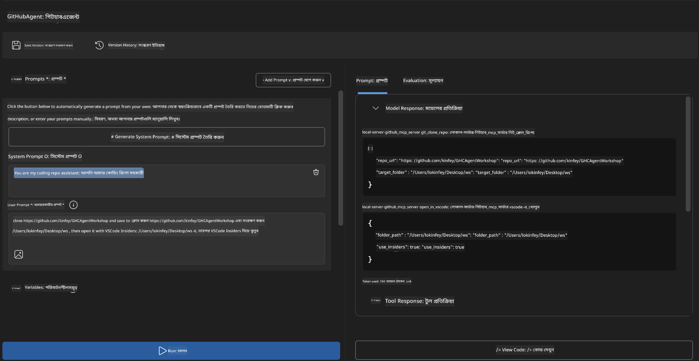
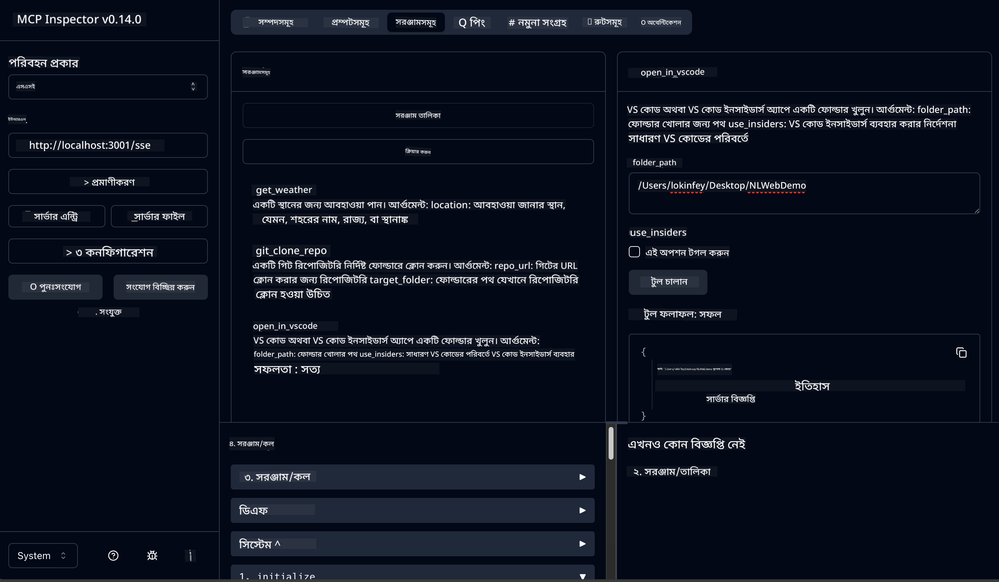

<!--
CO_OP_TRANSLATOR_METADATA:
{
  "original_hash": "f83bc722dc758efffd68667d6a1db470",
  "translation_date": "2025-07-14T08:39:12+00:00",
  "source_file": "10-StreamliningAIWorkflowsBuildingAnMCPServerWithAIToolkit/lab4/README.md",
  "language_code": "bn"
}
-->
# 🐙 মডিউল ৪: ব্যবহারিক MCP ডেভেলপমেন্ট - কাস্টম GitHub ক্লোন সার্ভার


> **⚡ দ্রুত শুরু:** মাত্র ৩০ মিনিটে একটি প্রোডাকশন-রেডি MCP সার্ভার তৈরি করুন যা GitHub রিপোজিটরি ক্লোনিং এবং VS Code ইন্টিগ্রেশন স্বয়ংক্রিয় করে!

## 🎯 শেখার লক্ষ্যসমূহ

এই ল্যাবের শেষে আপনি সক্ষম হবেন:

- ✅ বাস্তব জীবনের ডেভেলপমেন্ট ওয়ার্কফ্লোর জন্য একটি কাস্টম MCP সার্ভার তৈরি করতে
- ✅ MCP এর মাধ্যমে GitHub রিপোজিটরি ক্লোনিং ফাংশনালিটি বাস্তবায়ন করতে
- ✅ কাস্টম MCP সার্ভারগুলোকে VS Code এবং Agent Builder এর সাথে ইন্টিগ্রেট করতে
- ✅ GitHub Copilot Agent Mode ব্যবহার করে কাস্টম MCP টুলস পরিচালনা করতে
- ✅ প্রোডাকশন পরিবেশে কাস্টম MCP সার্ভার টেস্ট ও ডিপ্লয় করতে

## 📋 পূর্বশর্তসমূহ

- Labs 1-3 সম্পন্ন (MCP এর মৌলিক ও উন্নত ডেভেলপমেন্ট)
- GitHub Copilot সাবস্ক্রিপশন ([ফ্রি সাইনআপ উপলব্ধ](https://github.com/github-copilot/signup))
- VS Code এ AI Toolkit এবং GitHub Copilot এক্সটেনশন ইনস্টল করা
- Git CLI ইনস্টল ও কনফিগার করা

## 🏗️ প্রকল্পের সারাংশ

### **বাস্তব জীবনের ডেভেলপমেন্ট চ্যালেঞ্জ**
ডেভেলপার হিসেবে আমরা প্রায়ই GitHub থেকে রিপোজিটরি ক্লোন করে VS Code বা VS Code Insiders এ ওপেন করি। এই ম্যানুয়াল প্রক্রিয়াটি হলো:
1. টার্মিনাল/কমান্ড প্রম্পট ওপেন করা
2. কাঙ্ক্ষিত ডিরেক্টরিতে যাওয়া
3. `git clone` কমান্ড চালানো
4. ক্লোন করা ডিরেক্টরিতে VS Code ওপেন করা

**আমাদের MCP সমাধান এটিকে একটি বুদ্ধিমান একক কমান্ডে রূপান্তর করে!**

### **আপনি যা তৈরি করবেন**
একটি **GitHub Clone MCP Server** (`git_mcp_server`) যা প্রদান করবে:

| ফিচার | বর্ণনা | সুবিধা |
|---------|-------------|---------|
| 🔄 **স্মার্ট রিপোজিটরি ক্লোনিং** | যাচাইসহ GitHub রিপোজ ক্লোন করা | স্বয়ংক্রিয় ত্রুটি যাচাই |
| 📁 **বুদ্ধিমান ডিরেক্টরি ম্যানেজমেন্ট** | নিরাপদে ডিরেক্টরি চেক ও তৈরি করা | ওভাররাইট প্রতিরোধ |
| 🚀 **ক্রস-প্ল্যাটফর্ম VS Code ইন্টিগ্রেশন** | VS Code/Insiders এ প্রজেক্ট ওপেন করা | নির্বিঘ্ন ওয়ার্কফ্লো ট্রানজিশন |
| 🛡️ **দৃঢ় ত্রুটি হ্যান্ডলিং** | নেটওয়ার্ক, পারমিশন, পাথ সমস্যা মোকাবেলা | প্রোডাকশন-রেডি নির্ভরযোগ্যতা |

---

## 📖 ধাপে ধাপে বাস্তবায়ন

### ধাপ ১: Agent Builder-এ GitHub Agent তৈরি করুন

1. AI Toolkit এক্সটেনশনের মাধ্যমে **Agent Builder চালু করুন**
2. নিম্নলিখিত কনফিগারেশন দিয়ে **নতুন এজেন্ট তৈরি করুন:**
   ```
   Agent Name: GitHubAgent
   ```

3. **কাস্টম MCP সার্ভার ইনিশিয়ালাইজ করুন:**
   - **Tools** → **Add Tool** → **MCP Server** এ যান
   - **"Create A new MCP Server"** নির্বাচন করুন
   - সর্বোচ্চ নমনীয়তার জন্য **Python template** বেছে নিন
   - **সার্ভার নাম:** `git_mcp_server`

### ধাপ ২: GitHub Copilot Agent Mode কনফিগার করুন

1. VS Code এ **GitHub Copilot খুলুন** (Ctrl/Cmd + Shift + P → "GitHub Copilot: Open")
2. Copilot ইন্টারফেসে **Agent Model নির্বাচন করুন**
3. উন্নত যুক্তি সক্ষমতার জন্য **Claude 3.7 মডেল বেছে নিন**
4. টুল অ্যাক্সেসের জন্য **MCP ইন্টিগ্রেশন সক্রিয় করুন**

> **💡 প্রো টিপ:** Claude 3.7 উন্নত ডেভেলপমেন্ট ওয়ার্কফ্লো এবং ত্রুটি হ্যান্ডলিং প্যাটার্ন বুঝতে সাহায্য করে।

### ধাপ ৩: MCP সার্ভারের মূল ফাংশনালিটি বাস্তবায়ন করুন

**GitHub Copilot Agent Mode এর সাথে নিম্নলিখিত বিস্তারিত প্রম্পট ব্যবহার করুন:**

```
Create two MCP tools with the following comprehensive requirements:

🔧 TOOL A: clone_repository
Requirements:
- Clone any GitHub repository to a specified local folder
- Return the absolute path of the successfully cloned project
- Implement comprehensive validation:
  ✓ Check if target directory already exists (return error if exists)
  ✓ Validate GitHub URL format (https://github.com/user/repo)
  ✓ Verify git command availability (prompt installation if missing)
  ✓ Handle network connectivity issues
  ✓ Provide clear error messages for all failure scenarios

🚀 TOOL B: open_in_vscode
Requirements:
- Open specified folder in VS Code or VS Code Insiders
- Cross-platform compatibility (Windows/Linux/macOS)
- Use direct application launch (not terminal commands)
- Auto-detect available VS Code installations
- Handle cases where VS Code is not installed
- Provide user-friendly error messages

Additional Requirements:
- Follow MCP 1.9.3 best practices
- Include proper type hints and documentation
- Implement logging for debugging purposes
- Add input validation for all parameters
- Include comprehensive error handling
```

### ধাপ ৪: আপনার MCP সার্ভার টেস্ট করুন

#### ৪a. Agent Builder-এ টেস্ট

1. Agent Builder এর ডিবাগ কনফিগারেশন চালু করুন
2. এই সিস্টেম প্রম্পট দিয়ে আপনার এজেন্ট কনফিগার করুন:

```
SYSTEM_PROMPT:
You are my intelligent coding repository assistant. You help developers efficiently clone GitHub repositories and set up their development environment. Always provide clear feedback about operations and handle errors gracefully.
```

3. বাস্তবসম্মত ব্যবহারকারী পরিস্থিতিতে টেস্ট করুন:

```
USER_PROMPT EXAMPLES:

Scenario : Basic Clone and Open
"Clone {Your GitHub Repo link such as https://github.com/kinfey/GHCAgentWorkshop
 } and save to {The global path you specify}, then open it with VS Code Insiders"
```



**প্রত্যাশিত ফলাফল:**
- ✅ সফল ক্লোনিং এবং পাথ নিশ্চিতকরণ
- ✅ স্বয়ংক্রিয় VS Code লঞ্চ
- ✅ অবৈধ পরিস্থিতির জন্য স্পষ্ট ত্রুটি বার্তা
- ✅ প্রান্তিক কেস সঠিকভাবে হ্যান্ডলিং

#### ৪b. MCP Inspector-এ টেস্ট করুন



---

**🎉 অভিনন্দন!** আপনি সফলভাবে একটি ব্যবহারিক, প্রোডাকশন-রেডি MCP সার্ভার তৈরি করেছেন যা বাস্তব ডেভেলপমেন্ট ওয়ার্কফ্লো সমস্যাগুলো সমাধান করে। আপনার কাস্টম GitHub ক্লোন সার্ভার MCP এর ক্ষমতা প্রদর্শন করে যা ডেভেলপারদের উৎপাদনশীলতা স্বয়ংক্রিয় ও উন্নত করে।

### 🏆 অর্জনসমূহ:
- ✅ **MCP ডেভেলপার** - কাস্টম MCP সার্ভার তৈরি করেছেন
- ✅ **ওয়ার্কফ্লো অটোমেটর** - ডেভেলপমেন্ট প্রক্রিয়া সহজ করেছেন  
- ✅ **ইন্টিগ্রেশন এক্সপার্ট** - একাধিক ডেভেলপমেন্ট টুল সংযুক্ত করেছেন
- ✅ **প্রোডাকশন রেডি** - ডিপ্লয়যোগ্য সমাধান তৈরি করেছেন

---

## 🎓 কর্মশালা সমাপ্তি: Model Context Protocol এর সাথে আপনার যাত্রা

**প্রিয় কর্মশালা অংশগ্রহণকারী,**

Model Context Protocol কর্মশালার চারটি মডিউল সফলভাবে শেষ করার জন্য অভিনন্দন! আপনি AI Toolkit এর মৌলিক ধারণা থেকে শুরু করে বাস্তব জীবনের ডেভেলপমেন্ট চ্যালেঞ্জ সমাধানের জন্য প্রোডাকশন-রেডি MCP সার্ভার তৈরি পর্যন্ত অনেক দূর এগিয়েছেন।

### 🚀 আপনার শেখার পথের সারাংশ:

**[মডিউল ১](../lab1/README.md)**: AI Toolkit এর মৌলিক বিষয়াবলী, মডেল টেস্টিং এবং প্রথম AI এজেন্ট তৈরি শেখা।

**[মডিউল ২](../lab2/README.md)**: MCP আর্কিটেকচার, Playwright MCP ইন্টিগ্রেশন এবং প্রথম ব্রাউজার অটোমেশন এজেন্ট তৈরি।

**[মডিউল ৩](../lab3/README.md)**: কাস্টম MCP সার্ভার ডেভেলপমেন্ট, Weather MCP সার্ভার এবং ডিবাগিং টুলস মাস্টারি।

**[মডিউল ৪](../lab4/README.md)**: বাস্তব GitHub রিপোজিটরি ওয়ার্কফ্লো অটোমেশন টুল তৈরি।

### 🌟 আপনি যা দক্ষ হয়েছেন:

- ✅ **AI Toolkit ইকোসিস্টেম**: মডেল, এজেন্ট এবং ইন্টিগ্রেশন প্যাটার্ন
- ✅ **MCP আর্কিটেকচার**: ক্লায়েন্ট-সার্ভার ডিজাইন, ট্রান্সপোর্ট প্রোটোকল এবং সিকিউরিটি
- ✅ **ডেভেলপার টুলস**: প্লেগ্রাউন্ড থেকে ইনস্পেক্টর ও প্রোডাকশন ডিপ্লয়মেন্ট
- ✅ **কাস্টম ডেভেলপমেন্ট**: নিজস্ব MCP সার্ভার তৈরি, টেস্ট ও ডিপ্লয় করা
- ✅ **ব্যবহারিক অ্যাপ্লিকেশন**: AI দিয়ে বাস্তব ওয়ার্কফ্লো চ্যালেঞ্জ সমাধান

### 🔮 আপনার পরবর্তী ধাপ:

1. **নিজের MCP সার্ভার তৈরি করুন**: আপনার নিজস্ব ওয়ার্কফ্লো অটোমেট করতে এই দক্ষতাগুলো প্রয়োগ করুন
2. **MCP কমিউনিটিতে যোগ দিন**: আপনার সৃষ্টি শেয়ার করুন এবং অন্যদের থেকে শিখুন
3. **উন্নত ইন্টিগ্রেশন অন্বেষণ করুন**: MCP সার্ভারগুলোকে এন্টারপ্রাইজ সিস্টেমের সাথে সংযুক্ত করুন
4. **ওপেন সোর্সে অবদান রাখুন**: MCP টুলিং ও ডকুমেন্টেশন উন্নত করতে সাহায্য করুন

মনে রাখবেন, এই কর্মশালা কেবল শুরু মাত্র। Model Context Protocol ইকোসিস্টেম দ্রুত বিকাশমান, এবং আপনি এখন AI-চালিত ডেভেলপমেন্ট টুলসের অগ্রভাগে থাকার জন্য প্রস্তুত।

**আপনার অংশগ্রহণ ও শেখার প্রতি উৎসর্গের জন্য ধন্যবাদ!**

আমরা আশা করি এই কর্মশালা আপনাকে এমন ধারণা দিয়েছে যা আপনার ডেভেলপমেন্ট যাত্রায় AI টুলস তৈরি ও ব্যবহারের পদ্ধতি পরিবর্তন করবে।

**শুভ কোডিং!**

---

**অস্বীকৃতি**:  
এই নথিটি AI অনুবাদ সেবা [Co-op Translator](https://github.com/Azure/co-op-translator) ব্যবহার করে অনূদিত হয়েছে। আমরা যথাসাধ্য সঠিকতার চেষ্টা করি, তবে স্বয়ংক্রিয় অনুবাদে ত্রুটি বা অসঙ্গতি থাকতে পারে। মূল নথিটি তার নিজস্ব ভাষায়ই কর্তৃত্বপূর্ণ উৎস হিসেবে বিবেচিত হওয়া উচিত। গুরুত্বপূর্ণ তথ্যের জন্য পেশাদার মানব অনুবাদ গ্রহণ করার পরামর্শ দেওয়া হয়। এই অনুবাদের ব্যবহারে সৃষ্ট কোনো ভুল বোঝাবুঝি বা ভুল ব্যাখ্যার জন্য আমরা দায়ী নই।