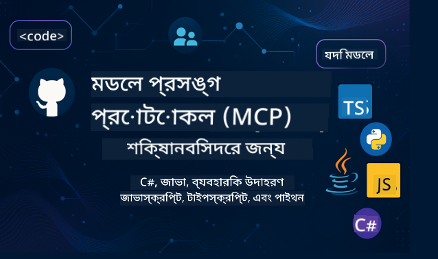

<!--
CO_OP_TRANSLATOR_METADATA:
{
  "original_hash": "2a21391378c12ecfef50f866329dfde0",
  "translation_date": "2025-05-17T05:21:02+00:00",
  "source_file": "README.md",
  "language_code": "bn"
}
-->

এই রিসোর্সগুলি ব্যবহার শুরু করার জন্য নিম্নলিখিত ধাপগুলি অনুসরণ করুন:
1. **রিপোজিটরি ফর্ক করুন**: ক্লিক করুন 
2. **রিপোজিটরি ক্লোন করুন**: `git clone https://github.com/microsoft/mcp-for-beginners.git`
3. [**Microsoft Azure AI Foundry Discord-এ যোগ দিন এবং বিশেষজ্ঞ এবং অন্যান্য ডেভেলপারদের সাথে পরিচিত হন**](https://discord.com/invite/ByRwuEEgH4)

### 🌐 বহু-ভাষার সমর্থন

#### GitHub Action এর মাধ্যমে সমর্থিত (স্বয়ংক্রিয় এবং সর্বদা আপ-টু-ডেট)
[ফরাসি](../fr/README.md) | [স্প্যানিশ](../es/README.md) | [জার্মান](../de/README.md) | [রাশিয়ান](../ru/README.md) | [আরবি](../ar/README.md) | [ফার্সি (পার্সিয়ান)](../fa/README.md) | [উর্দু](../ur/README.md) | [চাইনিজ (সরলীকৃত)](../zh/README.md) | [চাইনিজ (প্রথাগত, ম্যাকাও)](../mo/README.md) | [চাইনিজ (প্রথাগত, হংকং)](../hk/README.md) | [চাইনিজ (প্রথাগত, তাইওয়ান)](../tw/README.md) | [জাপানিজ](../ja/README.md) | [কোরিয়ান](../ko/README.md) | [হিন্দি](../hi/README.md) | [বাংলা](./README.md) | [মারাঠি](../mr/README.md) | [নেপালি](../ne/README.md) | [পাঞ্জাবি (গুরুমুখী)](../pa/README.md) | [পর্তুগিজ (পর্তুগাল)](../pt/README.md) | [পর্তুগিজ (ব্রাজিল)](../br/README.md) | [ইতালীয়](../it/README.md) | [পোলিশ](../pl/README.md) | [তুর্কি](../tr/README.md) | [গ্রিক](../el/README.md) | [থাই](../th/README.md) | [সুইডিশ](../sv/README.md) | [ড্যানিশ](../da/README.md) | [নরওয়েজিয়ান](../no/README.md) | [ফিনিশ](../fi/README.md) | [ডাচ](../nl/README.md) | [হিব্রু](../he/README.md) | [ভিয়েতনামিজ](../vi/README.md) | [ইন্দোনেশিয়ান](../id/README.md) | [মালয়](../ms/README.md) | [তাগালগ (ফিলিপিনো)](../tl/README.md) | [সোয়াহিলি](../sw/README.md) | [হাঙ্গেরিয়ান](../hu/README.md) | [চেক](../cs/README.md) | [স্লোভাক](../sk/README.md) | [রোমানিয়ান](../ro/README.md) | [বুলগেরিয়ান](../bg/README.md) | [সার্বিয়ান (সিরিলিক)](../sr/README.md) | [ক্রোয়েশিয়ান](../hr/README.md) | [স্লোভেনিয়ান](../sl/README.md)
# 🚀 মডেল কনটেক্সট প্রোটোকল (MCP) শিক্ষাক্রমের চূড়ান্ত গাইড: নবাগতদের জন্য

## **C#, Java, JavaScript, Python, এবং TypeScript এ হাতে-কলমে কোড উদাহরণ সহ MCP শিখুন**

## 🧠 মডেল কনটেক্সট প্রোটোকল শিক্ষাক্রমের সারসংক্ষেপ

**মডেল কনটেক্সট প্রোটোকল (MCP)** একটি অত্যাধুনিক ফ্রেমওয়ার্ক যা AI মডেল এবং ক্লায়েন্ট অ্যাপ্লিকেশনগুলির মধ্যে ইন্টারঅ্যাকশনকে মানসম্মত করার জন্য ডিজাইন করা হয়েছে। এই ওপেন-সোর্স শিক্ষাক্রম একটি কাঠামোবদ্ধ শেখার পথ প্রদান করে, যেখানে C#, Java, JavaScript, TypeScript, এবং Python সহ জনপ্রিয় প্রোগ্রামিং ভাষায় বাস্তব-জগতের ব্যবহার এবং কোড উদাহরণ অন্তর্ভুক্ত রয়েছে।

আপনি যদি একজন AI ডেভেলপার, সিস্টেম আর্কিটেক্ট, বা সফটওয়্যার ইঞ্জিনিয়ার হন, তাহলে MCP এর মৌলিক বিষয় এবং বাস্তবায়ন কৌশল আয়ত্ত করার জন্য এই গাইড আপনার সর্বাঙ্গীন সম্পদ।

## 🔗 অফিসিয়াল MCP সম্পদসমূহ

- 📘 [MCP ডকুমেন্টেশন](https://modelcontextprotocol.io/) – বিস্তারিত টিউটোরিয়াল এবং ব্যবহারকারী গাইড  
- 📜 [MCP স্পেসিফিকেশন](https://spec.modelcontextprotocol.io/) – প্রোটোকল স্থাপত্য এবং প্রযুক্তিগত রেফারেন্স  
- 🧑‍💻 [MCP GitHub রিপোজিটরি](https://github.com/modelcontextprotocol) – ওপেন-সোর্স SDKs, টুলস, এবং কোড নমুনা  

## 🧭 সম্পূর্ণ MCP শিক্ষাক্রমের কাঠামো

### 📌 [MCP এর পরিচিতি](./00-Introduction/README.md)

- মডেল কনটেক্সট প্রোটোকল কি?
- AI পাইপলাইনে মানসম্মতকরণের গুরুত্ব
- MCP এর ব্যবহারিক ক্ষেত্র এবং সুবিধা

### 🧩 [মৌলিক ধারণাগুলি ব্যাখ্যা করা হয়েছে](./01-CoreConcepts/README.md)

- MCP তে ক্লায়েন্ট-সার্ভার স্থাপত্য বোঝা
- মূল প্রোটোকল উপাদান: অনুরোধ, প্রতিক্রিয়া, এবং স্কিমা
- MCP মেসেজিং এবং ডেটা বিনিময় প্যাটার্ন

### 🔐 [MCP এর নিরাপত্তা](./02-Security/readme.md)

- MCP ভিত্তিক সিস্টেমে নিরাপত্তা হুমকি চিহ্নিত করা
- বাস্তবায়নের নিরাপত্তা নিশ্চিত করার কৌশল এবং সেরা অনুশীলন

### 🚀 [MCP এর সাথে শুরু করা](./03-GettingStarted/README.md)

- পরিবেশ সেটআপ এবং কনফিগারেশন
- মৌলিক MCP সার্ভার এবং ক্লায়েন্ট তৈরি করা
- বিদ্যমান অ্যাপ্লিকেশনগুলির সাথে MCP সংহত করা

#### 🧮 MCP ক্যালকুলেটর নমুনা প্রকল্পসমূহ:

  
<strong>ভাষা অনুযায়ী কোড বাস্তবায়ন অন্বেষণ করুন</strong>

  - [C# MCP সার্ভার উদাহরণ](./03-GettingStarted/samples/csharp/README.md)
  - [Java MCP ক্যালকুলেটর](./03-GettingStarted/samples/java/calculator/README.md)
  - [JavaScript MCP ডেমো](./03-GettingStarted/samples/javascript/README.md)
  - [Python MCP সার্ভার](../../03-GettingStarted/samples/python/mcp_calculator_server.py)
  - [TypeScript MCP উদাহরণ](./03-GettingStarted/samples/typescript/README.md)

### 🛠️ [বাস্তবায়নের ব্যবহারিক দিক](./04-PracticalImplementation/README.md)

- বিভিন্ন ভাষায় SDK ব্যবহার
- ডিবাগিং, টেস্টিং, এবং যাচাইকরণ
- পুনরায় ব্যবহারযোগ্য প্রম্পট টেমপ্লেট এবং কর্মপ্রবাহ তৈরি করা

#### 💡 MCP উন্নত ক্যালকুলেটর প্রকল্পসমূহ:

  
<strong>উন্নত নমুনাগুলি অন্বেষণ করুন</strong>

  - [উন্নত C# নমুনা](./04-PracticalImplementation/samples/csharp/README.md)
  - [Java কন্টেইনার অ্যাপ উদাহরণ](./04-PracticalImplementation/samples/java/containerapp/README.md)
  - [JavaScript উন্নত নমুনা](./04-PracticalImplementation/samples/javascript/README.md)
  - [Python জটিল বাস্তবায়ন](../../04-PracticalImplementation/samples/python/mcp_sample.py)
  - [TypeScript কন্টেইনার নমুনা](./04-PracticalImplementation/samples/typescript/README.md)

### 🎓 [MCP এর উন্নত বিষয়সমূহ](./05-AdvancedTopics/README.md)

- মাল্টি-মোডাল AI কর্মপ্রবাহ এবং সম্প্রসারণযোগ্যতা
- নিরাপদ স্কেলিং কৌশল
- এন্টারপ্রাইজ ইকোসিস্টেমে MCP

### 🌍 [সম্প্রদায়ের অবদান](./06-CommunityContributions/README.md)

- কোড এবং ডকস কিভাবে অবদান রাখতে হয়
- GitHub এর মাধ্যমে সহযোগিতা
- সম্প্রদায়-চালিত উন্নতি এবং প্রতিক্রিয়া

### 📈 [প্রাথমিক গ্রহণ থেকে অন্তর্দৃষ্টি](./07-CaseStudies/README.md)

- বাস্তব-জগতের বাস্তবায়ন এবং কি কাজ করেছে
- MCP ভিত্তিক সমাধান তৈরি এবং স্থাপন
- প্রবণতা এবং ভবিষ্যৎ রোডম্যাপ

### 📏 [MCP এর সেরা অনুশীলন](./08-BestPractices/README.md)

- কর্মক্ষমতা টিউনিং এবং অপ্টিমাইজেশন
- ভুল-সহনশীল MCP সিস্টেম ডিজাইন করা
- টেস্টিং এবং স্থিতিস্থাপকতার কৌশল

### 📊 [MCP কেস স্টাডি](./09-CaseStudy/Readme.md)

- MCP সমাধান স্থাপত্যে গভীরভাবে অনুসন্ধান
- স্থাপন নীলনকশা এবং সংহতকরণ টিপস
- মন্তব্যযুক্ত চিত্র এবং প্রকল্প ওয়াকথ্রু

## 🎯 MCP শেখার জন্য পূর্বশর্ত

এই শিক্ষাক্রম থেকে সর্বাধিক উপকার পেতে আপনার উচিত:

- C#, Java, বা Python এর মৌলিক জ্ঞান
- ক্লায়েন্ট-সার্ভার মডেল এবং API এর বোঝাপড়া
- (ঐচ্ছিক) মেশিন লার্নিং ধারণার সাথে পরিচিতি

## 🛠️ এই শিক্ষাক্রমটি কার্যকরভাবে ব্যবহার করার পদ্ধতি

এই গাইডের প্রতিটি পাঠ অন্তর্ভুক্ত:

1. MCP ধারণার স্পষ্ট ব্যাখ্যা  
2. একাধিক ভাষায় লাইভ কোড উদাহরণ  
3. বাস্তব MCP অ্যাপ্লিকেশন তৈরি করার অনুশীলন  
4. উন্নত শিক্ষার্থীদের জন্য অতিরিক্ত সম্পদ  

## 📜 লাইসেন্স তথ্য

এই বিষয়বস্তু **MIT লাইসেন্স** এর অধীনে লাইসেন্সপ্রাপ্ত। শর্তাবলী এবং অবস্থার জন্য, [LICENSE](../../LICENSE) দেখুন।

## 🤝 অবদান রাখার নির্দেশিকা

এই প্রকল্পটি অবদান এবং পরামর্শকে স্বাগত জানায়। বেশিরভাগ অবদান রাখার জন্য আপনাকে একটি
Contributor License Agreement (CLA) সম্মত করতে হবে যা ঘোষণা করে যে আপনার অবদান ব্যবহারের জন্য আমাদের অধিকার আছে এবং আপনি তা প্রদান করেন। বিস্তারিত জানতে <https://cla.opensource.microsoft.com> দেখুন।

যখন আপনি একটি pull request জমা দেন, একটি CLA বট স্বয়ংক্রিয়ভাবে নির্ধারণ করবে যে আপনাকে CLA প্রদান করতে হবে কিনা এবং PR যথাযথভাবে সাজাবে (যেমন, স্ট্যাটাস চেক, মন্তব্য)। বটের প্রদত্ত নির্দেশনা অনুসরণ করুন। আপনাকে আমাদের CLA ব্যবহার করা সমস্ত রিপোজিটরিতে এটি একবারই করতে হবে।

এই প্রকল্পটি [Microsoft Open Source Code of Conduct](https://opensource.microsoft.com/codeofconduct/) গ্রহণ করেছে।
আরো তথ্যের জন্য [Code of Conduct FAQ](https://opensource.microsoft.com/codeofconduct/faq/) দেখুন বা [opencode@microsoft.com](mailto:opencode@microsoft.com) এর সাথে কোনো অতিরিক্ত প্রশ্ন বা মন্তব্যের জন্য যোগাযোগ করুন।

## ™️ ট্রেডমার্ক নোটিশ

এই প্রকল্পে প্রকল্প, পণ্য, বা পরিষেবার জন্য ট্রেডমার্ক বা লোগো থাকতে পারে। Microsoft ট্রেডমার্ক বা লোগো ব্যবহার করার অনুমোদিত ব্যবহার Microsoft এর ট্রেডমার্ক ও ব্র্যান্ড নির্দেশিকা অনুসরণ করতে হবে। Microsoft ট্রেডমার্ক বা লোগো পরিবর্তিত সংস্করণে ব্যবহার বিভ্রান্তি সৃষ্টি করতে পারে না বা Microsoft এর স্পনসরশিপের ইঙ্গিত দিতে পারে না। তৃতীয় পক্ষের ট্রেডমার্ক বা লোগো ব্যবহার তাদের নীতিমালার অধীন।

**অস্বীকৃতি**:  
এই নথিটি AI অনুবাদ পরিষেবা [Co-op Translator](https://github.com/Azure/co-op-translator) ব্যবহার করে অনুবাদ করা হয়েছে। আমরা যথাসম্ভব সঠিকতার জন্য চেষ্টা করি, তবে অনুগ্রহ করে মনে রাখবেন যে স্বয়ংক্রিয় অনুবাদে ত্রুটি বা অসঙ্গতি থাকতে পারে। মূল নথিটি তার নিজস্ব ভাষায় প্রামাণিক উৎস হিসাবে বিবেচিত হওয়া উচিত। গুরুত্বপূর্ণ তথ্যের জন্য, পেশাদার মানব অনুবাদ সুপারিশ করা হয়। এই অনুবাদ ব্যবহারের ফলে উদ্ভূত কোনো ভুল বোঝাবুঝি বা ভুল ব্যাখ্যার জন্য আমরা দায়ী নই।