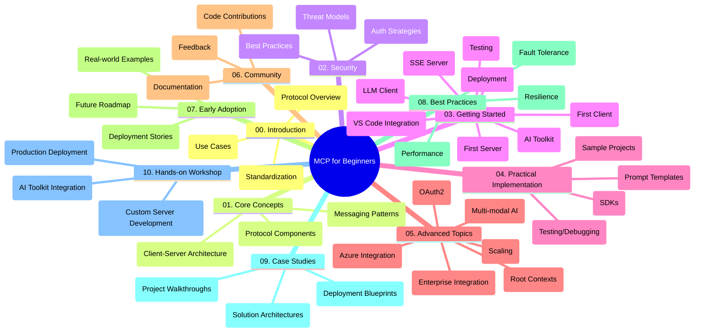

<!--
CO_OP_TRANSLATOR_METADATA:
{
  "original_hash": "a607d4febc94caee9a12b77795f7fc9a",
  "translation_date": "2025-06-11T16:40:29+00:00",
  "source_file": "study_guide.md",
  "language_code": "bn"
}
-->
# Model Context Protocol (MCP) for Beginners - স্টাডি গাইড

এই স্টাডি গাইডটি "Model Context Protocol (MCP) for Beginners" কারিকুলামের রেপোজিটরির কাঠামো এবং বিষয়বস্তু সম্পর্কে একটি সারসংক্ষেপ দেয়। রেপোজিটরিটি দক্ষতার সাথে নেভিগেট করতে এবং উপলব্ধ রিসোর্সগুলো সর্বোচ্চভাবে ব্যবহার করতে এই গাইডটি ব্যবহার করুন।

## Repository Overview

Model Context Protocol (MCP) হলো AI মডেল এবং ক্লায়েন্ট অ্যাপ্লিকেশনগুলোর মধ্যে ইন্টারঅ্যাকশনের জন্য একটি স্ট্যান্ডার্ডাইজড ফ্রেমওয়ার্ক। এই রেপোজিটরিটি AI ডেভেলপার, সিস্টেম আর্কিটেক্ট এবং সফটওয়্যার ইঞ্জিনিয়ারদের জন্য C#, Java, JavaScript, Python, এবং TypeScript-এ হাতে-কলমে কোড উদাহরণের সঙ্গে একটি বিস্তৃত কারিকুলাম প্রদান করে।

## Visual Curriculum Map

## Repository Structure

রেপোজিটরিটি দশটি প্রধান সেকশনে সংগঠিত, প্রতিটি MCP-এর বিভিন্ন দিকের উপর ফোকাস করে:

1. **Introduction (00-Introduction/)**
   - Model Context Protocol এর পরিচিতি
   - AI পাইপলাইনে স্ট্যান্ডার্ডাইজেশনের গুরুত্ব
   - ব্যবহারিক কেস এবং সুবিধাসমূহ

2. **Core Concepts (01-CoreConcepts/)**
   - ক্লায়েন্ট-সার্ভার আর্কিটেকচার
   - মূল প্রোটোকল উপাদানসমূহ
   - MCP-তে মেসেজিং প্যাটার্ন

3. **Security (02-Security/)**
   - MCP-ভিত্তিক সিস্টেমে সিকিউরিটি হুমকি
   - নিরাপদ ইমপ্লিমেন্টেশনের সেরা অনুশীলন
   - অথেন্টিকেশন এবং অথরাইজেশন স্ট্র্যাটেজি

4. **Getting Started (03-GettingStarted/)**
   - পরিবেশ সেটআপ এবং কনফিগারেশন
   - মৌলিক MCP সার্ভার এবং ক্লায়েন্ট তৈরি
   - বিদ্যমান অ্যাপ্লিকেশনের সাথে ইন্টিগ্রেশন
   - প্রথম সার্ভার, প্রথম ক্লায়েন্ট, LLM ক্লায়েন্ট, VS Code ইন্টিগ্রেশন, SSE সার্ভার, AI Toolkit, টেস্টিং এবং ডিপ্লয়মেন্টের সাবসেকশনসমূহ

5. **Practical Implementation (04-PracticalImplementation/)**
   - বিভিন্ন প্রোগ্রামিং ভাষায় SDK ব্যবহার
   - ডিবাগিং, টেস্টিং এবং ভ্যালিডেশন টেকনিক
   - পুনঃব্যবহারযোগ্য প্রম্পট টেমপ্লেট এবং ওয়ার্কফ্লো তৈরি
   - ইমপ্লিমেন্টেশনের উদাহরণসহ স্যাম্পল প্রজেক্ট

6. **Advanced Topics (05-AdvancedTopics/)**
   - মাল্টি-মোডাল AI ওয়ার্কফ্লো এবং সম্প্রসারণযোগ্যতা
   - নিরাপদ স্কেলিং স্ট্র্যাটেজি
   - এন্টারপ্রাইজ ইকোসিস্টেমে MCP
   - বিশেষায়িত বিষয় যেমন Azure ইন্টিগ্রেশন, মাল্টি-মোডালিটি, OAuth2, রুট কনটেক্সট, রাউটিং, স্যাম্পলিং, স্কেলিং, সিকিউরিটি, ওয়েব সার্চ ইন্টিগ্রেশন এবং স্ট্রিমিং।

7. **Community Contributions (06-CommunityContributions/)**
   - কোড এবং ডকুমেন্টেশনে অবদান রাখার উপায়
   - GitHub-এর মাধ্যমে সহযোগিতা
   - কমিউনিটি-চালিত উন্নতি এবং প্রতিক্রিয়া

8. **Lessons from Early Adoption (07-LessonsfromEarlyAdoption/)**
   - বাস্তবায়ন এবং সফলতার গল্প
   - MCP-ভিত্তিক সমাধান নির্মাণ ও ডিপ্লয়মেন্ট
   - ট্রেন্ড এবং ভবিষ্যৎ রোডম্যাপ

9. **Best Practices (08-BestPractices/)**
   - পারফরম্যান্স টিউনিং এবং অপটিমাইজেশন
   - ফল্ট-টলারেন্ট MCP সিস্টেম ডিজাইন
   - টেস্টিং এবং রেজিলিয়েন্স স্ট্র্যাটেজি

10. **Case Studies (09-CaseStudy/)**
    - MCP সমাধান আর্কিটেকচারের গভীর বিশ্লেষণ
    - ডিপ্লয়মেন্ট ব্লুপ্রিন্ট এবং ইন্টিগ্রেশন টিপস
    - এনোটেটেড ডায়াগ্রাম এবং প্রজেক্ট ওয়াকথ্রু

11. **Hands-on Workshop (10-StreamliningAIWorkflowsBuildingAnMCPServerWithAIToolkit/)**
    - Microsoft-এর AI Toolkit সহ MCP-এর ব্যাপক হাতে-কলমে কর্মশালা
    - AI মডেল এবং বাস্তব বিশ্বের টুলসের মধ্যে বুদ্ধিমান অ্যাপ্লিকেশন নির্মাণ
    - মৌলিক, কাস্টম সার্ভার ডেভেলপমেন্ট এবং প্রোডাকশন ডিপ্লয়মেন্ট কভার করা প্র্যাকটিক্যাল মডিউলসমূহ

## Sample Projects

রেপোজিটরিতে বিভিন্ন প্রোগ্রামিং ভাষায় MCP ইমপ্লিমেন্টেশন প্রদর্শন করে এমন একাধিক স্যাম্পল প্রজেক্ট রয়েছে:

### Basic MCP Calculator Samples
- C# MCP সার্ভার উদাহরণ
- Java MCP ক্যালকুলেটর
- JavaScript MCP ডেমো
- Python MCP সার্ভার
- TypeScript MCP উদাহরণ

### Advanced MCP Calculator Projects
- উন্নত C# স্যাম্পল
- Java কন্টেইনার অ্যাপ উদাহরণ
- JavaScript উন্নত স্যাম্পল
- Python জটিল ইমপ্লিমেন্টেশন
- TypeScript কন্টেইনার স্যাম্পল

## Additional Resources

রেপোজিটরিতে সহায়ক রিসোর্স রয়েছে:

- **Images folder**: কারিকুলামের বিভিন্ন ডায়াগ্রাম এবং চিত্রাদি ধারণ করে
- **Translations**: ডকুমেন্টেশনের স্বয়ংক্রিয় বহু-ভাষা অনুবাদ সহ
- **Official MCP Resources**:
  - [MCP Documentation](https://modelcontextprotocol.io/)
  - [MCP Specification](https://spec.modelcontextprotocol.io/)
  - [MCP GitHub Repository](https://github.com/modelcontextprotocol)

## How to Use This Repository

1. **ক্রমাগত শেখা**: একটি কাঠামোবদ্ধ শেখার জন্য অধ্যায়গুলো (00 থেকে 10) অনুসরণ করুন।
2. **ভাষা-নির্দিষ্ট ফোকাস**: যদি নির্দিষ্ট কোনো প্রোগ্রামিং ভাষায় আগ্রহ থাকে, তবে স্যাম্পল ডিরেক্টরিগুলো থেকে আপনার পছন্দের ভাষায় ইমপ্লিমেন্টেশন দেখুন।
3. **প্র্যাকটিক্যাল ইমপ্লিমেন্টেশন**: পরিবেশ সেটআপ এবং প্রথম MCP সার্ভার ও ক্লায়েন্ট তৈরি করার জন্য "Getting Started" সেকশন দিয়ে শুরু করুন।
4. **উন্নত অনুসন্ধান**: মৌলিক বিষয়গুলোতে দক্ষ হয়ে গেলে, আপনার জ্ঞান বিস্তারের জন্য অ্যাডভান্সড টপিকগুলো অন্বেষণ করুন।
5. **কমিউনিটি এনগেজমেন্ট**: বিশেষজ্ঞ এবং অন্যান্য ডেভেলপারদের সাথে যুক্ত হতে [Azure AI Foundry Discord](https://discord.com/invite/ByRwuEEgH4) এ যোগ দিন।

## Contributing

এই রেপোজিটরিতে কমিউনিটির অবদানকে স্বাগত জানানো হয়। অবদান রাখার নির্দেশনার জন্য Community Contributions সেকশন দেখুন।

---

*এই স্টাডি গাইডটি ১১ জুন, ২০২৫ তারিখে তৈরি করা হয়েছে এবং ওই সময়ের রেপোজিটরির সারাংশ প্রদান করে। রেপোজিটরির বিষয়বস্তু সেদিনের পর থেকে আপডেট হতে পারে।*

**অস্বীকৃতি**:  
এই নথিটি AI অনুবাদ সেবা [Co-op Translator](https://github.com/Azure/co-op-translator) ব্যবহার করে অনূদিত হয়েছে। আমরা যথাসাধ্য সঠিকতার চেষ্টা করি, তবে দয়া করে মনে রাখবেন যে স্বয়ংক্রিয় অনুবাদে ত্রুটি বা অসঙ্গতি থাকতে পারে। মূল নথি তার নিজস্ব ভাষায় কর্তৃপক্ষপ্রাপ্ত উৎস হিসেবে বিবেচিত হওয়া উচিত। গুরুত্বপূর্ণ তথ্যের জন্য পেশাদার মানব অনুবাদ গ্রহণ করার পরামর্শ দেওয়া হয়। এই অনুবাদের ব্যবহার থেকে সৃষ্ট কোনো ভুল বোঝাবুঝি বা ভুল ব্যাখ্যার জন্য আমরা দায়ী নই।