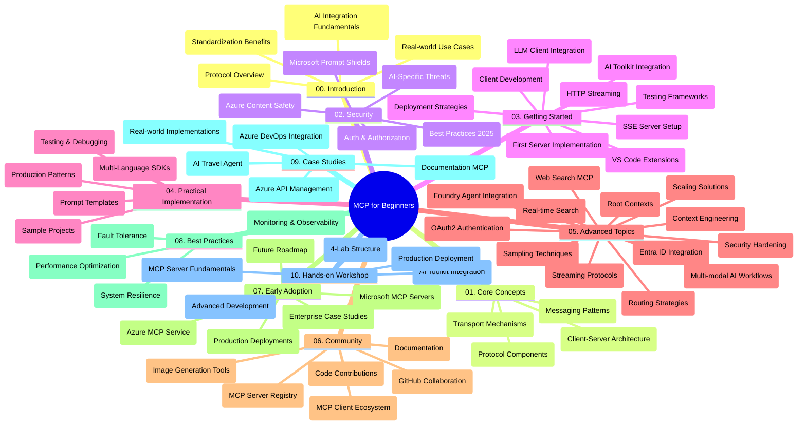

<!--
CO_OP_TRANSLATOR_METADATA:
{
  "original_hash": "e2c6ed897fa98fa08e0146101776c7ff",
  "translation_date": "2025-07-18T09:30:45+00:00",
  "source_file": "study_guide.md",
  "language_code": "bn"
}
-->
# Model Context Protocol (MCP) for Beginners - স্টাডি গাইড

এই স্টাডি গাইডটি "Model Context Protocol (MCP) for Beginners" কারিকুলামের জন্য রিপোজিটরির কাঠামো এবং বিষয়বস্তুর একটি সারসংক্ষেপ প্রদান করে। এই গাইডটি ব্যবহার করে আপনি রিপোজিটরিটি দক্ষতার সাথে নেভিগেট করতে পারবেন এবং উপলব্ধ রিসোর্সগুলো থেকে সর্বোচ্চ সুবিধা নিতে পারবেন।

## রিপোজিটরি ওভারভিউ

Model Context Protocol (MCP) হলো AI মডেল এবং ক্লায়েন্ট অ্যাপ্লিকেশনগুলোর মধ্যে ইন্টারঅ্যাকশনের জন্য একটি স্ট্যান্ডার্ডাইজড ফ্রেমওয়ার্ক। প্রথমে Anthropic দ্বারা তৈরি MCP এখন অফিসিয়াল GitHub অর্গানাইজেশনের মাধ্যমে বিস্তৃত MCP কমিউনিটি দ্বারা রক্ষণাবেক্ষণ করা হয়। এই রিপোজিটরিটি AI ডেভেলপার, সিস্টেম আর্কিটেক্ট এবং সফটওয়্যার ইঞ্জিনিয়ারদের জন্য C#, Java, JavaScript, Python, এবং TypeScript-এ হাতে কলমে কোড উদাহরণসহ একটি ব্যাপক কারিকুলাম প্রদান করে।

## ভিজ্যুয়াল কারিকুলাম ম্যাপ

## রিপোজিটরি কাঠামো

রিপোজিটরিটি দশটি প্রধান সেকশনে বিভক্ত, প্রতিটি MCP-এর বিভিন্ন দিকের উপর ফোকাস করে:

1. **Introduction (00-Introduction/)**
   - Model Context Protocol-এর পরিচিতি
   - AI পাইপলাইনে স্ট্যান্ডার্ডাইজেশনের গুরুত্ব
   - ব্যবহারিক কেস এবং সুবিধাসমূহ

2. **Core Concepts (01-CoreConcepts/)**
   - ক্লায়েন্ট-সার্ভার আর্কিটেকচার
   - মূল প্রোটোকল উপাদানসমূহ
   - MCP-তে মেসেজিং প্যাটার্ন

3. **Security (02-Security/)**
   - MCP-ভিত্তিক সিস্টেমে সিকিউরিটি হুমকি
   - সুরক্ষিত ইমপ্লিমেন্টেশনের সেরা অনুশীলন
   - অথেনটিকেশন এবং অথরাইজেশন কৌশল
   - **সম্পূর্ণ সিকিউরিটি ডকুমেন্টেশন**:
     - MCP Security Best Practices 2025
     - Azure Content Safety Implementation Guide
     - MCP Security Controls and Techniques
     - MCP Best Practices Quick Reference
   - **মূল সিকিউরিটি বিষয়সমূহ**:
     - প্রম্পট ইনজেকশন এবং টুল পয়জনিং আক্রমণ
     - সেশন হাইজ্যাকিং এবং কনফিউজড ডেপুটি সমস্যা
     - টোকেন পাসথ্রু দুর্বলতা
     - অতিরিক্ত অনুমতি এবং অ্যাক্সেস কন্ট্রোল
     - AI কম্পোনেন্টের সাপ্লাই চেইন সিকিউরিটি
     - Microsoft Prompt Shields ইন্টিগ্রেশন

4. **Getting Started (03-GettingStarted/)**
   - পরিবেশ সেটআপ এবং কনফিগারেশন
   - বেসিক MCP সার্ভার এবং ক্লায়েন্ট তৈরি
   - বিদ্যমান অ্যাপ্লিকেশনের সাথে ইন্টিগ্রেশন
   - অন্তর্ভুক্ত সেকশনসমূহ:
     - প্রথম সার্ভার ইমপ্লিমেন্টেশন
     - ক্লায়েন্ট ডেভেলপমেন্ট
     - LLM ক্লায়েন্ট ইন্টিগ্রেশন
     - VS Code ইন্টিগ্রেশন
     - সার্ভার-সেন্ট ইভেন্টস (SSE) সার্ভার
     - HTTP স্ট্রিমিং
     - AI Toolkit ইন্টিগ্রেশন
     - টেস্টিং কৌশল
     - ডিপ্লয়মেন্ট গাইডলাইন

5. **Practical Implementation (04-PracticalImplementation/)**
   - বিভিন্ন প্রোগ্রামিং ভাষায় SDK ব্যবহার
   - ডিবাগিং, টেস্টিং এবং ভ্যালিডেশন পদ্ধতি
   - পুনঃব্যবহারযোগ্য প্রম্পট টেমপ্লেট এবং ওয়ার্কফ্লো তৈরি
   - ইমপ্লিমেন্টেশন উদাহরণসহ স্যাম্পল প্রজেক্ট

6. **Advanced Topics (05-AdvancedTopics/)**
   - কনটেক্সট ইঞ্জিনিয়ারিং কৌশল
   - Foundry এজেন্ট ইন্টিগ্রেশন
   - মাল্টি-মোডাল AI ওয়ার্কফ্লো
   - OAuth2 অথেনটিকেশন ডেমো
   - রিয়েল-টাইম সার্চ ক্ষমতা
   - রিয়েল-টাইম স্ট্রিমিং
   - রুট কনটেক্সট ইমপ্লিমেন্টেশন
   - রাউটিং কৌশল
   - স্যাম্পলিং পদ্ধতি
   - স্কেলিং পদ্ধতি
   - সিকিউরিটি বিবেচনা
   - Entra ID সিকিউরিটি ইন্টিগ্রেশন
   - ওয়েব সার্চ ইন্টিগ্রেশন

7. **Community Contributions (06-CommunityContributions/)**
   - কোড এবং ডকুমেন্টেশনে অবদান রাখার উপায়
   - GitHub-এর মাধ্যমে সহযোগিতা
   - কমিউনিটি-চালিত উন্নয়ন এবং ফিডব্যাক
   - বিভিন্ন MCP ক্লায়েন্ট ব্যবহার (Claude Desktop, Cline, VSCode)
   - জনপ্রিয় MCP সার্ভারগুলোর সাথে কাজ, যার মধ্যে ইমেজ জেনারেশন অন্তর্ভুক্ত

8. **Lessons from Early Adoption (07-LessonsfromEarlyAdoption/)**
   - বাস্তব জীবনের ইমপ্লিমেন্টেশন এবং সফলতার গল্প
   - MCP-ভিত্তিক সমাধান তৈরি এবং ডিপ্লয়মেন্ট
   - প্রবণতা এবং ভবিষ্যৎ রোডম্যাপ
   - **Microsoft MCP Servers Guide**: ১০টি প্রোডাকশন-রেডি Microsoft MCP সার্ভারের বিস্তৃত গাইড, যার মধ্যে রয়েছে:
     - Microsoft Learn Docs MCP Server
     - Azure MCP Server (১৫+ বিশেষায়িত কানেক্টর)
     - GitHub MCP Server
     - Azure DevOps MCP Server
     - MarkItDown MCP Server
     - SQL Server MCP Server
     - Playwright MCP Server
     - Dev Box MCP Server
     - Azure AI Foundry MCP Server
     - Microsoft 365 Agents Toolkit MCP Server

9. **Best Practices (08-BestPractices/)**
   - পারফরম্যান্স টিউনিং এবং অপ্টিমাইজেশন
   - ফল্ট-টলারেন্ট MCP সিস্টেম ডিজাইন
   - টেস্টিং এবং রেজিলিয়েন্স কৌশল

10. **Case Studies (09-CaseStudy/)**
    - Azure API Management ইন্টিগ্রেশন স্যাম্পল
    - ট্রাভেল এজেন্ট ইমপ্লিমেন্টেশন স্যাম্পল
    - Azure DevOps ইন্টিগ্রেশন সহ YouTube আপডেট
    - ডকুমেন্টেশন MCP ইমপ্লিমেন্টেশন উদাহরণ
    - বিস্তারিত ডকুমেন্টেশনসহ ইমপ্লিমেন্টেশন উদাহরণ

11. **Hands-on Workshop (10-StreamliningAIWorkflowsBuildingAnMCPServerWithAIToolkit/)**
    - MCP এবং AI Toolkit একত্রিত করে ব্যাপক হাতে কলমে ওয়ার্কশপ
    - AI মডেল এবং বাস্তব বিশ্বের টুলসের মধ্যে বুদ্ধিমান অ্যাপ্লিকেশন তৈরি
    - মৌলিক বিষয়, কাস্টম সার্ভার ডেভেলপমেন্ট, এবং প্রোডাকশন ডিপ্লয়মেন্ট কৌশল নিয়ে ব্যবহারিক মডিউল
    - **ল্যাব কাঠামো**:
      - ল্যাব ১: MCP সার্ভার মৌলিক বিষয়
      - ল্যাব ২: উন্নত MCP সার্ভার ডেভেলপমেন্ট
      - ল্যাব ৩: AI Toolkit ইন্টিগ্রেশন
      - ল্যাব ৪: প্রোডাকশন ডিপ্লয়মেন্ট এবং স্কেলিং
    - ধাপে ধাপে নির্দেশনা সহ ল্যাব-ভিত্তিক শেখার পদ্ধতি

## অতিরিক্ত রিসোর্স

রিপোজিটরিতে সহায়ক রিসোর্স অন্তর্ভুক্ত:

- **Images ফোল্ডার**: কারিকুলামের বিভিন্ন অংশে ব্যবহৃত ডায়াগ্রাম এবং চিত্রসমূহ
- **Translations**: ডকুমেন্টেশনের স্বয়ংক্রিয় অনুবাদসহ বহু-ভাষা সমর্থন
- **অফিসিয়াল MCP রিসোর্স**:
  - [MCP Documentation](https://modelcontextprotocol.io/)
  - [MCP Specification](https://spec.modelcontextprotocol.io/)
  - [MCP GitHub Repository](https://github.com/modelcontextprotocol)

## এই রিপোজিটরি কীভাবে ব্যবহার করবেন

1. **ক্রমবদ্ধ শেখা**: একটি সংগঠিত শেখার অভিজ্ঞতার জন্য অধ্যায়গুলো (০০ থেকে ১০) অনুসরণ করুন।
2. **ভাষা-নির্দিষ্ট ফোকাস**: যদি আপনি নির্দিষ্ট কোনো প্রোগ্রামিং ভাষায় আগ্রহী হন, তাহলে আপনার পছন্দের ভাষার ইমপ্লিমেন্টেশন স্যাম্পল ডিরেক্টরিগুলো অন্বেষণ করুন।
3. **প্রায়োগিক ইমপ্লিমেন্টেশন**: পরিবেশ সেটআপ এবং প্রথম MCP সার্ভার ও ক্লায়েন্ট তৈরি করতে "Getting Started" সেকশন থেকে শুরু করুন।
4. **উন্নত অনুসন্ধান**: মৌলিক বিষয়গুলো বুঝে গেলে, আপনার জ্ঞান বাড়াতে উন্নত বিষয়গুলোতে প্রবেশ করুন।
5. **কমিউনিটি এনগেজমেন্ট**: MCP কমিউনিটির সাথে GitHub আলোচনা এবং Discord চ্যানেলের মাধ্যমে যুক্ত হয়ে বিশেষজ্ঞ এবং অন্যান্য ডেভেলপারদের সাথে সংযোগ স্থাপন করুন।

## MCP ক্লায়েন্ট এবং টুলস

কারিকুলামে বিভিন্ন MCP ক্লায়েন্ট এবং টুলস কভার করা হয়েছে:

1. **অফিসিয়াল ক্লায়েন্টস**:
   - Visual Studio Code
   - MCP in Visual Studio Code
   - Claude Desktop
   - Claude in VSCode
   - Claude API

2. **কমিউনিটি ক্লায়েন্টস**:
   - Cline (টার্মিনাল-ভিত্তিক)
   - Cursor (কোড এডিটর)
   - ChatMCP
   - Windsurf

3. **MCP ম্যানেজমেন্ট টুলস**:
   - MCP CLI
   - MCP Manager
   - MCP Linker
   - MCP Router

## জনপ্রিয় MCP সার্ভারসমূহ

রিপোজিটরিতে বিভিন্ন MCP সার্ভার পরিচয় করানো হয়েছে, যার মধ্যে রয়েছে:

1. **অফিসিয়াল Microsoft MCP সার্ভারসমূহ**:
   - Microsoft Learn Docs MCP Server
   - Azure MCP Server (১৫+ বিশেষায়িত কানেক্টর)
   - GitHub MCP Server
   - Azure DevOps MCP Server
   - MarkItDown MCP Server
   - SQL Server MCP Server
   - Playwright MCP Server
   - Dev Box MCP Server
   - Azure AI Foundry MCP Server
   - Microsoft 365 Agents Toolkit MCP Server

2. **অফিসিয়াল রেফারেন্স সার্ভারসমূহ**:
   - Filesystem
   - Fetch
   - Memory
   - Sequential Thinking

3. **ইমেজ জেনারেশন**:
   - Azure OpenAI DALL-E 3
   - Stable Diffusion WebUI
   - Replicate

4. **ডেভেলপমেন্ট টুলস**:
   - Git MCP
   - Terminal Control
   - Code Assistant

5. **বিশেষায়িত সার্ভারসমূহ**:
   - Salesforce
   - Microsoft Teams
   - Jira & Confluence

## অবদান রাখা

এই রিপোজিটরি কমিউনিটির অবদানকে স্বাগত জানায়। MCP ইকোসিস্টেমে কার্যকরভাবে অবদান রাখার জন্য Community Contributions সেকশনটি দেখুন।

## চেঞ্জলগ

| তারিখ | পরিবর্তনসমূহ |
|-------|--------------|
| জুলাই ১৮, ২০২৫ | - Microsoft MCP Servers Guide অন্তর্ভুক্ত করে রিপোজিটরি কাঠামো আপডেট - ১০টি প্রোডাকশন-রেডি Microsoft MCP সার্ভারের বিস্তৃত তালিকা যোগ - জনপ্রিয় MCP সার্ভার সেকশন অফিসিয়াল Microsoft MCP সার্ভারসহ উন্নত করা হয়েছে - Case Studies সেকশন বাস্তব ফাইল উদাহরণসহ আপডেট - Hands-on Workshop-এর জন্য ল্যাব কাঠামোর বিস্তারিত যোগ |
| জুলাই ১৬, ২০২৫ | - বর্তমান বিষয়বস্তু প্রতিফলিত করতে রিপোজিটরি কাঠামো আপডেট - MCP ক্লায়েন্ট এবং টুলস সেকশন যোগ - জনপ্রিয় MCP সার্ভার সেকশন যোগ - ভিজ্যুয়াল কারিকুলাম ম্যাপ বর্তমান বিষয়বস্তু সহ আপডেট - উন্নত বিষয়সমূহ সেকশন সব বিশেষায়িত ক্ষেত্রসহ উন্নত করা হয়েছে - Case Studies বাস্তব উদাহরণ সহ আপডেট - MCP-এর উৎপত্তি Anthropic দ্বারা তৈরি হওয়া স্পষ্ট করা হয়েছে |
| জুন ১১, ২০২৫ | - স্টাডি গাইডের প্রাথমিক সৃষ্টি - ভিজ্যুয়াল কারিকুলাম ম্যাপ যোগ - রিপোজিটরি কাঠামো রূপরেখা - স্যাম্পল প্রজেক্ট এবং অতিরিক্ত রিসোর্স অন্তর্ভুক্ত |

---

*এই স্টাডি গাইডটি জুলাই ১৮, ২০২৫ তারিখে আপডেট করা হয়েছে এবং ওই তারিখ পর্যন্ত রিপোজিটরির সারসংক্ষেপ প্রদান করে। তারপরে রিপোজিটরির বিষয়বস্তু আপডেট হতে পারে।*

**অস্বীকৃতি**:  
এই নথিটি AI অনুবাদ সেবা [Co-op Translator](https://github.com/Azure/co-op-translator) ব্যবহার করে অনূদিত হয়েছে। আমরা যথাসাধ্য সঠিকতার চেষ্টা করি, তবে স্বয়ংক্রিয় অনুবাদে ত্রুটি বা অসঙ্গতি থাকতে পারে। মূল নথিটি তার নিজস্ব ভাষায়ই কর্তৃত্বপূর্ণ উৎস হিসেবে বিবেচিত হওয়া উচিত। গুরুত্বপূর্ণ তথ্যের জন্য পেশাদার মানব অনুবাদ গ্রহণ করার পরামর্শ দেওয়া হয়। এই অনুবাদের ব্যবহারে সৃষ্ট কোনো ভুল বোঝাবুঝি বা ভুল ব্যাখ্যার জন্য আমরা দায়ী নই।