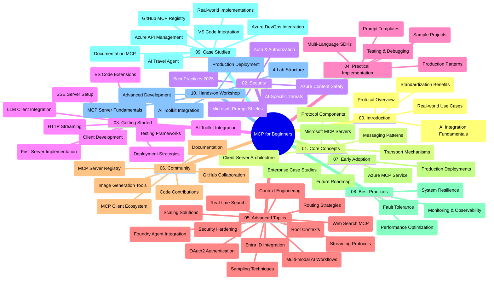

<!--
CO_OP_TRANSLATOR_METADATA:
{
  "original_hash": "719117a0a5f34ade7b5dfb61ee06fb13",
  "translation_date": "2025-09-26T18:03:08+00:00",
  "source_file": "study_guide.md",
  "language_code": "bn"
}
-->
# মডেল কনটেক্সট প্রোটোকল (MCP) শিক্ষার্থীদের জন্য - স্টাডি গাইড

এই স্টাডি গাইডটি "মডেল কনটেক্সট প্রোটোকল (MCP) শিক্ষার্থীদের জন্য" কারিকুলামের রেপোজিটরি কাঠামো এবং বিষয়বস্তুর একটি সংক্ষিপ্ত বিবরণ প্রদান করে। রেপোজিটরিটি দক্ষতার সাথে নেভিগেট করতে এবং উপলব্ধ রিসোর্সগুলোর সর্বোচ্চ ব্যবহার করতে এই গাইডটি ব্যবহার করুন।

## রেপোজিটরি সংক্ষিপ্ত বিবরণ

মডেল কনটেক্সট প্রোটোকল (MCP) হলো একটি মানসম্মত কাঠামো যা AI মডেল এবং ক্লায়েন্ট অ্যাপ্লিকেশনের মধ্যে ইন্টারঅ্যাকশন পরিচালনা করে। প্রথমে Anthropic দ্বারা তৈরি, MCP এখন বৃহত্তর MCP কমিউনিটি দ্বারা অফিসিয়াল GitHub অর্গানাইজেশনের মাধ্যমে রক্ষণাবেক্ষণ করা হয়। এই রেপোজিটরি একটি বিস্তৃত কারিকুলাম প্রদান করে, যেখানে C#, Java, JavaScript, Python এবং TypeScript-এ হাতে-কলমে কোড উদাহরণ রয়েছে, যা AI ডেভেলপার, সিস্টেম আর্কিটেক্ট এবং সফটওয়্যার ইঞ্জিনিয়ারদের জন্য ডিজাইন করা হয়েছে।

## ভিজ্যুয়াল কারিকুলাম ম্যাপ

## রেপোজিটরি কাঠামো

রেপোজিটরিটি দশটি প্রধান বিভাগে সংগঠিত, যেখানে MCP-এর বিভিন্ন দিক নিয়ে আলোচনা করা হয়েছে:

1. **ভূমিকা (00-Introduction/)**
   - মডেল কনটেক্সট প্রোটোকলের সংক্ষিপ্ত বিবরণ
   - AI পাইপলাইনে মানসম্মতকরণের গুরুত্ব
   - ব্যবহারিক ব্যবহার এবং সুবিধা

2. **মূল ধারণা (01-CoreConcepts/)**
   - ক্লায়েন্ট-সার্ভার আর্কিটেকচার
   - প্রোটোকলের প্রধান উপাদান
   - MCP-তে মেসেজিং প্যাটার্ন

3. **নিরাপত্তা (02-Security/)**
   - MCP-ভিত্তিক সিস্টেমে নিরাপত্তা হুমকি
   - নিরাপত্তা বাস্তবায়নের সেরা পদ্ধতি
   - প্রমাণীকরণ এবং অনুমোদন কৌশল
   - **বিস্তৃত নিরাপত্তা ডকুমেন্টেশন**:
     - MCP নিরাপত্তা সেরা পদ্ধতি ২০২৫
     - Azure কন্টেন্ট সেফটি বাস্তবায়ন গাইড
     - MCP নিরাপত্তা নিয়ন্ত্রণ এবং কৌশল
     - MCP সেরা পদ্ধতির দ্রুত রেফারেন্স
   - **প্রধান নিরাপত্তা বিষয়**:
     - প্রম্পট ইনজেকশন এবং টুল পয়জনিং আক্রমণ
     - সেশন হাইজ্যাকিং এবং বিভ্রান্ত ডেপুটি সমস্যা
     - টোকেন পাসথ্রু দুর্বলতা
     - অতিরিক্ত অনুমতি এবং অ্যাক্সেস নিয়ন্ত্রণ
     - AI উপাদানগুলোর সরবরাহ চেইন নিরাপত্তা
     - Microsoft Prompt Shields ইন্টিগ্রেশন

4. **শুরু করা (03-GettingStarted/)**
   - পরিবেশ সেটআপ এবং কনফিগারেশন
   - বেসিক MCP সার্ভার এবং ক্লায়েন্ট তৈরি
   - বিদ্যমান অ্যাপ্লিকেশনের সাথে ইন্টিগ্রেশন
   - অন্তর্ভুক্ত বিভাগ:
     - প্রথম সার্ভার বাস্তবায়ন
     - ক্লায়েন্ট ডেভেলপমেন্ট
     - LLM ক্লায়েন্ট ইন্টিগ্রেশন
     - VS Code ইন্টিগ্রেশন
     - Server-Sent Events (SSE) সার্ভার
     - HTTP স্ট্রিমিং
     - AI Toolkit ইন্টিগ্রেশন
     - টেস্টিং কৌশল
     - ডিপ্লয়মেন্ট নির্দেশিকা

5. **ব্যবহারিক বাস্তবায়ন (04-PracticalImplementation/)**
   - বিভিন্ন প্রোগ্রামিং ভাষায় SDK ব্যবহার
   - ডিবাগিং, টেস্টিং এবং যাচাইকরণ কৌশল
   - পুনর্ব্যবহারযোগ্য প্রম্পট টেমপ্লেট এবং ওয়ার্কফ্লো তৈরি
   - বাস্তবায়নের উদাহরণ সহ নমুনা প্রকল্প

6. **উন্নত বিষয় (05-AdvancedTopics/)**
   - কনটেক্সট ইঞ্জিনিয়ারিং কৌশল
   - Foundry এজেন্ট ইন্টিগ্রেশন
   - মাল্টি-মোডাল AI ওয়ার্কফ্লো
   - OAuth2 প্রমাণীকরণ ডেমো
   - রিয়েল-টাইম সার্চ সক্ষমতা
   - রিয়েল-টাইম স্ট্রিমিং
   - রুট কনটেক্সট বাস্তবায়ন
   - রাউটিং কৌশল
   - স্যাম্পলিং কৌশল
   - স্কেলিং পদ্ধতি
   - নিরাপত্তা বিবেচনা
   - Entra ID নিরাপত্তা ইন্টিগ্রেশন
   - ওয়েব সার্চ ইন্টিগ্রেশন

7. **কমিউনিটি অবদান (06-CommunityContributions/)**
   - কোড এবং ডকুমেন্টেশন অবদান রাখার পদ্ধতি
   - GitHub-এর মাধ্যমে সহযোগিতা
   - কমিউনিটি-চালিত উন্নতি এবং প্রতিক্রিয়া
   - বিভিন্ন MCP ক্লায়েন্ট ব্যবহার (Claude Desktop, Cline, VSCode)
   - জনপ্রিয় MCP সার্ভার নিয়ে কাজ করা, যার মধ্যে ইমেজ জেনারেশন অন্তর্ভুক্ত

8. **প্রাথমিক গ্রহণের শিক্ষা (07-LessonsfromEarlyAdoption/)**
   - বাস্তবায়ন এবং সফলতার গল্প
   - MCP-ভিত্তিক সমাধান তৈরি এবং ডিপ্লয়মেন্ট
   - প্রবণতা এবং ভবিষ্যতের রোডম্যাপ
   - **Microsoft MCP সার্ভার গাইড**: ১০টি প্রোডাকশন-রেডি Microsoft MCP সার্ভারের বিস্তৃত গাইড, যার মধ্যে রয়েছে:
     - Microsoft Learn Docs MCP Server
     - Azure MCP Server (১৫+ বিশেষায়িত কানেক্টর)
     - GitHub MCP Server
     - Azure DevOps MCP Server
     - MarkItDown MCP Server
     - SQL Server MCP Server
     - Playwright MCP Server
     - Dev Box MCP Server
     - Azure AI Foundry MCP Server
     - Microsoft 365 Agents Toolkit MCP Server

9. **সেরা পদ্ধতি (08-BestPractices/)**
   - পারফরম্যান্স টিউনিং এবং অপ্টিমাইজেশন
   - ফল্ট-টলারেন্ট MCP সিস্টেম ডিজাইন
   - টেস্টিং এবং রেজিলিয়েন্স কৌশল

10. **কেস স্টাডি (09-CaseStudy/)**
    - **সাতটি বিস্তৃত কেস স্টাডি** যা MCP-এর বহুমুখিতা বিভিন্ন পরিস্থিতিতে প্রদর্শন করে:
    - **Azure AI Travel Agents**: Azure OpenAI এবং AI Search-এর সাথে মাল্টি-এজেন্ট অর্কেস্ট্রেশন
    - **Azure DevOps Integration**: YouTube ডেটা আপডেটের মাধ্যমে ওয়ার্কফ্লো প্রক্রিয়া অটোমেশন
    - **রিয়েল-টাইম ডকুমেন্টেশন রিট্রিভাল**: স্ট্রিমিং HTTP সহ Python কনসোল ক্লায়েন্ট
    - **ইন্টারঅ্যাকটিভ স্টাডি প্ল্যান জেনারেটর**: চেইনলিট ওয়েব অ্যাপের সাথে কথোপকথন AI
    - **ইন-এডিটর ডকুমেন্টেশন**: GitHub Copilot ওয়ার্কফ্লো সহ VS Code ইন্টিগ্রেশন
    - **Azure API Management**: এন্টারপ্রাইজ API ইন্টিগ্রেশন MCP সার্ভার তৈরি
    - **GitHub MCP Registry**: ইকোসিস্টেম ডেভেলপমেন্ট এবং এজেন্টিক ইন্টিগ্রেশন প্ল্যাটফর্ম
    - বাস্তবায়নের উদাহরণ যা এন্টারপ্রাইজ ইন্টিগ্রেশন, ডেভেলপার প্রোডাক্টিভিটি এবং ইকোসিস্টেম ডেভেলপমেন্টকে অন্তর্ভুক্ত করে

11. **হ্যান্ডস-অন ওয়ার্কশপ (10-StreamliningAIWorkflowsBuildingAnMCPServerWithAIToolkit/)**
    - MCP এবং AI Toolkit-এর সমন্বয়ে একটি বিস্তৃত হ্যান্ডস-অন ওয়ার্কশপ
    - AI মডেল এবং বাস্তব-জগতের টুলগুলোর মধ্যে সেতুবন্ধন তৈরি করে বুদ্ধিমান অ্যাপ্লিকেশন তৈরি
    - মৌলিক বিষয়, কাস্টম সার্ভার ডেভেলপমেন্ট এবং প্রোডাকশন ডিপ্লয়মেন্ট কৌশল নিয়ে ব্যবহারিক মডিউল
    - **ল্যাব কাঠামো**:
      - ল্যাব ১: MCP সার্ভার মৌলিক বিষয়
      - ল্যাব ২: উন্নত MCP সার্ভার ডেভেলপমেন্ট
      - ল্যাব ৩: AI Toolkit ইন্টিগ্রেশন
      - ল্যাব ৪: প্রোডাকশন ডিপ্লয়মেন্ট এবং স্কেলিং
    - ধাপে ধাপে নির্দেশনা সহ ল্যাব-ভিত্তিক শিক্ষার পদ্ধতি

## অতিরিক্ত রিসোর্স

রেপোজিটরিতে সহায়ক রিসোর্স অন্তর্ভুক্ত রয়েছে:

- **ইমেজ ফোল্ডার**: কারিকুলামের বিভিন্ন অংশে ব্যবহৃত ডায়াগ্রাম এবং ইলাস্ট্রেশন
- **অনুবাদ**: ডকুমেন্টেশনের স্বয়ংক্রিয় অনুবাদ সহ বহু-ভাষার সমর্থন
- **অফিসিয়াল MCP রিসোর্স**:
  - [MCP ডকুমেন্টেশন](https://modelcontextprotocol.io/)
  - [MCP স্পেসিফিকেশন](https://spec.modelcontextprotocol.io/)
  - [MCP GitHub রেপোজিটরি](https://github.com/modelcontextprotocol)

## এই রেপোজিটরি কীভাবে ব্যবহার করবেন

1. **ক্রমিক শেখা**: একটি গঠিত শিক্ষার অভিজ্ঞতার জন্য অধ্যায়গুলো ক্রমানুসারে অনুসরণ করুন (00 থেকে 10 পর্যন্ত)।
2. **ভাষা-নির্দিষ্ট ফোকাস**: যদি আপনি নির্দিষ্ট প্রোগ্রামিং ভাষায় আগ্রহী হন, আপনার পছন্দের ভাষায় বাস্তবায়নের জন্য স্যাম্পল ডিরেক্টরি অন্বেষণ করুন।
3. **ব্যবহারিক বাস্তবায়ন**: আপনার পরিবেশ সেটআপ করতে এবং আপনার প্রথম MCP সার্ভার এবং ক্লায়েন্ট তৈরি করতে "শুরু করা" বিভাগ থেকে শুরু করুন।
4. **উন্নত অনুসন্ধান**: মৌলিক বিষয়গুলোতে স্বাচ্ছন্দ্য বোধ করার পরে, উন্নত বিষয়গুলোতে ডুব দিন।
5. **কমিউনিটি এনগেজমেন্ট**: GitHub আলোচনা এবং Discord চ্যানেলের মাধ্যমে MCP কমিউনিটিতে যোগ দিন, বিশেষজ্ঞ এবং অন্যান্য ডেভেলপারদের সাথে সংযোগ স্থাপন করুন।

## MCP ক্লায়েন্ট এবং টুল

কারিকুলামে বিভিন্ন MCP ক্লায়েন্ট এবং টুল অন্তর্ভুক্ত রয়েছে:

1. **অফিসিয়াল ক্লায়েন্ট**:
   - Visual Studio Code 
   - MCP in Visual Studio Code
   - Claude Desktop
   - Claude in VSCode 
   - Claude API

2. **কমিউনিটি ক্লায়েন্ট**:
   - Cline (টার্মিনাল-ভিত্তিক)
   - Cursor (কোড এডিটর)
   - ChatMCP
   - Windsurf

3. **MCP ম্যানেজমেন্ট টুল**:
   - MCP CLI
   - MCP Manager
   - MCP Linker
   - MCP Router

## জনপ্রিয় MCP সার্ভার

রেপোজিটরিতে বিভিন্ন MCP সার্ভার পরিচিতি দেওয়া হয়েছে, যার মধ্যে রয়েছে:

1. **অফিসিয়াল Microsoft MCP সার্ভার**:
   - Microsoft Learn Docs MCP Server
   - Azure MCP Server (১৫+ বিশেষায়িত কানেক্টর)
   - GitHub MCP Server
   - Azure DevOps MCP Server
   - MarkItDown MCP Server
   - SQL Server MCP Server
   - Playwright MCP Server
   - Dev Box MCP Server
   - Azure AI Foundry MCP Server
   - Microsoft 365 Agents Toolkit MCP Server

2. **অফিসিয়াল রেফারেন্স সার্ভার**:
   - Filesystem
   - Fetch
   - Memory
   - Sequential Thinking

3. **ইমেজ জেনারেশন**:
   - Azure OpenAI DALL-E 3
   - Stable Diffusion WebUI
   - Replicate

4. **ডেভেলপমেন্ট টুল**:
   - Git MCP
   - Terminal Control
   - Code Assistant

5. **বিশেষায়িত সার্ভার**:
   - Salesforce
   - Microsoft Teams
   - Jira & Confluence

## অবদান রাখা

এই রেপোজিটরি কমিউনিটির অবদানকে স্বাগত জানায়। MCP ইকোসিস্টেমে কার্যকরভাবে অবদান রাখার নির্দেশনার জন্য কমিউনিটি অবদান বিভাগ দেখুন।

## পরিবর্তনের ইতিহাস

| তারিখ | পরিবর্তন |
|------|---------|
| ২৬ সেপ্টেম্বর, ২০২৫ | - 09-CaseStudy বিভাগে GitHub MCP Registry কেস স্টাডি যোগ করা হয়েছে - সাতটি বিস্তৃত কেস স্টাডি প্রতিফলিত করতে কেস স্টাডি আপডেট করা হয়েছে - বাস্তবায়নের নির্দিষ্ট বিবরণ সহ কেস স্টাডি বর্ণনা উন্নত করা হয়েছে - GitHub MCP Registry অন্তর্ভুক্ত করতে ভিজ্যুয়াল কারিকুলাম ম্যাপ আপডেট করা হয়েছে - ইকোসিস্টেম ডেভেলপমেন্ট ফোকাস প্রতিফলিত করতে স্টাডি গাইড কাঠামো সংশোধন করা হয়েছে |
| ১৮ জুলাই, ২০২৫ | - Microsoft MCP Servers Guide অন্তর্ভুক্ত করতে রেপোজিটরি কাঠামো আপডেট করা হয়েছে - ১০টি প্রোডাকশন-রেডি Microsoft MCP সার্ভারের বিস্তৃত তালিকা যোগ করা হয়েছে - অফিসিয়াল Microsoft MCP সার্ভার সহ জনপ্রিয় MCP সার্ভার বিভাগ উন্নত করা হয়েছে - বাস্তব ফাইল উদাহরণ সহ কেস স্টাডি বিভাগ আপডেট করা হয়েছে - হ্যান্ডস-অন ওয়ার্কশপের জন্য ল্যাব কাঠামো বিবরণ যোগ করা হয়েছে |
| ১৬ জুলাই, ২০২৫ | - বর্তমান বিষয়বস্তু প্রতিফলিত করতে রেপোজিটরি কাঠামো আপডেট করা হয়েছে - MCP ক্লায়েন্ট এবং টুল বিভাগ যোগ করা হয়েছে - জনপ্রিয় MCP সার্ভার বিভাগ যোগ করা হয়েছে - বর্তমান বিষয়বস্তু সহ ভিজ্যুয়াল কারিকুলাম ম্যাপ উন্নত করা হয়েছে - সমস্ত বিশেষায়িত এলাকাসহ উন্নত বিষয় বিভাগ উন্নত করা হয়েছে - বাস্তব উদাহরণ প্রতিফলিত করতে কেস স্টাডি আপডেট করা হয়েছে - MCP-এর উৎপত্তি Anthropic দ্বারা তৈরি হিসাবে স্পষ্ট করা হয়েছে |
| ১১ জুন, ২০২৫ | - স্টাডি গাইডের প্রাথমিক সৃষ্টি - ভিজ্যুয়াল কারিকুলাম ম্যাপ যোগ করা হয়েছে - রেপোজিটরি কাঠামো রূপরেখা দেওয়া হয়েছে - নমুনা প্রকল্প এবং অতিরিক্ত রিসোর্স অন্তর্ভুক্ত করা হয়েছে |

---

*এই স্টাডি গাইডটি ২৬ সেপ্টেম্বর, ২০২৫ তারিখে আপডেট করা হয়েছে এবং সেই তারিখ পর্যন্ত রেপোজিটরির সংক্ষিপ্ত বিবরণ প্রদান করে। এই তারিখের পরে রেপোজিটরির বিষয়বস্তু আপডেট হতে পারে।*

---

