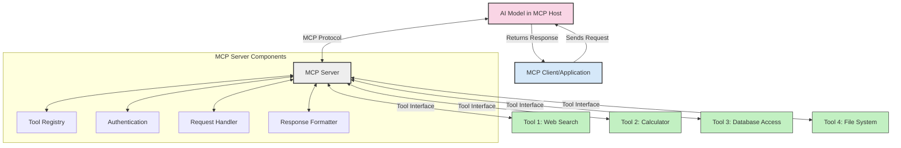
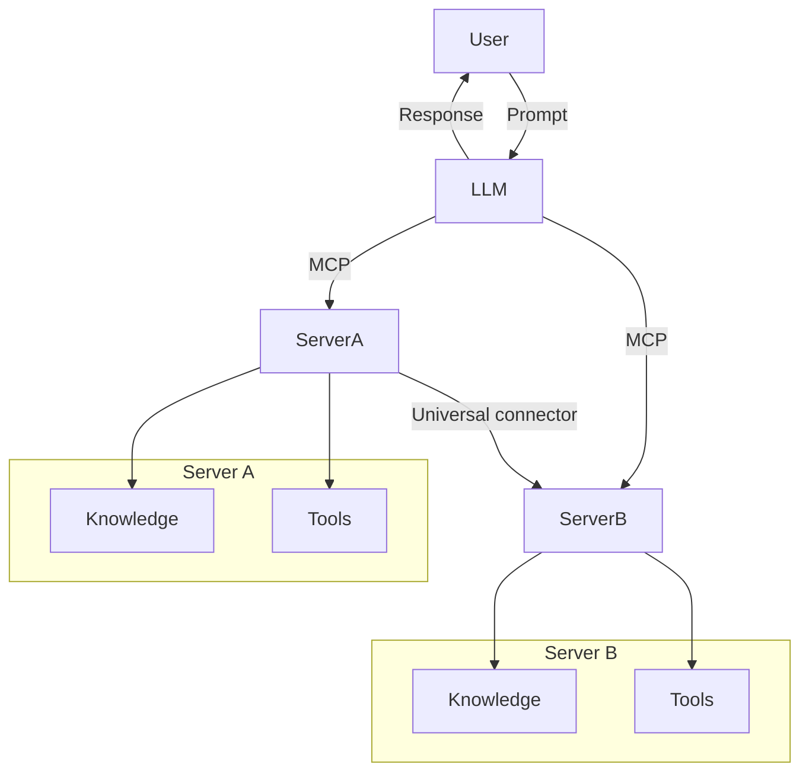

<!--
CO_OP_TRANSLATOR_METADATA:
{
  "original_hash": "02301140adbd807ecf0f17720fa307bc",
  "translation_date": "2025-05-17T05:59:13+00:00",
  "source_file": "00-Introduction/README.md",
  "language_code": "br"
}
-->
# Introdução ao Protocolo de Contexto de Modelo (MCP): Por que é importante para aplicações de IA escaláveis

Aplicações de IA generativa representam um grande avanço, pois frequentemente permitem que o usuário interaja com o aplicativo usando comandos em linguagem natural. No entanto, à medida que mais tempo e recursos são investidos nesses aplicativos, é importante garantir que você possa integrar funcionalidades e recursos de maneira fácil, que seja simples de expandir, que seu aplicativo possa acomodar mais de um modelo sendo usado, e suas complexidades. Em resumo, construir aplicativos de IA generativa é fácil no começo, mas à medida que cresce e se torna mais complexo, você precisa começar a definir uma arquitetura e provavelmente precisará se apoiar em um padrão para garantir que seus aplicativos sejam construídos de maneira consistente. É aqui que o MCP entra para organizar as coisas, oferecendo um padrão.

---

## **🔍 O que é o Protocolo de Contexto de Modelo (MCP)?**

O **Protocolo de Contexto de Modelo (MCP)** é uma **interface aberta e padronizada** que permite que Modelos de Linguagem Grande (LLMs) interajam perfeitamente com ferramentas externas, APIs e fontes de dados. Ele fornece uma arquitetura consistente para aprimorar a funcionalidade dos modelos de IA além de seus dados de treinamento, possibilitando sistemas de IA mais inteligentes, escaláveis e responsivos.

---

## **🎯 Por que a padronização em IA é importante**

À medida que as aplicações de IA generativa se tornam mais complexas, é essencial adotar padrões que garantam **escalabilidade, extensibilidade** e **manutenibilidade**. O MCP atende a essas necessidades ao:

- Unificar integrações entre modelos e ferramentas
- Reduzir soluções personalizadas e frágeis
- Permitir que múltiplos modelos coexistam em um único ecossistema

---

## **📚 Objetivos de Aprendizagem**

Ao final deste artigo, você será capaz de:

- Definir **Protocolo de Contexto de Modelo (MCP)** e seus casos de uso
- Entender como o MCP padroniza a comunicação entre modelos e ferramentas
- Identificar os componentes principais da arquitetura do MCP
- Explorar aplicações reais do MCP em contextos empresariais e de desenvolvimento

---

## **💡 Por que o Protocolo de Contexto de Modelo (MCP) é um divisor de águas**

### **🔗 MCP resolve a fragmentação nas interações de IA**

Antes do MCP, integrar modelos com ferramentas exigia:

- Código personalizado para cada par de ferramenta-modelo
- APIs não padronizadas para cada fornecedor
- Quebras frequentes devido a atualizações
- Escalabilidade precária com mais ferramentas

### **✅ Benefícios da padronização do MCP**

| **Benefício**              | **Descrição**                                                                |
|--------------------------|--------------------------------------------------------------------------------|
| Interoperabilidade         | LLMs funcionam perfeitamente com ferramentas de diferentes fornecedores      |
| Consistência              | Comportamento uniforme entre plataformas e ferramentas                         |
| Reutilização              | Ferramentas construídas uma vez podem ser usadas em vários projetos e sistemas |
| Desenvolvimento acelerado  | Reduzir o tempo de desenvolvimento usando interfaces padronizadas e plug-and-play |

---

## **🧱 Visão Geral da Arquitetura de Alto Nível do MCP**

O MCP segue um **modelo cliente-servidor**, onde:

- **Hosts MCP** executam os modelos de IA
- **Clientes MCP** iniciam solicitações
- **Servidores MCP** oferecem contexto, ferramentas e capacidades

### **Componentes principais:**

- **Recursos** – Dados estáticos ou dinâmicos para modelos  
- **Prompts** – Fluxos de trabalho predefinidos para geração guiada  
- **Ferramentas** – Funções executáveis como busca, cálculos  
- **Amostragem** – Comportamento agente por meio de interações recursivas

---

## Como os Servidores MCP Funcionam

Os servidores MCP operam da seguinte maneira:

- **Fluxo de Solicitação**: 
    1. O Cliente MCP envia uma solicitação ao Modelo de IA executando em um Host MCP.
    2. O Modelo de IA identifica quando precisa de ferramentas ou dados externos.
    3. O modelo se comunica com o Servidor MCP usando o protocolo padronizado.

- **Funcionalidade do Servidor MCP**:
    - Registro de Ferramentas: Mantém um catálogo de ferramentas disponíveis e suas capacidades.
    - Autenticação: Verifica permissões para acesso às ferramentas.
    - Manipulador de Solicitações: Processa solicitações de ferramentas recebidas do modelo.
    - Formatador de Respostas: Estrutura as saídas das ferramentas em um formato que o modelo pode entender.

- **Execução de Ferramentas**: 
    - O servidor encaminha solicitações para as ferramentas externas apropriadas
    - Ferramentas executam suas funções especializadas (busca, cálculo, consultas a bancos de dados, etc.)
    - Resultados são retornados ao modelo em um formato consistente.

- **Conclusão da Resposta**: 
    - O modelo de IA incorpora as saídas das ferramentas em sua resposta.
    - A resposta final é enviada de volta ao aplicativo cliente.

## 👨‍💻 Como Construir um Servidor MCP (Com Exemplos)

Servidores MCP permitem que você expanda as capacidades dos LLMs fornecendo dados e funcionalidades.

Pronto para experimentar? Aqui estão exemplos de criação de um servidor MCP simples em diferentes linguagens:

- **Exemplo em Python**: https://github.com/modelcontextprotocol/python-sdk

- **Exemplo em TypeScript**: https://github.com/modelcontextprotocol/typescript-sdk

- **Exemplo em Java**: https://github.com/modelcontextprotocol/java-sdk

- **Exemplo em C#/.NET**: https://github.com/modelcontextprotocol/csharp-sdk

## 🌍 Casos de Uso Reais para MCP

O MCP permite uma ampla gama de aplicações ao expandir as capacidades de IA:

| **Aplicação**              | **Descrição**                                                                |
|------------------------------|--------------------------------------------------------------------------------|
| Integração de Dados Empresariais  | Conectar LLMs a bancos de dados, CRMs ou ferramentas internas                |
| Sistemas de IA Agentes           | Habilitar agentes autônomos com acesso a ferramentas e fluxos de trabalho de tomada de decisão |
| Aplicações Multimodais     | Combinar ferramentas de texto, imagem e áudio em um único aplicativo de IA unificado |
| Integração de Dados em Tempo Real   | Trazer dados ao vivo para interações de IA para resultados mais precisos e atuais |

### 🧠 MCP = Padrão Universal para Interações de IA

O Protocolo de Contexto de Modelo (MCP) atua como um padrão universal para interações de IA, assim como o USB-C padronizou conexões físicas para dispositivos. No mundo da IA, o MCP fornece uma interface consistente, permitindo que modelos (clientes) integrem-se perfeitamente com ferramentas externas e provedores de dados (servidores). Isso elimina a necessidade de protocolos personalizados diversos para cada API ou fonte de dados.

Sob o MCP, uma ferramenta compatível com MCP (referida como servidor MCP) segue um padrão unificado. Esses servidores podem listar as ferramentas ou ações que oferecem e executar essas ações quando solicitadas por um agente de IA. Plataformas de agentes de IA que suportam MCP são capazes de descobrir ferramentas disponíveis nos servidores e invocá-las através deste protocolo padrão.

### 💡 Facilita o acesso ao conhecimento

Além de oferecer ferramentas, o MCP também facilita o acesso ao conhecimento. Ele permite que aplicações forneçam contexto a modelos de linguagem grande (LLMs) ao vinculá-los a várias fontes de dados. Por exemplo, um servidor MCP pode representar o repositório de documentos de uma empresa, permitindo que agentes recuperem informações relevantes sob demanda. Outro servidor pode lidar com ações específicas, como enviar e-mails ou atualizar registros. Do ponto de vista do agente, essas são simplesmente ferramentas que ele pode usar—algumas ferramentas retornam dados (contexto de conhecimento), enquanto outras realizam ações. O MCP gerencia eficientemente ambos.

Um agente que se conecta a um servidor MCP automaticamente aprende as capacidades disponíveis do servidor e os dados acessíveis por meio de um formato padrão. Essa padronização permite a disponibilidade dinâmica de ferramentas. Por exemplo, adicionar um novo servidor MCP ao sistema de um agente torna suas funções imediatamente utilizáveis sem exigir mais personalização das instruções do agente.

Essa integração simplificada está alinhada com o fluxo representado no diagrama de mermaid, onde os servidores fornecem tanto ferramentas quanto conhecimento, garantindo colaboração contínua entre sistemas.

### 👉 Exemplo: Solução de Agente Escalável

## 🔐 Benefícios Práticos do MCP

Aqui estão alguns benefícios práticos de usar o MCP:

- **Atualidade**: Modelos podem acessar informações atualizadas além de seus dados de treinamento
- **Extensão de Capacidade**: Modelos podem aproveitar ferramentas especializadas para tarefas para as quais não foram treinados
- **Redução de Alucinações**: Fontes de dados externas fornecem base factual
- **Privacidade**: Dados sensíveis podem permanecer em ambientes seguros em vez de serem incorporados em prompts

## 📌 Principais Considerações

Os seguintes são pontos chave para usar o MCP:

- **MCP** padroniza como modelos de IA interagem com ferramentas e dados
- Promove **extensibilidade, consistência e interoperabilidade**
- MCP ajuda a **reduzir o tempo de desenvolvimento, melhorar a confiabilidade e expandir capacidades dos modelos**
- A arquitetura cliente-servidor **habilita aplicações de IA flexíveis e extensíveis**

## 🧠 Exercício

Pense em uma aplicação de IA que você está interessado em construir.

- Quais **ferramentas ou dados externos** poderiam melhorar suas capacidades?
- Como o MCP pode tornar a integração **mais simples e confiável?**

## Recursos Adicionais

- [Repositório GitHub do MCP](https://github.com/modelcontextprotocol)

## O que vem a seguir

Próximo: [Capítulo 1: Conceitos Básicos](/01-CoreConcepts/README.md)

**Aviso Legal**:  
Este documento foi traduzido usando o serviço de tradução por IA [Co-op Translator](https://github.com/Azure/co-op-translator). Embora nos esforcemos para garantir a precisão, esteja ciente de que traduções automatizadas podem conter erros ou imprecisões. O documento original em seu idioma nativo deve ser considerado a fonte autorizada. Para informações críticas, recomenda-se a tradução profissional por humanos. Não nos responsabilizamos por quaisquer mal-entendidos ou interpretações equivocadas decorrentes do uso desta tradução.