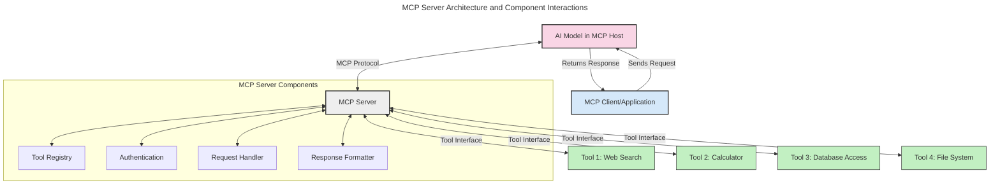
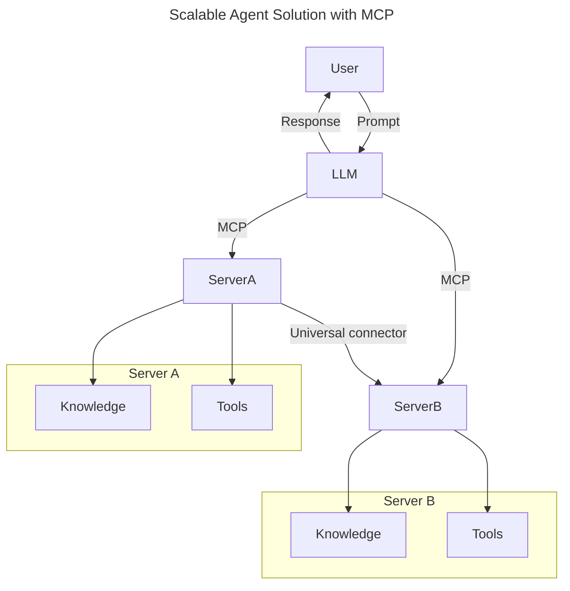
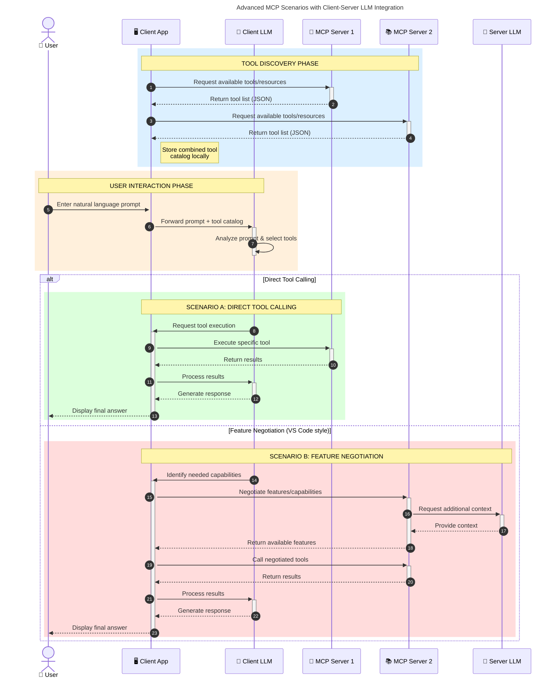

<!--
CO_OP_TRANSLATOR_METADATA:
{
  "original_hash": "1446979020432f512c883848d7eca144",
  "translation_date": "2025-05-29T21:46:49+00:00",
  "source_file": "00-Introduction/README.md",
  "language_code": "br"
}
-->
# Introdutcion da Protocolo de Contexto de Modelo (MCP): Por Que É Importante para Aplicações de IA Escaláveis

Aplicações de IA generativa são um grande avanço, pois frequentemente permitem que o usuário interaja com o app usando comandos em linguagem natural. No entanto, à medida que mais tempo e recursos são investidos nessas aplicações, você quer garantir que seja fácil integrar funcionalidades e recursos de forma que o sistema seja extensível, que seu app suporte o uso de múltiplos modelos e lide com as particularidades de cada um. Em resumo, criar apps de IA generativa é simples no começo, mas conforme eles crescem e ficam mais complexos, é preciso definir uma arquitetura e provavelmente usar um padrão para garantir que seus apps sejam construídos de forma consistente. É aí que o MCP entra para organizar tudo e fornecer um padrão.

---

## **🔍 O Que É o Protocolo de Contexto de Modelo (MCP)?**

O **Protocolo de Contexto de Modelo (MCP)** é uma **interface aberta e padronizada** que permite que Grandes Modelos de Linguagem (LLMs) interajam de forma fluida com ferramentas externas, APIs e fontes de dados. Ele oferece uma arquitetura consistente para ampliar a funcionalidade dos modelos de IA além dos dados com que foram treinados, possibilitando sistemas de IA mais inteligentes, escaláveis e responsivos.

---

## **🎯 Por Que a Padronização em IA É Importante**

À medida que aplicações de IA generativa ficam mais complexas, é essencial adotar padrões que garantam **escalabilidade, extensibilidade** e **manutenção facilitada**. O MCP atende a essas necessidades ao:

- Unificar integrações entre modelos e ferramentas  
- Reduzir soluções frágeis e personalizadas para cada caso  
- Permitir que múltiplos modelos coexistam em um mesmo ecossistema  

---

## **📚 Objetivos de Aprendizagem**

Ao final deste artigo, você será capaz de:

- Definir o **Protocolo de Contexto de Modelo (MCP)** e seus casos de uso  
- Entender como o MCP padroniza a comunicação entre modelos e ferramentas  
- Identificar os componentes principais da arquitetura MCP  
- Explorar aplicações reais do MCP em contextos empresariais e de desenvolvimento  

---

## **💡 Por Que o Protocolo de Contexto de Modelo (MCP) É Revolucionário**

### **🔗 MCP Resolve a Fragmentação nas Interações de IA**

Antes do MCP, integrar modelos com ferramentas exigia:

- Código customizado para cada par modelo-ferramenta  
- APIs não padronizadas para cada fornecedor  
- Quebras frequentes devido a atualizações  
- Baixa escalabilidade com o aumento do número de ferramentas  

### **✅ Benefícios da Padronização MCP**

| **Benefício**            | **Descrição**                                                                |
|--------------------------|------------------------------------------------------------------------------|
| Interoperabilidade       | LLMs funcionam sem problemas com ferramentas de diferentes fornecedores      |
| Consistência             | Comportamento uniforme entre plataformas e ferramentas                       |
| Reutilização             | Ferramentas criadas uma vez podem ser usadas em vários projetos e sistemas   |
| Desenvolvimento Ágil     | Reduz o tempo de desenvolvimento usando interfaces padronizadas plug-and-play|

---

## **🧱 Visão Geral da Arquitetura MCP em Alto Nível**

O MCP segue um **modelo cliente-servidor**, onde:

- **Hosts MCP** executam os modelos de IA  
- **Clientes MCP** iniciam as requisições  
- **Servidores MCP** fornecem contexto, ferramentas e capacidades  

### **Componentes Principais:**

- **Recursos** – Dados estáticos ou dinâmicos para os modelos  
- **Prompts** – Fluxos predefinidos para geração guiada  
- **Ferramentas** – Funções executáveis como buscas, cálculos  
- **Amostragem** – Comportamento agente via interações recursivas  

---

## Como Funcionam os Servidores MCP

Servidores MCP operam da seguinte forma:

- **Fluxo de Requisição**:  
    1. O Cliente MCP envia uma requisição para o Modelo de IA rodando em um Host MCP.  
    2. O Modelo de IA identifica quando precisa de ferramentas externas ou dados.  
    3. O modelo se comunica com o Servidor MCP usando o protocolo padronizado.

- **Funcionalidades do Servidor MCP**:  
    - Registro de Ferramentas: Mantém um catálogo das ferramentas disponíveis e suas capacidades.  
    - Autenticação: Verifica permissões para acesso às ferramentas.  
    - Manipulador de Requisições: Processa as solicitações de ferramentas feitas pelo modelo.  
    - Formatador de Resposta: Estrutura as saídas das ferramentas num formato compreensível pelo modelo.

- **Execução das Ferramentas**:  
    - O servidor direciona as requisições para as ferramentas externas apropriadas  
    - As ferramentas executam suas funções especializadas (busca, cálculo, consultas a banco de dados, etc.)  
    - Os resultados são retornados ao modelo em formato consistente.

- **Conclusão da Resposta**:  
    - O modelo de IA incorpora as saídas das ferramentas em sua resposta.  
    - A resposta final é enviada de volta para a aplicação cliente.

## 👨‍💻 Como Construir um Servidor MCP (Com Exemplos)

Servidores MCP permitem que você amplie as capacidades dos LLMs fornecendo dados e funcionalidades.

Quer experimentar? Aqui estão exemplos de como criar um servidor MCP simples em diferentes linguagens:

- **Exemplo em Python**: https://github.com/modelcontextprotocol/python-sdk

- **Exemplo em TypeScript**: https://github.com/modelcontextprotocol/typescript-sdk

- **Exemplo em Java**: https://github.com/modelcontextprotocol/java-sdk

- **Exemplo em C#/.NET**: https://github.com/modelcontextprotocol/csharp-sdk

## 🌍 Casos de Uso Reais para MCP

O MCP viabiliza uma ampla gama de aplicações ao ampliar as capacidades da IA:

| **Aplicação**               | **Descrição**                                                                |
|----------------------------|------------------------------------------------------------------------------|
| Integração de Dados Empresariais | Conecta LLMs a bancos de dados, CRMs ou ferramentas internas            |
| Sistemas de IA Agentes      | Habilita agentes autônomos com acesso a ferramentas e fluxos decisórios      |
| Aplicações Multimodais      | Combina texto, imagem e áudio em um único app de IA unificado                |
| Integração de Dados em Tempo Real | Traz dados ao vivo para interações de IA, gerando resultados mais precisos e atuais |

### 🧠 MCP = Padrão Universal para Interações de IA

O Protocolo de Contexto de Modelo (MCP) funciona como um padrão universal para interações de IA, assim como o USB-C padronizou conexões físicas para dispositivos. No mundo da IA, o MCP oferece uma interface consistente, permitindo que modelos (clientes) integrem-se facilmente a ferramentas externas e provedores de dados (servidores). Isso elimina a necessidade de múltiplos protocolos personalizados para cada API ou fonte de dados.

No MCP, uma ferramenta compatível (chamada de servidor MCP) segue um padrão unificado. Esses servidores podem listar as ferramentas ou ações que oferecem e executar essas ações quando solicitadas por um agente de IA. Plataformas de agentes de IA que suportam MCP conseguem descobrir as ferramentas disponíveis nos servidores e acioná-las por meio desse protocolo padrão.

### 💡 Facilita o acesso ao conhecimento

Além de oferecer ferramentas, o MCP também facilita o acesso ao conhecimento. Ele permite que aplicações forneçam contexto aos grandes modelos de linguagem (LLMs) conectando-os a diversas fontes de dados. Por exemplo, um servidor MCP pode representar o repositório de documentos de uma empresa, permitindo que agentes recuperem informações relevantes sob demanda. Outro servidor pode executar ações específicas, como enviar e-mails ou atualizar registros. Para o agente, essas são simplesmente ferramentas que ele pode usar — algumas retornam dados (contexto de conhecimento), outras executam ações. O MCP gerencia ambos eficientemente.

Um agente que se conecta a um servidor MCP aprende automaticamente as capacidades e dados acessíveis do servidor através de um formato padrão. Essa padronização permite que as ferramentas estejam disponíveis dinamicamente. Por exemplo, adicionar um novo servidor MCP ao sistema de um agente torna suas funções imediatamente utilizáveis, sem precisar customizar as instruções do agente.

Essa integração simplificada está alinhada ao fluxo mostrado no diagrama mermaid, onde servidores fornecem tanto ferramentas quanto conhecimento, garantindo colaboração fluida entre sistemas.

### 👉 Exemplo: Solução Escalável para Agentes

### 🔄 Cenários Avançados MCP com Integração de LLM no Lado do Cliente

Além da arquitetura básica MCP, existem cenários avançados onde tanto cliente quanto servidor possuem LLMs, permitindo interações mais sofisticadas:

## 🔐 Benefícios Práticos do MCP

Aqui estão os benefícios práticos de usar MCP:

- **Atualização**: Modelos podem acessar informações atualizadas além dos dados de treinamento  
- **Extensão de Capacidades**: Modelos podem usar ferramentas especializadas para tarefas para as quais não foram treinados  
- **Redução de Alucinações**: Fontes externas de dados fornecem base factual  
- **Privacidade**: Dados sensíveis podem permanecer em ambientes seguros, sem precisar estar embutidos nos prompts  

## 📌 Principais Conclusões

Confira os principais pontos sobre o uso do MCP:

- **MCP** padroniza como modelos de IA interagem com ferramentas e dados  
- Promove **extensibilidade, consistência e interoperabilidade**  
- MCP ajuda a **reduzir o tempo de desenvolvimento, melhorar a confiabilidade e ampliar as capacidades dos modelos**  
- A arquitetura cliente-servidor **permite aplicações de IA flexíveis e extensíveis**  

## 🧠 Exercício

Pense em uma aplicação de IA que você gostaria de desenvolver.

- Quais **ferramentas externas ou dados** poderiam ampliar suas capacidades?  
- Como o MCP poderia tornar a integração **mais simples e confiável?**  

## Recursos Adicionais

- [Repositório MCP no GitHub](https://github.com/modelcontextprotocol)

## O que vem a seguir

Próximo: [Capítulo 1: Conceitos Básicos](/01-CoreConcepts/README.md)

**Aviso Legal**:  
Este documento foi traduzido usando o serviço de tradução por IA [Co-op Translator](https://github.com/Azure/co-op-translator). Embora nos esforcemos para garantir a precisão, esteja ciente de que traduções automáticas podem conter erros ou imprecisões. O documento original em seu idioma nativo deve ser considerado a fonte autorizada. Para informações críticas, recomenda-se tradução profissional feita por humanos. Não nos responsabilizamos por quaisquer mal-entendidos ou interpretações incorretas decorrentes do uso desta tradução.