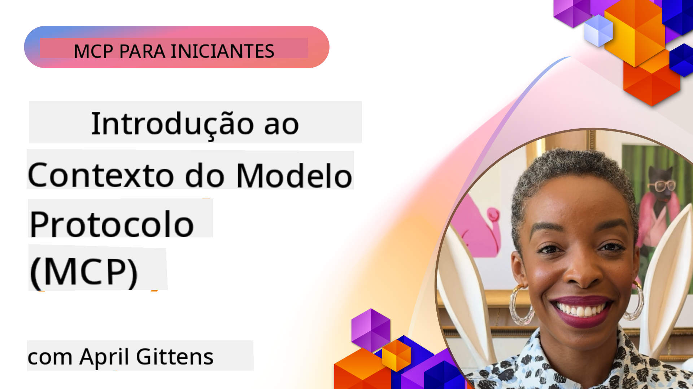
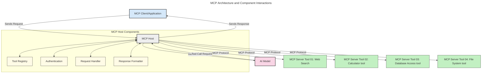
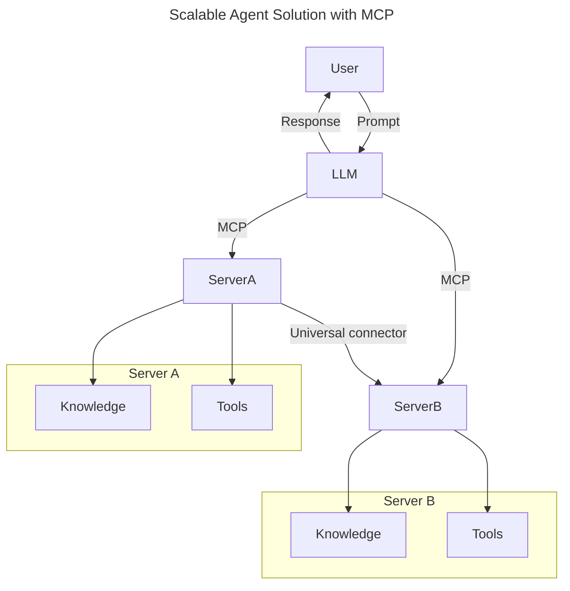
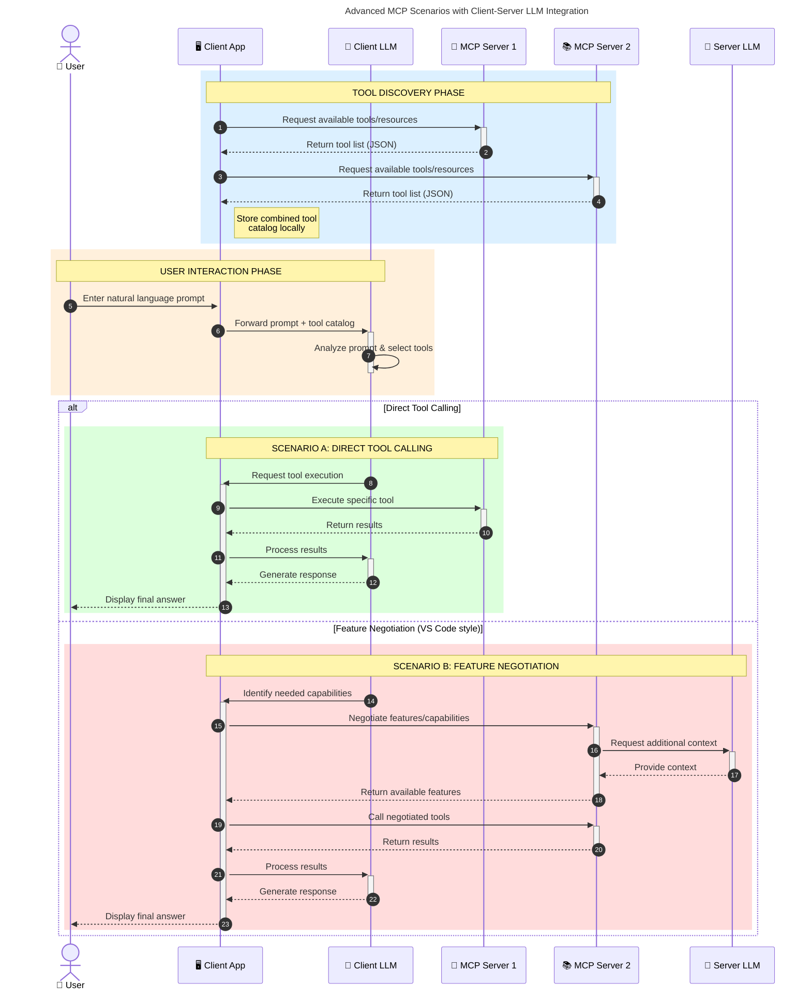

<!--
CO_OP_TRANSLATOR_METADATA:
{
  "original_hash": "0df1ee78a6dd8300f3a040ca5b411c2e",
  "translation_date": "2025-08-18T17:17:52+00:00",
  "source_file": "00-Introduction/README.md",
  "language_code": "br"
}
-->
# Introdução ao Protocolo de Contexto de Modelo (MCP): Por Que Ele É Importante para Aplicações de IA Escaláveis

_(Clique na imagem acima para assistir ao vídeo desta lição)_

Aplicações de IA generativa representam um grande avanço, pois frequentemente permitem que o usuário interaja com o aplicativo usando comandos em linguagem natural. No entanto, à medida que mais tempo e recursos são investidos nesses aplicativos, é importante garantir que você possa integrar funcionalidades e recursos de forma fácil, permitindo extensões, que seu aplicativo possa trabalhar com mais de um modelo e lidar com diferentes particularidades dos modelos. Em resumo, construir aplicativos de IA generativa é fácil no início, mas conforme eles crescem e se tornam mais complexos, é necessário começar a definir uma arquitetura e, provavelmente, depender de um padrão para garantir que seus aplicativos sejam construídos de maneira consistente. É aqui que o MCP entra em cena para organizar as coisas e fornecer um padrão.

---

## **🔍 O Que É o Protocolo de Contexto de Modelo (MCP)?**

O **Protocolo de Contexto de Modelo (MCP)** é uma **interface aberta e padronizada** que permite que Modelos de Linguagem de Grande Escala (LLMs) interajam de forma integrada com ferramentas externas, APIs e fontes de dados. Ele fornece uma arquitetura consistente para ampliar a funcionalidade dos modelos de IA além de seus dados de treinamento, permitindo sistemas de IA mais inteligentes, escaláveis e responsivos.

---

## **🎯 Por Que a Padronização em IA É Importante**

À medida que as aplicações de IA generativa se tornam mais complexas, é essencial adotar padrões que garantam **escalabilidade, extensibilidade, manutenção** e **evitem dependência de fornecedores**. O MCP atende a essas necessidades ao:

- Unificar integrações entre modelos e ferramentas
- Reduzir soluções personalizadas frágeis e pontuais
- Permitir que múltiplos modelos de diferentes fornecedores coexistam em um único ecossistema

**Nota:** Embora o MCP se apresente como um padrão aberto, não há planos para padronizar o MCP por meio de órgãos de padronização existentes, como IEEE, IETF, W3C, ISO ou qualquer outro.

---

## **📚 Objetivos de Aprendizado**

Ao final deste artigo, você será capaz de:

- Definir o **Protocolo de Contexto de Modelo (MCP)** e seus casos de uso
- Compreender como o MCP padroniza a comunicação entre modelos e ferramentas
- Identificar os componentes principais da arquitetura do MCP
- Explorar aplicações reais do MCP em contextos empresariais e de desenvolvimento

---

## **💡 Por Que o Protocolo de Contexto de Modelo (MCP) É Transformador**

### **🔗 MCP Resolve a Fragmentação nas Interações de IA**

Antes do MCP, integrar modelos com ferramentas exigia:

- Código personalizado para cada par ferramenta-modelo
- APIs não padronizadas para cada fornecedor
- Quebras frequentes devido a atualizações
- Baixa escalabilidade com mais ferramentas

### **✅ Benefícios da Padronização do MCP**

| **Benefício**              | **Descrição**                                                                |
|--------------------------|--------------------------------------------------------------------------------|
| Interoperabilidade         | LLMs funcionam de forma integrada com ferramentas de diferentes fornecedores |
| Consistência              | Comportamento uniforme entre plataformas e ferramentas                        |
| Reutilização              | Ferramentas criadas uma vez podem ser usadas em vários projetos e sistemas     |
| Desenvolvimento Acelerado  | Reduz o tempo de desenvolvimento com interfaces padronizadas e plug-and-play |

---

## **🧱 Visão Geral da Arquitetura de Alto Nível do MCP**

O MCP segue um modelo **cliente-servidor**, onde:

- **Hosts MCP** executam os modelos de IA
- **Clientes MCP** iniciam solicitações
- **Servidores MCP** fornecem contexto, ferramentas e capacidades

### **Componentes Principais:**

- **Recursos** – Dados estáticos ou dinâmicos para os modelos  
- **Prompts** – Fluxos de trabalho predefinidos para geração orientada  
- **Ferramentas** – Funções executáveis, como busca e cálculos  
- **Amostragem** – Comportamento agente por meio de interações recursivas  

---

## Como Funcionam os Servidores MCP

Os servidores MCP operam da seguinte forma:

- **Fluxo de Solicitação**:
    1. Uma solicitação é iniciada por um usuário final ou software agindo em seu nome.
    2. O **Cliente MCP** envia a solicitação para um **Host MCP**, que gerencia o tempo de execução do modelo de IA.
    3. O **Modelo de IA** recebe o comando do usuário e pode solicitar acesso a ferramentas ou dados externos por meio de chamadas de ferramentas.
    4. O **Host MCP**, e não o modelo diretamente, comunica-se com o(s) **Servidor(es) MCP** apropriado(s) usando o protocolo padronizado.
- **Funcionalidade do Host MCP**:
    - **Registro de Ferramentas**: Mantém um catálogo de ferramentas disponíveis e suas capacidades.
    - **Autenticação**: Verifica permissões para acesso às ferramentas.
    - **Manipulador de Solicitações**: Processa solicitações de ferramentas recebidas do modelo.
    - **Formatador de Respostas**: Estrutura as saídas das ferramentas em um formato que o modelo possa entender.
- **Execução do Servidor MCP**:
    - O **Host MCP** encaminha chamadas de ferramentas para um ou mais **Servidores MCP**, cada um expondo funções especializadas (por exemplo, busca, cálculos, consultas de banco de dados).
    - Os **Servidores MCP** realizam suas respectivas operações e retornam os resultados ao **Host MCP** em um formato consistente.
    - O **Host MCP** formata e retransmite esses resultados ao **Modelo de IA**.
- **Conclusão da Resposta**:
    - O **Modelo de IA** incorpora as saídas das ferramentas em uma resposta final.
    - O **Host MCP** envia essa resposta de volta ao **Cliente MCP**, que a entrega ao usuário final ou ao software que fez a chamada.

## 👨‍💻 Como Construir um Servidor MCP (Com Exemplos)

Os servidores MCP permitem ampliar as capacidades dos LLMs fornecendo dados e funcionalidades.

Pronto para experimentar? Aqui estão SDKs específicos para linguagens e/ou stacks com exemplos de criação de servidores MCP simples em diferentes linguagens/stacks:

- **Python SDK**: https://github.com/modelcontextprotocol/python-sdk

- **TypeScript SDK**: https://github.com/modelcontextprotocol/typescript-sdk

- **Java SDK**: https://github.com/modelcontextprotocol/java-sdk

- **C#/.NET SDK**: https://github.com/modelcontextprotocol/csharp-sdk

---

## 🌍 Casos de Uso Reais para MCP

O MCP possibilita uma ampla gama de aplicações ao ampliar as capacidades da IA:

| **Aplicação**              | **Descrição**                                                                |
|------------------------------|--------------------------------------------------------------------------------|
| Integração de Dados Empresariais  | Conectar LLMs a bancos de dados, CRMs ou ferramentas internas               |
| Sistemas de IA Agentes           | Permitir agentes autônomos com acesso a ferramentas e fluxos de decisão     |
| Aplicações Multimodais            | Combinar ferramentas de texto, imagem e áudio em um único aplicativo de IA  |
| Integração de Dados em Tempo Real | Incorporar dados ao vivo nas interações de IA para resultados mais precisos e atuais |

---

### 🧠 MCP = Padrão Universal para Interações de IA

O Protocolo de Contexto de Modelo (MCP) atua como um padrão universal para interações de IA, assim como o USB-C padronizou conexões físicas para dispositivos. No mundo da IA, o MCP fornece uma interface consistente, permitindo que modelos (clientes) se integrem perfeitamente com ferramentas externas e provedores de dados (servidores). Isso elimina a necessidade de protocolos personalizados e diversos para cada API ou fonte de dados.

Sob o MCP, uma ferramenta compatível com MCP (referida como servidor MCP) segue um padrão unificado. Esses servidores podem listar as ferramentas ou ações que oferecem e executar essas ações quando solicitadas por um agente de IA. Plataformas de agentes de IA que suportam MCP são capazes de descobrir ferramentas disponíveis nos servidores e invocá-las por meio deste protocolo padrão.

### 💡 Facilita o acesso ao conhecimento

Além de oferecer ferramentas, o MCP também facilita o acesso ao conhecimento. Ele permite que aplicativos forneçam contexto a modelos de linguagem de grande escala (LLMs) conectando-os a várias fontes de dados. Por exemplo, um servidor MCP pode representar o repositório de documentos de uma empresa, permitindo que agentes recuperem informações relevantes sob demanda. Outro servidor pode lidar com ações específicas, como enviar e-mails ou atualizar registros. Do ponto de vista do agente, essas são simplesmente ferramentas que ele pode usar—algumas ferramentas retornam dados (contexto de conhecimento), enquanto outras executam ações. O MCP gerencia ambos de forma eficiente.

Um agente conectado a um servidor MCP aprende automaticamente as capacidades disponíveis e os dados acessíveis do servidor por meio de um formato padrão. Essa padronização permite a disponibilidade dinâmica de ferramentas. Por exemplo, adicionar um novo servidor MCP ao sistema de um agente torna suas funções imediatamente utilizáveis sem exigir personalização adicional das instruções do agente.

Essa integração simplificada está alinhada com o fluxo representado no diagrama a seguir, onde os servidores fornecem tanto ferramentas quanto conhecimento, garantindo colaboração perfeita entre sistemas.

### 👉 Exemplo: Solução Escalável de Agentes

### 🔄 Cenários Avançados de MCP com Integração de LLM no Cliente

Além da arquitetura básica do MCP, existem cenários avançados onde tanto o cliente quanto o servidor contêm LLMs, permitindo interações mais sofisticadas. No diagrama a seguir, o **App Cliente** pode ser um IDE com várias ferramentas MCP disponíveis para uso pelo LLM:

---

## 🔐 Benefícios Práticos do MCP

Aqui estão os benefícios práticos de usar o MCP:

- **Atualidade**: Modelos podem acessar informações atualizadas além de seus dados de treinamento
- **Extensão de Capacidades**: Modelos podem usar ferramentas especializadas para tarefas para as quais não foram treinados
- **Redução de Alucinações**: Fontes de dados externas fornecem fundamentação factual
- **Privacidade**: Dados sensíveis podem permanecer em ambientes seguros em vez de serem incorporados em prompts

---

## 📌 Principais Conclusões

As seguintes são conclusões importantes sobre o uso do MCP:

- **MCP** padroniza como modelos de IA interagem com ferramentas e dados
- Promove **extensibilidade, consistência e interoperabilidade**
- MCP ajuda a **reduzir o tempo de desenvolvimento, melhorar a confiabilidade e ampliar as capacidades dos modelos**
- A arquitetura cliente-servidor **permite aplicativos de IA flexíveis e extensíveis**

---

## 🧠 Exercício

Pense em um aplicativo de IA que você gostaria de construir.

- Quais **ferramentas ou dados externos** poderiam melhorar suas capacidades?
- Como o MCP poderia tornar a integração **mais simples e confiável?**

---

## Recursos Adicionais

- [Repositório GitHub do MCP](https://github.com/modelcontextprotocol)

---

## O que vem a seguir

Próximo: [Capítulo 1: Conceitos Fundamentais](../01-CoreConcepts/README.md)

**Aviso Legal**:  
Este documento foi traduzido utilizando o serviço de tradução por IA [Co-op Translator](https://github.com/Azure/co-op-translator). Embora nos esforcemos para garantir a precisão, esteja ciente de que traduções automatizadas podem conter erros ou imprecisões. O documento original em seu idioma nativo deve ser considerado a fonte autoritativa. Para informações críticas, recomenda-se a tradução profissional realizada por humanos. Não nos responsabilizamos por quaisquer mal-entendidos ou interpretações equivocadas decorrentes do uso desta tradução.