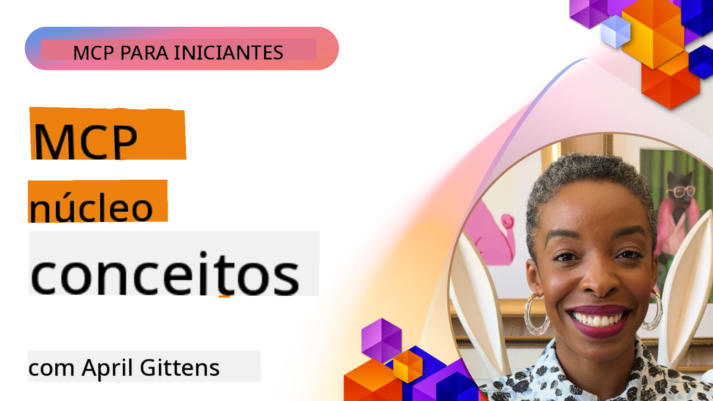
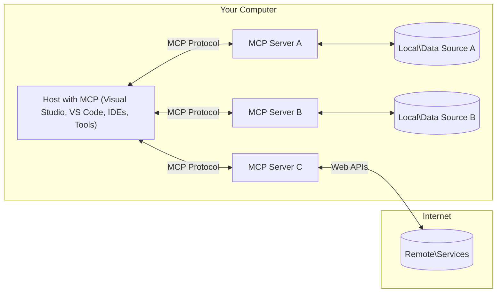

<!--
CO_OP_TRANSLATOR_METADATA:
{
  "original_hash": "904b59de1de9264801242d90a42cdd9d",
  "translation_date": "2025-09-05T10:53:03+00:00",
  "source_file": "01-CoreConcepts/README.md",
  "language_code": "br"
}
-->
# Conceitos Fundamentais do MCP: Dominando o Protocolo de Contexto de Modelo para Integração de IA

[](https://youtu.be/earDzWGtE84)

_(Clique na imagem acima para assistir ao vídeo desta lição)_

O [Model Context Protocol (MCP)](https://github.com/modelcontextprotocol) é um framework poderoso e padronizado que otimiza a comunicação entre Modelos de Linguagem de Grande Escala (LLMs) e ferramentas, aplicativos e fontes de dados externas.  
Este guia irá apresentar os conceitos fundamentais do MCP. Você aprenderá sobre sua arquitetura cliente-servidor, componentes essenciais, mecânica de comunicação e melhores práticas de implementação.

- **Consentimento Explícito do Usuário**: Todo acesso a dados e operações requer aprovação explícita do usuário antes da execução. Os usuários devem entender claramente quais dados serão acessados e quais ações serão realizadas, com controle detalhado sobre permissões e autorizações.

- **Proteção de Privacidade de Dados**: Os dados do usuário só são expostos com consentimento explícito e devem ser protegidos por controles de acesso robustos durante todo o ciclo de interação. As implementações devem prevenir transmissões não autorizadas de dados e manter limites rigorosos de privacidade.

- **Segurança na Execução de Ferramentas**: Cada invocação de ferramenta requer consentimento explícito do usuário, com entendimento claro da funcionalidade, parâmetros e impacto potencial da ferramenta. Limites de segurança robustos devem prevenir execuções de ferramentas não intencionais, inseguras ou maliciosas.

- **Segurança na Camada de Transporte**: Todos os canais de comunicação devem usar mecanismos apropriados de criptografia e autenticação. Conexões remotas devem implementar protocolos de transporte seguros e gerenciamento adequado de credenciais.

#### Diretrizes de Implementação:

- **Gerenciamento de Permissões**: Implemente sistemas de permissão detalhados que permitam aos usuários controlar quais servidores, ferramentas e recursos são acessíveis  
- **Autenticação e Autorização**: Utilize métodos seguros de autenticação (OAuth, chaves de API) com gerenciamento adequado de tokens e expiração  
- **Validação de Entrada**: Valide todos os parâmetros e entradas de dados de acordo com esquemas definidos para prevenir ataques de injeção  
- **Registro de Auditoria**: Mantenha registros abrangentes de todas as operações para monitoramento de segurança e conformidade  

## Visão Geral

Esta lição explora a arquitetura fundamental e os componentes que compõem o ecossistema do Model Context Protocol (MCP). Você aprenderá sobre a arquitetura cliente-servidor, os principais componentes e os mecanismos de comunicação que impulsionam as interações do MCP.

## Objetivos de Aprendizado

Ao final desta lição, você será capaz de:

- Compreender a arquitetura cliente-servidor do MCP.  
- Identificar os papéis e responsabilidades de Hosts, Clientes e Servidores.  
- Analisar os recursos principais que tornam o MCP uma camada de integração flexível.  
- Aprender como a informação flui dentro do ecossistema MCP.  
- Obter insights práticos através de exemplos de código em .NET, Java, Python e JavaScript.  

## Arquitetura do MCP: Um Olhar Mais Profundo

O ecossistema MCP é construído sobre um modelo cliente-servidor. Essa estrutura modular permite que aplicativos de IA interajam com ferramentas, bancos de dados, APIs e recursos contextuais de forma eficiente. Vamos detalhar essa arquitetura em seus componentes principais.

No núcleo, o MCP segue uma arquitetura cliente-servidor onde um aplicativo host pode se conectar a múltiplos servidores:



- **Hosts MCP**: Programas como VSCode, Claude Desktop, IDEs ou ferramentas de IA que desejam acessar dados através do MCP  
- **Clientes MCP**: Clientes de protocolo que mantêm conexões 1:1 com servidores  
- **Servidores MCP**: Programas leves que expõem capacidades específicas através do Protocolo de Contexto de Modelo padronizado  
- **Fontes de Dados Locais**: Arquivos, bancos de dados e serviços do seu computador que os servidores MCP podem acessar com segurança  
- **Serviços Remotos**: Sistemas externos disponíveis na internet que os servidores MCP podem conectar através de APIs  

O Protocolo MCP é um padrão em evolução que utiliza versionamento baseado em datas (formato YYYY-MM-DD). A versão atual do protocolo é **2025-06-18**. Você pode ver as atualizações mais recentes na [especificação do protocolo](https://modelcontextprotocol.io/specification/2025-06-18/).

### 1. Hosts

No Model Context Protocol (MCP), **Hosts** são aplicativos de IA que servem como a interface principal através da qual os usuários interagem com o protocolo. Hosts coordenam e gerenciam conexões com múltiplos servidores MCP, criando clientes MCP dedicados para cada conexão de servidor. Exemplos de Hosts incluem:

- **Aplicativos de IA**: Claude Desktop, Visual Studio Code, Claude Code  
- **Ambientes de Desenvolvimento**: IDEs e editores de código com integração MCP  
- **Aplicativos Personalizados**: Agentes de IA e ferramentas desenvolvidas para propósitos específicos  

**Hosts** são aplicativos que coordenam interações com modelos de IA. Eles:

- **Orquestram Modelos de IA**: Executam ou interagem com LLMs para gerar respostas e coordenar fluxos de trabalho de IA  
- **Gerenciam Conexões de Clientes**: Criam e mantêm um cliente MCP por conexão de servidor MCP  
- **Controlam a Interface do Usuário**: Lidam com o fluxo de conversação, interações do usuário e apresentação de respostas  
- **Aplicam Segurança**: Controlam permissões, restrições de segurança e autenticação  
- **Gerenciam Consentimento do Usuário**: Administram a aprovação do usuário para compartilhamento de dados e execução de ferramentas  

### 2. Clientes

**Clientes** são componentes essenciais que mantêm conexões dedicadas um-a-um entre Hosts e servidores MCP. Cada cliente MCP é instanciado pelo Host para se conectar a um servidor MCP específico, garantindo canais de comunicação organizados e seguros. Múltiplos clientes permitem que Hosts se conectem a vários servidores simultaneamente.

**Clientes** são componentes conectores dentro do aplicativo host. Eles:

- **Comunicação de Protocolo**: Enviam solicitações JSON-RPC 2.0 para servidores com prompts e instruções  
- **Negociação de Capacidades**: Negociam recursos suportados e versões de protocolo com servidores durante a inicialização  
- **Execução de Ferramentas**: Gerenciam solicitações de execução de ferramentas de modelos e processam respostas  
- **Atualizações em Tempo Real**: Lidam com notificações e atualizações em tempo real de servidores  
- **Processamento de Respostas**: Processam e formatam respostas de servidores para exibição aos usuários  

### 3. Servidores

**Servidores** são programas que fornecem contexto, ferramentas e capacidades para clientes MCP. Eles podem ser executados localmente (na mesma máquina que o Host) ou remotamente (em plataformas externas) e são responsáveis por lidar com solicitações de clientes e fornecer respostas estruturadas. Servidores expõem funcionalidades específicas através do Protocolo de Contexto de Modelo padronizado.

**Servidores** são serviços que fornecem contexto e capacidades. Eles:

- **Registro de Recursos**: Registram e expõem primitivas disponíveis (recursos, prompts, ferramentas) para clientes  
- **Processamento de Solicitações**: Recebem e executam chamadas de ferramentas, solicitações de recursos e prompts de clientes  
- **Provisão de Contexto**: Fornecem informações contextuais e dados para melhorar as respostas do modelo  
- **Gerenciamento de Estado**: Mantêm o estado da sessão e lidam com interações com estado quando necessário  
- **Notificações em Tempo Real**: Enviam notificações sobre mudanças de capacidade e atualizações para clientes conectados  

Os servidores podem ser desenvolvidos por qualquer pessoa para estender as capacidades do modelo com funcionalidades especializadas e suportam cenários de implantação local e remota.

### 4. Primitivas de Servidor

Os servidores no Model Context Protocol (MCP) fornecem três **primitivas** principais que definem os blocos fundamentais para interações ricas entre clientes, hosts e modelos de linguagem. Essas primitivas especificam os tipos de informações contextuais e ações disponíveis através do protocolo.

Os servidores MCP podem expor qualquer combinação das três primitivas principais a seguir:

#### Recursos

**Recursos** são fontes de dados que fornecem informações contextuais para aplicativos de IA. Eles representam conteúdo estático ou dinâmico que pode melhorar a compreensão e a tomada de decisão do modelo:

- **Dados Contextuais**: Informações estruturadas e contexto para consumo do modelo de IA  
- **Bases de Conhecimento**: Repositórios de documentos, artigos, manuais e trabalhos de pesquisa  
- **Fontes de Dados Locais**: Arquivos, bancos de dados e informações do sistema local  
- **Dados Externos**: Respostas de APIs, serviços web e dados de sistemas remotos  
- **Conteúdo Dinâmico**: Dados em tempo real que se atualizam com base em condições externas  

Os recursos são identificados por URIs e suportam descoberta através dos métodos `resources/list` e recuperação através de `resources/read`:

```text
file://documents/project-spec.md
database://production/users/schema
api://weather/current
```

#### Prompts

**Prompts** são modelos reutilizáveis que ajudam a estruturar interações com modelos de linguagem. Eles fornecem padrões de interação padronizados e fluxos de trabalho modelados:

- **Interações Baseadas em Modelos**: Mensagens pré-estruturadas e iniciadores de conversação  
- **Modelos de Fluxo de Trabalho**: Sequências padronizadas para tarefas e interações comuns  
- **Exemplos Few-shot**: Modelos baseados em exemplos para instrução de modelos  
- **Prompts de Sistema**: Prompts fundamentais que definem o comportamento e o contexto do modelo  
- **Modelos Dinâmicos**: Prompts parametrizados que se adaptam a contextos específicos  

Os prompts suportam substituição de variáveis e podem ser descobertos via `prompts/list` e recuperados com `prompts/get`:

```markdown
Generate a {{task_type}} for {{product}} targeting {{audience}} with the following requirements: {{requirements}}
```

#### Ferramentas

**Ferramentas** são funções executáveis que modelos de IA podem invocar para realizar ações específicas. Elas representam os "verbos" do ecossistema MCP, permitindo que modelos interajam com sistemas externos:

- **Funções Executáveis**: Operações discretas que modelos podem invocar com parâmetros específicos  
- **Integração com Sistemas Externos**: Chamadas de API, consultas a bancos de dados, operações de arquivos, cálculos  
- **Identidade Única**: Cada ferramenta possui um nome distinto, descrição e esquema de parâmetros  
- **Entrada/Saída Estruturada**: Ferramentas aceitam parâmetros validados e retornam respostas estruturadas e tipadas  
- **Capacidades de Ação**: Permitem que modelos realizem ações no mundo real e obtenham dados ao vivo  

As ferramentas são definidas com JSON Schema para validação de parâmetros e descobertas através de `tools/list` e executadas via `tools/call`:

```typescript
server.tool(
  "search_products", 
  {
    query: z.string().describe("Search query for products"),
    category: z.string().optional().describe("Product category filter"),
    max_results: z.number().default(10).describe("Maximum results to return")
  }, 
  async (params) => {
    // Execute search and return structured results
    return await productService.search(params);
  }
);
```

## Primitivas de Cliente

No Model Context Protocol (MCP), **clientes** podem expor primitivas que permitem que servidores solicitem capacidades adicionais do aplicativo host. Essas primitivas do lado do cliente possibilitam implementações de servidores mais ricas e interativas, que podem acessar capacidades do modelo de IA e interações do usuário.

### Amostragem

**Amostragem** permite que servidores solicitem conclusões de modelos de linguagem do aplicativo de IA do cliente. Essa primitiva possibilita que servidores acessem capacidades de LLM sem incorporar suas próprias dependências de modelo:

- **Acesso Independente de Modelo**: Servidores podem solicitar conclusões sem incluir SDKs de LLM ou gerenciar acesso ao modelo  
- **IA Iniciada pelo Servidor**: Permite que servidores gerem conteúdo autonomamente usando o modelo de IA do cliente  
- **Interações Recursivas com LLM**: Suporta cenários complexos onde servidores precisam de assistência de IA para processamento  
- **Geração Dinâmica de Conteúdo**: Permite que servidores criem respostas contextuais usando o modelo do host  

A amostragem é iniciada através do método `sampling/complete`, onde servidores enviam solicitações de conclusão para clientes.

### Elicitação  

**Elicitação** permite que servidores solicitem informações adicionais ou confirmação de usuários através da interface do cliente:

- **Solicitações de Entrada do Usuário**: Servidores podem pedir informações adicionais quando necessário para execução de ferramentas  
- **Diálogos de Confirmação**: Solicitar aprovação do usuário para operações sensíveis ou impactantes  
- **Fluxos de Trabalho Interativos**: Permitir que servidores criem interações passo a passo com usuários  
- **Coleta Dinâmica de Parâmetros**: Reunir parâmetros ausentes ou opcionais durante a execução de ferramentas  

Solicitações de elicitação são feitas usando o método `elicitation/request` para coletar entrada do usuário através da interface do cliente.

### Registro

**Registro** permite que servidores enviem mensagens de log estruturadas para clientes, para depuração, monitoramento e visibilidade operacional:

- **Suporte à Depuração**: Permitir que servidores forneçam logs detalhados de execução para solução de problemas  
- **Monitoramento Operacional**: Enviar atualizações de status e métricas de desempenho para clientes  
- **Relatório de Erros**: Fornecer contexto detalhado de erros e informações de diagnóstico  
- **Trilhas de Auditoria**: Criar registros abrangentes de operações e decisões do servidor  

Mensagens de registro são enviadas para clientes para fornecer transparência nas operações do servidor e facilitar a depuração.

## Fluxo de Informação no MCP

O Model Context Protocol (MCP) define um fluxo estruturado de informações entre hosts, clientes, servidores e modelos. Compreender esse fluxo ajuda a esclarecer como as solicitações dos usuários são processadas e como ferramentas e dados externos são integrados às respostas do modelo.

- **Host Inicia Conexão**  
  O aplicativo host (como um IDE ou interface de chat) estabelece uma conexão com um servidor MCP, tipicamente via STDIO, WebSocket ou outro transporte suportado.

- **Negociação de Capacidades**  
  O cliente (embutido no host) e o servidor trocam informações sobre seus recursos suportados, ferramentas, recursos e versões de protocolo. Isso garante que ambos os lados entendam quais capacidades estão disponíveis para a sessão.

- **Solicitação do Usuário**  
  O usuário interage com o host (por exemplo, insere um prompt ou comando). O host coleta essa entrada e a passa para o cliente para processamento.

- **Uso de Recursos ou Ferramentas**  
  - O cliente pode solicitar contexto ou recursos adicionais do servidor (como arquivos, entradas de banco de dados ou artigos de bases de conhecimento) para enriquecer a compreensão do modelo.  
  - Se o modelo determinar que uma ferramenta é necessária (por exemplo, para buscar dados, realizar um cálculo ou chamar uma API), o cliente envia uma solicitação de invocação de ferramenta ao servidor, especificando o nome da ferramenta e os parâmetros.  

- **Execução pelo Servidor**  
  O servidor recebe a solicitação de recurso ou ferramenta, executa as operações necessárias (como rodar uma função, consultar um banco de dados ou recuperar um arquivo) e retorna os resultados ao cliente em um formato estruturado.

- **Geração de Resposta**  
  O cliente integra as respostas do servidor (dados de recursos, saídas de ferramentas, etc.) na interação contínua do modelo. O modelo usa essas informações para gerar uma resposta abrangente e contextualmente relevante.

- **Apresentação do Resultado**  
  O host recebe a saída final do cliente e a apresenta ao usuário, frequentemente incluindo tanto o texto gerado pelo modelo quanto quaisquer resultados de execuções de ferramentas ou buscas de recursos.

Esse fluxo permite que o MCP suporte aplicativos de IA avançados, interativos e conscientes do contexto, conectando modelos de forma transparente a ferramentas e fontes de dados externas.

## Arquitetura e Camadas do Protocolo

O MCP consiste em duas camadas arquiteturais distintas que trabalham juntas para fornecer um framework completo de comunicação:

### Camada de Dados

A **Camada de Dados** implementa o protocolo MCP central usando **JSON-RPC 2.0** como base. Essa camada define a estrutura de mensagens, semântica e padrões de interação:

#### Componentes Principais:
- **Protocolo JSON-RPC 2.0**: Toda comunicação utiliza o formato padronizado de mensagens JSON-RPC 2.0 para chamadas de método, respostas e notificações.
- **Gerenciamento de Ciclo de Vida**: Lida com a inicialização da conexão, negociação de capacidades e encerramento de sessão entre clientes e servidores.
- **Primitivas do Servidor**: Permite que servidores forneçam funcionalidades principais por meio de ferramentas, recursos e prompts.
- **Primitivas do Cliente**: Permite que servidores solicitem amostras de LLMs, obtenham entrada do usuário e enviem mensagens de log.
- **Notificações em Tempo Real**: Suporta notificações assíncronas para atualizações dinâmicas sem necessidade de polling.

#### Principais Funcionalidades:

- **Negociação de Versão do Protocolo**: Utiliza versionamento baseado em data (AAAA-MM-DD) para garantir compatibilidade.
- **Descoberta de Capacidades**: Clientes e servidores trocam informações sobre recursos suportados durante a inicialização.
- **Sessões com Estado**: Mantém o estado da conexão em várias interações para continuidade de contexto.

### Camada de Transporte

A **Camada de Transporte** gerencia canais de comunicação, enquadramento de mensagens e autenticação entre os participantes do MCP:

#### Mecanismos de Transporte Suportados:

1. **Transporte STDIO**:
   - Utiliza fluxos de entrada/saída padrão para comunicação direta entre processos.
   - Ideal para processos locais na mesma máquina, sem sobrecarga de rede.
   - Comumente usado para implementações de servidores MCP locais.

2. **Transporte HTTP com Streaming**:
   - Utiliza HTTP POST para mensagens de cliente para servidor.
   - Eventos enviados pelo servidor (SSE) opcionais para streaming de servidor para cliente.
   - Permite comunicação com servidores remotos através de redes.
   - Suporta autenticação HTTP padrão (tokens de portador, chaves de API, cabeçalhos personalizados).
   - O MCP recomenda OAuth para autenticação segura baseada em tokens.

#### Abstração de Transporte:

A camada de transporte abstrai os detalhes de comunicação da camada de dados, permitindo o mesmo formato de mensagem JSON-RPC 2.0 em todos os mecanismos de transporte. Essa abstração permite que aplicativos alternem entre servidores locais e remotos sem dificuldades.

### Considerações de Segurança

As implementações do MCP devem seguir vários princípios críticos de segurança para garantir interações seguras, confiáveis e protegidas em todas as operações do protocolo:

- **Consentimento e Controle do Usuário**: Os usuários devem fornecer consentimento explícito antes que qualquer dado seja acessado ou operações sejam realizadas. Eles devem ter controle claro sobre quais dados são compartilhados e quais ações são autorizadas, com interfaces intuitivas para revisar e aprovar atividades.

- **Privacidade de Dados**: Os dados do usuário só devem ser expostos com consentimento explícito e devem ser protegidos por controles de acesso apropriados. As implementações do MCP devem evitar transmissões de dados não autorizadas e garantir que a privacidade seja mantida em todas as interações.

- **Segurança de Ferramentas**: Antes de invocar qualquer ferramenta, é necessário consentimento explícito do usuário. Os usuários devem ter uma compreensão clara da funcionalidade de cada ferramenta, e limites de segurança robustos devem ser aplicados para evitar execuções não intencionais ou inseguras.

Seguindo esses princípios de segurança, o MCP garante que a confiança, privacidade e segurança do usuário sejam mantidas em todas as interações do protocolo, enquanto habilita integrações poderosas de IA.

## Exemplos de Código: Componentes Principais

Abaixo estão exemplos de código em várias linguagens de programação populares que ilustram como implementar componentes principais de servidores MCP e ferramentas.

### Exemplo .NET: Criando um Servidor MCP Simples com Ferramentas

Aqui está um exemplo prático em .NET demonstrando como implementar um servidor MCP simples com ferramentas personalizadas. Este exemplo mostra como definir e registrar ferramentas, lidar com solicitações e conectar o servidor usando o Model Context Protocol.

```csharp
using System;
using System.Threading.Tasks;
using ModelContextProtocol.Server;
using ModelContextProtocol.Server.Transport;
using ModelContextProtocol.Server.Tools;

public class WeatherServer
{
    public static async Task Main(string[] args)
    {
        // Create an MCP server
        var server = new McpServer(
            name: "Weather MCP Server",
            version: "1.0.0"
        );
        
        // Register our custom weather tool
        server.AddTool<string, WeatherData>("weatherTool", 
            description: "Gets current weather for a location",
            execute: async (location) => {
                // Call weather API (simplified)
                var weatherData = await GetWeatherDataAsync(location);
                return weatherData;
            });
        
        // Connect the server using stdio transport
        var transport = new StdioServerTransport();
        await server.ConnectAsync(transport);
        
        Console.WriteLine("Weather MCP Server started");
        
        // Keep the server running until process is terminated
        await Task.Delay(-1);
    }
    
    private static async Task<WeatherData> GetWeatherDataAsync(string location)
    {
        // This would normally call a weather API
        // Simplified for demonstration
        await Task.Delay(100); // Simulate API call
        return new WeatherData { 
            Temperature = 72.5,
            Conditions = "Sunny",
            Location = location
        };
    }
}

public class WeatherData
{
    public double Temperature { get; set; }
    public string Conditions { get; set; }
    public string Location { get; set; }
}
```

### Exemplo Java: Componentes de Servidor MCP

Este exemplo demonstra o mesmo servidor MCP e registro de ferramentas do exemplo em .NET acima, mas implementado em Java.

```java
import io.modelcontextprotocol.server.McpServer;
import io.modelcontextprotocol.server.McpToolDefinition;
import io.modelcontextprotocol.server.transport.StdioServerTransport;
import io.modelcontextprotocol.server.tool.ToolExecutionContext;
import io.modelcontextprotocol.server.tool.ToolResponse;

public class WeatherMcpServer {
    public static void main(String[] args) throws Exception {
        // Create an MCP server
        McpServer server = McpServer.builder()
            .name("Weather MCP Server")
            .version("1.0.0")
            .build();
            
        // Register a weather tool
        server.registerTool(McpToolDefinition.builder("weatherTool")
            .description("Gets current weather for a location")
            .parameter("location", String.class)
            .execute((ToolExecutionContext ctx) -> {
                String location = ctx.getParameter("location", String.class);
                
                // Get weather data (simplified)
                WeatherData data = getWeatherData(location);
                
                // Return formatted response
                return ToolResponse.content(
                    String.format("Temperature: %.1f°F, Conditions: %s, Location: %s", 
                    data.getTemperature(), 
                    data.getConditions(), 
                    data.getLocation())
                );
            })
            .build());
        
        // Connect the server using stdio transport
        try (StdioServerTransport transport = new StdioServerTransport()) {
            server.connect(transport);
            System.out.println("Weather MCP Server started");
            // Keep server running until process is terminated
            Thread.currentThread().join();
        }
    }
    
    private static WeatherData getWeatherData(String location) {
        // Implementation would call a weather API
        // Simplified for example purposes
        return new WeatherData(72.5, "Sunny", location);
    }
}

class WeatherData {
    private double temperature;
    private String conditions;
    private String location;
    
    public WeatherData(double temperature, String conditions, String location) {
        this.temperature = temperature;
        this.conditions = conditions;
        this.location = location;
    }
    
    public double getTemperature() {
        return temperature;
    }
    
    public String getConditions() {
        return conditions;
    }
    
    public String getLocation() {
        return location;
    }
}
```

### Exemplo Python: Construindo um Servidor MCP

Este exemplo utiliza fastmcp, então certifique-se de instalá-lo primeiro:

```python
pip install fastmcp
```  
Exemplo de Código:

```python
#!/usr/bin/env python3
import asyncio
from fastmcp import FastMCP
from fastmcp.transports.stdio import serve_stdio

# Create a FastMCP server
mcp = FastMCP(
    name="Weather MCP Server",
    version="1.0.0"
)

@mcp.tool()
def get_weather(location: str) -> dict:
    """Gets current weather for a location."""
    return {
        "temperature": 72.5,
        "conditions": "Sunny",
        "location": location
    }

# Alternative approach using a class
class WeatherTools:
    @mcp.tool()
    def forecast(self, location: str, days: int = 1) -> dict:
        """Gets weather forecast for a location for the specified number of days."""
        return {
            "location": location,
            "forecast": [
                {"day": i+1, "temperature": 70 + i, "conditions": "Partly Cloudy"}
                for i in range(days)
            ]
        }

# Register class tools
weather_tools = WeatherTools()

# Start the server
if __name__ == "__main__":
    asyncio.run(serve_stdio(mcp))
```

### Exemplo JavaScript: Criando um Servidor MCP

Este exemplo mostra a criação de um servidor MCP em JavaScript e como registrar duas ferramentas relacionadas ao clima.

```javascript
// Using the official Model Context Protocol SDK
import { McpServer } from "@modelcontextprotocol/sdk/server/mcp.js";
import { StdioServerTransport } from "@modelcontextprotocol/sdk/server/stdio.js";
import { z } from "zod"; // For parameter validation

// Create an MCP server
const server = new McpServer({
  name: "Weather MCP Server",
  version: "1.0.0"
});

// Define a weather tool
server.tool(
  "weatherTool",
  {
    location: z.string().describe("The location to get weather for")
  },
  async ({ location }) => {
    // This would normally call a weather API
    // Simplified for demonstration
    const weatherData = await getWeatherData(location);
    
    return {
      content: [
        { 
          type: "text", 
          text: `Temperature: ${weatherData.temperature}°F, Conditions: ${weatherData.conditions}, Location: ${weatherData.location}` 
        }
      ]
    };
  }
);

// Define a forecast tool
server.tool(
  "forecastTool",
  {
    location: z.string(),
    days: z.number().default(3).describe("Number of days for forecast")
  },
  async ({ location, days }) => {
    // This would normally call a weather API
    // Simplified for demonstration
    const forecast = await getForecastData(location, days);
    
    return {
      content: [
        { 
          type: "text", 
          text: `${days}-day forecast for ${location}: ${JSON.stringify(forecast)}` 
        }
      ]
    };
  }
);

// Helper functions
async function getWeatherData(location) {
  // Simulate API call
  return {
    temperature: 72.5,
    conditions: "Sunny",
    location: location
  };
}

async function getForecastData(location, days) {
  // Simulate API call
  return Array.from({ length: days }, (_, i) => ({
    day: i + 1,
    temperature: 70 + Math.floor(Math.random() * 10),
    conditions: i % 2 === 0 ? "Sunny" : "Partly Cloudy"
  }));
}

// Connect the server using stdio transport
const transport = new StdioServerTransport();
server.connect(transport).catch(console.error);

console.log("Weather MCP Server started");
```

Este exemplo em JavaScript demonstra como criar um cliente MCP que se conecta a um servidor, envia um prompt e processa a resposta, incluindo quaisquer chamadas de ferramentas realizadas.

## Segurança e Autorização

O MCP inclui vários conceitos e mecanismos integrados para gerenciar segurança e autorização em todo o protocolo:

1. **Controle de Permissão de Ferramentas**:  
   Os clientes podem especificar quais ferramentas um modelo está autorizado a usar durante uma sessão. Isso garante que apenas ferramentas explicitamente autorizadas estejam acessíveis, reduzindo o risco de operações não intencionais ou inseguras. As permissões podem ser configuradas dinamicamente com base nas preferências do usuário, políticas organizacionais ou no contexto da interação.

2. **Autenticação**:  
   Os servidores podem exigir autenticação antes de conceder acesso a ferramentas, recursos ou operações sensíveis. Isso pode envolver chaves de API, tokens OAuth ou outros esquemas de autenticação. A autenticação adequada garante que apenas clientes e usuários confiáveis possam invocar capacidades do servidor.

3. **Validação**:  
   A validação de parâmetros é aplicada a todas as invocações de ferramentas. Cada ferramenta define os tipos, formatos e restrições esperados para seus parâmetros, e o servidor valida as solicitações recebidas de acordo. Isso evita que entradas malformadas ou maliciosas alcancem as implementações das ferramentas e ajuda a manter a integridade das operações.

4. **Limitação de Taxa**:  
   Para evitar abusos e garantir o uso justo dos recursos do servidor, os servidores MCP podem implementar limitação de taxa para chamadas de ferramentas e acesso a recursos. Limites de taxa podem ser aplicados por usuário, por sessão ou globalmente, ajudando a proteger contra ataques de negação de serviço ou consumo excessivo de recursos.

Combinando esses mecanismos, o MCP fornece uma base segura para integrar modelos de linguagem com ferramentas e fontes de dados externas, enquanto oferece aos usuários e desenvolvedores controle detalhado sobre acesso e uso.

## Mensagens do Protocolo e Fluxo de Comunicação

A comunicação do MCP utiliza mensagens estruturadas **JSON-RPC 2.0** para facilitar interações claras e confiáveis entre hosts, clientes e servidores. O protocolo define padrões específicos de mensagens para diferentes tipos de operações:

### Tipos de Mensagens Principais:

#### **Mensagens de Inicialização**
- **Solicitação `initialize`**: Estabelece conexão e negocia versão do protocolo e capacidades.
- **Resposta `initialize`**: Confirma recursos suportados e informações do servidor.  
- **`notifications/initialized`**: Indica que a inicialização está completa e a sessão está pronta.

#### **Mensagens de Descoberta**
- **Solicitação `tools/list`**: Descobre ferramentas disponíveis no servidor.
- **Solicitação `resources/list`**: Lista recursos disponíveis (fontes de dados).
- **Solicitação `prompts/list`**: Recupera templates de prompts disponíveis.

#### **Mensagens de Execução**  
- **Solicitação `tools/call`**: Executa uma ferramenta específica com os parâmetros fornecidos.
- **Solicitação `resources/read`**: Recupera conteúdo de um recurso específico.
- **Solicitação `prompts/get`**: Busca um template de prompt com parâmetros opcionais.

#### **Mensagens do Lado do Cliente**
- **Solicitação `sampling/complete`**: O servidor solicita uma conclusão de LLM ao cliente.
- **`elicitation/request`**: O servidor solicita entrada do usuário por meio da interface do cliente.
- **Mensagens de Log**: O servidor envia mensagens de log estruturadas ao cliente.

#### **Mensagens de Notificação**
- **`notifications/tools/list_changed`**: O servidor notifica o cliente sobre mudanças nas ferramentas.
- **`notifications/resources/list_changed`**: O servidor notifica o cliente sobre mudanças nos recursos.  
- **`notifications/prompts/list_changed`**: O servidor notifica o cliente sobre mudanças nos prompts.

### Estrutura de Mensagens:

Todas as mensagens do MCP seguem o formato JSON-RPC 2.0 com:
- **Mensagens de Solicitação**: Incluem `id`, `method` e `params` opcionais.
- **Mensagens de Resposta**: Incluem `id` e `result` ou `error`.  
- **Mensagens de Notificação**: Incluem `method` e `params` opcionais (sem `id` ou resposta esperada).

Essa comunicação estruturada garante interações confiáveis, rastreáveis e extensíveis, suportando cenários avançados como atualizações em tempo real, encadeamento de ferramentas e tratamento robusto de erros.

## Principais Pontos

- **Arquitetura**: O MCP utiliza uma arquitetura cliente-servidor onde hosts gerenciam múltiplas conexões de clientes para servidores.
- **Participantes**: O ecossistema inclui hosts (aplicações de IA), clientes (conectores de protocolo) e servidores (provedores de capacidades).
- **Mecanismos de Transporte**: A comunicação suporta STDIO (local) e HTTP com streaming opcional SSE (remoto).
- **Primitivas Centrais**: Servidores expõem ferramentas (funções executáveis), recursos (fontes de dados) e prompts (templates).
- **Primitivas do Cliente**: Servidores podem solicitar amostras (conclusões de LLM), elicitação (entrada do usuário) e logs dos clientes.
- **Fundação do Protocolo**: Baseado em JSON-RPC 2.0 com versionamento baseado em data (atual: 2025-06-18).
- **Capacidades em Tempo Real**: Suporta notificações para atualizações dinâmicas e sincronização em tempo real.
- **Segurança em Primeiro Lugar**: Consentimento explícito do usuário, proteção de privacidade de dados e transporte seguro são requisitos fundamentais.

## Exercício

Desenhe uma ferramenta MCP simples que seria útil em seu domínio. Defina:
1. O nome da ferramenta.
2. Quais parâmetros ela aceitaria.
3. Qual seria o retorno dela.
4. Como um modelo poderia usar essa ferramenta para resolver problemas do usuário.

---

## O que vem a seguir

Próximo: [Capítulo 2: Segurança](../02-Security/README.md)

---

**Aviso Legal**:  
Este documento foi traduzido utilizando o serviço de tradução por IA [Co-op Translator](https://github.com/Azure/co-op-translator). Embora nos esforcemos para garantir a precisão, esteja ciente de que traduções automatizadas podem conter erros ou imprecisões. O documento original em seu idioma nativo deve ser considerado a fonte autoritativa. Para informações críticas, recomenda-se a tradução profissional realizada por humanos. Não nos responsabilizamos por quaisquer mal-entendidos ou interpretações equivocadas decorrentes do uso desta tradução.