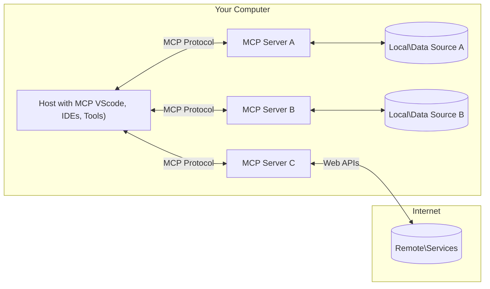

<!--
CO_OP_TRANSLATOR_METADATA:
{
  "original_hash": "355b12a5970c5c9e6db0bee970c751ba",
  "translation_date": "2025-07-04T16:59:45+00:00",
  "source_file": "01-CoreConcepts/README.md",
  "language_code": "br"
}
-->
# 📖 Conceitos Básicos do MCP: Dominando o Model Context Protocol para Integração com IA

O [Model Context Protocol (MCP)](https://github.com/modelcontextprotocol) é uma estrutura poderosa e padronizada que otimiza a comunicação entre Grandes Modelos de Linguagem (LLMs) e ferramentas externas, aplicações e fontes de dados. Este guia otimizado para SEO vai te conduzir pelos conceitos centrais do MCP, garantindo que você compreenda sua arquitetura cliente-servidor, componentes essenciais, mecânicas de comunicação e melhores práticas de implementação.

## Visão Geral

Esta lição explora a arquitetura fundamental e os componentes que compõem o ecossistema do Model Context Protocol (MCP). Você vai aprender sobre a arquitetura cliente-servidor, os principais componentes e os mecanismos de comunicação que impulsionam as interações do MCP.

## 👩‍🎓 Objetivos Principais de Aprendizagem

Ao final desta lição, você irá:

- Entender a arquitetura cliente-servidor do MCP.
- Identificar os papéis e responsabilidades de Hosts, Clients e Servers.
- Analisar as características centrais que tornam o MCP uma camada de integração flexível.
- Aprender como a informação flui dentro do ecossistema MCP.
- Obter insights práticos por meio de exemplos de código em .NET, Java, Python e JavaScript.

## 🔎 Arquitetura do MCP: Um Olhar Mais Profundo

O ecossistema MCP é construído sobre um modelo cliente-servidor. Essa estrutura modular permite que aplicações de IA interajam de forma eficiente com ferramentas, bancos de dados, APIs e recursos contextuais. Vamos detalhar essa arquitetura em seus componentes principais.

No seu núcleo, o MCP segue uma arquitetura cliente-servidor onde uma aplicação host pode se conectar a múltiplos servidores:



- **MCP Hosts**: Programas como VSCode, Claude Desktop, IDEs ou ferramentas de IA que desejam acessar dados via MCP
- **MCP Clients**: Clientes do protocolo que mantêm conexões 1:1 com servidores
- **MCP Servers**: Programas leves que expõem capacidades específicas através do Model Context Protocol padronizado
- **Fontes de Dados Locais**: Arquivos, bancos de dados e serviços do seu computador que os servidores MCP podem acessar de forma segura
- **Serviços Remotos**: Sistemas externos disponíveis pela internet que os servidores MCP podem conectar via APIs.

O Protocolo MCP é um padrão em evolução, você pode conferir as últimas atualizações na [especificação do protocolo](https://modelcontextprotocol.io/specification/2025-06-18/)

### 1. Hosts

No Model Context Protocol (MCP), os Hosts desempenham um papel crucial como a interface principal pela qual os usuários interagem com o protocolo. Hosts são aplicações ou ambientes que iniciam conexões com servidores MCP para acessar dados, ferramentas e prompts. Exemplos de Hosts incluem ambientes de desenvolvimento integrados (IDEs) como Visual Studio Code, ferramentas de IA como Claude Desktop, ou agentes personalizados criados para tarefas específicas.

**Hosts** são aplicações LLM que iniciam conexões. Eles:

- Executam ou interagem com modelos de IA para gerar respostas.
- Iniciam conexões com servidores MCP.
- Gerenciam o fluxo da conversa e a interface do usuário.
- Controlam permissões e restrições de segurança.
- Lidam com o consentimento do usuário para compartilhamento de dados e execução de ferramentas.

### 2. Clients

Clients são componentes essenciais que facilitam a interação entre Hosts e servidores MCP. Eles atuam como intermediários, permitindo que Hosts acessem e utilizem as funcionalidades oferecidas pelos servidores MCP. Eles desempenham um papel fundamental para garantir uma comunicação fluida e troca eficiente de dados dentro da arquitetura MCP.

**Clients** são conectores dentro da aplicação host. Eles:

- Enviam requisições aos servidores com prompts/instruções.
- Negociam capacidades com os servidores.
- Gerenciam solicitações de execução de ferramentas feitas pelos modelos.
- Processam e exibem respostas para os usuários.

### 3. Servers

Servers são responsáveis por lidar com as requisições dos clients MCP e fornecer respostas apropriadas. Eles gerenciam diversas operações como recuperação de dados, execução de ferramentas e geração de prompts. Os servidores garantem que a comunicação entre clients e Hosts seja eficiente e confiável, mantendo a integridade do processo de interação.

**Servers** são serviços que fornecem contexto e capacidades. Eles:

- Registram funcionalidades disponíveis (recursos, prompts, ferramentas)
- Recebem e executam chamadas de ferramentas vindas do client
- Fornecem informações contextuais para melhorar as respostas do modelo
- Retornam os resultados para o client
- Mantêm estado entre interações quando necessário

Servidores podem ser desenvolvidos por qualquer pessoa para estender as capacidades do modelo com funcionalidades especializadas.

### 4. Funcionalidades dos Servidores

Servidores no Model Context Protocol (MCP) fornecem blocos fundamentais que permitem interações ricas entre clients, hosts e modelos de linguagem. Essas funcionalidades são projetadas para ampliar as capacidades do MCP oferecendo contexto estruturado, ferramentas e prompts.

Servidores MCP podem oferecer qualquer uma das seguintes funcionalidades:

#### 📑 Recursos

Recursos no Model Context Protocol (MCP) abrangem vários tipos de contexto e dados que podem ser utilizados por usuários ou modelos de IA. Estes incluem:

- **Dados Contextuais**: Informações e contexto que usuários ou modelos de IA podem usar para tomada de decisão e execução de tarefas.
- **Bases de Conhecimento e Repositórios de Documentos**: Coleções de dados estruturados e não estruturados, como artigos, manuais e trabalhos de pesquisa, que fornecem insights e informações valiosas.
- **Arquivos e Bancos de Dados Locais**: Dados armazenados localmente em dispositivos ou dentro de bancos de dados, acessíveis para processamento e análise.
- **APIs e Serviços Web**: Interfaces e serviços externos que oferecem dados e funcionalidades adicionais, permitindo integração com diversos recursos e ferramentas online.

Um exemplo de recurso pode ser um esquema de banco de dados ou um arquivo que pode ser acessado assim:

```text
file://log.txt
database://schema
```

### 🤖 Prompts

Prompts no Model Context Protocol (MCP) incluem vários templates pré-definidos e padrões de interação projetados para otimizar fluxos de trabalho dos usuários e melhorar a comunicação. Estes incluem:

- **Mensagens e Fluxos de Trabalho Modelados**: Mensagens e processos pré-estruturados que guiam os usuários em tarefas e interações específicas.
- **Padrões de Interação Pré-definidos**: Sequências padronizadas de ações e respostas que facilitam uma comunicação consistente e eficiente.
- **Templates de Conversa Especializados**: Templates personalizáveis para tipos específicos de conversas, garantindo interações relevantes e contextualmente apropriadas.

Um template de prompt pode ser assim:

```markdown
Generate a product slogan based on the following {{product}} with the following {{keywords}}
```

#### ⛏️ Ferramentas

Ferramentas no Model Context Protocol (MCP) são funções que o modelo de IA pode executar para realizar tarefas específicas. Essas ferramentas são projetadas para ampliar as capacidades do modelo de IA fornecendo operações estruturadas e confiáveis. Aspectos principais incluem:

- **Funções para o modelo de IA executar**: Ferramentas são funções executáveis que o modelo pode invocar para realizar diversas tarefas.
- **Nome Único e Descrição**: Cada ferramenta tem um nome distinto e uma descrição detalhada que explica seu propósito e funcionalidade.
- **Parâmetros e Resultados**: Ferramentas aceitam parâmetros específicos e retornam resultados estruturados, garantindo resultados consistentes e previsíveis.
- **Funções Discretas**: Ferramentas realizam funções específicas como buscas na web, cálculos e consultas a bancos de dados.

Um exemplo de ferramenta poderia ser assim:

```typescript
server.tool(
  "GetProducts",
  {
    pageSize: z.string().optional(),
    pageCount: z.string().optional()
  }, () => {
    // return results from API
  }
)
```

## Funcionalidades dos Clients

No Model Context Protocol (MCP), os clients oferecem várias funcionalidades importantes para os servidores, ampliando a funcionalidade geral e a interação dentro do protocolo. Uma das funcionalidades notáveis é o Sampling.

### 👉 Sampling

- **Comportamentos Agentes Iniciados pelo Servidor**: Clients permitem que servidores iniciem ações ou comportamentos específicos de forma autônoma, ampliando as capacidades dinâmicas do sistema.
- **Interações Recursivas com LLMs**: Essa funcionalidade permite interações recursivas com grandes modelos de linguagem (LLMs), possibilitando um processamento mais complexo e iterativo das tarefas.
- **Solicitação de Completações Adicionais do Modelo**: Servidores podem solicitar completações adicionais do modelo, garantindo que as respostas sejam completas e contextualmente relevantes.

## Fluxo de Informação no MCP

O Model Context Protocol (MCP) define um fluxo estruturado de informações entre hosts, clients, servers e modelos. Entender esse fluxo ajuda a esclarecer como as solicitações dos usuários são processadas e como ferramentas externas e dados são integrados nas respostas do modelo.

- **Host Inicia a Conexão**  
  A aplicação host (como um IDE ou interface de chat) estabelece uma conexão com um servidor MCP, normalmente via STDIO, WebSocket ou outro transporte suportado.

- **Negociação de Capacidades**  
  O client (embutido no host) e o servidor trocam informações sobre suas funcionalidades, ferramentas, recursos e versões do protocolo suportadas. Isso garante que ambos os lados entendam as capacidades disponíveis para a sessão.

- **Solicitação do Usuário**  
  O usuário interage com o host (por exemplo, digitando um prompt ou comando). O host coleta essa entrada e a passa para o client para processamento.

- **Uso de Recurso ou Ferramenta**  
  - O client pode solicitar contexto ou recursos adicionais do servidor (como arquivos, entradas de banco de dados ou artigos de base de conhecimento) para enriquecer a compreensão do modelo.
  - Se o modelo determinar que uma ferramenta é necessária (por exemplo, para buscar dados, realizar um cálculo ou chamar uma API), o client envia uma requisição de invocação da ferramenta ao servidor, especificando o nome da ferramenta e os parâmetros.

- **Execução pelo Servidor**  
  O servidor recebe a requisição de recurso ou ferramenta, executa as operações necessárias (como rodar uma função, consultar um banco de dados ou recuperar um arquivo) e retorna os resultados ao client em formato estruturado.

- **Geração da Resposta**  
  O client integra as respostas do servidor (dados de recursos, resultados de ferramentas, etc.) na interação contínua com o modelo. O modelo usa essas informações para gerar uma resposta abrangente e contextualmente relevante.

- **Apresentação do Resultado**  
  O host recebe a saída final do client e a apresenta ao usuário, frequentemente incluindo tanto o texto gerado pelo modelo quanto quaisquer resultados de execuções de ferramentas ou consultas a recursos.

Esse fluxo permite que o MCP suporte aplicações de IA avançadas, interativas e conscientes do contexto, conectando modelos com ferramentas externas e fontes de dados de forma fluida.

## Detalhes do Protocolo

O MCP (Model Context Protocol) é construído sobre o [JSON-RPC 2.0](https://www.jsonrpc.org/), fornecendo um formato de mensagem padronizado e independente de linguagem para comunicação entre hosts, clients e servers. Essa base possibilita interações confiáveis, estruturadas e extensíveis em diversas plataformas e linguagens de programação.

### Principais Características do Protocolo

O MCP estende o JSON-RPC 2.0 com convenções adicionais para invocação de ferramentas, acesso a recursos e gerenciamento de prompts. Suporta múltiplas camadas de transporte (STDIO, WebSocket, SSE) e permite comunicação segura, extensível e independente de linguagem entre os componentes.

#### 🧢 Protocolo Base

- **Formato de Mensagem JSON-RPC**: Todas as requisições e respostas usam a especificação JSON-RPC 2.0, garantindo estrutura consistente para chamadas de método, parâmetros, resultados e tratamento de erros.
- **Conexões com Estado**: Sessões MCP mantêm estado ao longo de múltiplas requisições, suportando conversas contínuas, acumulação de contexto e gerenciamento de recursos.
- **Negociação de Capacidades**: Durante a configuração da conexão, clients e servers trocam informações sobre funcionalidades suportadas, versões do protocolo, ferramentas e recursos disponíveis. Isso assegura que ambos os lados compreendam as capacidades um do outro e possam se adaptar.

#### ➕ Utilitários Adicionais

A seguir, alguns utilitários e extensões do protocolo que o MCP oferece para melhorar a experiência do desenvolvedor e viabilizar cenários avançados:

- **Opções de Configuração**: MCP permite configuração dinâmica de parâmetros da sessão, como permissões de ferramentas, acesso a recursos e configurações do modelo, adaptadas a cada interação.
- **Acompanhamento de Progresso**: Operações de longa duração podem reportar atualizações de progresso, possibilitando interfaces responsivas e melhor experiência do usuário durante tarefas complexas.
- **Cancelamento de Requisições**: Clients podem cancelar requisições em andamento, permitindo que usuários interrompam operações que não são mais necessárias ou que estejam demorando demais.
- **Relato de Erros**: Mensagens e códigos de erro padronizados ajudam a diagnosticar problemas, tratar falhas de forma elegante e fornecer feedback acionável para usuários e desenvolvedores.
- **Registro de Logs**: Tanto clients quanto servers podem emitir logs estruturados para auditoria, depuração e monitoramento das interações do protocolo.

Ao aproveitar essas funcionalidades do protocolo, o MCP garante comunicação robusta, segura e flexível entre modelos de linguagem e ferramentas ou fontes de dados externas.

### 🔐 Considerações de Segurança

Implementações do MCP devem seguir vários princípios-chave de segurança para garantir interações seguras e confiáveis:

- **Consentimento e Controle do Usuário**: Os usuários devem fornecer consentimento explícito antes que qualquer dado seja acessado ou operações sejam realizadas. Eles devem ter controle claro sobre quais dados são compartilhados e quais ações são autorizadas, apoiados por interfaces intuitivas para revisar e aprovar atividades.

- **Privacidade dos Dados**: Dados dos usuários devem ser expostos apenas com consentimento explícito e protegidos por controles de acesso adequados. Implementações MCP devem proteger contra transmissão não autorizada de dados e garantir que a privacidade seja mantida em todas as interações.

- **Segurança das Ferramentas**: Antes de invocar qualquer ferramenta, é necessário consentimento explícito do usuário. Os usuários devem compreender claramente a funcionalidade de cada ferramenta, e limites de segurança robustos devem ser aplicados para evitar execuções não intencionais ou inseguras.

Seguindo esses princípios, o MCP assegura que a confiança, privacidade e segurança do usuário sejam mantidas em todas as interações do protocolo.

## Exemplos de Código: Componentes Principais

A seguir, exemplos de código em várias linguagens populares que ilustram como implementar componentes principais de servidores MCP e ferramentas.

### Exemplo .NET: Criando um Servidor MCP Simples com Ferramentas

Aqui está um exemplo prático em .NET demonstrando como implementar um servidor MCP simples com ferramentas personalizadas. Este exemplo mostra como definir e registrar ferramentas, lidar com requisições e conectar o servidor usando o Model Context Protocol.

```csharp
using System;
using System.Threading.Tasks;
using ModelContextProtocol.Server;
using ModelContextProtocol.Server.Transport;
using ModelContextProtocol.Server.Tools;

public class WeatherServer
{
    public static async Task Main(string[] args)
    {
        // Create an MCP server
        var server = new McpServer(
            name: "Weather MCP Server",
            version: "1.0.0"
        );
        
        // Register our custom weather tool
        server.AddTool<string, WeatherData>("weatherTool", 
            description: "Gets current weather for a location",
            execute: async (location) => {
                // Call weather API (simplified)
                var weatherData = await GetWeatherDataAsync(location);
                return weatherData;
            });
        
        // Connect the server using stdio transport
        var transport = new StdioServerTransport();
        await server.ConnectAsync(transport);
        
        Console.WriteLine("Weather MCP Server started");
        
        // Keep the server running until process is terminated
        await Task.Delay(-1);
    }
    
    private static async Task<WeatherData> GetWeatherDataAsync(string location)
    {
        // This would normally call a weather API
        // Simplified for demonstration
        await Task.Delay(100); // Simulate API call
        return new WeatherData { 
            Temperature = 72.5,
            Conditions = "Sunny",
            Location = location
        };
    }
}

public class WeatherData
{
    public double Temperature { get; set; }
    public string Conditions { get; set; }
    public string Location { get; set; }
}
```

### Exemplo Java: Componentes de Servidor MCP

Este exemplo demonstra o mesmo servidor MCP e registro de ferramentas do exemplo .NET acima, mas implementado em Java.

```java
import io.modelcontextprotocol.server.McpServer;
import io.modelcontextprotocol.server.McpToolDefinition;
import io.modelcontextprotocol.server.transport.StdioServerTransport;
import io.modelcontextprotocol.server.tool.ToolExecutionContext;
import io.modelcontextprotocol.server.tool.ToolResponse;

public class WeatherMcpServer {
    public static void main(String[] args) throws Exception {
        // Create an MCP server
        McpServer server = McpServer.builder()
            .name("Weather MCP Server")
            .version("1.0.0")
            .build();
            
        // Register a weather tool
        server.registerTool(McpToolDefinition.builder("weatherTool")
            .description("Gets current weather for a location")
            .parameter("location", String.class)
            .execute((ToolExecutionContext ctx) -> {
                String location = ctx.getParameter("location", String.class);
                
                // Get weather data (simplified)
                WeatherData data = getWeatherData(location);
                
                // Return formatted response
                return ToolResponse.content(
                    String.format("Temperature: %.1f°F, Conditions: %s, Location: %s", 
                    data.getTemperature(), 
                    data.getConditions(), 
                    data.getLocation())
                );
            })
            .build());
        
        // Connect the server using stdio transport
        try (StdioServerTransport transport = new StdioServerTransport()) {
            server.connect(transport);
            System.out.println("Weather MCP Server started");
            // Keep server running until process is terminated
            Thread.currentThread().join();
        }
    }
    
    private static WeatherData getWeatherData(String location) {
        // Implementation would call a weather API
        // Simplified for example purposes
        return new WeatherData(72.5, "Sunny", location);
    }
}

class WeatherData {
    private double temperature;
    private String conditions;
    private String location;
    
    public WeatherData(double temperature, String conditions, String location) {
        this.temperature = temperature;
        this.conditions = conditions;
        this.location = location;
    }
    
    public double getTemperature() {
        return temperature;
    }
    
    public String getConditions() {
        return conditions;
    }
    
    public String getLocation() {
        return location;
    }
}
```

### Exemplo Python: Construindo um Servidor MCP

Neste exemplo mostramos como construir um servidor MCP em Python. Também são apresentadas duas formas diferentes de criar ferramentas.

```python
#!/usr/bin/env python3
import asyncio
from mcp.server.fastmcp import FastMCP
from mcp.server.transports.stdio import serve_stdio

# Create a FastMCP server
mcp = FastMCP(
    name="Weather MCP Server",
    version="1.0.0"
)

@mcp.tool()
def get_weather(location: str) -> dict:
    """Gets current weather for a location."""
    # This would normally call a weather API
    # Simplified for demonstration
    return {
        "temperature": 72.5,
        "conditions": "Sunny",
        "location": location
    }

# Alternative approach using a class
class WeatherTools:
    @mcp.tool()
    def forecast(self, location: str, days: int = 1) -> dict:
        """Gets weather forecast for a location for the specified number of days."""
        # This would normally call a weather API forecast endpoint
        # Simplified for demonstration
        return {
            "location": location,
            "forecast": [
                {"day": i+1, "temperature": 70 + i, "conditions": "Partly Cloudy"}
                for i in range(days)
            ]
        }

# Instantiate the class to register its tools
weather_tools = WeatherTools()

# Start the server using stdio transport
if __name__ == "__main__":
    asyncio.run(serve_stdio(mcp))
```

### Exemplo JavaScript: Criando um Servidor MCP

Este exemplo mostra a criação de um servidor MCP em JavaScript e como registrar duas ferramentas relacionadas ao clima.

```javascript
// Using the official Model Context Protocol SDK
import { McpServer } from "@modelcontextprotocol/sdk/server/mcp.js";
import { StdioServerTransport } from "@modelcontextprotocol/sdk/server/stdio.js";
import { z } from "zod"; // For parameter validation

// Create an MCP server
const server = new McpServer({
  name: "Weather MCP Server",
  version: "1.0.0"
});

// Define a weather tool
server.tool(
  "weatherTool",
  {
    location: z.string().describe("The location to get weather for")
  },
  async ({ location }) => {
    // This would normally call a weather API
    // Simplified for demonstration
    const weatherData = await getWeatherData(location);
    
    return {
      content: [
        { 
          type: "text", 
          text: `Temperature: ${weatherData.temperature}°F, Conditions: ${weatherData.conditions}, Location: ${weatherData.location}` 
        }
      ]
    };
  }
);

// Define a forecast tool
server.tool(
  "forecastTool",
  {
    location: z.string(),
    days: z.number().default(3).describe("Number of days for forecast")
  },
  async ({ location, days }) => {
    // This would normally call a weather API
    // Simplified for demonstration
    const forecast = await getForecastData(location, days);
    
    return {
      content: [
        { 
          type: "text", 
          text: `${days}-day forecast for ${location}: ${JSON.stringify(forecast)}` 
        }
      ]
    };
  }
);

// Helper functions
async function getWeatherData(location) {
  // Simulate API call
  return {
    temperature: 72.5,
    conditions: "Sunny",
    location: location
  };
}

async function getForecastData(location, days) {
  // Simulate API call
  return Array.from({ length: days }, (_, i) => ({
    day: i + 1,
    temperature: 70 + Math.floor(Math.random() * 10),
    conditions: i % 2 === 0 ? "Sunny" : "Partly Cloudy"
  }));
}

// Connect the server using stdio transport
const transport = new StdioServerTransport();
server.connect(transport).catch(console.error);

console.log("Weather MCP Server started");
```

Este exemplo em JavaScript demonstra como criar um client MCP que se conecta a um servidor, envia um prompt e processa a resposta, incluindo quaisquer chamadas de ferramentas que foram feitas.

## Segurança e Autorização
MCP inclui vários conceitos e mecanismos integrados para gerenciar segurança e autorização ao longo do protocolo:

1. **Controle de Permissão de Ferramentas**:  
  Os clientes podem especificar quais ferramentas um modelo pode usar durante uma sessão. Isso garante que apenas ferramentas explicitamente autorizadas estejam acessíveis, reduzindo o risco de operações não intencionais ou inseguras. As permissões podem ser configuradas dinamicamente com base nas preferências do usuário, políticas organizacionais ou no contexto da interação.

2. **Autenticação**:  
  Os servidores podem exigir autenticação antes de conceder acesso a ferramentas, recursos ou operações sensíveis. Isso pode envolver chaves de API, tokens OAuth ou outros esquemas de autenticação. A autenticação adequada garante que apenas clientes e usuários confiáveis possam invocar capacidades do lado do servidor.

3. **Validação**:  
  A validação de parâmetros é aplicada para todas as invocações de ferramentas. Cada ferramenta define os tipos, formatos e restrições esperados para seus parâmetros, e o servidor valida as requisições recebidas de acordo. Isso evita que entradas malformadas ou maliciosas cheguem às implementações das ferramentas e ajuda a manter a integridade das operações.

4. **Limitação de Taxa**:  
  Para evitar abusos e garantir o uso justo dos recursos do servidor, os servidores MCP podem implementar limitação de taxa para chamadas de ferramentas e acesso a recursos. Os limites podem ser aplicados por usuário, por sessão ou globalmente, ajudando a proteger contra ataques de negação de serviço ou consumo excessivo de recursos.

Ao combinar esses mecanismos, o MCP oferece uma base segura para integrar modelos de linguagem com ferramentas externas e fontes de dados, ao mesmo tempo em que proporciona aos usuários e desenvolvedores controle detalhado sobre acesso e uso.

## Mensagens do Protocolo

A comunicação MCP utiliza mensagens JSON estruturadas para facilitar interações claras e confiáveis entre clientes, servidores e modelos. Os principais tipos de mensagem incluem:

- **Requisição do Cliente**  
  Enviada do cliente para o servidor, essa mensagem normalmente inclui:
  - O prompt ou comando do usuário
  - Histórico da conversa para contexto
  - Configuração e permissões das ferramentas
  - Qualquer metadado adicional ou informação da sessão

- **Resposta do Modelo**  
  Retornada pelo modelo (via cliente), essa mensagem contém:
  - Texto gerado ou conclusão baseada no prompt e contexto
  - Instruções opcionais para chamada de ferramenta caso o modelo determine que uma ferramenta deve ser invocada
  - Referências a recursos ou contexto adicional conforme necessário

- **Requisição de Ferramenta**  
  Enviada do cliente para o servidor quando uma ferramenta precisa ser executada. Essa mensagem inclui:
  - O nome da ferramenta a ser invocada
  - Parâmetros exigidos pela ferramenta (validados contra o esquema da ferramenta)
  - Informações contextuais ou identificadores para rastreamento da requisição

- **Resposta da Ferramenta**  
  Retornada pelo servidor após a execução de uma ferramenta. Essa mensagem fornece:
  - Os resultados da execução da ferramenta (dados estruturados ou conteúdo)
  - Quaisquer erros ou informações de status caso a chamada da ferramenta tenha falhado
  - Opcionalmente, metadados adicionais ou logs relacionados à execução

Essas mensagens estruturadas garantem que cada etapa no fluxo de trabalho do MCP seja explícita, rastreável e extensível, suportando cenários avançados como conversas multi-turno, encadeamento de ferramentas e tratamento robusto de erros.

## Principais Pontos

- MCP usa uma arquitetura cliente-servidor para conectar modelos a capacidades externas
- O ecossistema é composto por clientes, hosts, servidores, ferramentas e fontes de dados
- A comunicação pode ocorrer via STDIO, SSE ou WebSockets
- Ferramentas são as unidades fundamentais de funcionalidade expostas aos modelos
- Protocolos de comunicação estruturados garantem interações consistentes

## Exercício

Projete uma ferramenta MCP simples que seria útil no seu domínio. Defina:
1. Qual seria o nome da ferramenta
2. Quais parâmetros ela aceitaria
3. Qual saída ela retornaria
4. Como um modelo poderia usar essa ferramenta para resolver problemas dos usuários


---

## O que vem a seguir

Próximo: [Capítulo 2: Segurança](../02-Security/README.md)

**Aviso Legal**:  
Este documento foi traduzido utilizando o serviço de tradução por IA [Co-op Translator](https://github.com/Azure/co-op-translator). Embora nos esforcemos para garantir a precisão, esteja ciente de que traduções automáticas podem conter erros ou imprecisões. O documento original em seu idioma nativo deve ser considerado a fonte autorizada. Para informações críticas, recomenda-se tradução profissional humana. Não nos responsabilizamos por quaisquer mal-entendidos ou interpretações incorretas decorrentes do uso desta tradução.