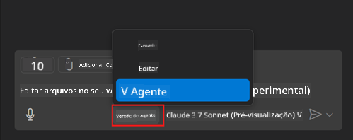
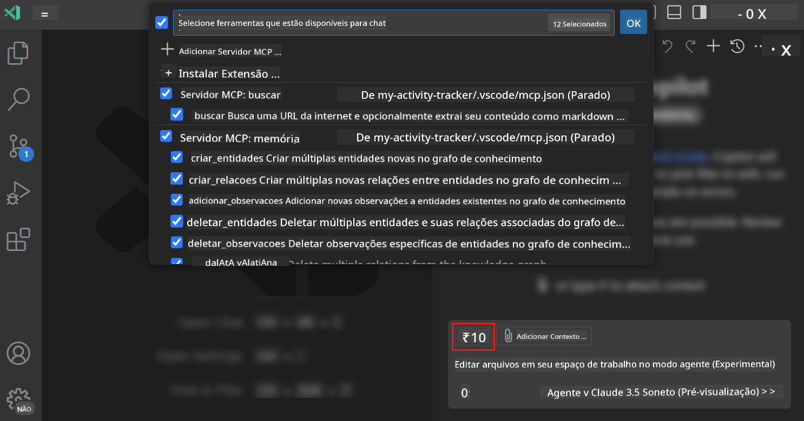
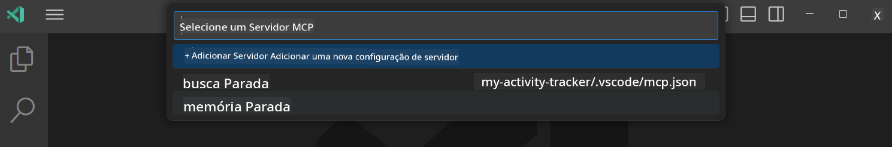
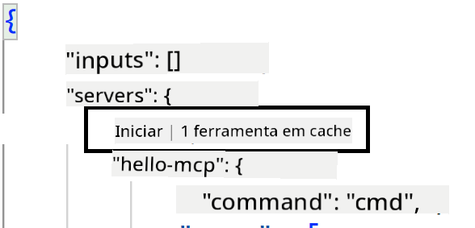
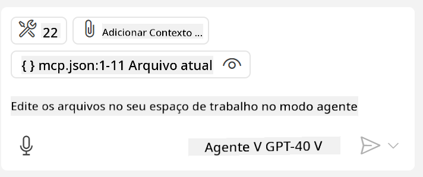
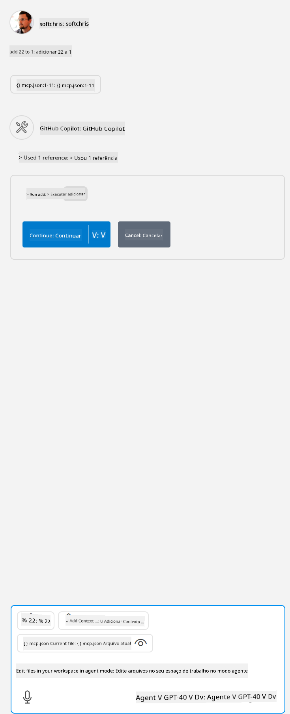

<!--
CO_OP_TRANSLATOR_METADATA:
{
  "original_hash": "d940b5e0af75e3a3a4d1c3179120d1d9",
  "translation_date": "2025-08-26T17:38:22+00:00",
  "source_file": "03-GettingStarted/04-vscode/README.md",
  "language_code": "br"
}
-->
# Consumindo um servidor no modo Agente do GitHub Copilot

O Visual Studio Code e o GitHub Copilot podem atuar como clientes e consumir um MCP Server. Por que faríamos isso, você pode perguntar? Bem, isso significa que qualquer funcionalidade que o MCP Server tenha agora pode ser usada diretamente no seu IDE. Imagine, por exemplo, adicionar o MCP Server do GitHub; isso permitiria controlar o GitHub por meio de prompts, em vez de digitar comandos específicos no terminal. Ou imagine qualquer coisa que possa melhorar sua experiência como desenvolvedor, tudo controlado por linguagem natural. Agora você começa a entender a vantagem, certo?

## Visão Geral

Esta lição aborda como usar o Visual Studio Code e o modo Agente do GitHub Copilot como cliente para o seu MCP Server.

## Objetivos de Aprendizado

Ao final desta lição, você será capaz de:

- Consumir um MCP Server via Visual Studio Code.
- Executar funcionalidades como ferramentas via GitHub Copilot.
- Configurar o Visual Studio Code para localizar e gerenciar seu MCP Server.

## Uso

Você pode controlar seu MCP Server de duas maneiras diferentes:

- Interface de usuário: você verá como isso é feito mais adiante neste capítulo.
- Terminal: é possível controlar as coisas a partir do terminal usando o executável `code`:

  Para adicionar um MCP Server ao seu perfil de usuário, use a opção de linha de comando --add-mcp e forneça a configuração do servidor JSON no formato {\"name\":\"server-name\",\"command\":...}.

  ```
  code --add-mcp "{\"name\":\"my-server\",\"command\": \"uvx\",\"args\": [\"mcp-server-fetch\"]}"
  ```

### Capturas de Tela





Vamos falar mais sobre como usar a interface visual nas próximas seções.

## Abordagem

Aqui está como precisamos abordar isso em alto nível:

- Configurar um arquivo para localizar nosso MCP Server.
- Iniciar/Conectar ao servidor para listar suas funcionalidades.
- Usar essas funcionalidades por meio da interface de chat do GitHub Copilot.

Ótimo, agora que entendemos o fluxo, vamos tentar usar um MCP Server no Visual Studio Code por meio de um exercício.

## Exercício: Consumindo um servidor

Neste exercício, configuraremos o Visual Studio Code para localizar seu MCP Server, para que ele possa ser usado na interface de chat do GitHub Copilot.

### -0- Pré-passo: habilitar descoberta de MCP Server

Pode ser necessário habilitar a descoberta de MCP Servers.

1. Vá para `Arquivo -> Preferências -> Configurações` no Visual Studio Code.

1. Procure por "MCP" e habilite `chat.mcp.discovery.enabled` no arquivo settings.json.

### -1- Criar arquivo de configuração

Comece criando um arquivo de configuração na raiz do seu projeto. Você precisará de um arquivo chamado MCP.json e colocá-lo em uma pasta chamada .vscode. Deve ficar assim:

```text
.vscode
|-- mcp.json
```

Em seguida, vamos ver como adicionar uma entrada de servidor.

### -2- Configurar um servidor

Adicione o seguinte conteúdo ao arquivo *mcp.json*:

```json
{
    "inputs": [],
    "servers": {
       "hello-mcp": {
           "command": "node",
           "args": [
               "build/index.js"
           ]
       }
    }
}
```

O exemplo acima mostra como iniciar um servidor escrito em Node.js. Para outras linguagens, indique o comando apropriado para iniciar o servidor usando `command` e `args`.

### -3- Iniciar o servidor

Agora que você adicionou uma entrada, vamos iniciar o servidor:

1. Localize sua entrada no arquivo *mcp.json* e certifique-se de encontrar o ícone de "play":

    

1. Clique no ícone de "play". Você deve ver o ícone de ferramentas no GitHub Copilot Chat aumentar o número de ferramentas disponíveis. Se você clicar nesse ícone de ferramentas, verá uma lista de ferramentas registradas. Você pode marcar/desmarcar cada ferramenta dependendo se deseja que o GitHub Copilot as use como contexto:

  

1. Para executar uma ferramenta, digite um prompt que corresponda à descrição de uma das suas ferramentas, por exemplo, um prompt como "somar 22 e 1":

  

  Você deve ver uma resposta dizendo 23.

## Tarefa

Tente adicionar uma entrada de servidor ao seu arquivo *mcp.json* e certifique-se de que pode iniciar/parar o servidor. Certifique-se também de que pode se comunicar com as ferramentas no seu servidor por meio da interface de chat do GitHub Copilot.

## Solução

[Solução](./solution/README.md)

## Principais Conclusões

Os principais pontos desta lição são os seguintes:

- O Visual Studio Code é um ótimo cliente que permite consumir vários MCP Servers e suas ferramentas.
- A interface de chat do GitHub Copilot é como você interage com os servidores.
- Você pode solicitar entradas do usuário, como chaves de API, que podem ser passadas para o MCP Server ao configurar a entrada do servidor no arquivo *mcp.json*.

## Exemplos

- [Calculadora em Java](../samples/java/calculator/README.md)
- [Calculadora em .Net](../../../../03-GettingStarted/samples/csharp)
- [Calculadora em JavaScript](../samples/javascript/README.md)
- [Calculadora em TypeScript](../samples/typescript/README.md)
- [Calculadora em Python](../../../../03-GettingStarted/samples/python)

## Recursos Adicionais

- [Documentação do Visual Studio](https://code.visualstudio.com/docs/copilot/chat/mcp-servers)

## O Que Vem a Seguir

- Próximo: [Criando um servidor stdio](../05-stdio-server/README.md)

---

**Aviso Legal**:  
Este documento foi traduzido utilizando o serviço de tradução por IA [Co-op Translator](https://github.com/Azure/co-op-translator). Embora nos esforcemos para garantir a precisão, esteja ciente de que traduções automatizadas podem conter erros ou imprecisões. O documento original em seu idioma nativo deve ser considerado a fonte autoritativa. Para informações críticas, recomenda-se a tradução profissional realizada por humanos. Não nos responsabilizamos por quaisquer mal-entendidos ou interpretações equivocadas decorrentes do uso desta tradução.