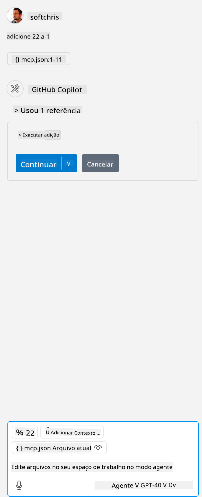

<!--
CO_OP_TRANSLATOR_METADATA:
{
  "original_hash": "96e08a8c1049dab757deb64cce4ea1e8",
  "translation_date": "2025-05-17T11:20:24+00:00",
  "source_file": "03-GettingStarted/04-vscode/solution/README.md",
  "language_code": "br"
}
-->
# Executando o exemplo

Aqui assumimos que você já tem um código de servidor funcionando. Por favor, localize um servidor em um dos capítulos anteriores.

## Configurar mcp.json

Aqui está um arquivo que você usa como referência, [mcp.json](../../../../../03-GettingStarted/04-vscode/solution/mcp.json).

Altere a entrada do servidor conforme necessário para apontar o caminho absoluto para o seu servidor, incluindo o comando completo necessário para executá-lo.

No arquivo de exemplo mencionado acima, a entrada do servidor se parece com isto:

```json
"hello-mcp": {
    "command": "cmd",
    "args": [
        "/c", "node", "<absolute path>\\build\\index.js"
    ]
}
```

Isso corresponde a executar um comando assim: `cmd /c node <caminho absoluto>\\build\index.js`. 

- Change this server entry to fit where your server file is located or to what's needed to startup your server depending on your chosen runtime and server location.

## Consume the features in the server

- Click the `play` icon, once you've added *mcp.json* to *./vscode* folder, 

    Observe the tooling icon change to increase the number of available tools. Tooling icon is located right above the chat field in GitHub Copilot.

## Run a tool

- Type a prompt in your chat window that matches the description of your tool. For example to trigger the tool `add` e digitar algo como "add 3 to 20".

Você deve ver uma ferramenta sendo apresentada acima da caixa de texto do chat, indicando para você selecionar para executar a ferramenta como nesta imagem:



Selecionar a ferramenta deve produzir um resultado numérico dizendo "23" se seu comando foi como mencionamos anteriormente.

**Aviso Legal**:  
Este documento foi traduzido usando o serviço de tradução por IA [Co-op Translator](https://github.com/Azure/co-op-translator). Embora nos esforcemos para garantir a precisão, esteja ciente de que traduções automatizadas podem conter erros ou imprecisões. O documento original em seu idioma nativo deve ser considerado a fonte autorizada. Para informações críticas, recomenda-se a tradução humana profissional. Não nos responsabilizamos por quaisquer mal-entendidos ou interpretações errôneas decorrentes do uso desta tradução.