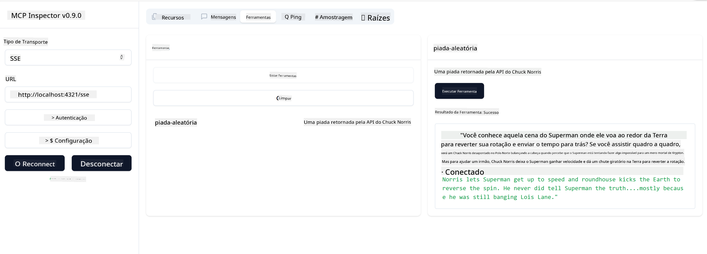

<!--
CO_OP_TRANSLATOR_METADATA:
{
  "original_hash": "d90ca3d326c48fab2ac0ebd3a9876f59",
  "translation_date": "2025-07-13T19:54:23+00:00",
  "source_file": "03-GettingStarted/05-sse-server/README.md",
  "language_code": "br"
}
-->
Agora que sabemos um pouco mais sobre SSE, vamos construir um servidor SSE a seguir.

## Exercício: Criando um Servidor SSE

Para criar nosso servidor, precisamos ter duas coisas em mente:

- Precisamos usar um servidor web para expor endpoints para conexão e mensagens.
- Construir nosso servidor como normalmente fazemos com ferramentas, recursos e prompts quando estávamos usando stdio.

### -1- Criar uma instância do servidor

Para criar nosso servidor, usamos os mesmos tipos que com stdio. No entanto, para o transporte, precisamos escolher SSE.

Vamos adicionar as rotas necessárias a seguir.

### -2- Adicionar rotas

Vamos adicionar rotas que lidam com a conexão e mensagens recebidas:

Vamos adicionar capacidades ao servidor a seguir.

### -3- Adicionando capacidades ao servidor

Agora que definimos tudo específico do SSE, vamos adicionar capacidades ao servidor como ferramentas, prompts e recursos.

Seu código completo deve ficar assim:

Ótimo, temos um servidor usando SSE, vamos testá-lo a seguir.

## Exercício: Depurando um Servidor SSE com o Inspector

O Inspector é uma ótima ferramenta que vimos em uma lição anterior [Criando seu primeiro servidor](/03-GettingStarted/01-first-server/README.md). Vamos ver se podemos usar o Inspector aqui também:

### -1- Executando o inspector

Para executar o inspector, você primeiro deve ter um servidor SSE rodando, então vamos fazer isso a seguir:

1. Execute o servidor

1. Execute o inspector

    > ![NOTE]
    > Execute isso em uma janela de terminal separada daquela onde o servidor está rodando. Também note que você precisa ajustar o comando abaixo para corresponder à URL onde seu servidor está rodando.

    ```sh
    npx @modelcontextprotocol/inspector --cli http://localhost:8000/sse --method tools/list
    ```

Executar o inspector é igual em todos os ambientes de execução. Note como, ao invés de passar um caminho para nosso servidor e um comando para iniciar o servidor, passamos a URL onde o servidor está rodando e também especificamos a rota `/sse`.

### -2- Testando a ferramenta

Conecte ao servidor selecionando SSE na lista suspensa e preencha o campo de URL onde seu servidor está rodando, por exemplo http:localhost:4321/sse. Agora clique no botão "Connect". Como antes, selecione listar ferramentas, escolha uma ferramenta e forneça valores de entrada. Você deve ver um resultado como o abaixo:



Ótimo, você conseguiu trabalhar com o inspector, vamos ver como trabalhar com o Visual Studio Code a seguir.

## Tarefa

Tente expandir seu servidor com mais capacidades. Veja [esta página](https://api.chucknorris.io/) para, por exemplo, adicionar uma ferramenta que chama uma API. Você decide como o servidor deve ser. Divirta-se :)

## Solução

[Solucao](./solution/README.md) Aqui está uma possível solução com código funcional.

## Principais Lições

As principais lições deste capítulo são as seguintes:

- SSE é o segundo tipo de transporte suportado, ao lado do stdio.
- Para suportar SSE, você precisa gerenciar conexões e mensagens recebidas usando um framework web.
- Você pode usar tanto o Inspector quanto o Visual Studio Code para consumir um servidor SSE, assim como servidores stdio. Note como há pequenas diferenças entre stdio e SSE. Para SSE, você precisa iniciar o servidor separadamente e depois rodar sua ferramenta inspector. Para a ferramenta inspector, também há diferenças em que você precisa especificar a URL.

## Exemplos

- [Calculadora Java](../samples/java/calculator/README.md)
- [Calculadora .Net](../../../../03-GettingStarted/samples/csharp)
- [Calculadora JavaScript](../samples/javascript/README.md)
- [Calculadora TypeScript](../samples/typescript/README.md)
- [Calculadora Python](../../../../03-GettingStarted/samples/python)

## Recursos Adicionais

- [SSE](https://developer.mozilla.org/en-US/docs/Web/API/Server-sent_events)

## O que vem a seguir

- Próximo: [Streaming HTTP com MCP (HTTP Streamable)](../06-http-streaming/README.md)

**Aviso Legal**:  
Este documento foi traduzido utilizando o serviço de tradução por IA [Co-op Translator](https://github.com/Azure/co-op-translator). Embora nos esforcemos para garantir a precisão, esteja ciente de que traduções automáticas podem conter erros ou imprecisões. O documento original em seu idioma nativo deve ser considerado a fonte autorizada. Para informações críticas, recomenda-se tradução profissional humana. Não nos responsabilizamos por quaisquer mal-entendidos ou interpretações incorretas decorrentes do uso desta tradução.