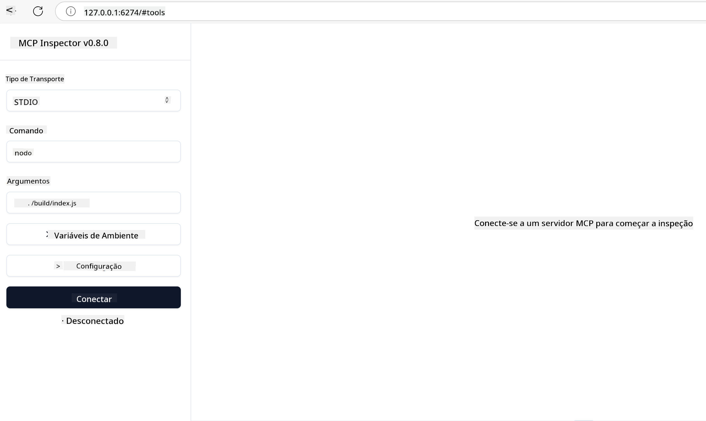

<!--
CO_OP_TRANSLATOR_METADATA:
{
  "original_hash": "717f34718a773f6cf52d8445e40a96bf",
  "translation_date": "2025-05-17T12:42:39+00:00",
  "source_file": "03-GettingStarted/07-testing/README.md",
  "language_code": "br"
}
-->
## Testando e Depurando

Antes de começar a testar seu servidor MCP, é importante entender as ferramentas disponíveis e as melhores práticas para depuração. Testes eficazes garantem que seu servidor se comporte conforme esperado e ajudam a identificar e resolver problemas rapidamente. A seção a seguir descreve abordagens recomendadas para validar sua implementação MCP.

## Visão Geral

Esta lição aborda como selecionar a abordagem de teste correta e a ferramenta de teste mais eficaz.

## Objetivos de Aprendizagem

Ao final desta lição, você será capaz de:

- Descrever várias abordagens para testes.
- Usar diferentes ferramentas para testar seu código de forma eficaz.

## Testando Servidores MCP

MCP oferece ferramentas para ajudar a testar e depurar seus servidores:

- **MCP Inspector**: Uma ferramenta de linha de comando que pode ser executada tanto como uma ferramenta CLI quanto como uma ferramenta visual.
- **Teste manual**: Você pode usar uma ferramenta como curl para executar requisições web, mas qualquer ferramenta capaz de executar HTTP serve.
- **Teste unitário**: É possível usar seu framework de teste preferido para testar os recursos tanto do servidor quanto do cliente.

### Usando o MCP Inspector

Descrevemos o uso desta ferramenta em lições anteriores, mas vamos falar um pouco mais sobre ela em um nível elevado. É uma ferramenta construída em Node.js e você pode usá-la chamando o executável `npx`, que fará o download e instalação temporária da ferramenta e se limpará após terminar de executar sua solicitação.

O [MCP Inspector](https://github.com/modelcontextprotocol/inspector) ajuda você a:

- **Descobrir Capacidades do Servidor**: Detectar automaticamente recursos, ferramentas e prompts disponíveis
- **Testar Execução de Ferramentas**: Tentar diferentes parâmetros e ver respostas em tempo real
- **Ver Metadados do Servidor**: Examinar informações do servidor, esquemas e configurações

Uma execução típica da ferramenta se parece com isso:

```bash
npx @modelcontextprotocol/inspector node build/index.js
```

O comando acima inicia um MCP e sua interface visual e lança uma interface web local em seu navegador. Você pode esperar ver um painel exibindo seus servidores MCP registrados, suas ferramentas, recursos e prompts disponíveis. A interface permite testar interativamente a execução de ferramentas, inspecionar metadados do servidor e ver respostas em tempo real, facilitando a validação e depuração das implementações do servidor MCP.

Veja como pode ser: 

Você também pode executar esta ferramenta no modo CLI, adicionando o atributo `--cli`. Aqui está um exemplo de execução da ferramenta no modo "CLI", que lista todas as ferramentas no servidor:

```sh
npx @modelcontextprotocol/inspector --cli node build/index.js --method tools/list
```

### Teste Manual

Além de executar a ferramenta de inspeção para testar as capacidades do servidor, outra abordagem semelhante é executar um cliente capaz de usar HTTP, como por exemplo o curl.

Com curl, você pode testar servidores MCP diretamente usando requisições HTTP:

```bash
# Example: Test server metadata
curl http://localhost:3000/v1/metadata

# Example: Execute a tool
curl -X POST http://localhost:3000/v1/tools/execute \
  -H "Content-Type: application/json" \
  -d '{"name": "calculator", "parameters": {"expression": "2+2"}}'
```

Como você pode ver no uso acima do curl, você usa uma requisição POST para invocar uma ferramenta usando um payload que consiste no nome da ferramenta e seus parâmetros. Use a abordagem que melhor se adapta a você. Ferramentas CLI em geral tendem a ser mais rápidas de usar e se prestam a serem scriptadas, o que pode ser útil em um ambiente de CI/CD.

### Teste Unitário

Crie testes unitários para suas ferramentas e recursos para garantir que funcionem conforme esperado. Aqui está um exemplo de código de teste.

```python
import pytest

from mcp.server.fastmcp import FastMCP
from mcp.shared.memory import (
    create_connected_server_and_client_session as create_session,
)

# Mark the whole module for async tests
pytestmark = pytest.mark.anyio


async def test_list_tools_cursor_parameter():
    """Test that the cursor parameter is accepted for list_tools.

    Note: FastMCP doesn't currently implement pagination, so this test
    only verifies that the cursor parameter is accepted by the client.
    """

 server = FastMCP("test")

    # Create a couple of test tools
    @server.tool(name="test_tool_1")
    async def test_tool_1() -> str:
        """First test tool"""
        return "Result 1"

    @server.tool(name="test_tool_2")
    async def test_tool_2() -> str:
        """Second test tool"""
        return "Result 2"

    async with create_session(server._mcp_server) as client_session:
        # Test without cursor parameter (omitted)
        result1 = await client_session.list_tools()
        assert len(result1.tools) == 2

        # Test with cursor=None
        result2 = await client_session.list_tools(cursor=None)
        assert len(result2.tools) == 2

        # Test with cursor as string
        result3 = await client_session.list_tools(cursor="some_cursor_value")
        assert len(result3.tools) == 2

        # Test with empty string cursor
        result4 = await client_session.list_tools(cursor="")
        assert len(result4.tools) == 2
    
```

O código anterior faz o seguinte:

- Utiliza o framework pytest, que permite criar testes como funções e usar declarações assert.
- Cria um Servidor MCP com duas ferramentas diferentes.
- Usa a declaração `assert` para verificar se certas condições são atendidas.

Dê uma olhada no [arquivo completo aqui](https://github.com/modelcontextprotocol/python-sdk/blob/main/tests/client/test_list_methods_cursor.py)

Dado o arquivo acima, você pode testar seu próprio servidor para garantir que as capacidades sejam criadas como deveriam.

Todos os principais SDKs têm seções de teste semelhantes, para que você possa se ajustar ao tempo de execução escolhido.

## Exemplos

- [Java Calculator](../samples/java/calculator/README.md)
- [.Net Calculator](../../../../03-GettingStarted/samples/csharp)
- [JavaScript Calculator](../samples/javascript/README.md)
- [TypeScript Calculator](../samples/typescript/README.md)
- [Python Calculator](../../../../03-GettingStarted/samples/python)

## Recursos Adicionais

- [Python SDK](https://github.com/modelcontextprotocol/python-sdk)

## O que vem a seguir

- Próximo: [Deployment](/03-GettingStarted/08-deployment/README.md)

**Aviso Legal**:  
Este documento foi traduzido usando o serviço de tradução por IA [Co-op Translator](https://github.com/Azure/co-op-translator). Embora nos esforcemos para garantir a precisão, esteja ciente de que traduções automáticas podem conter erros ou imprecisões. O documento original em seu idioma nativo deve ser considerado a fonte autoritativa. Para informações críticas, recomenda-se a tradução profissional por um humano. Não nos responsabilizamos por quaisquer mal-entendidos ou interpretações errôneas decorrentes do uso desta tradução.