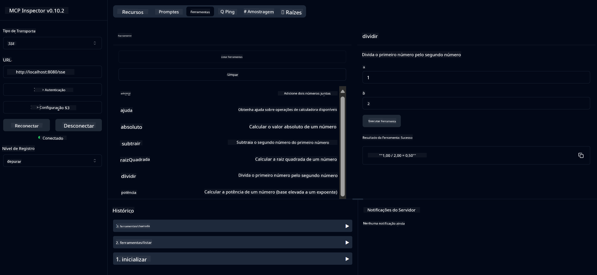

<!--
CO_OP_TRANSLATOR_METADATA:
{
  "original_hash": "13231e9951b68efd9df8c56bd5cdb27e",
  "translation_date": "2025-07-13T22:25:41+00:00",
  "source_file": "03-GettingStarted/samples/java/calculator/README.md",
  "language_code": "br"
}
-->
# Serviço Básico de Calculadora MCP

Este serviço oferece operações básicas de calculadora através do Model Context Protocol (MCP) usando Spring Boot com transporte WebFlux. Foi criado como um exemplo simples para iniciantes que estão aprendendo sobre implementações MCP.

Para mais informações, consulte a documentação de referência do [MCP Server Boot Starter](https://docs.spring.io/spring-ai/reference/api/mcp/mcp-server-boot-starter-docs.html).

## Visão Geral

O serviço demonstra:
- Suporte a SSE (Server-Sent Events)
- Registro automático de ferramentas usando a anotação `@Tool` do Spring AI
- Funções básicas de calculadora:
  - Adição, subtração, multiplicação, divisão
  - Cálculo de potência e raiz quadrada
  - Módulo (resto) e valor absoluto
  - Função de ajuda para descrição das operações

## Funcionalidades

Este serviço de calculadora oferece as seguintes capacidades:

1. **Operações Aritméticas Básicas**:
   - Adição de dois números
   - Subtração de um número por outro
   - Multiplicação de dois números
   - Divisão de um número pelo outro (com verificação de divisão por zero)

2. **Operações Avançadas**:
   - Cálculo de potência (elevar uma base a um expoente)
   - Cálculo de raiz quadrada (com verificação de número negativo)
   - Cálculo do módulo (resto da divisão)
   - Cálculo do valor absoluto

3. **Sistema de Ajuda**:
   - Função de ajuda integrada explicando todas as operações disponíveis

## Usando o Serviço

O serviço expõe os seguintes endpoints da API através do protocolo MCP:

- `add(a, b)`: Soma dois números
- `subtract(a, b)`: Subtrai o segundo número do primeiro
- `multiply(a, b)`: Multiplica dois números
- `divide(a, b)`: Divide o primeiro número pelo segundo (com verificação de zero)
- `power(base, exponent)`: Calcula a potência de um número
- `squareRoot(number)`: Calcula a raiz quadrada (com verificação de número negativo)
- `modulus(a, b)`: Calcula o resto da divisão
- `absolute(number)`: Calcula o valor absoluto
- `help()`: Obtém informações sobre as operações disponíveis

## Cliente de Teste

Um cliente de teste simples está incluído no pacote `com.microsoft.mcp.sample.client`. A classe `SampleCalculatorClient` demonstra as operações disponíveis do serviço de calculadora.

## Usando o Cliente LangChain4j

O projeto inclui um exemplo de cliente LangChain4j em `com.microsoft.mcp.sample.client.LangChain4jClient` que demonstra como integrar o serviço de calculadora com LangChain4j e modelos do GitHub:

### Pré-requisitos

1. **Configuração do Token do GitHub**:
   
   Para usar os modelos de IA do GitHub (como o phi-4), você precisa de um token de acesso pessoal do GitHub:

   a. Acesse as configurações da sua conta no GitHub: https://github.com/settings/tokens
   
   b. Clique em "Generate new token" → "Generate new token (classic)"
   
   c. Dê um nome descritivo para o seu token
   
   d. Selecione os seguintes escopos:
      - `repo` (Controle total dos repositórios privados)
      - `read:org` (Ler membros da organização e equipes, ler projetos da organização)
      - `gist` (Criar gists)
      - `user:email` (Acesso aos endereços de e-mail do usuário (somente leitura))
   
   e. Clique em "Generate token" e copie o novo token
   
   f. Defina-o como uma variável de ambiente:
      
      No Windows:
      ```
      set GITHUB_TOKEN=your-github-token
      ```
      
      No macOS/Linux:
      ```bash
      export GITHUB_TOKEN=your-github-token
      ```

   g. Para configuração persistente, adicione-o às variáveis de ambiente pelo sistema operacional

2. Adicione a dependência LangChain4j GitHub ao seu projeto (já incluída no pom.xml):
   ```xml
   <dependency>
       <groupId>dev.langchain4j</groupId>
       <artifactId>langchain4j-github</artifactId>
       <version>${langchain4j.version}</version>
   </dependency>
   ```

3. Certifique-se de que o servidor da calculadora está rodando em `localhost:8080`

### Executando o Cliente LangChain4j

Este exemplo demonstra:
- Conexão ao servidor MCP da calculadora via transporte SSE
- Uso do LangChain4j para criar um chatbot que utiliza as operações da calculadora
- Integração com modelos de IA do GitHub (agora usando o modelo phi-4)

O cliente envia as seguintes consultas de exemplo para demonstrar a funcionalidade:
1. Calcular a soma de dois números
2. Encontrar a raiz quadrada de um número
3. Obter informações de ajuda sobre as operações disponíveis da calculadora

Execute o exemplo e verifique a saída no console para ver como o modelo de IA usa as ferramentas da calculadora para responder às consultas.

### Configuração do Modelo GitHub

O cliente LangChain4j está configurado para usar o modelo phi-4 do GitHub com as seguintes configurações:

```java
ChatLanguageModel model = GitHubChatModel.builder()
    .apiKey(System.getenv("GITHUB_TOKEN"))
    .timeout(Duration.ofSeconds(60))
    .modelName("phi-4")
    .logRequests(true)
    .logResponses(true)
    .build();
```

Para usar outros modelos do GitHub, basta alterar o parâmetro `modelName` para outro modelo suportado (ex.: "claude-3-haiku-20240307", "llama-3-70b-8192", etc.).

## Dependências

O projeto requer as seguintes dependências principais:

```xml
<!-- For MCP Server -->
<dependency>
    <groupId>org.springframework.ai</groupId>
    <artifactId>spring-ai-starter-mcp-server-webflux</artifactId>
</dependency>

<!-- For LangChain4j integration -->
<dependency>
    <groupId>dev.langchain4j</groupId>
    <artifactId>langchain4j-mcp</artifactId>
    <version>${langchain4j.version}</version>
</dependency>

<!-- For GitHub models support -->
<dependency>
    <groupId>dev.langchain4j</groupId>
    <artifactId>langchain4j-github</artifactId>
    <version>${langchain4j.version}</version>
</dependency>
```

## Construindo o Projeto

Compile o projeto usando Maven:
```bash
./mvnw clean install -DskipTests
```

## Executando o Servidor

### Usando Java

```bash
java -jar target/calculator-server-0.0.1-SNAPSHOT.jar
```

### Usando o MCP Inspector

O MCP Inspector é uma ferramenta útil para interagir com serviços MCP. Para usá-lo com este serviço de calculadora:

1. **Instale e execute o MCP Inspector** em uma nova janela do terminal:
   ```bash
   npx @modelcontextprotocol/inspector
   ```

2. **Acesse a interface web** clicando na URL exibida pelo app (normalmente http://localhost:6274)

3. **Configure a conexão**:
   - Defina o tipo de transporte como "SSE"
   - Defina a URL para o endpoint SSE do seu servidor em execução: `http://localhost:8080/sse`
   - Clique em "Connect"

4. **Use as ferramentas**:
   - Clique em "List Tools" para ver as operações disponíveis da calculadora
   - Selecione uma ferramenta e clique em "Run Tool" para executar uma operação



### Usando Docker

O projeto inclui um Dockerfile para implantação em container:

1. **Construa a imagem Docker**:
   ```bash
   docker build -t calculator-mcp-service .
   ```

2. **Execute o container Docker**:
   ```bash
   docker run -p 8080:8080 calculator-mcp-service
   ```

Isso irá:
- Construir uma imagem Docker multi-stage com Maven 3.9.9 e Eclipse Temurin 24 JDK
- Criar uma imagem de container otimizada
- Expor o serviço na porta 8080
- Iniciar o serviço MCP da calculadora dentro do container

Você poderá acessar o serviço em `http://localhost:8080` assim que o container estiver em execução.

## Solução de Problemas

### Problemas Comuns com o Token do GitHub

1. **Problemas de Permissão do Token**: Se receber um erro 403 Forbidden, verifique se seu token tem as permissões corretas conforme descrito nos pré-requisitos.

2. **Token Não Encontrado**: Se receber um erro "No API key found", certifique-se de que a variável de ambiente GITHUB_TOKEN está corretamente configurada.

3. **Limite de Requisições**: A API do GitHub possui limites de requisições. Se encontrar um erro de limite (código 429), aguarde alguns minutos antes de tentar novamente.

4. **Expiração do Token**: Tokens do GitHub podem expirar. Se receber erros de autenticação após algum tempo, gere um novo token e atualize sua variável de ambiente.

Se precisar de mais ajuda, consulte a [documentação do LangChain4j](https://github.com/langchain4j/langchain4j) ou a [documentação da API do GitHub](https://docs.github.com/en/rest).

**Aviso Legal**:  
Este documento foi traduzido utilizando o serviço de tradução por IA [Co-op Translator](https://github.com/Azure/co-op-translator). Embora nos esforcemos para garantir a precisão, esteja ciente de que traduções automáticas podem conter erros ou imprecisões. O documento original em seu idioma nativo deve ser considerado a fonte autorizada. Para informações críticas, recomenda-se tradução profissional humana. Não nos responsabilizamos por quaisquer mal-entendidos ou interpretações incorretas decorrentes do uso desta tradução.