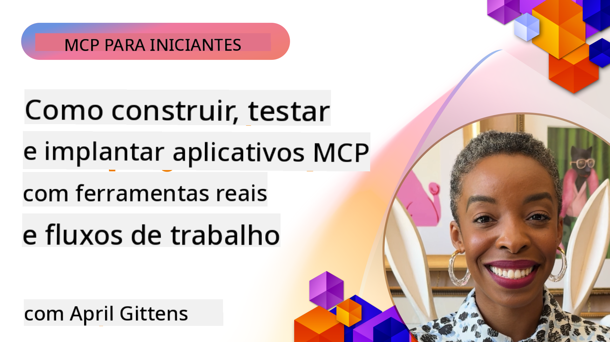
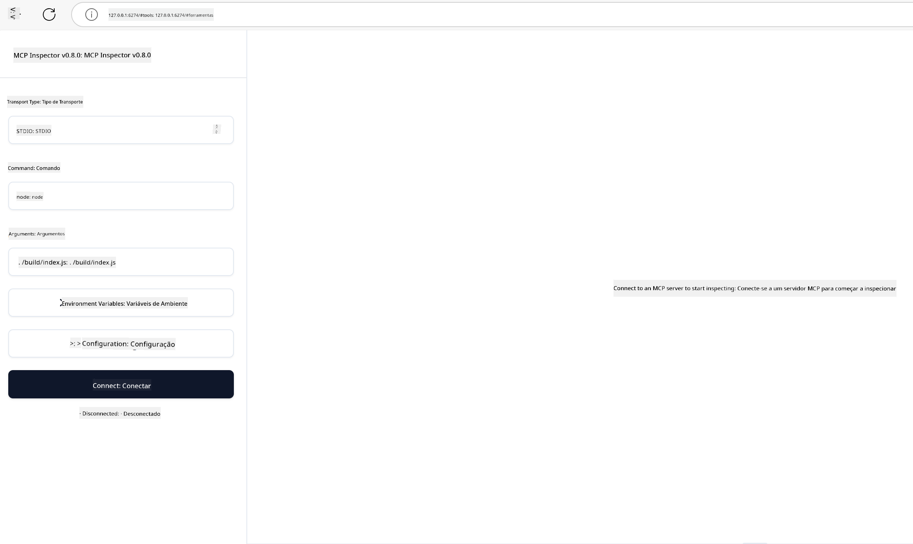

<!--
CO_OP_TRANSLATOR_METADATA:
{
  "original_hash": "83efa75a69bc831277263a6f1ae53669",
  "translation_date": "2025-08-18T17:03:55+00:00",
  "source_file": "04-PracticalImplementation/README.md",
  "language_code": "br"
}
-->
# Implementação Prática

[](https://youtu.be/vCN9-mKBDfQ)

_(Clique na imagem acima para assistir ao vídeo desta lição)_

A implementação prática é onde o poder do Model Context Protocol (MCP) se torna palpável. Embora entender a teoria e a arquitetura por trás do MCP seja importante, o verdadeiro valor surge quando você aplica esses conceitos para construir, testar e implantar soluções que resolvem problemas do mundo real. Este capítulo faz a ponte entre o conhecimento conceitual e o desenvolvimento prático, guiando você no processo de dar vida a aplicativos baseados em MCP.

Seja desenvolvendo assistentes inteligentes, integrando IA em fluxos de trabalho empresariais ou criando ferramentas personalizadas para processamento de dados, o MCP oferece uma base flexível. Seu design independente de linguagem e os SDKs oficiais para linguagens de programação populares o tornam acessível a uma ampla gama de desenvolvedores. Ao utilizar esses SDKs, você pode rapidamente prototipar, iterar e escalar suas soluções em diferentes plataformas e ambientes.

Nas seções a seguir, você encontrará exemplos práticos, códigos de exemplo e estratégias de implantação que demonstram como implementar o MCP em C#, Java com Spring, TypeScript, JavaScript e Python. Você também aprenderá a depurar e testar seus servidores MCP, gerenciar APIs e implantar soluções na nuvem usando o Azure. Esses recursos práticos foram projetados para acelerar seu aprendizado e ajudá-lo a construir com confiança aplicativos MCP robustos e prontos para produção.

## Visão Geral

Esta lição foca nos aspectos práticos da implementação do MCP em várias linguagens de programação. Exploraremos como usar os SDKs do MCP em C#, Java com Spring, TypeScript, JavaScript e Python para construir aplicativos robustos, depurar e testar servidores MCP, e criar recursos reutilizáveis, prompts e ferramentas.

## Objetivos de Aprendizado

Ao final desta lição, você será capaz de:

- Implementar soluções MCP usando os SDKs oficiais em várias linguagens de programação
- Depurar e testar servidores MCP de forma sistemática
- Criar e usar recursos do servidor (Recursos, Prompts e Ferramentas)
- Projetar fluxos de trabalho MCP eficazes para tarefas complexas
- Otimizar implementações MCP para desempenho e confiabilidade

## Recursos Oficiais de SDK

O Model Context Protocol oferece SDKs oficiais para várias linguagens:

- [SDK C#](https://github.com/modelcontextprotocol/csharp-sdk)
- [SDK Java com Spring](https://github.com/modelcontextprotocol/java-sdk) **Nota:** requer dependência do [Project Reactor](https://projectreactor.io). (Veja [discussão issue 246](https://github.com/orgs/modelcontextprotocol/discussions/246).)
- [SDK TypeScript](https://github.com/modelcontextprotocol/typescript-sdk)
- [SDK Python](https://github.com/modelcontextprotocol/python-sdk)
- [SDK Kotlin](https://github.com/modelcontextprotocol/kotlin-sdk)

## Trabalhando com os SDKs do MCP

Esta seção fornece exemplos práticos de implementação do MCP em várias linguagens de programação. Você pode encontrar códigos de exemplo no diretório `samples`, organizados por linguagem.

### Exemplos Disponíveis

O repositório inclui [implementações de exemplo](../../../04-PracticalImplementation/samples) nas seguintes linguagens:

- [C#](./samples/csharp/README.md)
- [Java com Spring](./samples/java/containerapp/README.md)
- [TypeScript](./samples/typescript/README.md)
- [JavaScript](./samples/javascript/README.md)
- [Python](./samples/python/README.md)

Cada exemplo demonstra conceitos-chave do MCP e padrões de implementação para aquela linguagem e ecossistema específicos.

## Recursos Principais do Servidor

Os servidores MCP podem implementar qualquer combinação dos seguintes recursos:

### Recursos

Os recursos fornecem contexto e dados para o usuário ou modelo de IA usar:

- Repositórios de documentos
- Bases de conhecimento
- Fontes de dados estruturados
- Sistemas de arquivos

### Prompts

Os prompts são mensagens e fluxos de trabalho modelados para os usuários:

- Modelos de conversação predefinidos
- Padrões de interação guiada
- Estruturas de diálogo especializadas

### Ferramentas

As ferramentas são funções que o modelo de IA pode executar:

- Utilitários de processamento de dados
- Integrações com APIs externas
- Capacidades computacionais
- Funcionalidade de busca

## Implementações de Exemplo: Implementação em C#

O repositório oficial do SDK C# contém várias implementações de exemplo que demonstram diferentes aspectos do MCP:

- **Cliente MCP Básico**: Exemplo simples mostrando como criar um cliente MCP e chamar ferramentas
- **Servidor MCP Básico**: Implementação mínima de servidor com registro básico de ferramentas
- **Servidor MCP Avançado**: Servidor completo com registro de ferramentas, autenticação e tratamento de erros
- **Integração com ASP.NET**: Exemplos demonstrando integração com ASP.NET Core
- **Padrões de Implementação de Ferramentas**: Vários padrões para implementar ferramentas com diferentes níveis de complexidade

O SDK C# do MCP está em versão prévia e as APIs podem mudar. Continuaremos atualizando este blog conforme o SDK evolui.

### Recursos Principais

- [C# MCP Nuget ModelContextProtocol](https://www.nuget.org/packages/ModelContextProtocol)
- Construindo seu [primeiro servidor MCP](https://devblogs.microsoft.com/dotnet/build-a-model-context-protocol-mcp-server-in-csharp/).

Para exemplos completos de implementação em C#, visite o [repositório oficial de exemplos do SDK C#](https://github.com/modelcontextprotocol/csharp-sdk).

## Implementação de Exemplo: Implementação em Java com Spring

O SDK Java com Spring oferece opções robustas de implementação do MCP com recursos de nível empresarial.

### Recursos Principais

- Integração com o Spring Framework
- Segurança de tipos forte
- Suporte a programação reativa
- Tratamento abrangente de erros

Para um exemplo completo de implementação em Java com Spring, veja [exemplo Java com Spring](samples/java/containerapp/README.md) no diretório de exemplos.

## Implementação de Exemplo: Implementação em JavaScript

O SDK JavaScript fornece uma abordagem leve e flexível para a implementação do MCP.

### Recursos Principais

- Suporte para Node.js e navegador
- API baseada em Promises
- Fácil integração com Express e outros frameworks
- Suporte a WebSocket para streaming

Para um exemplo completo de implementação em JavaScript, veja [exemplo JavaScript](samples/javascript/README.md) no diretório de exemplos.

## Implementação de Exemplo: Implementação em Python

O SDK Python oferece uma abordagem Pythonic para a implementação do MCP com excelentes integrações com frameworks de ML.

### Recursos Principais

- Suporte a async/await com asyncio
- Integração com FastAPI
- Registro simples de ferramentas
- Integração nativa com bibliotecas populares de ML

Para um exemplo completo de implementação em Python, veja [exemplo Python](samples/python/README.md) no diretório de exemplos.

## Gerenciamento de API

O Azure API Management é uma ótima solução para proteger servidores MCP. A ideia é colocar uma instância do Azure API Management na frente do seu servidor MCP e deixá-la lidar com recursos que você provavelmente desejará, como:

- Limitação de taxa
- Gerenciamento de tokens
- Monitoramento
- Balanceamento de carga
- Segurança

### Exemplo no Azure

Aqui está um exemplo no Azure que faz exatamente isso, ou seja, [criar um servidor MCP e protegê-lo com o Azure API Management](https://github.com/Azure-Samples/remote-mcp-apim-functions-python).

Veja como o fluxo de autorização acontece na imagem abaixo:


Na imagem acima, ocorre o seguinte:

- A autenticação/autorização ocorre usando o Microsoft Entra.
- O Azure API Management atua como um gateway e usa políticas para direcionar e gerenciar o tráfego.
- O Azure Monitor registra todas as solicitações para análise posterior.

#### Fluxo de Autorização

Vamos analisar o fluxo de autorização com mais detalhes:


#### Especificação de Autorização do MCP

Saiba mais sobre a [especificação de autorização do MCP](https://modelcontextprotocol.io/specification/2025-03-26/basic/authorization#2-10-third-party-authorization-flow).

## Implantar Servidor MCP Remoto no Azure

Vamos ver se conseguimos implantar o exemplo mencionado anteriormente:

1. Clone o repositório

    ```bash
    git clone https://github.com/Azure-Samples/remote-mcp-apim-functions-python.git
    cd remote-mcp-apim-functions-python
    ```

1. Registre o provedor de recursos `Microsoft.App`.

   - Se você estiver usando o Azure CLI, execute `az provider register --namespace Microsoft.App --wait`.
   - Se você estiver usando o Azure PowerShell, execute `Register-AzResourceProvider -ProviderNamespace Microsoft.App`. Em seguida, execute `(Get-AzResourceProvider -ProviderNamespace Microsoft.App).RegistrationState` após algum tempo para verificar se o registro foi concluído.

1. Execute este comando [azd](https://aka.ms/azd) para provisionar o serviço de gerenciamento de API, o aplicativo de função (com código) e todos os outros recursos necessários do Azure:

    ```shell
    azd up
    ```

    Este comando deve implantar todos os recursos na nuvem no Azure.

### Testando seu servidor com o MCP Inspector

1. Em uma **nova janela de terminal**, instale e execute o MCP Inspector:

    ```shell
    npx @modelcontextprotocol/inspector
    ```

    Você deverá ver uma interface semelhante a:

    

1. CTRL clique para carregar o aplicativo web do MCP Inspector a partir da URL exibida pelo aplicativo (por exemplo, [http://127.0.0.1:6274/#resources](http://127.0.0.1:6274/#resources)).
1. Defina o tipo de transporte como `SSE`.
1. Defina a URL para o endpoint SSE do seu API Management em execução exibido após `azd up` e **Conectar**:

    ```shell
    https://<apim-servicename-from-azd-output>.azure-api.net/mcp/sse
    ```

1. **Listar Ferramentas**. Clique em uma ferramenta e **Executar Ferramenta**.

Se todos os passos funcionaram, você agora deve estar conectado ao servidor MCP e conseguiu chamar uma ferramenta.

## Servidores MCP para Azure

[Remote-mcp-functions](https://github.com/Azure-Samples/remote-mcp-functions-dotnet): Este conjunto de repositórios é um modelo de início rápido para construir e implantar servidores MCP (Model Context Protocol) remotos personalizados usando Azure Functions com Python, C# .NET ou Node/TypeScript.

Os exemplos fornecem uma solução completa que permite aos desenvolvedores:

- Construir e executar localmente: Desenvolver e depurar um servidor MCP em uma máquina local
- Implantar no Azure: Implantar facilmente na nuvem com um simples comando `azd up`
- Conectar a partir de clientes: Conectar ao servidor MCP a partir de vários clientes, incluindo o modo agente do Copilot no VS Code e a ferramenta MCP Inspector

### Recursos Principais

- Segurança por design: O servidor MCP é protegido usando chaves e HTTPS
- Opções de autenticação: Suporta OAuth usando autenticação integrada e/ou API Management
- Isolamento de rede: Permite isolamento de rede usando Redes Virtuais do Azure (VNET)
- Arquitetura serverless: Utiliza Azure Functions para execução escalável e orientada por eventos
- Desenvolvimento local: Suporte abrangente para desenvolvimento e depuração local
- Implantação simples: Processo de implantação simplificado para o Azure

O repositório inclui todos os arquivos de configuração necessários, código-fonte e definições de infraestrutura para começar rapidamente com uma implementação de servidor MCP pronta para produção.

- [Azure Remote MCP Functions Python](https://github.com/Azure-Samples/remote-mcp-functions-python) - Implementação de exemplo do MCP usando Azure Functions com Python.

- [Azure Remote MCP Functions .NET](https://github.com/Azure-Samples/remote-mcp-functions-dotnet) - Implementação de exemplo do MCP usando Azure Functions com C# .NET.

- [Azure Remote MCP Functions Node/Typescript](https://github.com/Azure-Samples/remote-mcp-functions-typescript) - Implementação de exemplo do MCP usando Azure Functions com Node/TypeScript.

## Principais Conclusões

- Os SDKs do MCP fornecem ferramentas específicas para cada linguagem para implementar soluções MCP robustas.
- O processo de depuração e teste é crítico para aplicativos MCP confiáveis.
- Modelos de prompts reutilizáveis permitem interações consistentes com IA.
- Fluxos de trabalho bem projetados podem orquestrar tarefas complexas usando várias ferramentas.
- Implementar soluções MCP requer consideração de segurança, desempenho e tratamento de erros.

## Exercício

Projete um fluxo de trabalho MCP prático que resolva um problema real em seu domínio:

1. Identifique 3-4 ferramentas que seriam úteis para resolver esse problema.
2. Crie um diagrama de fluxo mostrando como essas ferramentas interagem.
3. Implemente uma versão básica de uma das ferramentas usando sua linguagem preferida.
4. Crie um modelo de prompt que ajude o modelo a usar sua ferramenta de forma eficaz.

## Recursos Adicionais

---

Próximo: [Tópicos Avançados](../05-AdvancedTopics/README.md)

**Aviso Legal**:  
Este documento foi traduzido utilizando o serviço de tradução por IA [Co-op Translator](https://github.com/Azure/co-op-translator). Embora nos esforcemos para garantir a precisão, esteja ciente de que traduções automatizadas podem conter erros ou imprecisões. O documento original em seu idioma nativo deve ser considerado a fonte autoritativa. Para informações críticas, recomenda-se a tradução profissional realizada por humanos. Não nos responsabilizamos por quaisquer mal-entendidos ou interpretações equivocadas decorrentes do uso desta tradução.