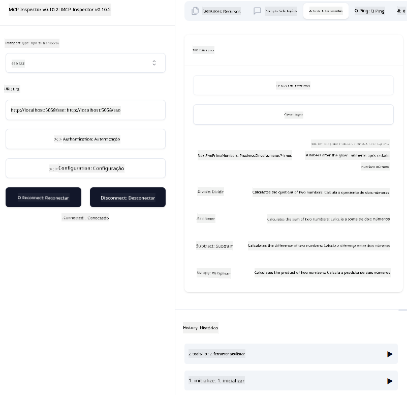
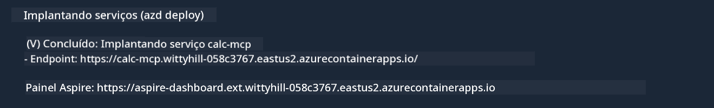

<!--
CO_OP_TRANSLATOR_METADATA:
{
  "original_hash": "5020a3e1a1c7f30c00f9e37f1fa208e3",
  "translation_date": "2025-05-29T20:26:29+00:00",
  "source_file": "04-PracticalImplementation/samples/csharp/README.md",
  "language_code": "br"
}
-->
# Sample

O exemplo anterior mostra como usar um projeto local .NET com o tipo `sdio`. E como rodar o servidor localmente em um container. Essa é uma boa solução em muitas situações. No entanto, pode ser útil ter o servidor rodando remotamente, como em um ambiente na nuvem. É aí que o tipo `http` entra em cena.

Olhando para a solução na pasta `04-PracticalImplementation`, pode parecer muito mais complexa que a anterior. Mas, na realidade, não é. Se você observar de perto o projeto `src/mcpserver/mcpserver.csproj`, verá que é basicamente o mesmo código do exemplo anterior. A única diferença é que estamos usando uma biblioteca diferente, `ModelContextProtocol.AspNetCore`, para lidar com as requisições HTTP. E alteramos o método `IsPrime` para torná-lo privado, só para mostrar que você pode ter métodos privados no seu código. O restante do código é igual ao anterior.

Os outros projetos são do [.NET Aspire](https://learn.microsoft.com/dotnet/aspire/get-started/aspire-overview). Ter o .NET Aspire na solução melhora a experiência do desenvolvedor durante o desenvolvimento e testes, além de ajudar na observabilidade. Não é obrigatório para rodar o servidor, mas é uma boa prática tê-lo na sua solução.

## Iniciar o servidor localmente

1. Pelo VS Code (com a extensão C# DevKit), abra a solução `04-PracticalImplementation\samples\csharp\src\Calculator-chap4.sln`.
2. Pressione `F5` para iniciar o servidor. Isso deve abrir um navegador com o dashboard do .NET Aspire.

ou

1. Pelo terminal, navegue até a pasta `04-PracticalImplementation\samples\csharp\src`
2. Execute o comando abaixo para iniciar o servidor:
   ```bash
    dotnet run --project .\AppHost
   ```

3. No Dashboard, observe a URL `http`. Deve ser algo como `http://localhost:5058/`.

## Test `SSE` com o ModelContext Protocol Inspector.

Se você tem Node.js 22.7.5 ou superior, pode usar o ModelContext Protocol Inspector para testar seu servidor.

Inicie o servidor e execute o seguinte comando no terminal:

```bash
npx @modelcontextprotocol/inspector@latest
```



- Selecione `SSE` as the Transport type. SSE stand for Server-Sent Events. 
- In the Url field, enter the URL of the server noted earlier,and append `/sse`. Deve ser `http` (não `https`) something like `http://localhost:5058/sse`.
- select the Connect button.

A nice thing about the Inspector is that it provide a nice visibility on what is happening.

- Try listing the availables tools
- Try some of them, it should works just like before.


## Test `SSE` with Github Copilot Chat in VS Code

To use the `SSE` transport with Github Copilot Chat, change the configuration of the `mcp-calc`) servidor criado anteriormente para ficar assim:

```json
"mcp-calc": {
    "type": "sse",
    "url": "http://localhost:5058/sse"
}
```

Faça alguns testes:
- Peça pelos 3 números primos após 6780. Note como o Copilot usará as novas ferramentas `NextFivePrimeNumbers` e retornará apenas os 3 primeiros números primos.
- Peça pelos 7 números primos após 111, para ver o que acontece.

# Fazer deploy do servidor no Azure

Vamos fazer o deploy do servidor no Azure para que mais pessoas possam usá-lo.

No terminal, navegue até a pasta `04-PracticalImplementation\samples\csharp\src` e execute o seguinte comando:

```bash
azd init
```

Isso vai criar alguns arquivos localmente para salvar a configuração dos recursos do Azure e sua Infraestrutura como código (IaC).

Depois, execute o comando abaixo para fazer o deploy do servidor no Azure:

```bash
azd up
```

Quando o deploy terminar, você deve ver uma mensagem assim:



Navegue até o dashboard do Aspire e anote a URL `HTTP` para usar no MCP Inspector e no Github Copilot Chat.

## E agora?

Testamos diferentes tipos de transporte, ferramentas de teste e também fizemos o deploy do nosso servidor MCP no Azure. Mas e se nosso servidor precisar acessar recursos privados? Por exemplo, um banco de dados ou uma API privada? No próximo capítulo, veremos como podemos melhorar a segurança do nosso servidor.

**Aviso Legal**:  
Este documento foi traduzido utilizando o serviço de tradução automática [Co-op Translator](https://github.com/Azure/co-op-translator). Embora nos esforcemos para garantir a precisão, esteja ciente de que traduções automáticas podem conter erros ou imprecisões. O documento original em seu idioma nativo deve ser considerado a fonte oficial. Para informações críticas, recomenda-se a tradução profissional realizada por humanos. Não nos responsabilizamos por quaisquer mal-entendidos ou interpretações incorretas decorrentes do uso desta tradução.