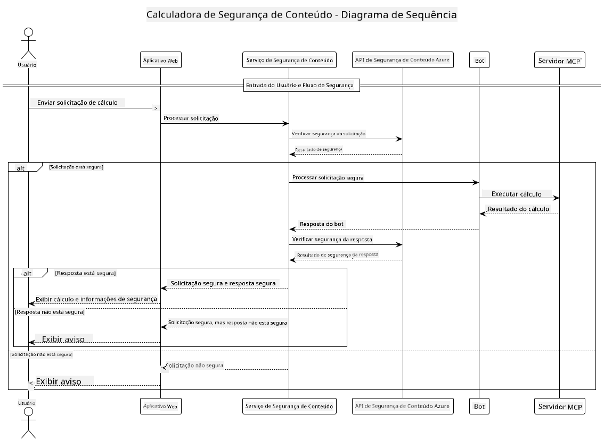

<!--
CO_OP_TRANSLATOR_METADATA:
{
  "original_hash": "e5ea5e7582f70008ea9bec3b3820f20a",
  "translation_date": "2025-07-13T23:15:29+00:00",
  "source_file": "04-PracticalImplementation/samples/java/containerapp/README.md",
  "language_code": "br"
}
-->
## Arquitetura do Sistema

Este projeto demonstra uma aplicação web que utiliza verificação de segurança de conteúdo antes de enviar os prompts dos usuários para um serviço de calculadora via Model Context Protocol (MCP).



### Como Funciona

1. **Entrada do Usuário**: O usuário insere um prompt de cálculo na interface web  
2. **Triagem de Segurança de Conteúdo (Entrada)**: O prompt é analisado pela Azure Content Safety API  
3. **Decisão de Segurança (Entrada)**:  
   - Se o conteúdo for seguro (gravidade < 2 em todas as categorias), ele segue para a calculadora  
   - Se o conteúdo for sinalizado como potencialmente prejudicial, o processo é interrompido e um aviso é retornado  
4. **Integração com a Calculadora**: Conteúdo seguro é processado pelo LangChain4j, que se comunica com o servidor MCP da calculadora  
5. **Triagem de Segurança de Conteúdo (Saída)**: A resposta do bot é analisada pela Azure Content Safety API  
6. **Decisão de Segurança (Saída)**:  
   - Se a resposta do bot for segura, ela é exibida ao usuário  
   - Se a resposta do bot for sinalizada como potencialmente prejudicial, ela é substituída por um aviso  
7. **Resposta**: Os resultados (se seguros) são exibidos ao usuário junto com ambas as análises de segurança

## Usando Model Context Protocol (MCP) com Serviços de Calculadora

Este projeto demonstra como usar o Model Context Protocol (MCP) para chamar serviços MCP de calculadora a partir do LangChain4j. A implementação utiliza um servidor MCP local rodando na porta 8080 para fornecer operações de calculadora.

### Configurando o Serviço Azure Content Safety

Antes de usar os recursos de segurança de conteúdo, você precisa criar um recurso do serviço Azure Content Safety:

1. Faça login no [Azure Portal](https://portal.azure.com)  
2. Clique em "Criar um recurso" e pesquise por "Content Safety"  
3. Selecione "Content Safety" e clique em "Criar"  
4. Insira um nome único para seu recurso  
5. Selecione sua assinatura e grupo de recursos (ou crie um novo)  
6. Escolha uma região suportada (verifique [Disponibilidade por Região](https://azure.microsoft.com/en-us/global-infrastructure/services/?products=cognitive-services) para detalhes)  
7. Selecione um nível de preço adequado  
8. Clique em "Criar" para implantar o recurso  
9. Após a implantação, clique em "Ir para o recurso"  
10. No painel esquerdo, em "Gerenciamento de Recursos", selecione "Chaves e Endpoint"  
11. Copie uma das chaves e a URL do endpoint para usar na próxima etapa

### Configurando Variáveis de Ambiente

Defina a variável de ambiente `GITHUB_TOKEN` para autenticação dos modelos do GitHub:  
```sh
export GITHUB_TOKEN=<your_github_token>
```

Para os recursos de segurança de conteúdo, defina:  
```sh
export CONTENT_SAFETY_ENDPOINT=<your_content_safety_endpoint>
export CONTENT_SAFETY_KEY=<your_content_safety_key>
```

Essas variáveis de ambiente são usadas pela aplicação para autenticar com o serviço Azure Content Safety. Se essas variáveis não estiverem definidas, a aplicação usará valores fictícios para fins de demonstração, mas os recursos de segurança de conteúdo não funcionarão corretamente.

### Iniciando o Servidor MCP da Calculadora

Antes de executar o cliente, você precisa iniciar o servidor MCP da calculadora no modo SSE em localhost:8080.

## Descrição do Projeto

Este projeto demonstra a integração do Model Context Protocol (MCP) com LangChain4j para chamar serviços de calculadora. Os principais recursos incluem:

- Uso do MCP para conectar a um serviço de calculadora para operações matemáticas básicas  
- Verificação de segurança de conteúdo em duas camadas, tanto nos prompts do usuário quanto nas respostas do bot  
- Integração com o modelo gpt-4.1-nano do GitHub via LangChain4j  
- Uso de Server-Sent Events (SSE) para transporte MCP

## Integração de Segurança de Conteúdo

O projeto inclui recursos completos de segurança de conteúdo para garantir que tanto as entradas dos usuários quanto as respostas do sistema estejam livres de conteúdo prejudicial:

1. **Triagem de Entrada**: Todos os prompts dos usuários são analisados para categorias de conteúdo prejudicial, como discurso de ódio, violência, automutilação e conteúdo sexual antes do processamento.

2. **Triagem de Saída**: Mesmo ao usar modelos potencialmente sem censura, o sistema verifica todas as respostas geradas pelos mesmos filtros de segurança de conteúdo antes de exibi-las ao usuário.

Essa abordagem em duas camadas garante que o sistema permaneça seguro independentemente do modelo de IA utilizado, protegendo os usuários tanto de entradas prejudiciais quanto de respostas geradas pela IA que possam ser problemáticas.

## Cliente Web

A aplicação inclui uma interface web amigável que permite aos usuários interagir com o sistema Content Safety Calculator:

### Recursos da Interface Web

- Formulário simples e intuitivo para inserir prompts de cálculo  
- Validação de segurança de conteúdo em duas camadas (entrada e saída)  
- Feedback em tempo real sobre a segurança do prompt e da resposta  
- Indicadores de segurança coloridos para facilitar a interpretação  
- Design limpo e responsivo que funciona em diversos dispositivos  
- Exemplos de prompts seguros para orientar os usuários

### Usando o Cliente Web

1. Inicie a aplicação:  
   ```sh
   mvn spring-boot:run
   ```

2. Abra seu navegador e acesse `http://localhost:8087`

3. Insira um prompt de cálculo na área de texto fornecida (exemplo: "Calcule a soma de 24.5 e 17.3")

4. Clique em "Enviar" para processar sua solicitação

5. Veja os resultados, que incluirão:  
   - Análise de segurança de conteúdo do seu prompt  
   - O resultado calculado (se o prompt for seguro)  
   - Análise de segurança de conteúdo da resposta do bot  
   - Quaisquer avisos de segurança caso a entrada ou saída tenham sido sinalizadas

O cliente web gerencia automaticamente ambos os processos de verificação de segurança de conteúdo, garantindo que todas as interações sejam seguras e apropriadas, independentemente do modelo de IA utilizado.

**Aviso Legal**:  
Este documento foi traduzido utilizando o serviço de tradução por IA [Co-op Translator](https://github.com/Azure/co-op-translator). Embora nos esforcemos para garantir a precisão, esteja ciente de que traduções automáticas podem conter erros ou imprecisões. O documento original em seu idioma nativo deve ser considerado a fonte autorizada. Para informações críticas, recomenda-se tradução profissional humana. Não nos responsabilizamos por quaisquer mal-entendidos ou interpretações incorretas decorrentes do uso desta tradução.