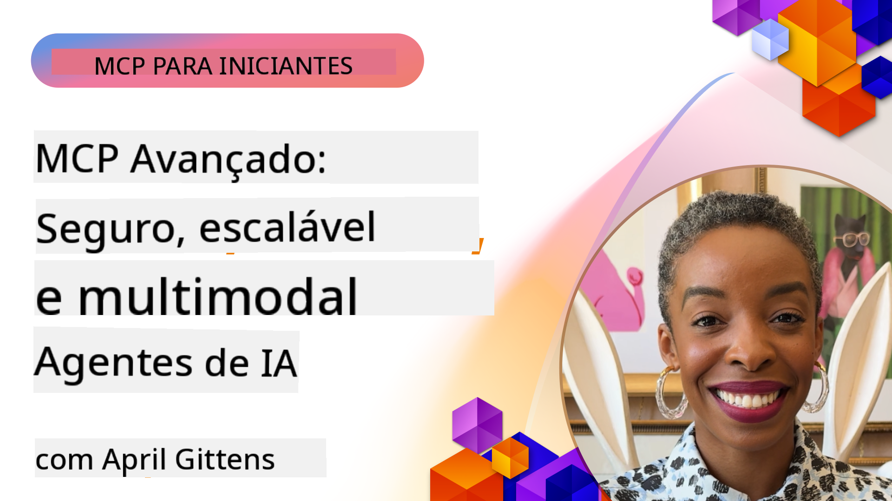

<!--
CO_OP_TRANSLATOR_METADATA:
{
  "original_hash": "d204bc94ea6027d06a703b21b711ca57",
  "translation_date": "2025-08-18T17:05:42+00:00",
  "source_file": "05-AdvancedTopics/README.md",
  "language_code": "br"
}
-->
# Tópicos Avançados em MCP

_(Clique na imagem acima para assistir ao vídeo desta lição)_

Este capítulo aborda uma série de tópicos avançados na implementação do Model Context Protocol (MCP), incluindo integração multimodal, escalabilidade, práticas recomendadas de segurança e integração empresarial. Esses tópicos são cruciais para construir aplicações MCP robustas e prontas para produção que atendam às demandas dos sistemas modernos de IA.

## Visão Geral

Esta lição explora conceitos avançados na implementação do Model Context Protocol, com foco em integração multimodal, escalabilidade, práticas recomendadas de segurança e integração empresarial. Esses tópicos são essenciais para construir aplicações MCP de nível empresarial que possam lidar com requisitos complexos em ambientes corporativos.

## Objetivos de Aprendizado

Ao final desta lição, você será capaz de:

- Implementar capacidades multimodais dentro de frameworks MCP
- Projetar arquiteturas MCP escaláveis para cenários de alta demanda
- Aplicar práticas recomendadas de segurança alinhadas aos princípios de segurança do MCP
- Integrar MCP com sistemas e frameworks de IA empresariais
- Otimizar desempenho e confiabilidade em ambientes de produção

## Lições e Projetos de Exemplo

| Link | Título | Descrição |
|------|-------|-------------|
| [5.1 Integração com Azure](./mcp-integration/README.md) | Integrar com Azure | Aprenda como integrar seu servidor MCP no Azure |
| [5.2 Exemplo Multimodal](./mcp-multi-modality/README.md) | Exemplos Multimodais MCP | Exemplos para áudio, imagem e resposta multimodal |
| [5.3 Exemplo MCP OAuth2](../../../05-AdvancedTopics/mcp-oauth2-demo) | Demonstração MCP OAuth2 | Aplicativo Spring Boot minimalista mostrando OAuth2 com MCP, tanto como Servidor de Autorização quanto Servidor de Recursos. Demonstra emissão segura de tokens, endpoints protegidos, implantação em Azure Container Apps e integração com API Management. |
| [5.4 Contextos Raiz](./mcp-root-contexts/README.md) | Contextos Raiz | Saiba mais sobre contextos raiz e como implementá-los |
| [5.5 Roteamento](./mcp-routing/README.md) | Roteamento | Aprenda diferentes tipos de roteamento |
| [5.6 Amostragem](./mcp-sampling/README.md) | Amostragem | Aprenda como trabalhar com amostragem |
| [5.7 Escalabilidade](./mcp-scaling/README.md) | Escalabilidade | Saiba mais sobre escalabilidade |
| [5.8 Segurança](./mcp-security/README.md) | Segurança | Proteja seu servidor MCP |
| [5.9 Exemplo de Busca na Web](./web-search-mcp/README.md) | Busca na Web MCP | Servidor e cliente MCP em Python integrando com SerpAPI para busca em tempo real na web, notícias, produtos e Q&A. Demonstra orquestração de múltiplas ferramentas, integração com APIs externas e tratamento robusto de erros. |
| [5.10 Transmissão em Tempo Real](./mcp-realtimestreaming/README.md) | Transmissão | A transmissão de dados em tempo real tornou-se essencial no mundo orientado por dados de hoje, onde empresas e aplicações precisam de acesso imediato às informações para tomar decisões oportunas. |
| [5.11 Busca na Web em Tempo Real](./mcp-realtimesearch/README.md) | Busca na Web | Como o MCP transforma a busca na web em tempo real, fornecendo uma abordagem padronizada para gerenciamento de contexto entre modelos de IA, motores de busca e aplicações. |
| [5.12 Autenticação Entra ID para Servidores Model Context Protocol](./mcp-security-entra/README.md) | Autenticação Entra ID | O Microsoft Entra ID oferece uma solução robusta de gerenciamento de identidade e acesso baseada na nuvem, ajudando a garantir que apenas usuários e aplicações autorizados possam interagir com seu servidor MCP. |
| [5.13 Integração com Agentes Azure AI Foundry](./mcp-foundry-agent-integration/README.md) | Integração com Azure AI Foundry | Aprenda como integrar servidores Model Context Protocol com agentes Azure AI Foundry, permitindo orquestração poderosa de ferramentas e capacidades de IA empresarial com conexões padronizadas a fontes de dados externas. |
| [5.14 Engenharia de Contexto](./mcp-contextengineering/README.md) | Engenharia de Contexto | A oportunidade futura das técnicas de engenharia de contexto para servidores MCP, incluindo otimização de contexto, gerenciamento dinâmico de contexto e estratégias para engenharia de prompts eficazes dentro de frameworks MCP. |

## Referências Adicionais

Para informações mais atualizadas sobre tópicos avançados de MCP, consulte:
- [Documentação MCP](https://modelcontextprotocol.io/)
- [Especificação MCP](https://spec.modelcontextprotocol.io/)
- [Repositório GitHub](https://github.com/modelcontextprotocol)

## Principais Conclusões

- Implementações multimodais de MCP ampliam as capacidades de IA além do processamento de texto
- Escalabilidade é essencial para implantações empresariais e pode ser abordada por meio de escalabilidade horizontal e vertical
- Medidas abrangentes de segurança protegem dados e garantem controle adequado de acesso
- A integração empresarial com plataformas como Azure OpenAI e Microsoft AI Foundry aprimora as capacidades do MCP
- Implementações avançadas de MCP se beneficiam de arquiteturas otimizadas e gerenciamento cuidadoso de recursos

## Exercício

Projete uma implementação MCP de nível empresarial para um caso de uso específico:

1. Identifique os requisitos multimodais para seu caso de uso
2. Delineie os controles de segurança necessários para proteger dados sensíveis
3. Projete uma arquitetura escalável que possa lidar com cargas variáveis
4. Planeje pontos de integração com sistemas de IA empresariais
5. Documente possíveis gargalos de desempenho e estratégias de mitigação

## Recursos Adicionais

- [Documentação Azure OpenAI](https://learn.microsoft.com/en-us/azure/ai-services/openai/)
- [Documentação Microsoft AI Foundry](https://learn.microsoft.com/en-us/ai-services/)

---

## O que vem a seguir

- [5.1 Integração MCP](./mcp-integration/README.md)

**Aviso Legal**:  
Este documento foi traduzido utilizando o serviço de tradução por IA [Co-op Translator](https://github.com/Azure/co-op-translator). Embora nos esforcemos para garantir a precisão, esteja ciente de que traduções automatizadas podem conter erros ou imprecisões. O documento original em seu idioma nativo deve ser considerado a fonte autoritativa. Para informações críticas, recomenda-se a tradução profissional realizada por humanos. Não nos responsabilizamos por quaisquer mal-entendidos ou interpretações equivocadas decorrentes do uso desta tradução.