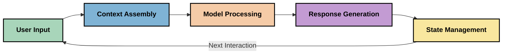
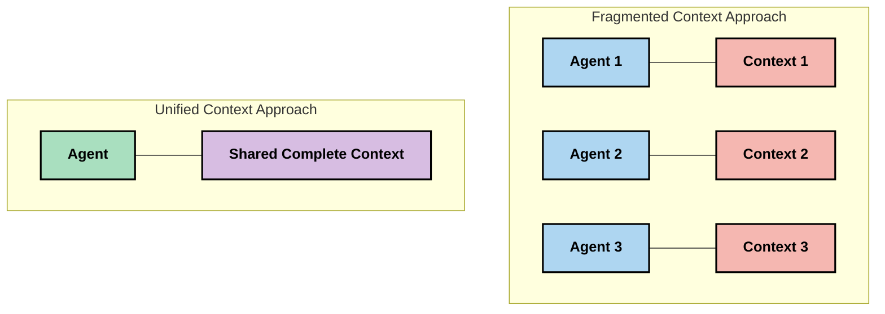
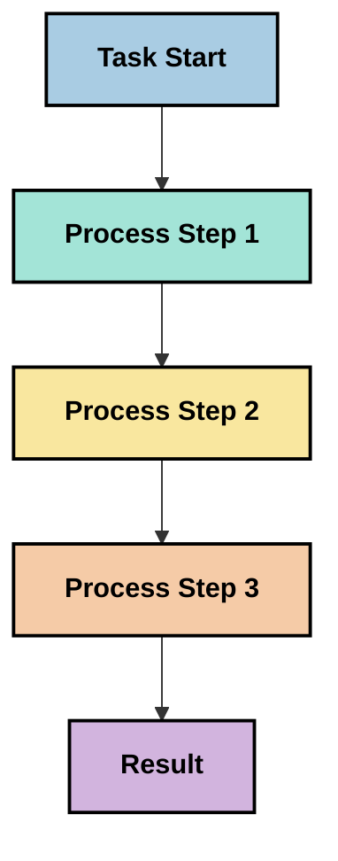
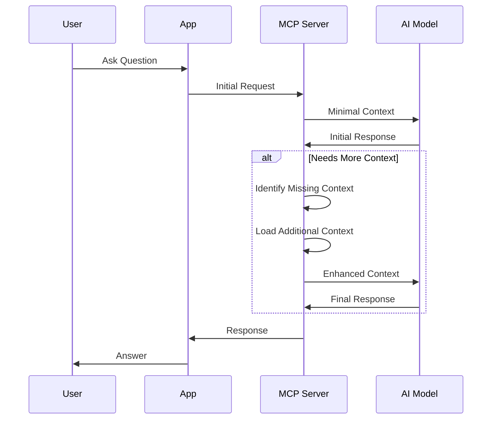
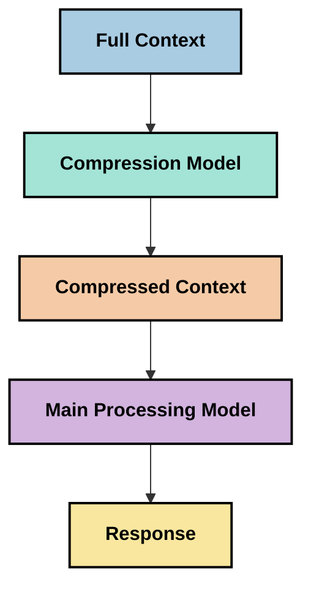
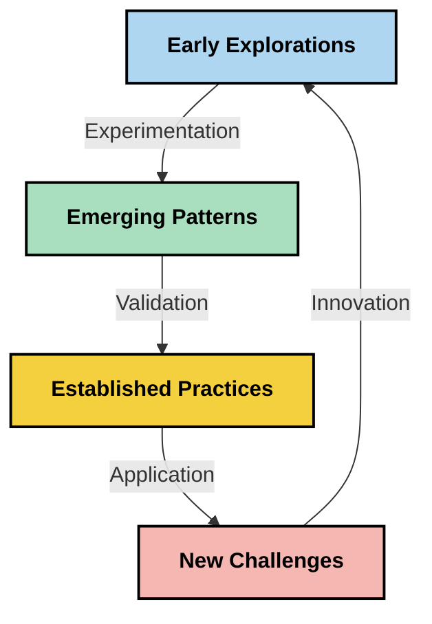

<!--
CO_OP_TRANSLATOR_METADATA:
{
  "original_hash": "fd169ca3071b81b5ee282e194bc823df",
  "translation_date": "2025-09-15T20:18:04+00:00",
  "source_file": "05-AdvancedTopics/mcp-contextengineering/README.md",
  "language_code": "br"
}
-->
# Engenharia de Contexto: Um Conceito Emergente no Ecossistema MCP

## Visão Geral

A engenharia de contexto é um conceito emergente no espaço de IA que explora como as informações são estruturadas, entregues e mantidas ao longo das interações entre clientes e serviços de IA. À medida que o ecossistema do Model Context Protocol (MCP) evolui, entender como gerenciar o contexto de forma eficaz torna-se cada vez mais importante. Este módulo introduz o conceito de engenharia de contexto e explora suas possíveis aplicações em implementações do MCP.

## Objetivos de Aprendizagem

Ao final deste módulo, você será capaz de:

- Compreender o conceito emergente de engenharia de contexto e seu papel potencial em aplicações MCP
- Identificar os principais desafios na gestão de contexto que o design do protocolo MCP aborda
- Explorar técnicas para melhorar o desempenho do modelo por meio de um melhor gerenciamento de contexto
- Considerar abordagens para medir e avaliar a eficácia do contexto
- Aplicar esses conceitos emergentes para melhorar experiências de IA através do framework MCP

## Introdução à Engenharia de Contexto

A engenharia de contexto é um conceito emergente focado no design e gerenciamento deliberado do fluxo de informações entre usuários, aplicativos e modelos de IA. Diferentemente de campos estabelecidos como a engenharia de prompts, a engenharia de contexto ainda está sendo definida por profissionais que trabalham para resolver os desafios únicos de fornecer aos modelos de IA as informações certas no momento certo.

À medida que os grandes modelos de linguagem (LLMs) evoluíram, a importância do contexto tornou-se cada vez mais evidente. A qualidade, relevância e estrutura do contexto fornecido impactam diretamente os resultados dos modelos. A engenharia de contexto explora essa relação e busca desenvolver princípios para um gerenciamento eficaz de contexto.

> "Em 2025, os modelos disponíveis são extremamente inteligentes. Mas mesmo o humano mais inteligente não será capaz de fazer seu trabalho de forma eficaz sem o contexto do que está sendo solicitado... 'Engenharia de contexto' é o próximo nível da engenharia de prompts. Trata-se de fazer isso automaticamente em um sistema dinâmico." — Walden Yan, Cognition AI

A engenharia de contexto pode abranger:

1. **Seleção de Contexto**: Determinar quais informações são relevantes para uma tarefa específica
2. **Estruturação de Contexto**: Organizar informações para maximizar a compreensão do modelo
3. **Entrega de Contexto**: Otimizar como e quando as informações são enviadas aos modelos
4. **Manutenção de Contexto**: Gerenciar o estado e a evolução do contexto ao longo do tempo
5. **Avaliação de Contexto**: Medir e melhorar a eficácia do contexto

Essas áreas de foco são particularmente relevantes para o ecossistema MCP, que fornece uma maneira padronizada para aplicativos fornecerem contexto aos LLMs.

## A Perspectiva da Jornada do Contexto

Uma maneira de visualizar a engenharia de contexto é traçar a jornada que as informações percorrem em um sistema MCP:



### Principais Etapas na Jornada do Contexto:

1. **Entrada do Usuário**: Informações brutas do usuário (texto, imagens, documentos)
2. **Montagem do Contexto**: Combinação da entrada do usuário com o contexto do sistema, histórico de conversas e outras informações recuperadas
3. **Processamento pelo Modelo**: O modelo de IA processa o contexto montado
4. **Geração de Resposta**: O modelo produz saídas com base no contexto fornecido
5. **Gerenciamento de Estado**: O sistema atualiza seu estado interno com base na interação

Essa perspectiva destaca a natureza dinâmica do contexto em sistemas de IA e levanta questões importantes sobre como gerenciar melhor as informações em cada etapa.

## Princípios Emergentes na Engenharia de Contexto

À medida que o campo da engenharia de contexto toma forma, alguns princípios iniciais estão começando a surgir entre os profissionais. Esses princípios podem ajudar a informar escolhas de implementação do MCP:

### Princípio 1: Compartilhe o Contexto Completamente

O contexto deve ser compartilhado completamente entre todos os componentes de um sistema, em vez de fragmentado entre múltiplos agentes ou processos. Quando o contexto é distribuído, decisões tomadas em uma parte do sistema podem entrar em conflito com decisões feitas em outras partes.



Em aplicações MCP, isso sugere projetar sistemas onde o contexto flua perfeitamente por todo o pipeline, em vez de ser compartimentalizado.

### Princípio 2: Reconheça Que Ações Carregam Decisões Implícitas

Cada ação que um modelo realiza incorpora decisões implícitas sobre como interpretar o contexto. Quando múltiplos componentes agem sobre diferentes contextos, essas decisões implícitas podem entrar em conflito, levando a resultados inconsistentes.

Este princípio tem implicações importantes para aplicações MCP:
- Prefira o processamento linear de tarefas complexas em vez da execução paralela com contexto fragmentado
- Certifique-se de que todos os pontos de decisão tenham acesso às mesmas informações contextuais
- Projete sistemas onde etapas posteriores possam ver o contexto completo das decisões anteriores

### Princípio 3: Equilibre a Profundidade do Contexto com as Limitações da Janela

À medida que conversas e processos se tornam mais longos, as janelas de contexto eventualmente excedem seus limites. A engenharia de contexto eficaz explora abordagens para gerenciar essa tensão entre contexto abrangente e limitações técnicas.

Abordagens potenciais sendo exploradas incluem:
- Compressão de contexto que mantém informações essenciais enquanto reduz o uso de tokens
- Carregamento progressivo de contexto com base na relevância para as necessidades atuais
- Resumo de interações anteriores enquanto preserva decisões e fatos importantes

## Desafios de Contexto e Design do Protocolo MCP

O Model Context Protocol (MCP) foi projetado com uma consciência dos desafios únicos da gestão de contexto. Compreender esses desafios ajuda a explicar aspectos importantes do design do protocolo MCP:

### Desafio 1: Limitações da Janela de Contexto
A maioria dos modelos de IA possui tamanhos fixos de janela de contexto, limitando a quantidade de informações que podem processar de uma vez.

**Resposta do Design MCP:** 
- O protocolo suporta contexto estruturado baseado em recursos que podem ser referenciados de forma eficiente
- Recursos podem ser paginados e carregados progressivamente

### Desafio 2: Determinação de Relevância
Determinar quais informações são mais relevantes para incluir no contexto é difícil.

**Resposta do Design MCP:**
- Ferramentas flexíveis permitem a recuperação dinâmica de informações com base na necessidade
- Prompts estruturados possibilitam organização consistente do contexto

### Desafio 3: Persistência de Contexto
Gerenciar o estado ao longo das interações requer um rastreamento cuidadoso do contexto.

**Resposta do Design MCP:**
- Gerenciamento de sessão padronizado
- Padrões de interação claramente definidos para evolução do contexto

### Desafio 4: Contexto Multimodal
Diferentes tipos de dados (texto, imagens, dados estruturados) exigem tratamentos distintos.

**Resposta do Design MCP:**
- O design do protocolo acomoda vários tipos de conteúdo
- Representação padronizada de informações multimodais

### Desafio 5: Segurança e Privacidade
O contexto frequentemente contém informações sensíveis que devem ser protegidas.

**Resposta do Design MCP:**
- Limites claros entre responsabilidades do cliente e do servidor
- Opções de processamento local para minimizar a exposição de dados

Compreender esses desafios e como o MCP os aborda fornece uma base para explorar técnicas mais avançadas de engenharia de contexto.

## Abordagens Emergentes na Engenharia de Contexto

À medida que o campo da engenharia de contexto se desenvolve, várias abordagens promissoras estão surgindo. Estas representam o pensamento atual, em vez de práticas estabelecidas, e provavelmente evoluirão à medida que ganharmos mais experiência com implementações do MCP.

### 1. Processamento Linear de Único Fio

Em contraste com arquiteturas de múltiplos agentes que distribuem o contexto, alguns profissionais estão descobrindo que o processamento linear de único fio produz resultados mais consistentes. Isso está alinhado com o princípio de manter o contexto unificado.



Embora essa abordagem possa parecer menos eficiente do que o processamento paralelo, ela frequentemente produz resultados mais coerentes e confiáveis porque cada etapa se baseia em uma compreensão completa das decisões anteriores.

### 2. Fragmentação e Priorização de Contexto

Dividir grandes contextos em partes gerenciáveis e priorizar o que é mais importante.

```python
# Conceptual Example: Context Chunking and Prioritization
def process_with_chunked_context(documents, query):
    # 1. Break documents into smaller chunks
    chunks = chunk_documents(documents)
    
    # 2. Calculate relevance scores for each chunk
    scored_chunks = [(chunk, calculate_relevance(chunk, query)) for chunk in chunks]
    
    # 3. Sort chunks by relevance score
    sorted_chunks = sorted(scored_chunks, key=lambda x: x[1], reverse=True)
    
    # 4. Use the most relevant chunks as context
    context = create_context_from_chunks([chunk for chunk, score in sorted_chunks[:5]])
    
    # 5. Process with the prioritized context
    return generate_response(context, query)
```

O conceito acima ilustra como podemos dividir grandes documentos em partes gerenciáveis e selecionar apenas as partes mais relevantes para o contexto. Essa abordagem pode ajudar a trabalhar dentro das limitações da janela de contexto enquanto ainda aproveita grandes bases de conhecimento.

### 3. Carregamento Progressivo de Contexto

Carregar o contexto progressivamente conforme necessário, em vez de tudo de uma vez.



O carregamento progressivo de contexto começa com um contexto mínimo e se expande apenas quando necessário. Isso pode reduzir significativamente o uso de tokens para consultas simples, mantendo a capacidade de lidar com questões complexas.

### 4. Compressão e Resumo de Contexto

Reduzir o tamanho do contexto enquanto preserva informações essenciais.



A compressão de contexto foca em:
- Remover informações redundantes
- Resumir conteúdos extensos
- Extrair fatos e detalhes-chave
- Preservar elementos críticos do contexto
- Otimizar para eficiência de tokens

Essa abordagem pode ser particularmente valiosa para manter conversas longas dentro das janelas de contexto ou para processar grandes documentos de forma eficiente. Alguns profissionais estão utilizando modelos especializados especificamente para compressão de contexto e resumo do histórico de conversas.

## Considerações Exploratórias na Engenharia de Contexto

Ao explorar o campo emergente da engenharia de contexto, várias considerações valem a pena ser mantidas em mente ao trabalhar com implementações do MCP. Estas não são práticas prescritas, mas sim áreas de exploração que podem gerar melhorias em seu caso de uso específico.

### Considere Seus Objetivos de Contexto

Antes de implementar soluções complexas de gerenciamento de contexto, articule claramente o que você está tentando alcançar:
- Quais informações específicas o modelo precisa para ser bem-sucedido?
- Quais informações são essenciais versus suplementares?
- Quais são suas restrições de desempenho (latência, limites de tokens, custos)?

### Explore Abordagens de Contexto em Camadas

Alguns profissionais estão obtendo sucesso com contextos organizados em camadas conceituais:
- **Camada Central**: Informações essenciais que o modelo sempre precisa
- **Camada Situacional**: Contexto específico para a interação atual
- **Camada de Suporte**: Informações adicionais que podem ser úteis
- **Camada de Reserva**: Informações acessadas apenas quando necessário

### Investigue Estratégias de Recuperação

A eficácia do seu contexto frequentemente depende de como você recupera informações:
- Busca semântica e embeddings para encontrar informações conceitualmente relevantes
- Busca baseada em palavras-chave para detalhes factuais específicos
- Abordagens híbridas que combinam múltiplos métodos de recuperação
- Filtragem por metadados para restringir o escopo com base em categorias, datas ou fontes

### Experimente com Coerência de Contexto

A estrutura e o fluxo do seu contexto podem afetar a compreensão do modelo:
- Agrupando informações relacionadas
- Usando formatação e organização consistentes
- Mantendo ordenação lógica ou cronológica quando apropriado
- Evitando informações contraditórias

### Pese os Trade-offs de Arquiteturas de Múltiplos Agentes

Embora arquiteturas de múltiplos agentes sejam populares em muitos frameworks de IA, elas apresentam desafios significativos para o gerenciamento de contexto:
- A fragmentação do contexto pode levar a decisões inconsistentes entre agentes
- O processamento paralelo pode introduzir conflitos difíceis de reconciliar
- A sobrecarga de comunicação entre agentes pode compensar os ganhos de desempenho
- O gerenciamento de estado complexo é necessário para manter a coerência

Em muitos casos, uma abordagem de agente único com gerenciamento abrangente de contexto pode produzir resultados mais confiáveis do que múltiplos agentes especializados com contexto fragmentado.

### Desenvolva Métodos de Avaliação

Para melhorar a engenharia de contexto ao longo do tempo, considere como você medirá o sucesso:
- Testes A/B com diferentes estruturas de contexto
- Monitoramento do uso de tokens e tempos de resposta
- Acompanhamento da satisfação do usuário e taxas de conclusão de tarefas
- Análise de quando e por que estratégias de contexto falham

Essas considerações representam áreas ativas de exploração no espaço da engenharia de contexto. À medida que o campo amadurece, padrões e práticas mais definitivos provavelmente surgirão.

## Medindo a Eficácia do Contexto: Um Framework em Evolução

À medida que a engenharia de contexto emerge como um conceito, os profissionais estão começando a explorar como podemos medir sua eficácia. Ainda não existe um framework estabelecido, mas várias métricas estão sendo consideradas que podem ajudar a orientar trabalhos futuros.

### Dimensões Potenciais de Medição

#### 1. Considerações de Eficiência de Entrada

- **Razão Contexto-Resposta**: Quanto contexto é necessário em relação ao tamanho da resposta?
- **Utilização de Tokens**: Qual porcentagem dos tokens de contexto fornecidos parece influenciar a resposta?
- **Redução de Contexto**: Quão eficazmente podemos comprimir informações brutas?

#### 2. Considerações de Desempenho

- **Impacto na Latência**: Como o gerenciamento de contexto afeta o tempo de resposta?
- **Economia de Tokens**: Estamos otimizando o uso de tokens de forma eficaz?
- **Precisão na Recuperação**: Quão relevante é a informação recuperada?
- **Utilização de Recursos**: Quais recursos computacionais são necessários?

#### 3. Considerações de Qualidade

- **Relevância da Resposta**: Quão bem a resposta aborda a consulta?
- **Precisão Factual**: O gerenciamento de contexto melhora a correção factual?
- **Consistência**: As respostas são consistentes em consultas semelhantes?
- **Taxa de Alucinação**: Um contexto melhor reduz alucinações do modelo?

#### 4. Considerações de Experiência do Usuário

- **Taxa de Seguimento**: Com que frequência os usuários precisam de esclarecimentos?
- **Conclusão de Tarefas**: Os usuários conseguem alcançar seus objetivos com sucesso?
- **Indicadores de Satisfação**: Como os usuários avaliam sua experiência?

### Abordagens Exploratórias para Medição

Ao experimentar com engenharia de contexto em implementações MCP, considere estas abordagens exploratórias:

1. **Comparações de Base**: Estabeleça uma base com abordagens simples de contexto antes de testar métodos mais sofisticados

2. **Mudanças Incrementais**: Altere um aspecto do gerenciamento de contexto por vez para isolar seus efeitos

3. **Avaliação Centrada no Usuário**: Combine métricas quantitativas com feedback qualitativo dos usuários

4. **Análise de Falhas**: Examine casos onde estratégias de contexto falham para entender possíveis melhorias

5. **Avaliação Multidimensional**: Considere trade-offs entre eficiência, qualidade e experiência do usuário

Essa abordagem experimental e multifacetada para medição está alinhada com a natureza emergente da engenharia de contexto.

## Reflexões Finais

A engenharia de contexto é uma área emergente de exploração que pode se tornar central para aplicações eficazes do MCP. Ao considerar cuidadosamente como as informações fluem pelo seu sistema, você pode potencialmente criar experiências de IA mais eficientes, precisas e valiosas para os usuários.

As técnicas e abordagens descritas neste módulo representam o pensamento inicial nesse espaço, não práticas estabelecidas. A engenharia de contexto pode se desenvolver em uma disciplina mais definida à medida que as capacidades de IA evoluem e nossa compreensão se aprofunda. Por enquanto, a experimentação combinada com medições cuidadosas parece ser a abordagem mais produtiva.

## Direções Futuras Potenciais

O campo da engenharia de contexto ainda está em seus estágios iniciais, mas várias direções promissoras estão emergindo:

- Os princípios de engenharia de contexto podem impactar significativamente o desempenho do modelo, eficiência, experiência do usuário e confiabilidade
- Abordagens de único fio com gerenciamento abrangente de contexto podem superar arquiteturas de múltiplos agentes para muitos casos de uso
- Modelos especializados de compressão de contexto podem se tornar componentes padrão em pipelines de IA
- A tensão entre completude do contexto e limitações de tokens provavelmente impulsionará a inovação no gerenciamento de contexto
- À medida que os modelos se tornam mais capazes de comunicação eficiente semelhante à humana, a verdadeira colaboração de múltiplos agentes pode se tornar mais viável
- As implementações do MCP podem evoluir para padronizar padrões de gerenciamento de contexto que surgem da experimentação atual



## Recursos

### Recursos Oficiais do MCP
- [Model Context Protocol Website](https://modelcontextprotocol.io/)
- [Model Context Protocol Specification](https://github.com/modelcontextprotocol/modelcontextprotocol)
- [MCP Documentation](https://modelcontextprotocol.io/docs)
- [MCP C# SDK](https://github.com/modelcontextprotocol/csharp-sdk)
- [MCP Python SDK](https://github.com/modelcontextprotocol/python-sdk)
- [MCP TypeScript SDK](https://github.com/modelcontextprotocol/typescript-sdk)
- [MCP Inspector](https://github.com/modelcontextprotocol/inspector) - Ferramenta visual de teste para servidores MCP

### Artigos sobre Engenharia de Contexto
- [Don't Build Multi-Agents: Principles of Context Engineering](https://cognition.ai/blog/dont-build-multi-agents) - Insights de Walden Yan sobre os princípios da engenharia de contexto
- [A Practical Guide to Building Agents](https://cdn.openai.com/business-guides-and-resources/a-practical-guide-to-building-agents.pdf) - Guia da OpenAI sobre design eficaz de agentes
- [Building Effective Agents](https://www.anthropic.com/engineering/building-effective-agents) - Abordagem da Anthropic para o desenvolvimento de agentes

### Pesquisas Relacionadas
- [Dynamic Retrieval Augmentation for Large Language Models](https://arxiv.org/abs/2310.01487) - Pesquisa sobre abordagens de recuperação dinâmica
- [Lost in the Middle: How Language Models Use Long Contexts](https://arxiv.org/abs/2307.03172) - Pesquisa importante sobre padrões de processamento de contexto
- [Hierarchical Text-Conditioned Image Generation with CLIP Latents](https://arxiv.org/abs/2204.06125) - Artigo do DALL-E 2 com insights sobre estruturação de contexto
- [Exploring the Role of Context in Large Language Model Architectures](https://aclanthology.org/2023.findings-emnlp.124/) - Pesquisa recente sobre manipulação de contexto
- [Multi-Agent Collaboration: A Survey](https://arxiv.org/abs/2304.03442) - Pesquisa sobre sistemas multi-agentes e seus desafios

### Recursos Adicionais
- [Context Window Optimization Techniques](https://learn.microsoft.com/en-us/azure/ai-services/openai/concepts/context-window)
- [Advanced RAG Techniques](https://www.microsoft.com/en-us/research/blog/retrieval-augmented-generation-rag-and-frontier-models/)
- [Semantic Kernel Documentation](https://github.com/microsoft/semantic-kernel)
- [AI Toolkit for Context Management](https://github.com/microsoft/aitoolkit)

## O que vem a seguir

- [5.15 MCP Custom Transport](../mcp-transport/README.md)

---

**Aviso Legal**:  
Este documento foi traduzido utilizando o serviço de tradução por IA [Co-op Translator](https://github.com/Azure/co-op-translator). Embora nos esforcemos para garantir a precisão, esteja ciente de que traduções automatizadas podem conter erros ou imprecisões. O documento original em seu idioma nativo deve ser considerado a fonte autoritativa. Para informações críticas, recomenda-se a tradução profissional realizada por humanos. Não nos responsabilizamos por quaisquer mal-entendidos ou interpretações equivocadas decorrentes do uso desta tradução.