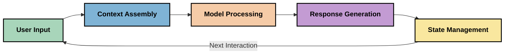
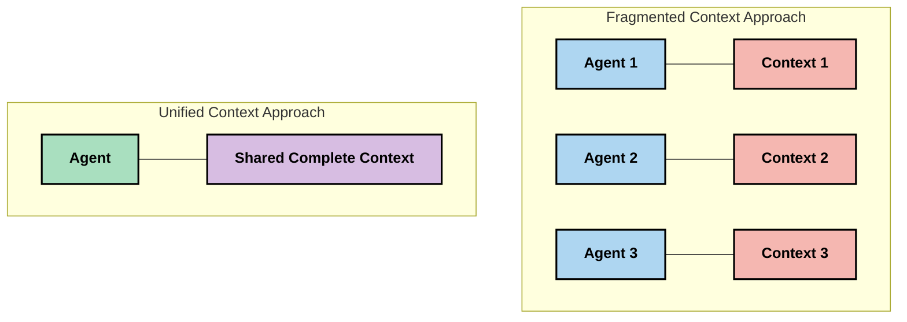
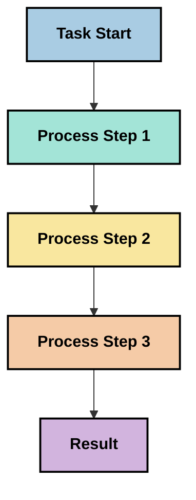
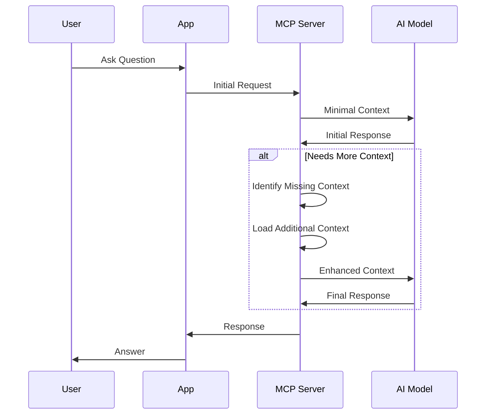
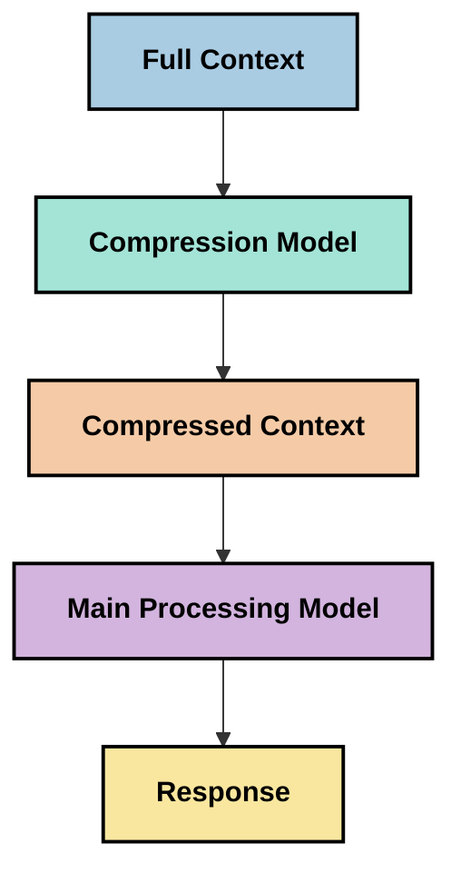
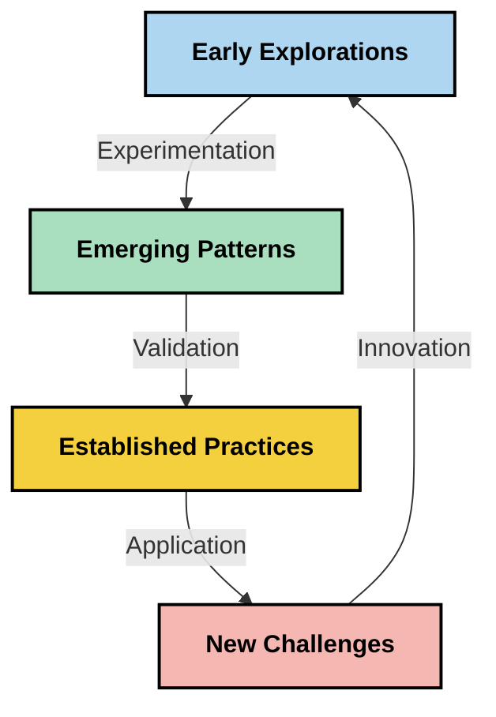

<!--
CO_OP_TRANSLATOR_METADATA:
{
  "original_hash": "5762e8e74dd99d8b7dbb31e69a82561e",
  "translation_date": "2025-07-17T01:44:57+00:00",
  "source_file": "05-AdvancedTopics/mcp-contextengineering/README.md",
  "language_code": "br"
}
-->
# Engenharia de Contexto: Um Conceito Emergente no Ecossistema MCP

## Visão Geral

Engenharia de contexto é um conceito emergente no campo da IA que explora como a informação é estruturada, entregue e mantida ao longo das interações entre clientes e serviços de IA. À medida que o ecossistema do Model Context Protocol (MCP) evolui, entender como gerenciar o contexto de forma eficaz torna-se cada vez mais importante. Este módulo apresenta o conceito de engenharia de contexto e explora suas possíveis aplicações em implementações MCP.

## Objetivos de Aprendizagem

Ao final deste módulo, você será capaz de:

- Compreender o conceito emergente de engenharia de contexto e seu papel potencial em aplicações MCP
- Identificar os principais desafios na gestão de contexto que o design do protocolo MCP aborda
- Explorar técnicas para melhorar o desempenho do modelo por meio de um melhor manejo do contexto
- Considerar abordagens para medir e avaliar a eficácia do contexto
- Aplicar esses conceitos emergentes para aprimorar experiências de IA através do framework MCP

## Introdução à Engenharia de Contexto

Engenharia de contexto é um conceito emergente focado no design deliberado e na gestão do fluxo de informações entre usuários, aplicações e modelos de IA. Diferente de áreas já estabelecidas como engenharia de prompts, a engenharia de contexto ainda está sendo definida pelos praticantes enquanto eles trabalham para resolver os desafios únicos de fornecer aos modelos de IA a informação certa no momento certo.

À medida que os grandes modelos de linguagem (LLMs) evoluíram, a importância do contexto tornou-se cada vez mais evidente. A qualidade, relevância e estrutura do contexto que fornecemos impactam diretamente as respostas do modelo. A engenharia de contexto explora essa relação e busca desenvolver princípios para uma gestão eficaz do contexto.

> "Em 2025, os modelos disponíveis são extremamente inteligentes. Mas mesmo o humano mais inteligente não conseguirá fazer seu trabalho de forma eficaz sem o contexto do que está sendo pedido... 'Engenharia de contexto' é o próximo nível da engenharia de prompts. Trata-se de fazer isso automaticamente em um sistema dinâmico." — Walden Yan, Cognition AI

A engenharia de contexto pode abranger:

1. **Seleção de Contexto**: Determinar quais informações são relevantes para uma tarefa específica  
2. **Estruturação do Contexto**: Organizar as informações para maximizar a compreensão do modelo  
3. **Entrega do Contexto**: Otimizar como e quando as informações são enviadas aos modelos  
4. **Manutenção do Contexto**: Gerenciar o estado e a evolução do contexto ao longo do tempo  
5. **Avaliação do Contexto**: Medir e melhorar a eficácia do contexto  

Essas áreas são particularmente relevantes para o ecossistema MCP, que oferece uma forma padronizada para aplicações fornecerem contexto aos LLMs.

## A Perspectiva da Jornada do Contexto

Uma forma de visualizar a engenharia de contexto é traçar a jornada que a informação percorre dentro de um sistema MCP:



### Principais Etapas na Jornada do Contexto:

1. **Entrada do Usuário**: Informação bruta do usuário (texto, imagens, documentos)  
2. **Montagem do Contexto**: Combinação da entrada do usuário com o contexto do sistema, histórico da conversa e outras informações recuperadas  
3. **Processamento pelo Modelo**: O modelo de IA processa o contexto montado  
4. **Geração da Resposta**: O modelo produz saídas baseadas no contexto fornecido  
5. **Gerenciamento de Estado**: O sistema atualiza seu estado interno com base na interação  

Essa perspectiva destaca a natureza dinâmica do contexto em sistemas de IA e levanta questões importantes sobre como gerenciar melhor a informação em cada etapa.

## Princípios Emergentes na Engenharia de Contexto

À medida que o campo da engenharia de contexto se desenvolve, alguns princípios iniciais começam a surgir entre os praticantes. Esses princípios podem ajudar a orientar escolhas na implementação do MCP:

### Princípio 1: Compartilhe o Contexto Completamente

O contexto deve ser compartilhado de forma completa entre todos os componentes de um sistema, em vez de fragmentado entre múltiplos agentes ou processos. Quando o contexto é distribuído, decisões tomadas em uma parte do sistema podem entrar em conflito com as feitas em outra.



Em aplicações MCP, isso sugere projetar sistemas onde o contexto flua de forma contínua por todo o pipeline, em vez de ser compartimentado.

### Princípio 2: Reconheça que Ações Carregam Decisões Implícitas

Cada ação tomada por um modelo incorpora decisões implícitas sobre como interpretar o contexto. Quando múltiplos componentes atuam sobre contextos diferentes, essas decisões implícitas podem entrar em conflito, levando a resultados inconsistentes.

Esse princípio tem implicações importantes para aplicações MCP:  
- Prefira o processamento linear de tarefas complexas em vez da execução paralela com contexto fragmentado  
- Garanta que todos os pontos de decisão tenham acesso à mesma informação contextual  
- Projete sistemas onde etapas posteriores possam ver o contexto completo das decisões anteriores  

### Princípio 3: Equilibre a Profundidade do Contexto com as Limitações da Janela

À medida que conversas e processos se estendem, as janelas de contexto eventualmente se esgotam. A engenharia de contexto eficaz explora abordagens para gerenciar essa tensão entre contexto abrangente e limitações técnicas.

Abordagens potenciais em estudo incluem:  
- Compressão de contexto que mantém informações essenciais enquanto reduz o uso de tokens  
- Carregamento progressivo do contexto baseado na relevância para as necessidades atuais  
- Resumo de interações anteriores preservando decisões e fatos-chave  

## Desafios do Contexto e Design do Protocolo MCP

O Model Context Protocol (MCP) foi projetado com consciência dos desafios únicos da gestão de contexto. Entender esses desafios ajuda a explicar aspectos-chave do design do protocolo MCP:

### Desafio 1: Limitações da Janela de Contexto  
A maioria dos modelos de IA possui tamanhos fixos de janela de contexto, limitando a quantidade de informação que podem processar de uma vez.

**Resposta do Design MCP:**  
- O protocolo suporta contexto estruturado baseado em recursos que podem ser referenciados de forma eficiente  
- Recursos podem ser paginados e carregados progressivamente  

### Desafio 2: Determinação de Relevância  
Determinar quais informações são mais relevantes para incluir no contexto é difícil.

**Resposta do Design MCP:**  
- Ferramentas flexíveis permitem recuperação dinâmica de informações conforme a necessidade  
- Prompts estruturados possibilitam organização consistente do contexto  

### Desafio 3: Persistência do Contexto  
Gerenciar o estado ao longo das interações requer acompanhamento cuidadoso do contexto.

**Resposta do Design MCP:**  
- Gerenciamento padronizado de sessões  
- Padrões de interação claramente definidos para evolução do contexto  

### Desafio 4: Contexto Multimodal  
Diferentes tipos de dados (texto, imagens, dados estruturados) exigem tratamentos distintos.

**Resposta do Design MCP:**  
- O design do protocolo acomoda vários tipos de conteúdo  
- Representação padronizada de informações multimodais  

### Desafio 5: Segurança e Privacidade  
O contexto frequentemente contém informações sensíveis que precisam ser protegidas.

**Resposta do Design MCP:**  
- Limites claros entre responsabilidades do cliente e do servidor  
- Opções de processamento local para minimizar exposição de dados  

Compreender esses desafios e como o MCP os aborda fornece uma base para explorar técnicas mais avançadas de engenharia de contexto.

## Abordagens Emergentes em Engenharia de Contexto

À medida que o campo da engenharia de contexto se desenvolve, várias abordagens promissoras estão surgindo. Elas representam o pensamento atual, não práticas consolidadas, e provavelmente evoluirão conforme ganharmos mais experiência com implementações MCP.

### 1. Processamento Linear em Thread Única

Em contraste com arquiteturas multiagentes que distribuem o contexto, alguns praticantes estão descobrindo que o processamento linear em thread única produz resultados mais consistentes. Isso está alinhado com o princípio de manter um contexto unificado.



Embora essa abordagem possa parecer menos eficiente que o processamento paralelo, ela frequentemente gera resultados mais coerentes e confiáveis porque cada etapa se baseia em uma compreensão completa das decisões anteriores.

### 2. Fragmentação e Priorização do Contexto

Dividir contextos grandes em partes gerenciáveis e priorizar o que é mais importante.

```python
# Conceptual Example: Context Chunking and Prioritization
def process_with_chunked_context(documents, query):
    # 1. Break documents into smaller chunks
    chunks = chunk_documents(documents)
    
    # 2. Calculate relevance scores for each chunk
    scored_chunks = [(chunk, calculate_relevance(chunk, query)) for chunk in chunks]
    
    # 3. Sort chunks by relevance score
    sorted_chunks = sorted(scored_chunks, key=lambda x: x[1], reverse=True)
    
    # 4. Use the most relevant chunks as context
    context = create_context_from_chunks([chunk for chunk, score in sorted_chunks[:5]])
    
    # 5. Process with the prioritized context
    return generate_response(context, query)
```

O conceito acima ilustra como podemos dividir documentos extensos em partes manejáveis e selecionar apenas as seções mais relevantes para o contexto. Essa abordagem ajuda a trabalhar dentro das limitações da janela de contexto, aproveitando grandes bases de conhecimento.

### 3. Carregamento Progressivo do Contexto

Carregar o contexto progressivamente conforme a necessidade, em vez de tudo de uma vez.



O carregamento progressivo do contexto começa com um contexto mínimo e expande apenas quando necessário. Isso pode reduzir significativamente o uso de tokens para consultas simples, mantendo a capacidade de lidar com perguntas complexas.

### 4. Compressão e Resumo do Contexto

Reduzir o tamanho do contexto preservando informações essenciais.



A compressão de contexto foca em:  
- Remover informações redundantes  
- Resumir conteúdos extensos  
- Extrair fatos e detalhes-chave  
- Preservar elementos críticos do contexto  
- Otimizar a eficiência no uso de tokens  

Essa abordagem pode ser especialmente valiosa para manter conversas longas dentro das janelas de contexto ou para processar documentos grandes de forma eficiente. Alguns praticantes utilizam modelos especializados especificamente para compressão e resumo do histórico de conversas.

## Considerações Explorativas em Engenharia de Contexto

Ao explorar o campo emergente da engenharia de contexto, algumas considerações valem a pena ser lembradas ao trabalhar com implementações MCP. Elas não são práticas prescritas, mas áreas de exploração que podem trazer melhorias para seu caso específico.

### Considere Seus Objetivos com o Contexto

Antes de implementar soluções complexas de gestão de contexto, articule claramente o que você quer alcançar:  
- Quais informações específicas o modelo precisa para ter sucesso?  
- Quais informações são essenciais e quais são suplementares?  
- Quais são suas restrições de desempenho (latência, limites de tokens, custos)?  

### Explore Abordagens em Camadas para o Contexto

Alguns praticantes têm sucesso organizando o contexto em camadas conceituais:  
- **Camada Central**: Informação essencial que o modelo sempre precisa  
- **Camada Situacional**: Contexto específico da interação atual  
- **Camada de Apoio**: Informações adicionais que podem ser úteis  
- **Camada de Reserva**: Informação acessada apenas quando necessário  

### Investigue Estratégias de Recuperação

A eficácia do seu contexto muitas vezes depende de como você recupera a informação:  
- Busca semântica e embeddings para encontrar informações conceitualmente relevantes  
- Busca por palavras-chave para detalhes factuais específicos  
- Abordagens híbridas que combinam múltiplos métodos de recuperação  
- Filtragem por metadados para restringir o escopo com base em categorias, datas ou fontes  

### Experimente com a Coerência do Contexto

A estrutura e o fluxo do seu contexto podem afetar a compreensão do modelo:  
- Agrupar informações relacionadas  
- Usar formatação e organização consistentes  
- Manter ordenação lógica ou cronológica quando apropriado  
- Evitar informações contraditórias  

### Avalie os Prós e Contras de Arquiteturas Multiagentes

Embora arquiteturas multiagentes sejam populares em muitos frameworks de IA, elas apresentam desafios significativos para a gestão de contexto:  
- Fragmentação do contexto pode levar a decisões inconsistentes entre agentes  
- Processamento paralelo pode introduzir conflitos difíceis de resolver  
- Sobrecarga de comunicação entre agentes pode anular ganhos de desempenho  
- Gerenciamento complexo de estado é necessário para manter a coerência  

Em muitos casos, uma abordagem de agente único com gestão abrangente do contexto pode produzir resultados mais confiáveis do que múltiplos agentes especializados com contexto fragmentado.

### Desenvolva Métodos de Avaliação

Para melhorar a engenharia de contexto ao longo do tempo, considere como você medirá o sucesso:  
- Testes A/B com diferentes estruturas de contexto  
- Monitoramento do uso de tokens e tempos de resposta  
- Acompanhamento da satisfação do usuário e taxas de conclusão de tarefas  
- Análise de casos em que as estratégias de contexto falham  

Essas considerações representam áreas ativas de exploração no campo da engenharia de contexto. À medida que o campo amadurece, padrões e práticas mais definitivos provavelmente surgirão.

## Medindo a Eficácia do Contexto: Um Framework em Evolução

À medida que a engenharia de contexto surge como conceito, os praticantes começam a explorar como medir sua eficácia. Ainda não existe um framework estabelecido, mas várias métricas estão sendo consideradas para orientar trabalhos futuros.

### Potenciais Dimensões de Medição

#### 1. Considerações sobre Eficiência de Entrada

- **Razão Contexto-Resposta**: Quanto contexto é necessário em relação ao tamanho da resposta?  
- **Utilização de Tokens**: Qual porcentagem dos tokens do contexto fornecido influencia a resposta?  
- **Redução do Contexto**: Quão eficazmente podemos comprimir a informação bruta?  

#### 2. Considerações de Desempenho

- **Impacto na Latência**: Como a gestão do contexto afeta o tempo de resposta?  
- **Economia de Tokens**: Estamos otimizando o uso de tokens de forma eficaz?  
- **Precisão na Recuperação**: Quão relevante é a informação recuperada?  
- **Utilização de Recursos**: Quais recursos computacionais são necessários?  

#### 3. Considerações de Qualidade

- **Relevância da Resposta**: Quão bem a resposta atende à consulta?  
- **Precisão Factual**: A gestão do contexto melhora a correção factual?  
- **Consistência**: As respostas são consistentes em consultas similares?  
- **Taxa de Alucinações**: Um contexto melhor reduz as alucinações do modelo?  

#### 4. Considerações de Experiência do Usuário

- **Taxa de Seguimento**: Com que frequência os usuários precisam de esclarecimentos?  
- **Conclusão de Tarefas**: Os usuários conseguem alcançar seus objetivos?  
- **Indicadores de Satisfação**: Como os usuários avaliam sua experiência?  

### Abordagens Explorativas para Medição

Ao experimentar engenharia de contexto em implementações MCP, considere estas abordagens exploratórias:

1. **Comparações de Referência**: Estabeleça uma linha de base com abordagens simples antes de testar métodos mais sofisticados  
2. **Mudanças Incrementais**: Modifique um aspecto da gestão de contexto por vez para isolar seus efeitos  
3. **Avaliação Centrada no Usuário**: Combine métricas quantitativas com feedback qualitativo dos usuários  
4. **Análise de Falhas**: Examine casos onde as estratégias de contexto falham para entender possíveis melhorias  
5. **Avaliação Multidimensional**: Considere os trade-offs entre eficiência, qualidade e experiência do usuário  

Essa abordagem experimental e multifacetada para medição está alinhada com a natureza emergente da engenharia de contexto.

## Considerações Finais

Engenharia de contexto é uma área emergente de exploração que pode se tornar central para aplicações eficazes do MCP. Ao considerar cuidadosamente como a informação flui pelo seu sistema, você pode criar experiências de IA mais eficientes, precisas e valiosas para os usuários.

As técnicas e abordagens apresentadas neste módulo representam o pensamento inicial nessa área, não práticas consolidadas. A engenharia de contexto pode se desenvolver em uma disciplina mais definida à medida que as capacidades de IA evoluem e nosso entendimento se aprofunda. Por enquanto, experimentação combinada com medição cuidadosa parece ser a abordagem mais produtiva.

## Possíveis Direções Futuras

O campo da engenharia de contexto ainda está em seus estágios iniciais, mas várias direções promissoras estão surgindo:

- Princípios de engenharia de contexto podem impactar significativamente o desempenho do modelo, eficiência, experiência do usuário e confiabilidade  
- Abordagens em thread única com gestão abrangente do contexto podem superar arquiteturas multiagentes em muitos casos de uso  
- Modelos especializados em compressão de contexto podem se tornar componentes padrão em pipelines de IA  
- A tensão entre completude do contexto e limitações de tokens provavelmente impulsionará inovações no manejo do contexto  
- À medida que os modelos se tornam mais capazes de comunicação eficiente e semelhante à humana, a colaboração multiagente verdadeira pode se tornar mais viável  
- Implementações MCP podem evoluir para padronizar padrões de gestão de contexto que emergem das experimentações atuais  



## Recursos

### Recursos Oficiais MCP
- [Model Context Protocol Website](https://modelcontextprotocol.io/)
- [Model Context Protocol Specification](https://github.com/modelcontextprotocol/modelcontextprotocol)
- [MCP Documentation](https://modelcontextprotocol.io/docs)
- [MCP C# SDK](https://github.com/modelcontextprotocol/csharp-sdk)
- [MCP Python SDK](https://github.com/modelcontextprotocol/python-sdk)
- [MCP TypeScript SDK](https://github.com/modelcontextprotocol/typescript-sdk)
- [MCP Inspector](https://github.com/modelcontextprotocol/inspector) - Ferramenta visual para testes em servidores MCP

### Artigos sobre Engenharia de Contexto
- [Não Construa Multi-Agentes: Princípios da Engenharia de Contexto](https://cognition.ai/blog/dont-build-multi-agents) - Insights de Walden Yan sobre princípios da engenharia de contexto
- [Um Guia Prático para Construir Agentes](https://cdn.openai.com/business-guides-and-resources/a-practical-guide-to-building-agents.pdf) - Guia da OpenAI sobre design eficaz de agentes
- [Construindo Agentes Eficazes](https://www.anthropic.com/engineering/building-effective-agents) - Abordagem da Anthropic para desenvolvimento de agentes

### Pesquisas Relacionadas
- [Aprimoramento Dinâmico de Recuperação para Grandes Modelos de Linguagem](https://arxiv.org/abs/2310.01487) - Pesquisa sobre abordagens dinâmicas de recuperação
- [Perdidos no Meio: Como Modelos de Linguagem Usam Contextos Longos](https://arxiv.org/abs/2307.03172) - Pesquisa importante sobre padrões de processamento de contexto
- [Geração Hierárquica de Imagens Condicionada por Texto com Latentes CLIP](https://arxiv.org/abs/2204.06125) - Artigo do DALL-E 2 com insights sobre estruturação de contexto
- [Explorando o Papel do Contexto em Arquiteturas de Grandes Modelos de Linguagem](https://aclanthology.org/2023.findings-emnlp.124/) - Pesquisa recente sobre manejo de contexto
- [Colaboração Multi-Agente: Uma Revisão](https://arxiv.org/abs/2304.03442) - Pesquisa sobre sistemas multi-agente e seus desafios

### Recursos Adicionais
- [Técnicas de Otimização da Janela de Contexto](https://learn.microsoft.com/en-us/azure/ai-services/openai/concepts/context-window)
- [Técnicas Avançadas de RAG](https://www.microsoft.com/en-us/research/blog/retrieval-augmented-generation-rag-and-frontier-models/)
- [Documentação do Semantic Kernel](https://github.com/microsoft/semantic-kernel)
- [Kit de Ferramentas de IA para Gestão de Contexto](https://github.com/microsoft/aitoolkit)

## O que vem a seguir
- [6. Contribuições da Comunidade](../../06-CommunityContributions/README.md)

**Aviso Legal**:  
Este documento foi traduzido utilizando o serviço de tradução por IA [Co-op Translator](https://github.com/Azure/co-op-translator). Embora nos esforcemos para garantir a precisão, esteja ciente de que traduções automáticas podem conter erros ou imprecisões. O documento original em seu idioma nativo deve ser considerado a fonte autorizada. Para informações críticas, recomenda-se tradução profissional humana. Não nos responsabilizamos por quaisquer mal-entendidos ou interpretações incorretas decorrentes do uso desta tradução.