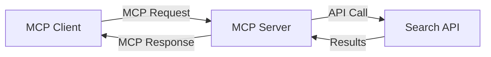
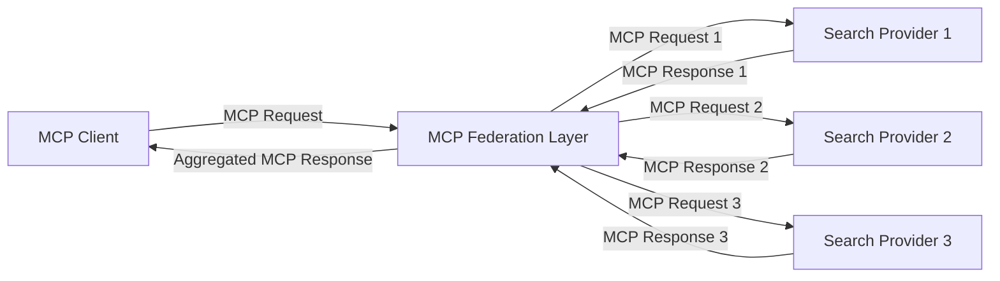
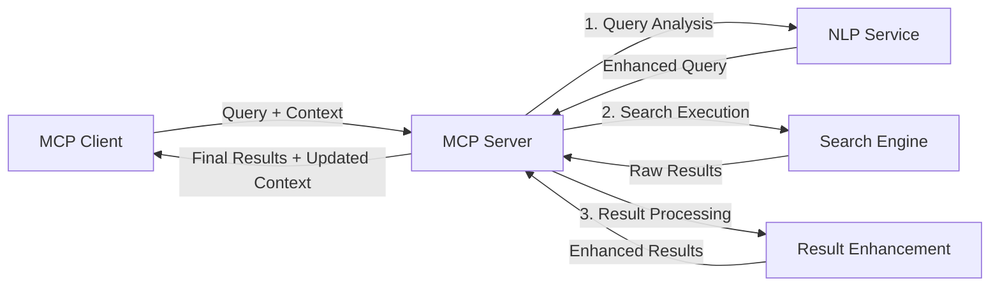

<!--
CO_OP_TRANSLATOR_METADATA:
{
  "original_hash": "333a03e51f90bdf3e6f1ba1694c73f36",
  "translation_date": "2025-07-17T01:07:00+00:00",
  "source_file": "05-AdvancedTopics/mcp-realtimesearch/README.md",
  "language_code": "br"
}
-->
## Aviso sobre Exemplos de Código

> **Nota Importante**: Os exemplos de código abaixo demonstram a integração do Model Context Protocol (MCP) com funcionalidades de busca na web. Embora sigam os padrões e estruturas dos SDKs oficiais do MCP, foram simplificados para fins educacionais.
> 
> Estes exemplos apresentam:
> 
> 1. **Implementação em Python**: Uma implementação de servidor FastMCP que oferece uma ferramenta de busca na web e se conecta a uma API externa de busca. Este exemplo demonstra o gerenciamento adequado do ciclo de vida, manipulação de contexto e implementação da ferramenta seguindo os padrões do [SDK oficial MCP para Python](https://github.com/modelcontextprotocol/python-sdk). O servidor utiliza o transporte HTTP Streamable recomendado, que substituiu o transporte SSE antigo para implantações em produção.
> 
> 2. **Implementação em JavaScript**: Uma implementação em TypeScript/JavaScript usando o padrão FastMCP do [SDK oficial MCP para TypeScript](https://github.com/modelcontextprotocol/typescript-sdk) para criar um servidor de busca com definições corretas de ferramentas e conexões de clientes. Segue os padrões mais recentes recomendados para gerenciamento de sessão e preservação de contexto.
> 
> Esses exemplos exigiriam tratamento adicional de erros, autenticação e código específico de integração com APIs para uso em produção. Os endpoints da API de busca mostrados (`https://api.search-service.example/search`) são exemplos e precisariam ser substituídos por endpoints reais de serviços de busca.
> 
> Para detalhes completos de implementação e as abordagens mais atualizadas, consulte a [especificação oficial do MCP](https://spec.modelcontextprotocol.io/) e a documentação dos SDKs.

## Conceitos Fundamentais

### O Framework Model Context Protocol (MCP)

Na sua base, o Model Context Protocol oferece uma forma padronizada para que modelos de IA, aplicações e serviços troquem contexto. Na busca em tempo real na web, esse framework é essencial para criar experiências de busca coerentes e com múltiplas interações. Os componentes principais incluem:

1. **Arquitetura Cliente-Servidor**: O MCP estabelece uma separação clara entre clientes de busca (solicitantes) e servidores de busca (provedores), permitindo modelos de implantação flexíveis.

2. **Comunicação JSON-RPC**: O protocolo usa JSON-RPC para troca de mensagens, tornando-o compatível com tecnologias web e fácil de implementar em diferentes plataformas.

3. **Gerenciamento de Contexto**: O MCP define métodos estruturados para manter, atualizar e aproveitar o contexto de busca ao longo de múltiplas interações.

4. **Definições de Ferramentas**: Capacidades de busca são expostas como ferramentas padronizadas com parâmetros e valores de retorno bem definidos.

5. **Suporte a Streaming**: O protocolo suporta resultados em streaming, essencial para buscas em tempo real onde os resultados podem chegar progressivamente.

### Padrões de Integração com Busca na Web

Ao integrar o MCP com busca na web, surgem vários padrões:

#### 1. Integração Direta com Provedor de Busca

Neste padrão, o servidor MCP se conecta diretamente a uma ou mais APIs de busca, traduzindo as requisições MCP em chamadas específicas da API e formatando os resultados como respostas MCP.

#### 2. Busca Federada com Preservação de Contexto

Este padrão distribui consultas de busca entre múltiplos provedores compatíveis com MCP, cada um potencialmente especializado em diferentes tipos de conteúdo ou capacidades de busca, mantendo um contexto unificado.

#### 3. Cadeia de Busca com Contexto Aprimorado

Neste padrão, o processo de busca é dividido em múltiplas etapas, com o contexto sendo enriquecido a cada passo, resultando em resultados progressivamente mais relevantes.

### Componentes do Contexto de Busca

Na busca web baseada em MCP, o contexto normalmente inclui:

- **Histórico de Consultas**: Consultas de busca anteriores na sessão
- **Preferências do Usuário**: Idioma, região, configurações de busca segura
- **Histórico de Interações**: Quais resultados foram clicados, tempo gasto nos resultados
- **Parâmetros de Busca**: Filtros, ordens de classificação e outros modificadores de busca
- **Conhecimento de Domínio**: Contexto específico do assunto relevante para a busca
- **Contexto Temporal**: Fatores de relevância baseados no tempo
- **Preferências de Fonte**: Fontes de informação confiáveis ou preferidas

## Casos de Uso e Aplicações

### Pesquisa e Coleta de Informações

O MCP aprimora fluxos de trabalho de pesquisa ao:

- Preservar o contexto de pesquisa entre sessões de busca
- Permitir consultas mais sofisticadas e contextualmente relevantes
- Suportar federação de busca multi-fonte
- Facilitar a extração de conhecimento a partir dos resultados de busca

### Monitoramento de Notícias e Tendências em Tempo Real

A busca com MCP oferece vantagens para monitoramento de notícias:

- Descoberta quase em tempo real de notícias emergentes
- Filtragem contextual de informações relevantes
- Rastreamento de tópicos e entidades em múltiplas fontes
- Alertas personalizados de notícias baseados no contexto do usuário

### Navegação e Pesquisa Aumentadas por IA

O MCP cria novas possibilidades para navegação aumentada por IA:

- Sugestões de busca contextuais baseadas na atividade atual do navegador
- Integração fluida da busca web com assistentes baseados em LLM
- Refinamento de busca em múltiplas interações com contexto mantido
- Verificação de fatos e validação de informações aprimoradas

## Tendências Futuras e Inovações

### Evolução do MCP na Busca Web

Olhando para o futuro, esperamos que o MCP evolua para abordar:

- **Busca Multimodal**: Integração de busca por texto, imagem, áudio e vídeo com contexto preservado
- **Busca Descentralizada**: Suporte a ecossistemas de busca distribuída e federada
- **Privacidade na Busca**: Mecanismos de busca que preservam a privacidade com consciência de contexto  
- **Compreensão de Consultas**: Análise semântica profunda de consultas de busca em linguagem natural  

### Avanços Potenciais na Tecnologia  

Tecnologias emergentes que irão moldar o futuro da busca MCP:  

1. **Arquiteturas de Busca Neural**: Sistemas de busca baseados em embeddings otimizados para MCP  
2. **Contexto de Busca Personalizado**: Aprendizado dos padrões de busca individuais dos usuários ao longo do tempo  
3. **Integração com Grafos de Conhecimento**: Busca contextual aprimorada por grafos de conhecimento específicos de domínio  
4. **Contexto Cross-Modal**: Manutenção do contexto entre diferentes modalidades de busca  

## Exercícios Práticos  

### Exercício 1: Configurando um Pipeline Básico de Busca MCP  

Neste exercício, você aprenderá a:  
- Configurar um ambiente básico de busca MCP  
- Implementar manipuladores de contexto para busca na web  
- Testar e validar a preservação do contexto ao longo das iterações de busca  

### Exercício 2: Construindo um Assistente de Pesquisa com Busca MCP  

Crie uma aplicação completa que:  
- Processa perguntas de pesquisa em linguagem natural  
- Realiza buscas na web com consciência de contexto  
- Sintetiza informações de múltiplas fontes  
- Apresenta os resultados de pesquisa organizados  

### Exercício 3: Implementando Federação de Busca Multi-Fonte com MCP  

Exercício avançado que aborda:  
- Envio de consultas com consciência de contexto para múltiplos motores de busca  
- Ranqueamento e agregação de resultados  
- Deduplicação contextual dos resultados de busca  
- Tratamento de metadados específicos das fontes  

## Recursos Adicionais  

- [Model Context Protocol Specification](https://spec.modelcontextprotocol.io/) - Especificação oficial do MCP e documentação detalhada do protocolo  
- [Model Context Protocol Documentation](https://modelcontextprotocol.io/) - Tutoriais detalhados e guias de implementação  
- [MCP Python SDK](https://github.com/modelcontextprotocol/python-sdk) - Implementação oficial em Python do protocolo MCP  
- [MCP TypeScript SDK](https://github.com/modelcontextprotocol/typescript-sdk) - Implementação oficial em TypeScript do protocolo MCP  
- [MCP Reference Servers](https://github.com/modelcontextprotocol/servers) - Implementações de referência dos servidores MCP  
- [Bing Web Search API Documentation](https://learn.microsoft.com/en-us/bing/search-apis/bing-web-search/overview) - API de busca web da Microsoft  
- [Google Custom Search JSON API](https://developers.google.com/custom-search/v1/overview) - Motor de busca programável do Google  
- [SerpAPI Documentation](https://serpapi.com/search-api) - API para páginas de resultados de motores de busca  
- [Meilisearch Documentation](https://www.meilisearch.com/docs) - Motor de busca open-source  
- [Elasticsearch Documentation](https://www.elastic.co/guide/index.html) - Motor distribuído de busca e análise  
- [LangChain Documentation](https://python.langchain.com/docs/get_started/introduction) - Construindo aplicações com LLMs  

## Resultados de Aprendizagem  

Ao concluir este módulo, você será capaz de:  

- Compreender os fundamentos da busca web em tempo real e seus desafios  
- Explicar como o Model Context Protocol (MCP) aprimora as capacidades de busca web em tempo real  
- Implementar soluções de busca baseadas em MCP usando frameworks e APIs populares  
- Projetar e implantar arquiteturas de busca escaláveis e de alto desempenho com MCP  
- Aplicar conceitos do MCP em diversos casos de uso, incluindo busca semântica, assistência em pesquisa e navegação aumentada por IA  
- Avaliar tendências emergentes e inovações futuras em tecnologias de busca baseadas em MCP  

### Considerações de Confiança e Segurança  

Ao implementar soluções de busca web baseadas em MCP, lembre-se destes princípios importantes da especificação MCP:  

1. **Consentimento e Controle do Usuário**: Os usuários devem consentir explicitamente e compreender todas as operações e acessos a dados. Isso é especialmente importante para implementações de busca web que podem acessar fontes externas de dados.  

2. **Privacidade dos Dados**: Garanta o tratamento adequado das consultas e resultados de busca, especialmente quando possam conter informações sensíveis. Implemente controles de acesso apropriados para proteger os dados dos usuários.  

3. **Segurança das Ferramentas**: Implemente autorização e validação adequadas para as ferramentas de busca, pois elas representam riscos potenciais de segurança por meio da execução arbitrária de código. Descrições do comportamento das ferramentas devem ser consideradas não confiáveis, a menos que obtidas de um servidor confiável.  

4. **Documentação Clara**: Forneça documentação clara sobre as capacidades, limitações e considerações de segurança da sua implementação de busca baseada em MCP, seguindo as diretrizes da especificação MCP.  

5. **Fluxos Robustos de Consentimento**: Construa fluxos robustos de consentimento e autorização que expliquem claramente o que cada ferramenta faz antes de autorizar seu uso, especialmente para ferramentas que interagem com recursos web externos.  

Para detalhes completos sobre segurança e considerações de confiança no MCP, consulte a [documentação oficial](https://modelcontextprotocol.io/specification/2025-03-26#security-and-trust-%26-safety).  

## Próximos passos  

- [5.12 Autenticação Entra ID para Servidores Model Context Protocol](../mcp-security-entra/README.md)

**Aviso Legal**:  
Este documento foi traduzido utilizando o serviço de tradução por IA [Co-op Translator](https://github.com/Azure/co-op-translator). Embora nos esforcemos para garantir a precisão, esteja ciente de que traduções automáticas podem conter erros ou imprecisões. O documento original em seu idioma nativo deve ser considerado a fonte autorizada. Para informações críticas, recomenda-se tradução profissional humana. Não nos responsabilizamos por quaisquer mal-entendidos ou interpretações incorretas decorrentes do uso desta tradução.