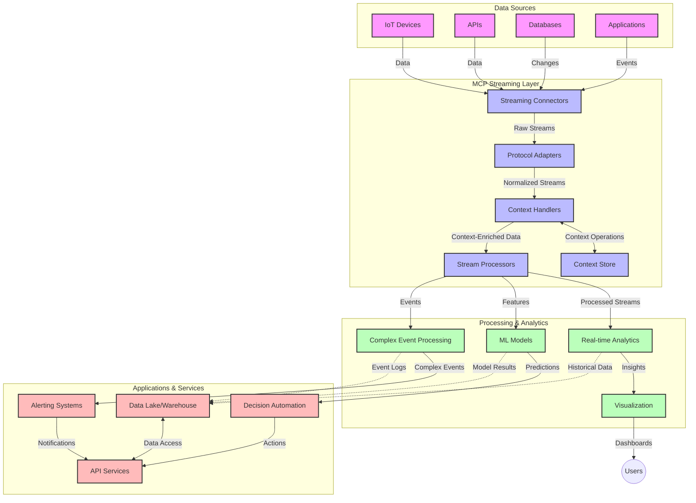

<!--
CO_OP_TRANSLATOR_METADATA:
{
  "original_hash": "68c518dbff8a3b127ed2aa934054c56c",
  "translation_date": "2025-06-11T17:11:07+00:00",
  "source_file": "05-AdvancedTopics/mcp-realtimestreaming/README.md",
  "language_code": "br"
}
-->
# Model Context Protocol evit Data Streaming e Real-Time

## Diskrivadur

Data streaming e real-time en deus deuet un doare pouezus er bed liammet gant roadennoù hiziv an deiz, ma vez ezhomm gant embregerezhioù hag arventennoù da gaout daveoù dremenet evit ober diouzh ur prantad berr. Ar Model Context Protocol (MCP) a zo ur gwellañ kemmadenn evit optimelezh ar prosesoù streaming e real-time, o kreskiñ efedusted ar c’hinnig daveoù, derc’hel da dalvoudegezh ar c’henlabour, ha gwellaat berzh ar systemezhioù a-bezh.

Ar modul-mañ a studia penaos MCP a cheñch ar streaming e real-time dre un hentenn arouezel evit mererezh ar c’henlabour etre modeloù AI, ploennoù streaming ha arventennoù.

## Degemer da Data Streaming e Real-Time

Data streaming e real-time zo ur patrom teknologel a ro an tu da dremen, prosesañ ha analizañ daveoù en un doare padus hag e-pad ma vez savet anezho, o reiñ tu d’ar systemezhioù da respont buan d’ar roadennoù nevez. Disheñvel da prosesadenn batch kozh a labour war roadennoù staget, ar streaming a labour war daveoù en un doare padus hag e-pad ma tremen an daveoù, o reiñ gouiziegezhioù ha obererezhioù gant un nebeud a amzer.

### Notennoù pouezus diwar-benn data streaming e real-time :

- **Douradenn padus a daveoù** : Ar data a vez proseset evel ur douradenn padus, hep gouzout fin, eus darvoudoù pe roadennoù.
- **Prosesadenn bihan-amm** : Ar systemezhioù a zo krouet evit lemel ar prantad etre krouidigezh ha prosesadenn an daveoù.
- **Eskalabilite** : Ar c’henderc’hel streaming a rank gallout ober gant volumoù ha buanentez daveoù a-vicher.
- **Dizoberiezh** : Ar systemezhioù a rank bezañ dizober evit mirout ar c’hourvezh daveoù hep distrujañ.
- **Prosesadenn statel** : Derc’hel da dalvoudegezh etre darvoudoù zo pouezus evit un analizañ kentus.

### Ar Model Context Protocol ha Streaming e Real-Time

Ar Model Context Protocol (MCP) a laka war wel meur a draioù pouezus e live streaming e real-time :

1. **Kenderc’hel ar C’henlabour** : MCP a stardardezi penaos e vez dalc’het ar c’henlabour etre ar c’homponantoù streaming distroet, o suraat e c’hall modeloù AI hag ar c’hlevedoù prosesañ kaout an tu d’ar c’henlabour istoriel ha en un doare endroel.

2. **Mererezh stat efedus** : Dre reiñ mekanismoù struktezet evit kas ar c’henlabour, MCP a laka ar mererezh stat da vont gant nebeutoc’h a dremen.

3. **Interoperabilite** : MCP a krou ur yezh boutin evit kenderc’hel ar c’henlabour etre ar technologiezhioù streaming liesseurt ha modeloù AI, o reiñ tu da struktoù muioc’h a bouton ha brasaat.

4. **Context optimelet evit streaming** : Implijadennoù MCP a c’hall lakaat an elfennoù c’henlabour pouezusañ da vont e penn d’ar divizoù e real-time, o optimelezh evit berzh ha resisder.

5. **Prosesadenn adaptivel** : Dre mererezh mat ar c’henlabour dre MCP, ar systemezhioù streaming a c’hall cheñch o doare labour hervez ar c’hondisionoù ha patromoù en daveoù.

Er raktresoù hiziv, eus rouedad sensor IoT betek ploennoù marc’had-mat, kevreañ MCP gant ar technologiezhioù streaming a ro lañs d’ur prosesadenn klok ha liammet gant ar c’henlabour evit respont mat d’ar situadoù keuziet ha cheñchet e real-time.

## Palioù ar C’hoariva

A-benn echuiñ ar c’hoariva-mañ, e c’hallit :

- Kompren an diazezioù ha kalz a draoù diazez evit data streaming e real-time
- Deskriva penaos ar Model Context Protocol (MCP) a well ar streaming e real-time
- Implijout ar MCP evit raktresoù streaming gant ar froud-frameworkoù brudet evel Kafka ha Pulsar
- Krouiñ ha lakaat e pleustr ar c’henderc’hel streaming a zo dizober ha berzhus gant MCP
- Implijout ar c’henlabour MCP evit IoT, marc’had-mat hag analytics dre AI
- Prizia ar c’hemmadoù nevez ha diorren an dazont e technologiezhioù streaming MCP

### Difinioù ha pouez

Data streaming e real-time a vod da zisplegañ ar produiñ, prosesañ ha kas daveoù gant bihan-amm. Disheñvel da prosesadenn batch, ma vez kaset ha proseset ar roadennoù e roadoù, ar streaming a proses an daveoù en un doare disterañ pa vez erru.

Ar c’houlennoù pouezus evit data streaming e real-time :

- **Bihan-amm** : Prosesañ ha analizañ daveoù e-pad ur prantad meur a milisekond pe e-pad ur nebeud eilenn
- **Douradenn padus** : Douradoù daveoù hep distrujañ eus meur a fennad
- **Prosesadenn diouzhtu** : Analis daveoù pa erru, hep mont da roadoù
- **Stummad darvoudoù** : Respont da darvoudoù pa vezont

### Kalz a draoù diazez e streaming data kozh

Ar hentadoù streaming kozh a gav kalz a diazezioù :

1. **Kollet ar c’henlabour** : Diazez da derc’hel ar c’henlabour etre ar systemezhioù distroet
2. **Kudennoù eskalabilite** : Kudennoù da eskalañ evit ober gant roadennoù bras ha buan
3. **Kudennoù kevreañ** : Kudennoù d’interoperabilite etre systemezhioù disheñvel
4. **Mererezh an amzer bihan** : Kenderc’hel etre an aotrezh ha amzer prosesadenn
5. **Konsistans ar data** : Surentez an daveoù ha pep tra er streaming

## Kompren ar Model Context Protocol (MCP)

### Petra eo MCP?

Ar Model Context Protocol (MCP) zo ur protokol kevreañ stardardet evit aesaat an darempred efedus etre modeloù AI ha arventennoù. Er streaming e real-time, MCP a ro ur frañsenn evit :

- Derc’hel ar c’henlabour dre ar pipeline daveoù
- Stardardezi ar furmad kas daveoù
- Optimelezh kas roadennoù bras
- Gwellaat darempredoù model-modell ha model-arventennoù

### Elfennou kentañ ha arhitektur

Arhitektur MCP evit streaming e real-time a zo bet krouet gant elfennou pouezus :

1. **Menedourien ar C’henlabour** : Mererezh ha derc’hel ar c’henlabour dre ar pipeline streaming
2. **Proseserien ar Streaming** : Prosesañ ar douradoù daveoù o implijout teknikoù gouestlet da arver ar c’henlabour
3. **Adapteroù ar Protokol** : Kemm etre protokoloù streaming disheñvel en deroù da derc’hel ar c’henlabour
4. **Stordenn ar C’henlabour** : Mererezh efedus ha dastum ar c’henlabour
5. **Konnektourien Streaming** : Kevreañ gant ploennoù streaming disheñvel (Kafka, Pulsar, Kinesis, hag all)



### Penaos MCP a well ar mererezh daveoù e real-time

MCP a respont d’ar c’hudennoù kozh e streaming dre :

- **Dalvoudegezh ar C’henlabour** : Derc’hel ar c’henlabour etre ar roadennoù daveoù en ur pipeline a-bezh
- **Kas optimelet** : Dilemel ar c’hoarierien e traoù dre mererezh efedus ar c’henlabour
- **Interfacoù stardardet** : Roiñ APIoù emdro evit ar c’homponantoù streaming
- **Bihan-amm** : Lezel ar procesadenn hep mervel dre mererezh efedus ar c’henlabour
- **Eskalabilite krec’hus** : Kenderc’hel ar skala dre ar c’henlabour

## Kevreañ ha Lakaat e Pleustr

Ar systemezhioù streaming e real-time a c’houlenn ur c’huzh arhitekturel ha lakaat e pleustr evit derc’hel berzh ha dalvoudegezh ar c’henlabour. Ar Model Context Protocol a ro ur hentenn stardard evit kevreañ modeloù AI ha teknologiezhioù streaming, o reiñ tu da pipelineoù prosesadenn klok ha liammet gant ar c’henlabour.

### Diskrivadur kevreañ MCP e struktoù streaming

Implijout MCP en endroioù streaming e real-time a c’houlenn meur a dra :

1. **Seriañ ar C’henlabour ha kas** : MCP a ro mekanismoù efedus evit enkodañ ar c’henlabour en douradoù daveoù, o suraat e c’hall ar c’henlabour heuliañ an daveoù dre an holl pipeline. En em gaver furmadoù seriañ stardardet optimelet evit kas streaming.

2. **Prosesadenn statel streaming** : MCP a ro tu da procesañ statel gant un doare klok dre derc’hel ar c’henlabour en ur mod keodedel etre ar c’hlevedoù. Pouezus e vez evit arhitekturoù distroet streaming ma vez diazez mererezh ar stat.

3. **Amzer darvoudoù vs Amzer prosesadenn** : Implijadennoù MCP a rank respont d’ar c’hudennoù boutin evit disheñvelaat pa oa bet ar darvoudoù ha pa vezont proceset. Ar protokol a c’hall lakaat ar c’henlabour amzerel evit derc’hel ar semantikenn eus amzer darvoudoù.

4. **Mererezh Backpressure** : Dre stardardaat mererezh ar c’henlabour, MCP a sikour da merañ backpressure e systemezhioù streaming, o reiñ tu d’ar c’homponantoù da embann o galloudoù prosesañ ha cheñch an douradenn hervez-se.

5. **Fenetriñ ar C’henlabour ha agregadur** : MCP a laka an tu da ober gant fenestroù ha reprizioù klok dre reiñ ur strukter arouezel eus ar c’henlabour amzerel ha darempredel, evit agregadoù muioc’h a dalvoudegezh war ar douradoù darvoudoù.

6. **Prosesadenn Exactly-Once** : En systemezhioù streaming o klask bezañ sur eus ar prosesadenn unan-ha-unan, MCP a c’hall laka metadonnezhioù prosesadenn evit heuliañ ha gwiriañ stat ar prosesadenn etre ar c’hlevedoù distroet.

Implijout MCP en un nebeud a teknologiioù streaming a grou ur hentenn unanet evit mererezh ar c’henlabour, o lakaat da bellgargañ ar c’hod kevreañ ha gwellaat ar galloudoù da derc’hel ar c’henlabour kentoc’h ma tremen ar data dre ar pipeline.

### MCP en Fraameworkoù Streaming Disheñvel

MCP a c’hall bezañ kevreet gant ar frameworkoù streaming brudet, en o zouez :

#### Kevreañ Apache Kafka

```python
from mcp_streaming import MCPKafkaConnector

# Initialize MCP Kafka connector
connector = MCPKafkaConnector(
    bootstrap_servers='localhost:9092',
    context_preservation=True
)

# Create a context-aware consumer
consumer = connector.create_consumer('input-topic')

# Process streaming data with context
for message in consumer:
    context = message.get_context()
    data = message.get_value()
    
    # Process with context awareness
    result = process_with_context(data, context)
    
    # Produce output with preserved context
    connector.produce('output-topic', result, context=context)
```

#### Implijadennoù Apache Pulsar

```python
from mcp_streaming import MCPPulsarClient

# Initialize MCP Pulsar client
client = MCPPulsarClient('pulsar://localhost:6650')

# Subscribe with context awareness
consumer = client.subscribe('input-topic', 'subscription-name', 
                           context_enabled=True)

# Process messages with context preservation
while True:
    message = consumer.receive()
    context = message.get_context()
    
    # Process with context
    result = process_with_context(message.data(), context)
    
    # Acknowledge the message
    consumer.acknowledge(message)
    
    # Send result with preserved context
    producer = client.create_producer('output-topic')
    producer.send(result, context=context)
```

### Reolennoù Gwell evit Lakaat e Pleustr

Pa implijit MCP evit streaming e real-time :

1. **Krouiñ evit dizoberiezh** :
   - Implijout mererezh fazioù mat
   - Ober gant ur rouedenn dead-letter evit ar c’homzoù fall
   - Krouiñ proseserien idempotent

2. **Optimelezh evit berzh** :
   - Krouiñ lec’hioù bufer a-feson
   - Implijout batchoù pa vez ezhomm
   - Lakaat mekanismoù backpressure

3. **Monitorañ ha sellet ouzh an traoù** :
   - Heuliañ metrikoù prosesadenn streaming
   - Sellet ouzh an diskoulmoù ar c’henlabour
   - Krouiñ alerter evit traou disheñvel

4. **Sikour ho douradoù** :
   - Implijout enkoderezh evit daveoù kuzhet
   - Implijout autentifikadur ha gwiriekadur
   - Lakaat kontroloù dazont mat

### MCP en IoT ha Edge Computing

MCP a well streaming IoT dre :

- Derc’hel ar c’henlabour eus ar c’huzhier betek ar pipeline
- Reiñ tu da streaming data efedus etre an edge ha cloud
- Kenderc’hel analytics e real-time war daveoù IoT
- Gwellaat darempredoù etre ar c’huzhierien gant ar c’henlabour

Meskouer : Rouedad Sensorioù Kêr Smart
```
Sensors → Edge Gateways → MCP Stream Processors → Real-time Analytics → Automated Responses
```

### Roll e Marc’had-Mat ha Marc’had-Mat a Buaned

MCP a ro talvoudegezhioù bras evit streaming daveoù marc’had-mat :

- Prosesadenn bihan-amm evit divizoù marc’had
- Derc’hel ar c’henlabour marc’had a-bezh
- Gwellaat prosesadenn darvoudoù keuziet gant ar c’henlabour
- Surentez ar data e systemezhioù marc’had distroet

### Gwellaat Analytics dre AI

MCP a krou trawalc’h evit analytics streaming :

- Ober gant kinnig modeloù e real-time ha ober gant ar modeloù
- Deskiñ en ur mod padus dre streaming
- Trec’hiñ ar c’henlabour evit dielfennañ ar c’henlabour
- Pipelineoù inference lies-modelloù gant ar c’henlabour dalc’het

## Dielloù ha Diorren

### Dielloù MCP e Liveoù Real-Time

E dazont, MCP a c’hallo :

- Kevreañ gant kompwterezh quantam : prederiañ evit systemezhioù streaming quantam
- Prosesadenn naturel war ar Edge : mont gant ar c’henlabour da labourat war an edge
- Mererezh streaming emziviz : pipelineoù streaming a ziskouez o-unan o gwellañ
- Streaming federet : prosesadenn distroet o derc’hel ar gizelerezh

### Diorren teknologel a zeu

Teknologiezhioù nevez a vo pouezus evit MCP :

1. **Protokoloù streaming optimelet evit AI** : protokoloù krouet evit ar c’hargoù AI
2. **Kevreañ neuromorfek** : komputerezh skignet ouzh spered ar spered evit streaming
3. **Streaming serverless** : streaming krouet war darvoudoù, eskaladek hep mererezh infrastrukur
4. **Stordenn c’henlabour distroet** : mererezh c’henlabour distroet ha sur

## Praktikoù

### Praktik 1 : Krouiñ ur Pipeline Streaming MCP diazez

Er praktik-mañ e c’hallit :

- Krouiñ un endro streaming MCP diazez
- Implijout menedourien ar c’henlabour evit prosesañ ar douradoù
- Klask ha gwiriañ e vez derc’hel ar c’henlabour

### Praktik 2 : Krouiñ ur dashboard analytics e real-time

Krouit un arventenn klok a :

- Degas daveoù streaming dre MCP
- Prosesañ ar streaming gant dalvoudegezh ar c’henlabour
- Diskouez an disoc’hoù e real-time

### Praktik 3 : Implijout prosesadenn darvoudoù keuziet gant MCP

Praktik a-live a gas :

- Dizoleiñ patromoù en ar douradoù
- Kenderc’hel ar c’henlabour etre meur a streaming
- Krouiñ darvoudoù keuziet gant ar c’henlabour dalc’het

## Mignoned evit Kenderc’hel

- [Model Context Protocol Specification](https://github.com/microsoft/model-context-protocol) - MCP resis ha teulioù
- [Apache Kafka Documentation](https://kafka.apache.org/documentation/) - Deskiñ Kafka evit prosesadenn streaming
- [Apache Pulsar](https://pulsar.apache.org/) - Pladenn unanet evit kemer ha streaming
- [Streaming Systems: The What, Where, When, and How of Large-Scale Data Processing](https://www.oreilly.com/library/view/streaming-systems/9781491983867/) - Levr ledan diwar-benn ar struktoù streaming
- [Microsoft Azure Event Hubs](https://learn.microsoft.com/en-us/azure/event-hubs/event-hubs-about) - Servij streaming evned meret
- [MLflow Documentation](https://mlflow.org/docs/latest/index.html) - Evit heuliañ ha lakaat e pleustr modelo

**Aviso Legal**:  
Este documento foi traduzido utilizando o serviço de tradução automática [Co-op Translator](https://github.com/Azure/co-op-translator). Embora nos esforcemos para garantir a precisão, esteja ciente de que traduções automáticas podem conter erros ou imprecisões. O documento original em seu idioma nativo deve ser considerado a fonte oficial. Para informações críticas, recomenda-se a tradução profissional realizada por humanos. Não nos responsabilizamos por quaisquer mal-entendidos ou interpretações incorretas decorrentes do uso desta tradução.