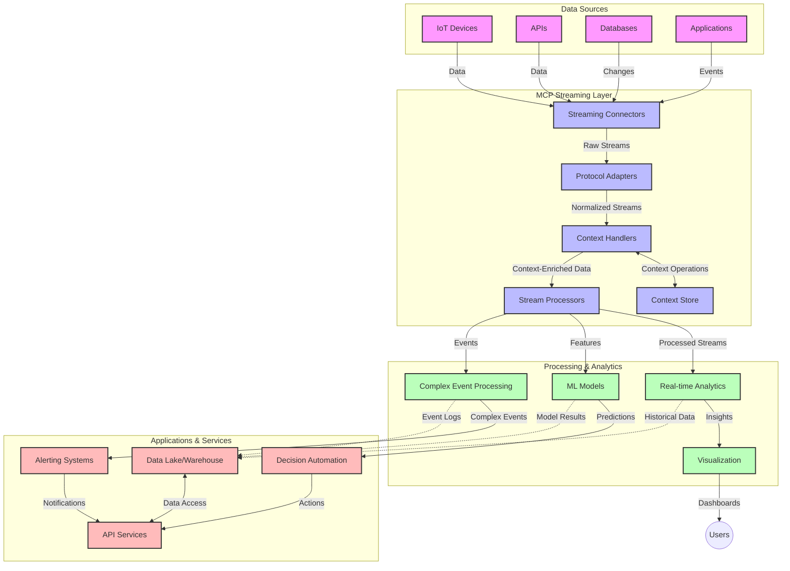

<!--
CO_OP_TRANSLATOR_METADATA:
{
  "original_hash": "195f7287638b77a549acadd96c8f981c",
  "translation_date": "2025-07-14T01:38:04+00:00",
  "source_file": "05-AdvancedTopics/mcp-realtimestreaming/README.md",
  "language_code": "br"
}
-->
# Protocolo de Contexto de Modelo para Streaming de Dados em Tempo Real

## Visão Geral

O streaming de dados em tempo real tornou-se essencial no mundo orientado a dados de hoje, onde empresas e aplicações precisam de acesso imediato às informações para tomar decisões rápidas. O Protocolo de Contexto de Modelo (MCP) representa um avanço significativo na otimização desses processos de streaming em tempo real, melhorando a eficiência do processamento de dados, mantendo a integridade contextual e aprimorando o desempenho geral do sistema.

Este módulo explora como o MCP transforma o streaming de dados em tempo real ao fornecer uma abordagem padronizada para o gerenciamento de contexto entre modelos de IA, plataformas de streaming e aplicações.

## Introdução ao Streaming de Dados em Tempo Real

O streaming de dados em tempo real é um paradigma tecnológico que permite a transferência, processamento e análise contínuos dos dados à medida que são gerados, possibilitando que os sistemas reajam imediatamente a novas informações. Diferente do processamento em lote tradicional, que opera sobre conjuntos de dados estáticos, o streaming processa dados em movimento, entregando insights e ações com latência mínima.

### Conceitos Fundamentais do Streaming de Dados em Tempo Real:

- **Fluxo Contínuo de Dados**: Os dados são processados como um fluxo contínuo e interminável de eventos ou registros.
- **Processamento de Baixa Latência**: Os sistemas são projetados para minimizar o tempo entre a geração e o processamento dos dados.
- **Escalabilidade**: Arquiteturas de streaming devem lidar com volumes e velocidades variáveis de dados.
- **Tolerância a Falhas**: Os sistemas precisam ser resilientes a falhas para garantir o fluxo ininterrupto de dados.
- **Processamento Stateful**: Manter o contexto entre eventos é crucial para análises significativas.

### O Protocolo de Contexto de Modelo e o Streaming em Tempo Real

O Protocolo de Contexto de Modelo (MCP) aborda vários desafios críticos em ambientes de streaming em tempo real:

1. **Continuidade Contextual**: O MCP padroniza como o contexto é mantido entre componentes distribuídos de streaming, garantindo que modelos de IA e nós de processamento tenham acesso ao contexto histórico e ambiental relevante.

2. **Gerenciamento Eficiente de Estado**: Ao fornecer mecanismos estruturados para a transmissão de contexto, o MCP reduz a sobrecarga do gerenciamento de estado em pipelines de streaming.

3. **Interoperabilidade**: O MCP cria uma linguagem comum para o compartilhamento de contexto entre tecnologias de streaming diversas e modelos de IA, permitindo arquiteturas mais flexíveis e extensíveis.

4. **Contexto Otimizado para Streaming**: Implementações do MCP podem priorizar quais elementos de contexto são mais relevantes para a tomada de decisão em tempo real, otimizando tanto o desempenho quanto a precisão.

5. **Processamento Adaptativo**: Com o gerenciamento adequado de contexto via MCP, sistemas de streaming podem ajustar dinamicamente o processamento com base em condições e padrões em evolução nos dados.

Em aplicações modernas que vão desde redes de sensores IoT até plataformas financeiras de negociação, a integração do MCP com tecnologias de streaming possibilita um processamento mais inteligente e consciente do contexto, capaz de responder adequadamente a situações complexas e em constante mudança em tempo real.

## Objetivos de Aprendizagem

Ao final desta lição, você será capaz de:

- Compreender os fundamentos do streaming de dados em tempo real e seus desafios
- Explicar como o Protocolo de Contexto de Modelo (MCP) aprimora o streaming de dados em tempo real
- Implementar soluções de streaming baseadas em MCP usando frameworks populares como Kafka e Pulsar
- Projetar e implantar arquiteturas de streaming tolerantes a falhas e de alto desempenho com MCP
- Aplicar conceitos do MCP em casos de uso de IoT, negociação financeira e análises orientadas por IA
- Avaliar tendências emergentes e inovações futuras em tecnologias de streaming baseadas em MCP

### Definição e Importância

O streaming de dados em tempo real envolve a geração, processamento e entrega contínuos de dados com latência mínima. Diferente do processamento em lote, onde os dados são coletados e processados em grupos, o streaming processa os dados incrementalmente à medida que chegam, permitindo insights e ações imediatas.

Características principais do streaming de dados em tempo real incluem:

- **Baixa Latência**: Processamento e análise dos dados em milissegundos a segundos
- **Fluxo Contínuo**: Fluxos ininterruptos de dados provenientes de várias fontes
- **Processamento Imediato**: Análise dos dados conforme chegam, e não em lotes
- **Arquitetura Orientada a Eventos**: Resposta a eventos conforme ocorrem

### Desafios no Streaming de Dados Tradicional

Abordagens tradicionais de streaming enfrentam várias limitações:

1. **Perda de Contexto**: Dificuldade em manter o contexto em sistemas distribuídos
2. **Problemas de Escalabilidade**: Desafios para escalar e lidar com dados de alto volume e alta velocidade
3. **Complexidade de Integração**: Problemas de interoperabilidade entre sistemas diferentes
4. **Gerenciamento de Latência**: Equilibrar throughput com tempo de processamento
5. **Consistência dos Dados**: Garantir precisão e completude dos dados ao longo do fluxo

## Entendendo o Protocolo de Contexto de Modelo (MCP)

### O que é MCP?

O Protocolo de Contexto de Modelo (MCP) é um protocolo de comunicação padronizado projetado para facilitar a interação eficiente entre modelos de IA e aplicações. No contexto do streaming de dados em tempo real, o MCP oferece um framework para:

- Preservar o contexto ao longo do pipeline de dados
- Padronizar formatos de troca de dados
- Otimizar a transmissão de grandes conjuntos de dados
- Melhorar a comunicação entre modelos e entre modelos e aplicações

### Componentes Principais e Arquitetura

A arquitetura do MCP para streaming em tempo real consiste em vários componentes-chave:

1. **Gerenciadores de Contexto**: Administram e mantêm informações contextuais ao longo do pipeline de streaming
2. **Processadores de Stream**: Processam fluxos de dados de entrada usando técnicas conscientes do contexto
3. **Adaptadores de Protocolo**: Convertem entre diferentes protocolos de streaming preservando o contexto
4. **Armazenamento de Contexto**: Armazena e recupera informações contextuais de forma eficiente
5. **Conectores de Streaming**: Conectam a diversas plataformas de streaming (Kafka, Pulsar, Kinesis, etc.)



### Como o MCP Melhora o Manuseio de Dados em Tempo Real

O MCP resolve desafios tradicionais do streaming por meio de:

- **Integridade Contextual**: Mantém relações entre pontos de dados ao longo de todo o pipeline
- **Transmissão Otimizada**: Reduz redundâncias na troca de dados por meio de gerenciamento inteligente de contexto
- **Interfaces Padronizadas**: Fornece APIs consistentes para componentes de streaming
- **Redução de Latência**: Minimiza a sobrecarga de processamento com manejo eficiente do contexto
- **Escalabilidade Aprimorada**: Suporta escalonamento horizontal preservando o contexto

## Integração e Implementação

Sistemas de streaming de dados em tempo real exigem um design arquitetural cuidadoso para manter tanto o desempenho quanto a integridade contextual. O Protocolo de Contexto de Modelo oferece uma abordagem padronizada para integrar modelos de IA e tecnologias de streaming, permitindo pipelines de processamento mais sofisticados e conscientes do contexto.

### Visão Geral da Integração do MCP em Arquiteturas de Streaming

Implementar o MCP em ambientes de streaming em tempo real envolve várias considerações importantes:

1. **Serialização e Transporte de Contexto**: O MCP fornece mecanismos eficientes para codificar informações contextuais dentro dos pacotes de dados de streaming, garantindo que o contexto essencial acompanhe os dados durante todo o pipeline de processamento. Isso inclui formatos de serialização padronizados otimizados para transporte em streaming.

2. **Processamento Stateful de Stream**: O MCP possibilita um processamento stateful mais inteligente ao manter uma representação consistente do contexto entre os nós de processamento. Isso é especialmente valioso em arquiteturas distribuídas de streaming, onde o gerenciamento de estado é tradicionalmente desafiador.

3. **Tempo do Evento vs. Tempo de Processamento**: Implementações do MCP em sistemas de streaming devem lidar com o desafio comum de diferenciar quando os eventos ocorreram e quando são processados. O protocolo pode incorporar contexto temporal que preserva a semântica do tempo do evento.

4. **Gerenciamento de Backpressure**: Ao padronizar o manejo do contexto, o MCP ajuda a gerenciar o backpressure em sistemas de streaming, permitindo que os componentes comuniquem suas capacidades de processamento e ajustem o fluxo conforme necessário.

5. **Janela de Contexto e Agregação**: O MCP facilita operações de janela mais sofisticadas ao fornecer representações estruturadas de contextos temporais e relacionais, permitindo agregações mais significativas em fluxos de eventos.

6. **Processamento Exactly-Once**: Em sistemas de streaming que exigem semânticas exactly-once, o MCP pode incorporar metadados de processamento para ajudar a rastrear e verificar o status do processamento entre componentes distribuídos.

A implementação do MCP em diversas tecnologias de streaming cria uma abordagem unificada para o gerenciamento de contexto, reduzindo a necessidade de códigos de integração personalizados e aumentando a capacidade do sistema de manter um contexto significativo conforme os dados fluem pelo pipeline.

### MCP em Diversos Frameworks de Streaming de Dados

Estes exemplos seguem a especificação atual do MCP, que foca em um protocolo baseado em JSON-RPC com mecanismos de transporte distintos. O código demonstra como implementar transportes personalizados que integram plataformas de streaming como Kafka e Pulsar, mantendo total compatibilidade com o protocolo MCP.

Os exemplos foram elaborados para mostrar como plataformas de streaming podem ser integradas ao MCP para fornecer processamento de dados em tempo real, preservando a consciência contextual que é central para o MCP. Essa abordagem garante que os exemplos reflitam com precisão o estado atual da especificação MCP em junho de 2025.

O MCP pode ser integrado a frameworks populares de streaming, incluindo:

#### Integração com Apache Kafka

```python
import asyncio
import json
from typing import Dict, Any, Optional
from confluent_kafka import Consumer, Producer, KafkaError
from mcp.client import Client, ClientCapabilities
from mcp.core.message import JsonRpcMessage
from mcp.core.transports import Transport

# Custom transport class to bridge MCP with Kafka
class KafkaMCPTransport(Transport):
    def __init__(self, bootstrap_servers: str, input_topic: str, output_topic: str):
        self.bootstrap_servers = bootstrap_servers
        self.input_topic = input_topic
        self.output_topic = output_topic
        self.producer = Producer({'bootstrap.servers': bootstrap_servers})
        self.consumer = Consumer({
            'bootstrap.servers': bootstrap_servers,
            'group.id': 'mcp-client-group',
            'auto.offset.reset': 'earliest'
        })
        self.message_queue = asyncio.Queue()
        self.running = False
        self.consumer_task = None
        
    async def connect(self):
        """Connect to Kafka and start consuming messages"""
        self.consumer.subscribe([self.input_topic])
        self.running = True
        self.consumer_task = asyncio.create_task(self._consume_messages())
        return self
        
    async def _consume_messages(self):
        """Background task to consume messages from Kafka and queue them for processing"""
        while self.running:
            try:
                msg = self.consumer.poll(1.0)
                if msg is None:
                    await asyncio.sleep(0.1)
                    continue
                
                if msg.error():
                    if msg.error().code() == KafkaError._PARTITION_EOF:
                        continue
                    print(f"Consumer error: {msg.error()}")
                    continue
                
                # Parse the message value as JSON-RPC
                try:
                    message_str = msg.value().decode('utf-8')
                    message_data = json.loads(message_str)
                    mcp_message = JsonRpcMessage.from_dict(message_data)
                    await self.message_queue.put(mcp_message)
                except Exception as e:
                    print(f"Error parsing message: {e}")
            except Exception as e:
                print(f"Error in consumer loop: {e}")
                await asyncio.sleep(1)
    
    async def read(self) -> Optional[JsonRpcMessage]:
        """Read the next message from the queue"""
        try:
            message = await self.message_queue.get()
            return message
        except Exception as e:
            print(f"Error reading message: {e}")
            return None
    
    async def write(self, message: JsonRpcMessage) -> None:
        """Write a message to the Kafka output topic"""
        try:
            message_json = json.dumps(message.to_dict())
            self.producer.produce(
                self.output_topic,
                message_json.encode('utf-8'),
                callback=self._delivery_report
            )
            self.producer.poll(0)  # Trigger callbacks
        except Exception as e:
            print(f"Error writing message: {e}")
    
    def _delivery_report(self, err, msg):
        """Kafka producer delivery callback"""
        if err is not None:
            print(f'Message delivery failed: {err}')
        else:
            print(f'Message delivered to {msg.topic()} [{msg.partition()}]')
    
    async def close(self) -> None:
        """Close the transport"""
        self.running = False
        if self.consumer_task:
            self.consumer_task.cancel()
            try:
                await self.consumer_task
            except asyncio.CancelledError:
                pass
        self.consumer.close()
        self.producer.flush()

# Example usage of the Kafka MCP transport
async def kafka_mcp_example():
    # Create MCP client with Kafka transport
    client = Client(
        {"name": "kafka-mcp-client", "version": "1.0.0"},
        ClientCapabilities({})
    )
    
    # Create and connect the Kafka transport
    transport = KafkaMCPTransport(
        bootstrap_servers="localhost:9092",
        input_topic="mcp-responses",
        output_topic="mcp-requests"
    )
    
    await client.connect(transport)
    
    try:
        # Initialize the MCP session
        await client.initialize()
        
        # Example of executing a tool via MCP
        response = await client.execute_tool(
            "process_data",
            {
                "data": "sample data",
                "metadata": {
                    "source": "sensor-1",
                    "timestamp": "2025-06-12T10:30:00Z"
                }
            }
        )
        
        print(f"Tool execution response: {response}")
        
        # Clean shutdown
        await client.shutdown()
    finally:
        await transport.close()

# Run the example
if __name__ == "__main__":
    asyncio.run(kafka_mcp_example())
```

#### Implementação com Apache Pulsar

```python
import asyncio
import json
import pulsar
from typing import Dict, Any, Optional
from mcp.core.message import JsonRpcMessage
from mcp.core.transports import Transport
from mcp.server import Server, ServerOptions
from mcp.server.tools import Tool, ToolExecutionContext, ToolMetadata

# Create a custom MCP transport that uses Pulsar
class PulsarMCPTransport(Transport):
    def __init__(self, service_url: str, request_topic: str, response_topic: str):
        self.service_url = service_url
        self.request_topic = request_topic
        self.response_topic = response_topic
        self.client = pulsar.Client(service_url)
        self.producer = self.client.create_producer(response_topic)
        self.consumer = self.client.subscribe(
            request_topic,
            "mcp-server-subscription",
            consumer_type=pulsar.ConsumerType.Shared
        )
        self.message_queue = asyncio.Queue()
        self.running = False
        self.consumer_task = None
    
    async def connect(self):
        """Connect to Pulsar and start consuming messages"""
        self.running = True
        self.consumer_task = asyncio.create_task(self._consume_messages())
        return self
    
    async def _consume_messages(self):
        """Background task to consume messages from Pulsar and queue them for processing"""
        while self.running:
            try:
                # Non-blocking receive with timeout
                msg = self.consumer.receive(timeout_millis=500)
                
                # Process the message
                try:
                    message_str = msg.data().decode('utf-8')
                    message_data = json.loads(message_str)
                    mcp_message = JsonRpcMessage.from_dict(message_data)
                    await self.message_queue.put(mcp_message)
                    
                    # Acknowledge the message
                    self.consumer.acknowledge(msg)
                except Exception as e:
                    print(f"Error processing message: {e}")
                    # Negative acknowledge if there was an error
                    self.consumer.negative_acknowledge(msg)
            except Exception as e:
                # Handle timeout or other exceptions
                await asyncio.sleep(0.1)
    
    async def read(self) -> Optional[JsonRpcMessage]:
        """Read the next message from the queue"""
        try:
            message = await self.message_queue.get()
            return message
        except Exception as e:
            print(f"Error reading message: {e}")
            return None
    
    async def write(self, message: JsonRpcMessage) -> None:
        """Write a message to the Pulsar output topic"""
        try:
            message_json = json.dumps(message.to_dict())
            self.producer.send(message_json.encode('utf-8'))
        except Exception as e:
            print(f"Error writing message: {e}")
    
    async def close(self) -> None:
        """Close the transport"""
        self.running = False
        if self.consumer_task:
            self.consumer_task.cancel()
            try:
                await self.consumer_task
            except asyncio.CancelledError:
                pass
        self.consumer.close()
        self.producer.close()
        self.client.close()

# Define a sample MCP tool that processes streaming data
@Tool(
    name="process_streaming_data",
    description="Process streaming data with context preservation",
    metadata=ToolMetadata(
        required_capabilities=["streaming"]
    )
)
async def process_streaming_data(
    ctx: ToolExecutionContext,
    data: str,
    source: str,
    priority: str = "medium"
) -> Dict[str, Any]:
    """
    Process streaming data while preserving context
    
    Args:
        ctx: Tool execution context
        data: The data to process
        source: The source of the data
        priority: Priority level (low, medium, high)
        
    Returns:
        Dict containing processed results and context information
    """
    # Example processing that leverages MCP context
    print(f"Processing data from {source} with priority {priority}")
    
    # Access conversation context from MCP
    conversation_id = ctx.conversation_id if hasattr(ctx, 'conversation_id') else "unknown"
    
    # Return results with enhanced context
    return {
        "processed_data": f"Processed: {data}",
        "context": {
            "conversation_id": conversation_id,
            "source": source,
            "priority": priority,
            "processing_timestamp": ctx.get_current_time_iso()
        }
    }

# Example MCP server implementation using Pulsar transport
async def run_mcp_server_with_pulsar():
    # Create MCP server
    server = Server(
        {"name": "pulsar-mcp-server", "version": "1.0.0"},
        ServerOptions(
            capabilities={"streaming": True}
        )
    )
    
    # Register our tool
    server.register_tool(process_streaming_data)
    
    # Create and connect Pulsar transport
    transport = PulsarMCPTransport(
        service_url="pulsar://localhost:6650",
        request_topic="mcp-requests",
        response_topic="mcp-responses"
    )
    
    try:
        # Start the server with the Pulsar transport
        await server.run(transport)
    finally:
        await transport.close()

# Run the server
if __name__ == "__main__":
    asyncio.run(run_mcp_server_with_pulsar())
```

### Melhores Práticas para Implantação

Ao implementar o MCP para streaming em tempo real:

1. **Projete para Tolerância a Falhas**:
   - Implemente tratamento adequado de erros
   - Use filas dead-letter para mensagens com falha
   - Projete processadores idempotentes

2. **Otimize para Desempenho**:
   - Configure tamanhos de buffer apropriados
   - Utilize batching quando adequado
   - Implemente mecanismos de backpressure

3. **Monitore e Observe**:
   - Acompanhe métricas de processamento de stream
   - Monitore a propagação do contexto
   - Configure alertas para anomalias

4. **Garanta a Segurança dos Seus Streams**:
   - Implemente criptografia para dados sensíveis
   - Use autenticação e autorização
   - Aplique controles de acesso adequados

### MCP em IoT e Computação de Borda

O MCP aprimora o streaming em IoT ao:

- Preservar o contexto dos dispositivos ao longo do pipeline de processamento
- Permitir streaming eficiente de dados da borda para a nuvem
- Suportar análises em tempo real de fluxos de dados IoT
- Facilitar comunicação entre dispositivos com contexto

Exemplo: Redes de Sensores em Cidades Inteligentes  
```
Sensors → Edge Gateways → MCP Stream Processors → Real-time Analytics → Automated Responses
```

### Papel em Transações Financeiras e Negociação de Alta Frequência

O MCP oferece vantagens significativas para streaming de dados financeiros:

- Processamento de latência ultra baixa para decisões de negociação
- Manutenção do contexto da transação durante o processamento
- Suporte a processamento complexo de eventos com consciência contextual
- Garantia de consistência dos dados em sistemas de negociação distribuídos

### Aprimorando Análises de Dados Orientadas por IA

O MCP cria novas possibilidades para análises em streaming:

- Treinamento e inferência de modelos em tempo real
- Aprendizado contínuo a partir de dados em streaming
- Extração de características consciente do contexto
- Pipelines de inferência multi-modelo com contexto preservado

## Tendências Futuras e Inovações

### Evolução do MCP em Ambientes em Tempo Real

Olhando para o futuro, esperamos que o MCP evolua para abordar:

- **Integração com Computação Quântica**: Preparação para sistemas de streaming baseados em computação quântica
- **Processamento Nativo na Borda**: Transferir mais processamento consciente do contexto para dispositivos de borda
- **Gerenciamento Autônomo de Streams**: Pipelines de streaming auto-otimizáveis
- **Streaming Federado**: Processamento distribuído preservando a privacidade

### Avanços Potenciais em Tecnologia

Tecnologias emergentes que moldarão o futuro do streaming MCP:

1. **Protocolos de Streaming Otimizados para IA**: Protocolos personalizados para cargas de trabalho de IA
2. **Integração com Computação Neuromórfica**: Computação inspirada no cérebro para processamento de streams
3. **Streaming Serverless**: Streaming escalável e orientado a eventos sem gerenciamento de infraestrutura
4. **Armazenamentos de Contexto Distribuídos**: Gerenciamento de contexto globalmente distribuído e altamente consistente

## Exercícios Práticos

### Exercício 1: Configurando um Pipeline Básico de Streaming MCP

Neste exercício, você aprenderá a:  
- Configurar um ambiente básico de streaming MCP  
- Implementar gerenciadores de contexto para processamento de streams  
- Testar e validar a preservação do contexto

### Exercício 2: Construindo um Dashboard de Análise em Tempo Real

Crie uma aplicação completa que:  
- Ingesta dados em streaming usando MCP  
- Processa o fluxo mantendo o contexto  
- Visualiza resultados em tempo real

### Exercício 3: Implementando Processamento Complexo de Eventos com MCP

Exercício avançado que cobre:  
- Detecção de padrões em streams  
- Correlação contextual entre múltiplos streams  
- Geração de eventos complexos com contexto preservado

## Recursos Adicionais

- [Model Context Protocol Specification](https://github.com/modelcontextprotocol) - Especificação oficial e documentação do MCP  
- [Apache Kafka Documentation](https://kafka.apache.org/documentation/) - Aprenda sobre Kafka para processamento de streams  
- [Apache Pulsar](https://pulsar.apache.org/) - Plataforma unificada de mensagens e streaming  
- [Streaming Systems: The What, Where, When, and How of Large-Scale Data Processing](https://www.oreilly.com/library/view/streaming-systems/9781491983867/) - Livro abrangente sobre arquiteturas de streaming  
- [Microsoft Azure Event Hubs](https://learn.microsoft.com/azure/event-hubs/event-hubs-about) - Serviço gerenciado de streaming de eventos  
- [MLflow Documentation](https://mlflow.org/docs/latest/index.html) - Para rastreamento e implantação de modelos de ML  
- [Real-Time Analytics with Apache Storm](https://storm.apache.org/releases/current/index.html) - Framework para computação em tempo real  
- [Flink ML](https://nightlies.apache.org/flink/flink-ml-docs-master/) - Biblioteca de machine learning para Apache Flink  
- [LangChain Documentation](https://python.langchain.com/docs/get_started/introduction) - Construindo aplicações com LLMs

## Resultados de Aprendizagem

Ao concluir este módulo, você será capaz de:

- Compreender os fundamentos do streaming de dados em tempo real e seus desafios  
- Explicar como o Protocolo de Contexto de Modelo (MCP) aprimora o streaming de dados em tempo real  
- Implementar soluções de streaming baseadas em MCP usando frameworks populares como Kafka e Pulsar  
- Projetar e implantar arquiteturas de streaming tolerantes a falhas e de alto desempenho com MCP  
- Aplicar conceitos do MCP em casos de uso de IoT, negociação financeira e análises orientadas por IA  
- Avaliar tendências emergentes e inovações futuras em tecnologias de streaming baseadas em MCP

## Próximos passos

- [5.11 Realtime Search](../mcp-realtimesearch/README.md)

**Aviso Legal**:  
Este documento foi traduzido utilizando o serviço de tradução por IA [Co-op Translator](https://github.com/Azure/co-op-translator). Embora nos esforcemos para garantir a precisão, esteja ciente de que traduções automáticas podem conter erros ou imprecisões. O documento original em seu idioma nativo deve ser considerado a fonte autorizada. Para informações críticas, recomenda-se tradução profissional humana. Não nos responsabilizamos por quaisquer mal-entendidos ou interpretações incorretas decorrentes do uso desta tradução.