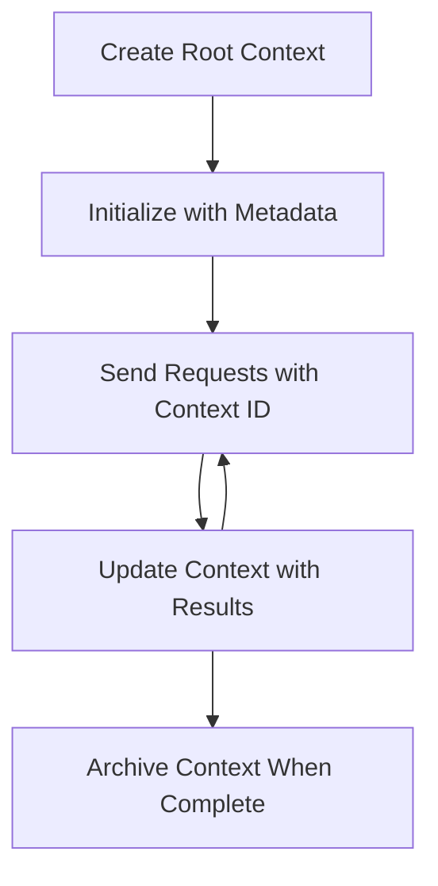

<!--
CO_OP_TRANSLATOR_METADATA:
{
  "original_hash": "ebdb86db46113f1cbd59ce4c74caaa79",
  "translation_date": "2025-07-17T01:05:29+00:00",
  "source_file": "05-AdvancedTopics/mcp-root-contexts/README.md",
  "language_code": "br"
}
-->
# MCP Root Contexts

Root contexts são um conceito fundamental no Model Context Protocol que fornecem uma camada persistente para manter o histórico da conversa e o estado compartilhado entre múltiplas requisições e sessões.

## Introdução

Nesta lição, vamos explorar como criar, gerenciar e utilizar root contexts no MCP.

## Objetivos de Aprendizagem

Ao final desta lição, você será capaz de:

- Compreender o propósito e a estrutura dos root contexts
- Criar e gerenciar root contexts usando as bibliotecas cliente do MCP
- Implementar root contexts em aplicações .NET, Java, JavaScript e Python
- Utilizar root contexts para conversas multi-turno e gerenciamento de estado
- Aplicar as melhores práticas para o gerenciamento de root contexts

## Entendendo Root Contexts

Root contexts funcionam como contêineres que armazenam o histórico e o estado de uma série de interações relacionadas. Eles possibilitam:

- **Persistência da Conversa**: Manter conversas coerentes em múltiplos turnos
- **Gerenciamento de Memória**: Armazenar e recuperar informações ao longo das interações
- **Gerenciamento de Estado**: Acompanhar o progresso em fluxos de trabalho complexos
- **Compartilhamento de Contexto**: Permitir que múltiplos clientes acessem o mesmo estado da conversa

No MCP, root contexts possuem as seguintes características principais:

- Cada root context tem um identificador único.
- Podem conter histórico da conversa, preferências do usuário e outros metadados.
- Podem ser criados, acessados e arquivados conforme necessário.
- Suportam controle de acesso e permissões detalhadas.

## Ciclo de Vida do Root Context



## Trabalhando com Root Contexts

Aqui está um exemplo de como criar e gerenciar root contexts.

### Implementação em C#

```csharp
// .NET Example: Root Context Management
using Microsoft.Mcp.Client;
using System;
using System.Threading.Tasks;
using System.Collections.Generic;

public class RootContextExample
{
    private readonly IMcpClient _client;
    private readonly IRootContextManager _contextManager;
    
    public RootContextExample(IMcpClient client, IRootContextManager contextManager)
    {
        _client = client;
        _contextManager = contextManager;
    }
    
    public async Task DemonstrateRootContextAsync()
    {
        // 1. Create a new root context
        var contextResult = await _contextManager.CreateRootContextAsync(new RootContextCreateOptions
        {
            Name = "Customer Support Session",
            Metadata = new Dictionary<string, string>
            {
                ["CustomerName"] = "Acme Corporation",
                ["PriorityLevel"] = "High",
                ["Domain"] = "Cloud Services"
            }
        });
        
        string contextId = contextResult.ContextId;
        Console.WriteLine($"Created root context with ID: {contextId}");
        
        // 2. First interaction using the context
        var response1 = await _client.SendPromptAsync(
            "I'm having issues scaling my web service deployment in the cloud.", 
            new SendPromptOptions { RootContextId = contextId }
        );
        
        Console.WriteLine($"First response: {response1.GeneratedText}");
        
        // Second interaction - the model will have access to the previous conversation
        var response2 = await _client.SendPromptAsync(
            "Yes, we're using containerized deployments with Kubernetes.", 
            new SendPromptOptions { RootContextId = contextId }
        );
        
        Console.WriteLine($"Second response: {response2.GeneratedText}");
        
        // 3. Add metadata to the context based on conversation
        await _contextManager.UpdateContextMetadataAsync(contextId, new Dictionary<string, string>
        {
            ["TechnicalEnvironment"] = "Kubernetes",
            ["IssueType"] = "Scaling"
        });
        
        // 4. Get context information
        var contextInfo = await _contextManager.GetRootContextInfoAsync(contextId);
        
        Console.WriteLine("Context Information:");
        Console.WriteLine($"- Name: {contextInfo.Name}");
        Console.WriteLine($"- Created: {contextInfo.CreatedAt}");
        Console.WriteLine($"- Messages: {contextInfo.MessageCount}");
        
        // 5. When the conversation is complete, archive the context
        await _contextManager.ArchiveRootContextAsync(contextId);
        Console.WriteLine($"Archived context {contextId}");
    }
}
```

No código acima, nós:

1. Criamos um root context para uma sessão de suporte ao cliente.
1. Enviamos múltiplas mensagens dentro desse contexto, permitindo que o modelo mantenha o estado.
1. Atualizamos o contexto com metadados relevantes baseados na conversa.
1. Recuperamos informações do contexto para entender o histórico da conversa.
1. Arquivamos o contexto quando a conversa foi concluída.

## Exemplo: Implementação de Root Context para análise financeira

Neste exemplo, vamos criar um root context para uma sessão de análise financeira, demonstrando como manter o estado em múltiplas interações.

### Implementação em Java

```java
// Java Example: Root Context Implementation
package com.example.mcp.contexts;

import com.mcp.client.McpClient;
import com.mcp.client.ContextManager;
import com.mcp.models.RootContext;
import com.mcp.models.McpResponse;

import java.util.HashMap;
import java.util.Map;
import java.util.UUID;

public class RootContextsDemo {
    private final McpClient client;
    private final ContextManager contextManager;
    
    public RootContextsDemo(String serverUrl) {
        this.client = new McpClient.Builder()
            .setServerUrl(serverUrl)
            .build();
            
        this.contextManager = new ContextManager(client);
    }
    
    public void demonstrateRootContext() throws Exception {
        // Create context metadata
        Map<String, String> metadata = new HashMap<>();
        metadata.put("projectName", "Financial Analysis");
        metadata.put("userRole", "Financial Analyst");
        metadata.put("dataSource", "Q1 2025 Financial Reports");
        
        // 1. Create a new root context
        RootContext context = contextManager.createRootContext("Financial Analysis Session", metadata);
        String contextId = context.getId();
        
        System.out.println("Created context: " + contextId);
        
        // 2. First interaction
        McpResponse response1 = client.sendPrompt(
            "Analyze the trends in Q1 financial data for our technology division",
            contextId
        );
        
        System.out.println("First response: " + response1.getGeneratedText());
        
        // 3. Update context with important information gained from response
        contextManager.addContextMetadata(contextId, 
            Map.of("identifiedTrend", "Increasing cloud infrastructure costs"));
        
        // Second interaction - using the same context
        McpResponse response2 = client.sendPrompt(
            "What's driving the increase in cloud infrastructure costs?",
            contextId
        );
        
        System.out.println("Second response: " + response2.getGeneratedText());
        
        // 4. Generate a summary of the analysis session
        McpResponse summaryResponse = client.sendPrompt(
            "Summarize our analysis of the technology division financials in 3-5 key points",
            contextId
        );
        
        // Store the summary in context metadata
        contextManager.addContextMetadata(contextId, 
            Map.of("analysisSummary", summaryResponse.getGeneratedText()));
            
        // Get updated context information
        RootContext updatedContext = contextManager.getRootContext(contextId);
        
        System.out.println("Context Information:");
        System.out.println("- Created: " + updatedContext.getCreatedAt());
        System.out.println("- Last Updated: " + updatedContext.getLastUpdatedAt());
        System.out.println("- Analysis Summary: " + 
            updatedContext.getMetadata().get("analysisSummary"));
            
        // 5. Archive context when done
        contextManager.archiveContext(contextId);
        System.out.println("Context archived");
    }
}
```

No código acima, nós:

1. Criamos um root context para uma sessão de análise financeira.
2. Enviamos múltiplas mensagens dentro desse contexto, permitindo que o modelo mantenha o estado.
3. Atualizamos o contexto com metadados relevantes baseados na conversa.
4. Geramos um resumo da sessão de análise e o armazenamos nos metadados do contexto.
5. Arquivamos o contexto quando a conversa foi concluída.

## Exemplo: Gerenciamento de Root Context

Gerenciar root contexts de forma eficaz é crucial para manter o histórico e o estado da conversa. Abaixo está um exemplo de como implementar o gerenciamento de root contexts.

### Implementação em JavaScript

```javascript
// JavaScript Example: Managing MCP Root Contexts
const { McpClient, RootContextManager } = require('@mcp/client');

class ContextSession {
  constructor(serverUrl, apiKey = null) {
    // Initialize the MCP client
    this.client = new McpClient({
      serverUrl,
      apiKey
    });
    
    // Initialize context manager
    this.contextManager = new RootContextManager(this.client);
  }
  
  /**
   * Create a new conversation context
   * @param {string} sessionName - Name of the conversation session
   * @param {Object} metadata - Additional metadata for the context
   * @returns {Promise<string>} - Context ID
   */
  async createConversationContext(sessionName, metadata = {}) {
    try {
      const contextResult = await this.contextManager.createRootContext({
        name: sessionName,
        metadata: {
          ...metadata,
          createdAt: new Date().toISOString(),
          status: 'active'
        }
      });
      
      console.log(`Created root context '${sessionName}' with ID: ${contextResult.id}`);
      return contextResult.id;
    } catch (error) {
      console.error('Error creating root context:', error);
      throw error;
    }
  }
  
  /**
   * Send a message in an existing context
   * @param {string} contextId - The root context ID
   * @param {string} message - The user's message
   * @param {Object} options - Additional options
   * @returns {Promise<Object>} - Response data
   */
  async sendMessage(contextId, message, options = {}) {
    try {
      // Send the message using the specified context
      const response = await this.client.sendPrompt(message, {
        rootContextId: contextId,
        temperature: options.temperature || 0.7,
        allowedTools: options.allowedTools || []
      });
      
      // Optionally store important insights from the conversation
      if (options.storeInsights) {
        await this.storeConversationInsights(contextId, message, response.generatedText);
      }
      
      return {
        message: response.generatedText,
        toolCalls: response.toolCalls || [],
        contextId
      };
    } catch (error) {
      console.error(`Error sending message in context ${contextId}:`, error);
      throw error;
    }
  }
  
  /**
   * Store important insights from a conversation
   * @param {string} contextId - The root context ID
   * @param {string} userMessage - User's message
   * @param {string} aiResponse - AI's response
   */
  async storeConversationInsights(contextId, userMessage, aiResponse) {
    try {
      // Extract potential insights (in a real app, this would be more sophisticated)
      const combinedText = userMessage + "\n" + aiResponse;
      
      // Simple heuristic to identify potential insights
      const insightWords = ["important", "key point", "remember", "significant", "crucial"];
      
      const potentialInsights = combinedText
        .split(".")
        .filter(sentence => 
          insightWords.some(word => sentence.toLowerCase().includes(word))
        )
        .map(sentence => sentence.trim())
        .filter(sentence => sentence.length > 10);
      
      // Store insights in context metadata
      if (potentialInsights.length > 0) {
        const insights = {};
        potentialInsights.forEach((insight, index) => {
          insights[`insight_${Date.now()}_${index}`] = insight;
        });
        
        await this.contextManager.updateContextMetadata(contextId, insights);
        console.log(`Stored ${potentialInsights.length} insights in context ${contextId}`);
      }
    } catch (error) {
      console.warn('Error storing conversation insights:', error);
      // Non-critical error, so just log warning
    }
  }
  
  /**
   * Get summary information about a context
   * @param {string} contextId - The root context ID
   * @returns {Promise<Object>} - Context information
   */
  async getContextInfo(contextId) {
    try {
      const contextInfo = await this.contextManager.getContextInfo(contextId);
      
      return {
        id: contextInfo.id,
        name: contextInfo.name,
        created: new Date(contextInfo.createdAt).toLocaleString(),
        lastUpdated: new Date(contextInfo.lastUpdatedAt).toLocaleString(),
        messageCount: contextInfo.messageCount,
        metadata: contextInfo.metadata,
        status: contextInfo.status
      };
    } catch (error) {
      console.error(`Error getting context info for ${contextId}:`, error);
      throw error;
    }
  }
  
  /**
   * Generate a summary of the conversation in a context
   * @param {string} contextId - The root context ID
   * @returns {Promise<string>} - Generated summary
   */
  async generateContextSummary(contextId) {
    try {
      // Ask the model to generate a summary of the conversation so far
      const response = await this.client.sendPrompt(
        "Please summarize our conversation so far in 3-4 sentences, highlighting the main points discussed.",
        { rootContextId: contextId, temperature: 0.3 }
      );
      
      // Store the summary in context metadata
      await this.contextManager.updateContextMetadata(contextId, {
        conversationSummary: response.generatedText,
        summarizedAt: new Date().toISOString()
      });
      
      return response.generatedText;
    } catch (error) {
      console.error(`Error generating context summary for ${contextId}:`, error);
      throw error;
    }
  }
  
  /**
   * Archive a context when it's no longer needed
   * @param {string} contextId - The root context ID
   * @returns {Promise<Object>} - Result of the archive operation
   */
  async archiveContext(contextId) {
    try {
      // Generate a final summary before archiving
      const summary = await this.generateContextSummary(contextId);
      
      // Archive the context
      await this.contextManager.archiveContext(contextId);
      
      return {
        status: "archived",
        contextId,
        summary
      };
    } catch (error) {
      console.error(`Error archiving context ${contextId}:`, error);
      throw error;
    }
  }
}

// Example usage
async function demonstrateContextSession() {
  const session = new ContextSession('https://mcp-server-example.com');
  
  try {
    // 1. Create a new context for a product support conversation
    const contextId = await session.createConversationContext(
      'Product Support - Database Performance',
      {
        customer: 'Globex Corporation',
        product: 'Enterprise Database',
        severity: 'Medium',
        supportAgent: 'AI Assistant'
      }
    );
    
    // 2. First message in the conversation
    const response1 = await session.sendMessage(
      contextId,
      "I'm experiencing slow query performance on our database cluster after the latest update.",
      { storeInsights: true }
    );
    console.log('Response 1:', response1.message);
    
    // Follow-up message in the same context
    const response2 = await session.sendMessage(
      contextId,
      "Yes, we've already checked the indexes and they seem to be properly configured.",
      { storeInsights: true }
    );
    console.log('Response 2:', response2.message);
    
    // 3. Get information about the context
    const contextInfo = await session.getContextInfo(contextId);
    console.log('Context Information:', contextInfo);
    
    // 4. Generate and display conversation summary
    const summary = await session.generateContextSummary(contextId);
    console.log('Conversation Summary:', summary);
    
    // 5. Archive the context when done
    const archiveResult = await session.archiveContext(contextId);
    console.log('Archive Result:', archiveResult);
    
    // 6. Handle any errors gracefully
  } catch (error) {
    console.error('Error in context session demonstration:', error);
  }
}

demonstrateContextSession();
```

No código acima, nós:

1. Criamos um root context para uma conversa de suporte a produto com a função `createConversationContext`. Neste caso, o contexto é sobre problemas de desempenho em banco de dados.

1. Enviamos múltiplas mensagens dentro desse contexto, permitindo que o modelo mantenha o estado com a função `sendMessage`. As mensagens enviadas são sobre lentidão em consultas e configuração de índices.

1. Atualizamos o contexto com metadados relevantes baseados na conversa.

1. Geramos um resumo da conversa e o armazenamos nos metadados do contexto com a função `generateContextSummary`.

1. Arquivamos o contexto quando a conversa foi concluída com a função `archiveContext`.

1. Tratamos erros de forma adequada para garantir robustez.

## Root Context para Assistência Multi-Turno

Neste exemplo, vamos criar um root context para uma sessão de assistência multi-turno, demonstrando como manter o estado em múltiplas interações.

### Implementação em Python

```python
# Python Example: Root Context for Multi-Turn Assistance
import asyncio
from datetime import datetime
from mcp_client import McpClient, RootContextManager

class AssistantSession:
    def __init__(self, server_url, api_key=None):
        self.client = McpClient(server_url=server_url, api_key=api_key)
        self.context_manager = RootContextManager(self.client)
    
    async def create_session(self, name, user_info=None):
        """Create a new root context for an assistant session"""
        metadata = {
            "session_type": "assistant",
            "created_at": datetime.now().isoformat(),
        }
        
        # Add user information if provided
        if user_info:
            metadata.update({f"user_{k}": v for k, v in user_info.items()})
            
        # Create the root context
        context = await self.context_manager.create_root_context(name, metadata)
        return context.id
    
    async def send_message(self, context_id, message, tools=None):
        """Send a message within a root context"""
        # Create options with context ID
        options = {
            "root_context_id": context_id
        }
        
        # Add tools if specified
        if tools:
            options["allowed_tools"] = tools
        
        # Send the prompt within the context
        response = await self.client.send_prompt(message, options)
        
        # Update context metadata with conversation progress
        await self.context_manager.update_context_metadata(
            context_id,
            {
                f"message_{datetime.now().timestamp()}": message[:50] + "...",
                "last_interaction": datetime.now().isoformat()
            }
        )
        
        return response
    
    async def get_conversation_history(self, context_id):
        """Retrieve conversation history from a context"""
        context_info = await self.context_manager.get_context_info(context_id)
        messages = await self.client.get_context_messages(context_id)
        
        return {
            "context_info": context_info,
            "messages": messages
        }
    
    async def end_session(self, context_id):
        """End an assistant session by archiving the context"""
        # Generate a summary prompt first
        summary_response = await self.client.send_prompt(
            "Please summarize our conversation and any key points or decisions made.",
            {"root_context_id": context_id}
        )
        
        # Store summary in metadata
        await self.context_manager.update_context_metadata(
            context_id,
            {
                "summary": summary_response.generated_text,
                "ended_at": datetime.now().isoformat(),
                "status": "completed"
            }
        )
        
        # Archive the context
        await self.context_manager.archive_context(context_id)
        
        return {
            "status": "completed",
            "summary": summary_response.generated_text
        }

# Example usage
async def demo_assistant_session():
    assistant = AssistantSession("https://mcp-server-example.com")
    
    # 1. Create session
    context_id = await assistant.create_session(
        "Technical Support Session",
        {"name": "Alex", "technical_level": "advanced", "product": "Cloud Services"}
    )
    print(f"Created session with context ID: {context_id}")
    
    # 2. First interaction
    response1 = await assistant.send_message(
        context_id, 
        "I'm having trouble with the auto-scaling feature in your cloud platform.",
        ["documentation_search", "diagnostic_tool"]
    )
    print(f"Response 1: {response1.generated_text}")
    
    # Second interaction in the same context
    response2 = await assistant.send_message(
        context_id,
        "Yes, I've already checked the configuration settings you mentioned, but it's still not working."
    )
    print(f"Response 2: {response2.generated_text}")
    
    # 3. Get history
    history = await assistant.get_conversation_history(context_id)
    print(f"Session has {len(history['messages'])} messages")
    
    # 4. End session
    end_result = await assistant.end_session(context_id)
    print(f"Session ended with summary: {end_result['summary']}")

if __name__ == "__main__":
    asyncio.run(demo_assistant_session())
```

No código acima, nós:

1. Criamos um root context para uma sessão de suporte técnico com a função `create_session`. O contexto inclui informações do usuário, como nome e nível técnico.

1. Enviamos múltiplas mensagens dentro desse contexto, permitindo que o modelo mantenha o estado com a função `send_message`. As mensagens enviadas são sobre problemas com o recurso de autoescalonamento.

1. Recuperamos o histórico da conversa usando a função `get_conversation_history`, que fornece informações do contexto e mensagens.

1. Finalizamos a sessão arquivando o contexto e gerando um resumo com a função `end_session`. O resumo captura os pontos principais da conversa.

## Melhores Práticas para Root Context

Aqui estão algumas melhores práticas para gerenciar root contexts de forma eficaz:

- **Crie Contextos Focados**: Crie root contexts separados para diferentes propósitos ou domínios de conversa para manter a clareza.

- **Defina Políticas de Expiração**: Implemente políticas para arquivar ou deletar contextos antigos para gerenciar armazenamento e cumprir políticas de retenção de dados.

- **Armazene Metadados Relevantes**: Use os metadados do contexto para guardar informações importantes sobre a conversa que possam ser úteis posteriormente.

- **Use IDs de Contexto Consistentemente**: Uma vez criado o contexto, use seu ID consistentemente para todas as requisições relacionadas para manter a continuidade.

- **Gere Resumos**: Quando um contexto crescer muito, considere gerar resumos para capturar as informações essenciais enquanto gerencia o tamanho do contexto.

- **Implemente Controle de Acesso**: Para sistemas multiusuário, implemente controles de acesso adequados para garantir a privacidade e segurança dos contextos de conversa.

- **Gerencie Limitações de Contexto**: Esteja atento às limitações de tamanho do contexto e implemente estratégias para lidar com conversas muito longas.

- **Arquive Quando Concluído**: Arquive os contextos quando as conversas forem concluídas para liberar recursos, preservando o histórico da conversa.

## Próximos passos

- [5.5 Routing](../mcp-routing/README.md)

**Aviso Legal**:  
Este documento foi traduzido utilizando o serviço de tradução por IA [Co-op Translator](https://github.com/Azure/co-op-translator). Embora nos esforcemos para garantir a precisão, esteja ciente de que traduções automáticas podem conter erros ou imprecisões. O documento original em seu idioma nativo deve ser considerado a fonte autorizada. Para informações críticas, recomenda-se tradução profissional humana. Não nos responsabilizamos por quaisquer mal-entendidos ou interpretações incorretas decorrentes do uso desta tradução.