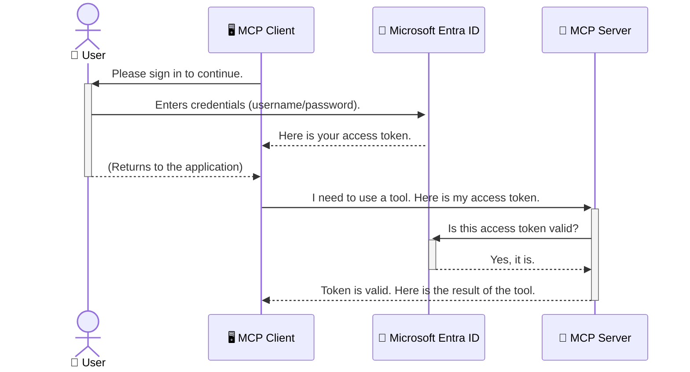

<!--
CO_OP_TRANSLATOR_METADATA:
{
  "original_hash": "6e562d7e5a77c8982da4aa8f762ad1d8",
  "translation_date": "2025-07-14T03:00:40+00:00",
  "source_file": "05-AdvancedTopics/mcp-security-entra/README.md",
  "language_code": "br"
}
-->
# Protegendo Fluxos de Trabalho de IA: Autenticação Entra ID para Servidores do Protocolo de Contexto de Modelo

## Introdução  
Proteger seu servidor do Protocolo de Contexto de Modelo (MCP) é tão importante quanto trancar a porta da sua casa. Deixar seu servidor MCP aberto expõe suas ferramentas e dados a acessos não autorizados, o que pode resultar em falhas de segurança. O Microsoft Entra ID oferece uma solução robusta de gerenciamento de identidade e acesso baseada em nuvem, ajudando a garantir que apenas usuários e aplicações autorizados possam interagir com seu servidor MCP. Nesta seção, você aprenderá como proteger seus fluxos de trabalho de IA usando a autenticação Entra ID.

## Objetivos de Aprendizagem  
Ao final desta seção, você será capaz de:

- Compreender a importância de proteger servidores MCP.  
- Explicar os conceitos básicos do Microsoft Entra ID e da autenticação OAuth 2.0.  
- Reconhecer a diferença entre clientes públicos e confidenciais.  
- Implementar autenticação Entra ID em cenários de servidores MCP locais (cliente público) e remotos (cliente confidencial).  
- Aplicar as melhores práticas de segurança no desenvolvimento de fluxos de trabalho de IA.

## Segurança e MCP  

Assim como você não deixaria a porta da sua casa destrancada, não deve deixar seu servidor MCP aberto para qualquer pessoa acessar. Proteger seus fluxos de trabalho de IA é essencial para construir aplicações robustas, confiáveis e seguras. Este capítulo vai apresentar como usar o Microsoft Entra ID para proteger seus servidores MCP, garantindo que apenas usuários e aplicações autorizados possam interagir com suas ferramentas e dados.

## Por Que a Segurança é Importante para Servidores MCP  

Imagine que seu servidor MCP possui uma ferramenta que pode enviar e-mails ou acessar um banco de dados de clientes. Um servidor sem proteção permitiria que qualquer pessoa usasse essa ferramenta, resultando em acesso não autorizado a dados, envio de spam ou outras atividades maliciosas.

Ao implementar autenticação, você garante que cada requisição ao seu servidor seja verificada, confirmando a identidade do usuário ou aplicação que está fazendo a solicitação. Este é o primeiro e mais importante passo para proteger seus fluxos de trabalho de IA.

## Introdução ao Microsoft Entra ID  

[**Microsoft Entra ID**](https://adoption.microsoft.com/microsoft-security/entra/) é um serviço de gerenciamento de identidade e acesso baseado em nuvem. Pense nele como um segurança universal para suas aplicações. Ele gerencia o processo complexo de verificar identidades de usuários (autenticação) e determinar o que eles podem fazer (autorização).

Ao usar o Entra ID, você pode:

- Permitir login seguro para usuários.  
- Proteger APIs e serviços.  
- Gerenciar políticas de acesso a partir de um local centralizado.

Para servidores MCP, o Entra ID oferece uma solução robusta e amplamente confiável para controlar quem pode acessar as funcionalidades do seu servidor.

---

## Entendendo a Mágica: Como Funciona a Autenticação Entra ID  

O Entra ID utiliza padrões abertos como **OAuth 2.0** para gerenciar a autenticação. Embora os detalhes possam ser complexos, o conceito principal é simples e pode ser entendido por meio de uma analogia.

### Uma Introdução Simples ao OAuth 2.0: A Chave do Manobrista  

Pense no OAuth 2.0 como um serviço de manobrista para o seu carro. Quando você chega a um restaurante, não entrega a chave mestra para o manobrista. Em vez disso, você fornece uma **chave do manobrista** que tem permissões limitadas — ela pode ligar o carro e trancar as portas, mas não pode abrir o porta-malas ou o porta-luvas.

Nessa analogia:

- **Você** é o **Usuário**.  
- **Seu carro** é o **Servidor MCP** com suas ferramentas e dados valiosos.  
- O **Manobrista** é o **Microsoft Entra ID**.  
- O **Atendente do Estacionamento** é o **Cliente MCP** (a aplicação tentando acessar o servidor).  
- A **Chave do Manobrista** é o **Token de Acesso**.

O token de acesso é uma sequência segura de texto que o cliente MCP recebe do Entra ID após você fazer login. O cliente então apresenta esse token ao servidor MCP a cada requisição. O servidor pode verificar o token para garantir que a solicitação é legítima e que o cliente tem as permissões necessárias, tudo isso sem precisar lidar diretamente com suas credenciais reais (como sua senha).

### O Fluxo de Autenticação  

Veja como o processo funciona na prática:



### Apresentando a Microsoft Authentication Library (MSAL)  

Antes de entrarmos no código, é importante apresentar um componente chave que você verá nos exemplos: a **Microsoft Authentication Library (MSAL)**.

MSAL é uma biblioteca desenvolvida pela Microsoft que facilita muito para os desenvolvedores lidarem com autenticação. Em vez de você precisar escrever todo o código complexo para gerenciar tokens de segurança, sessões de login e renovação de sessões, o MSAL cuida dessa parte pesada.

Usar uma biblioteca como o MSAL é altamente recomendado porque:

- **É Seguro:** Implementa protocolos padrão da indústria e melhores práticas de segurança, reduzindo o risco de vulnerabilidades no seu código.  
- **Simplifica o Desenvolvimento:** Abstrai a complexidade dos protocolos OAuth 2.0 e OpenID Connect, permitindo adicionar autenticação robusta à sua aplicação com poucas linhas de código.  
- **É Mantido:** A Microsoft mantém e atualiza ativamente o MSAL para lidar com novas ameaças de segurança e mudanças nas plataformas.

O MSAL suporta uma grande variedade de linguagens e frameworks, incluindo .NET, JavaScript/TypeScript, Python, Java, Go e plataformas móveis como iOS e Android. Isso significa que você pode usar os mesmos padrões consistentes de autenticação em toda a sua stack tecnológica.

Para saber mais sobre o MSAL, você pode consultar a documentação oficial de [visão geral do MSAL](https://learn.microsoft.com/entra/identity-platform/msal-overview).

---

## Protegendo Seu Servidor MCP com Entra ID: Um Guia Passo a Passo  

Agora, vamos ver como proteger um servidor MCP local (que se comunica via `stdio`) usando o Entra ID. Este exemplo usa um **cliente público**, adequado para aplicações que rodam na máquina do usuário, como um app desktop ou servidor local de desenvolvimento.

### Cenário 1: Protegendo um Servidor MCP Local (com Cliente Público)  

Neste cenário, vamos analisar um servidor MCP que roda localmente, se comunica via `stdio` e usa o Entra ID para autenticar o usuário antes de permitir o acesso às suas ferramentas. O servidor terá uma única ferramenta que busca as informações do perfil do usuário na Microsoft Graph API.

#### 1. Configurando a Aplicação no Entra ID  

Antes de escrever qualquer código, você precisa registrar sua aplicação no Microsoft Entra ID. Isso informa ao Entra ID sobre sua aplicação e concede permissão para usar o serviço de autenticação.

1. Acesse o **[portal Microsoft Entra](https://entra.microsoft.com/)**.  
2. Vá para **App registrations** e clique em **New registration**.  
3. Dê um nome para sua aplicação (ex.: "Meu Servidor MCP Local").  
4. Em **Supported account types**, selecione **Accounts in this organizational directory only**.  
5. Você pode deixar o **Redirect URI** em branco para este exemplo.  
6. Clique em **Register**.

Após o registro, anote o **Application (client) ID** e o **Directory (tenant) ID**. Você precisará deles no seu código.

#### 2. O Código: Uma Análise  

Vamos ver as partes principais do código que lidam com a autenticação. O código completo deste exemplo está disponível na pasta [Entra ID - Local - WAM](https://github.com/Azure-Samples/mcp-auth-servers/tree/main/src/entra-id-local-wam) do repositório [mcp-auth-servers no GitHub](https://github.com/Azure-Samples/mcp-auth-servers).

**`AuthenticationService.cs`**

Esta classe é responsável por gerenciar a interação com o Entra ID.

- **`CreateAsync`**: Inicializa o `PublicClientApplication` da MSAL (Microsoft Authentication Library). É configurado com o `clientId` e `tenantId` da sua aplicação.  
- **`WithBroker`**: Habilita o uso de um broker (como o Windows Web Account Manager), que oferece uma experiência de login único mais segura e fluida.  
- **`AcquireTokenAsync`**: Método principal. Primeiro tenta obter um token silenciosamente (ou seja, o usuário não precisa fazer login novamente se já tiver uma sessão válida). Se não conseguir, solicita que o usuário faça login interativamente.

```csharp
// Simplified for clarity
public static async Task<AuthenticationService> CreateAsync(ILogger<AuthenticationService> logger)
{
    var msalClient = PublicClientApplicationBuilder
        .Create(_clientId) // Your Application (client) ID
        .WithAuthority(AadAuthorityAudience.AzureAdMyOrg)
        .WithTenantId(_tenantId) // Your Directory (tenant) ID
        .WithBroker(new BrokerOptions(BrokerOptions.OperatingSystems.Windows))
        .Build();

    // ... cache registration ...

    return new AuthenticationService(logger, msalClient);
}

public async Task<string> AcquireTokenAsync()
{
    try
    {
        // Try silent authentication first
        var accounts = await _msalClient.GetAccountsAsync();
        var account = accounts.FirstOrDefault();

        AuthenticationResult? result = null;

        if (account != null)
        {
            result = await _msalClient.AcquireTokenSilent(_scopes, account).ExecuteAsync();
        }
        else
        {
            // If no account, or silent fails, go interactive
            result = await _msalClient.AcquireTokenInteractive(_scopes).ExecuteAsync();
        }

        return result.AccessToken;
    }
    catch (Exception ex)
    {
        _logger.LogError(ex, "An error occurred while acquiring the token.");
        throw; // Optionally rethrow the exception for higher-level handling
    }
}
```

**`Program.cs`**

Aqui o servidor MCP é configurado e o serviço de autenticação é integrado.

- **`AddSingleton<AuthenticationService>`**: Registra o `AuthenticationService` no container de injeção de dependência, para que outras partes da aplicação (como a ferramenta) possam usá-lo.  
- **Ferramenta `GetUserDetailsFromGraph`**: Esta ferramenta requer uma instância do `AuthenticationService`. Antes de executar qualquer ação, chama `authService.AcquireTokenAsync()` para obter um token de acesso válido. Se a autenticação for bem-sucedida, usa o token para chamar a Microsoft Graph API e buscar os detalhes do usuário.

```csharp
// Simplified for clarity
[McpServerTool(Name = "GetUserDetailsFromGraph")]
public static async Task<string> GetUserDetailsFromGraph(
    AuthenticationService authService)
{
    try
    {
        // This will trigger the authentication flow
        var accessToken = await authService.AcquireTokenAsync();

        // Use the token to create a GraphServiceClient
        var graphClient = new GraphServiceClient(
            new BaseBearerTokenAuthenticationProvider(new TokenProvider(authService)));

        var user = await graphClient.Me.GetAsync();

        return System.Text.Json.JsonSerializer.Serialize(user);
    }
    catch (Exception ex)
    {
        return $"Error: {ex.Message}";
    }
}
```

#### 3. Como Tudo Funciona Junto  

1. Quando o cliente MCP tenta usar a ferramenta `GetUserDetailsFromGraph`, a ferramenta primeiro chama `AcquireTokenAsync`.  
2. `AcquireTokenAsync` aciona a biblioteca MSAL para verificar se há um token válido.  
3. Se nenhum token for encontrado, o MSAL, por meio do broker, solicitará que o usuário faça login com sua conta Entra ID.  
4. Após o login, o Entra ID emite um token de acesso.  
5. A ferramenta recebe o token e o usa para fazer uma chamada segura à Microsoft Graph API.  
6. Os detalhes do usuário são retornados ao cliente MCP.

Esse processo garante que apenas usuários autenticados possam usar a ferramenta, protegendo efetivamente seu servidor MCP local.

### Cenário 2: Protegendo um Servidor MCP Remoto (com Cliente Confidencial)  

Quando seu servidor MCP está rodando em uma máquina remota (como um servidor na nuvem) e se comunica por um protocolo como HTTP Streaming, os requisitos de segurança são diferentes. Nesse caso, você deve usar um **cliente confidencial** e o **Authorization Code Flow**. Este é um método mais seguro porque os segredos da aplicação nunca são expostos ao navegador.

Este exemplo usa um servidor MCP baseado em TypeScript que utiliza Express.js para lidar com requisições HTTP.

#### 1. Configurando a Aplicação no Entra ID  

A configuração no Entra ID é semelhante à do cliente público, mas com uma diferença importante: você precisa criar um **segredo de cliente**.

1. Acesse o **[portal Microsoft Entra](https://entra.microsoft.com/)**.  
2. Na sua aplicação registrada, vá para a aba **Certificates & secrets**.  
3. Clique em **New client secret**, dê uma descrição e clique em **Add**.  
4. **Importante:** Copie o valor do segredo imediatamente. Você não poderá vê-lo novamente.  
5. Também é necessário configurar um **Redirect URI**. Vá para a aba **Authentication**, clique em **Add a platform**, selecione **Web** e insira o URI de redirecionamento da sua aplicação (ex.: `http://localhost:3001/auth/callback`).

> **⚠️ Nota Importante de Segurança:** Para aplicações em produção, a Microsoft recomenda fortemente usar métodos de autenticação sem segredo, como **Managed Identity** ou **Workload Identity Federation**, em vez de segredos de cliente. Segredos de cliente apresentam riscos de segurança, pois podem ser expostos ou comprometidos. Identidades gerenciadas oferecem uma abordagem mais segura ao eliminar a necessidade de armazenar credenciais no código ou na configuração.  
>  
> Para mais informações sobre identidades gerenciadas e como implementá-las, consulte a [visão geral de identidades gerenciadas para recursos do Azure](https://learn.microsoft.com/entra/identity/managed-identities-azure-resources/overview).

#### 2. O Código: Uma Análise  

Este exemplo usa uma abordagem baseada em sessão. Quando o usuário autentica, o servidor armazena o token de acesso e o token de atualização na sessão e fornece ao usuário um token de sessão. Esse token de sessão é usado nas requisições subsequentes. O código completo deste exemplo está disponível na pasta [Entra ID - Confidential client](https://github.com/Azure-Samples/mcp-auth-servers/tree/main/src/entra-id-cca-session) do repositório [mcp-auth-servers no GitHub](https://github.com/Azure-Samples/mcp-auth-servers).

**`Server.ts`**

Este arquivo configura o servidor Express e a camada de transporte MCP.

- **`requireBearerAuth`**: Middleware que protege os endpoints `/sse` e `/message`. Verifica se há um token bearer válido no cabeçalho `Authorization` da requisição.  
- **`EntraIdServerAuthProvider`**: Classe personalizada que implementa a interface `McpServerAuthorizationProvider`. É responsável por gerenciar o fluxo OAuth 2.0.  
- **`/auth/callback`**: Endpoint que trata o redirecionamento do Entra ID após o usuário autenticar. Ele troca o código de autorização por um token de acesso e um token de atualização.

```typescript
// Simplified for clarity
const app = express();
const { server } = createServer();
const provider = new EntraIdServerAuthProvider();

// Protect the SSE endpoint
app.get("/sse", requireBearerAuth({
  provider,
  requiredScopes: ["User.Read"]
}), async (req, res) => {
  // ... connect to the transport ...
});

// Protect the message endpoint
app.post("/message", requireBearerAuth({
  provider,
  requiredScopes: ["User.Read"]
}), async (req, res) => {
  // ... handle the message ...
});

// Handle the OAuth 2.0 callback
app.get("/auth/callback", (req, res) => {
  provider.handleCallback(req.query.code, req.query.state)
    .then(result => {
      // ... handle success or failure ...
    });
});
```

**`Tools.ts`**

Este arquivo define as ferramentas que o servidor MCP oferece. A ferramenta `getUserDetails` é semelhante à do exemplo anterior, mas obtém o token de acesso da sessão.

```typescript
// Simplified for clarity
server.setRequestHandler(CallToolRequestSchema, async (request) => {
  const { name } = request.params;
  const context = request.params?.context as { token?: string } | undefined;
  const sessionToken = context?.token;

  if (name === ToolName.GET_USER_DETAILS) {
    if (!sessionToken) {
      throw new AuthenticationError("Authentication token is missing or invalid. Ensure the token is provided in the request context.");
    }

    // Get the Entra ID token from the session store
    const tokenData = tokenStore.getToken(sessionToken);
    const entraIdToken = tokenData.accessToken;

    const graphClient = Client.init({
      authProvider: (done) => {
        done(null, entraIdToken);
      }
    });

    const user = await graphClient.api('/me').get();

    // ... return user details ...
  }
});
```

**`auth/EntraIdServerAuthProvider.ts`**

Esta classe gerencia a lógica para:

- Redirecionar o usuário para a página de login do Entra ID.  
- Trocar o código de autorização por um token de acesso.  
- Armazenar os tokens no `tokenStore`.  
- Renovar o token de acesso quando ele expira.

#### 3. Como Tudo Funciona Junto  

1. Quando um usuário tenta se conectar ao servidor MCP pela primeira vez, o middleware `requireBearerAuth` percebe que ele não tem uma sessão válida e o redireciona para a página de login do Entra ID.  
2. O usuário faz login com sua conta Entra ID.  
3. O Entra ID redireciona o usuário de volta para o endpoint `/auth/callback` com um código de autorização.
4. O servidor troca o código por um token de acesso e um token de atualização, armazena-os e cria um token de sessão que é enviado ao cliente.  
5. O cliente agora pode usar esse token de sessão no cabeçalho `Authorization` para todas as requisições futuras ao servidor MCP.  
6. Quando a ferramenta `getUserDetails` é chamada, ela usa o token de sessão para buscar o token de acesso do Entra ID e, em seguida, usa esse token para chamar a API Microsoft Graph.

Esse fluxo é mais complexo do que o fluxo de cliente público, mas é necessário para endpoints expostos à internet. Como servidores MCP remotos são acessíveis pela internet pública, eles precisam de medidas de segurança mais robustas para proteger contra acessos não autorizados e possíveis ataques.


## Melhores Práticas de Segurança

- **Sempre use HTTPS**: Criptografe a comunicação entre cliente e servidor para proteger os tokens contra interceptação.  
- **Implemente Controle de Acesso Baseado em Funções (RBAC)**: Não verifique apenas *se* o usuário está autenticado; verifique *o que* ele está autorizado a fazer. Você pode definir funções no Entra ID e verificá-las no seu servidor MCP.  
- **Monitore e audite**: Registre todos os eventos de autenticação para detectar e responder a atividades suspeitas.  
- **Gerencie limites de taxa e controle de fluxo**: Microsoft Graph e outras APIs aplicam limites para evitar abusos. Implemente backoff exponencial e lógica de retry no seu servidor MCP para lidar de forma elegante com respostas HTTP 429 (Too Many Requests). Considere armazenar em cache dados acessados com frequência para reduzir chamadas à API.  
- **Armazenamento seguro de tokens**: Armazene tokens de acesso e atualização de forma segura. Para aplicações locais, use os mecanismos de armazenamento seguro do sistema. Para aplicações em servidor, considere usar armazenamento criptografado ou serviços de gerenciamento de chaves seguros, como o Azure Key Vault.  
- **Gerenciamento de expiração de tokens**: Tokens de acesso têm tempo de vida limitado. Implemente atualização automática de tokens usando tokens de atualização para manter uma experiência contínua sem exigir nova autenticação.  
- **Considere usar o Azure API Management**: Embora implementar segurança diretamente no seu servidor MCP ofereça controle detalhado, gateways de API como o Azure API Management podem lidar automaticamente com muitas dessas preocupações de segurança, incluindo autenticação, autorização, limitação de taxa e monitoramento. Eles fornecem uma camada centralizada de segurança entre seus clientes e seus servidores MCP. Para mais detalhes sobre o uso de gateways de API com MCP, veja nosso [Azure API Management Your Auth Gateway For MCP Servers](https://techcommunity.microsoft.com/blog/integrationsonazureblog/azure-api-management-your-auth-gateway-for-mcp-servers/4402690).


## Principais Pontos

- Proteger seu servidor MCP é fundamental para garantir a segurança dos seus dados e ferramentas.  
- Microsoft Entra ID oferece uma solução robusta e escalável para autenticação e autorização.  
- Use um **cliente público** para aplicações locais e um **cliente confidencial** para servidores remotos.  
- O **Authorization Code Flow** é a opção mais segura para aplicações web.


## Exercício

1. Pense em um servidor MCP que você poderia construir. Ele seria um servidor local ou remoto?  
2. Com base na sua resposta, você usaria um cliente público ou confidencial?  
3. Qual permissão seu servidor MCP solicitariam para executar ações contra o Microsoft Graph?


## Exercícios Práticos

### Exercício 1: Registrar uma Aplicação no Entra ID  
Acesse o portal Microsoft Entra.  
Registre uma nova aplicação para seu servidor MCP.  
Anote o Application (client) ID e o Directory (tenant) ID.

### Exercício 2: Proteger um Servidor MCP Local (Cliente Público)  
- Siga o exemplo de código para integrar o MSAL (Microsoft Authentication Library) para autenticação do usuário.  
- Teste o fluxo de autenticação chamando a ferramenta MCP que busca detalhes do usuário no Microsoft Graph.

### Exercício 3: Proteger um Servidor MCP Remoto (Cliente Confidencial)  
- Registre um cliente confidencial no Entra ID e crie um segredo de cliente.  
- Configure seu servidor MCP Express.js para usar o Authorization Code Flow.  
- Teste os endpoints protegidos e confirme o acesso baseado em token.

### Exercício 4: Aplicar Melhores Práticas de Segurança  
- Habilite HTTPS para seu servidor local ou remoto.  
- Implemente controle de acesso baseado em funções (RBAC) na lógica do seu servidor.  
- Adicione tratamento para expiração de tokens e armazenamento seguro de tokens.

## Recursos

1. **Documentação de Visão Geral do MSAL**  
   Saiba como a Microsoft Authentication Library (MSAL) permite aquisição segura de tokens em várias plataformas:  
   [MSAL Overview on Microsoft Learn](https://learn.microsoft.com/en-gb/entra/msal/overview)

2. **Repositório GitHub Azure-Samples/mcp-auth-servers**  
   Implementações de referência de servidores MCP demonstrando fluxos de autenticação:  
   [Azure-Samples/mcp-auth-servers on GitHub](https://github.com/Azure-Samples/mcp-auth-servers)

3. **Visão Geral de Identidades Gerenciadas para Recursos Azure**  
   Entenda como eliminar segredos usando identidades gerenciadas atribuídas ao sistema ou ao usuário:  
   [Managed Identities Overview on Microsoft Learn](https://learn.microsoft.com/en-us/entra/identity/managed-identities-azure-resources/)

4. **Azure API Management: Seu Gateway de Autenticação para Servidores MCP**  
   Um mergulho profundo no uso do APIM como gateway OAuth2 seguro para servidores MCP:  
   [Azure API Management Your Auth Gateway For MCP Servers](https://techcommunity.microsoft.com/blog/integrationsonazureblog/azure-api-management-your-auth-gateway-for-mcp-servers/4402690)

5. **Referência de Permissões do Microsoft Graph**  
   Lista completa de permissões delegadas e de aplicação para o Microsoft Graph:  
   [Microsoft Graph Permissions Reference](https://learn.microsoft.com/zh-tw/graph/permissions-reference)


## Resultados de Aprendizagem  
Após concluir esta seção, você será capaz de:

- Explicar por que a autenticação é crítica para servidores MCP e fluxos de trabalho de IA.  
- Configurar e ajustar a autenticação Entra ID para cenários de servidores MCP locais e remotos.  
- Escolher o tipo de cliente adequado (público ou confidencial) com base na implantação do seu servidor.  
- Implementar práticas seguras de codificação, incluindo armazenamento de tokens e autorização baseada em funções.  
- Proteger com confiança seu servidor MCP e suas ferramentas contra acessos não autorizados.

## Próximos passos

- [5.13 Integração do Protocolo Model Context (MCP) com Azure AI Foundry](../mcp-foundry-agent-integration/README.md)

**Aviso Legal**:  
Este documento foi traduzido utilizando o serviço de tradução por IA [Co-op Translator](https://github.com/Azure/co-op-translator). Embora nos esforcemos para garantir a precisão, esteja ciente de que traduções automáticas podem conter erros ou imprecisões. O documento original em seu idioma nativo deve ser considerado a fonte autorizada. Para informações críticas, recomenda-se tradução profissional humana. Não nos responsabilizamos por quaisquer mal-entendidos ou interpretações incorretas decorrentes do uso desta tradução.