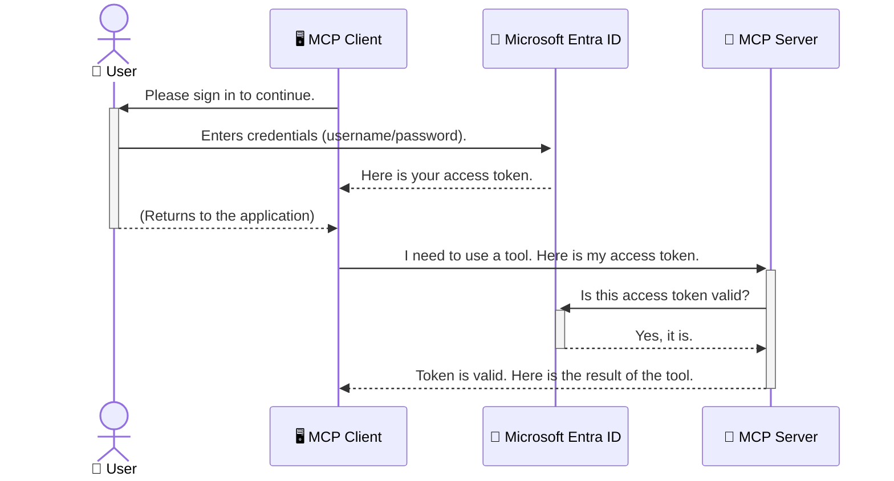

<!--
CO_OP_TRANSLATOR_METADATA:
{
  "original_hash": "9abe1d303ab126f9a8b87f03cebe5213",
  "translation_date": "2025-06-26T14:44:43+00:00",
  "source_file": "05-AdvancedTopics/mcp-security-entra/README.md",
  "language_code": "br"
}
-->
# Protegendo Fluxos de Trabalho de IA: Autenticação Entra ID para Servidores Model Context Protocol

## Introdução  
Proteger seu servidor Model Context Protocol (MCP) é tão importante quanto trancar a porta da frente da sua casa. Deixar seu servidor MCP aberto expõe suas ferramentas e dados a acessos não autorizados, o que pode resultar em violações de segurança. O Microsoft Entra ID oferece uma solução robusta de gerenciamento de identidade e acesso baseada na nuvem, ajudando a garantir que apenas usuários e aplicações autorizadas possam interagir com seu servidor MCP. Nesta seção, você aprenderá como proteger seus fluxos de trabalho de IA usando a autenticação Entra ID.

## Objetivos de Aprendizagem  
Ao final desta seção, você será capaz de:

- Entender a importância de proteger servidores MCP.  
- Explicar os conceitos básicos do Microsoft Entra ID e autenticação OAuth 2.0.  
- Reconhecer a diferença entre clientes públicos e confidenciais.  
- Implementar a autenticação Entra ID em cenários de servidores MCP locais (cliente público) e remotos (cliente confidencial).  
- Aplicar as melhores práticas de segurança no desenvolvimento de fluxos de trabalho de IA.  

# Protegendo Fluxos de Trabalho de IA: Autenticação Entra ID para Servidores Model Context Protocol

Assim como você não deixaria a porta da frente da sua casa destrancada, não deve deixar seu servidor MCP aberto para qualquer um acessar. Proteger seus fluxos de trabalho de IA é essencial para construir aplicações robustas, confiáveis e seguras. Este capítulo apresentará como usar o Microsoft Entra ID para proteger seus servidores MCP, garantindo que apenas usuários e aplicações autorizadas possam interagir com suas ferramentas e dados.

## Por que a Segurança é Importante para Servidores MCP

Imagine que seu servidor MCP possui uma ferramenta capaz de enviar e-mails ou acessar um banco de dados de clientes. Um servidor sem segurança permitiria que qualquer pessoa usasse essa ferramenta, resultando em acesso não autorizado a dados, envio de spam ou outras atividades maliciosas.

Ao implementar autenticação, você garante que cada requisição ao seu servidor seja verificada, confirmando a identidade do usuário ou aplicação que está fazendo a solicitação. Este é o primeiro e mais importante passo para proteger seus fluxos de trabalho de IA.

## Introdução ao Microsoft Entra ID

**Microsoft Entra ID** é um serviço baseado na nuvem para gerenciamento de identidade e acesso. Pense nele como um segurança universal para suas aplicações. Ele lida com o processo complexo de verificar identidades de usuários (autenticação) e determinar o que eles podem fazer (autorização).

Ao usar o Entra ID, você pode:

- Habilitar login seguro para usuários.  
- Proteger APIs e serviços.  
- Gerenciar políticas de acesso a partir de um local centralizado.  

Para servidores MCP, o Entra ID oferece uma solução robusta e amplamente confiável para gerenciar quem pode acessar as funcionalidades do seu servidor.

---

## Entendendo a Mágica: Como Funciona a Autenticação Entra ID

O Entra ID utiliza padrões abertos como **OAuth 2.0** para gerenciar a autenticação. Embora os detalhes possam ser complexos, o conceito principal é simples e pode ser entendido por meio de uma analogia.

### Uma Introdução Simples ao OAuth 2.0: A Chave do Manobrista

Pense no OAuth 2.0 como um serviço de manobrista para seu carro. Quando você chega a um restaurante, não entrega a chave mestra ao manobrista. Em vez disso, você fornece uma **chave do manobrista** com permissões limitadas — ela pode ligar o carro e trancar as portas, mas não pode abrir o porta-malas ou o porta-luvas.

Nessa analogia:

- **Você** é o **Usuário**.  
- **Seu carro** é o **Servidor MCP** com suas ferramentas e dados valiosos.  
- O **Manobrista** é o **Microsoft Entra ID**.  
- O **Atendente do Estacionamento** é o **Cliente MCP** (a aplicação tentando acessar o servidor).  
- A **Chave do Manobrista** é o **Token de Acesso**.  

O token de acesso é uma string segura que o cliente MCP recebe do Entra ID após você fazer login. O cliente então apresenta esse token ao servidor MCP a cada requisição. O servidor pode verificar o token para garantir que a requisição é legítima e que o cliente tem as permissões necessárias, tudo isso sem precisar lidar diretamente com suas credenciais reais (como sua senha).

### O Fluxo de Autenticação

Veja como o processo funciona na prática:



### Apresentando a Microsoft Authentication Library (MSAL)

Antes de entrarmos no código, é importante apresentar um componente chave que você verá nos exemplos: a **Microsoft Authentication Library (MSAL)**.

MSAL é uma biblioteca desenvolvida pela Microsoft que facilita muito para os desenvolvedores lidarem com autenticação. Em vez de você ter que escrever todo o código complexo para gerenciar tokens de segurança, sessões e logins, o MSAL faz o trabalho pesado para você.

Usar uma biblioteca como o MSAL é altamente recomendado porque:

- **É Seguro:** Implementa protocolos padrão da indústria e melhores práticas de segurança, reduzindo o risco de vulnerabilidades no seu código.  
- **Simplifica o Desenvolvimento:** Abstrai a complexidade dos protocolos OAuth 2.0 e OpenID Connect, permitindo adicionar autenticação robusta com poucas linhas de código.  
- **É Mantido:** A Microsoft mantém e atualiza ativamente o MSAL para lidar com novas ameaças de segurança e mudanças nas plataformas.  

O MSAL suporta uma grande variedade de linguagens e frameworks, incluindo .NET, JavaScript/TypeScript, Python, Java, Go e plataformas móveis como iOS e Android. Isso significa que você pode usar os mesmos padrões de autenticação consistentes em toda sua pilha tecnológica.

Para saber mais sobre o MSAL, confira a documentação oficial de [visão geral do MSAL](https://learn.microsoft.com/entra/identity-platform/msal-overview).

---

## Protegendo Seu Servidor MCP com Entra ID: Guia Passo a Passo

Agora, vamos ver como proteger um servidor MCP local (aquele que se comunica via `stdio`) using Entra ID. This example uses a **public client**, which is suitable for applications running on a user's machine, like a desktop app or a local development server.

### Scenario 1: Securing a Local MCP Server (with a Public Client)

In this scenario, we'll look at an MCP server that runs locally, communicates over `stdio`, and uses Entra ID to authenticate the user before allowing access to its tools. The server will have a single tool that fetches the user's profile information from the Microsoft Graph API.

#### 1. Setting Up the Application in Entra ID

Before writing any code, you need to register your application in Microsoft Entra ID. This tells Entra ID about your application and grants it permission to use the authentication service.

1. Navigate to the **[Microsoft Entra portal](https://entra.microsoft.com/)**.
2. Go to **App registrations** and click **New registration**.
3. Give your application a name (e.g., "My Local MCP Server").
4. For **Supported account types**, select **Accounts in this organizational directory only**.
5. You can leave the **Redirect URI** blank for this example.
6. Click **Register**.

Once registered, take note of the **Application (client) ID** and **Directory (tenant) ID**. You'll need these in your code.

#### 2. The Code: A Breakdown

Let's look at the key parts of the code that handle authentication. The full code for this example is available in the [Entra ID - Local - WAM](https://github.com/Azure-Samples/mcp-auth-servers/tree/main/src/entra-id-local-wam) folder of the [mcp-auth-servers GitHub repository](https://github.com/Azure-Samples/mcp-auth-servers).

**`AuthenticationService.cs`**

This class is responsible for handling the interaction with Entra ID.

- **`CreateAsync`**: This method initializes the `PublicClientApplication` from the MSAL (Microsoft Authentication Library). It's configured with your application's `clientId` and `tenantId`.
- **`WithBroker`**: This enables the use of a broker (like the Windows Web Account Manager), which provides a more secure and seamless single sign-on experience.
- **`AcquireTokenAsync`**: Este é o método principal. Ele tenta primeiro obter um token silenciosamente (ou seja, o usuário não precisa fazer login novamente se já tiver uma sessão válida). Se não for possível adquirir um token silenciosamente, ele solicitará que o usuário faça login interativamente.

```csharp
// Simplified for clarity
public static async Task<AuthenticationService> CreateAsync(ILogger<AuthenticationService> logger)
{
    var msalClient = PublicClientApplicationBuilder
        .Create(_clientId) // Your Application (client) ID
        .WithAuthority(AadAuthorityAudience.AzureAdMyOrg)
        .WithTenantId(_tenantId) // Your Directory (tenant) ID
        .WithBroker(new BrokerOptions(BrokerOptions.OperatingSystems.Windows))
        .Build();

    // ... cache registration ...

    return new AuthenticationService(logger, msalClient);
}

public async Task<string> AcquireTokenAsync()
{
    try
    {
        // Try silent authentication first
        var accounts = await _msalClient.GetAccountsAsync();
        var account = accounts.FirstOrDefault();

        AuthenticationResult? result = null;

        if (account != null)
        {
            result = await _msalClient.AcquireTokenSilent(_scopes, account).ExecuteAsync();
        }
        else
        {
            // If no account, or silent fails, go interactive
            result = await _msalClient.AcquireTokenInteractive(_scopes).ExecuteAsync();
        }

        return result.AccessToken;
    }
    catch (Exception ex)
    {
        _logger.LogError(ex, "An error occurred while acquiring the token.");
        throw; // Optionally rethrow the exception for higher-level handling
    }
}
```

**`Program.cs`**

This is where the MCP server is set up and the authentication service is integrated.

- **`AddSingleton<AuthenticationService>`**: This registers the `AuthenticationService` with the dependency injection container, so it can be used by other parts of the application (like our tool).
- **`GetUserDetailsFromGraph` tool**: This tool requires an instance of `AuthenticationService`. Before it does anything, it calls `authService.AcquireTokenAsync()` para obter um token de acesso válido. Se a autenticação for bem-sucedida, ele usa o token para chamar a API Microsoft Graph e buscar os detalhes do usuário.

```csharp
// Simplified for clarity
[McpServerTool(Name = "GetUserDetailsFromGraph")]
public static async Task<string> GetUserDetailsFromGraph(
    AuthenticationService authService)
{
    try
    {
        // This will trigger the authentication flow
        var accessToken = await authService.AcquireTokenAsync();

        // Use the token to create a GraphServiceClient
        var graphClient = new GraphServiceClient(
            new BaseBearerTokenAuthenticationProvider(new TokenProvider(authService)));

        var user = await graphClient.Me.GetAsync();

        return System.Text.Json.JsonSerializer.Serialize(user);
    }
    catch (Exception ex)
    {
        return $"Error: {ex.Message}";
    }
}
```

#### 3. Como Tudo Funciona Junto

1. Quando o cliente MCP tenta usar a ferramenta `GetUserDetailsFromGraph` tool, the tool first calls `AcquireTokenAsync`.
2. `AcquireTokenAsync` triggers the MSAL library to check for a valid token.
3. If no token is found, MSAL, through the broker, will prompt the user to sign in with their Entra ID account.
4. Once the user signs in, Entra ID issues an access token.
5. The tool receives the token and uses it to make a secure call to the Microsoft Graph API.
6. The user's details are returned to the MCP client.

This process ensures that only authenticated users can use the tool, effectively securing your local MCP server.

### Scenario 2: Securing a Remote MCP Server (with a Confidential Client)

When your MCP server is running on a remote machine (like a cloud server) and communicates over a protocol like HTTP Streaming, the security requirements are different. In this case, you should use a **confidential client** and the **Authorization Code Flow**. This is a more secure method because the application's secrets are never exposed to the browser.

This example uses a TypeScript-based MCP server that uses Express.js to handle HTTP requests.

#### 1. Setting Up the Application in Entra ID

The setup in Entra ID is similar to the public client, but with one key difference: you need to create a **client secret**.

1. Navigate to the **[Microsoft Entra portal](https://entra.microsoft.com/)**.
2. In your app registration, go to the **Certificates & secrets** tab.
3. Click **New client secret**, give it a description, and click **Add**.
4. **Important:** Copy the secret value immediately. You will not be able to see it again.
5. You also need to configure a **Redirect URI**. Go to the **Authentication** tab, click **Add a platform**, select **Web**, and enter the redirect URI for your application (e.g., `http://localhost:3001/auth/callback`).

> **⚠️ Important Security Note:** For production applications, Microsoft strongly recommends using **secretless authentication** methods such as **Managed Identity** or **Workload Identity Federation** instead of client secrets. Client secrets pose security risks as they can be exposed or compromised. Managed identities provide a more secure approach by eliminating the need to store credentials in your code or configuration.
>
> For more information about managed identities and how to implement them, see the [Managed identities for Azure resources overview](https://learn.microsoft.com/entra/identity/managed-identities-azure-resources/overview).

#### 2. The Code: A Breakdown

This example uses a session-based approach. When the user authenticates, the server stores the access token and refresh token in a session and gives the user a session token. This session token is then used for subsequent requests. The full code for this example is available in the [Entra ID - Confidential client](https://github.com/Azure-Samples/mcp-auth-servers/tree/main/src/entra-id-cca-session) folder of the [mcp-auth-servers GitHub repository](https://github.com/Azure-Samples/mcp-auth-servers).

**`Server.ts`**

This file sets up the Express server and the MCP transport layer.

- **`requireBearerAuth`**: This is middleware that protects the `/sse` and `/message` endpoints. It checks for a valid bearer token in the `Authorization` header of the request.
- **`EntraIdServerAuthProvider`**: This is a custom class that implements the `McpServerAuthorizationProvider` interface. It's responsible for handling the OAuth 2.0 flow.
- **`/auth/callback`**: Este endpoint lida com o redirecionamento do Entra ID após o usuário ter se autenticado. Ele troca o código de autorização por um token de acesso e um token de atualização.

```typescript
// Simplified for clarity
const app = express();
const { server } = createServer();
const provider = new EntraIdServerAuthProvider();

// Protect the SSE endpoint
app.get("/sse", requireBearerAuth({
  provider,
  requiredScopes: ["User.Read"]
}), async (req, res) => {
  // ... connect to the transport ...
});

// Protect the message endpoint
app.post("/message", requireBearerAuth({
  provider,
  requiredScopes: ["User.Read"]
}), async (req, res) => {
  // ... handle the message ...
});

// Handle the OAuth 2.0 callback
app.get("/auth/callback", (req, res) => {
  provider.handleCallback(req.query.code, req.query.state)
    .then(result => {
      // ... handle success or failure ...
    });
});
```

**`Tools.ts`**

This file defines the tools that the MCP server provides. The `getUserDetails` a ferramenta é semelhante à do exemplo anterior, mas obtém o token de acesso da sessão.

```typescript
// Simplified for clarity
server.setRequestHandler(CallToolRequestSchema, async (request) => {
  const { name } = request.params;
  const context = request.params?.context as { token?: string } | undefined;
  const sessionToken = context?.token;

  if (name === ToolName.GET_USER_DETAILS) {
    if (!sessionToken) {
      throw new AuthenticationError("Authentication token is missing or invalid. Ensure the token is provided in the request context.");
    }

    // Get the Entra ID token from the session store
    const tokenData = tokenStore.getToken(sessionToken);
    const entraIdToken = tokenData.accessToken;

    const graphClient = Client.init({
      authProvider: (done) => {
        done(null, entraIdToken);
      }
    });

    const user = await graphClient.api('/me').get();

    // ... return user details ...
  }
});
```

**`auth/EntraIdServerAuthProvider.ts`**

This class handles the logic for:

- Redirecting the user to the Entra ID sign-in page.
- Exchanging the authorization code for an access token.
- Storing the tokens in the `tokenStore`.
- Refreshing the access token when it expires.

#### 3. How It All Works Together

1. When a user first tries to connect to the MCP server, the `requireBearerAuth` middleware will see that they don't have a valid session and will redirect them to the Entra ID sign-in page.
2. The user signs in with their Entra ID account.
3. Entra ID redirects the user back to the `/auth/callback` endpoint with an authorization code.
4. The server exchanges the code for an access token and a refresh token, stores them, and creates a session token which is sent to the client.
5. The client can now use this session token in the `Authorization` header for all future requests to the MCP server.
6. When the `getUserDetails` quando chamada, utiliza o token da sessão para localizar o token de acesso do Entra ID e, em seguida, usa esse token para chamar a API Microsoft Graph.

Esse fluxo é mais complexo que o fluxo do cliente público, mas é necessário para endpoints acessíveis pela internet. Como servidores MCP remotos são acessíveis pela internet pública, eles precisam de medidas de segurança mais fortes para proteger contra acessos não autorizados e possíveis ataques.

## Melhores Práticas de Segurança

- **Sempre use HTTPS**: Criptografe a comunicação entre cliente e servidor para proteger tokens contra interceptações.  
- **Implemente Controle de Acesso Baseado em Funções (RBAC)**: Não verifique apenas *se* o usuário está autenticado; verifique *o que* ele está autorizado a fazer. Você pode definir funções no Entra ID e validá-las no seu servidor MCP.  
- **Monitore e audite**: Registre todos os eventos de autenticação para detectar e responder a atividades suspeitas.  
- **Gerencie limites de taxa e throttling**: Microsoft Graph e outras APIs aplicam limites para evitar abusos. Implemente backoff exponencial e lógica de retry no seu servidor MCP para lidar elegantemente com respostas HTTP 429 (Too Many Requests). Considere armazenar em cache dados acessados com frequência para reduzir chamadas à API.  
- **Armazenamento seguro de tokens**: Armazene tokens de acesso e refresh de forma segura. Para aplicações locais, use os mecanismos seguros do sistema. Para aplicações servidoras, considere armazenamento criptografado ou serviços de gerenciamento de chaves seguros como Azure Key Vault.  
- **Gerenciamento da expiração dos tokens**: Tokens de acesso têm tempo limitado de validade. Implemente atualização automática usando tokens de refresh para manter a experiência do usuário sem exigir nova autenticação.  
- **Considere usar Azure API Management**: Embora implementar segurança diretamente no seu servidor MCP dê controle granular, gateways de API como o Azure API Management podem lidar automaticamente com muitas dessas preocupações de segurança, incluindo autenticação, autorização, limites de taxa e monitoramento. Eles fornecem uma camada centralizada de segurança entre seus clientes e servidores MCP. Para mais detalhes sobre o uso de gateways de API com MCP, veja nosso [Azure API Management Your Auth Gateway For MCP Servers](https://techcommunity.microsoft.com/blog/integrationsonazureblog/azure-api-management-your-auth-gateway-for-mcp-servers/4402690).

## Principais Conclusões

- Proteger seu servidor MCP é fundamental para proteger seus dados e ferramentas.  
- O Microsoft Entra ID oferece uma solução robusta e escalável para autenticação e autorização.  
- Use um **cliente público** para aplicações locais e um **cliente confidencial** para servidores remotos.  
- O **Authorization Code Flow** é a opção mais segura para aplicações web.  

## Exercício

1. Pense em um servidor MCP que você poderia criar. Ele seria local ou remoto?  
2. Com base na sua resposta, você usaria um cliente público ou confidencial?  
3. Quais permissões seu servidor MCP solicitariam para realizar ações contra o Microsoft Graph?  

## Exercícios Práticos

### Exercício 1: Registrar uma Aplicação no Entra ID  
Navegue até o portal Microsoft Entra.  
Registre uma nova aplicação para seu servidor MCP.  
Anote o ID da Aplicação (cliente) e o ID do Diretório (tenant).  

### Exercício 2: Proteger um Servidor MCP Local (Cliente Público)  
Siga o exemplo de código para integrar o MSAL (Microsoft Authentication Library) para autenticação do usuário.  
Teste o fluxo de autenticação chamando a ferramenta MCP que busca detalhes do usuário no Microsoft Graph.  

### Exercício 3: Proteger um Servidor MCP Remoto (Cliente Confidencial)  
Registre um cliente confidencial no Entra ID e crie um segredo de cliente.  
Configure seu servidor MCP Express.js para usar o Authorization Code Flow.  
Teste os endpoints protegidos e confirme o acesso baseado em token.  

### Exercício 4: Aplicar Melhores Práticas de Segurança  
Habilite HTTPS para seu servidor local ou remoto.  
Implemente controle de acesso baseado em função (RBAC) na lógica do servidor.  
Adicione tratamento para expiração de tokens e armazenamento seguro de tokens.  

## Recursos

1. **Documentação de Visão Geral do MSAL**  
   Aprenda como a Microsoft Authentication Library (MSAL) possibilita a aquisição segura de tokens em diversas plataformas:  
   [Visão Geral do MSAL no Microsoft Learn](https://learn.microsoft.com/en-gb/entra/msal/overview)  

2. **Repositório Azure-Samples/mcp-auth-servers no GitHub**  
   Implementações de referência de servidores MCP demonstrando fluxos de autenticação:  
   [Azure-Samples/mcp-auth-servers no GitHub](https://github.com/Azure-Samples/mcp-auth-servers)  

3. **Visão Geral de Identidades Gerenciadas para Recursos Azure**  
   Entenda como eliminar segredos usando identidades gerenciadas atribuídas ao sistema ou usuário:  
   [Visão Geral de Identidades Gerenciadas no Microsoft Learn](https://learn.microsoft.com/en-us/entra/identity/managed-identities-azure-resources/)  

4. **Azure API Management: Seu Gateway de Autenticação para Servidores MCP**  
   Um mergulho profundo no uso do APIM como gateway OAuth2 seguro para servidores MCP:  
   [Azure API Management Your Auth Gateway For MCP Servers](https://techcommunity.microsoft.com/blog/integrationsonazureblog/azure-api-management-your-auth-gateway-for-mcp-servers/4402690)  

5. **Referência de Permissões do Microsoft Graph**  
   Lista completa de permissões delegadas e de aplicação para o Microsoft Graph:  
   [Referência de Permissões do Microsoft Graph](https://learn.microsoft.com/zh-tw/graph/permissions-reference)  

## Resultados de Aprendizagem  
Após completar esta seção, você será capaz de:

- Explicar por que a autenticação é crítica para servidores MCP e fluxos de trabalho de IA.  
- Configurar e implementar autenticação Entra ID para cenários de servidores MCP locais e remotos.  
- Escolher o tipo de cliente apropriado (público ou confidencial) com base na implantação do servidor.  
- Implementar práticas seguras de codificação, incluindo armazenamento de tokens e autorização baseada em função.  
- Proteger com confiança seu servidor MCP e suas ferramentas contra acessos não autorizados.  

## O que vem a seguir

- [6. Contribuições da Comunidade](../../06-CommunityContributions/README.md)

**Aviso Legal**:  
Este documento foi traduzido utilizando o serviço de tradução por IA [Co-op Translator](https://github.com/Azure/co-op-translator). Embora nos esforcemos para garantir a precisão, esteja ciente de que traduções automáticas podem conter erros ou imprecisões. O documento original em seu idioma nativo deve ser considerado a fonte autorizada. Para informações críticas, recomenda-se tradução profissional humana. Não nos responsabilizamos por quaisquer mal-entendidos ou interpretações equivocadas decorrentes do uso desta tradução.