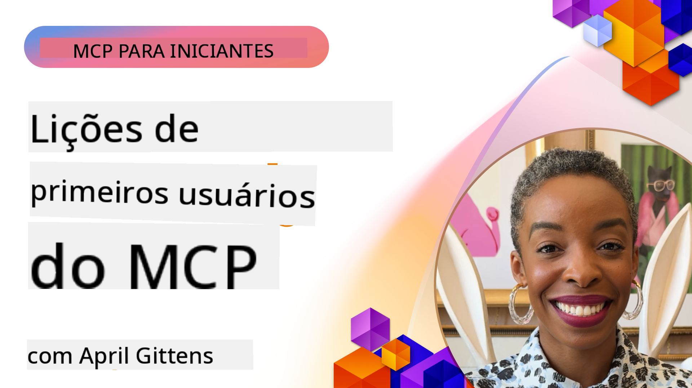

<!--
CO_OP_TRANSLATOR_METADATA:
{
  "original_hash": "41f16dac486d2086a53bc644a01cbe42",
  "translation_date": "2025-08-18T17:02:33+00:00",
  "source_file": "07-LessonsfromEarlyAdoption/README.md",
  "language_code": "br"
}
-->
# 🌟 Lições dos Primeiros Usuários

[](https://youtu.be/jds7dSmNptE)

_(Clique na imagem acima para assistir ao vídeo desta lição)_

## 🎯 O Que Este Módulo Aborda

Este módulo explora como organizações e desenvolvedores reais estão utilizando o Model Context Protocol (MCP) para resolver desafios práticos e impulsionar a inovação. Por meio de estudos de caso detalhados e projetos práticos, você descobrirá como o MCP possibilita uma integração de IA segura e escalável, conectando modelos de linguagem, ferramentas e dados corporativos.

### 📚 Veja o MCP em Ação

Quer ver esses princípios aplicados a ferramentas prontas para produção? Confira nosso [**Guia de 10 Servidores MCP da Microsoft que Estão Transformando a Produtividade dos Desenvolvedores**](microsoft-mcp-servers.md), que apresenta servidores MCP reais da Microsoft que você pode usar hoje.

## Visão Geral

Esta lição explora como os primeiros usuários têm aproveitado o Model Context Protocol (MCP) para resolver desafios do mundo real e impulsionar a inovação em diversos setores. Por meio de estudos de caso detalhados e projetos práticos, você verá como o MCP permite uma integração de IA padronizada, segura e escalável—conectando grandes modelos de linguagem, ferramentas e dados corporativos em uma estrutura unificada. Você ganhará experiência prática ao projetar e construir soluções baseadas em MCP, aprenderá com padrões de implementação comprovados e descobrirá as melhores práticas para implantar o MCP em ambientes de produção. A lição também destaca tendências emergentes, direções futuras e recursos de código aberto para ajudá-lo a se manter na vanguarda da tecnologia MCP e de seu ecossistema em evolução.

## Objetivos de Aprendizado

- Analisar implementações reais de MCP em diferentes setores
- Projetar e construir aplicações completas baseadas em MCP
- Explorar tendências emergentes e direções futuras na tecnologia MCP
- Aplicar as melhores práticas em cenários reais de desenvolvimento

## Implementações Reais de MCP

### Estudo de Caso 1: Automação de Suporte ao Cliente Empresarial

Uma corporação multinacional implementou uma solução baseada em MCP para padronizar interações de IA em seus sistemas de suporte ao cliente. Isso permitiu:

- Criar uma interface unificada para múltiplos provedores de LLM
- Manter uma gestão consistente de prompts entre departamentos
- Implementar controles robustos de segurança e conformidade
- Alternar facilmente entre diferentes modelos de IA com base em necessidades específicas

**Implementação Técnica:**

```python
# Python MCP server implementation for customer support
import logging
import asyncio
from modelcontextprotocol import create_server, ServerConfig
from modelcontextprotocol.server import MCPServer
from modelcontextprotocol.transports import create_http_transport
from modelcontextprotocol.resources import ResourceDefinition
from modelcontextprotocol.prompts import PromptDefinition
from modelcontextprotocol.tool import ToolDefinition

# Configure logging
logging.basicConfig(level=logging.INFO)

async def main():
    # Create server configuration
    config = ServerConfig(
        name="Enterprise Customer Support Server",
        version="1.0.0",
        description="MCP server for handling customer support inquiries"
    )
    
    # Initialize MCP server
    server = create_server(config)
    
    # Register knowledge base resources
    server.resources.register(
        ResourceDefinition(
            name="customer_kb",
            description="Customer knowledge base documentation"
        ),
        lambda params: get_customer_documentation(params)
    )
    
    # Register prompt templates
    server.prompts.register(
        PromptDefinition(
            name="support_template",
            description="Templates for customer support responses"
        ),
        lambda params: get_support_templates(params)
    )
    
    # Register support tools
    server.tools.register(
        ToolDefinition(
            name="ticketing",
            description="Create and update support tickets"
        ),
        handle_ticketing_operations
    )
    
    # Start server with HTTP transport
    transport = create_http_transport(port=8080)
    await server.run(transport)

if __name__ == "__main__":
    asyncio.run(main())
```

**Resultados:** Redução de 30% nos custos com modelos, melhoria de 45% na consistência das respostas e maior conformidade em operações globais.

### Estudo de Caso 2: Assistente de Diagnóstico em Saúde

Um provedor de saúde desenvolveu uma infraestrutura MCP para integrar múltiplos modelos de IA médica especializados, garantindo que dados sensíveis de pacientes permanecessem protegidos:

- Alternância fluida entre modelos médicos generalistas e especialistas
- Controles rigorosos de privacidade e trilhas de auditoria
- Integração com sistemas existentes de Prontuário Eletrônico (EHR)
- Engenharia de prompts consistente para terminologia médica

**Implementação Técnica:**

```csharp
// C# MCP host application implementation in healthcare application
using Microsoft.Extensions.DependencyInjection;
using ModelContextProtocol.SDK.Client;
using ModelContextProtocol.SDK.Security;
using ModelContextProtocol.SDK.Resources;

public class DiagnosticAssistant
{
    private readonly MCPHostClient _mcpClient;
    private readonly PatientContext _patientContext;
    
    public DiagnosticAssistant(PatientContext patientContext)
    {
        _patientContext = patientContext;
        
        // Configure MCP client with healthcare-specific settings
        var clientOptions = new ClientOptions
        {
            Name = "Healthcare Diagnostic Assistant",
            Version = "1.0.0",
            Security = new SecurityOptions
            {
                Encryption = EncryptionLevel.Medical,
                AuditEnabled = true
            }
        };
        
        _mcpClient = new MCPHostClientBuilder()
            .WithOptions(clientOptions)
            .WithTransport(new HttpTransport("https://healthcare-mcp.example.org"))
            .WithAuthentication(new HIPAACompliantAuthProvider())
            .Build();
    }
    
    public async Task<DiagnosticSuggestion> GetDiagnosticAssistance(
        string symptoms, string patientHistory)
    {
        // Create request with appropriate resources and tool access
        var resourceRequest = new ResourceRequest
        {
            Name = "patient_records",
            Parameters = new Dictionary<string, object>
            {
                ["patientId"] = _patientContext.PatientId,
                ["requestingProvider"] = _patientContext.ProviderId
            }
        };
        
        // Request diagnostic assistance using appropriate prompt
        var response = await _mcpClient.SendPromptRequestAsync(
            promptName: "diagnostic_assistance",
            parameters: new Dictionary<string, object>
            {
                ["symptoms"] = symptoms,
                patientHistory = patientHistory,
                relevantGuidelines = _patientContext.GetRelevantGuidelines()
            });
            
        return DiagnosticSuggestion.FromMCPResponse(response);
    }
}
```

**Resultados:** Sugestões de diagnóstico aprimoradas para médicos, mantendo total conformidade com HIPAA e redução significativa na troca de contexto entre sistemas.

### Estudo de Caso 3: Análise de Risco em Serviços Financeiros

Uma instituição financeira implementou o MCP para padronizar seus processos de análise de risco em diferentes departamentos:

- Criou uma interface unificada para modelos de risco de crédito, detecção de fraudes e risco de investimento
- Implementou controles de acesso rigorosos e versionamento de modelos
- Garantiu a auditabilidade de todas as recomendações de IA
- Manteve formatação de dados consistente em sistemas diversos

**Implementação Técnica:**

```java
// Java MCP server for financial risk assessment
import org.mcp.server.*;
import org.mcp.security.*;

public class FinancialRiskMCPServer {
    public static void main(String[] args) {
        // Create MCP server with financial compliance features
        MCPServer server = new MCPServerBuilder()
            .withModelProviders(
                new ModelProvider("risk-assessment-primary", new AzureOpenAIProvider()),
                new ModelProvider("risk-assessment-audit", new LocalLlamaProvider())
            )
            .withPromptTemplateDirectory("./compliance/templates")
            .withAccessControls(new SOCCompliantAccessControl())
            .withDataEncryption(EncryptionStandard.FINANCIAL_GRADE)
            .withVersionControl(true)
            .withAuditLogging(new DatabaseAuditLogger())
            .build();
            
        server.addRequestValidator(new FinancialDataValidator());
        server.addResponseFilter(new PII_RedactionFilter());
        
        server.start(9000);
        
        System.out.println("Financial Risk MCP Server running on port 9000");
    }
}
```

**Resultados:** Maior conformidade regulatória, ciclos de implantação de modelos 40% mais rápidos e consistência aprimorada na avaliação de riscos entre departamentos.

### Estudo de Caso 4: Servidor MCP Playwright da Microsoft para Automação de Navegadores

A Microsoft desenvolveu o [servidor MCP Playwright](https://github.com/microsoft/playwright-mcp) para permitir automação de navegadores segura e padronizada por meio do Model Context Protocol. Este servidor pronto para produção permite que agentes de IA e LLMs interajam com navegadores da web de maneira controlada, auditável e extensível—habilitando casos de uso como testes automatizados, extração de dados e fluxos de trabalho ponta a ponta.

> **🎯 Ferramenta Pronta para Produção**
> 
> Este estudo de caso apresenta um servidor MCP real que você pode usar hoje! Saiba mais sobre o Servidor MCP Playwright e outros 9 servidores MCP prontos para produção no nosso [**Guia de Servidores MCP da Microsoft**](microsoft-mcp-servers.md#8--playwright-mcp-server).

**Principais Recursos:**
- Expõe capacidades de automação de navegadores (navegação, preenchimento de formulários, captura de tela, etc.) como ferramentas MCP
- Implementa controles de acesso rigorosos e sandboxing para prevenir ações não autorizadas
- Fornece logs detalhados de auditoria para todas as interações com navegadores
- Suporta integração com Azure OpenAI e outros provedores de LLM para automação orientada por agentes
- Alimenta as capacidades de navegação do GitHub Copilot

**Implementação Técnica:**

```typescript
// TypeScript: Registering Playwright browser automation tools in an MCP server
import { createServer, ToolDefinition } from 'modelcontextprotocol';
import { launch } from 'playwright';

const server = createServer({
  name: 'Playwright MCP Server',
  version: '1.0.0',
  description: 'MCP server for browser automation using Playwright'
});

// Register a tool for navigating to a URL and capturing a screenshot
server.tools.register(
  new ToolDefinition({
    name: 'navigate_and_screenshot',
    description: 'Navigate to a URL and capture a screenshot',
    parameters: {
      url: { type: 'string', description: 'The URL to visit' }
    }
  }),
  async ({ url }) => {
    const browser = await launch();
    const page = await browser.newPage();
    await page.goto(url);
    const screenshot = await page.screenshot();
    await browser.close();
    return { screenshot };
  }
);

// Start the MCP server
server.listen(8080);
```

**Resultados:**

- Habilitou automação segura e programática de navegadores para agentes de IA e LLMs
- Reduziu o esforço manual de testes e melhorou a cobertura de testes para aplicações web
- Forneceu uma estrutura reutilizável e extensível para integração de ferramentas baseadas em navegadores em ambientes corporativos
- Alimenta as capacidades de navegação do GitHub Copilot

**Referências:**

- [Repositório GitHub do Servidor MCP Playwright](https://github.com/microsoft/playwright-mcp)
- [Soluções de IA e Automação da Microsoft](https://azure.microsoft.com/en-us/products/ai-services/)

### Estudo de Caso 5: Azure MCP – Protocolo de Contexto de Modelo de Nível Empresarial como Serviço

O Azure MCP ([https://aka.ms/azmcp](https://aka.ms/azmcp)) é a implementação gerenciada e de nível empresarial do Model Context Protocol da Microsoft, projetada para fornecer capacidades escaláveis, seguras e compatíveis de servidor MCP como um serviço em nuvem. O Azure MCP permite que organizações implantem, gerenciem e integrem rapidamente servidores MCP com serviços de IA, dados e segurança do Azure, reduzindo a sobrecarga operacional e acelerando a adoção de IA.

> **🎯 Ferramenta Pronta para Produção**
> 
> Este é um servidor MCP real que você pode usar hoje! Saiba mais sobre o Servidor MCP Azure AI Foundry no nosso [**Guia de Servidores MCP da Microsoft**](microsoft-mcp-servers.md).

- Hospedagem de servidor MCP totalmente gerenciada com escalabilidade, monitoramento e segurança integrados
- Integração nativa com Azure OpenAI, Azure AI Search e outros serviços do Azure
- Autenticação e autorização corporativa via Microsoft Entra ID
- Suporte para ferramentas personalizadas, templates de prompts e conectores de recursos
- Conformidade com requisitos de segurança e regulamentação corporativa

**Implementação Técnica:**

```yaml
# Example: Azure MCP server deployment configuration (YAML)
apiVersion: mcp.microsoft.com/v1
kind: McpServer
metadata:
  name: enterprise-mcp-server
spec:
  modelProviders:
    - name: azure-openai
      type: AzureOpenAI
      endpoint: https://<your-openai-resource>.openai.azure.com/
      apiKeySecret: <your-azure-keyvault-secret>
  tools:
    - name: document_search
      type: AzureAISearch
      endpoint: https://<your-search-resource>.search.windows.net/
      apiKeySecret: <your-azure-keyvault-secret>
  authentication:
    type: EntraID
    tenantId: <your-tenant-id>
  monitoring:
    enabled: true
    logAnalyticsWorkspace: <your-log-analytics-id>
```

**Resultados:**  
- Redução do tempo para geração de valor em projetos de IA corporativos ao fornecer uma plataforma de servidor MCP pronta para uso e compatível
- Integração simplificada de LLMs, ferramentas e fontes de dados corporativos
- Segurança, observabilidade e eficiência operacional aprimoradas para cargas de trabalho MCP
- Melhoria na qualidade do código com as melhores práticas do SDK do Azure e padrões de autenticação atuais

**Referências:**  
- [Documentação do Azure MCP](https://aka.ms/azmcp)
- [Repositório GitHub do Servidor MCP Azure](https://github.com/Azure/azure-mcp)
- [Serviços de IA do Azure](https://azure.microsoft.com/en-us/products/ai-services/)
- [Centro MCP da Microsoft](https://mcp.azure.com)

### Estudo de Caso 6: NLWeb

O MCP (Model Context Protocol) é um protocolo emergente para chatbots e assistentes de IA interagirem com ferramentas. Cada instância do NLWeb também é um servidor MCP, que suporta um método principal, ask, usado para fazer perguntas a um site em linguagem natural. A resposta retornada utiliza schema.org, um vocabulário amplamente usado para descrever dados da web. De forma simplificada, o MCP é para o NLWeb o que o Http é para o HTML. O NLWeb combina protocolos, formatos Schema.org e código de exemplo para ajudar sites a criarem rapidamente esses endpoints, beneficiando tanto humanos por meio de interfaces conversacionais quanto máquinas por meio de interações naturais entre agentes.

Existem dois componentes distintos no NLWeb:
- Um protocolo, muito simples para começar, para interagir com um site em linguagem natural e um formato, utilizando JSON e schema.org para a resposta retornada. Consulte a documentação da API REST para mais detalhes.
- Uma implementação direta de (1) que aproveita marcações existentes, para sites que podem ser abstraídos como listas de itens (produtos, receitas, atrações, avaliações, etc.). Junto com um conjunto de widgets de interface do usuário, os sites podem facilmente fornecer interfaces conversacionais para seu conteúdo. Consulte a documentação sobre o Ciclo de Vida de uma Consulta de Chat para mais detalhes sobre como isso funciona.

**Referências:**  
- [Documentação do Azure MCP](https://aka.ms/azmcp)  
- [NLWeb](https://github.com/microsoft/NlWeb)

### Estudo de Caso 7: Servidor MCP Azure AI Foundry – Integração de Agentes de IA Empresariais

Os servidores MCP Azure AI Foundry demonstram como o MCP pode ser usado para orquestrar e gerenciar agentes de IA e fluxos de trabalho em ambientes corporativos. Ao integrar o MCP com o Azure AI Foundry, as organizações podem padronizar interações de agentes, aproveitar o gerenciamento de fluxos de trabalho do Foundry e garantir implantações seguras e escaláveis.

> **🎯 Ferramenta Pronta para Produção**
> 
> Este é um servidor MCP real que você pode usar hoje! Saiba mais sobre o Servidor MCP Azure AI Foundry no nosso [**Guia de Servidores MCP da Microsoft**](microsoft-mcp-servers.md#9--azure-ai-foundry-mcp-server).

**Principais Recursos:**
- Acesso abrangente ao ecossistema de IA do Azure, incluindo catálogos de modelos e gerenciamento de implantações
- Indexação de conhecimento com Azure AI Search para aplicações RAG
- Ferramentas de avaliação para desempenho e garantia de qualidade de modelos de IA
- Integração com o Catálogo e Laboratórios do Azure AI Foundry para modelos de pesquisa de ponta
- Capacidades de gerenciamento e avaliação de agentes para cenários de produção

**Resultados:**
- Prototipagem rápida e monitoramento robusto de fluxos de trabalho de agentes de IA
- Integração perfeita com serviços de IA do Azure para cenários avançados
- Interface unificada para construir, implantar e monitorar pipelines de agentes
- Segurança, conformidade e eficiência operacional aprimoradas para empresas
- Aceleração da adoção de IA enquanto mantém o controle sobre processos complexos orientados por agentes

**Referências:**
- [Repositório GitHub do Servidor MCP Azure AI Foundry](https://github.com/azure-ai-foundry/mcp-foundry)
- [Integração de Agentes de IA do Azure com MCP (Blog do Microsoft Foundry)](https://devblogs.microsoft.com/foundry/integrating-azure-ai-agents-mcp/)

### Estudo de Caso 8: Playground MCP Foundry – Experimentação e Prototipagem

O Playground MCP Foundry oferece um ambiente pronto para uso para experimentar servidores MCP e integrações do Azure AI Foundry. Desenvolvedores podem rapidamente prototipar, testar e avaliar modelos de IA e fluxos de trabalho de agentes usando recursos do Catálogo e Laboratórios do Azure AI Foundry. O playground simplifica a configuração, fornece projetos de exemplo e suporta desenvolvimento colaborativo, tornando fácil explorar melhores práticas e novos cenários com o mínimo de esforço. Ele é especialmente útil para equipes que buscam validar ideias, compartilhar experimentos e acelerar o aprendizado sem a necessidade de infraestrutura complexa. Ao reduzir as barreiras de entrada, o playground ajuda a fomentar a inovação e contribuições da comunidade no ecossistema MCP e Azure AI Foundry.

**Referências:**

- [Repositório GitHub do Playground MCP Foundry](https://github.com/azure-ai-foundry/foundry-mcp-playground)

### Estudo de Caso 9: Servidor MCP Microsoft Learn Docs – Acesso a Documentação com IA

O Servidor MCP Microsoft Learn Docs é um serviço hospedado na nuvem que fornece a assistentes de IA acesso em tempo real à documentação oficial da Microsoft por meio do Model Context Protocol. Este servidor pronto para produção conecta-se ao abrangente ecossistema Microsoft Learn e permite busca semântica em todas as fontes oficiais da Microsoft.
> **🎯 Ferramenta Pronta para Produção**
> 
> Este é um servidor MCP real que você pode usar hoje! Saiba mais sobre o Servidor MCP do Microsoft Learn Docs em nosso [**Guia de Servidores MCP da Microsoft**](microsoft-mcp-servers.md#1--microsoft-learn-docs-mcp-server).
**Principais Recursos:**
- Acesso em tempo real à documentação oficial da Microsoft, docs do Azure e documentação do Microsoft 365
- Capacidades avançadas de busca semântica que entendem contexto e intenção
- Informações sempre atualizadas conforme o conteúdo do Microsoft Learn é publicado
- Cobertura abrangente de fontes do Microsoft Learn, documentação do Azure e Microsoft 365
- Retorna até 10 trechos de conteúdo de alta qualidade com títulos de artigos e URLs

**Por que é essencial:**
- Resolve o problema de "conhecimento desatualizado de IA" para tecnologias da Microsoft
- Garante que assistentes de IA tenham acesso aos recursos mais recentes de .NET, C#, Azure e Microsoft 365
- Fornece informações autoritativas e de primeira mão para geração precisa de código
- Essencial para desenvolvedores que trabalham com tecnologias da Microsoft em rápida evolução

**Resultados:**
- Melhoria significativa na precisão do código gerado por IA para tecnologias da Microsoft
- Redução do tempo gasto procurando documentação atual e melhores práticas
- Aumento da produtividade dos desenvolvedores com recuperação de documentação contextualizada
- Integração perfeita com fluxos de trabalho de desenvolvimento sem sair do IDE

**Referências:**
- [Repositório GitHub do Microsoft Learn Docs MCP Server](https://github.com/MicrosoftDocs/mcp)
- [Documentação do Microsoft Learn](https://learn.microsoft.com/)

## Projetos Práticos

### Projeto 1: Construir um Servidor MCP Multi-Provedor

**Objetivo:** Criar um servidor MCP que possa encaminhar solicitações para vários provedores de modelos de IA com base em critérios específicos.

**Requisitos:**

- Suporte a pelo menos três provedores de modelos diferentes (ex.: OpenAI, Anthropic, modelos locais)
- Implementar um mecanismo de roteamento baseado em metadados da solicitação
- Criar um sistema de configuração para gerenciar credenciais de provedores
- Adicionar cache para otimizar desempenho e custos
- Construir um painel simples para monitorar o uso

**Etapas de Implementação:**

1. Configurar a infraestrutura básica do servidor MCP
2. Implementar adaptadores de provedores para cada serviço de modelo de IA
3. Criar a lógica de roteamento baseada em atributos da solicitação
4. Adicionar mecanismos de cache para solicitações frequentes
5. Desenvolver o painel de monitoramento
6. Testar com vários padrões de solicitação

**Tecnologias:** Escolha entre Python (.NET/Java/Python com base na sua preferência), Redis para cache e um framework web simples para o painel.

### Projeto 2: Sistema de Gerenciamento de Prompts Empresarial

**Objetivo:** Desenvolver um sistema baseado em MCP para gerenciar, versionar e implantar modelos de prompts em toda a organização.

**Requisitos:**

- Criar um repositório centralizado para modelos de prompts
- Implementar sistemas de versionamento e fluxos de aprovação
- Construir capacidades de teste de modelos com entradas de exemplo
- Desenvolver controles de acesso baseados em funções
- Criar uma API para recuperação e implantação de modelos

**Etapas de Implementação:**

1. Projetar o esquema de banco de dados para armazenamento de modelos
2. Criar a API principal para operações CRUD de modelos
3. Implementar o sistema de versionamento
4. Construir o fluxo de aprovação
5. Desenvolver o framework de teste
6. Criar uma interface web simples para gerenciamento
7. Integrar com um servidor MCP

**Tecnologias:** Sua escolha de framework backend, banco de dados SQL ou NoSQL e um framework frontend para a interface de gerenciamento.

### Projeto 3: Plataforma de Geração de Conteúdo Baseada em MCP

**Objetivo:** Construir uma plataforma de geração de conteúdo que utilize MCP para fornecer resultados consistentes em diferentes tipos de conteúdo.

**Requisitos:**

- Suporte a múltiplos formatos de conteúdo (posts de blog, mídias sociais, textos de marketing)
- Implementar geração baseada em modelos com opções de personalização
- Criar um sistema de revisão e feedback de conteúdo
- Acompanhar métricas de desempenho de conteúdo
- Suporte a versionamento e iteração de conteúdo

**Etapas de Implementação:**

1. Configurar a infraestrutura do cliente MCP
2. Criar modelos para diferentes tipos de conteúdo
3. Construir o pipeline de geração de conteúdo
4. Implementar o sistema de revisão
5. Desenvolver o sistema de acompanhamento de métricas
6. Criar uma interface de usuário para gerenciamento de modelos e geração de conteúdo

**Tecnologias:** Sua linguagem de programação preferida, framework web e sistema de banco de dados.

## Direções Futuras para a Tecnologia MCP

### Tendências Emergentes

1. **MCP Multi-Modal**
   - Expansão do MCP para padronizar interações com modelos de imagem, áudio e vídeo
   - Desenvolvimento de capacidades de raciocínio entre modalidades
   - Formatos de prompts padronizados para diferentes modalidades

2. **Infraestrutura Federada MCP**
   - Redes MCP distribuídas que podem compartilhar recursos entre organizações
   - Protocolos padronizados para compartilhamento seguro de modelos
   - Técnicas de computação preservadoras de privacidade

3. **Marketplaces MCP**
   - Ecossistemas para compartilhamento e monetização de modelos e plugins MCP
   - Processos de garantia de qualidade e certificação
   - Integração com marketplaces de modelos

4. **MCP para Computação de Borda**
   - Adaptação dos padrões MCP para dispositivos de borda com recursos limitados
   - Protocolos otimizados para ambientes de baixa largura de banda
   - Implementações MCP especializadas para ecossistemas IoT

5. **Estruturas Regulatórias**
   - Desenvolvimento de extensões MCP para conformidade regulatória
   - Trilhas de auditoria padronizadas e interfaces de explicabilidade
   - Integração com estruturas emergentes de governança de IA

### Soluções MCP da Microsoft

A Microsoft e o Azure desenvolveram vários repositórios de código aberto para ajudar desenvolvedores a implementar MCP em diversos cenários:

#### Organização Microsoft

1. [playwright-mcp](https://github.com/microsoft/playwright-mcp) - Um servidor MCP Playwright para automação e testes de navegador
2. [files-mcp-server](https://github.com/microsoft/files-mcp-server) - Uma implementação de servidor MCP OneDrive para testes locais e contribuição da comunidade
3. [NLWeb](https://github.com/microsoft/NlWeb) - NLWeb é uma coleção de protocolos abertos e ferramentas associadas. Seu foco principal é estabelecer uma camada fundamental para a Web de IA

#### Organização Azure-Samples

1. [mcp](https://github.com/Azure-Samples/mcp) - Links para exemplos, ferramentas e recursos para construir e integrar servidores MCP no Azure usando várias linguagens
2. [mcp-auth-servers](https://github.com/Azure-Samples/mcp-auth-servers) - Servidores MCP de referência demonstrando autenticação com a especificação atual do Model Context Protocol
3. [remote-mcp-functions](https://github.com/Azure-Samples/remote-mcp-functions) - Página inicial para implementações de servidores MCP remotos em Azure Functions com links para repositórios específicos de linguagem
4. [remote-mcp-functions-python](https://github.com/Azure-Samples/remote-mcp-functions-python) - Template de início rápido para construir e implantar servidores MCP remotos personalizados usando Azure Functions com Python
5. [remote-mcp-functions-dotnet](https://github.com/Azure-Samples/remote-mcp-functions-dotnet) - Template de início rápido para construir e implantar servidores MCP remotos personalizados usando Azure Functions com .NET/C#
6. [remote-mcp-functions-typescript](https://github.com/Azure-Samples/remote-mcp-functions-typescript) - Template de início rápido para construir e implantar servidores MCP remotos personalizados usando Azure Functions com TypeScript
7. [remote-mcp-apim-functions-python](https://github.com/Azure-Samples/remote-mcp-apim-functions-python) - Azure API Management como Gateway de IA para servidores MCP remotos usando Python
8. [AI-Gateway](https://github.com/Azure-Samples/AI-Gateway) - Experimentos APIM ❤️ IA incluindo capacidades MCP, integrando com Azure OpenAI e AI Foundry

Esses repositórios fornecem várias implementações, templates e recursos para trabalhar com o Model Context Protocol em diferentes linguagens de programação e serviços do Azure. Eles cobrem uma gama de casos de uso, desde implementações básicas de servidores até autenticação, implantação na nuvem e cenários de integração empresarial.

#### Diretório de Recursos MCP

O [Diretório de Recursos MCP](https://github.com/microsoft/mcp/tree/main/Resources) no repositório oficial da Microsoft MCP oferece uma coleção curada de recursos de exemplo, modelos de prompts e definições de ferramentas para uso com servidores Model Context Protocol. Este diretório foi projetado para ajudar desenvolvedores a começar rapidamente com MCP, oferecendo blocos de construção reutilizáveis e exemplos de melhores práticas para:

- **Modelos de Prompts:** Modelos de prompts prontos para uso em tarefas e cenários comuns de IA, que podem ser adaptados para suas próprias implementações de servidores MCP.
- **Definições de Ferramentas:** Exemplos de esquemas de ferramentas e metadados para padronizar integração e invocação de ferramentas em diferentes servidores MCP.
- **Amostras de Recursos:** Exemplos de definições de recursos para conectar-se a fontes de dados, APIs e serviços externos dentro do framework MCP.
- **Implementações de Referência:** Exemplos práticos que demonstram como estruturar e organizar recursos, prompts e ferramentas em projetos MCP reais.

Esses recursos aceleram o desenvolvimento, promovem a padronização e ajudam a garantir melhores práticas ao construir e implantar soluções baseadas em MCP.

#### Diretório de Recursos MCP

- [Recursos MCP (Modelos de Prompts, Ferramentas e Definições de Recursos)](https://github.com/microsoft/mcp/tree/main/Resources)

### Oportunidades de Pesquisa

- Técnicas eficientes de otimização de prompts dentro de frameworks MCP
- Modelos de segurança para implantações MCP multi-tenant
- Benchmarking de desempenho entre diferentes implementações MCP
- Métodos de verificação formal para servidores MCP

## Conclusão

O Model Context Protocol (MCP) está moldando rapidamente o futuro da integração de IA padronizada, segura e interoperável em diversos setores. Por meio dos estudos de caso e projetos práticos nesta lição, você viu como os primeiros adotantes—incluindo Microsoft e Azure—estão aproveitando o MCP para resolver desafios reais, acelerar a adoção de IA e garantir conformidade, segurança e escalabilidade. A abordagem modular do MCP permite que organizações conectem modelos de linguagem, ferramentas e dados empresariais em um framework unificado e auditável. À medida que o MCP continua a evoluir, manter-se engajado com a comunidade, explorar recursos de código aberto e aplicar melhores práticas será essencial para construir soluções de IA robustas e preparadas para o futuro.

## Recursos Adicionais

- [Repositório GitHub MCP Foundry](https://github.com/azure-ai-foundry/mcp-foundry)
- [Playground MCP Foundry](https://github.com/azure-ai-foundry/foundry-mcp-playground)
- [Integrando Agentes de IA do Azure com MCP (Blog Microsoft Foundry)](https://devblogs.microsoft.com/foundry/integrating-azure-ai-agents-mcp/)
- [Repositório GitHub MCP (Microsoft)](https://github.com/microsoft/mcp)
- [Diretório de Recursos MCP (Modelos de Prompts, Ferramentas e Definições de Recursos)](https://github.com/microsoft/mcp/tree/main/Resources)
- [Comunidade e Documentação MCP](https://modelcontextprotocol.io/introduction)
- [Documentação MCP do Azure](https://aka.ms/azmcp)
- [Repositório GitHub Playwright MCP Server](https://github.com/microsoft/playwright-mcp)
- [Servidor MCP Files (OneDrive)](https://github.com/microsoft/files-mcp-server)
- [Azure-Samples MCP](https://github.com/Azure-Samples/mcp)
- [Servidores MCP Auth (Azure-Samples)](https://github.com/Azure-Samples/mcp-auth-servers)
- [Funções MCP Remotas (Azure-Samples)](https://github.com/Azure-Samples/remote-mcp-functions)
- [Funções MCP Remotas Python (Azure-Samples)](https://github.com/Azure-Samples/remote-mcp-functions-python)
- [Funções MCP Remotas .NET (Azure-Samples)](https://github.com/Azure-Samples/remote-mcp-functions-dotnet)
- [Funções MCP Remotas TypeScript (Azure-Samples)](https://github.com/Azure-Samples/remote-mcp-functions-typescript)
- [Funções MCP APIM Remotas Python (Azure-Samples)](https://github.com/Azure-Samples/remote-mcp-apim-functions-python)
- [AI-Gateway (Azure-Samples)](https://github.com/Azure-Samples/AI-Gateway)
- [Soluções de IA e Automação da Microsoft](https://azure.microsoft.com/en-us/products/ai-services/)

## Exercícios

1. Analise um dos estudos de caso e proponha uma abordagem alternativa de implementação.
2. Escolha uma das ideias de projeto e crie uma especificação técnica detalhada.
3. Pesquise um setor não abordado nos estudos de caso e descreva como o MCP poderia resolver seus desafios específicos.
4. Explore uma das direções futuras e crie um conceito para uma nova extensão MCP que a suporte.

Próximo: [Microsoft MCP Server](../07-LessonsfromEarlyAdoption/microsoft-mcp-servers.md)

**Aviso Legal**:  
Este documento foi traduzido utilizando o serviço de tradução por IA [Co-op Translator](https://github.com/Azure/co-op-translator). Embora nos esforcemos para garantir a precisão, esteja ciente de que traduções automatizadas podem conter erros ou imprecisões. O documento original em seu idioma nativo deve ser considerado a fonte autoritativa. Para informações críticas, recomenda-se a tradução profissional realizada por humanos. Não nos responsabilizamos por quaisquer mal-entendidos ou interpretações equivocadas decorrentes do uso desta tradução.