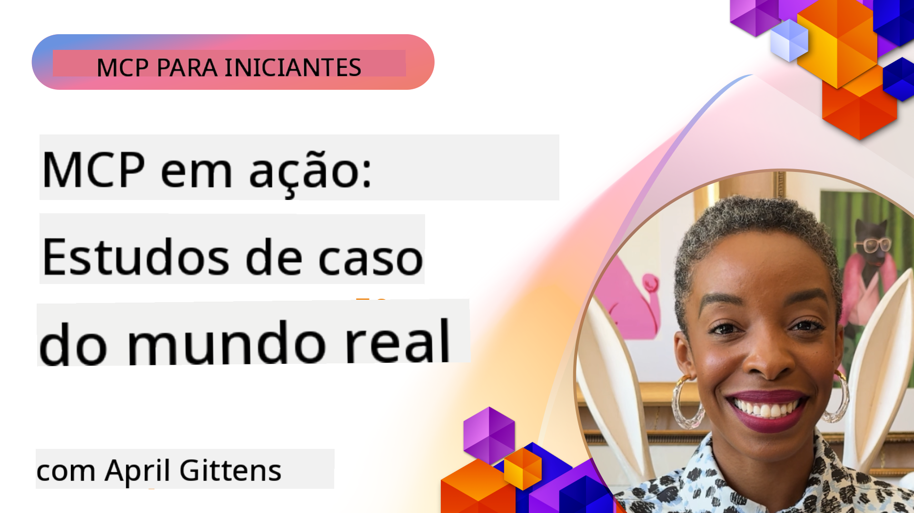

<!--
CO_OP_TRANSLATOR_METADATA:
{
  "original_hash": "1611dc5f6a2a35a789fc4c95fc5bfbe8",
  "translation_date": "2025-09-26T18:17:45+00:00",
  "source_file": "09-CaseStudy/README.md",
  "language_code": "br"
}
-->
# MCP em Ação: Estudos de Caso do Mundo Real

_(Clique na imagem acima para assistir ao vídeo desta lição)_

O Model Context Protocol (MCP) está transformando a forma como aplicações de IA interagem com dados, ferramentas e serviços. Esta seção apresenta estudos de caso do mundo real que demonstram aplicações práticas do MCP em diversos cenários empresariais.

## Visão Geral

Esta seção destaca exemplos concretos de implementações do MCP, mostrando como organizações estão utilizando este protocolo para resolver desafios complexos de negócios. Ao examinar esses estudos de caso, você obterá insights sobre a versatilidade, escalabilidade e benefícios práticos do MCP em cenários reais.

## Objetivos de Aprendizado

Ao explorar esses estudos de caso, você irá:

- Compreender como o MCP pode ser aplicado para resolver problemas específicos de negócios
- Aprender sobre diferentes padrões de integração e abordagens arquiteturais
- Reconhecer as melhores práticas para implementar o MCP em ambientes empresariais
- Obter insights sobre os desafios e soluções encontrados em implementações reais
- Identificar oportunidades para aplicar padrões semelhantes em seus próprios projetos

## Estudos de Caso Destacados

### 1. [Agentes de Viagem com Azure AI – Implementação de Referência](./travelagentsample.md)

Este estudo de caso analisa a solução de referência abrangente da Microsoft que demonstra como construir uma aplicação de planejamento de viagens com múltiplos agentes, alimentada por IA, utilizando MCP, Azure OpenAI e Azure AI Search. O projeto destaca:

- Orquestração de múltiplos agentes através do MCP
- Integração de dados empresariais com Azure AI Search
- Arquitetura segura e escalável usando serviços Azure
- Ferramentas extensíveis com componentes MCP reutilizáveis
- Experiência de usuário conversacional alimentada pelo Azure OpenAI

Os detalhes da arquitetura e implementação fornecem insights valiosos sobre como construir sistemas complexos de múltiplos agentes com o MCP como camada de coordenação.

### 2. [Atualizando Itens do Azure DevOps com Dados do YouTube](./UpdateADOItemsFromYT.md)

Este estudo de caso demonstra uma aplicação prática do MCP para automatizar processos de fluxo de trabalho. Ele mostra como ferramentas MCP podem ser usadas para:

- Extrair dados de plataformas online (YouTube)
- Atualizar itens de trabalho em sistemas Azure DevOps
- Criar fluxos de trabalho de automação repetíveis
- Integrar dados entre sistemas distintos

Este exemplo ilustra como até mesmo implementações relativamente simples do MCP podem proporcionar ganhos significativos de eficiência ao automatizar tarefas rotineiras e melhorar a consistência de dados entre sistemas.

### 3. [Recuperação de Documentação em Tempo Real com MCP](./docs-mcp/README.md)

Este estudo de caso guia você na conexão de um cliente de console Python a um servidor Model Context Protocol (MCP) para recuperar e registrar documentação da Microsoft em tempo real e com contexto. Você aprenderá como:

- Conectar-se a um servidor MCP usando um cliente Python e o SDK oficial do MCP
- Utilizar clientes HTTP de streaming para recuperação eficiente de dados em tempo real
- Chamar ferramentas de documentação no servidor e registrar respostas diretamente no console
- Integrar documentação atualizada da Microsoft ao seu fluxo de trabalho sem sair do terminal

O capítulo inclui uma tarefa prática, um exemplo de código funcional mínimo e links para recursos adicionais para aprendizado mais aprofundado. Veja o passo a passo completo e o código no capítulo vinculado para entender como o MCP pode transformar o acesso à documentação e a produtividade de desenvolvedores em ambientes baseados em console.

### 4. [Aplicativo Web Interativo de Gerador de Plano de Estudos com MCP](./docs-mcp/README.md)

Este estudo de caso demonstra como construir um aplicativo web interativo usando Chainlit e o Model Context Protocol (MCP) para gerar planos de estudo personalizados para qualquer tópico. Os usuários podem especificar um assunto (como "certificação AI-900") e uma duração de estudo (por exemplo, 8 semanas), e o aplicativo fornecerá um cronograma semanal de conteúdo recomendado. O Chainlit permite uma interface de chat conversacional, tornando a experiência envolvente e adaptativa.

- Aplicativo web conversacional alimentado por Chainlit
- Prompts orientados pelo usuário para tópico e duração
- Recomendações de conteúdo semana a semana usando MCP
- Respostas adaptativas em tempo real em uma interface de chat

O projeto ilustra como IA conversacional e MCP podem ser combinados para criar ferramentas educacionais dinâmicas e orientadas pelo usuário em um ambiente web moderno.

### 5. [Documentação no Editor com Servidor MCP no VS Code](./docs-mcp/README.md)

Este estudo de caso demonstra como você pode trazer a documentação do Microsoft Learn diretamente para o ambiente do VS Code usando o servidor MCP—sem mais alternar entre abas do navegador! Você verá como:

- Pesquisar e ler documentos instantaneamente dentro do VS Code usando o painel MCP ou o palette de comandos
- Referenciar documentação e inserir links diretamente em seus arquivos README ou markdown de cursos
- Usar GitHub Copilot e MCP juntos para fluxos de trabalho de documentação e código alimentados por IA
- Validar e aprimorar sua documentação com feedback em tempo real e precisão baseada em fontes da Microsoft
- Integrar MCP com fluxos de trabalho do GitHub para validação contínua de documentação

A implementação inclui:

- Exemplo de configuração `.vscode/mcp.json` para configuração fácil
- Passo a passo com capturas de tela da experiência no editor
- Dicas para combinar Copilot e MCP para máxima produtividade

Este cenário é ideal para autores de cursos, escritores de documentação e desenvolvedores que desejam permanecer focados em seu editor enquanto trabalham com documentos, Copilot e ferramentas de validação—tudo alimentado pelo MCP.

### 6. [Criação de Servidor MCP com APIM](./apimsample.md)

Este estudo de caso fornece um guia passo a passo sobre como criar um servidor MCP usando o Azure API Management (APIM). Ele cobre:

- Configuração de um servidor MCP no Azure API Management
- Exposição de operações de API como ferramentas MCP
- Configuração de políticas para limitação de taxa e segurança
- Teste do servidor MCP usando Visual Studio Code e GitHub Copilot

Este exemplo ilustra como aproveitar as capacidades do Azure para criar um servidor MCP robusto que pode ser usado em diversas aplicações, aprimorando a integração de sistemas de IA com APIs empresariais.

### 7. [Registro MCP no GitHub — Acelerando a Integração Agente](https://github.com/mcp)

Este estudo de caso analisa como o Registro MCP do GitHub, lançado em setembro de 2025, aborda um desafio crítico no ecossistema de IA: a descoberta e implantação fragmentadas de servidores Model Context Protocol (MCP).

#### Visão Geral
O **Registro MCP** resolve o problema crescente de servidores MCP dispersos em repositórios e registros, que anteriormente tornavam a integração lenta e propensa a erros. Esses servidores permitem que agentes de IA interajam com sistemas externos como APIs, bancos de dados e fontes de documentação.

#### Declaração do Problema
Desenvolvedores que constroem fluxos de trabalho com agentes enfrentavam vários desafios:
- **Baixa descobribilidade** de servidores MCP em diferentes plataformas
- **Perguntas redundantes de configuração** espalhadas por fóruns e documentações
- **Riscos de segurança** provenientes de fontes não verificadas e não confiáveis
- **Falta de padronização** na qualidade e compatibilidade dos servidores

#### Arquitetura da Solução
O Registro MCP do GitHub centraliza servidores MCP confiáveis com recursos-chave:
- **Instalação com um clique** via VS Code para configuração simplificada
- **Classificação por relevância** com base em estrelas, atividade e validação da comunidade
- **Integração direta** com GitHub Copilot e outras ferramentas compatíveis com MCP
- **Modelo de contribuição aberta** permitindo que tanto a comunidade quanto parceiros empresariais contribuam

#### Impacto nos Negócios
O registro trouxe melhorias mensuráveis:
- **Onboarding mais rápido** para desenvolvedores usando ferramentas como o Servidor MCP do Microsoft Learn, que transmite documentação oficial diretamente para agentes
- **Maior produtividade** com servidores especializados como `github-mcp-server`, permitindo automação natural do GitHub (criação de PRs, reexecução de CI, escaneamento de código)
- **Maior confiança no ecossistema** por meio de listagens curadas e padrões de configuração transparentes

#### Valor Estratégico
Para profissionais especializados em gerenciamento de ciclo de vida de agentes e fluxos de trabalho reproduzíveis, o Registro MCP oferece:
- **Capacidades de implantação modular de agentes** com componentes padronizados
- **Pipelines de avaliação respaldados pelo registro** para testes e validação consistentes
- **Interoperabilidade entre ferramentas** permitindo integração perfeita entre diferentes plataformas de IA

Este estudo de caso demonstra que o Registro MCP é mais do que apenas um diretório—é uma plataforma fundamental para integração escalável de modelos e implantação de sistemas com agentes.

## Conclusão

Estes sete estudos de caso abrangentes demonstram a notável versatilidade e aplicações práticas do Model Context Protocol em diversos cenários reais. Desde sistemas complexos de planejamento de viagens com múltiplos agentes e gerenciamento de APIs empresariais até fluxos de trabalho de documentação simplificados e o revolucionário Registro MCP do GitHub, esses exemplos mostram como o MCP oferece uma maneira padronizada e escalável de conectar sistemas de IA às ferramentas, dados e serviços necessários para entregar valor excepcional.

Os estudos de caso abrangem múltiplas dimensões de implementação do MCP:
- **Integração Empresarial**: Automação do Azure DevOps e gerenciamento de APIs com Azure
- **Orquestração de Múltiplos Agentes**: Planejamento de viagens com agentes coordenados
- **Produtividade de Desenvolvedores**: Integração com VS Code e acesso à documentação em tempo real
- **Desenvolvimento de Ecossistema**: Registro MCP do GitHub como plataforma fundamental
- **Aplicações Educacionais**: Geradores de planos de estudo interativos e interfaces conversacionais

Ao estudar essas implementações, você obtém insights críticos sobre:
- **Padrões arquiteturais** para diferentes escalas e casos de uso
- **Estratégias de implementação** que equilibram funcionalidade e manutenção
- **Considerações de segurança e escalabilidade** para implantações em produção
- **Melhores práticas** para desenvolvimento de servidores MCP e integração de clientes
- **Pensamento de ecossistema** para construir soluções interconectadas alimentadas por IA

Esses exemplos demonstram coletivamente que o MCP não é apenas um framework teórico, mas um protocolo maduro e pronto para produção, permitindo soluções práticas para desafios complexos de negócios. Seja construindo ferramentas de automação simples ou sistemas sofisticados de múltiplos agentes, os padrões e abordagens ilustrados aqui fornecem uma base sólida para seus próprios projetos MCP.

## Recursos Adicionais

- [Repositório GitHub de Agentes de Viagem com Azure AI](https://github.com/Azure-Samples/azure-ai-travel-agents)
- [Ferramenta MCP do Azure DevOps](https://github.com/microsoft/azure-devops-mcp)
- [Ferramenta MCP do Playwright](https://github.com/microsoft/playwright-mcp)
- [Servidor MCP da Microsoft Docs](https://github.com/MicrosoftDocs/mcp)
- [Registro MCP no GitHub — Acelerando a Integração Agente](https://github.com/mcp)
- [Exemplos da Comunidade MCP](https://github.com/microsoft/mcp)

Próximo: Laboratório Prático [Simplificando Fluxos de Trabalho de IA: Construindo um Servidor MCP com AI Toolkit](../10-StreamliningAIWorkflowsBuildingAnMCPServerWithAIToolkit/README.md)

---

