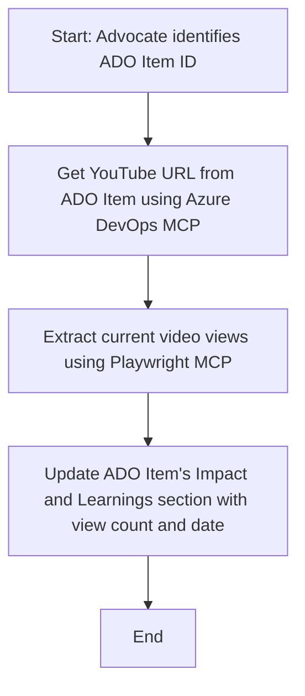

<!--
CO_OP_TRANSLATOR_METADATA:
{
  "original_hash": "14a2dfbea55ef735660a06bd6bdfe5f3",
  "translation_date": "2025-06-13T21:34:26+00:00",
  "source_file": "09-CaseStudy/UpdateADOItemsFromYT.md",
  "language_code": "br"
}
-->
# Case Study: Atualizando Itens do Azure DevOps com Dados do YouTube usando MCP

> **Disclaimer:** Existem ferramentas e relatórios online que já automatizam o processo de atualização dos itens do Azure DevOps com dados de plataformas como o YouTube. O cenário a seguir é apresentado apenas como um exemplo para ilustrar como as ferramentas MCP podem ser aplicadas em tarefas de automação e integração.

## Visão Geral

Este estudo de caso mostra um exemplo de como o Model Context Protocol (MCP) e suas ferramentas podem ser usados para automatizar a atualização de itens de trabalho do Azure DevOps (ADO) com informações obtidas de plataformas online, como o YouTube. O cenário descrito é apenas uma ilustração das capacidades mais amplas dessas ferramentas, que podem ser adaptadas para diversas necessidades similares de automação.

Neste exemplo, um Advocate acompanha sessões online usando itens do ADO, onde cada item inclui a URL de um vídeo do YouTube. Aproveitando as ferramentas MCP, o Advocate pode manter os itens do ADO atualizados com as métricas mais recentes do vídeo, como o número de visualizações, de forma repetível e automatizada. Essa abordagem pode ser generalizada para outros casos em que informações de fontes online precisam ser integradas ao ADO ou outros sistemas.

## Cenário

Um Advocate é responsável por acompanhar o impacto das sessões online e o engajamento da comunidade. Cada sessão é registrada como um item de trabalho do ADO no projeto 'DevRel', e o item contém um campo para a URL do vídeo do YouTube. Para reportar com precisão o alcance da sessão, o Advocate precisa atualizar o item do ADO com o número atual de visualizações do vídeo e a data em que essa informação foi obtida.

## Ferramentas Utilizadas

- [Azure DevOps MCP](https://github.com/microsoft/azure-devops-mcp): Permite acesso programático e atualizações nos itens de trabalho do ADO via MCP.
- [Playwright MCP](https://github.com/microsoft/playwright-mcp): Automatiza ações no navegador para extrair dados ao vivo de páginas web, como estatísticas de vídeos do YouTube.

## Fluxo de Trabalho Passo a Passo

1. **Identificar o Item ADO**: Comece com o ID do item de trabalho do ADO (ex.: 1234) no projeto 'DevRel'.
2. **Obter a URL do YouTube**: Use a ferramenta Azure DevOps MCP para recuperar a URL do vídeo do YouTube do item.
3. **Extrair Visualizações do Vídeo**: Use a ferramenta Playwright MCP para navegar até a URL do YouTube e extrair o número atual de visualizações.
4. **Atualizar o Item ADO**: Registre a contagem mais recente de visualizações e a data da obtenção na seção 'Impact and Learnings' do item do ADO usando a ferramenta Azure DevOps MCP.

## Exemplo de Prompt

```bash
- Work with the ADO Item ID: 1234
- The project is '2025-Awesome'
- Get the YouTube URL for the ADO item
- Use Playwright to get the current views from the YouTube video
- Update the ADO item with the current video views and the updated date of the information
```

## Diagrama Mermaid



## Implementação Técnica

- **Orquestração MCP**: O fluxo é coordenado por um servidor MCP, que gerencia o uso das ferramentas Azure DevOps MCP e Playwright MCP.
- **Automação**: O processo pode ser acionado manualmente ou agendado para rodar em intervalos regulares, mantendo os itens do ADO atualizados.
- **Extensibilidade**: O mesmo padrão pode ser aplicado para atualizar itens do ADO com outras métricas online (ex.: curtidas, comentários) ou de outras plataformas.

## Resultados e Impacto

- **Eficiência**: Reduz o esforço manual dos Advocates ao automatizar a obtenção e atualização das métricas dos vídeos.
- **Precisão**: Garante que os itens do ADO reflitam os dados mais recentes disponíveis nas fontes online.
- **Repetibilidade**: Fornece um fluxo reutilizável para cenários semelhantes envolvendo outras fontes de dados ou métricas.

## Referências

- [Azure DevOps MCP](https://github.com/microsoft/azure-devops-mcp)
- [Playwright MCP](https://github.com/microsoft/playwright-mcp)
- [Model Context Protocol (MCP)](https://modelcontextprotocol.io/)

**Aviso Legal**:  
Este documento foi traduzido utilizando o serviço de tradução por IA [Co-op Translator](https://github.com/Azure/co-op-translator). Embora nos esforcemos para garantir a precisão, esteja ciente de que traduções automáticas podem conter erros ou imprecisões. O documento original em seu idioma nativo deve ser considerado a fonte oficial. Para informações críticas, recomenda-se tradução profissional feita por humanos. Não nos responsabilizamos por quaisquer mal-entendidos ou interpretações incorretas decorrentes do uso desta tradução.