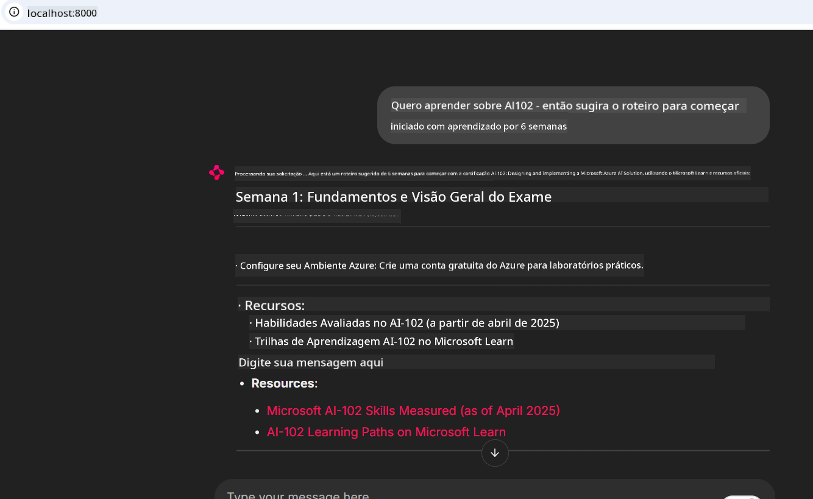

<!--
CO_OP_TRANSLATOR_METADATA:
{
  "original_hash": "4319d291c9d124ecafea52b3d04bfa0e",
  "translation_date": "2025-07-14T06:23:11+00:00",
  "source_file": "09-CaseStudy/docs-mcp/README.md",
  "language_code": "br"
}
-->
# Estudo de Caso: Conectando ao Servidor Microsoft Learn Docs MCP a partir de um Cliente

Você já se pegou alternando entre sites de documentação, Stack Overflow e abas infinitas do motor de busca, tudo isso enquanto tenta resolver um problema no seu código? Talvez você tenha um segundo monitor só para docs, ou fique constantemente alternando entre seu IDE e o navegador. Não seria melhor se você pudesse trazer a documentação diretamente para o seu fluxo de trabalho — integrada aos seus apps, seu IDE ou até mesmo suas próprias ferramentas personalizadas? Neste estudo de caso, vamos explorar exatamente como fazer isso conectando-se diretamente ao servidor Microsoft Learn Docs MCP a partir da sua própria aplicação cliente.

## Visão Geral

O desenvolvimento moderno é mais do que apenas escrever código — é sobre encontrar a informação certa no momento certo. A documentação está em toda parte, mas raramente onde você mais precisa: dentro das suas ferramentas e fluxos de trabalho. Ao integrar a recuperação de documentação diretamente nas suas aplicações, você pode economizar tempo, reduzir a troca de contexto e aumentar a produtividade. Nesta seção, vamos mostrar como conectar um cliente ao servidor Microsoft Learn Docs MCP, para que você possa acessar documentação em tempo real e contextualizada sem sair do seu app.

Vamos passar pelo processo de estabelecer a conexão, enviar uma requisição e lidar com respostas em streaming de forma eficiente. Essa abordagem não só simplifica seu fluxo de trabalho, como também abre caminho para construir ferramentas de desenvolvimento mais inteligentes e úteis.

## Objetivos de Aprendizagem

Por que estamos fazendo isso? Porque as melhores experiências para desenvolvedores são aquelas que eliminam atritos. Imagine um mundo onde seu editor de código, chatbot ou app web possa responder suas dúvidas de documentação instantaneamente, usando o conteúdo mais recente do Microsoft Learn. Ao final deste capítulo, você saberá como:

- Entender o básico da comunicação cliente-servidor MCP para documentação
- Implementar uma aplicação console ou web para conectar ao servidor Microsoft Learn Docs MCP
- Usar clientes HTTP com streaming para recuperação de documentação em tempo real
- Registrar e interpretar respostas de documentação na sua aplicação

Você verá como essas habilidades podem ajudar a construir ferramentas que não são apenas reativas, mas verdadeiramente interativas e conscientes do contexto.

## Cenário 1 - Recuperação de Documentação em Tempo Real com MCP

Neste cenário, vamos mostrar como conectar um cliente ao servidor Microsoft Learn Docs MCP, para que você possa acessar documentação em tempo real e contextualizada sem sair do seu app.

Vamos colocar isso em prática. Sua tarefa é escrever um app que se conecte ao servidor Microsoft Learn Docs MCP, invoque a ferramenta `microsoft_docs_search` e registre a resposta em streaming no console.

### Por que essa abordagem?
Porque ela é a base para construir integrações mais avançadas — seja para alimentar um chatbot, uma extensão de IDE ou um painel web.

Você encontrará o código e as instruções para este cenário na pasta [`solution`](./solution/README.md) dentro deste estudo de caso. Os passos vão guiá-lo na configuração da conexão:
- Use o SDK oficial MCP e cliente HTTP com suporte a streaming para a conexão
- Chame a ferramenta `microsoft_docs_search` com um parâmetro de consulta para recuperar documentação
- Implemente registro adequado e tratamento de erros
- Crie uma interface de console interativa para permitir que usuários façam múltiplas consultas de busca

Este cenário demonstra como:
- Conectar ao servidor Docs MCP
- Enviar uma consulta
- Analisar e imprimir os resultados

Veja como a execução da solução pode ser:

```
Prompt> What is Azure Key Vault?
Answer> Azure Key Vault is a cloud service for securely storing and accessing secrets. ...
```

Abaixo está uma solução mínima de exemplo. O código completo e detalhes estão disponíveis na pasta de solução.

<details>
<summary>Python</summary>

```python
import asyncio
from mcp.client.streamable_http import streamablehttp_client
from mcp import ClientSession

async def main():
    async with streamablehttp_client("https://learn.microsoft.com/api/mcp") as (read_stream, write_stream, _):
        async with ClientSession(read_stream, write_stream) as session:
            await session.initialize()
            result = await session.call_tool("microsoft_docs_search", {"query": "Azure Functions best practices"})
            print(result.content)

if __name__ == "__main__":
    asyncio.run(main())
```

- Para a implementação completa e registro, veja [`scenario1.py`](../../../../09-CaseStudy/docs-mcp/solution/python/scenario1.py).
- Para instruções de instalação e uso, consulte o arquivo [`README.md`](./solution/python/README.md) na mesma pasta.
</details>

## Cenário 2 - Aplicação Web Interativa para Gerador de Plano de Estudos com MCP

Neste cenário, você vai aprender como integrar o Docs MCP em um projeto de desenvolvimento web. O objetivo é permitir que usuários pesquisem a documentação do Microsoft Learn diretamente de uma interface web, tornando a documentação instantaneamente acessível dentro do seu app ou site.

Você verá como:
- Configurar um app web
- Conectar ao servidor Docs MCP
- Lidar com a entrada do usuário e exibir os resultados

Veja como a execução da solução pode ser:

```
User> I want to learn about AI102 - so suggest the roadmap to get it started from learn for 6 weeks

Assistant> Here’s a detailed 6-week roadmap to start your preparation for the AI-102: Designing and Implementing a Microsoft Azure AI Solution certification, using official Microsoft resources and focusing on exam skills areas:

---
## Week 1: Introduction & Fundamentals
- **Understand the Exam**: Review the [AI-102 exam skills outline](https://learn.microsoft.com/en-us/credentials/certifications/exams/ai-102/).
- **Set up Azure**: Sign up for a free Azure account if you don't have one.
- **Learning Path**: [Introduction to Azure AI services](https://learn.microsoft.com/en-us/training/modules/intro-to-azure-ai/)
- **Focus**: Get familiar with Azure portal, AI capabilities, and necessary tools.

....more weeks of the roadmap...

Let me know if you want module-specific recommendations or need more customized weekly tasks!
```

Abaixo está uma solução mínima de exemplo. O código completo e detalhes estão disponíveis na pasta de solução.



<details>
<summary>Python (Chainlit)</summary>

Chainlit é um framework para construir apps web de IA conversacional. Ele facilita a criação de chatbots e assistentes interativos que podem chamar ferramentas MCP e exibir resultados em tempo real. É ideal para prototipagem rápida e interfaces amigáveis.

```python
import chainlit as cl
import requests

MCP_URL = "https://learn.microsoft.com/api/mcp"

@cl.on_message
def handle_message(message):
    query = {"question": message}
    response = requests.post(MCP_URL, json=query)
    if response.ok:
        result = response.json()
        cl.Message(content=result.get("answer", "No answer found.")).send()
    else:
        cl.Message(content="Error: " + response.text).send()
```

- Para a implementação completa, veja [`scenario2.py`](../../../../09-CaseStudy/docs-mcp/solution/python/scenario2.py).
- Para instruções de configuração e execução, consulte o [`README.md`](./solution/python/README.md).
</details>

## Cenário 3: Documentação Dentro do Editor com MCP Server no VS Code

Se você quer ter o Microsoft Learn Docs diretamente dentro do seu VS Code (em vez de ficar trocando abas do navegador), pode usar o servidor MCP no seu editor. Isso permite que você:
- Pesquise e leia docs no VS Code sem sair do ambiente de codificação.
- Referencie documentação e insira links diretamente nos seus arquivos README ou de curso.
- Aproveite o GitHub Copilot e MCP juntos para um fluxo de trabalho de documentação alimentado por IA, sem interrupções.

**Você verá como:**
- Adicionar um arquivo válido `.vscode/mcp.json` na raiz do seu workspace (veja o exemplo abaixo).
- Abrir o painel MCP ou usar a paleta de comandos no VS Code para buscar e inserir docs.
- Referenciar documentação diretamente nos seus arquivos markdown enquanto trabalha.
- Combinar esse fluxo com o GitHub Copilot para ainda mais produtividade.

Aqui está um exemplo de como configurar o servidor MCP no VS Code:

```json
{
  "servers": {
    "LearnDocsMCP": {
      "url": "https://learn.microsoft.com/api/mcp"
    }
  }
}
```

</details>

> Para um passo a passo detalhado com capturas de tela e guia passo a passo, veja [`README.md`](./solution/scenario3/README.md).


Essa abordagem é ideal para quem cria cursos técnicos, escreve documentação ou desenvolve código com necessidade frequente de referências.

## Principais Lições

Integrar documentação diretamente nas suas ferramentas não é apenas uma conveniência — é uma mudança radical para a produtividade. Ao conectar-se ao servidor Microsoft Learn Docs MCP a partir do seu cliente, você pode:

- Eliminar a troca de contexto entre seu código e a documentação
- Recuperar docs atualizadas e contextualizadas em tempo real
- Construir ferramentas de desenvolvimento mais inteligentes e interativas

Essas habilidades vão ajudar você a criar soluções que são não só eficientes, mas também agradáveis de usar.

## Recursos Adicionais

Para aprofundar seu conhecimento, explore estes recursos oficiais:

- [Microsoft Learn Docs MCP Server (GitHub)](https://github.com/MicrosoftDocs/mcp)
- [Comece com Azure MCP Server (mcp-python)](https://learn.microsoft.com/en-us/azure/developer/azure-mcp-server/get-started#create-the-python-app)
- [O que é o Azure MCP Server?](https://learn.microsoft.com/en-us/azure/developer/azure-mcp-server/)
- [Introdução ao Model Context Protocol (MCP)](https://modelcontextprotocol.io/introduction)
- [Adicionar plugins de um MCP Server (Python)](https://learn.microsoft.com/en-us/semantic-kernel/concepts/plugins/adding-mcp-plugins)

**Aviso Legal**:  
Este documento foi traduzido utilizando o serviço de tradução por IA [Co-op Translator](https://github.com/Azure/co-op-translator). Embora nos esforcemos para garantir a precisão, esteja ciente de que traduções automáticas podem conter erros ou imprecisões. O documento original em seu idioma nativo deve ser considerado a fonte autorizada. Para informações críticas, recomenda-se tradução profissional humana. Não nos responsabilizamos por quaisquer mal-entendidos ou interpretações incorretas decorrentes do uso desta tradução.