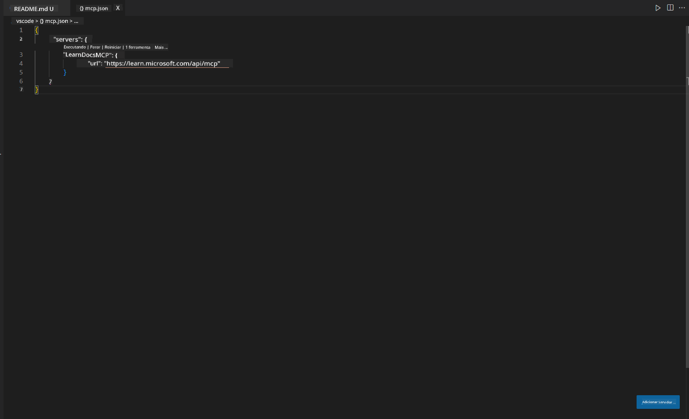
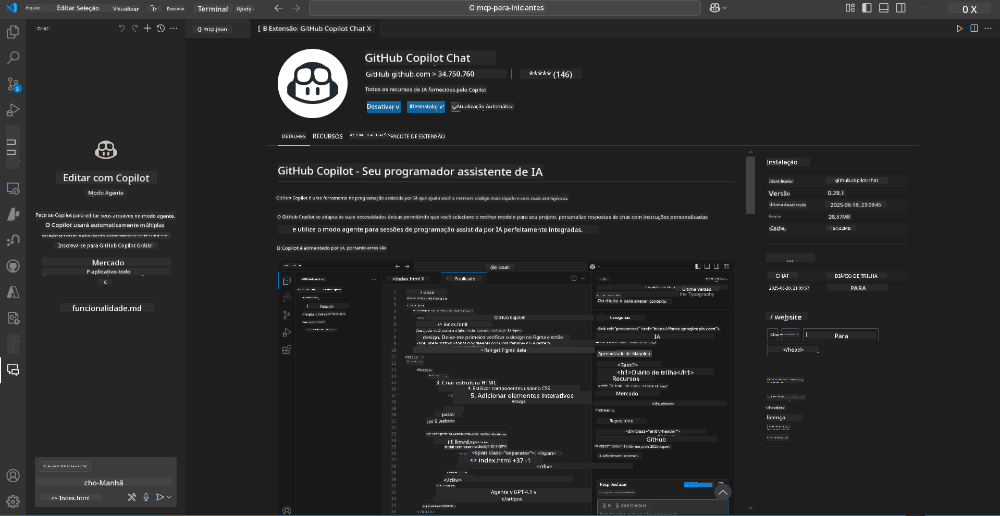
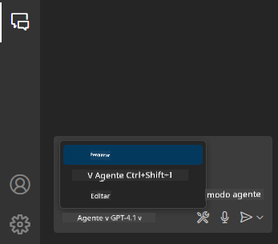
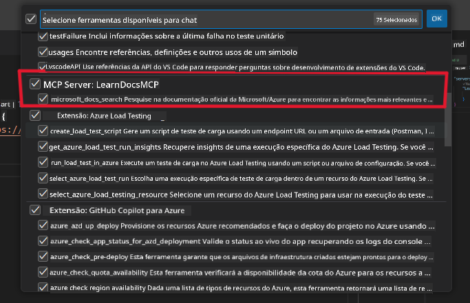
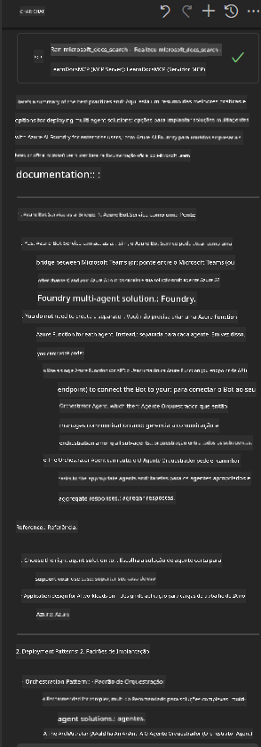

<!--
CO_OP_TRANSLATOR_METADATA:
{
  "original_hash": "db532b1ec386c9ce38c791653dc3c881",
  "translation_date": "2025-07-14T06:50:39+00:00",
  "source_file": "09-CaseStudy/docs-mcp/solution/scenario3/README.md",
  "language_code": "br"
}
-->
# Cenário 3: Documentação no Editor com o Servidor MCP no VS Code

## Visão Geral

Neste cenário, você vai aprender como trazer a documentação do Microsoft Learn diretamente para o seu ambiente do Visual Studio Code usando o servidor MCP. Em vez de ficar alternando entre abas do navegador para buscar documentação, você pode acessar, pesquisar e consultar os documentos oficiais diretamente dentro do seu editor. Essa abordagem otimiza seu fluxo de trabalho, mantém seu foco e permite uma integração perfeita com ferramentas como o GitHub Copilot.

- Pesquise e leia a documentação dentro do VS Code sem sair do seu ambiente de codificação.
- Consulte a documentação e insira links diretamente nos seus arquivos README ou de curso.
- Use o GitHub Copilot e o MCP juntos para um fluxo de trabalho integrado e com suporte de IA.

## Objetivos de Aprendizagem

Ao final deste capítulo, você entenderá como configurar e usar o servidor MCP dentro do VS Code para melhorar seu fluxo de trabalho de documentação e desenvolvimento. Você será capaz de:

- Configurar seu workspace para usar o servidor MCP na busca de documentação.
- Pesquisar e inserir documentação diretamente do VS Code.
- Combinar o poder do GitHub Copilot e do MCP para um fluxo de trabalho mais produtivo e com suporte de IA.

Essas habilidades vão ajudar você a manter o foco, melhorar a qualidade da documentação e aumentar sua produtividade como desenvolvedor ou redator técnico.

## Solução

Para ter acesso à documentação dentro do editor, você seguirá uma série de passos que integram o servidor MCP com o VS Code e o GitHub Copilot. Essa solução é ideal para autores de cursos, redatores de documentação e desenvolvedores que querem manter o foco no editor enquanto trabalham com docs e Copilot.

- Adicione rapidamente links de referência a um README enquanto escreve a documentação de um curso ou projeto.
- Use o Copilot para gerar código e o MCP para encontrar e citar documentos relevantes instantaneamente.
- Mantenha o foco no editor e aumente sua produtividade.

### Guia Passo a Passo

Para começar, siga estes passos. Para cada etapa, você pode adicionar uma captura de tela da pasta de assets para ilustrar visualmente o processo.

1. **Adicione a configuração do MCP:**  
   Na raiz do seu projeto, crie um arquivo `.vscode/mcp.json` e adicione a seguinte configuração:  
   ```json
   {
     "servers": {
       "LearnDocsMCP": {
         "url": "https://learn.microsoft.com/api/mcp"
       }
     }
   }
   ```  
   Essa configuração informa ao VS Code como se conectar ao [`Microsoft Learn Docs MCP server`](https://github.com/MicrosoftDocs/mcp).
   
   
    
2. **Abra o painel do GitHub Copilot Chat:**  
   Se você ainda não tem a extensão do GitHub Copilot instalada, vá até a visualização de Extensões no VS Code e instale-a. Você pode baixá-la diretamente do [Visual Studio Code Marketplace](https://marketplace.visualstudio.com/items?itemName=GitHub.copilot-chat). Depois, abra o painel do Copilot Chat na barra lateral.

   

3. **Ative o modo agente e verifique as ferramentas:**  
   No painel do Copilot Chat, ative o modo agente.

   

   Após ativar o modo agente, verifique se o servidor MCP está listado como uma das ferramentas disponíveis. Isso garante que o agente do Copilot possa acessar o servidor de documentação para buscar informações relevantes.
   
   

4. **Inicie um novo chat e faça perguntas ao agente:**  
   Abra um novo chat no painel do Copilot Chat. Agora você pode fazer perguntas ao agente sobre documentação. O agente usará o servidor MCP para buscar e exibir a documentação relevante do Microsoft Learn diretamente no seu editor.

   - *"Estou tentando montar um plano de estudos para o tópico X. Vou estudá-lo por 8 semanas, para cada semana, sugira o conteúdo que devo abordar."*

   

5. **Consulta ao vivo:**

   > Vamos pegar uma consulta ao vivo da seção [#get-help](https://discord.gg/D6cRhjHWSC) no Discord do Azure AI Foundry ([ver mensagem original](https://discord.com/channels/1113626258182504448/1385498306720829572)):
   
   *"Estou buscando respostas sobre como implantar uma solução multiagente com agentes de IA desenvolvidos no Azure AI Foundry. Vejo que não há um método direto de implantação, como canais do Copilot Studio. Então, quais são as diferentes formas de fazer essa implantação para que usuários corporativos possam interagir e realizar o trabalho?  
Há vários artigos/blogs que dizem que podemos usar o serviço Azure Bot para fazer essa ponte entre o MS Teams e os agentes do Azure AI Foundry. Isso funcionaria se eu configurar um bot do Azure que se conecta ao Orchestrator Agent no Azure AI Foundry via Azure Function para realizar a orquestração, ou preciso criar uma Azure Function para cada agente de IA da solução multiagente para fazer a orquestração no Bot Framework? Outras sugestões são muito bem-vindas."*

   

   O agente responderá com links e resumos relevantes da documentação, que você pode inserir diretamente nos seus arquivos markdown ou usar como referência no seu código.
   
### Consultas de Exemplo

Aqui estão algumas consultas que você pode testar. Elas demonstram como o servidor MCP e o Copilot podem trabalhar juntos para fornecer documentação instantânea, contextualizada e referências sem sair do VS Code:

- "Mostre como usar triggers do Azure Functions."
- "Insira um link para a documentação oficial do Azure Key Vault."
- "Quais são as melhores práticas para proteger recursos do Azure?"
- "Encontre um quickstart para serviços de IA do Azure."

Essas consultas demonstram como o servidor MCP e o Copilot podem trabalhar juntos para fornecer documentação instantânea, contextualizada e referências sem sair do VS Code.

---

**Aviso Legal**:  
Este documento foi traduzido utilizando o serviço de tradução por IA [Co-op Translator](https://github.com/Azure/co-op-translator). Embora nos esforcemos para garantir a precisão, esteja ciente de que traduções automáticas podem conter erros ou imprecisões. O documento original em seu idioma nativo deve ser considerado a fonte autorizada. Para informações críticas, recomenda-se tradução profissional humana. Não nos responsabilizamos por quaisquer mal-entendidos ou interpretações incorretas decorrentes do uso desta tradução.