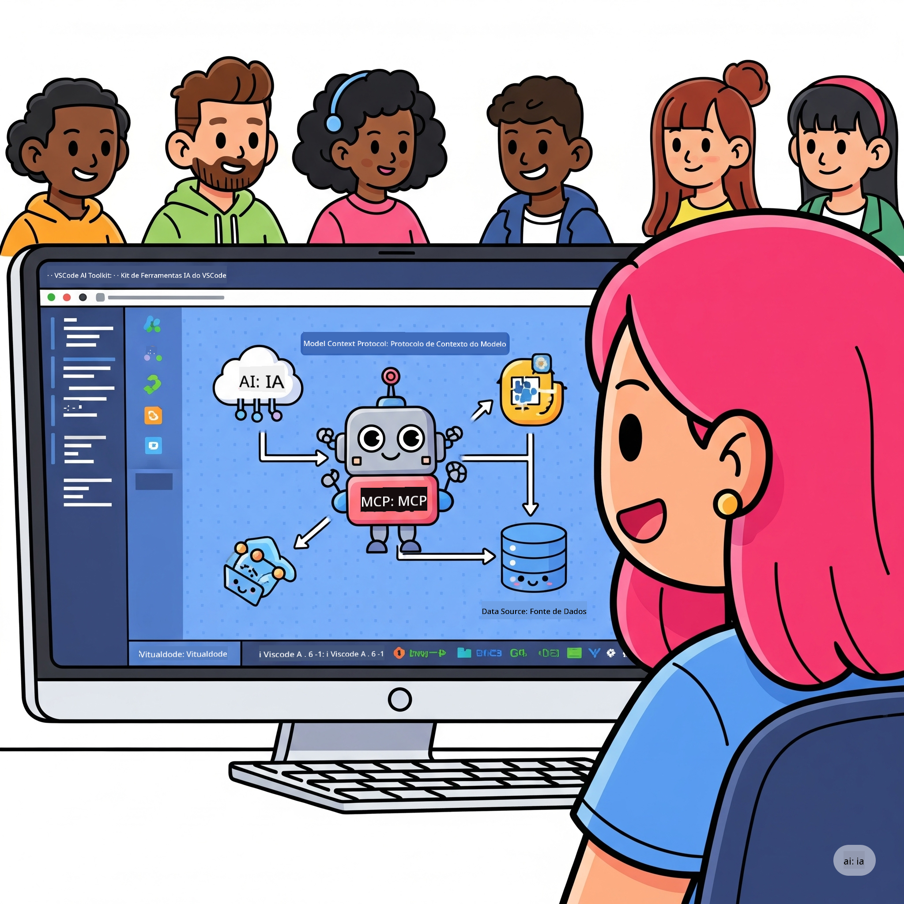
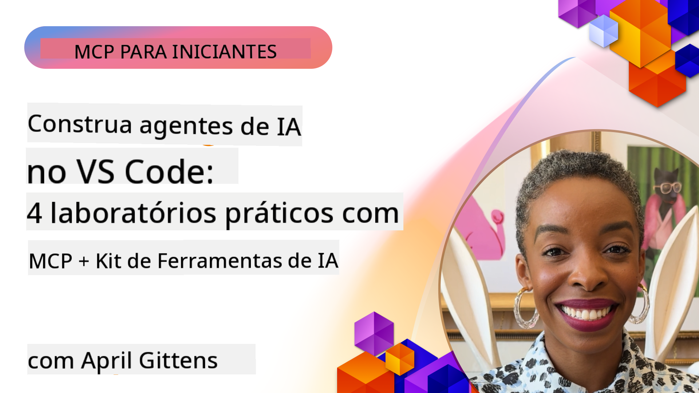

<!--
CO_OP_TRANSLATOR_METADATA:
{
  "original_hash": "1b000fd6e1b04c047578bfc5d07d54eb",
  "translation_date": "2025-08-18T17:18:23+00:00",
  "source_file": "10-StreamliningAIWorkflowsBuildingAnMCPServerWithAIToolkit/README.md",
  "language_code": "br"
}
-->
# Otimizando Fluxos de Trabalho de IA: Construindo um Servidor MCP com AI Toolkit

## 🎯 Visão Geral

_(Clique na imagem acima para assistir ao vídeo desta lição)_

Bem-vindo ao **Workshop do Model Context Protocol (MCP)**! Este workshop prático combina duas tecnologias de ponta para revolucionar o desenvolvimento de aplicações de IA:

- **🔗 Model Context Protocol (MCP)**: Um padrão aberto para integração perfeita de ferramentas de IA
- **🛠️ AI Toolkit para Visual Studio Code (AITK)**: A poderosa extensão de desenvolvimento de IA da Microsoft

### 🎓 O que você vai aprender

Ao final deste workshop, você dominará a arte de construir aplicações inteligentes que conectam modelos de IA a ferramentas e serviços do mundo real. Desde testes automatizados até integrações de API personalizadas, você adquirirá habilidades práticas para resolver desafios complexos de negócios.

## 🏗️ Stack de Tecnologia

### 🔌 Model Context Protocol (MCP)

MCP é o **"USB-C para IA"** - um padrão universal que conecta modelos de IA a ferramentas e fontes de dados externas.

**✨ Principais Recursos:**

- 🔄 **Integração Padronizada**: Interface universal para conexões entre IA e ferramentas
- 🏛️ **Arquitetura Flexível**: Servidores locais e remotos via transporte stdio/SSE
- 🧰 **Ecossistema Rico**: Ferramentas, prompts e recursos em um único protocolo
- 🔒 **Pronto para Empresas**: Segurança e confiabilidade integradas

**🎯 Por que o MCP é importante:**
Assim como o USB-C eliminou o caos dos cabos, o MCP elimina a complexidade das integrações de IA. Um protocolo, possibilidades infinitas.

### 🤖 AI Toolkit para Visual Studio Code (AITK)

A extensão de desenvolvimento de IA da Microsoft que transforma o VS Code em uma plataforma poderosa para IA.

**🚀 Capacidades Principais:**

- 📦 **Catálogo de Modelos**: Acesse modelos do Azure AI, GitHub, Hugging Face, Ollama
- ⚡ **Inferência Local**: Execução otimizada para CPU/GPU/NPU com ONNX
- 🏗️ **Construtor de Agentes**: Desenvolvimento visual de agentes de IA com integração MCP
- 🎭 **Multi-Modal**: Suporte para texto, visão e saída estruturada

**💡 Benefícios para o Desenvolvimento:**

- Implantação de modelos sem configuração
- Engenharia visual de prompts
- Playground de testes em tempo real
- Integração perfeita com servidores MCP

## 📚 Jornada de Aprendizado

### [🚀 Módulo 1: Fundamentos do AI Toolkit](./lab1/README.md)

**Duração**: 15 minutos

- 🛠️ Instale e configure o AI Toolkit para VS Code
- 🗂️ Explore o Catálogo de Modelos (100+ modelos do GitHub, ONNX, OpenAI, Anthropic, Google)
- 🎮 Domine o Playground Interativo para testes de modelos em tempo real
- 🤖 Construa seu primeiro agente de IA com o Construtor de Agentes
- 📊 Avalie o desempenho do modelo com métricas integradas (F1, relevância, similaridade, coerência)
- ⚡ Aprenda capacidades de processamento em lote e suporte multi-modal

**🎯 Resultado de Aprendizado**: Crie um agente de IA funcional com compreensão abrangente das capacidades do AITK

### [🌐 Módulo 2: Fundamentos do MCP com AI Toolkit](./lab2/README.md)

**Duração**: 20 minutos

- 🧠 Domine a arquitetura e os conceitos do Model Context Protocol (MCP)
- 🌐 Explore o ecossistema de servidores MCP da Microsoft
- 🤖 Construa um agente de automação de navegador usando o servidor MCP do Playwright
- 🔧 Integre servidores MCP com o Construtor de Agentes do AI Toolkit
- 📊 Configure e teste ferramentas MCP dentro de seus agentes
- 🚀 Exporte e implante agentes com suporte a MCP para uso em produção

**🎯 Resultado de Aprendizado**: Implante um agente de IA potencializado com ferramentas externas via MCP

### [🔧 Módulo 3: Desenvolvimento Avançado de MCP com AI Toolkit](./lab3/README.md)

**Duração**: 20 minutos

- 💻 Crie servidores MCP personalizados usando o AI Toolkit
- 🐍 Configure e utilize o mais recente SDK Python do MCP (v1.9.3)
- 🔍 Configure e utilize o MCP Inspector para depuração
- 🛠️ Construa um Servidor MCP de Clima com fluxos de trabalho de depuração profissionais
- 🧪 Depure servidores MCP em ambientes do Construtor de Agentes e do Inspector

**🎯 Resultado de Aprendizado**: Desenvolva e depure servidores MCP personalizados com ferramentas modernas

### [🐙 Módulo 4: Desenvolvimento Prático de MCP - Servidor Personalizado de Clone do GitHub](./lab4/README.md)

**Duração**: 30 minutos

- 🏗️ Construa um Servidor MCP de Clone do GitHub para fluxos de trabalho de desenvolvimento
- 🔄 Implemente clonagem inteligente de repositórios com validação e tratamento de erros
- 📁 Crie gerenciamento inteligente de diretórios e integração com VS Code
- 🤖 Use o Modo de Agente do GitHub Copilot com ferramentas MCP personalizadas
- 🛡️ Aplique confiabilidade pronta para produção e compatibilidade entre plataformas

**🎯 Resultado de Aprendizado**: Implante um servidor MCP pronto para produção que otimiza fluxos de trabalho reais de desenvolvimento

## 💡 Aplicações Reais e Impacto

### 🏢 Casos de Uso Empresariais

#### 🔄 Automação DevOps

Transforme seu fluxo de trabalho de desenvolvimento com automação inteligente:

- **Gerenciamento Inteligente de Repositórios**: Revisão de código e decisões de merge orientadas por IA
- **CI/CD Inteligente**: Otimização automática de pipelines com base em alterações de código
- **Triagem de Problemas**: Classificação automática de bugs e atribuição

#### 🧪 Revolução na Garantia de Qualidade

Eleve os testes com automação orientada por IA:

- **Geração Inteligente de Testes**: Crie suítes de testes abrangentes automaticamente
- **Testes de Regressão Visual**: Detecção de mudanças na interface com IA
- **Monitoramento de Desempenho**: Identificação e resolução proativa de problemas

#### 📊 Inteligência em Pipeline de Dados

Construa fluxos de trabalho de processamento de dados mais inteligentes:

- **Processos ETL Adaptativos**: Transformações de dados auto-otimizadas
- **Detecção de Anomalias**: Monitoramento de qualidade de dados em tempo real
- **Roteamento Inteligente**: Gerenciamento inteligente de fluxo de dados

#### 🎧 Melhoria na Experiência do Cliente

Crie interações excepcionais com clientes:

- **Suporte Contextual**: Agentes de IA com acesso ao histórico do cliente
- **Resolução Proativa de Problemas**: Serviço ao cliente preditivo
- **Integração Multi-Canal**: Experiência unificada de IA em várias plataformas

## 🛠️ Pré-requisitos e Configuração

### 💻 Requisitos do Sistema

| Componente | Requisito | Observações |
|------------|-----------|-------------|
| **Sistema Operacional** | Windows 10+, macOS 10.15+, Linux | Qualquer sistema operacional moderno |
| **Visual Studio Code** | Última versão estável | Necessário para AITK |
| **Node.js** | v18.0+ e npm | Para desenvolvimento de servidores MCP |
| **Python** | 3.10+ | Opcional para servidores MCP em Python |
| **Memória** | Mínimo de 8GB de RAM | 16GB recomendados para modelos locais |

### 🔧 Ambiente de Desenvolvimento

#### Extensões Recomendadas para VS Code

- **AI Toolkit** (ms-windows-ai-studio.windows-ai-studio)
- **Python** (ms-python.python)
- **Depurador Python** (ms-python.debugpy)
- **GitHub Copilot** (GitHub.copilot) - Opcional, mas útil

#### Ferramentas Opcionais

- **uv**: Gerenciador de pacotes moderno para Python
- **MCP Inspector**: Ferramenta visual de depuração para servidores MCP
- **Playwright**: Para exemplos de automação web

## 🎖️ Resultados de Aprendizado e Caminho de Certificação

### 🏆 Lista de Verificação de Domínio de Habilidades

Ao concluir este workshop, você alcançará domínio em:

#### 🎯 Competências Principais

- [ ] **Domínio do Protocolo MCP**: Compreensão profunda da arquitetura e padrões de implementação
- [ ] **Proficiência em AITK**: Uso avançado do AI Toolkit para desenvolvimento rápido
- [ ] **Desenvolvimento de Servidores Personalizados**: Construção, implantação e manutenção de servidores MCP para produção
- [ ] **Excelência em Integração de Ferramentas**: Conexão perfeita entre IA e fluxos de trabalho existentes
- [ ] **Aplicação para Resolução de Problemas**: Aplicação das habilidades aprendidas em desafios reais de negócios

#### 🔧 Habilidades Técnicas

- [ ] Configurar e instalar o AI Toolkit no VS Code
- [ ] Projetar e implementar servidores MCP personalizados
- [ ] Integrar Modelos do GitHub com a arquitetura MCP
- [ ] Construir fluxos de trabalho de testes automatizados com Playwright
- [ ] Implantar agentes de IA para uso em produção
- [ ] Depurar e otimizar o desempenho de servidores MCP

#### 🚀 Capacidades Avançadas

- [ ] Arquitetar integrações de IA em escala empresarial
- [ ] Implementar práticas recomendadas de segurança para aplicações de IA
- [ ] Projetar arquiteturas escaláveis de servidores MCP
- [ ] Criar cadeias de ferramentas personalizadas para domínios específicos
- [ ] Mentorar outros no desenvolvimento nativo de IA

## 📖 Recursos Adicionais

- [Especificação MCP](https://modelcontextprotocol.io/docs)
- [Repositório GitHub do AI Toolkit](https://github.com/microsoft/vscode-ai-toolkit)
- [Coleção de Servidores MCP de Exemplo](https://github.com/modelcontextprotocol/servers)
- [Guia de Melhores Práticas](https://modelcontextprotocol.io/docs/best-practices)

---

**🚀 Pronto para revolucionar seu fluxo de trabalho de desenvolvimento de IA?**

Vamos construir juntos o futuro das aplicações inteligentes com MCP e AI Toolkit!

**Aviso Legal**:  
Este documento foi traduzido utilizando o serviço de tradução por IA [Co-op Translator](https://github.com/Azure/co-op-translator). Embora nos esforcemos para garantir a precisão, esteja ciente de que traduções automatizadas podem conter erros ou imprecisões. O documento original em seu idioma nativo deve ser considerado a fonte autoritativa. Para informações críticas, recomenda-se a tradução profissional realizada por humanos. Não nos responsabilizamos por quaisquer mal-entendidos ou interpretações equivocadas decorrentes do uso desta tradução.