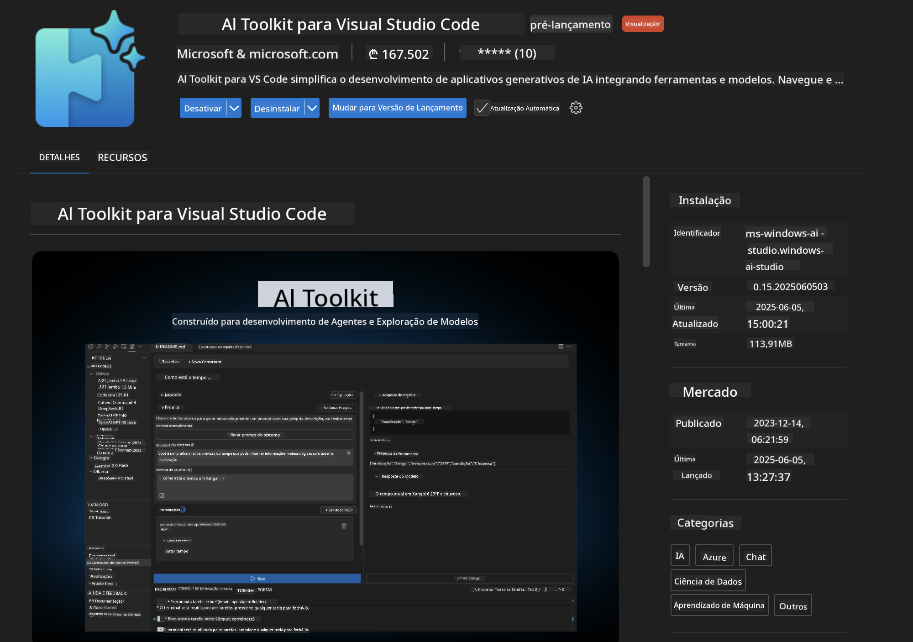
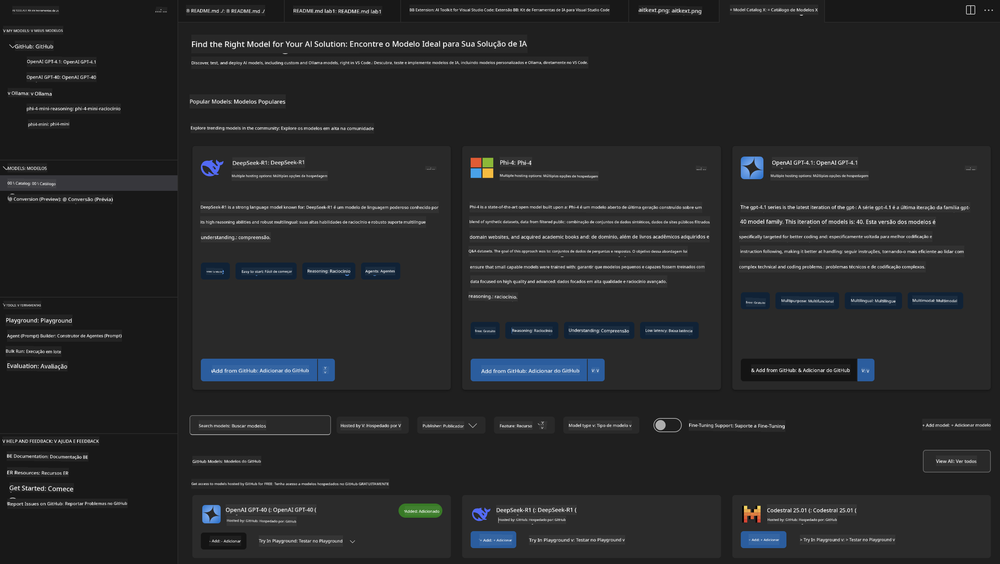
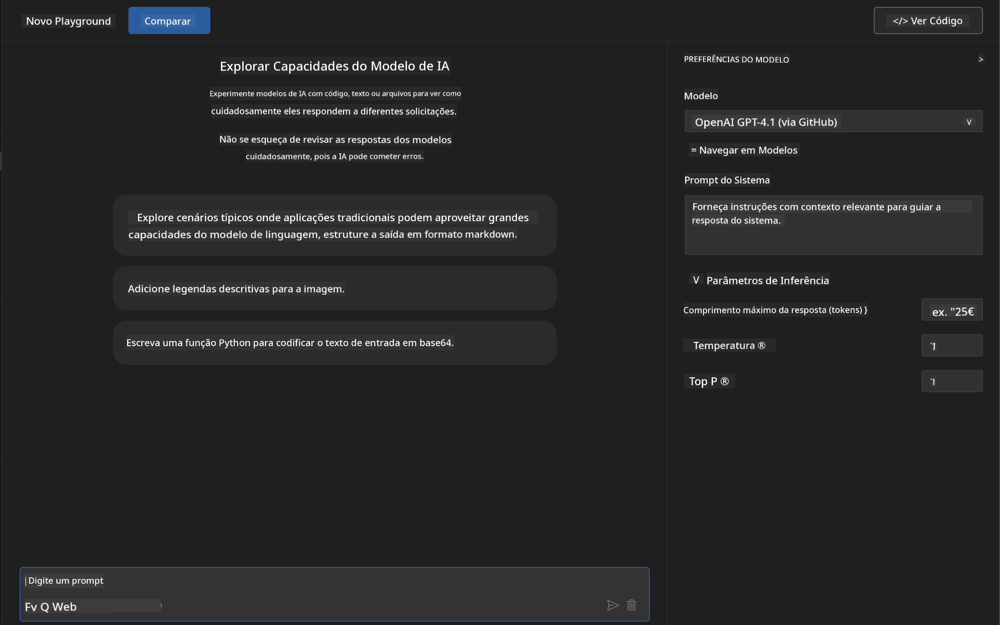
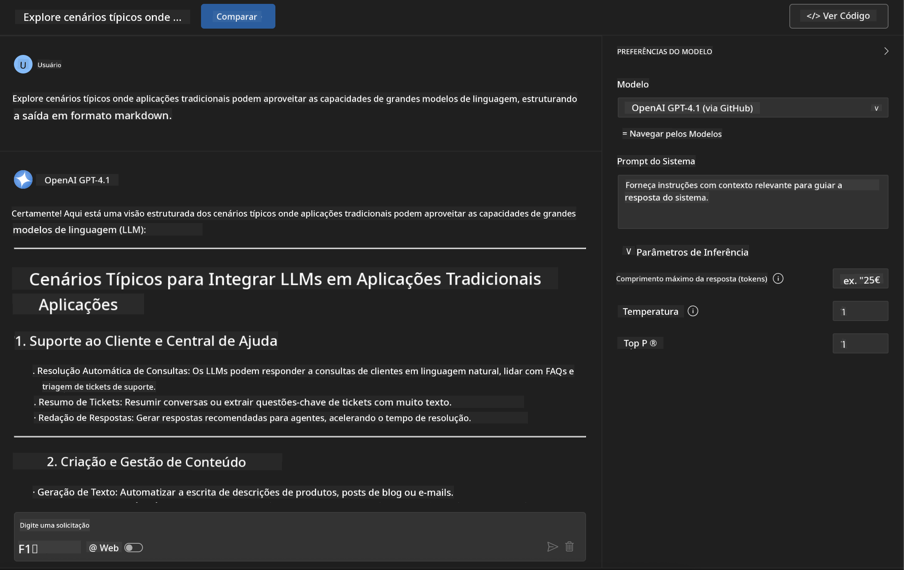
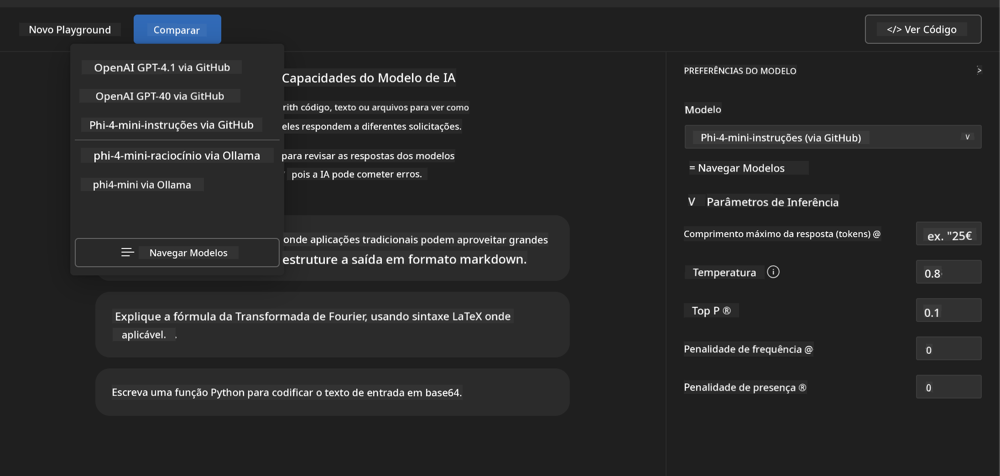
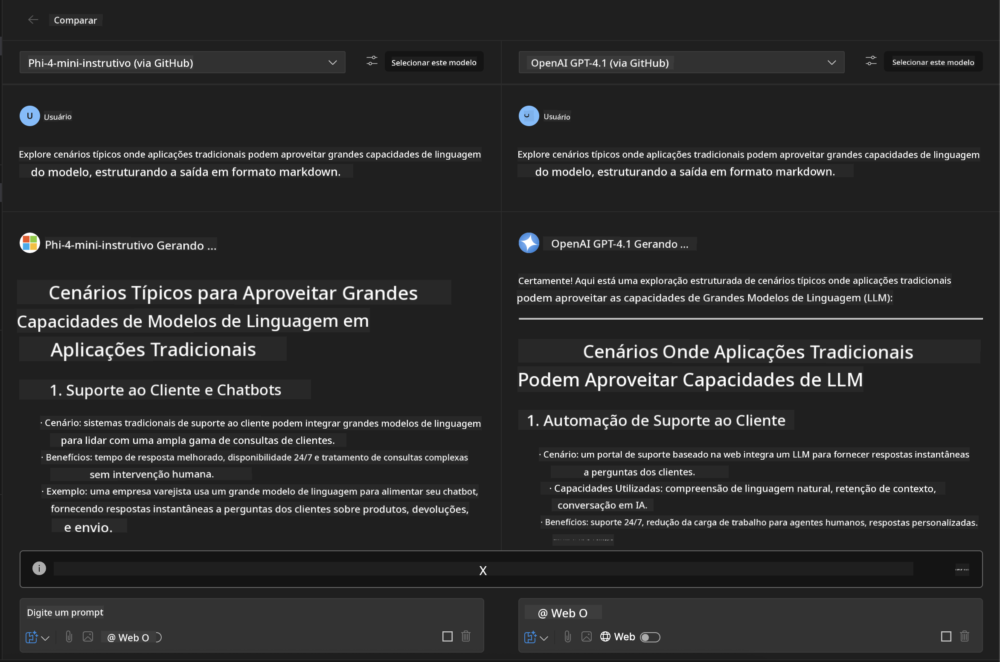
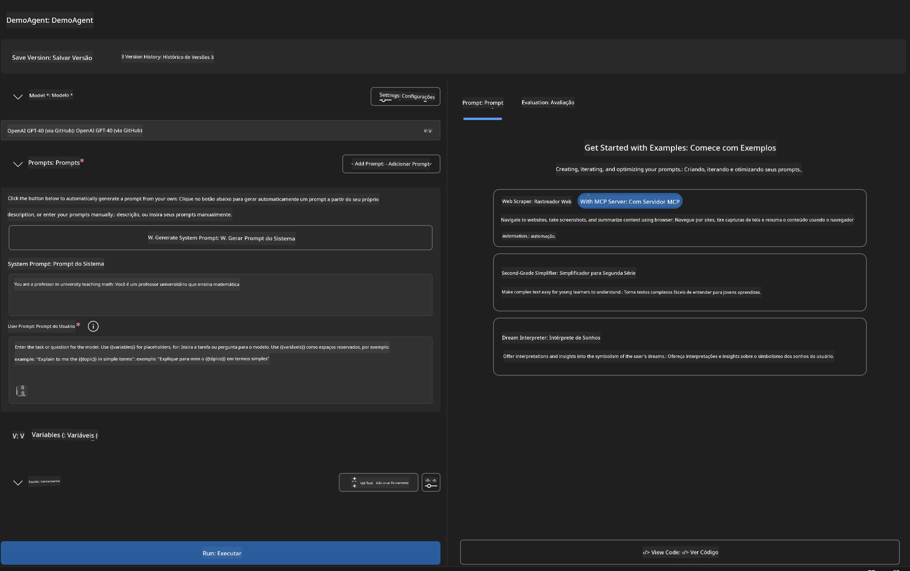
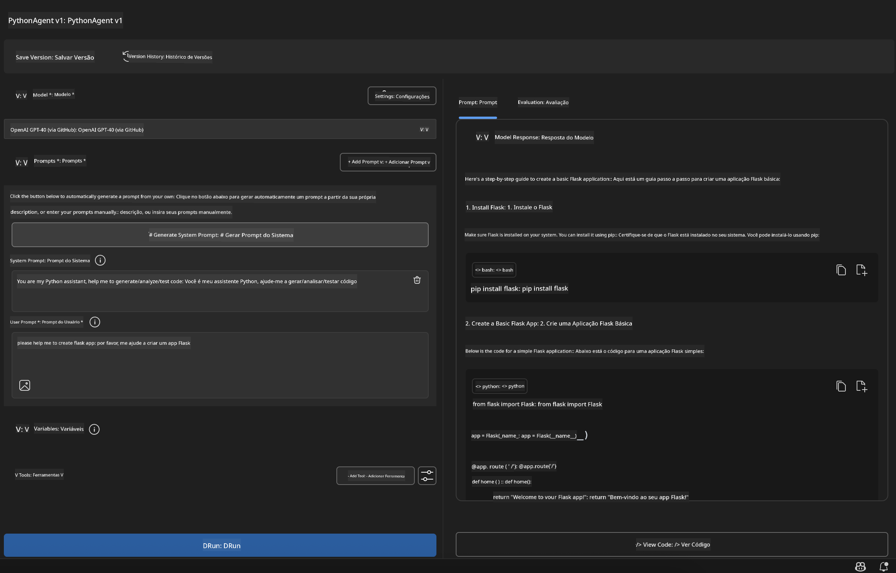

<!--
CO_OP_TRANSLATOR_METADATA:
{
  "original_hash": "2aa9dbc165e104764fa57e8a0d3f1c73",
  "translation_date": "2025-07-14T07:25:30+00:00",
  "source_file": "10-StreamliningAIWorkflowsBuildingAnMCPServerWithAIToolkit/lab1/README.md",
  "language_code": "br"
}
-->
# 🚀 Módulo 1: Fundamentos do AI Toolkit

[]()
[]()
[]()

## 📋 Objetivos de Aprendizagem

Ao final deste módulo, você será capaz de:
- ✅ Instalar e configurar o AI Toolkit para Visual Studio Code
- ✅ Navegar pelo Catálogo de Modelos e entender as diferentes fontes de modelos
- ✅ Usar o Playground para testar e experimentar com modelos
- ✅ Criar agentes de IA personalizados usando o Agent Builder
- ✅ Comparar o desempenho de modelos entre diferentes provedores
- ✅ Aplicar as melhores práticas para engenharia de prompts

## 🧠 Introdução ao AI Toolkit (AITK)

O **AI Toolkit para Visual Studio Code** é a extensão principal da Microsoft que transforma o VS Code em um ambiente completo para desenvolvimento de IA. Ele conecta a pesquisa em IA com o desenvolvimento prático, tornando a IA generativa acessível para desenvolvedores de todos os níveis.

### 🌟 Capacidades Principais

| Recurso | Descrição | Caso de Uso |
|---------|-------------|----------|
| **🗂️ Catálogo de Modelos** | Acesso a mais de 100 modelos do GitHub, ONNX, OpenAI, Anthropic, Google | Descoberta e seleção de modelos |
| **🔌 Suporte BYOM** | Integre seus próprios modelos (locais/remotos) | Implantação personalizada de modelos |
| **🎮 Playground Interativo** | Teste de modelos em tempo real com interface de chat | Protótipos rápidos e testes |
| **📎 Suporte Multimodal** | Trabalha com texto, imagens e anexos | Aplicações complexas de IA |
| **⚡ Processamento em Lote** | Execute múltiplos prompts simultaneamente | Fluxos de trabalho de teste eficientes |
| **📊 Avaliação de Modelos** | Métricas integradas (F1, relevância, similaridade, coerência) | Avaliação de desempenho |

### 🎯 Por que o AI Toolkit é Importante

- **🚀 Desenvolvimento Acelerado**: Da ideia ao protótipo em minutos
- **🔄 Fluxo de Trabalho Unificado**: Uma interface para múltiplos provedores de IA
- **🧪 Experimentação Fácil**: Compare modelos sem configurações complexas
- **📈 Pronto para Produção**: Transição suave do protótipo para implantação

## 🛠️ Pré-requisitos & Configuração

### 📦 Instalar a Extensão AI Toolkit

**Passo 1: Acesse o Marketplace de Extensões**
1. Abra o Visual Studio Code
2. Vá para a visualização de Extensões (`Ctrl+Shift+X` ou `Cmd+Shift+X`)
3. Procure por "AI Toolkit"

**Passo 2: Escolha Sua Versão**
- **🟢 Release**: Recomendado para uso em produção
- **🔶 Pré-lançamento**: Acesso antecipado a recursos inovadores

**Passo 3: Instale e Ative**



### ✅ Lista de Verificação para Verificação
- [ ] Ícone do AI Toolkit aparece na barra lateral do VS Code
- [ ] Extensão está habilitada e ativada
- [ ] Nenhum erro de instalação no painel de saída

## 🧪 Exercício Prático 1: Explorando Modelos do GitHub

**🎯 Objetivo**: Dominar o Catálogo de Modelos e testar seu primeiro modelo de IA

### 📊 Passo 1: Navegar pelo Catálogo de Modelos

O Catálogo de Modelos é sua porta de entrada para o ecossistema de IA. Ele agrega modelos de vários provedores, facilitando a descoberta e comparação de opções.

**🔍 Guia de Navegação:**

Clique em **MODELS - Catalog** na barra lateral do AI Toolkit



**💡 Dica Profissional**: Procure por modelos com capacidades específicas que atendam ao seu caso de uso (ex: geração de código, escrita criativa, análise).

**⚠️ Nota**: Modelos hospedados no GitHub (ou seja, GitHub Models) são gratuitos para uso, mas estão sujeitos a limites de taxa para requisições e tokens. Se quiser acessar modelos fora do GitHub (modelos externos hospedados via Azure AI ou outros endpoints), será necessário fornecer a chave de API ou autenticação apropriada.

### 🚀 Passo 2: Adicionar e Configurar Seu Primeiro Modelo

**Estratégia de Seleção de Modelo:**
- **GPT-4.1**: Ideal para raciocínio complexo e análise
- **Phi-4-mini**: Leve, respostas rápidas para tarefas simples

**🔧 Processo de Configuração:**
1. Selecione **OpenAI GPT-4.1** no catálogo
2. Clique em **Add to My Models** - isso registra o modelo para uso
3. Escolha **Try in Playground** para abrir o ambiente de testes
4. Aguarde a inicialização do modelo (a configuração inicial pode levar um momento)



**⚙️ Entendendo os Parâmetros do Modelo:**
- **Temperature**: Controla a criatividade (0 = determinístico, 1 = criativo)
- **Max Tokens**: Tamanho máximo da resposta
- **Top-p**: Amostragem núcleo para diversidade na resposta

### 🎯 Passo 3: Domine a Interface do Playground

O Playground é seu laboratório de experimentação com IA. Veja como tirar o máximo proveito:

**🎨 Melhores Práticas para Engenharia de Prompts:**
1. **Seja Específico**: Instruções claras e detalhadas geram melhores resultados
2. **Forneça Contexto**: Inclua informações relevantes de fundo
3. **Use Exemplos**: Mostre ao modelo o que você quer com exemplos
4. **Itere**: Refine os prompts com base nos resultados iniciais

**🧪 Cenários de Teste:**
```markdown
# Example 1: Code Generation
"Write a Python function that calculates the factorial of a number using recursion. Include error handling and docstrings."

# Example 2: Creative Writing
"Write a professional email to a client explaining a project delay, maintaining a positive tone while being transparent about challenges."

# Example 3: Data Analysis
"Analyze this sales data and provide insights: [paste your data]. Focus on trends, anomalies, and actionable recommendations."
```



### 🏆 Exercício Desafio: Comparação de Desempenho de Modelos

**🎯 Objetivo**: Compare diferentes modelos usando os mesmos prompts para entender seus pontos fortes

**📋 Instruções:**
1. Adicione **Phi-4-mini** ao seu espaço de trabalho
2. Use o mesmo prompt para GPT-4.1 e Phi-4-mini



3. Compare qualidade, velocidade e precisão das respostas
4. Documente suas descobertas na seção de resultados



**💡 Insights Importantes para Descobrir:**
- Quando usar LLM vs SLM
- Custo vs desempenho
- Capacidades especializadas de diferentes modelos

## 🤖 Exercício Prático 2: Construindo Agentes Personalizados com Agent Builder

**🎯 Objetivo**: Criar agentes de IA especializados para tarefas e fluxos de trabalho específicos

### 🏗️ Passo 1: Entendendo o Agent Builder

O Agent Builder é onde o AI Toolkit realmente se destaca. Ele permite criar assistentes de IA sob medida que combinam o poder dos grandes modelos de linguagem com instruções personalizadas, parâmetros específicos e conhecimento especializado.

**🧠 Componentes da Arquitetura do Agente:**
- **Modelo Principal**: O LLM base (GPT-4, Groks, Phi, etc.)
- **System Prompt**: Define a personalidade e comportamento do agente
- **Parâmetros**: Configurações ajustadas para desempenho ideal
- **Integração de Ferramentas**: Conexão com APIs externas e serviços MCP
- **Memória**: Contexto da conversa e persistência da sessão



### ⚙️ Passo 2: Mergulho na Configuração do Agente

**🎨 Criando System Prompts Eficazes:**
```markdown
# Template Structure:
## Role Definition
You are a [specific role] with expertise in [domain].

## Capabilities
- List specific abilities
- Define scope of knowledge
- Clarify limitations

## Behavior Guidelines
- Response style (formal, casual, technical)
- Output format preferences
- Error handling approach

## Examples
Provide 2-3 examples of ideal interactions
```

*Claro, você também pode usar Generate System Prompt para que a IA te ajude a gerar e otimizar prompts*

**🔧 Otimização de Parâmetros:**
| Parâmetro | Faixa Recomendada | Caso de Uso |
|-----------|------------------|----------|
| **Temperature** | 0.1-0.3 | Respostas técnicas/fatuais |
| **Temperature** | 0.7-0.9 | Tarefas criativas/brainstorming |
| **Max Tokens** | 500-1000 | Respostas concisas |
| **Max Tokens** | 2000-4000 | Explicações detalhadas |

### 🐍 Passo 3: Exercício Prático - Agente de Programação em Python

**🎯 Missão**: Criar um assistente especializado em codificação Python

**📋 Passos de Configuração:**

1. **Seleção do Modelo**: Escolha **Claude 3.5 Sonnet** (excelente para código)

2. **Design do System Prompt**:
```markdown
# Python Programming Expert Agent

## Role
You are a senior Python developer with 10+ years of experience. You excel at writing clean, efficient, and well-documented Python code.

## Capabilities
- Write production-ready Python code
- Debug complex issues
- Explain code concepts clearly
- Suggest best practices and optimizations
- Provide complete working examples

## Response Format
- Always include docstrings
- Add inline comments for complex logic
- Suggest testing approaches
- Mention relevant libraries when applicable

## Code Quality Standards
- Follow PEP 8 style guidelines
- Use type hints where appropriate
- Handle exceptions gracefully
- Write readable, maintainable code
```

3. **Configuração dos Parâmetros**:
   - Temperature: 0.2 (para código consistente e confiável)
   - Max Tokens: 2000 (explicações detalhadas)
   - Top-p: 0.9 (criatividade equilibrada)



### 🧪 Passo 4: Testando Seu Agente Python

**Cenários de Teste:**
1. **Função Básica**: "Crie uma função para encontrar números primos"
2. **Algoritmo Complexo**: "Implemente uma árvore binária de busca com métodos de inserção, remoção e busca"
3. **Problema do Mundo Real**: "Construa um web scraper que lide com limitação de taxa e tentativas"
4. **Depuração**: "Corrija este código [cole o código com erro]"

**🏆 Critérios de Sucesso:**
- ✅ Código executa sem erros
- ✅ Inclui documentação adequada
- ✅ Segue as melhores práticas de Python
- ✅ Fornece explicações claras
- ✅ Sugere melhorias

## 🎓 Encerramento do Módulo 1 & Próximos Passos

### 📊 Verificação de Conhecimento

Teste seu entendimento:
- [ ] Você consegue explicar a diferença entre os modelos do catálogo?
- [ ] Você criou e testou com sucesso um agente personalizado?
- [ ] Você entende como otimizar parâmetros para diferentes casos de uso?
- [ ] Você sabe como criar system prompts eficazes?

### 📚 Recursos Adicionais

- **Documentação do AI Toolkit**: [Documentação Oficial Microsoft](https://github.com/microsoft/vscode-ai-toolkit)
- **Guia de Engenharia de Prompts**: [Melhores Práticas](https://platform.openai.com/docs/guides/prompt-engineering)
- **Modelos no AI Toolkit**: [Modelos em Desenvolvimento](https://github.com/microsoft/vscode-ai-toolkit/blob/main/doc/models.md)

**🎉 Parabéns!** Você dominou os fundamentos do AI Toolkit e está pronto para criar aplicações de IA mais avançadas!

### 🔜 Continue para o Próximo Módulo

Quer explorar recursos mais avançados? Continue para **[Módulo 2: Fundamentos do MCP com AI Toolkit](../lab2/README.md)** onde você aprenderá a:
- Conectar seus agentes a ferramentas externas usando o Model Context Protocol (MCP)
- Construir agentes de automação de navegador com Playwright
- Integrar servidores MCP com seus agentes do AI Toolkit
- Potencializar seus agentes com dados e capacidades externas

**Aviso Legal**:  
Este documento foi traduzido utilizando o serviço de tradução por IA [Co-op Translator](https://github.com/Azure/co-op-translator). Embora nos esforcemos para garantir a precisão, esteja ciente de que traduções automáticas podem conter erros ou imprecisões. O documento original em seu idioma nativo deve ser considerado a fonte autorizada. Para informações críticas, recomenda-se tradução profissional humana. Não nos responsabilizamos por quaisquer mal-entendidos ou interpretações incorretas decorrentes do uso desta tradução.