<!--
CO_OP_TRANSLATOR_METADATA:
{
  "original_hash": "a22b7dd11cd7690f99f9195877cafdc3",
  "translation_date": "2025-06-10T05:46:04+00:00",
  "source_file": "10-StreamliningAIWorkflowsBuildingAnMCPServerWithAIToolkit/lab2/README.md",
  "language_code": "br"
}
-->
# 🌐 Módulo 2: Fundamentos do MCP com AI Toolkit

[]()
[]()
[]()

## 📋 Objetivos de Aprendizagem

Ao final deste módulo, você será capaz de:
- ✅ Entender a arquitetura e os benefícios do Model Context Protocol (MCP)
- ✅ Explorar o ecossistema de servidores MCP da Microsoft
- ✅ Integrar servidores MCP com o AI Toolkit Agent Builder
- ✅ Construir um agente funcional de automação de navegador usando Playwright MCP
- ✅ Configurar e testar ferramentas MCP dentro dos seus agentes
- ✅ Exportar e implantar agentes com tecnologia MCP para uso em produção

## 🎯 Construindo sobre o Módulo 1

No Módulo 1, dominamos o básico do AI Toolkit e criamos nosso primeiro Agente Python. Agora vamos **potencializar** seus agentes conectando-os a ferramentas e serviços externos através do revolucionário **Model Context Protocol (MCP)**.

Pense nisso como um upgrade de uma calculadora básica para um computador completo — seus agentes de IA ganharão a capacidade de:
- 🌐 Navegar e interagir com sites
- 📁 Acessar e manipular arquivos
- 🔧 Integrar com sistemas corporativos
- 📊 Processar dados em tempo real via APIs

## 🧠 Entendendo o Model Context Protocol (MCP)

### 🔍 O que é o MCP?

Model Context Protocol (MCP) é o **"USB-C para aplicações de IA"** — um padrão aberto revolucionário que conecta Grandes Modelos de Linguagem (LLMs) a ferramentas externas, fontes de dados e serviços. Assim como o USB-C eliminou a confusão dos cabos ao oferecer um conector universal, o MCP simplifica a integração de IA com um protocolo padronizado.

### 🎯 O Problema que o MCP Resolve

**Antes do MCP:**
- 🔧 Integrações personalizadas para cada ferramenta
- 🔄 Dependência de fornecedores com soluções proprietárias  
- 🔒 Vulnerabilidades de segurança por conexões improvisadas
- ⏱️ Meses de desenvolvimento para integrações básicas

**Com o MCP:**
- ⚡ Integração plug-and-play de ferramentas
- 🔄 Arquitetura independente de fornecedores
- 🛡️ Práticas de segurança incorporadas
- 🚀 Minutos para adicionar novas funcionalidades

### 🏗️ Arquitetura MCP em Detalhes

O MCP segue uma **arquitetura cliente-servidor** que cria um ecossistema seguro e escalável:

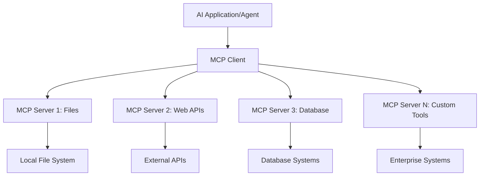

**🔧 Componentes Principais:**

| Componente | Função | Exemplos |
|------------|--------|----------|
| **MCP Hosts** | Aplicações que consomem serviços MCP | Claude Desktop, VS Code, AI Toolkit |
| **MCP Clients** | Manipuladores do protocolo (1:1 com servidores) | Incorporados em aplicações host |
| **MCP Servers** | Exposição de capacidades via protocolo padrão | Playwright, Files, Azure, GitHub |
| **Camada de Transporte** | Métodos de comunicação | stdio, HTTP, WebSockets |


## 🏢 Ecossistema de Servidores MCP da Microsoft

A Microsoft lidera o ecossistema MCP com uma suíte completa de servidores corporativos que atendem necessidades reais de negócios.

### 🌟 Servidores MCP em Destaque da Microsoft

#### 1. ☁️ Azure MCP Server  
**🔗 Repositório**: [azure/azure-mcp](https://github.com/azure/azure-mcp)  
**🎯 Objetivo**: Gerenciamento abrangente de recursos Azure com integração de IA

**✨ Principais Funcionalidades:**
- Provisionamento declarativo de infraestrutura
- Monitoramento de recursos em tempo real
- Recomendações para otimização de custos
- Verificação de conformidade de segurança

**🚀 Casos de Uso:**
- Infraestrutura como Código com suporte de IA
- Escalonamento automático de recursos
- Otimização de custos na nuvem
- Automação de fluxos DevOps

#### 2. 📊 Microsoft Dataverse MCP  
**📚 Documentação**: [Microsoft Dataverse Integration](https://go.microsoft.com/fwlink/?linkid=2320176)  
**🎯 Objetivo**: Interface em linguagem natural para dados empresariais

**✨ Principais Funcionalidades:**
- Consultas em linguagem natural para bancos de dados
- Compreensão do contexto de negócios
- Modelos de prompt personalizados
- Governança de dados corporativos

**🚀 Casos de Uso:**
- Relatórios de inteligência de negócios
- Análise de dados de clientes
- Insights do pipeline de vendas
- Consultas para conformidade regulatória

#### 3. 🌐 Playwright MCP Server  
**🔗 Repositório**: [microsoft/playwright-mcp](https://github.com/microsoft/playwright-mcp)  
**🎯 Objetivo**: Automação de navegador e interação web

**✨ Principais Funcionalidades:**
- Automação cross-browser (Chrome, Firefox, Safari)
- Detecção inteligente de elementos
- Geração de screenshots e PDFs
- Monitoramento de tráfego de rede

**🚀 Casos de Uso:**
- Fluxos de teste automatizados
- Web scraping e extração de dados
- Monitoramento de UI/UX
- Automação de análise competitiva

#### 4. 📁 Files MCP Server  
**🔗 Repositório**: [microsoft/files-mcp-server](https://github.com/microsoft/files-mcp-server)  
**🎯 Objetivo**: Operações inteligentes no sistema de arquivos

**✨ Principais Funcionalidades:**
- Gerenciamento declarativo de arquivos
- Sincronização de conteúdo
- Integração com controle de versões
- Extração de metadados

**🚀 Casos de Uso:**
- Gestão de documentação
- Organização de repositórios de código
- Fluxos de publicação de conteúdo
- Manipulação de arquivos em pipelines de dados

#### 5. 📝 MarkItDown MCP Server  
**🔗 Repositório**: [microsoft/markitdown](https://github.com/microsoft/markitdown)  
**🎯 Objetivo**: Processamento avançado e manipulação de Markdown

**✨ Principais Funcionalidades:**
- Parsing avançado de Markdown
- Conversão de formatos (MD ↔ HTML ↔ PDF)
- Análise da estrutura do conteúdo
- Processamento de templates

**🚀 Casos de Uso:**
- Fluxos de documentação técnica
- Sistemas de gerenciamento de conteúdo
- Geração de relatórios
- Automação de bases de conhecimento

#### 6. 📈 Clarity MCP Server  
**📦 Pacote**: [@microsoft/clarity-mcp-server](https://www.npmjs.com/package/@microsoft/clarity-mcp-server)  
**🎯 Objetivo**: Análise web e insights de comportamento do usuário

**✨ Principais Funcionalidades:**
- Análise de mapas de calor
- Gravação de sessões de usuário
- Métricas de desempenho
- Análise de funil de conversão

**🚀 Casos de Uso:**
- Otimização de sites
- Pesquisa de experiência do usuário
- Análise de testes A/B
- Dashboards de inteligência de negócios

### 🌍 Ecossistema da Comunidade

Além dos servidores Microsoft, o ecossistema MCP inclui:  
- **🐙 GitHub MCP**: Gerenciamento de repositórios e análise de código  
- **🗄️ MCPs para Bancos de Dados**: Integrações com PostgreSQL, MySQL, MongoDB  
- **☁️ MCPs de Provedores de Nuvem**: Ferramentas AWS, GCP, Digital Ocean  
- **📧 MCPs de Comunicação**: Integrações Slack, Teams, Email  

## 🛠️ Laboratório Prático: Construindo um Agente de Automação de Navegador

**🎯 Objetivo do Projeto**: Criar um agente inteligente de automação de navegador usando o servidor Playwright MCP que navegue em sites, extraia informações e realize interações web complexas.

### 🚀 Fase 1: Configuração da Base do Agente

#### Passo 1: Inicialize Seu Agente
1. **Abra o AI Toolkit Agent Builder**  
2. **Crie um Novo Agente** com a seguinte configuração:  
   - **Nome**: `BrowserAgent`
   - **Model**: Choose GPT-4o 

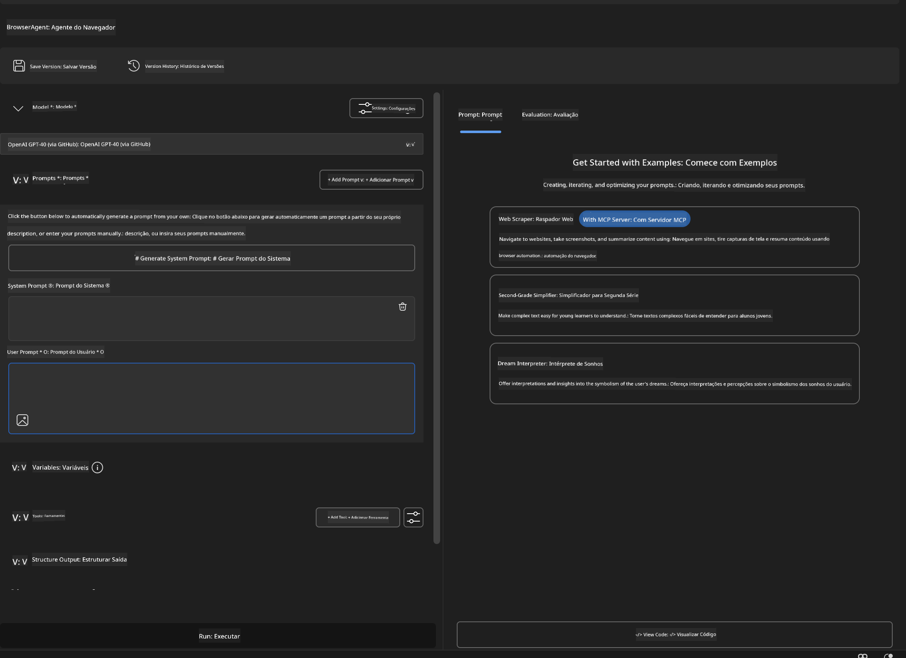


### 🔧 Phase 2: MCP Integration Workflow

#### Step 3: Add MCP Server Integration
1. **Navigate to Tools Section** in Agent Builder
2. **Click "Add Tool"** to open the integration menu
3. **Select "MCP Server"** from available options

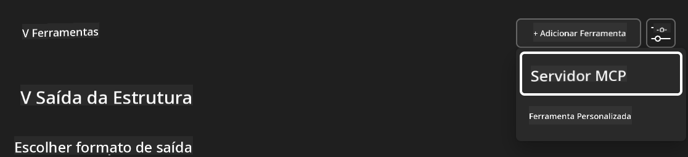

**🔍 Understanding Tool Types:**
- **Built-in Tools**: Pre-configured AI Toolkit functions
- **MCP Servers**: External service integrations
- **Custom APIs**: Your own service endpoints
- **Function Calling**: Direct model function access

#### Step 4: MCP Server Selection
1. **Choose "MCP Server"** option to proceed
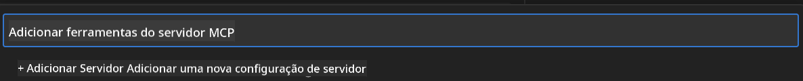

2. **Browse MCP Catalog** to explore available integrations
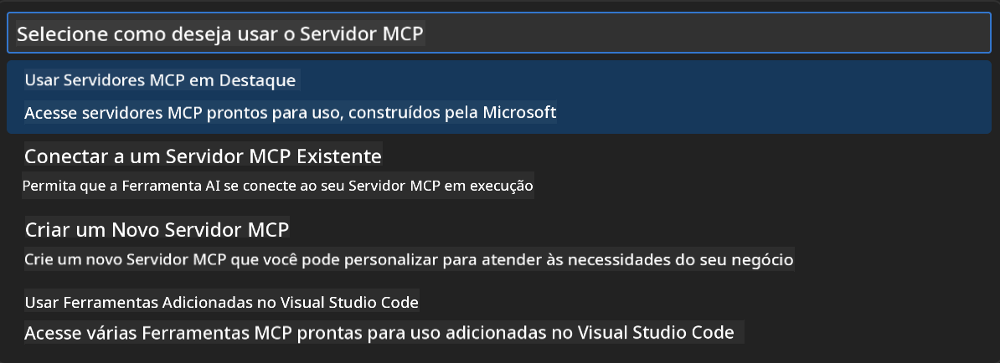


### 🎮 Phase 3: Playwright MCP Configuration

#### Step 5: Select and Configure Playwright
1. **Click "Use Featured MCP Servers"** to access Microsoft's verified servers
2. **Select "Playwright"** from the featured list
3. **Accept Default MCP ID** or customize for your environment

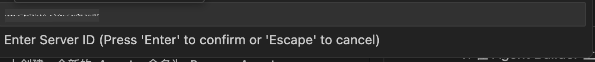

#### Step 6: Enable Playwright Capabilities
**🔑 Critical Step**: Select **ALL** available Playwright methods for maximum functionality

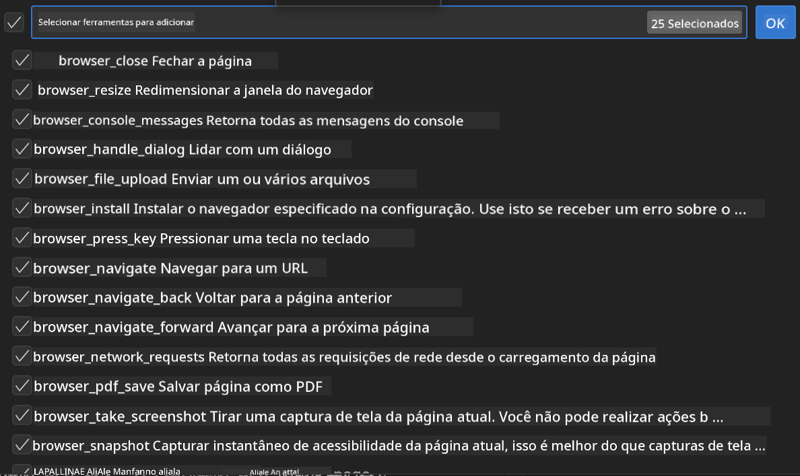

**🛠️ Essential Playwright Tools:**
- **Navigation**: `goto`, `goBack`, `goForward`, `reload`
- **Interaction**: `click`, `fill`, `press`, `hover`, `drag`
- **Extraction**: `textContent`, `innerHTML`, `getAttribute`
- **Validation**: `isVisible`, `isEnabled`, `waitForSelector`
- **Capture**: `screenshot`, `pdf`, `video`
- **Network**: `setExtraHTTPHeaders`, `route`, `waitForResponse`

#### Passo 7: Verifique o Sucesso da Integração  
**✅ Indicadores de Sucesso:**  
- Todas as ferramentas aparecem na interface do Agent Builder  
- Nenhuma mensagem de erro no painel de integração  
- Status do servidor Playwright mostra "Connected"

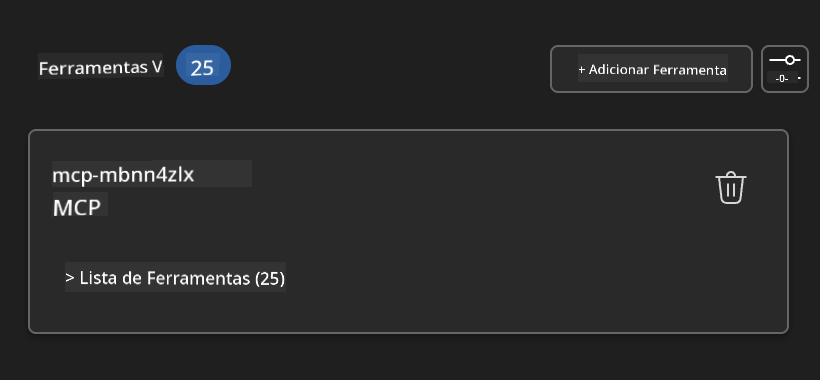

**🔧 Resolução de Problemas Comuns:**  
- **Falha na Conexão**: Verifique a conexão com a internet e configurações de firewall  
- **Ferramentas Ausentes**: Confirme que todas as capacidades foram selecionadas durante a configuração  
- **Erros de Permissão**: Verifique se o VS Code tem as permissões necessárias no sistema  

### 🎯 Fase 4: Engenharia Avançada de Prompts

#### Passo 8: Crie Prompts Inteligentes para o Sistema  
Desenvolva prompts sofisticados que aproveitem todas as capacidades do Playwright:

```markdown
# Web Automation Expert System Prompt

## Core Identity
You are an advanced web automation specialist with deep expertise in browser automation, web scraping, and user experience analysis. You have access to Playwright tools for comprehensive browser control.

## Capabilities & Approach
### Navigation Strategy
- Always start with screenshots to understand page layout
- Use semantic selectors (text content, labels) when possible
- Implement wait strategies for dynamic content
- Handle single-page applications (SPAs) effectively

### Error Handling
- Retry failed operations with exponential backoff
- Provide clear error descriptions and solutions
- Suggest alternative approaches when primary methods fail
- Always capture diagnostic screenshots on errors

### Data Extraction
- Extract structured data in JSON format when possible
- Provide confidence scores for extracted information
- Validate data completeness and accuracy
- Handle pagination and infinite scroll scenarios

### Reporting
- Include step-by-step execution logs
- Provide before/after screenshots for verification
- Suggest optimizations and alternative approaches
- Document any limitations or edge cases encountered

## Ethical Guidelines
- Respect robots.txt and rate limiting
- Avoid overloading target servers
- Only extract publicly available information
- Follow website terms of service
```

#### Passo 9: Crie Prompts Dinâmicos para Usuário  
Projete prompts que demonstrem várias funcionalidades:

**🌐 Exemplo de Análise Web:**  
```markdown
Navigate to github.com/kinfey and provide a comprehensive analysis including:
1. Repository structure and organization
2. Recent activity and contribution patterns  
3. Documentation quality assessment
4. Technology stack identification
5. Community engagement metrics
6. Notable projects and their purposes

Include screenshots at key steps and provide actionable insights.
```

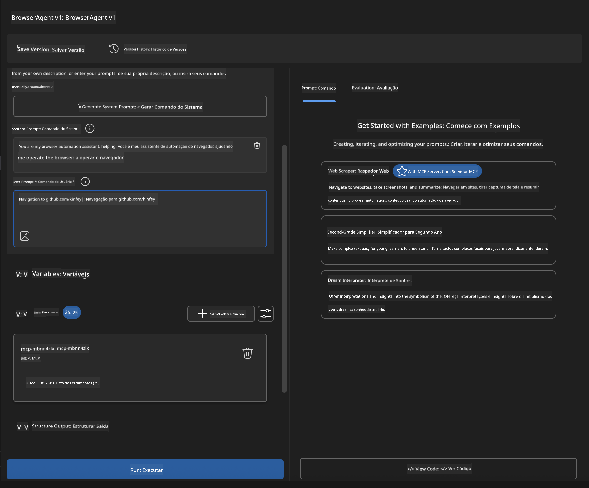

### 🚀 Fase 5: Execução e Testes

#### Passo 10: Execute Sua Primeira Automação  
1. **Clique em "Run"** para iniciar a sequência de automação  
2. **Monitore a Execução em Tempo Real**:  
   - O navegador Chrome é aberto automaticamente  
   - O agente navega até o site alvo  
   - Capturas de tela registram cada etapa importante  
   - Resultados da análise são exibidos em tempo real  

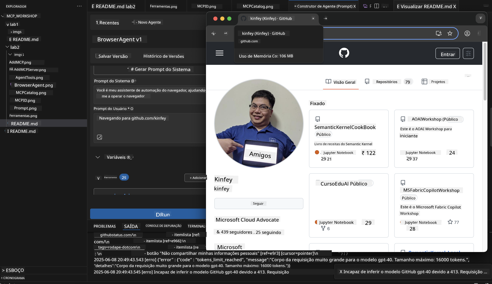

#### Passo 11: Analise Resultados e Insights  
Revise a análise detalhada na interface do Agent Builder:

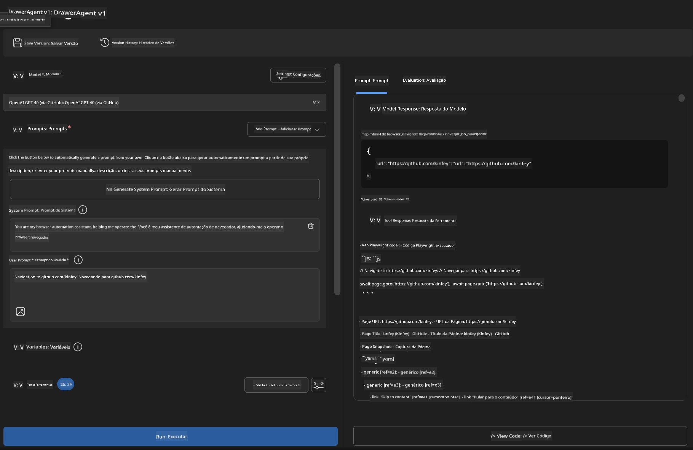

### 🌟 Fase 6: Capacidades Avançadas e Implantação

#### Passo 12: Exportação e Implantação em Produção  
O Agent Builder oferece múltiplas opções de implantação:

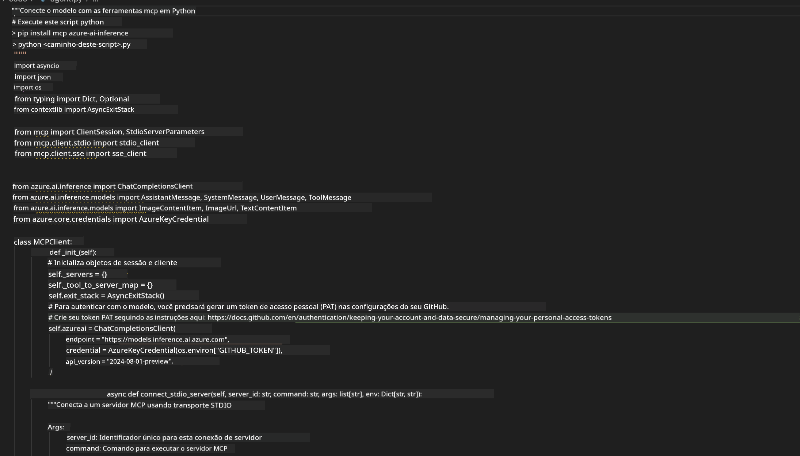

## 🎓 Resumo do Módulo 2 & Próximos Passos

### 🏆 Conquista Desbloqueada: Mestre em Integração MCP

**✅ Habilidades Desenvolvidas:**  
- [ ] Entendimento da arquitetura e benefícios do MCP  
- [ ] Navegação pelo ecossistema de servidores MCP da Microsoft  
- [ ] Integração do Playwright MCP com AI Toolkit  
- [ ] Construção de agentes sofisticados de automação de navegador  
- [ ] Engenharia avançada de prompts para automação web  

### 📚 Recursos Adicionais

- **🔗 Especificação MCP**: [Documentação Oficial do Protocolo](https://modelcontextprotocol.io/)  
- **🛠️ API Playwright**: [Referência Completa de Métodos](https://playwright.dev/docs/api/class-playwright)  
- **🏢 Servidores MCP da Microsoft**: [Guia de Integração Corporativa](https://github.com/microsoft/mcp-servers)  
- **🌍 Exemplos da Comunidade**: [Galeria de Servidores MCP](https://github.com/modelcontextprotocol/servers)  

**🎉 Parabéns!** Você dominou a integração MCP e agora pode construir agentes de IA prontos para produção com capacidades externas!

### 🔜 Continue para o Próximo Módulo

Pronto para levar suas habilidades MCP para o próximo nível? Siga para **[Módulo 3: Desenvolvimento Avançado MCP com AI Toolkit](../lab3/README.md)** onde você aprenderá a:  
- Criar seus próprios servidores MCP personalizados  
- Configurar e usar o SDK Python MCP mais recente  
- Preparar o MCP Inspector para depuração  
- Dominar fluxos avançados de desenvolvimento de servidores MCP  
- Construir um servidor MCP de Previsão do Tempo do zero

**Aviso Legal**:  
Este documento foi traduzido usando o serviço de tradução por IA [Co-op Translator](https://github.com/Azure/co-op-translator). Embora nos esforcemos para garantir a precisão, esteja ciente de que traduções automáticas podem conter erros ou imprecisões. O documento original em seu idioma nativo deve ser considerado a fonte autorizada. Para informações críticas, recomenda-se tradução profissional feita por humanos. Não nos responsabilizamos por quaisquer mal-entendidos ou interpretações incorretas decorrentes do uso desta tradução.