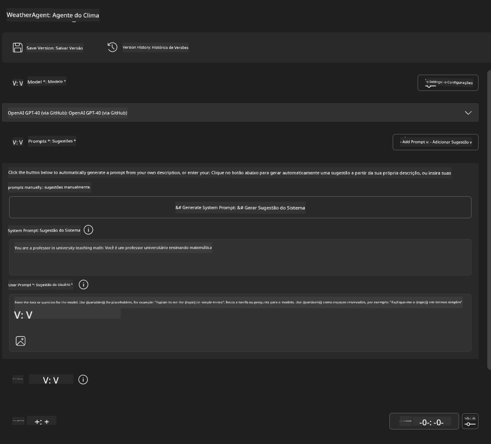
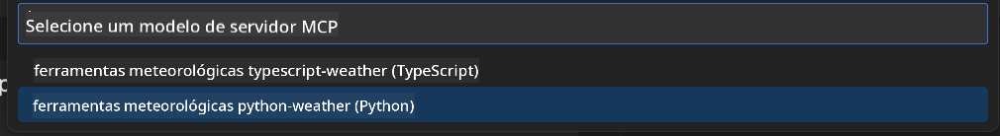
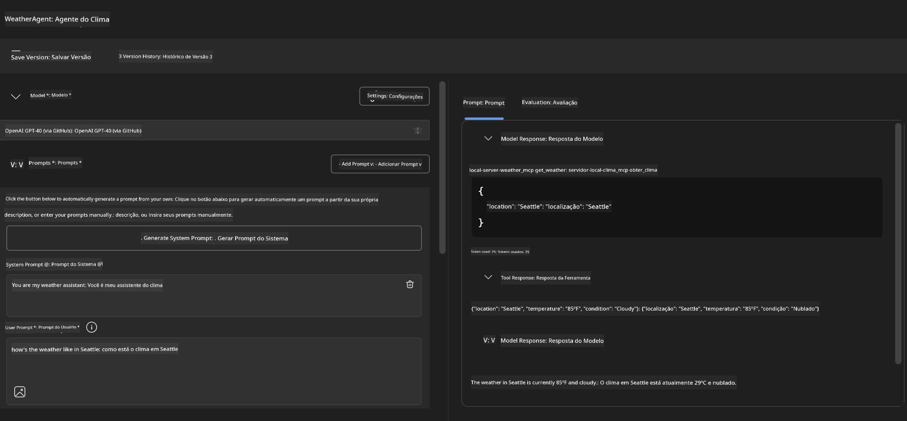
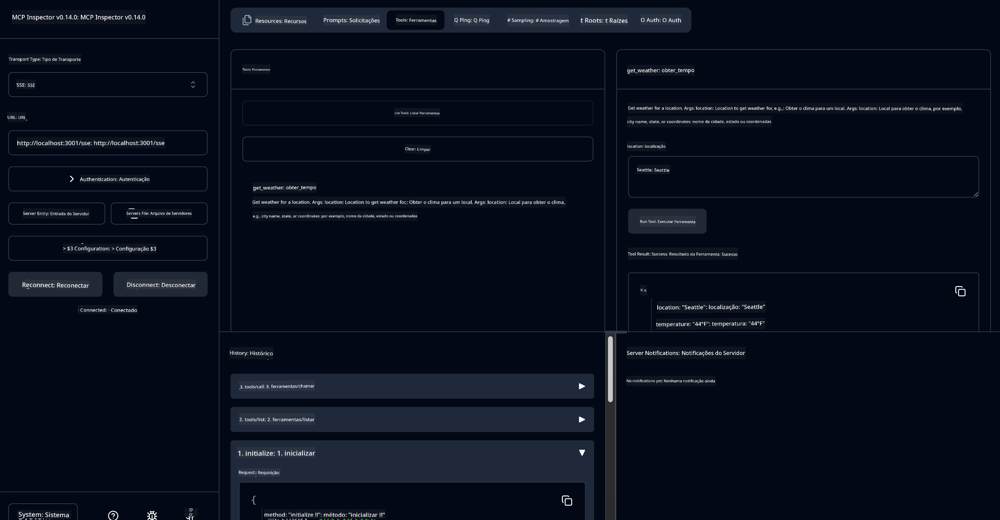

<!--
CO_OP_TRANSLATOR_METADATA:
{
  "original_hash": "dd8da3f75addcef453fe11f02a270217",
  "translation_date": "2025-07-14T08:12:38+00:00",
  "source_file": "10-StreamliningAIWorkflowsBuildingAnMCPServerWithAIToolkit/lab3/README.md",
  "language_code": "br"
}
-->
# 🔧 Módulo 3: Desenvolvimento Avançado de MCP com AI Toolkit


## 🎯 Objetivos de Aprendizagem

Ao final deste laboratório, você será capaz de:

- ✅ Criar servidores MCP personalizados usando o AI Toolkit
- ✅ Configurar e usar o SDK Python MCP mais recente (v1.9.3)
- ✅ Configurar e utilizar o MCP Inspector para depuração
- ✅ Depurar servidores MCP tanto no Agent Builder quanto no Inspector
- ✅ Compreender fluxos de trabalho avançados para desenvolvimento de servidores MCP

## 📋 Pré-requisitos

- Conclusão do Laboratório 2 (Fundamentos do MCP)
- VS Code com a extensão AI Toolkit instalada
- Ambiente Python 3.10+
- Node.js e npm para configuração do Inspector

## 🏗️ O que você vai construir

Neste laboratório, você criará um **Servidor MCP de Clima** que demonstra:
- Implementação personalizada de servidor MCP
- Integração com o AI Toolkit Agent Builder
- Fluxos de trabalho profissionais de depuração
- Padrões modernos de uso do SDK MCP

---

## 🔧 Visão Geral dos Componentes Principais

### 🐍 MCP Python SDK  
O SDK Python do Model Context Protocol fornece a base para construir servidores MCP personalizados. Você usará a versão 1.9.3 com recursos aprimorados de depuração.

### 🔍 MCP Inspector  
Uma ferramenta poderosa de depuração que oferece:  
- Monitoramento do servidor em tempo real  
- Visualização da execução das ferramentas  
- Inspeção de requisições/respostas de rede  
- Ambiente interativo para testes

---

## 📖 Implementação Passo a Passo

### Passo 1: Crie um WeatherAgent no Agent Builder

1. **Abra o Agent Builder** no VS Code através da extensão AI Toolkit  
2. **Crie um novo agente** com a seguinte configuração:  
   - Nome do agente: `WeatherAgent`



### Passo 2: Inicialize o Projeto do Servidor MCP

1. **Navegue até Ferramentas** → **Adicionar Ferramenta** no Agent Builder  
2. **Selecione "MCP Server"** entre as opções disponíveis  
3. **Escolha "Criar um novo Servidor MCP"**  
4. **Selecione o template `python-weather`**  
5. **Nomeie seu servidor:** `weather_mcp`



### Passo 3: Abra e Analise o Projeto

1. **Abra o projeto gerado** no VS Code  
2. **Revise a estrutura do projeto:**  
   ```
   weather_mcp/
   ├── src/
   │   ├── __init__.py
   │   └── server.py
   ├── inspector/
   │   ├── package.json
   │   └── package-lock.json
   ├── .vscode/
   │   ├── launch.json
   │   └── tasks.json
   ├── pyproject.toml
   └── README.md
   ```

### Passo 4: Atualize para a Última Versão do MCP SDK

> **🔍 Por que atualizar?** Queremos usar o SDK MCP mais recente (v1.9.3) e o serviço Inspector (0.14.0) para recursos aprimorados e melhor capacidade de depuração.

#### 4a. Atualize as Dependências Python

**Edite `pyproject.toml`:** atualize [./code/weather_mcp/pyproject.toml](../../../../10-StreamliningAIWorkflowsBuildingAnMCPServerWithAIToolkit/lab3/code/weather_mcp/pyproject.toml)

#### 4b. Atualize a Configuração do Inspector

**Edite `inspector/package.json`:** atualize [./code/weather_mcp/inspector/package.json](../../../../10-StreamliningAIWorkflowsBuildingAnMCPServerWithAIToolkit/lab3/code/weather_mcp/inspector/package.json)

#### 4c. Atualize as Dependências do Inspector

**Edite `inspector/package-lock.json`:** atualize [./code/weather_mcp/inspector/package-lock.json](../../../../10-StreamliningAIWorkflowsBuildingAnMCPServerWithAIToolkit/lab3/code/weather_mcp/inspector/package-lock.json)

> **📝 Nota:** Este arquivo contém definições extensas de dependências. Abaixo está a estrutura essencial – o conteúdo completo garante a resolução correta das dependências.

> **⚡ Package Lock Completo:** O arquivo package-lock.json completo contém cerca de 3000 linhas de definições de dependências. O acima mostra a estrutura principal – use o arquivo fornecido para resolução completa.

### Passo 5: Configure a Depuração no VS Code

*Nota: Por favor, copie o arquivo no caminho especificado para substituir o arquivo local correspondente*

#### 5a. Atualize a Configuração de Inicialização

**Edite `.vscode/launch.json`:**

```json
{
  "version": "0.2.0",
  "configurations": [
    {
      "name": "Attach to Local MCP",
      "type": "debugpy",
      "request": "attach",
      "connect": {
        "host": "localhost",
        "port": 5678
      },
      "presentation": {
        "hidden": true
      },
      "internalConsoleOptions": "neverOpen",
      "postDebugTask": "Terminate All Tasks"
    },
    {
      "name": "Launch Inspector (Edge)",
      "type": "msedge",
      "request": "launch",
      "url": "http://localhost:6274?timeout=60000&serverUrl=http://localhost:3001/sse#tools",
      "cascadeTerminateToConfigurations": [
        "Attach to Local MCP"
      ],
      "presentation": {
        "hidden": true
      },
      "internalConsoleOptions": "neverOpen"
    },
    {
      "name": "Launch Inspector (Chrome)",
      "type": "chrome",
      "request": "launch",
      "url": "http://localhost:6274?timeout=60000&serverUrl=http://localhost:3001/sse#tools",
      "cascadeTerminateToConfigurations": [
        "Attach to Local MCP"
      ],
      "presentation": {
        "hidden": true
      },
      "internalConsoleOptions": "neverOpen"
    }
  ],
  "compounds": [
    {
      "name": "Debug in Agent Builder",
      "configurations": [
        "Attach to Local MCP"
      ],
      "preLaunchTask": "Open Agent Builder",
    },
    {
      "name": "Debug in Inspector (Edge)",
      "configurations": [
        "Launch Inspector (Edge)",
        "Attach to Local MCP"
      ],
      "preLaunchTask": "Start MCP Inspector",
      "stopAll": true
    },
    {
      "name": "Debug in Inspector (Chrome)",
      "configurations": [
        "Launch Inspector (Chrome)",
        "Attach to Local MCP"
      ],
      "preLaunchTask": "Start MCP Inspector",
      "stopAll": true
    }
  ]
}
```

**Edite `.vscode/tasks.json`:**

```
{
  "version": "2.0.0",
  "tasks": [
    {
      "label": "Start MCP Server",
      "type": "shell",
      "command": "python -m debugpy --listen 127.0.0.1:5678 src/__init__.py sse",
      "isBackground": true,
      "options": {
        "cwd": "${workspaceFolder}",
        "env": {
          "PORT": "3001"
        }
      },
      "problemMatcher": {
        "pattern": [
          {
            "regexp": "^.*$",
            "file": 0,
            "location": 1,
            "message": 2
          }
        ],
        "background": {
          "activeOnStart": true,
          "beginsPattern": ".*",
          "endsPattern": "Application startup complete|running"
        }
      }
    },
    {
      "label": "Start MCP Inspector",
      "type": "shell",
      "command": "npm run dev:inspector",
      "isBackground": true,
      "options": {
        "cwd": "${workspaceFolder}/inspector",
        "env": {
          "CLIENT_PORT": "6274",
          "SERVER_PORT": "6277",
        }
      },
      "problemMatcher": {
        "pattern": [
          {
            "regexp": "^.*$",
            "file": 0,
            "location": 1,
            "message": 2
          }
        ],
        "background": {
          "activeOnStart": true,
          "beginsPattern": "Starting MCP inspector",
          "endsPattern": "Proxy server listening on port"
        }
      },
      "dependsOn": [
        "Start MCP Server"
      ]
    },
    {
      "label": "Open Agent Builder",
      "type": "shell",
      "command": "echo ${input:openAgentBuilder}",
      "presentation": {
        "reveal": "never"
      },
      "dependsOn": [
        "Start MCP Server"
      ],
    },
    {
      "label": "Terminate All Tasks",
      "command": "echo ${input:terminate}",
      "type": "shell",
      "problemMatcher": []
    }
  ],
  "inputs": [
    {
      "id": "openAgentBuilder",
      "type": "command",
      "command": "ai-mlstudio.agentBuilder",
      "args": {
        "initialMCPs": [ "local-server-weather_mcp" ],
        "triggeredFrom": "vsc-tasks"
      }
    },
    {
      "id": "terminate",
      "type": "command",
      "command": "workbench.action.tasks.terminate",
      "args": "terminateAll"
    }
  ]
}
```

---

## 🚀 Executando e Testando seu Servidor MCP

### Passo 6: Instale as Dependências

Após as alterações de configuração, execute os seguintes comandos:

**Instale as dependências Python:**  
```bash
uv sync
```

**Instale as dependências do Inspector:**  
```bash
cd inspector
npm install
```

### Passo 7: Depure com o Agent Builder

1. **Pressione F5** ou use a configuração **"Debug in Agent Builder"**  
2. **Selecione a configuração composta** no painel de depuração  
3. **Aguarde o servidor iniciar** e o Agent Builder abrir  
4. **Teste seu servidor MCP de clima** com consultas em linguagem natural

Digite um prompt como este

SYSTEM_PROMPT

```
You are my weather assistant
```

USER_PROMPT

```
How's the weather like in Seattle
```



### Passo 8: Depure com o MCP Inspector

1. **Use a configuração "Debug in Inspector"** (Edge ou Chrome)  
2. **Abra a interface do Inspector** em `http://localhost:6274`  
3. **Explore o ambiente interativo de testes:**  
   - Veja as ferramentas disponíveis  
   - Teste a execução das ferramentas  
   - Monitore requisições de rede  
   - Depure as respostas do servidor



---

## 🎯 Resultados Principais de Aprendizagem

Ao concluir este laboratório, você:

- [x] **Criou um servidor MCP personalizado** usando templates do AI Toolkit  
- [x] **Atualizou para o SDK MCP mais recente** (v1.9.3) para funcionalidades aprimoradas  
- [x] **Configurou fluxos de trabalho profissionais de depuração** para Agent Builder e Inspector  
- [x] **Configurou o MCP Inspector** para testes interativos do servidor  
- [x] **Dominou as configurações de depuração no VS Code** para desenvolvimento MCP

## 🔧 Recursos Avançados Explorados

| Recurso                     | Descrição                      | Caso de Uso                  |
|-----------------------------|--------------------------------|------------------------------|
| **MCP Python SDK v1.9.3**   | Implementação mais recente do protocolo | Desenvolvimento moderno de servidores |
| **MCP Inspector 0.14.0**    | Ferramenta interativa de depuração | Testes em tempo real do servidor |
| **Depuração no VS Code**    | Ambiente de desenvolvimento integrado | Fluxo profissional de depuração |
| **Integração com Agent Builder** | Conexão direta com AI Toolkit | Testes completos de agentes |

## 📚 Recursos Adicionais

- [Documentação do MCP Python SDK](https://modelcontextprotocol.io/docs/sdk/python)  
- [Guia da Extensão AI Toolkit](https://code.visualstudio.com/docs/ai/ai-toolkit)  
- [Documentação de Depuração do VS Code](https://code.visualstudio.com/docs/editor/debugging)  
- [Especificação do Model Context Protocol](https://modelcontextprotocol.io/docs/concepts/architecture)

---

**🎉 Parabéns!** Você concluiu com sucesso o Laboratório 3 e agora pode criar, depurar e implantar servidores MCP personalizados usando fluxos de trabalho profissionais de desenvolvimento.

### 🔜 Continue para o Próximo Módulo

Pronto para aplicar suas habilidades MCP em um fluxo de trabalho de desenvolvimento real? Continue para **[Módulo 4: Desenvolvimento Prático de MCP - Servidor Personalizado de Clonagem GitHub](../lab4/README.md)** onde você irá:  
- Construir um servidor MCP pronto para produção que automatiza operações de repositórios GitHub  
- Implementar funcionalidade de clonagem de repositórios GitHub via MCP  
- Integrar servidores MCP personalizados com VS Code e GitHub Copilot Agent Mode  
- Testar e implantar servidores MCP personalizados em ambientes de produção  
- Aprender automação prática de fluxos de trabalho para desenvolvedores

**Aviso Legal**:  
Este documento foi traduzido utilizando o serviço de tradução por IA [Co-op Translator](https://github.com/Azure/co-op-translator). Embora nos esforcemos para garantir a precisão, esteja ciente de que traduções automáticas podem conter erros ou imprecisões. O documento original em seu idioma nativo deve ser considerado a fonte autorizada. Para informações críticas, recomenda-se tradução profissional humana. Não nos responsabilizamos por quaisquer mal-entendidos ou interpretações incorretas decorrentes do uso desta tradução.