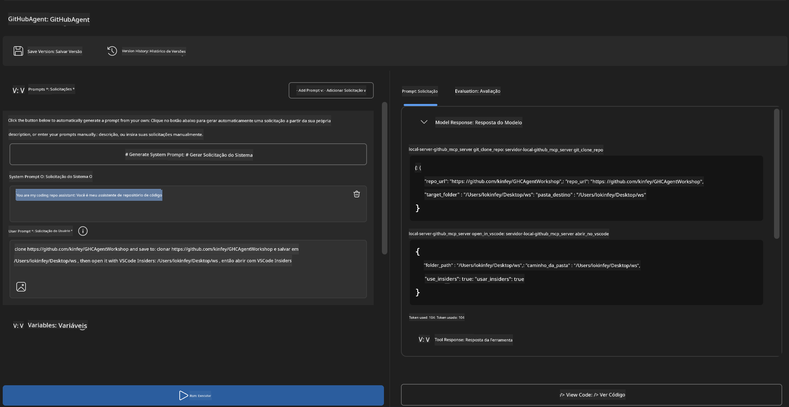
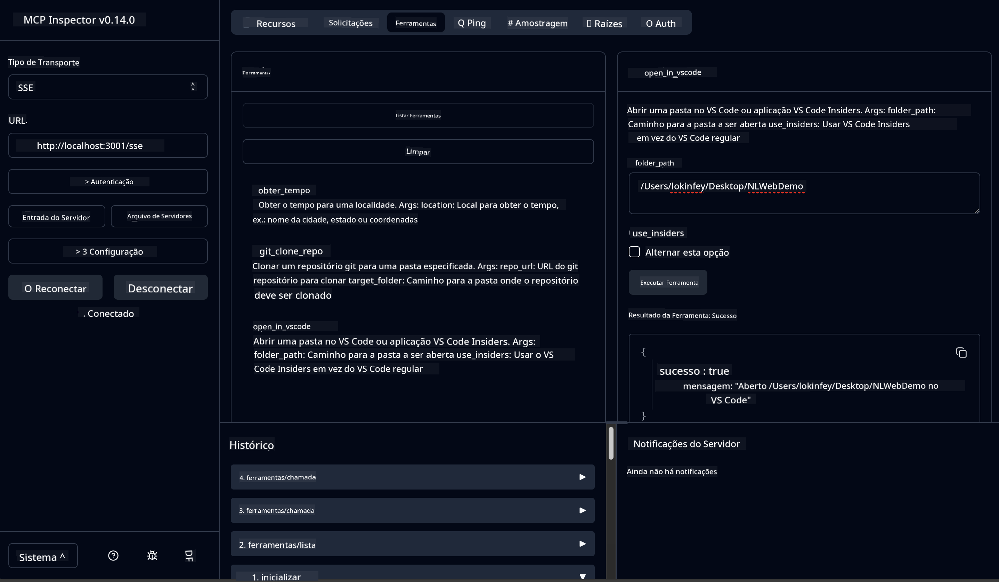

<!--
CO_OP_TRANSLATOR_METADATA:
{
  "original_hash": "f83bc722dc758efffd68667d6a1db470",
  "translation_date": "2025-07-14T08:41:00+00:00",
  "source_file": "10-StreamliningAIWorkflowsBuildingAnMCPServerWithAIToolkit/lab4/README.md",
  "language_code": "br"
}
-->
# 🐙 Módulo 4: Desenvolvimento Prático de MCP - Servidor Personalizado de Clone do GitHub


> **⚡ Início Rápido:** Construa um servidor MCP pronto para produção que automatiza o clone de repositórios GitHub e a integração com VS Code em apenas 30 minutos!

## 🎯 Objetivos de Aprendizagem

Ao final deste laboratório, você será capaz de:

- ✅ Criar um servidor MCP personalizado para fluxos de trabalho de desenvolvimento reais
- ✅ Implementar funcionalidade de clonagem de repositórios GitHub via MCP
- ✅ Integrar servidores MCP personalizados com VS Code e Agent Builder
- ✅ Usar o modo Agent do GitHub Copilot com ferramentas MCP personalizadas
- ✅ Testar e implantar servidores MCP personalizados em ambientes de produção

## 📋 Pré-requisitos

- Conclusão dos Laboratórios 1-3 (fundamentos e desenvolvimento avançado de MCP)
- Assinatura do GitHub Copilot ([cadastro gratuito disponível](https://github.com/github-copilot/signup))
- VS Code com as extensões AI Toolkit e GitHub Copilot instaladas
- Git CLI instalado e configurado

## 🏗️ Visão Geral do Projeto

### **Desafio Real de Desenvolvimento**
Como desenvolvedores, frequentemente usamos o GitHub para clonar repositórios e abri-los no VS Code ou VS Code Insiders. Esse processo manual envolve:
1. Abrir o terminal/prompt de comando
2. Navegar até o diretório desejado
3. Executar o comando `git clone`
4. Abrir o VS Code no diretório clonado

**Nossa solução MCP simplifica tudo isso em um único comando inteligente!**

### **O Que Você Vai Construir**
Um **Servidor MCP de Clone do GitHub** (`git_mcp_server`) que oferece:

| Recurso | Descrição | Benefício |
|---------|-------------|---------|
| 🔄 **Clonagem Inteligente de Repositórios** | Clona repositórios GitHub com validação | Verificação automática de erros |
| 📁 **Gerenciamento Inteligente de Diretórios** | Verifica e cria diretórios com segurança | Evita sobrescrita de arquivos |
| 🚀 **Integração Cross-Platform com VS Code** | Abre projetos no VS Code/Insiders | Transição fluida no fluxo de trabalho |
| 🛡️ **Tratamento Robusto de Erros** | Lida com problemas de rede, permissões e caminhos | Confiabilidade pronta para produção |

---

## 📖 Implementação Passo a Passo

### Passo 1: Criar Agente GitHub no Agent Builder

1. **Abra o Agent Builder** pela extensão AI Toolkit
2. **Crie um novo agente** com a seguinte configuração:
   ```
   Agent Name: GitHubAgent
   ```

3. **Inicialize o servidor MCP personalizado:**
   - Vá em **Ferramentas** → **Adicionar Ferramenta** → **Servidor MCP**
   - Selecione **"Criar um novo Servidor MCP"**
   - Escolha o **template Python** para máxima flexibilidade
   - **Nome do Servidor:** `git_mcp_server`

### Passo 2: Configurar o Modo Agent do GitHub Copilot

1. **Abra o GitHub Copilot** no VS Code (Ctrl/Cmd + Shift + P → "GitHub Copilot: Open")
2. **Selecione o Modelo Agent** na interface do Copilot
3. **Escolha o modelo Claude 3.7** para capacidades avançadas de raciocínio
4. **Ative a integração MCP** para acesso às ferramentas

> **💡 Dica Profissional:** O Claude 3.7 oferece melhor compreensão dos fluxos de trabalho de desenvolvimento e padrões de tratamento de erros.

### Passo 3: Implementar a Funcionalidade Principal do Servidor MCP

**Use o prompt detalhado abaixo com o modo Agent do GitHub Copilot:**

```
Create two MCP tools with the following comprehensive requirements:

🔧 TOOL A: clone_repository
Requirements:
- Clone any GitHub repository to a specified local folder
- Return the absolute path of the successfully cloned project
- Implement comprehensive validation:
  ✓ Check if target directory already exists (return error if exists)
  ✓ Validate GitHub URL format (https://github.com/user/repo)
  ✓ Verify git command availability (prompt installation if missing)
  ✓ Handle network connectivity issues
  ✓ Provide clear error messages for all failure scenarios

🚀 TOOL B: open_in_vscode
Requirements:
- Open specified folder in VS Code or VS Code Insiders
- Cross-platform compatibility (Windows/Linux/macOS)
- Use direct application launch (not terminal commands)
- Auto-detect available VS Code installations
- Handle cases where VS Code is not installed
- Provide user-friendly error messages

Additional Requirements:
- Follow MCP 1.9.3 best practices
- Include proper type hints and documentation
- Implement logging for debugging purposes
- Add input validation for all parameters
- Include comprehensive error handling
```

### Passo 4: Testar Seu Servidor MCP

#### 4a. Teste no Agent Builder

1. **Inicie a configuração de depuração** no Agent Builder
2. **Configure seu agente com este prompt do sistema:**

```
SYSTEM_PROMPT:
You are my intelligent coding repository assistant. You help developers efficiently clone GitHub repositories and set up their development environment. Always provide clear feedback about operations and handle errors gracefully.
```

3. **Teste com cenários realistas de usuário:**

```
USER_PROMPT EXAMPLES:

Scenario : Basic Clone and Open
"Clone {Your GitHub Repo link such as https://github.com/kinfey/GHCAgentWorkshop
 } and save to {The global path you specify}, then open it with VS Code Insiders"
```



**Resultados Esperados:**
- ✅ Clonagem bem-sucedida com confirmação do caminho
- ✅ Abertura automática do VS Code
- ✅ Mensagens claras de erro para cenários inválidos
- ✅ Tratamento adequado de casos extremos

#### 4b. Teste no MCP Inspector




---


**🎉 Parabéns!** Você criou com sucesso um servidor MCP prático e pronto para produção que resolve desafios reais de fluxo de trabalho de desenvolvimento. Seu servidor personalizado de clone do GitHub demonstra o poder do MCP para automatizar e aumentar a produtividade dos desenvolvedores.

### 🏆 Conquistas Desbloqueadas:
- ✅ **Desenvolvedor MCP** - Criou servidor MCP personalizado
- ✅ **Automatizador de Fluxos** - Otimizou processos de desenvolvimento  
- ✅ **Especialista em Integração** - Conectou múltiplas ferramentas de desenvolvimento
- ✅ **Pronto para Produção** - Criou soluções implantáveis

---

## 🎓 Conclusão do Workshop: Sua Jornada com o Model Context Protocol

**Caro Participante do Workshop,**

Parabéns por completar os quatro módulos do workshop Model Context Protocol! Você avançou muito, desde entender os conceitos básicos do AI Toolkit até construir servidores MCP prontos para produção que resolvem desafios reais de desenvolvimento.

### 🚀 Recapitulação do Seu Caminho de Aprendizagem:

**[Módulo 1](../lab1/README.md)**: Você começou explorando fundamentos do AI Toolkit, testes de modelos e criando seu primeiro agente de IA.

**[Módulo 2](../lab2/README.md)**: Aprendeu a arquitetura MCP, integrou o Playwright MCP e construiu seu primeiro agente de automação de navegador.

**[Módulo 3](../lab3/README.md)**: Avançou para desenvolvimento de servidores MCP personalizados com o Weather MCP server e dominou ferramentas de depuração.

**[Módulo 4](../lab4/README.md)**: Aplicou tudo para criar uma ferramenta prática de automação de fluxo de trabalho com repositórios GitHub.

### 🌟 O Que Você Dominou:

- ✅ **Ecossistema AI Toolkit**: Modelos, agentes e padrões de integração
- ✅ **Arquitetura MCP**: Design cliente-servidor, protocolos de transporte e segurança
- ✅ **Ferramentas para Desenvolvedores**: Do Playground ao Inspector até implantação em produção
- ✅ **Desenvolvimento Personalizado**: Construção, teste e implantação de seus próprios servidores MCP
- ✅ **Aplicações Práticas**: Solução de desafios reais de fluxo de trabalho com IA

### 🔮 Seus Próximos Passos:

1. **Construa Seu Próprio Servidor MCP**: Aplique essas habilidades para automatizar seus fluxos únicos
2. **Participe da Comunidade MCP**: Compartilhe suas criações e aprenda com outros
3. **Explore Integrações Avançadas**: Conecte servidores MCP a sistemas corporativos
4. **Contribua para Open Source**: Ajude a melhorar as ferramentas e documentação MCP

Lembre-se, este workshop é apenas o começo. O ecossistema Model Context Protocol está evoluindo rapidamente, e você agora está preparado para estar na vanguarda das ferramentas de desenvolvimento com IA.

**Obrigado pela sua participação e dedicação ao aprendizado!**

Esperamos que este workshop tenha inspirado ideias que transformarão a forma como você constrói e interage com ferramentas de IA na sua jornada de desenvolvimento.

**Boas codificações!**

---

**Aviso Legal**:  
Este documento foi traduzido utilizando o serviço de tradução por IA [Co-op Translator](https://github.com/Azure/co-op-translator). Embora nos esforcemos para garantir a precisão, esteja ciente de que traduções automáticas podem conter erros ou imprecisões. O documento original em seu idioma nativo deve ser considerado a fonte autorizada. Para informações críticas, recomenda-se tradução profissional humana. Não nos responsabilizamos por quaisquer mal-entendidos ou interpretações incorretas decorrentes do uso desta tradução.