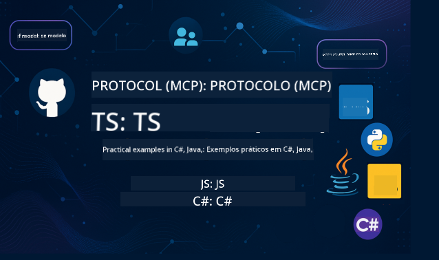

<!--
CO_OP_TRANSLATOR_METADATA:
{
  "original_hash": "a016679b18071ab1ad4309c0cb4cb8ca",
  "translation_date": "2025-05-19T14:53:14+00:00",
  "source_file": "README.md",
  "language_code": "br"
}
-->

Siga estes passos para começar a usar estes recursos:
1. **Faça um Fork do Repositório**: Clique em 
2. **Clone o Repositório**:   `git clone https://github.com/microsoft/mcp-for-beginners.git`
3. [**Participe do Discord Azure AI Foundry e conheça especialistas e outros desenvolvedores**](https://discord.com/invite/ByRwuEEgH4)

### 🌐 Suporte Multilíngue

#### Suportado via GitHub Action (Automatizado e Sempre Atualizado)
[Francês](../fr/README.md) | [Espanhol](../es/README.md) | [Alemão](../de/README.md) | [Russo](../ru/README.md) | [Árabe](../ar/README.md) | [Persa (Farsi)](../fa/README.md) | [Urdu](../ur/README.md) | [Chinês (Simplificado)](../zh/README.md) | [Chinês (Tradicional, Macau)](../mo/README.md) | [Chinês (Tradicional, Hong Kong)](../hk/README.md) | [Chinês (Tradicional, Taiwan)](../tw/README.md) | [Japonês](../ja/README.md) | [Coreano](../ko/README.md) | [Hindi](../hi/README.md) | [Bengali](../bn/README.md) | [Marathi](../mr/README.md) | [Nepali](../ne/README.md) | [Punjabi (Gurmukhi)](../pa/README.md) | [Português (Portugal)](../pt/README.md) | [Português (Brasil)](./README.md) | [Italiano](../it/README.md) | [Polonês](../pl/README.md) | [Turco](../tr/README.md) | [Grego](../el/README.md) | [Tailandês](../th/README.md) | [Sueco](../sv/README.md) | [Dinamarquês](../da/README.md) | [Norueguês](../no/README.md) | [Finlandês](../fi/README.md) | [Holandês](../nl/README.md) | [Hebraico](../he/README.md) | [Vietnamita](../vi/README.md) | [Indonésio](../id/README.md) | [Malaio](../ms/README.md) | [Tagalo (Filipino)](../tl/README.md) | [Suaíli](../sw/README.md) | [Húngaro](../hu/README.md) | [Tcheco](../cs/README.md) | [Eslovaco](../sk/README.md) | [Romeno](../ro/README.md) | [Búlgaro](../bg/README.md) | [Sérvio (Cirílico)](../sr/README.md) | [Croata](../hr/README.md) | [Esloveno](../sl/README.md)
# 🚀 Guia Definitivo do Currículo do Model Context Protocol (MCP) para Iniciantes

## **Aprenda MCP com Exemplos Práticos em C#, Java, JavaScript, Python e TypeScript**

## 🧠 Visão Geral do Currículo do Model Context Protocol

O **Model Context Protocol (MCP)** é um framework inovador criado para padronizar as interações entre modelos de IA e aplicações clientes. Este currículo open-source oferece um caminho de aprendizado estruturado, com exemplos práticos de código e casos de uso reais, abrangendo linguagens populares como C#, Java, JavaScript, TypeScript e Python.

Seja você um desenvolvedor de IA, arquiteto de sistemas ou engenheiro de software, este guia é seu recurso completo para dominar os fundamentos do MCP e estratégias de implementação.

## 🔗 Recursos Oficiais do MCP

- 📘 [MCP Documentation](https://modelcontextprotocol.io/) – Tutoriais detalhados e guias do usuário  
- 📜 [MCP Specification](https://spec.modelcontextprotocol.io/) – Arquitetura do protocolo e referências técnicas  
- 🧑‍💻 [MCP GitHub Repository](https://github.com/modelcontextprotocol) – SDKs open-source, ferramentas e exemplos de código  

## 🧭 Estrutura Completa do Currículo MCP

### 📌 [Introdução ao MCP](./00-Introduction/README.md)

- O que é o Model Context Protocol?  
- Por que a padronização é importante em pipelines de IA  
- Casos práticos e benefícios do MCP  

### 🧩 [Conceitos Básicos Explicados](./01-CoreConcepts/README.md)

- Entendendo a arquitetura cliente-servidor no MCP  
- Componentes-chave do protocolo: requests, responses e schemas  
- Padrões de mensagens e troca de dados no MCP  

### 🔐 [Segurança no MCP](./02-Security/readme.md)

- Identificando ameaças de segurança em sistemas baseados em MCP  
- Técnicas e boas práticas para garantir implementações seguras  

### 🚀 [Começando com MCP](./03-GettingStarted/README.md)

- Configuração do ambiente  
- Criando servidores e clientes MCP básicos  
- Integrando MCP com aplicações existentes  

#### 🧮 Projetos de Exemplo do Calculador MCP:

  
<strong>Explore Implementações de Código por Linguagem</strong>

  - [Exemplo de Servidor MCP em C#](./03-GettingStarted/samples/csharp/README.md)  
  - [Calculadora MCP em Java](./03-GettingStarted/samples/java/calculator/README.md)  
  - [Demonstração MCP em JavaScript](./03-GettingStarted/samples/javascript/README.md)  
  - [Servidor MCP em Python](../../03-GettingStarted/samples/python/mcp_calculator_server.py)  
  - [Exemplo MCP em TypeScript](./03-GettingStarted/samples/typescript/README.md)  

### 🛠️ [Implementação Prática](./04-PracticalImplementation/README.md)

- Utilizando SDKs em diferentes linguagens  
- Depuração, testes e validação  
- Criando templates reutilizáveis de prompt e fluxos de trabalho  

#### 💡 Projetos Avançados do Calculador MCP:

  
<strong>Explore Exemplos Avançados</strong>

  - [Exemplo Avançado em C#](./04-PracticalImplementation/samples/csharp/README.md)  
  - [Aplicativo Container em Java](./04-PracticalImplementation/samples/java/containerapp/README.md)  
  - [Exemplo Avançado em JavaScript](./04-PracticalImplementation/samples/javascript/README.md)  
  - [Implementação Complexa em Python](../../04-PracticalImplementation/samples/python/mcp_sample.py)  
  - [Exemplo Container em TypeScript](./04-PracticalImplementation/samples/typescript/README.md)  

### 🎓 [Tópicos Avançados no MCP](./05-AdvancedTopics/README.md)

- Fluxos de trabalho multimodais de IA e extensibilidade  
- Estratégias seguras de escalabilidade  
- MCP em ecossistemas corporativos  

### 🌍 [Contribuições da Comunidade](./06-CommunityContributions/README.md)

- Como contribuir com código e documentação  
- Colaboração via GitHub  
- Melhorias e feedback impulsionados pela comunidade  

### 📈 [Insights da Adoção Inicial](./07-CaseStudies/README.md)

- Implementações reais e resultados obtidos  
- Construção e implantação de soluções baseadas em MCP  
- Tendências e roadmap futuro  

### 📏 [Melhores Práticas para MCP](./08-BestPractices/README.md)

- Ajuste de performance e otimização  
- Projetando sistemas MCP tolerantes a falhas  
- Estratégias de teste e resiliência  

### 📊 [Estudos de Caso MCP](./09-CaseStudy/Readme.md)

- Análises aprofundadas das arquiteturas de soluções MCP  
- Modelos de implantação e dicas de integração  
- Diagramas anotados e walkthroughs de projetos  

## 🎯 Pré-requisitos para Aprender MCP

Para aproveitar ao máximo este currículo, você deve ter:

- Conhecimentos básicos em C#, Java ou Python  
- Entendimento do modelo cliente-servidor e APIs  
- (Opcional) Familiaridade com conceitos de machine learning  

## 🛠️ Como Usar Este Currículo de Forma Eficaz

Cada lição deste guia inclui:

1. Explicações claras dos conceitos MCP  
2. Exemplos de código ao vivo em várias linguagens  
3. Exercícios para construir aplicações reais com MCP  
4. Recursos extras para aprendizes avançados  

## 📜 Informações sobre Licença

Este conteúdo está licenciado sob a **MIT License**. Para termos e condições, consulte o [LICENSE](../../LICENSE).

## 🤝 Diretrizes para Contribuição

Este projeto recebe contribuições e sugestões. A maioria das contribuições exige que você concorde com um Contributor License Agreement (CLA) declarando que você tem o direito e realmente concede os direitos para usarmos sua contribuição. Para detalhes, visite <https://cla.opensource.microsoft.com>.

Ao enviar um pull request, um bot CLA determinará automaticamente se você precisa fornecer um CLA e decorará o PR apropriadamente (por exemplo, verificação de status, comentário). Basta seguir as instruções fornecidas pelo bot. Você precisará fazer isso apenas uma vez em todos os repositórios que usam nosso CLA.

Este projeto adotou o [Microsoft Open Source Code of Conduct](https://opensource.microsoft.com/codeofconduct/). Para mais informações, consulte o [Code of Conduct FAQ](https://opensource.microsoft.com/codeofconduct/faq/) ou entre em contato pelo email [opencode@microsoft.com](mailto:opencode@microsoft.com) para dúvidas ou comentários adicionais.

## 🎒 Outros Cursos  
Nossa equipe produz outros cursos! Confira:

- [AI Agents For Beginners](https://github.com/microsoft/ai-agents-beginners?WT.mc_id=academic-105485-koreyst)  
- [Generative AI for Beginners using .NET](https://github.com/microsoft/Generative-AI-for-beginners-dotnet?WT.mc_id=academic-105485-koreyst)  
- [Generative AI for Beginners](https://github.com/microsoft/generative-ai-for-beginners?WT.mc_id=academic-105485-koreyst)
- [ML for Beginners](https://aka.ms/ml-beginners?WT.mc_id=academic-105485-koreyst)
- [Data Science for Beginners](https://aka.ms/datascience-beginners?WT.mc_id=academic-105485-koreyst)
- [AI for Beginners](https://aka.ms/ai-beginners?WT.mc_id=academic-105485-koreyst)
- [Cybersecurity for Beginners](https://github.com/microsoft/Security-101??WT.mc_id=academic-96948-sayoung)
- [Web Dev for Beginners](https://aka.ms/webdev-beginners?WT.mc_id=academic-105485-koreyst)
- [IoT for Beginners](https://aka.ms/iot-beginners?WT.mc_id=academic-105485-koreyst)
- [XR Development for Beginners](https://github.com/microsoft/xr-development-for-beginners?WT.mc_id=academic-105485-koreyst)
- [Mastering GitHub Copilot for AI Paired Programming](https://aka.ms/GitHubCopilotAI?WT.mc_id=academic-105485-koreyst)
- [Mastering GitHub Copilot for C#/.NET Developers](https://github.com/microsoft/mastering-github-copilot-for-dotnet-csharp-developers?WT.mc_id=academic-105485-koreyst)
- [Choose Your Own Copilot Adventure](https://github.com/microsoft/CopilotAdventures?WT.mc_id=academic-105485-koreyst)

## ™️ Aviso de Marca Registrada

Este projeto pode conter marcas registradas ou logotipos de projetos, produtos ou serviços. O uso autorizado das marcas registradas ou logotipos da Microsoft está sujeito e deve seguir as [Diretrizes de Marca e Identidade da Microsoft](https://www.microsoft.com/legal/intellectualproperty/trademarks/usage/general).  
O uso das marcas registradas ou logotipos da Microsoft em versões modificadas deste projeto não deve causar confusão nem sugerir patrocínio da Microsoft.  
Qualquer uso de marcas registradas ou logotipos de terceiros está sujeito às políticas desses terceiros.

**Aviso Legal**:  
Este documento foi traduzido utilizando o serviço de tradução automática [Co-op Translator](https://github.com/Azure/co-op-translator). Embora nos esforcemos para garantir a precisão, esteja ciente de que traduções automáticas podem conter erros ou imprecisões. O documento original em seu idioma nativo deve ser considerado a fonte autorizada. Para informações críticas, recomenda-se a tradução profissional feita por humanos. Não nos responsabilizamos por quaisquer mal-entendidos ou interpretações incorretas decorrentes do uso desta tradução.