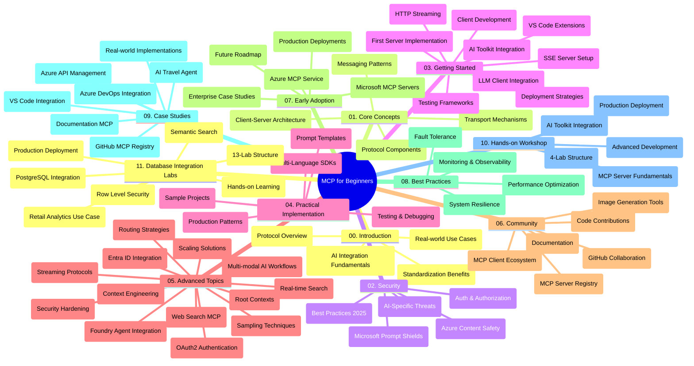

<!--
CO_OP_TRANSLATOR_METADATA:
{
  "original_hash": "aa1ce97bc694b08faf3018bab6d275b9",
  "translation_date": "2025-09-30T16:16:00+00:00",
  "source_file": "study_guide.md",
  "language_code": "br"
}
-->
# Protocolo de Contexto de Modelo (MCP) para Iniciantes - Guia de Estudo

Este guia de estudo oferece uma visão geral da estrutura e do conteúdo do repositório para o currículo "Protocolo de Contexto de Modelo (MCP) para Iniciantes". Use este guia para navegar pelo repositório de forma eficiente e aproveitar ao máximo os recursos disponíveis.

## Visão Geral do Repositório

O Protocolo de Contexto de Modelo (MCP) é uma estrutura padronizada para interações entre modelos de IA e aplicativos clientes. Inicialmente criado pela Anthropic, o MCP agora é mantido pela comunidade MCP por meio da organização oficial no GitHub. Este repositório fornece um currículo abrangente com exemplos práticos de código em C#, Java, JavaScript, Python e TypeScript, projetado para desenvolvedores de IA, arquitetos de sistemas e engenheiros de software.

## Mapa Visual do Currículo

## Estrutura do Repositório

O repositório está organizado em onze seções principais, cada uma focando em diferentes aspectos do MCP:

1. **Introdução (00-Introduction/)**
   - Visão geral do Protocolo de Contexto de Modelo
   - Por que a padronização é importante em pipelines de IA
   - Casos de uso práticos e benefícios

2. **Conceitos Fundamentais (01-CoreConcepts/)**
   - Arquitetura cliente-servidor
   - Componentes principais do protocolo
   - Padrões de mensagens no MCP

3. **Segurança (02-Security/)**
   - Ameaças de segurança em sistemas baseados em MCP
   - Melhores práticas para proteger implementações
   - Estratégias de autenticação e autorização
   - **Documentação Abrangente de Segurança**:
     - Melhores Práticas de Segurança MCP 2025
     - Guia de Implementação de Segurança do Azure Content Safety
     - Controles e Técnicas de Segurança MCP
     - Referência Rápida de Melhores Práticas MCP
   - **Tópicos Principais de Segurança**:
     - Ataques de injeção de prompt e envenenamento de ferramentas
     - Sequestro de sessão e problemas de confusão de autoridade
     - Vulnerabilidades de passagem de token
     - Permissões excessivas e controle de acesso
     - Segurança da cadeia de suprimentos para componentes de IA
     - Integração com Microsoft Prompt Shields

4. **Primeiros Passos (03-GettingStarted/)**
   - Configuração e preparação do ambiente
   - Criação de servidores e clientes MCP básicos
   - Integração com aplicativos existentes
   - Inclui seções para:
     - Primeira implementação de servidor
     - Desenvolvimento de cliente
     - Integração de cliente LLM
     - Integração com VS Code
     - Servidor de Eventos Enviados pelo Servidor (SSE)
     - Streaming HTTP
     - Integração com AI Toolkit
     - Estratégias de teste
     - Diretrizes de implantação

5. **Implementação Prática (04-PracticalImplementation/)**
   - Uso de SDKs em diferentes linguagens de programação
   - Técnicas de depuração, teste e validação
   - Criação de templates de prompt reutilizáveis e fluxos de trabalho
   - Projetos de exemplo com exemplos de implementação

6. **Tópicos Avançados (05-AdvancedTopics/)**
   - Técnicas de engenharia de contexto
   - Integração de agentes Foundry
   - Fluxos de trabalho de IA multimodal
   - Demonstrações de autenticação OAuth2
   - Capacidades de busca em tempo real
   - Streaming em tempo real
   - Implementação de contextos raiz
   - Estratégias de roteamento
   - Técnicas de amostragem
   - Abordagens de escalabilidade
   - Considerações de segurança
   - Integração de segurança Entra ID
   - Integração com busca na web

7. **Contribuições da Comunidade (06-CommunityContributions/)**
   - Como contribuir com código e documentação
   - Colaboração via GitHub
   - Melhorias e feedback impulsionados pela comunidade
   - Uso de vários clientes MCP (Claude Desktop, Cline, VSCode)
   - Trabalho com servidores MCP populares, incluindo geração de imagens

8. **Lições da Adoção Inicial (07-LessonsfromEarlyAdoption/)**
   - Implementações reais e histórias de sucesso
   - Construção e implantação de soluções baseadas em MCP
   - Tendências e roteiro futuro
   - **Guia de Servidores MCP da Microsoft**: Guia abrangente de 10 servidores MCP prontos para produção da Microsoft, incluindo:
     - Servidor MCP do Microsoft Learn Docs
     - Servidor MCP do Azure (15+ conectores especializados)
     - Servidor MCP do GitHub
     - Servidor MCP do Azure DevOps
     - Servidor MCP do MarkItDown
     - Servidor MCP do SQL Server
     - Servidor MCP do Playwright
     - Servidor MCP do Dev Box
     - Servidor MCP do Azure AI Foundry
     - Servidor MCP do Microsoft 365 Agents Toolkit

9. **Melhores Práticas (08-BestPractices/)**
   - Ajuste de desempenho e otimização
   - Design de sistemas MCP tolerantes a falhas
   - Estratégias de teste e resiliência

10. **Estudos de Caso (09-CaseStudy/)**
    - **Sete estudos de caso abrangentes** demonstrando a versatilidade do MCP em diversos cenários:
    - **Agentes de Viagem com Azure AI**: Orquestração multiagente com Azure OpenAI e AI Search
    - **Integração com Azure DevOps**: Automação de processos de fluxo de trabalho com atualizações de dados do YouTube
    - **Recuperação de Documentação em Tempo Real**: Cliente de console Python com streaming HTTP
    - **Gerador Interativo de Planos de Estudo**: Aplicativo web Chainlit com IA conversacional
    - **Documentação no Editor**: Integração com VS Code e fluxos de trabalho do GitHub Copilot
    - **Gerenciamento de API do Azure**: Integração de API empresarial com criação de servidor MCP
    - **Registro MCP do GitHub**: Desenvolvimento de ecossistema e plataforma de integração agentic
    - Exemplos de implementação abrangendo integração empresarial, produtividade do desenvolvedor e desenvolvimento de ecossistema

11. **Workshop Prático (10-StreamliningAIWorkflowsBuildingAnMCPServerWithAIToolkit/)**
    - Workshop prático abrangente combinando MCP com AI Toolkit
    - Construção de aplicativos inteligentes que conectam modelos de IA com ferramentas do mundo real
    - Módulos práticos cobrindo fundamentos, desenvolvimento de servidor personalizado e estratégias de implantação em produção
    - **Estrutura do Laboratório**:
      - Laboratório 1: Fundamentos do Servidor MCP
      - Laboratório 2: Desenvolvimento Avançado de Servidor MCP
      - Laboratório 3: Integração com AI Toolkit
      - Laboratório 4: Implantação e Escalabilidade em Produção
    - Abordagem de aprendizado baseada em laboratório com instruções passo a passo

12. **Laboratórios de Integração de Banco de Dados com Servidor MCP (11-MCPServerHandsOnLabs/)**
    - **Caminho de aprendizado abrangente com 13 laboratórios** para construção de servidores MCP prontos para produção com integração PostgreSQL
    - **Implementação de análise de varejo no mundo real** usando o caso de uso Zava Retail
    - **Padrões de nível empresarial** incluindo Segurança de Nível de Linha (RLS), busca semântica e acesso a dados multi-tenant
    - **Estrutura Completa do Laboratório**:
      - **Laboratórios 00-03: Fundamentos** - Introdução, Arquitetura, Segurança, Configuração do Ambiente
      - **Laboratórios 04-06: Construção do Servidor MCP** - Design de Banco de Dados, Implementação do Servidor MCP, Desenvolvimento de Ferramentas
      - **Laboratórios 07-09: Recursos Avançados** - Busca Semântica, Teste e Depuração, Integração com VS Code
      - **Laboratórios 10-12: Produção e Melhores Práticas** - Implantação, Monitoramento, Otimização
    - **Tecnologias Abrangidas**: Framework FastMCP, PostgreSQL, Azure OpenAI, Azure Container Apps, Application Insights
    - **Resultados de Aprendizado**: Servidores MCP prontos para produção, padrões de integração de banco de dados, análises impulsionadas por IA, segurança empresarial

## Recursos Adicionais

O repositório inclui recursos de suporte:

- **Pasta de Imagens**: Contém diagramas e ilustrações usados ao longo do currículo
- **Traduções**: Suporte multilíngue com traduções automáticas da documentação
- **Recursos Oficiais do MCP**:
  - [Documentação MCP](https://modelcontextprotocol.io/)
  - [Especificação MCP](https://spec.modelcontextprotocol.io/)
  - [Repositório GitHub MCP](https://github.com/modelcontextprotocol)

## Como Usar Este Repositório

1. **Aprendizado Sequencial**: Siga os capítulos na ordem (00 a 11) para uma experiência de aprendizado estruturada.
2. **Foco Específico em Linguagem**: Se você está interessado em uma linguagem de programação específica, explore os diretórios de exemplos para implementações na sua linguagem preferida.
3. **Implementação Prática**: Comece com a seção "Primeiros Passos" para configurar seu ambiente e criar seu primeiro servidor e cliente MCP.
4. **Exploração Avançada**: Após se familiarizar com os fundamentos, mergulhe nos tópicos avançados para expandir seu conhecimento.
5. **Engajamento Comunitário**: Junte-se à comunidade MCP por meio de discussões no GitHub e canais do Discord para se conectar com especialistas e outros desenvolvedores.

## Clientes e Ferramentas MCP

O currículo aborda vários clientes e ferramentas MCP:

1. **Clientes Oficiais**:
   - Visual Studio Code 
   - MCP no Visual Studio Code
   - Claude Desktop
   - Claude no VSCode 
   - Claude API

2. **Clientes da Comunidade**:
   - Cline (baseado em terminal)
   - Cursor (editor de código)
   - ChatMCP
   - Windsurf

3. **Ferramentas de Gerenciamento MCP**:
   - MCP CLI
   - MCP Manager
   - MCP Linker
   - MCP Router

## Servidores MCP Populares

O repositório apresenta vários servidores MCP, incluindo:

1. **Servidores MCP Oficiais da Microsoft**:
   - Servidor MCP do Microsoft Learn Docs
   - Servidor MCP do Azure (15+ conectores especializados)
   - Servidor MCP do GitHub
   - Servidor MCP do Azure DevOps
   - Servidor MCP do MarkItDown
   - Servidor MCP do SQL Server
   - Servidor MCP do Playwright
   - Servidor MCP do Dev Box
   - Servidor MCP do Azure AI Foundry
   - Servidor MCP do Microsoft 365 Agents Toolkit

2. **Servidores de Referência Oficiais**:
   - Sistema de Arquivos
   - Fetch
   - Memória
   - Pensamento Sequencial

3. **Geração de Imagens**:
   - Azure OpenAI DALL-E 3
   - Stable Diffusion WebUI
   - Replicate

4. **Ferramentas de Desenvolvimento**:
   - Git MCP
   - Controle de Terminal
   - Assistente de Código

5. **Servidores Especializados**:
   - Salesforce
   - Microsoft Teams
   - Jira & Confluence

## Contribuindo

Este repositório aceita contribuições da comunidade. Consulte a seção Contribuições da Comunidade para orientações sobre como contribuir efetivamente para o ecossistema MCP.

## Registro de Alterações

| Data | Alterações |
|------|---------||
| 29 de setembro de 2025 | - Adicionada a seção 11-MCPServerHandsOnLabs com caminho de aprendizado abrangente de 13 laboratórios de integração de banco de dados - Atualizado o Mapa Visual do Currículo para incluir Laboratórios de Integração de Banco de Dados - Estrutura do repositório aprimorada para refletir onze seções principais - Adicionada descrição detalhada da integração PostgreSQL, caso de uso de análise de varejo e padrões empresariais - Atualizada orientação de navegação para incluir seções 00-11 |
| 26 de setembro de 2025 | - Adicionado estudo de caso Registro MCP do GitHub à seção 09-CaseStudy - Atualizados Estudos de Caso para refletir sete estudos de caso abrangentes - Descrições de estudos de caso aprimoradas com detalhes específicos de implementação - Atualizado o Mapa Visual do Currículo para incluir Registro MCP do GitHub - Estrutura do guia de estudo revisada para refletir foco no desenvolvimento de ecossistema |
| 18 de julho de 2025 | - Estrutura do repositório atualizada para incluir Guia de Servidores MCP da Microsoft - Adicionada lista abrangente de 10 servidores MCP prontos para produção da Microsoft - Seção Servidores MCP Populares aprimorada com Servidores MCP Oficiais da Microsoft - Seção Estudos de Caso atualizada com exemplos reais de arquivos - Adicionados detalhes da Estrutura do Laboratório para Workshop Prático |
| 16 de julho de 2025 | - Estrutura do repositório atualizada para refletir conteúdo atual - Adicionada seção Clientes e Ferramentas MCP - Adicionada seção Servidores MCP Populares - Atualizado o Mapa Visual do Currículo com todos os tópicos atuais - Seção Tópicos Avançados aprimorada com todas as áreas especializadas - Estudos de Caso atualizados para refletir exemplos reais - Clarificada origem do MCP como criado pela Anthropic |
| 11 de junho de 2025 | - Criação inicial do guia de estudo - Adicionado Mapa Visual do Currículo - Estrutura do repositório delineada - Incluídos projetos de exemplo e recursos adicionais |

---

*Este guia de estudo foi atualizado em 29 de setembro de 2025 e fornece uma visão geral do repositório até essa data. O conteúdo do repositório pode ser atualizado após essa data.*

---

**Aviso Legal**:  
Este documento foi traduzido utilizando o serviço de tradução por IA [Co-op Translator](https://github.com/Azure/co-op-translator). Embora nos esforcemos para garantir a precisão, esteja ciente de que traduções automatizadas podem conter erros ou imprecisões. O documento original em seu idioma nativo deve ser considerado a fonte oficial. Para informações críticas, recomenda-se a tradução profissional realizada por humanos. Não nos responsabilizamos por quaisquer mal-entendidos ou interpretações equivocadas decorrentes do uso desta tradução.