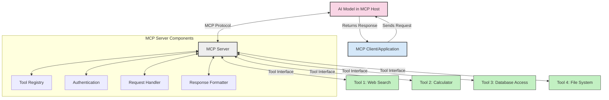
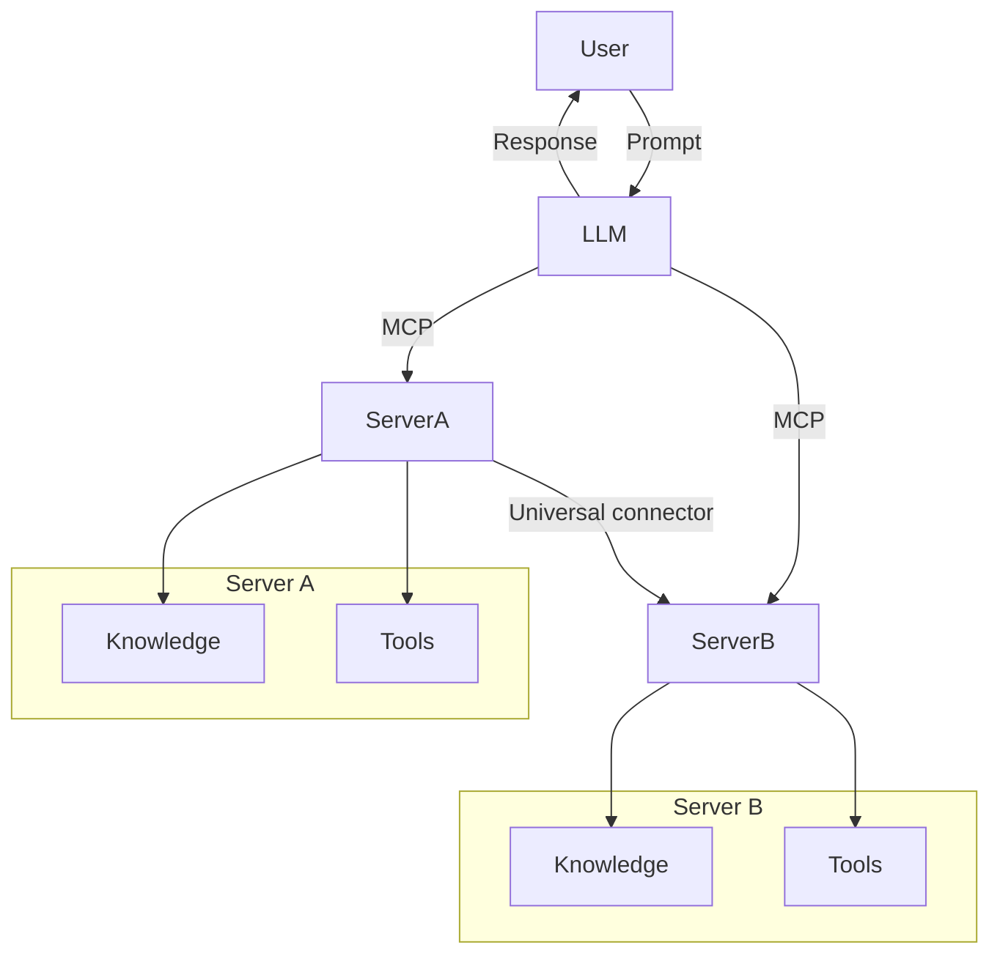

<!--
CO_OP_TRANSLATOR_METADATA:
{
  "original_hash": "02301140adbd807ecf0f17720fa307bc",
  "translation_date": "2025-05-17T06:08:22+00:00",
  "source_file": "00-Introduction/README.md",
  "language_code": "cs"
}
-->
# Úvod do Model Context Protocol (MCP): Proč je důležitý pro škálovatelné AI aplikace

Generativní AI aplikace představují velký krok vpřed, protože často umožňují uživatelům interakci s aplikací pomocí přirozených jazykových příkazů. Jakmile ale do těchto aplikací investujete více času a zdrojů, chcete mít jistotu, že můžete snadno integrovat funkce a zdroje tak, aby bylo snadné je rozšiřovat, aby vaše aplikace mohla využívat více než jeden model a jeho složitosti. Stručně řečeno, stavba Gen AI aplikací je na začátku snadná, ale jakmile rostou a stávají se složitějšími, musíte začít definovat architekturu a pravděpodobně se budete muset opřít o standard, abyste zajistili, že vaše aplikace budou postaveny konzistentním způsobem. Zde přichází MCP, aby věci uspořádal a poskytl standard.

---

## **🔍 Co je Model Context Protocol (MCP)?**

**Model Context Protocol (MCP)** je **otevřené, standardizované rozhraní**, které umožňuje Velkým Jazykovým Modelům (LLMs) bezproblémově komunikovat s externími nástroji, API a zdroji dat. Poskytuje konzistentní architekturu pro rozšíření funkčnosti AI modelů nad rámec jejich tréninkových dat, což umožňuje chytřejší, škálovatelnější a citlivější AI systémy.

---

## **🎯 Proč na standardizaci v AI záleží**

Jak se generativní AI aplikace stávají složitějšími, je nezbytné přijmout standardy, které zajišťují **škálovatelnost, rozšiřitelnost** a **udržovatelnost**. MCP tyto potřeby řeší tím, že:

- Sjednocuje integrace model-nástroj
- Snižuje křehké, jednorázové vlastní řešení
- Umožňuje soužití více modelů v jednom ekosystému

---

## **📚 Cíle učení**

Na konci tohoto článku budete schopni:

- Definovat **Model Context Protocol (MCP)** a jeho případy užití
- Pochopit, jak MCP standardizuje komunikaci model-nástroj
- Identifikovat klíčové komponenty architektury MCP
- Prozkoumat reálné aplikace MCP v podnikovém a vývojovém kontextu

---

## **💡 Proč je Model Context Protocol (MCP) průlomový**

### **🔗 MCP řeší fragmentaci v AI interakcích**

Před MCP integrace modelů s nástroji vyžadovala:

- Vlastní kód pro každou dvojici model-nástroj
- Nestandardní API pro každého dodavatele
- Časté přerušení kvůli aktualizacím
- Špatná škálovatelnost s více nástroji

### **✅ Výhody standardizace MCP**

| **Výhoda**                 | **Popis**                                                                       |
|----------------------------|---------------------------------------------------------------------------------|
| Interoperabilita           | LLMs fungují bezproblémově s nástroji od různých dodavatelů                     |
| Konzistence                | Jednotné chování napříč platformami a nástroji                                  |
| Znovupoužitelnost          | Nástroje vytvořené jednou lze použít napříč projekty a systémy                  |
| Zrychlený vývoj            | Zkrácení doby vývoje díky standardizovaným, plug-and-play rozhraním             |

---

## **🧱 Přehled architektury MCP na vysoké úrovni**

MCP sleduje **model klient-server**, kde:

- **MCP Hostitelé** provozují AI modely
- **MCP Klienti** iniciují požadavky
- **MCP Servery** poskytují kontext, nástroje a schopnosti

### **Klíčové komponenty:**

- **Zdroje** – Statická nebo dynamická data pro modely  
- **Výzvy** – Předdefinované pracovní postupy pro vedenou generaci  
- **Nástroje** – Spustitelné funkce jako vyhledávání, výpočty  
- **Vzorkování** – Agentní chování prostřednictvím rekurzivních interakcí

---

## Jak fungují MCP servery

MCP servery fungují následujícím způsobem:

- **Tok požadavků**: 
    1. MCP Klient odešle požadavek na AI Model běžící v MCP Hostiteli.
    2. AI Model identifikuje, kdy potřebuje externí nástroje nebo data.
    3. Model komunikuje s MCP Serverem pomocí standardizovaného protokolu.

- **Funkčnost MCP serveru**:
    - Registr nástrojů: Udržuje katalog dostupných nástrojů a jejich schopností.
    - Autentizace: Ověřuje oprávnění pro přístup k nástrojům.
    - Zpracovatel požadavků: Zpracovává příchozí požadavky na nástroje z modelu.
    - Formátovač odpovědí: Strukturuje výstupy nástrojů ve formátu, který model může pochopit.

- **Provádění nástrojů**: 
    - Server směruje požadavky na příslušné externí nástroje
    - Nástroje vykonávají své specializované funkce (vyhledávání, výpočty, dotazy do databáze atd.)
    - Výsledky jsou vráceny modelu v konzistentním formátu.

- **Dokončení odpovědi**: 
    - AI model začleňuje výstupy nástrojů do své odpovědi.
    - Konečná odpověď je odeslána zpět klientské aplikaci.

## 👨‍💻 Jak postavit MCP server (s příklady)

MCP servery vám umožňují rozšířit schopnosti LLM poskytováním dat a funkcionality. 

Připraveni to vyzkoušet? Zde jsou příklady, jak vytvořit jednoduchý MCP server v různých jazycích:

- **Python příklad**: https://github.com/modelcontextprotocol/python-sdk

- **TypeScript příklad**: https://github.com/modelcontextprotocol/typescript-sdk

- **Java příklad**: https://github.com/modelcontextprotocol/java-sdk

- **C#/.NET příklad**: https://github.com/modelcontextprotocol/csharp-sdk

## 🌍 Reálné případy použití MCP

MCP umožňuje širokou škálu aplikací rozšířením schopností AI:

| **Aplikace**                   | **Popis**                                                                       |
|--------------------------------|---------------------------------------------------------------------------------|
| Integrace podnikových dat      | Propojte LLMs s databázemi, CRM nebo interními nástroji                         |
| Agentní AI systémy             | Umožněte autonomním agentům přístup k nástrojům a rozhodovacím pracovním postupům|
| Multimodální aplikace          | Kombinujte text, obraz a audio nástroje v jedné sjednocené AI aplikaci          |
| Integrace reálných dat         | Přineste živá data do AI interakcí pro přesnější, aktuální výstupy              |

### 🧠 MCP = Univerzální standard pro AI interakce

Model Context Protocol (MCP) funguje jako univerzální standard pro AI interakce, podobně jako USB-C standardizoval fyzické připojení pro zařízení. Ve světě AI poskytuje MCP konzistentní rozhraní, které umožňuje modelům (klientům) bezproblémově se integrovat s externími nástroji a poskytovateli dat (servery). To eliminuje potřebu různorodých, vlastních protokolů pro každé API nebo zdroj dat.

Pod MCP nástroj kompatibilní s MCP (označovaný jako MCP server) sleduje jednotný standard. Tyto servery mohou uvádět nástroje nebo akce, které nabízejí, a vykonávat tyto akce, když jsou požadovány AI agentem. Platformy AI agentů, které podporují MCP, jsou schopné objevovat dostupné nástroje ze serverů a vyvolávat je prostřednictvím tohoto standardního protokolu.

### 💡 Usnadňuje přístup k znalostem

Kromě nabízení nástrojů MCP také usnadňuje přístup k znalostem. Umožňuje aplikacím poskytovat kontext velkým jazykovým modelům (LLMs) tím, že je propojuje s různými zdroji dat. Například MCP server může reprezentovat firemní úložiště dokumentů, což agentům umožňuje získávat relevantní informace na vyžádání. Jiný server by mohl zpracovávat specifické akce, jako je odesílání e-mailů nebo aktualizace záznamů. Z pohledu agenta jsou to jednoduše nástroje, které může použít—některé nástroje vrací data (znalostní kontext), zatímco jiné provádějí akce. MCP efektivně spravuje obojí.

Agent připojující se k MCP serveru se automaticky učí dostupné schopnosti serveru a přístupná data prostřednictvím standardního formátu. Tato standardizace umožňuje dynamickou dostupnost nástrojů. Například přidání nového MCP serveru do systému agenta činí jeho funkce okamžitě použitelné bez nutnosti dalšího přizpůsobení instrukcí agenta.

Tato zjednodušená integrace je v souladu s tokem zobrazeným v mermaid diagramu, kde servery poskytují jak nástroje, tak znalosti, což zajišťuje bezproblémovou spolupráci napříč systémy. 

### 👉 Příklad: Škálovatelné agentní řešení

## 🔐 Praktické výhody MCP

Zde jsou některé praktické výhody používání MCP:

- **Aktualizovanost**: Modely mohou přistupovat k aktuálním informacím nad rámec jejich tréninkových dat
- **Rozšíření schopností**: Modely mohou využívat specializované nástroje pro úkoly, pro které nebyly trénovány
- **Snížení halucinací**: Externí zdroje dat poskytují faktické zakotvení
- **Soukromí**: Citlivá data mohou zůstat v bezpečném prostředí namísto vkládání do výzev

## 📌 Klíčové poznatky

Následující jsou klíčové poznatky pro používání MCP:

- **MCP** standardizuje, jak AI modely interagují s nástroji a daty
- Podporuje **rozšiřitelnost, konzistenci a interoperabilitu**
- MCP pomáhá **snížit dobu vývoje, zlepšit spolehlivost a rozšířit schopnosti modelu**
- Architektura klient-server **umožňuje flexibilní, rozšiřitelné AI aplikace**

## 🧠 Cvičení

Přemýšlejte o AI aplikaci, kterou máte zájem vytvořit.

- Jaké **externí nástroje nebo data** by mohly zlepšit její schopnosti?
- Jak by MCP mohl učinit integraci **jednodušší a spolehlivější?**

## Další zdroje

- [MCP GitHub Repository](https://github.com/modelcontextprotocol)

## Co dál

Další: [Kapitola 1: Základní koncepty](/01-CoreConcepts/README.md)

**Prohlášení**:  
Tento dokument byl přeložen pomocí služby AI pro překlad [Co-op Translator](https://github.com/Azure/co-op-translator). I když se snažíme o přesnost, vezměte prosím na vědomí, že automatizované překlady mohou obsahovat chyby nebo nepřesnosti. Původní dokument v jeho původním jazyce by měl být považován za autoritativní zdroj. Pro důležité informace se doporučuje profesionální lidský překlad. Nejsme zodpovědní za jakékoli nedorozumění nebo nesprávné interpretace vyplývající z použití tohoto překladu.