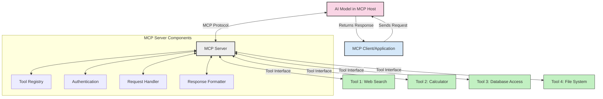
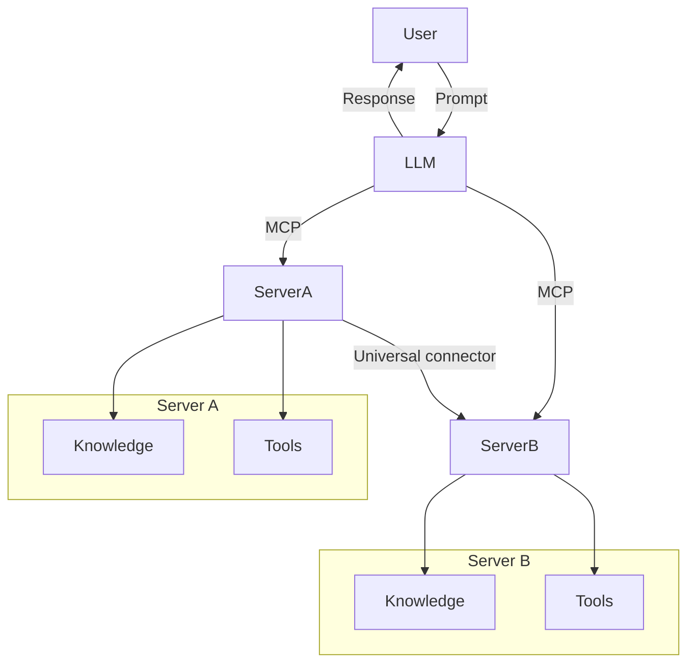

<!--
CO_OP_TRANSLATOR_METADATA:
{
  "original_hash": "cf84f987e1b771d2201408e110dfd2db",
  "translation_date": "2025-05-20T18:00:58+00:00",
  "source_file": "00-Introduction/README.md",
  "language_code": "cs"
}
-->
# Introduction to Model Context Protocol (MCP): Why It Matters for Scalable AI Applications

Generative AI applications represent a significant advancement by enabling users to interact with the app using natural language prompts. However, as more time and resources are devoted to these apps, it's important to ensure easy integration of functionalities and resources in a way that supports extensibility, allows multiple models to be used, and manages their complexities. In short, building Gen AI apps is simple at the start, but as they grow and become more complex, you need to define an architecture and likely rely on a standard to ensure consistent app development. This is where MCP comes in to organize and provide that standard.

---

## **🔍 What Is the Model Context Protocol (MCP)?**

The **Model Context Protocol (MCP)** is an **open, standardized interface** that enables Large Language Models (LLMs) to seamlessly interact with external tools, APIs, and data sources. It establishes a consistent architecture to extend AI model capabilities beyond their training data, resulting in smarter, scalable, and more responsive AI systems.

---

## **🎯 Why Standardization in AI Matters**

As generative AI applications grow more complex, adopting standards that guarantee **scalability, extensibility**, and **maintainability** becomes essential. MCP addresses these requirements by:

- Unifying model-tool integrations  
- Minimizing fragile, one-off custom solutions  
- Allowing multiple models to coexist within a single ecosystem  

---

## **📚 Learning Objectives**

By the end of this article, you will be able to:

- Define **Model Context Protocol (MCP)** and its applications  
- Understand how MCP standardizes communication between models and tools  
- Identify the core components of MCP architecture  
- Explore real-world MCP applications in enterprise and development settings  

---

## **💡 Why the Model Context Protocol (MCP) Is a Game-Changer**

### **🔗 MCP Solves Fragmentation in AI Interactions**

Before MCP, integrating models with tools involved:

- Writing custom code for each tool-model pair  
- Dealing with non-standard APIs from different vendors  
- Frequent breakages due to updates  
- Poor scalability as more tools were added  

### **✅ Benefits of MCP Standardization**

| **Benefit**              | **Description**                                                                |
|--------------------------|--------------------------------------------------------------------------------|
| Interoperability         | LLMs operate smoothly with tools from various vendors                         |
| Consistency              | Uniform behavior across platforms and tools                                   |
| Reusability              | Tools built once can be reused across multiple projects and systems           |
| Accelerated Development  | Shorten development time with standardized, plug-and-play interfaces          |

---

## **🧱 High-Level MCP Architecture Overview**

MCP follows a **client-server model**, where:

- **MCP Hosts** run the AI models  
- **MCP Clients** initiate requests  
- **MCP Servers** provide context, tools, and capabilities  

### **Key Components:**

- **Resources** – Static or dynamic data available to models  
- **Prompts** – Predefined workflows guiding generation  
- **Tools** – Executable functions such as search or calculations  
- **Sampling** – Agentic behavior enabled through recursive interactions  

---

## How MCP Servers Work

MCP servers function as follows:

- **Request Flow**:  
    1. The MCP Client sends a request to the AI Model running on an MCP Host.  
    2. The AI Model detects when external tools or data are needed.  
    3. The model communicates with the MCP Server using the standardized protocol.  

- **MCP Server Functionality**:  
    - Tool Registry: Maintains a catalog of available tools and their capabilities.  
    - Authentication: Verifies permissions for tool access.  
    - Request Handler: Processes incoming tool requests from the model.  
    - Response Formatter: Structures tool outputs in a format the model can understand.  

- **Tool Execution**:  
    - The server routes requests to the appropriate external tools.  
    - Tools perform their specialized functions (search, calculations, database queries, etc.).  
    - Results are returned to the model in a consistent format.  

- **Response Completion**:  
    - The AI model integrates tool outputs into its response.  
    - The final response is sent back to the client application.  

## 👨‍💻 How to Build an MCP Server (With Examples)

MCP servers let you extend LLM capabilities by providing additional data and functionality.

Ready to get started? Here are examples of creating a simple MCP server in various languages:

- **Python Example**: https://github.com/modelcontextprotocol/python-sdk  
- **TypeScript Example**: https://github.com/modelcontextprotocol/typescript-sdk  
- **Java Example**: https://github.com/modelcontextprotocol/java-sdk  
- **C#/.NET Example**: https://github.com/modelcontextprotocol/csharp-sdk  

## 🌍 Real-World Use Cases for MCP

MCP supports a wide variety of applications by expanding AI capabilities:

| **Application**              | **Description**                                                                |
|------------------------------|--------------------------------------------------------------------------------|
| Enterprise Data Integration  | Connect LLMs to databases, CRMs, or internal tools                             |
| Agentic AI Systems           | Enable autonomous agents with access to tools and decision-making workflows    |
| Multi-modal Applications     | Combine text, image, and audio tools in a single unified AI app                |
| Real-time Data Integration   | Incorporate live data into AI interactions for more accurate, up-to-date outputs|

### 🧠 MCP = Universal Standard for AI Interactions

The Model Context Protocol (MCP) acts as a universal standard for AI interactions, similar to how USB-C standardized physical connections for devices. In AI, MCP provides a consistent interface, allowing models (clients) to integrate smoothly with external tools and data providers (servers). This removes the need for diverse, custom protocols for each API or data source.

An MCP-compatible tool (referred to as an MCP server) follows this unified standard. These servers can list the tools or actions they offer and execute those actions when requested by an AI agent. AI platforms supporting MCP can discover available tools from servers and invoke them through this standard protocol.

### 💡 Facilitates access to knowledge

Beyond offering tools, MCP also facilitates access to knowledge. It enables applications to provide context to large language models (LLMs) by linking them to various data sources. For example, an MCP server might represent a company’s document repository, allowing agents to retrieve relevant information on demand. Another server could handle specific actions like sending emails or updating records. From the agent’s perspective, these are simply tools it can use—some return data (knowledge context), while others perform actions. MCP manages both efficiently.

When an agent connects to an MCP server, it automatically learns the server's available capabilities and accessible data through a standardized format. This standardization enables dynamic tool availability. For example, adding a new MCP server to an agent’s system makes its functions immediately usable without further agent customization.

This streamlined integration aligns with the flow shown in the mermaid diagram, where servers provide both tools and knowledge, ensuring smooth collaboration across systems.

### 👉 Example: Scalable Agent Solution

## 🔐 Practical Benefits of MCP

Here are the practical benefits of using MCP:

- **Freshness**: Models can access up-to-date information beyond their training data  
- **Capability Extension**: Models can leverage specialized tools for tasks they weren’t trained on  
- **Reduced hallucinations**: External data sources provide factual grounding  
- **Privacy**: Sensitive data remains in secure environments instead of being embedded in prompts  

## 📌 Key Takeaways

Key points to remember about MCP:

- **MCP** standardizes AI model interactions with tools and data  
- Promotes **extensibility, consistency, and interoperability**  
- Helps **reduce development time, improve reliability, and extend model capabilities**  
- The client-server architecture **enables flexible, extensible AI applications**  

## 🧠 Exercise

Consider an AI application you'd like to build.

- What **external tools or data** could enhance its capabilities?  
- How might MCP make integration **simpler and more reliable?**  

## Additional Resources

- [MCP GitHub Repository](https://github.com/modelcontextprotocol)  

## What's next

Next: [Chapter 1: Core Concepts](/01-CoreConcepts/README.md)

**Prohlášení o vyloučení odpovědnosti**:  
Tento dokument byl přeložen pomocí AI překladatelské služby [Co-op Translator](https://github.com/Azure/co-op-translator). I když usilujeme o přesnost, mějte prosím na paměti, že automatické překlady mohou obsahovat chyby nebo nepřesnosti. Původní dokument v jeho mateřském jazyce by měl být považován za autoritativní zdroj. Pro důležité informace se doporučuje profesionální lidský překlad. Nejsme odpovědní za jakékoli nedorozumění nebo nesprávné výklady vyplývající z použití tohoto překladu.