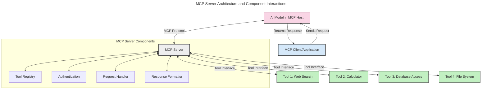
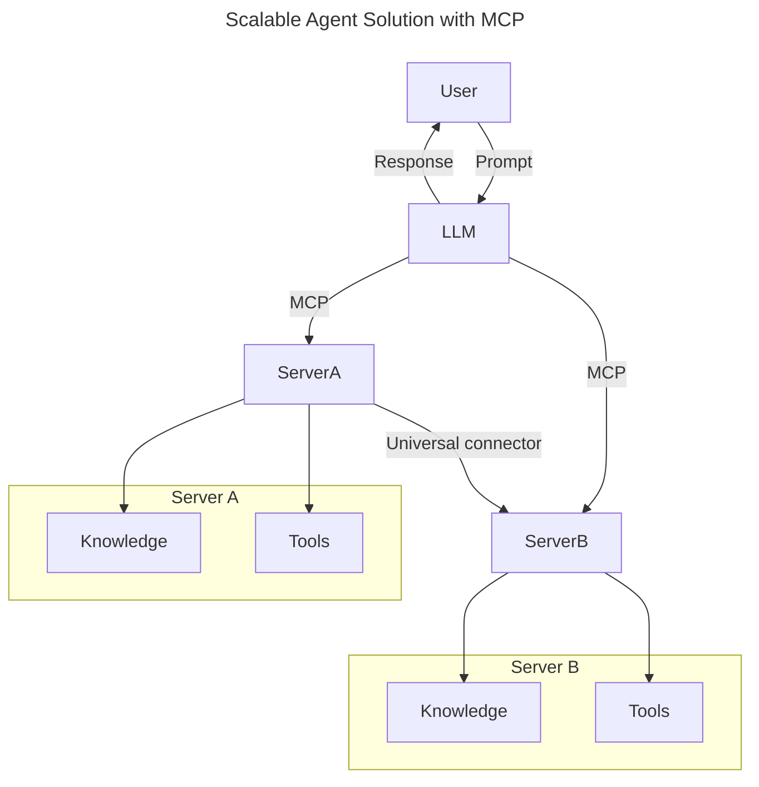
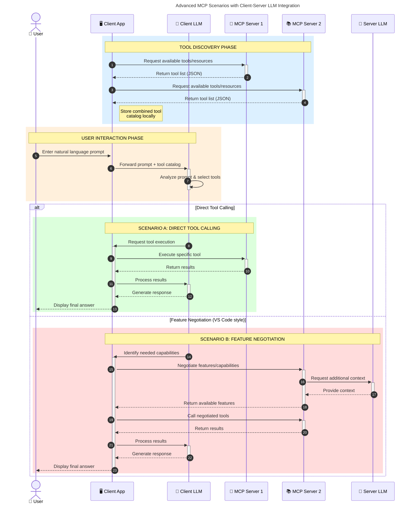

<!--
CO_OP_TRANSLATOR_METADATA:
{
  "original_hash": "105c2ddbb77bc38f7e9df009e1b06e45",
  "translation_date": "2025-07-04T18:35:10+00:00",
  "source_file": "00-Introduction/README.md",
  "language_code": "cs"
}
-->
# Úvod do Model Context Protocol (MCP): Proč je důležitý pro škálovatelné AI aplikace

Generativní AI aplikace představují velký krok vpřed, protože často umožňují uživatelům komunikovat s aplikací pomocí přirozených jazykových příkazů. Jakmile však do těchto aplikací investujete více času a zdrojů, chcete mít jistotu, že můžete snadno integrovat funkce a zdroje tak, aby bylo jednoduché je rozšiřovat, aby vaše aplikace zvládla používat více modelů najednou a dokázala pracovat s různými specifiky modelů. Stručně řečeno, tvorba Gen AI aplikací je na začátku snadná, ale jak rostou a stávají se složitějšími, je potřeba začít definovat architekturu a pravděpodobně se spolehnout na standard, který zajistí, že vaše aplikace budou postaveny konzistentním způsobem. Právě zde přichází na scénu MCP, který vše organizuje a poskytuje standard.

---

## **🔍 Co je Model Context Protocol (MCP)?**

**Model Context Protocol (MCP)** je **otevřené, standardizované rozhraní**, které umožňuje velkým jazykovým modelům (LLM) bezproblémově komunikovat s externími nástroji, API a zdroji dat. Poskytuje jednotnou architekturu, která rozšiřuje funkčnost AI modelů nad rámec jejich tréninkových dat, čímž umožňuje chytřejší, škálovatelnější a citlivější AI systémy.

---

## **🎯 Proč je standardizace v AI důležitá**

S rostoucí složitostí generativních AI aplikací je nezbytné přijmout standardy, které zajistí **škálovatelnost, rozšiřitelnost** a **udržovatelnost**. MCP tyto potřeby řeší tím, že:

- sjednocuje integrace modelů s nástroji
- snižuje křehká, jednorázová řešení na míru
- umožňuje souběžné používání více modelů v jednom ekosystému

---

## **📚 Cíle učení**

Na konci tohoto článku budete schopni:

- definovat **Model Context Protocol (MCP)** a jeho použití
- pochopit, jak MCP standardizuje komunikaci mezi modelem a nástroji
- identifikovat klíčové komponenty architektury MCP
- prozkoumat reálné aplikace MCP v podnikových a vývojových kontextech

---

## **💡 Proč je Model Context Protocol (MCP) průlomový**

### **🔗 MCP řeší fragmentaci v AI interakcích**

Před MCP vyžadovala integrace modelů s nástroji:

- vlastní kód pro každou kombinaci nástroj-model
- nestandardní API pro každého dodavatele
- časté přerušení kvůli aktualizacím
- špatnou škálovatelnost s rostoucím počtem nástrojů

### **✅ Výhody standardizace MCP**

| **Výhoda**               | **Popis**                                                                     |
|--------------------------|-------------------------------------------------------------------------------|
| Interoperabilita         | LLM bez problémů spolupracují s nástroji od různých dodavatelů               |
| Konzistence              | Jednotné chování napříč platformami a nástroji                                |
| Znovupoužitelnost        | Nástroje vytvořené jednou lze používat v různých projektech a systémech      |
| Rychlejší vývoj          | Zkrácení vývojového času díky standardizovaným, plug-and-play rozhraním      |

---

## **🧱 Přehled architektury MCP na vysoké úrovni**

MCP vychází z **modelu klient-server**, kde:

- **MCP Hosts** provozují AI modely
- **MCP Clients** iniciují požadavky
- **MCP Servers** poskytují kontext, nástroje a schopnosti

### **Klíčové komponenty:**

- **Resources** – statická nebo dynamická data pro modely  
- **Prompts** – předdefinované pracovní postupy pro řízenou generaci  
- **Tools** – spustitelné funkce jako vyhledávání, výpočty  
- **Sampling** – agentní chování prostřednictvím rekurzivních interakcí

---

## Jak fungují MCP servery

MCP servery fungují následovně:

- **Průběh požadavku**:  
    1. MCP Client odešle požadavek AI modelu běžícímu v MCP Hostu.  
    2. AI model rozpozná, kdy potřebuje externí nástroje nebo data.  
    3. Model komunikuje s MCP Serverem pomocí standardizovaného protokolu.

- **Funkce MCP Serveru**:  
    - Registr nástrojů: Udržuje katalog dostupných nástrojů a jejich schopností.  
    - Autentizace: Ověřuje oprávnění pro přístup k nástrojům.  
    - Zpracování požadavků: Vyřizuje příchozí požadavky na nástroje od modelu.  
    - Formátování odpovědí: Strukturuje výstupy nástrojů do formátu, kterému model rozumí.

- **Spouštění nástrojů**:  
    - Server směruje požadavky na příslušné externí nástroje  
    - Nástroje vykonávají své specializované funkce (vyhledávání, výpočty, dotazy do databáze atd.)  
    - Výsledky jsou vráceny modelu v jednotném formátu.

- **Dokončení odpovědi**:  
    - AI model začleňuje výstupy nástrojů do své odpovědi.  
    - Konečná odpověď je odeslána zpět klientské aplikaci.

## 👨‍💻 Jak postavit MCP server (s příklady)

MCP servery vám umožňují rozšířit schopnosti LLM tím, že poskytují data a funkce.

Chcete to vyzkoušet? Zde jsou příklady vytvoření jednoduchého MCP serveru v různých jazycích:

- **Python příklad**: https://github.com/modelcontextprotocol/python-sdk

- **TypeScript příklad**: https://github.com/modelcontextprotocol/typescript-sdk

- **Java příklad**: https://github.com/modelcontextprotocol/java-sdk

- **C#/.NET příklad**: https://github.com/modelcontextprotocol/csharp-sdk

## 🌍 Reálné případy použití MCP

MCP umožňuje širokou škálu aplikací rozšiřujících schopnosti AI:

| **Aplikace**               | **Popis**                                                                     |
|----------------------------|-------------------------------------------------------------------------------|
| Integrace podnikových dat  | Připojení LLM k databázím, CRM nebo interním nástrojům                        |
| Agentní AI systémy         | Umožnění autonomních agentů s přístupem k nástrojům a rozhodovacími procesy   |
| Multimodální aplikace      | Kombinace textových, obrazových a zvukových nástrojů v jedné sjednocené AI aplikaci |
| Integrace dat v reálném čase | Přinášení živých dat do AI interakcí pro přesnější a aktuálnější výstupy     |

### 🧠 MCP = Univerzální standard pro AI interakce

Model Context Protocol (MCP) funguje jako univerzální standard pro AI interakce, podobně jako USB-C standardizoval fyzická připojení zařízení. Ve světě AI MCP poskytuje jednotné rozhraní, které umožňuje modelům (klientům) bezproblémově se integrovat s externími nástroji a poskytovateli dat (servery). Tím odpadá potřeba různých, vlastních protokolů pro každé API nebo zdroj dat.

Podle MCP je nástroj kompatibilní s MCP (označovaný jako MCP server) postaven podle jednotného standardu. Tyto servery mohou uvádět nástroje nebo akce, které nabízejí, a vykonávat je na požádání AI agentem. Platformy AI agentů podporující MCP jsou schopné objevit dostupné nástroje na serverech a vyvolat je prostřednictvím tohoto standardního protokolu.

### 💡 Usnadňuje přístup k znalostem

Kromě poskytování nástrojů MCP také usnadňuje přístup ke znalostem. Umožňuje aplikacím poskytovat kontext velkým jazykovým modelům (LLM) tím, že je propojuje s různými zdroji dat. Například MCP server může představovat firemní úložiště dokumentů, které agentům umožňuje na vyžádání získávat relevantní informace. Jiný server může zpracovávat specifické akce, jako je odesílání e-mailů nebo aktualizace záznamů. Z pohledu agenta jsou to jednoduše nástroje, které může používat – některé vracejí data (kontext znalostí), jiné vykonávají akce. MCP efektivně spravuje obojí.

Agent, který se připojuje k MCP serveru, se automaticky naučí dostupné schopnosti serveru a přístupná data prostřednictvím standardizovaného formátu. Tato standardizace umožňuje dynamickou dostupnost nástrojů. Například přidání nového MCP serveru do systému agenta okamžitě zpřístupní jeho funkce bez nutnosti dalšího přizpůsobování instrukcí agenta.

Tato zjednodušená integrace odpovídá toku znázorněnému v mermaid diagramu, kde servery poskytují jak nástroje, tak znalosti, což zajišťuje bezproblémovou spolupráci mezi systémy.

### 👉 Příklad: Škálovatelné agentní řešení

### 🔄 Pokročilé scénáře MCP s integrací LLM na straně klienta

Kromě základní architektury MCP existují pokročilé scénáře, kde jak klient, tak server obsahují LLM, což umožňuje sofistikovanější interakce:

## 🔐 Praktické výhody MCP

Zde jsou praktické výhody používání MCP:

- **Aktuálnost**: Modely mají přístup k nejnovějším informacím mimo svá tréninková data  
- **Rozšíření schopností**: Modely mohou využívat specializované nástroje pro úkoly, na které nebyly trénovány  
- **Snížení halucinací**: Externí zdroje dat poskytují faktickou oporu  
- **Soukromí**: Citlivá data mohou zůstat v zabezpečeném prostředí místo toho, aby byla vložena do promptů

## 📌 Klíčové poznatky

Následující jsou klíčové poznatky pro používání MCP:

- **MCP** standardizuje způsob, jakým AI modely komunikují s nástroji a daty  
- Podporuje **rozšiřitelnost, konzistenci a interoperabilitu**  
- MCP pomáhá **zkrátit vývojový čas, zlepšit spolehlivost a rozšířit schopnosti modelů**  
- Architektura klient-server **umožňuje flexibilní a rozšiřitelné AI aplikace**

## 🧠 Cvičení

Zamyslete se nad AI aplikací, kterou byste chtěli vytvořit.

- Které **externí nástroje nebo data** by mohly rozšířit její schopnosti?  
- Jak by MCP mohl integraci **zjednodušit a zpřesnit**?

## Další zdroje

- [MCP GitHub Repository](https://github.com/modelcontextprotocol)

## Co dál

Další: [Kapitola 1: Základní koncepty](../01-CoreConcepts/README.md)

**Prohlášení o vyloučení odpovědnosti**:  
Tento dokument byl přeložen pomocí AI překladatelské služby [Co-op Translator](https://github.com/Azure/co-op-translator). I když usilujeme o přesnost, mějte prosím na paměti, že automatické překlady mohou obsahovat chyby nebo nepřesnosti. Původní dokument v jeho mateřském jazyce by měl být považován za autoritativní zdroj. Pro důležité informace se doporučuje profesionální lidský překlad. Nejsme odpovědní za jakékoliv nedorozumění nebo nesprávné výklady vyplývající z použití tohoto překladu.