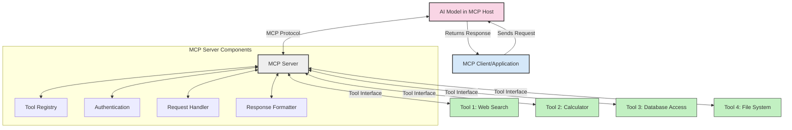
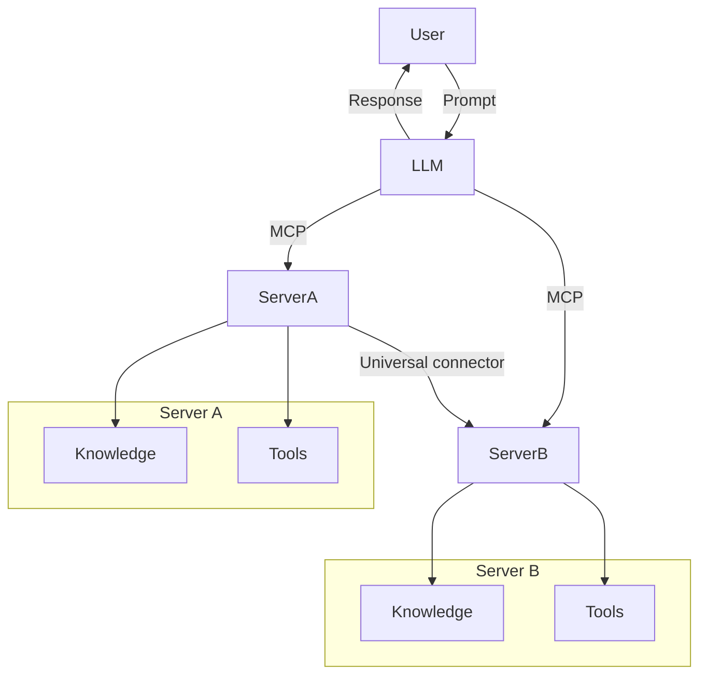

<!--
CO_OP_TRANSLATOR_METADATA:
{
  "original_hash": "1d88dee994dcbb3fa52c271d0c0817b5",
  "translation_date": "2025-05-20T22:21:48+00:00",
  "source_file": "00-Introduction/README.md",
  "language_code": "cs"
}
-->
# Introduction to Model Context Protocol (MCP): Why It Matters for Scalable AI Applications

Generative AI applications represent a significant advancement, often allowing users to interact with the app through natural language prompts. However, as you invest more time and resources into these apps, it's important to ensure that functionalities and resources can be integrated easily, allowing for extensibility, support for multiple models, and handling of various model-specific details. In short, building Gen AI apps is straightforward at first, but as they scale and become more complex, you need to define an architecture and likely rely on a standard to ensure consistency. This is where MCP comes in, organizing and providing that standard.

---

## **🔍 What Is the Model Context Protocol (MCP)?**

The **Model Context Protocol (MCP)** is an **open, standardized interface** that enables Large Language Models (LLMs) to interact smoothly with external tools, APIs, and data sources. It offers a consistent architecture to enhance AI model capabilities beyond their training data, enabling smarter, scalable, and more responsive AI systems.

---

## **🎯 Why Standardization in AI Matters**

As generative AI applications grow more complex, adopting standards that guarantee **scalability, extensibility**, and **maintainability** becomes essential. MCP meets these needs by:

- Unifying model-tool integrations
- Reducing fragile, one-off custom solutions
- Allowing multiple models to coexist within a single ecosystem

---

## **📚 Learning Objectives**

By the end of this article, you'll be able to:

- Define **Model Context Protocol (MCP)** and its use cases
- Understand how MCP standardizes communication between models and tools
- Identify the core components of MCP architecture
- Explore real-world applications of MCP in enterprise and development settings

---

## **💡 Why the Model Context Protocol (MCP) Is a Game-Changer**

### **🔗 MCP Solves Fragmentation in AI Interactions**

Before MCP, integrating models with tools involved:

- Custom code for each tool-model pair
- Non-standard APIs from each vendor
- Frequent breaks due to updates
- Poor scalability as tools increased

### **✅ Benefits of MCP Standardization**

| **Benefit**              | **Description**                                                                |
|--------------------------|--------------------------------------------------------------------------------|
| Interoperability         | LLMs work seamlessly with tools from different vendors                        |
| Consistency              | Uniform behavior across platforms and tools                                   |
| Reusability              | Tools built once can be reused across projects and systems                    |
| Accelerated Development  | Shorten development time using standardized, plug-and-play interfaces         |

---

## **🧱 High-Level MCP Architecture Overview**

MCP follows a **client-server model**, where:

- **MCP Hosts** run the AI models
- **MCP Clients** initiate requests
- **MCP Servers** provide context, tools, and capabilities

### **Key Components:**

- **Resources** – Static or dynamic data for models  
- **Prompts** – Predefined workflows guiding generation  
- **Tools** – Executable functions such as search or calculations  
- **Sampling** – Agentic behavior through recursive interactions

---

## How MCP Servers Work

MCP servers operate as follows:

- **Request Flow**: 
    1. The MCP Client sends a request to the AI Model hosted in an MCP Host.
    2. The AI Model determines when external tools or data are needed.
    3. The model communicates with the MCP Server using the standardized protocol.

- **MCP Server Functionality**:
    - Tool Registry: Maintains a catalog of available tools and their capabilities.
    - Authentication: Verifies permissions for accessing tools.
    - Request Handler: Processes incoming tool requests from the model.
    - Response Formatter: Structures tool outputs in a model-understandable format.

- **Tool Execution**: 
    - The server routes requests to the appropriate external tools.
    - Tools perform their specialized functions (search, calculation, database queries, etc.).
    - Results are returned to the model in a consistent format.

- **Response Completion**: 
    - The AI model integrates tool outputs into its response.
    - The final response is sent back to the client application.

## 👨‍💻 How to Build an MCP Server (With Examples)

MCP servers let you extend LLM capabilities by providing additional data and functionality.

Ready to get started? Here are examples of building a simple MCP server in different languages:

- **Python Example**: https://github.com/modelcontextprotocol/python-sdk

- **TypeScript Example**: https://github.com/modelcontextprotocol/typescript-sdk

- **Java Example**: https://github.com/modelcontextprotocol/java-sdk

- **C#/.NET Example**: https://github.com/modelcontextprotocol/csharp-sdk

## 🌍 Real-World Use Cases for MCP

MCP enables a variety of applications by extending AI capabilities:

| **Application**              | **Description**                                                                |
|------------------------------|--------------------------------------------------------------------------------|
| Enterprise Data Integration  | Connect LLMs to databases, CRMs, or internal tools                             |
| Agentic AI Systems           | Enable autonomous agents with tool access and decision-making workflows        |
| Multi-modal Applications     | Combine text, image, and audio tools within a single unified AI app            |
| Real-time Data Integration   | Incorporate live data into AI interactions for more accurate, up-to-date outputs|

### 🧠 MCP = Universal Standard for AI Interactions

The Model Context Protocol (MCP) serves as a universal standard for AI interactions, similar to how USB-C standardized physical device connections. In AI, MCP provides a consistent interface allowing models (clients) to integrate seamlessly with external tools and data providers (servers). This removes the need for multiple custom protocols for each API or data source.

An MCP-compatible tool (an MCP server) follows a unified standard. These servers list the tools or actions they offer and execute those actions when requested by an AI agent. AI agent platforms supporting MCP can discover available tools from servers and invoke them through this standard protocol.

### 💡 Facilitates access to knowledge

Besides offering tools, MCP facilitates access to knowledge by linking large language models (LLMs) to various data sources. For example, an MCP server might represent a company's document repository, allowing agents to fetch relevant information on demand. Another server could handle specific actions like sending emails or updating records. From the agent’s point of view, these are simply tools—some return data (knowledge context), others perform actions. MCP efficiently manages both.

When an agent connects to an MCP server, it automatically learns the server's available capabilities and accessible data through a standard format. This standardization enables dynamic tool availability. For instance, adding a new MCP server to an agent’s system makes its functions immediately available without needing further customization of the agent's instructions.

This streamlined integration aligns with the flow shown in the mermaid diagram, where servers provide both tools and knowledge, enabling smooth collaboration across systems.

### 👉 Example: Scalable Agent Solution

## 🔐 Practical Benefits of MCP

Here are the practical advantages of using MCP:

- **Freshness**: Models can access current information beyond their training data
- **Capability Extension**: Models can use specialized tools for tasks outside their training
- **Reduced Hallucinations**: External data sources provide factual grounding
- **Privacy**: Sensitive data remains in secure environments rather than embedded in prompts

## 📌 Key Takeaways

The main points to remember about MCP:

- **MCP** standardizes how AI models interact with tools and data
- Encourages **extensibility, consistency, and interoperability**
- MCP helps **cut development time, improve reliability, and expand model capabilities**
- The client-server architecture **enables flexible, extensible AI applications**

## 🧠 Exercise

Consider an AI application you'd like to build.

- What **external tools or data** could enhance its capabilities?
- How could MCP make integration **simpler and more reliable?**

## Additional Resources

- [MCP GitHub Repository](https://github.com/modelcontextprotocol)

## What's next

Next: [Chapter 1: Core Concepts](/01-CoreConcepts/README.md)

**Prohlášení o vyloučení odpovědnosti**:  
Tento dokument byl přeložen pomocí AI překladatelské služby [Co-op Translator](https://github.com/Azure/co-op-translator). Přestože usilujeme o přesnost, mějte prosím na paměti, že automatické překlady mohou obsahovat chyby nebo nepřesnosti. Původní dokument v jeho mateřském jazyce by měl být považován za autoritativní zdroj. Pro důležité informace se doporučuje profesionální lidský překlad. Nejsme odpovědní za jakékoli nedorozumění nebo mylné výklady vzniklé použitím tohoto překladu.