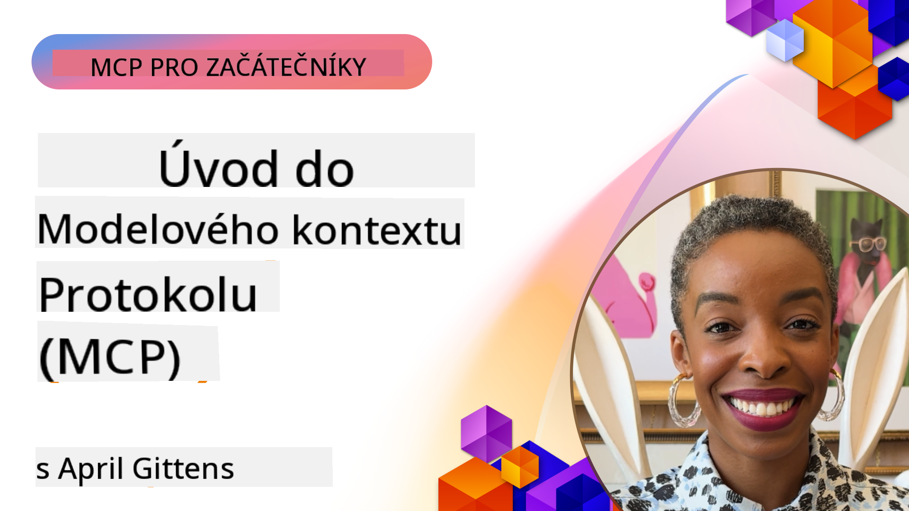
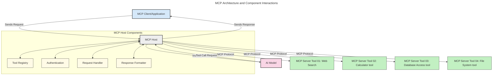
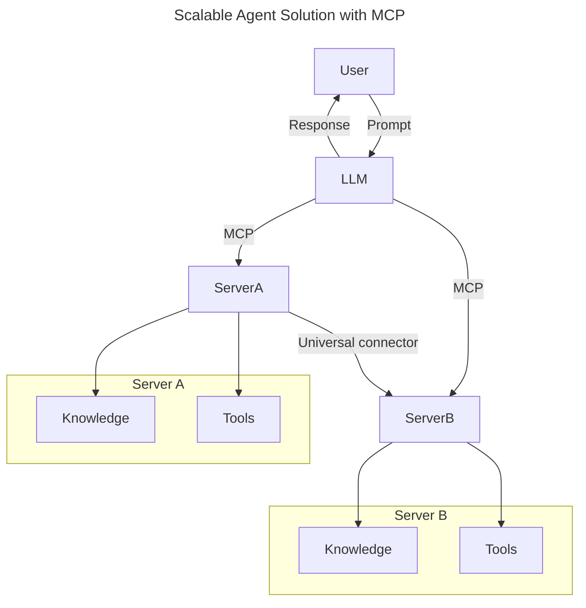
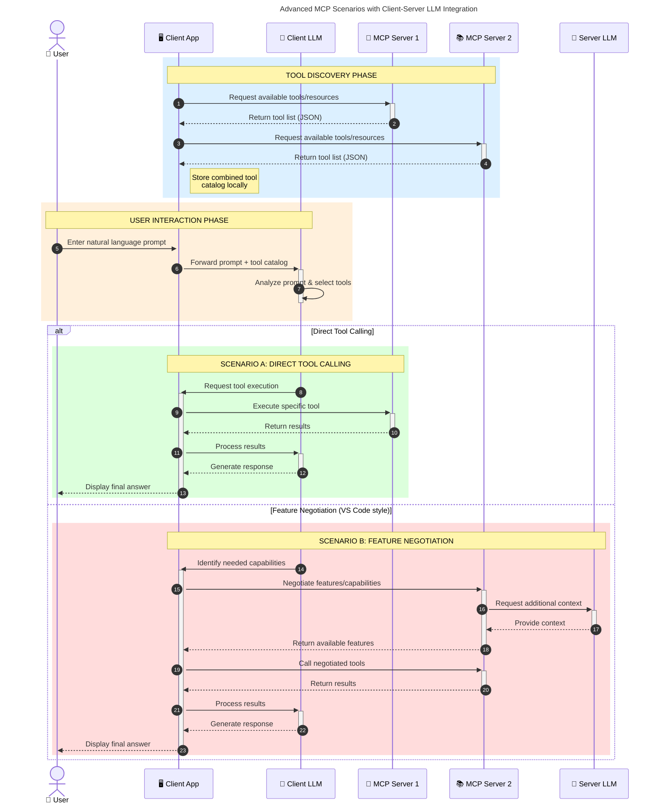

<!--
CO_OP_TRANSLATOR_METADATA:
{
  "original_hash": "0df1ee78a6dd8300f3a040ca5b411c2e",
  "translation_date": "2025-08-19T15:48:03+00:00",
  "source_file": "00-Introduction/README.md",
  "language_code": "cs"
}
-->
# Úvod do Model Context Protocol (MCP): Proč je důležitý pro škálovatelné AI aplikace

_(Klikněte na obrázek výše pro zhlédnutí videa této lekce)_

Generativní AI aplikace představují velký krok vpřed, protože často umožňují uživatelům interakci s aplikací pomocí přirozených jazykových příkazů. Nicméně, jak se do těchto aplikací investuje více času a zdrojů, je důležité zajistit, že můžete snadno integrovat funkce a zdroje tak, aby bylo jednoduché je rozšiřovat, aby vaše aplikace mohla pracovat s více modely a zvládala různé specifika modelů. Stručně řečeno, vytvořit generativní AI aplikaci je na začátku snadné, ale jak roste a stává se složitější, je nutné začít definovat architekturu a pravděpodobně se spoléhat na standard, který zajistí konzistentní vývoj aplikací. Zde přichází MCP, který věci organizuje a poskytuje standard.

---

## **🔍 Co je Model Context Protocol (MCP)?**

**Model Context Protocol (MCP)** je **otevřené, standardizované rozhraní**, které umožňuje velkým jazykovým modelům (LLMs) bezproblémově komunikovat s externími nástroji, API a datovými zdroji. Poskytuje konzistentní architekturu pro rozšíření funkcionality AI modelů nad rámec jejich tréninkových dat, čímž umožňuje chytřejší, škálovatelné a citlivější AI systémy.

---

## **🎯 Proč je standardizace v AI důležitá**

Jak se generativní AI aplikace stávají složitějšími, je nezbytné přijmout standardy, které zajistí **škálovatelnost, rozšiřitelnost, udržovatelnost** a **vyhnutí se závislosti na jednom dodavateli**. MCP tyto potřeby řeší tím, že:

- Sjednocuje integrace modelů a nástrojů
- Snižuje křehké, jednorázové vlastní řešení
- Umožňuje koexistenci více modelů od různých dodavatelů v jednom ekosystému

**Poznámka:** Ačkoliv MCP se prezentuje jako otevřený standard, neexistují žádné plány na jeho standardizaci prostřednictvím existujících standardizačních orgánů, jako jsou IEEE, IETF, W3C, ISO nebo jiné.

---

## **📚 Cíle učení**

Na konci tohoto článku budete schopni:

- Definovat **Model Context Protocol (MCP)** a jeho případy použití
- Porozumět tomu, jak MCP standardizuje komunikaci mezi modely a nástroji
- Identifikovat klíčové komponenty architektury MCP
- Prozkoumat reálné aplikace MCP v podnikových a vývojových kontextech

---

## **💡 Proč je Model Context Protocol (MCP) revoluční**

### **🔗 MCP řeší fragmentaci v AI interakcích**

Před MCP bylo integrování modelů s nástroji spojeno s:

- Vlastním kódem pro každý pár nástroj-model
- Nestandardními API od každého dodavatele
- Častými problémy kvůli aktualizacím
- Špatnou škálovatelností při přidávání dalších nástrojů

### **✅ Výhody standardizace MCP**

| **Výhoda**              | **Popis**                                                                        |
|--------------------------|----------------------------------------------------------------------------------|
| Interoperabilita         | LLMs bezproblémově spolupracují s nástroji od různých dodavatelů                 |
| Konzistence              | Jednotné chování napříč platformami a nástroji                                  |
| Znovupoužitelnost        | Nástroje vytvořené jednou lze použít v různých projektech a systémech           |
| Zrychlený vývoj          | Snížení času vývoje díky standardizovaným, plug-and-play rozhraním              |

---

## **🧱 Přehled architektury MCP na vysoké úrovni**

MCP využívá **model klient-server**, kde:

- **MCP Hosté** provozují AI modely
- **MCP Klienti** iniciují požadavky
- **MCP Servery** poskytují kontext, nástroje a schopnosti

### **Klíčové komponenty:**

- **Zdroje** – Statická nebo dynamická data pro modely  
- **Příkazy** – Předdefinované pracovní postupy pro řízenou generaci  
- **Nástroje** – Spustitelné funkce jako vyhledávání, výpočty  
- **Sampling** – Agentní chování prostřednictvím rekurzivních interakcí  

---

## Jak fungují MCP servery

MCP servery fungují následujícím způsobem:

- **Tok požadavků**:
    1. Požadavek je iniciován koncovým uživatelem nebo softwarem jednajícím jeho jménem.
    2. **MCP Klient** odešle požadavek na **MCP Host**, který spravuje runtime AI modelu.
    3. **AI Model** obdrží uživatelský příkaz a může požádat o přístup k externím nástrojům nebo datům prostřednictvím jednoho nebo více volání nástrojů.
    4. **MCP Host**, nikoliv model přímo, komunikuje s příslušným **MCP Serverem** pomocí standardizovaného protokolu.
- **Funkce MCP Hostu**:
    - **Registr nástrojů**: Udržuje katalog dostupných nástrojů a jejich schopností.
    - **Autentizace**: Ověřuje oprávnění pro přístup k nástrojům.
    - **Zpracovatel požadavků**: Zpracovává příchozí požadavky na nástroje od modelu.
    - **Formátovač odpovědí**: Strukturuje výstupy nástrojů do formátu, kterému model rozumí.
- **Provedení MCP Serveru**:
    - **MCP Host** směruje volání nástrojů na jeden nebo více **MCP Serverů**, z nichž každý poskytuje specializované funkce (např. vyhledávání, výpočty, dotazy na databáze).
    - **MCP Servery** provádějí své příslušné operace a vracejí výsledky **MCP Hostu** v konzistentním formátu.
    - **MCP Host** formátuje a předává tyto výsledky **AI Modelu**.
- **Dokončení odpovědi**:
    - **AI Model** začlení výstupy nástrojů do finální odpovědi.
    - **MCP Host** odešle tuto odpověď zpět **MCP Klientovi**, který ji doručí koncovému uživateli nebo volajícímu softwaru.

## 👨‍💻 Jak vytvořit MCP server (s příklady)

MCP servery umožňují rozšířit schopnosti LLM poskytováním dat a funkcionality.

Připraveni to vyzkoušet? Zde jsou jazykově nebo stackově specifické SDK s příklady vytvoření jednoduchých MCP serverů v různých jazycích/stacích:

- **Python SDK**: https://github.com/modelcontextprotocol/python-sdk

- **TypeScript SDK**: https://github.com/modelcontextprotocol/typescript-sdk

- **Java SDK**: https://github.com/modelcontextprotocol/java-sdk

- **C#/.NET SDK**: https://github.com/modelcontextprotocol/csharp-sdk

---

## 🌍 Reálné případy použití MCP

MCP umožňuje širokou škálu aplikací rozšířením schopností AI:

| **Aplikace**               | **Popis**                                                                        |
|----------------------------|----------------------------------------------------------------------------------|
| Integrace podnikových dat  | Připojení LLMs k databázím, CRM nebo interním nástrojům                          |
| Agentní AI systémy         | Umožnění autonomních agentů s přístupem k nástrojům a pracovními postupy rozhodování |
| Multimodální aplikace      | Kombinace textových, obrazových a zvukových nástrojů v jedné sjednocené AI aplikaci |
| Integrace dat v reálném čase | Přinášení živých dat do AI interakcí pro přesnější a aktuální výstupy            |

---

### 🧠 MCP = Univerzální standard pro AI interakce

Model Context Protocol (MCP) funguje jako univerzální standard pro AI interakce, podobně jako USB-C standardizoval fyzické připojení zařízení. Ve světě AI poskytuje MCP konzistentní rozhraní, které umožňuje modelům (klientům) bezproblémovou integraci s externími nástroji a poskytovateli dat (servery). Tím eliminuje potřebu různorodých, vlastních protokolů pro každé API nebo datový zdroj.

Pod MCP, MCP-kompatibilní nástroj (označovaný jako MCP server) dodržuje jednotný standard. Tyto servery mohou uvádět nástroje nebo akce, které nabízejí, a provádět tyto akce, když je o to požádá AI agent. Platformy AI agentů podporující MCP jsou schopny objevovat dostupné nástroje ze serverů a vyvolávat je prostřednictvím tohoto standardního protokolu.

---

### 💡 Usnadňuje přístup k znalostem

Kromě poskytování nástrojů MCP také usnadňuje přístup k znalostem. Umožňuje aplikacím poskytovat kontext velkým jazykovým modelům (LLMs) propojením s různými datovými zdroji. Například MCP server může reprezentovat firemní úložiště dokumentů, což agentům umožňuje na vyžádání získávat relevantní informace. Jiný server může zpracovávat specifické akce, jako je odesílání e-mailů nebo aktualizace záznamů. Z pohledu agenta jsou to jednoduše nástroje, které může použít—některé nástroje vracejí data (kontext znalostí), zatímco jiné provádějí akce. MCP efektivně spravuje obojí.

Agent připojující se k MCP serveru automaticky zjistí dostupné schopnosti serveru a přístupná data prostřednictvím standardního formátu. Tato standardizace umožňuje dynamickou dostupnost nástrojů. Například přidání nového MCP serveru do systému agenta okamžitě zpřístupní jeho funkce bez nutnosti dalšího přizpůsobení instrukcí agenta.

Tato zjednodušená integrace odpovídá toku zobrazenému v následujícím diagramu, kde servery poskytují jak nástroje, tak znalosti, což zajišťuje bezproblémovou spolupráci napříč systémy.

---

### 👉 Příklad: Škálovatelné řešení pro agenty

---

### 🔄 Pokročilé scénáře MCP s integrací LLM na straně klienta

Kromě základní architektury MCP existují pokročilé scénáře, kde klient i server obsahují LLM, což umožňuje sofistikovanější interakce. Na následujícím diagramu může být **Client App** IDE s řadou MCP nástrojů dostupných pro uživatele prostřednictvím LLM:

---

## 🔐 Praktické výhody MCP

Zde jsou praktické výhody používání MCP:

- **Aktualizovanost**: Modely mohou přistupovat k aktuálním informacím nad rámec jejich tréninkových dat
- **Rozšíření schopností**: Modely mohou využívat specializované nástroje pro úkoly, na které nebyly trénovány
- **Snížení halucinací**: Externí datové zdroje poskytují faktické základy
- **Ochrana soukromí**: Citlivá data mohou zůstat v bezpečném prostředí místo jejich začlenění do příkazů

---

## 📌 Klíčové poznatky

Následující jsou klíčové poznatky pro používání MCP:

- **MCP** standardizuje, jak AI modely interagují s nástroji a daty
- Podporuje **rozšiřitelnost, konzistenci a interoperabilitu**
- MCP pomáhá **snížit čas vývoje, zlepšit spolehlivost a rozšířit schopnosti modelů**
- Architektura klient-server **umožňuje flexibilní, rozšiřitelné AI aplikace**

---

## 🧠 Cvičení

Přemýšlejte o AI aplikaci, kterou byste chtěli vytvořit.

- Které **externí nástroje nebo data** by mohly zlepšit její schopnosti?
- Jak by MCP mohl integraci **zjednodušit a učinit spolehlivější?**

---

## Další zdroje

- [MCP GitHub Repository](https://github.com/modelcontextprotocol)

---

## Co dál

Další: [Kapitola 1: Základní koncepty](../01-CoreConcepts/README.md)

**Prohlášení**:  
Tento dokument byl přeložen pomocí služby pro automatický překlad [Co-op Translator](https://github.com/Azure/co-op-translator). I když se snažíme o přesnost, mějte prosím na paměti, že automatické překlady mohou obsahovat chyby nebo nepřesnosti. Původní dokument v jeho původním jazyce by měl být považován za závazný zdroj. Pro důležité informace doporučujeme profesionální lidský překlad. Neodpovídáme za žádná nedorozumění nebo nesprávné interpretace vyplývající z použití tohoto překladu.