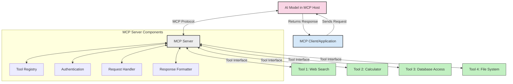
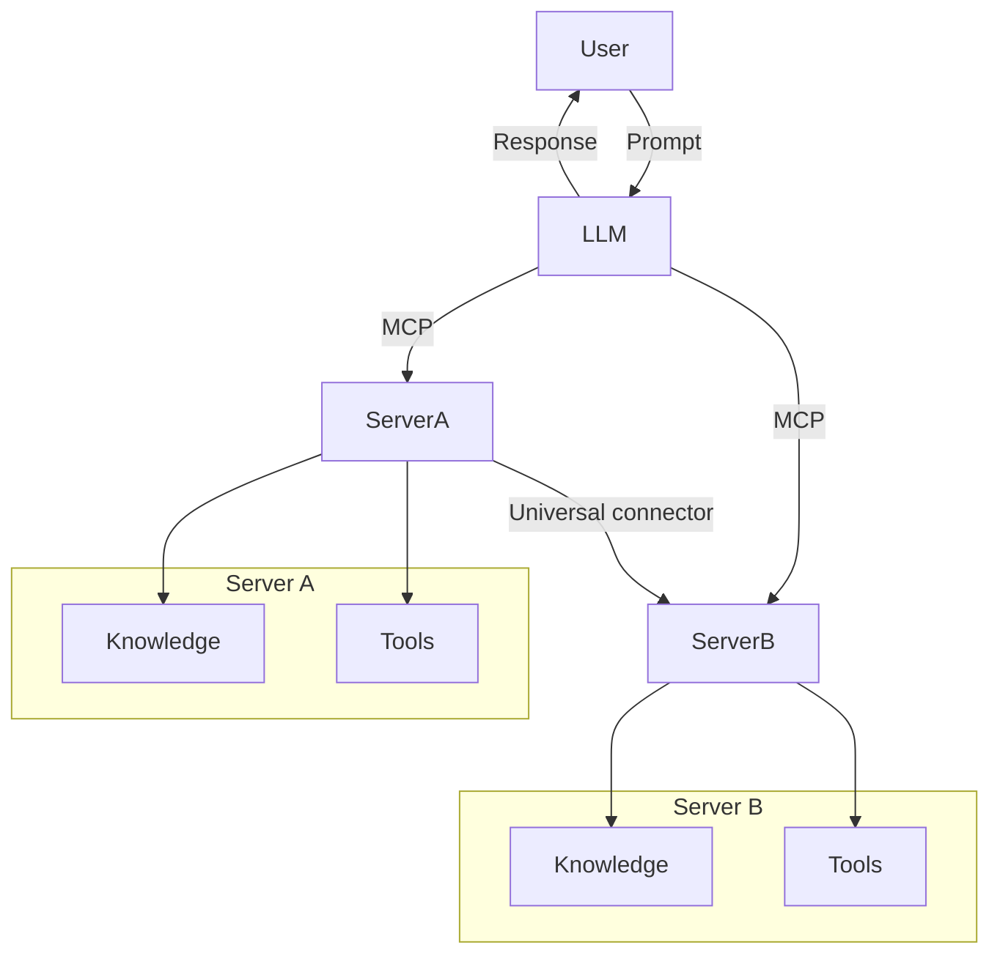
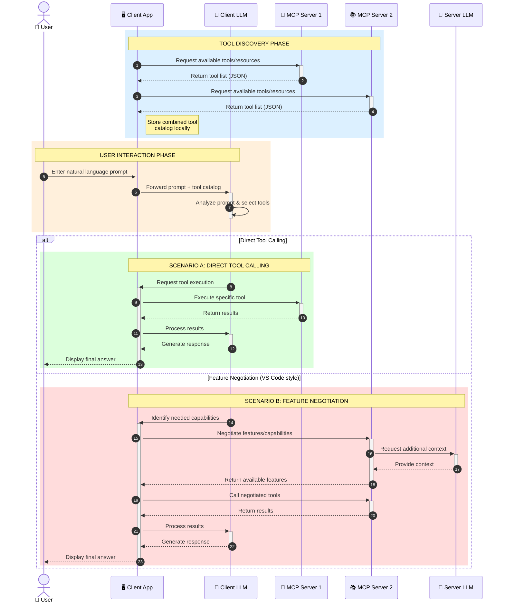

<!--
CO_OP_TRANSLATOR_METADATA:
{
  "original_hash": "25a94c681cf43612ff394d8cf78a74de",
  "translation_date": "2025-05-27T16:16:56+00:00",
  "source_file": "00-Introduction/README.md",
  "language_code": "cs"
}
-->
# Introduction to Model Context Protocol (MCP): Why It Matters for Scalable AI Applications

Generative AI applications represent a significant advancement by allowing users to interact with apps through natural language prompts. However, as you invest more time and resources into these apps, it's important to ensure you can easily integrate functionalities and resources so that the app remains extensible, supports multiple models simultaneously, and manages various model complexities. In short, building Gen AI apps is straightforward at first, but as they scale and become more complex, defining an architecture and adopting a standard becomes necessary to maintain consistency. This is where MCP steps in to organize and standardize the process.

---

## **🔍 What Is the Model Context Protocol (MCP)?**

The **Model Context Protocol (MCP)** is an **open, standardized interface** that enables Large Language Models (LLMs) to interact smoothly with external tools, APIs, and data sources. It provides a consistent architecture that enhances AI model capabilities beyond their training data, supporting smarter, scalable, and more responsive AI systems.

---

## **🎯 Why Standardization in AI Matters**

As generative AI applications grow in complexity, adopting standards that ensure **scalability, extensibility**, and **maintainability** becomes crucial. MCP meets these needs by:

- Unifying integrations between models and tools  
- Minimizing fragile, one-off custom solutions  
- Allowing multiple models to coexist within the same ecosystem  

---

## **📚 Learning Objectives**

By the end of this article, you will be able to:

- Define **Model Context Protocol (MCP)** and its use cases  
- Understand how MCP standardizes communication between models and tools  
- Identify the core components of MCP architecture  
- Explore practical applications of MCP in enterprise and development environments  

---

## **💡 Why the Model Context Protocol (MCP) Is a Game-Changer**

### **🔗 MCP Solves Fragmentation in AI Interactions**

Before MCP, integrating models with tools involved:

- Writing custom code for each tool-model pair  
- Dealing with non-standard APIs from different vendors  
- Frequent breakages due to updates  
- Poor scalability as the number of tools increased  

### **✅ Benefits of MCP Standardization**

| **Benefit**              | **Description**                                                                |
|--------------------------|--------------------------------------------------------------------------------|
| Interoperability         | LLMs work seamlessly with tools from various vendors                           |
| Consistency              | Uniform behavior across platforms and tools                                    |
| Reusability              | Tools built once can be reused across projects and systems                     |
| Accelerated Development  | Reduced development time through standardized, plug-and-play interfaces        |

---

## **🧱 High-Level MCP Architecture Overview**

MCP follows a **client-server model**, where:

- **MCP Hosts** run the AI models  
- **MCP Clients** initiate requests  
- **MCP Servers** provide context, tools, and capabilities  

### **Key Components:**

- **Resources** – Static or dynamic data for models  
- **Prompts** – Predefined workflows guiding generation  
- **Tools** – Executable functions such as search or calculations  
- **Sampling** – Agent-like behavior through recursive interactions  

---

## How MCP Servers Work

MCP servers operate as follows:

- **Request Flow**:  
    1. The MCP Client sends a request to the AI Model running in an MCP Host.  
    2. The AI Model determines when it needs external tools or data.  
    3. The model communicates with the MCP Server using the standardized protocol.  

- **MCP Server Functionality**:  
    - Tool Registry: Maintains a catalog of available tools and their capabilities.  
    - Authentication: Verifies permissions for tool access.  
    - Request Handler: Processes incoming tool requests from the model.  
    - Response Formatter: Structures tool outputs in a model-friendly format.  

- **Tool Execution**:  
    - The server routes requests to the relevant external tools.  
    - Tools perform their specialized functions (search, calculations, database queries, etc.).  
    - Results are returned to the model in a consistent format.  

- **Response Completion**:  
    - The AI model integrates tool outputs into its response.  
    - The final response is sent back to the client application.  

## 👨‍💻 How to Build an MCP Server (With Examples)

MCP servers let you extend LLM capabilities by providing data and functionality.

Ready to get started? Here are examples of creating a simple MCP server in various languages:

- **Python Example**: https://github.com/modelcontextprotocol/python-sdk  
- **TypeScript Example**: https://github.com/modelcontextprotocol/typescript-sdk  
- **Java Example**: https://github.com/modelcontextprotocol/java-sdk  
- **C#/.NET Example**: https://github.com/modelcontextprotocol/csharp-sdk  

## 🌍 Real-World Use Cases for MCP

MCP supports a wide range of applications by extending AI capabilities:

| **Application**              | **Description**                                                                |
|------------------------------|--------------------------------------------------------------------------------|
| Enterprise Data Integration  | Connect LLMs to databases, CRMs, or internal tools                             |
| Agentic AI Systems           | Enable autonomous agents with tool access and decision-making workflows        |
| Multi-modal Applications     | Combine text, image, and audio tools within a single unified AI app            |
| Real-time Data Integration   | Incorporate live data into AI interactions for more accurate, up-to-date outputs|

### 🧠 MCP = Universal Standard for AI Interactions

The Model Context Protocol (MCP) acts as a universal standard for AI interactions, similar to how USB-C standardized physical connections for devices. In AI, MCP provides a consistent interface allowing models (clients) to integrate seamlessly with external tools and data providers (servers). This removes the need for diverse, custom protocols for every API or data source.

Under MCP, an MCP-compatible tool (called an MCP server) adheres to a unified standard. These servers can list the tools or actions they offer and execute those actions upon request by an AI agent. Platforms supporting MCP can discover available tools from servers and invoke them through this standard protocol.

### 💡 Facilitates access to knowledge

Beyond tools, MCP also facilitates knowledge access. It enables applications to provide context to large language models (LLMs) by linking them to various data sources. For example, an MCP server might represent a company’s document repository, allowing agents to retrieve relevant information on demand. Another server could handle specific actions like sending emails or updating records. From the agent’s point of view, these are simply tools it can use—some return data (knowledge context), others perform actions. MCP efficiently manages both.

When an agent connects to an MCP server, it automatically learns the server’s available capabilities and accessible data via a standard format. This standardization allows dynamic tool availability. For instance, adding a new MCP server to an agent’s system makes its functions immediately usable without extra customization of the agent’s instructions.

This streamlined integration matches the flow shown in the mermaid diagram, where servers provide both tools and knowledge, enabling seamless collaboration across systems.

### 👉 Example: Scalable Agent Solution

### 🔄 Advanced MCP Scenarios with Client-Side LLM Integration

Beyond the basic MCP architecture, advanced scenarios involve both client and server hosting LLMs, enabling more sophisticated interactions:

## 🔐 Practical Benefits of MCP

Here are some practical benefits of using MCP:

- **Freshness**: Models can access up-to-date information beyond their training data  
- **Capability Extension**: Models can use specialized tools for tasks outside their training  
- **Reduced Hallucinations**: External data sources provide factual grounding  
- **Privacy**: Sensitive data remains within secure environments rather than embedded in prompts  

## 📌 Key Takeaways

Key points to remember about MCP:

- **MCP** standardizes how AI models interact with tools and data  
- Promotes **extensibility, consistency, and interoperability**  
- Helps **reduce development time, improve reliability, and expand model capabilities**  
- The client-server architecture **enables flexible, extensible AI applications**  

## 🧠 Exercise

Consider an AI application you want to build.

- What **external tools or data** could enhance its capabilities?  
- How might MCP make integration **simpler and more reliable?**  

## Additional Resources

- [MCP GitHub Repository](https://github.com/modelcontextprotocol)  

## What's next

Next: [Chapter 1: Core Concepts](/01-CoreConcepts/README.md)

**Prohlášení o vyloučení odpovědnosti**:  
Tento dokument byl přeložen pomocí AI překladatelské služby [Co-op Translator](https://github.com/Azure/co-op-translator). I když usilujeme o přesnost, mějte prosím na paměti, že automatické překlady mohou obsahovat chyby nebo nepřesnosti. Originální dokument v jeho původním jazyce by měl být považován za autoritativní zdroj. Pro kritické informace se doporučuje profesionální lidský překlad. Nejsme odpovědní za jakékoli nedorozumění nebo nesprávné výklady vyplývající z použití tohoto překladu.