<!--
CO_OP_TRANSLATOR_METADATA:
{
  "original_hash": "355b12a5970c5c9e6db0bee970c751ba",
  "translation_date": "2025-07-13T16:19:34+00:00",
  "source_file": "01-CoreConcepts/README.md",
  "language_code": "cs"
}
-->
# 📖 Základní koncepty MCP: Ovládnutí Model Context Protocol pro integraci AI

[Model Context Protocol (MCP)](https://github.com/modelcontextprotocol) je výkonný, standardizovaný rámec, který optimalizuje komunikaci mezi velkými jazykovými modely (LLM) a externími nástroji, aplikacemi a zdroji dat. Tento SEO-optimalizovaný průvodce vás provede základními koncepty MCP, abyste pochopili jeho klient-server architekturu, klíčové komponenty, mechanismy komunikace a nejlepší postupy implementace.

## Přehled

Tato lekce zkoumá základní architekturu a komponenty, které tvoří ekosystém Model Context Protocol (MCP). Naučíte se o architektuře klient-server, klíčových prvcích a komunikačních mechanismech, které pohánějí interakce MCP.

## Klíčové cíle učení

Na konci této lekce budete:

- Rozumět klient-server architektuře MCP.
- Identifikovat role a odpovědnosti Hostitelů, Klientů a Serverů.
- Analyzovat hlavní vlastnosti, které dělají MCP flexibilní integrační vrstvou.
- Naučit se, jak informace proudí v ekosystému MCP.
- Získat praktické poznatky prostřednictvím ukázek kódu v .NET, Java, Python a JavaScript.

## Architektura MCP: Podrobný pohled

Ekosystém MCP je postaven na modelu klient-server. Tato modulární struktura umožňuje AI aplikacím efektivně komunikovat s nástroji, databázemi, API a kontextovými zdroji. Pojďme si tuto architekturu rozdělit na její základní komponenty.

V jádru MCP následuje architekturu klient-server, kde hostitelská aplikace může připojit více serverů:

```mermaid
flowchart LR
    subgraph "Your Computer"
        Host["Host with MCP (Visual Studio, VS Code, IDEs, Tools)"]
        S1["MCP Server A"]
        S2["MCP Server B"]
        S3["MCP Server C"]
        Host <-->|"MCP Protocol"| S1
        Host <-->|"MCP Protocol"| S2
        Host <-->|"MCP Protocol"| S3
        S1 <--> D1[("Local\Data Source A")]
        S2 <--> D2[("Local\Data Source B")]
    end
    subgraph "Internet"
        S3 <-->|"Web APIs"| D3[("Remote\Services")]
    end
```



- **MCP Hostitelé**: Programy jako VSCode, Claude Desktop, IDE nebo AI nástroje, které chtějí přistupovat k datům přes MCP
- **MCP Klienti**: Protokoloví klienti, kteří udržují 1:1 spojení se servery
- **MCP Servery**: Lehká aplikace, které každá vystavuje specifické schopnosti prostřednictvím standardizovaného Model Context Protocol
- **Lokální zdroje dat**: Soubory, databáze a služby na vašem počítači, ke kterým MCP servery mohou bezpečně přistupovat
- **Vzdálené služby**: Externí systémy dostupné přes internet, ke kterým se MCP servery mohou připojit přes API.

MCP protokol je vyvíjející se standard, nejnovější aktualizace najdete v [specifikaci protokolu](https://modelcontextprotocol.io/specification/2025-06-18/)

### 1. Hosté

V Model Context Protocol (MCP) hrají Hostitelé klíčovou roli jako primární rozhraní, přes které uživatelé komunikují s protokolem. Hostitelé jsou aplikace nebo prostředí, která navazují spojení s MCP servery za účelem přístupu k datům, nástrojům a promptům. Příklady hostitelů zahrnují integrovaná vývojová prostředí (IDE) jako Visual Studio Code, AI nástroje jako Claude Desktop nebo na míru vytvořené agenty pro specifické úkoly.

**Hostitelé** jsou LLM aplikace, které navazují spojení. Oni:

- Spouštějí nebo komunikují s AI modely pro generování odpovědí.
- Navazují spojení s MCP servery.
- Řídí tok konverzace a uživatelské rozhraní.
- Kontrolují oprávnění a bezpečnostní omezení.
- Zajišťují souhlas uživatele pro sdílení dat a spouštění nástrojů.

### 2. Klienti

Klienti jsou nezbytné komponenty, které usnadňují interakci mezi Hostiteli a MCP servery. Klienti fungují jako prostředníci, umožňující Hostitelům přístup a využití funkcí poskytovaných MCP servery. Hrají klíčovou roli v zajištění plynulé komunikace a efektivní výměny dat v rámci architektury MCP.

**Klienti** jsou konektory uvnitř hostitelské aplikace. Oni:

- Posílají požadavky serverům s promptami/instrukcemi.
- Vyjednávají schopnosti se servery.
- Řídí požadavky na spuštění nástrojů od modelů.
- Zpracovávají a zobrazují odpovědi uživatelům.

### 3. Servery

Servery jsou odpovědné za zpracování požadavků od MCP klientů a poskytování odpovídajících odpovědí. Řídí různé operace jako získávání dat, spouštění nástrojů a generování promptů. Servery zajišťují, že komunikace mezi klienty a hostiteli je efektivní a spolehlivá, přičemž udržují integritu procesu interakce.

**Servery** jsou služby, které poskytují kontext a schopnosti. Provádějí:

- **Registrace funkcí**: Registrace a zpřístupnění dostupných primitiv (zdrojů, výzev, nástrojů) klientům.
- **Zpracování požadavků**: Přijímání a provádění volání nástrojů, požadavků na zdroje a výzev od klientů.
- **Poskytování kontextu**: Poskytování kontextových informací a dat pro zlepšení odpovědí modelu.
- **Správa stavu**: Udržování stavu relace a zpracování stavových interakcí, pokud je to potřeba.
- **Notifikace v reálném čase**: Odesílání notifikací o změnách schopností a aktualizacích připojeným klientům.

Servery může vyvíjet kdokoliv, aby rozšířil schopnosti modelu o specializované funkce.

### 4. Funkce serverů

Servery v Model Context Protocol (MCP) poskytují základní stavební kameny, které umožňují bohaté interakce mezi klienty, hostiteli a jazykovými modely. Tyto funkce jsou navrženy tak, aby rozšířily schopnosti MCP nabídkou strukturovaného kontextu, nástrojů a promptů.

MCP servery mohou nabízet některou z následujících funkcí:

#### Zdroje

**Zdroje** jsou datové zdroje, které poskytují kontextové informace AI aplikacím. Reprezentují statický nebo dynamický obsah, který může zlepšit porozumění a rozhodování modelu:

- **Kontextová data**: Informace a kontext, které uživatelé nebo AI modely mohou využít pro rozhodování a plnění úkolů.
- **Znalostní báze a dokumentové repozitáře**: Sbírky strukturovaných i nestrukturovaných dat, jako jsou články, manuály a výzkumné práce, které poskytují cenné poznatky a informace.
- **Lokální soubory a databáze**: Data uložená lokálně na zařízeních nebo v databázích, přístupná pro zpracování a analýzu.
- **API a webové služby**: Externí rozhraní a služby, které nabízejí další data a funkce, umožňující integraci s různými online zdroji a nástroji.

Příklad zdroje může být databázové schéma nebo soubor, ke kterému lze přistupovat takto:

```text
file://documents/project-spec.md
database://production/users/schema
api://weather/current
```

#### Výzvy

**Výzvy** jsou znovupoužitelné šablony, které pomáhají strukturovat interakce s jazykovými modely. Poskytují standardizované vzory interakcí a šablonové pracovní postupy:

- **Šablonové zprávy a pracovní postupy**: Předstrukturované zprávy a procesy, které uživatele vedou konkrétními úkoly a interakcemi.
- **Předdefinované vzory interakcí**: Standardizované sekvence akcí a odpovědí, které usnadňují konzistentní a efektivní komunikaci.
- **Specializované šablony konverzací**: Přizpůsobitelné šablony určené pro specifické typy konverzací, zajišťující relevantní a kontextově vhodné interakce.

Šablona promptu může vypadat takto:

```markdown
Generate a {{task_type}} for {{product}} targeting {{audience}} with the following requirements: {{requirements}}
```

#### Nástroje

**Nástroje** jsou spustitelné funkce, které mohou AI modely vyvolat k provedení specifických akcí. Reprezentují "slovesa" ekosystému MCP, umožňující modelům interagovat s externími systémy:

- **Funkce, které může AI model spustit**: Nástroje jsou spustitelné funkce, které může AI model vyvolat k provedení různých úkolů.
- **Unikátní název a popis**: Každý nástroj má jedinečný název a podrobný popis, který vysvětluje jeho účel a funkčnost.
- **Parametry a výstupy**: Nástroje přijímají specifické parametry a vracejí strukturované výstupy, což zajišťuje konzistentní a předvídatelné výsledky.
- **Samostatné funkce**: Nástroje vykonávají samostatné funkce, jako jsou webové vyhledávání, výpočty nebo dotazy do databáze.

Příklad nástroje může vypadat takto:

```typescript
server.tool(
  "search_products", 
  {
    query: z.string().describe("Search query for products"),
    category: z.string().optional().describe("Product category filter"),
    max_results: z.number().default(10).describe("Maximum results to return")
  }, 
  async (params) => {
    // Execute search and return structured results
    return await productService.search(params);
  }
)
```

## Funkce klientů

V Model Context Protocol (MCP) klienti nabízejí serverům několik klíčových funkcí, které zlepšují celkovou funkčnost a interakci v rámci protokolu. Jednou z významných funkcí je Sampling.

### 👉 Sampling

- **Agentní chování iniciované serverem**: Klienti umožňují serverům autonomně iniciovat specifické akce nebo chování, čímž se zvyšují dynamické schopnosti systému.
- **Rekurzivní interakce s LLM**: Tato funkce umožňuje rekurzivní interakce s velkými jazykovými modely (LLM), což umožňuje složitější a iterativní zpracování úkolů.
- **Žádost o další dokončení modelu**: Servery mohou požadovat další dokončení od modelu, aby zajistily, že odpovědi jsou důkladné a kontextově relevantní.

## Tok informací v MCP

Model Context Protocol (MCP) definuje strukturovaný tok informací mezi hostiteli, klienty, servery a modely. Pochopení tohoto toku pomáhá objasnit, jak jsou zpracovávány uživatelské požadavky a jak jsou externí nástroje a data integrovány do odpovědí modelu.

- **Hostitel navazuje spojení**  
  Hostitelská aplikace (např. IDE nebo chatovací rozhraní) naváže spojení s MCP serverem, obvykle přes STDIO, WebSocket nebo jiný podporovaný transport.

- **Vyjednávání schopností**  
  Klient (vložený v hostiteli) a server si vymění informace o podporovaných funkcích, nástrojích, zdrojích a verzích protokolu. To zajišťuje, že obě strany rozumí dostupným schopnostem pro danou relaci.

- **Uživatelský požadavek**  
  Uživatel komunikuje s hostitelem (např. zadá prompt nebo příkaz). Hostitel tento vstup shromáždí a předá klientovi ke zpracování.

- **Použití zdroje nebo nástroje**  
  - Klient může požádat server o další kontext nebo zdroje (např. soubory, záznamy v databázi nebo články ze znalostní báze) pro obohacení porozumění modelu.
  - Pokud model určí, že je potřeba nástroj (např. pro získání dat, provedení výpočtu nebo volání API), klient odešle serveru požadavek na spuštění nástroje, specifikující název nástroje a parametry.

- **Vykonání serverem**  
  Server přijme požadavek na zdroj nebo nástroj, provede potřebné operace (např. spuštění funkce, dotaz do databáze nebo získání souboru) a vrátí výsledky klientovi ve strukturovaném formátu.

- **Generování odpovědi**  
  Klient integruje odpovědi serveru (data ze zdrojů, výstupy nástrojů atd.) do probíhající interakce s modelem. Model využívá tyto informace k vytvoření komplexní a kontextově relevantní odpovědi.

- **Prezentace výsledku**  
  Hostitel obdrží finální výstup od klienta a zobrazí jej uživateli, často včetně textu generovaného modelem a výsledků ze spuštěných nástrojů nebo vyhledávání ve zdrojích.

Tento tok umožňuje MCP podporovat pokročilé, interaktivní a kontextově uvědomělé AI aplikace tím, že bezproblémově propojuje modely s externími nástroji a zdroji dat.

## Detaily protokolu

MCP (Model Context Protocol) je postaven na [JSON-RPC 2.0](https://www.jsonrpc.org/), který poskytuje standardizovaný, jazykově nezávislý formát zpráv pro komunikaci mezi hostiteli, klienty a servery. Tento základ umožňuje spolehlivé, strukturované a rozšiřitelné interakce napříč různými platformami a programovacími jazyky.

### Klíčové vlastnosti protokolu

MCP rozšiřuje JSON-RPC 2.0 o další konvence pro volání nástrojů, přístup ke zdrojům a správu promptů. Podporuje více transportních vrstev (STDIO, WebSocket, SSE) a umožňuje bezpečnou, rozšiřitelnou a jazykově nezávislou komunikaci mezi komponentami.

#### 🧢 Základní protokol

- **Formát zpráv JSON-RPC**: Všechny požadavky a odpovědi používají specifikaci JSON-RPC 2.0, což zajišťuje konzistentní strukturu pro volání metod, parametry, výsledky a zpracování chyb.
- **Stavová spojení**: MCP relace udržují stav napříč více požadavky, podporují probíhající konverzace, akumulaci kontextu a správu zdrojů.
- **Vyjednávání schopností**: Při navazování spojení si klienti a servery vyměňují informace o podporovaných funkcích, verzích protokolu, dostupných nástrojích a zdrojích. To zajišťuje, že obě strany rozumí schopnostem té druhé a mohou se podle toho přizpůsobit.

#### ➕ Další nástroje

Níže jsou uvedeny některé další nástroje a rozšíření protokolu, které MCP poskytuje pro zlepšení vývojářské zkušenosti a umožnění pokročilých scénářů:

- **Možnosti konfigurace**: MCP umožňuje dynamickou konfiguraci parametrů relace, jako jsou oprávnění nástrojů, přístup ke zdrojům a nastavení modelu, přizpůsobené každé interakci.
- **Sledování průběhu**: Dlouhotrvající operace mohou hlásit aktualizace průběhu, což umožňuje responzivní uživatelská rozhraní a lepší uživatelský zážitek během složitých úkolů.
- **Zrušení požadavků**: Klienti mohou zrušit probíhající požadavky, což umožňuje uživatelům přerušit operace, které již nejsou potřeba nebo trvají příliš dlouho.
- **Hlásení chyb**: Standardizované chybové zprávy a kódy pomáhají diagnostikovat problémy, elegantně zvládat selhání a poskytovat užitečnou zpětnou vazbu uživatelům a vývojářům.
- **Logování**: Klienti i servery mohou generovat strukturované logy pro audit, ladění a monitorování interakcí protokolu.

Využitím těchto vlastností protokolu MCP zajišťuje robustní, bezpečnou a flexibilní komunikaci mezi jazykovými modely a externími nástroji či zdroji dat.

### 🔐 Bezpečnostní aspekty

Implementace MCP by měly dodržovat několik klíčových bezpečnostních principů, aby zajistily bezpečné a důvěryhodné interakce:

- **Souhlas a kontrola uživatele**: Uživatelé musí dát výslovný souhlas před tím, než jsou přistupována jakákoliv data nebo prováděny operace. Měli by mít jasnou kontrolu nad tím, jaká data jsou sdílena a jaké akce jsou autorizovány, podpořeno intuitivními uživatelskými rozhraními pro přezkoumání a schválení aktivit.

- **Ochrana soukromí dat**: Uživatelská data by měla být zpřístupněna pouze s výslovným souhlasem a musí být chráněna vhodnými přístupovými kontrolami. Implementace MCP musí zabránit neoprávněnému přenosu dat a zajistit, že soukromí je zachováno
MCP zahrnuje několik vestavěných konceptů a mechanismů pro správu bezpečnosti a autorizace v celém protokolu:

1. **Řízení oprávnění nástrojů**:  
  Klienti mohou určit, které nástroje může model během relace používat. To zajišťuje, že jsou přístupné pouze výslovně autorizované nástroje, čímž se snižuje riziko nechtěných nebo nebezpečných operací. Oprávnění lze dynamicky nastavovat podle preferencí uživatele, organizačních pravidel nebo kontextu interakce.

2. **Autentizace**:  
  Servery mohou vyžadovat autentizaci před udělením přístupu k nástrojům, zdrojům nebo citlivým operacím. Může jít o API klíče, OAuth tokeny nebo jiné autentizační schémata. Správná autentizace zajišťuje, že serverové funkce mohou volat pouze důvěryhodní klienti a uživatelé.

3. **Validace**:  
  Validace parametrů je vyžadována u všech volání nástrojů. Každý nástroj definuje očekávané typy, formáty a omezení svých parametrů a server podle toho ověřuje příchozí požadavky. To zabraňuje tomu, aby do implementací nástrojů pronikly chybné nebo škodlivé vstupy, a pomáhá udržovat integritu operací.

4. **Omezení rychlosti (Rate Limiting)**:  
  Aby se zabránilo zneužití a zajistilo spravedlivé využívání serverových zdrojů, mohou servery MCP implementovat omezení rychlosti volání nástrojů a přístupu ke zdrojům. Limity lze aplikovat na uživatele, relaci nebo globálně a pomáhají chránit před útoky typu denial-of-service nebo nadměrnou spotřebou zdrojů.

Kombinací těchto mechanismů MCP poskytuje bezpečný základ pro integraci jazykových modelů s externími nástroji a zdroji dat, přičemž uživatelům a vývojářům dává detailní kontrolu nad přístupem a využitím.

## Zprávy protokolu a tok komunikace

Komunikace v MCP používá strukturované JSON zprávy, které umožňují jasnou a spolehlivou interakci mezi klienty, servery a modely. Hlavní typy zpráv zahrnují:

- **Client Request**  
  Odesílaná klientem na server, tato zpráva obvykle obsahuje:
  - Uživatelský prompt nebo příkaz
  - Historii konverzace pro kontext
  - Konfiguraci nástrojů a oprávnění
  - Další metadata nebo informace o relaci

- **Model Response**  
  Vrácená modelem (prostřednictvím klienta), tato zpráva obsahuje:
  - Generovaný text nebo dokončení na základě promptu a kontextu
  - Volitelné instrukce pro volání nástroje, pokud model rozhodne, že je třeba nástroj použít
  - Odkazy na zdroje nebo další kontext podle potřeby

- **Tool Request**  
  Odesílaná klientem na server, když je potřeba spustit nástroj. Tato zpráva obsahuje:
  - Název nástroje, který se má vyvolat
  - Parametry požadované nástrojem (validované podle schématu nástroje)
  - Kontextové informace nebo identifikátory pro sledování požadavku

- **Tool Response**  
  Vrácená serverem po provedení nástroje. Tato zpráva poskytuje:
  - Výsledky provedení nástroje (strukturovaná data nebo obsah)
  - Jakékoliv chyby nebo stavové informace, pokud volání nástroje selhalo
  - Volitelně další metadata nebo záznamy související s provedením

Tyto strukturované zprávy zajišťují, že každý krok v pracovním postupu MCP je explicitní, sledovatelný a rozšiřitelný, což podporuje pokročilé scénáře jako vícetahové konverzace, řetězení nástrojů a robustní zpracování chyb.

## Klíčové poznatky

- MCP používá architekturu klient-server pro propojení modelů s externími schopnostmi
- Ekosystém tvoří klienti, hostitelé, servery, nástroje a zdroje dat
- Komunikace může probíhat přes STDIO, SSE nebo WebSockets
- Nástroje jsou základními jednotkami funkcionality zpřístupněné modelům
- Strukturované komunikační protokoly zajišťují konzistentní interakce

## Cvičení

Navrhněte jednoduchý MCP nástroj, který by byl užitečný ve vašem oboru. Definujte:  
1. Jak by se nástroj jmenoval  
2. Jaké parametry by přijímal  
3. Jaký výstup by vracel  
4. Jak by model mohl tento nástroj použít k řešení problémů uživatele  

---

## Co dál

Další: [Kapitola 2: Bezpečnost](../02-Security/README.md)

**Prohlášení o vyloučení odpovědnosti**:  
Tento dokument byl přeložen pomocí AI překladatelské služby [Co-op Translator](https://github.com/Azure/co-op-translator). I když usilujeme o přesnost, mějte prosím na paměti, že automatizované překlady mohou obsahovat chyby nebo nepřesnosti. Původní dokument v jeho mateřském jazyce by měl být považován za autoritativní zdroj. Pro důležité informace se doporučuje profesionální lidský překlad. Nejsme odpovědní za jakékoliv nedorozumění nebo nesprávné výklady vyplývající z použití tohoto překladu.